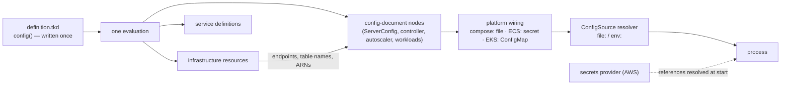

# Proposal 005 — The configuration model: documents, resolution, and secrets

Decision trail: [001](./001-platform-framework-and-realizer.md) (framework/realizer) →
[002](./002-operator-configuration-surface.md) (operator surface) → [003](./003-rust-via-syn-deployment-definition.md) /
[004](./004-tkd-syn-interpreter.md) (the `.tkd` model). This proposal defines how every configuration
document in the system is produced, delivered, and loaded — and how secret material stays out of all
three. It supersedes the parts of `../design.md` (config taxonomy item 4) and 002 (§5.3, the writeback
bridge) listed in [§8](#8-deltas-to-the-standing-contract).

Two standing inputs shape it: [015-configuration](../../../../docs/architecture/015-configuration.md)
(knobs trend toward zero) and 002's classification of every value (category × tier × exposure ×
lifecycle). AWS is the first-class provider throughout.

## 1. Purpose and scope

The idea in one breath: **configuration is written in one place — the deployment definition — and
flows from there to everything that needs a value: infrastructure, services, and every process's
config file.**

That covers *all* configuration:

- the definition's own operator surface (`config()`);
- the server's document (`TokeiraConfig` / `tokeirad.toml`);
- the sibling process documents (`ControllerProcessConfig`, `AutoscalerServiceConfig`);
- workload configuration (Alloy, Grafana provisioning, Mimir/Loki);
- secret material referenced by any of the above.

The proposal adds three pieces — **kinds that render each document**, **platform wiring that carries
the bytes**, and **one shared way for processes to load them** — plus a secrets seam, each grounded in
exemplars for compose, ECS, and EKS.

## 2. The configuration inventory

Every configuration document, its schema, and who reads it. Nothing else on disk is configuration.

| Document | Schema | Read by | Under this model |
|---|---|---|---|
| `definition.tkd` — `config()` | per-platform config structs, admitted via serde | the bound `tkp` | **The one document operators edit.** Revisioned, diffed, `#[require]`/`#[create]`-guarded. |
| `tokeirad.toml` | `TokeiraConfig` (`crates/tokeira-config`) | `tokeirad` | Rendered by the definition's ServerConfig node; the copy in the deployment dir is a printout for inspection. |
| controller document | `ControllerProcessConfig` | `tokeira-controller` | Rendered the same way (its own node); today it is a hand-fed file. |
| autoscaler document | `AutoscalerServiceConfig` | `tokeira-autoscaler` | Rendered the same way. |
| workload configs | per-tool (Alloy river, Grafana provisioning, Mimir/Loki YAML) | sidecars / observability stack | Already rendered from the definition today; unchanged except where the files travel (§7). |
| secret material | provider-held values | any of the above, at start | **Referenced, never embedded.** See [§6](#6-secrets). |

Explicitly **not** configuration (identity and state, per `../design.md`): `metadata.json`, the
ambient `Cx`, the deployment state envelope, engine `state/`, and every generated artifact — those
are reproducible outputs, never sources. The legacy `deployment.toml` retires with the in-process
platform route. The conformance override bridge (`--features conformance`) is a test surface, out of
scope here.

## 3. The model



Three steps, three owners:

1. **Render** — the definition evaluates once; each config-document node produces one process's
   document from `cfg` plus the identities of the infrastructure it depends on. Platform code.
2. **Carry** — the platform's wiring moves the rendered bytes to the process. Platform code.
3. **Load** — the process reads its document through one shared locator. Server code
   (`tokeira-config`), identical everywhere.

What this buys, concretely:

- **Values agree because they are the same value.** The `cfg` expression that sets the rendered
  `grpc_addr` also sets the service's port; the `cluster_name` that reaches `tokeirad` also reaches
  the controller and autoscaler. A service publishing a port nothing listens on, or two binaries
  deriving different coordination-table names, becomes impossible to write.
- **One set of guarantees.** Because everything flows from `config()`, revisions, diffs, `#[require]`
  checks, and `#[create]`/retarget protection cover server configuration exactly as they cover
  deployment configuration. Every config change is a reviewed `plan → apply`.
- **The 015 classes land in one place.** Identity is declared once and injected everywhere; policy
  and capacity are `config()` intent rendered into the documents; an emergency override is a
  one-line definition edit — which makes every break-glass action a revisioned, revertible record of
  the incident.

The boundary rule from 002 §5.3 survives, sharpened: **`config()` never repeats a server field as a
deployment knob.** Server intent enters through its own overlay section (§4); wiring values appear in
neither surface; identities are injected, not typed in.

## 4. Rendering — config-document nodes

A config-document node is an ordinary resource in the definition whose job is to produce one
process's configuration document. The reference is the **ServerConfig node**:

- **Any field the schema has, the definition can set.** The kind decodes through `TokeiraConfig`'s
  own serde (every field optional, unknown fields rejected) and lays the result over
  `TokeiraConfig::default()`. New knobs need no engine change; a misspelled field fails at
  `definition check`. The overlay/render helper lives in `tokeira-config` — plain serde/toml, no new
  dependencies.
- **The engine owns the kind; the platform owns the transport.** A definition says two things about
  server config: this document exists, and these services read it. For that to work everywhere,
  `ServerConfig` (and the controller/autoscaler document kinds beside it) must be words every
  platform understands, so they join the engine's shared kind set in `tokeira-kinds` — and
  `ServerConfig` moves out of the compose provider's export, where only platforms that wire compose
  could use it (ECS never will; `verify_wiring` would refuse the definition). How the rendered bytes
  then reach each process is the platform's job, worked out from the dependency edge the author
  already drew: compose mounts the file, ECS injects a secret, EKS mounts a ConfigMap. The author
  never writes that part — transport is mechanics, per 002 §7.3.
- **Wiring values are computed, not typed in.** Storage mode, region, `cluster_name`, bind
  addresses, and placement counts are derived from `cfg` and `cx` — per 002 §7.3, ports and derived
  names are never operator fields. What stays a knob is genuine exposure the platform has to offer
  (a published host port, an ALB listener).
- **Provider facts arrive when they exist.** The node depends on the resources whose identities it
  embeds (the DSQL cluster, the coordination tables) and reads their committed state during apply.
  No patching files after the fact: the ordering *is* the dependency graph.
- **At create, the same render runs with the provider facts left blank.** They are `Option` fields
  in the schema. That blank-mode render, invoked as `tkp config seed`, is what writes the initial
  document at `tkr deployment create` — same code, no provider access.
- **The file on disk is a printout, not a second source.** The node writes `tokeirad.toml` into the
  deployment dir so operators can read it (`tkr config show`), schema tooling can use it, and
  revisions can retain it. Editing it changes nothing; the definition does.

The controller and autoscaler documents follow the identical pattern with their own schemas — which
is why their `cluster_name`-derived table names can never drift from `tokeirad`'s. Workload configs
(Alloy, Grafana, Mimir/Loki) already render from the definition today and are unchanged except for
where the files travel (§7).

One obligation completes the render step: **every consumer of a document records that document's
fingerprint in its own desired state** (compose: a digest env var on the service; ECS: the digest and
pinned secret version in the task definition; EKS: a checksum annotation). A config change therefore
always shows up in the plan of the thing that reads it, and converges by ordinary apply.

## 5. Loading — the `ConfigSource` resolver

One locator grammar, owned by `tokeira-config`, used by **every** Tokeira binary for **every**
document. The resolver produces bytes; each binary parses its own schema.

| Locator | Meaning |
|---|---|
| `/etc/tokeira/tokeirad.toml` (bare) | A file path — today's behavior, fully compatible |
| `file:<path>` | Same, spelled out |
| `env:<VAR>` | The document is the *content* of environment variable `VAR` |

The rules:

- `--config` and the binary's config env var (`TOKEIRA_CONFIG` for `tokeirad`) both accept a
  locator. Precedence is unchanged: flag, then env var, then built-in defaults.
- Naming a source selects it; a named source that fails is a fatal error that repeats the locator.
  An unknown scheme is fatal and lists the schemes that exist. There is no silent fall-through to
  defaults.
- Every source goes through the same pipeline: parse → defaults → validate. The per-node placement
  overrides (`TOKEIRA_NODE_HOST`/`PORT`) still apply after load. `--dump-config` reports which
  locator won and what the effective document is.
- **The resolver never fetches over the network.** Fetching would pull AWS SDKs into a crate almost
  everything depends on, and would make every process start with a network call. Carrying bytes is
  the platform's job — the ECS agent and the kubelet already do it, and report failures better than
  we would. If a platform one day genuinely needs a fetching scheme, it is one new locator variant.

## 6. Secrets

`tokeirad.toml` contains **no secret material today** — DSQL and DynamoDB authenticate through IAM,
and that is the standing preference: **identity over stored credentials, wherever AWS offers it.**
The secrets machinery exists for the rest: the Grafana admin credential (the live case), TLS
material, and third-party credentials to come.

### Principles

1. **Secret values never enter the configuration path.** Not the definition, not a rendered
   document — and therefore never a revision, a diff, a plan, or an explanation. Configuration
   carries **references**; the design makes a leaked value structurally impossible rather than
   merely discouraged.
2. **Generated, not authored** (002 §7.4). Where Tokeira owns a credential (Grafana admin), the
   platform provisions a `SecretsManagerSecret` with a generated value; the operator surface is at
   most a bring-your-own reference. A plaintext default never round-trips through a config file.
3. **Resolution happens at process start; rotation is a restart.** Nothing re-reads secrets live.
   Rotating a secret means a rolling restart — boring on purpose.

### `SecretRef` — a locator for one value

The same locator idea as §5, at field granularity. A secret-typed schema field (`SecretRef` in
`tokeira-config`) is written as a string:

| Locator | Where the value comes from |
|---|---|
| `env:<VAR>` | The process environment (injected by the platform at start; no provider call) |
| `aws-sm:<arn-or-name>` | AWS Secrets Manager, current version at start |
| `aws-ssm:<parameter-name>` | AWS SSM Parameter Store (SecureString) |

References resolve in-process after the document loads, through a `SecretsProvider` seam: the trait
sits beside `SecretRef` in `tokeira-config`; the AWS implementation lives in the small
`tokeira-secrets` crate so `tokeira-config` never carries an SDK. `env:` needs no provider at all.
Resolved values are wrapped in a `Secret<T>` type that refuses to print, log, or serialize — the
taint rules from the retired declared-provider design (proposals `HISTORY.md`), now attached to the
schema.

**The provider itself never authenticates with a secret.** It uses ambient identity — task role on
ECS, pod identity on EKS, the operator's credentials on compose — scoped to exactly the referenced
secrets.

### Two different jobs a secret store does — keep them apart

| Job | What moves | When it changes |
|---|---|---|
| **Carrying a config document** (ECS delivery, §7) | The rendered document — protected in transit, not itself secret | The task definition pins the version: a config change is a visible, planned redeploy |
| **Holding a referenced value** (`SecretRef`) | Actual secret material | Processes read the current version at start: rotation needs a rolling restart, no definition change |

### Secrets in the definition

The definition declares secrets as resources (`SecretsManagerSecret`: generated or adopted) and
passes on *references* — into a document field (rendered as the locator string) or into a service's
native injection (ECS `secrets.valueFrom`). IAM follows the wiring: whoever reads a secret gets
`secretsmanager:GetSecretValue` / `ssm:GetParameter` on exactly those ARNs, and nothing else.

## 7. Carrying the bytes — the three platforms

Rendering and loading are identical everywhere; only the middle differs.

| | compose | ECS | EKS |
|---|---|---|---|
| Channel | rendered file in the deployment dir, bind-mounted read-only | rendered bytes in a `SecretsManagerSecret`, injected by the ECS agent | rendered bytes in a ConfigMap, mounted by the kubelet |
| Load | `TOKEIRA_CONFIG=/etc/tokeira/tokeirad.toml` | `TOKEIRA_CONFIG=env:TOKEIRA_CONFIG_CONTENT`; `secrets.valueFrom` pinned to the version | `TOKEIRA_CONFIG=/etc/tokeira/tokeirad.toml` |
| Change shows up as | digest env on the service | digest + pinned version in the task definition | checksum annotation on the pod template |
| `SecretRef` values | provider with operator credentials | provider via task role; native `valueFrom` for plain env secrets | provider via pod identity — no copies into K8s `Secret` objects |

The exemplars use **target vocabulary**: compose names are current source; the ECS and EKS kinds are
what those migrations bind. Illustrative, per the
[definition patterns](../../../../docs/provisioning/deployment-definition-patterns.md) caveat.

### 7.1 Compose

```rust
struct Compose {
    #[create]
    storage: Storage,
    tokeirad: Tokeirad,            // image, replicas, published (host) ports
    server: ServerOverlay,         // policy / capacity intent — TokeiraConfig-shaped
    grafana_admin: Option<String>, // None => generated; Some("aws-sm:…") => bring-your-own
}

fn deployment(cfg: Compose, cx: Context) -> Deployment {
    let d = Deployment::new(&["default"]);
    let state = d.module("local_state", vec![]);

    let mut server_deps = vec![];
    if let Storage::Dsql(s) = &cfg.storage {
        let dsql = d.module("dsql", vec![state]);
        let cluster = dsql.resource("cluster", DsqlCluster { region: s.region.clone(), /* … */ });
        let rate = dsql.resource("rate_limiter", DynamoDbTable { /* {cluster_name}-dsql-rate-limiter */ });
        let lease = dsql.resource("conn_lease", DynamoDbTable { /* {cluster_name}-dsql-conn-lease */ });
        server_deps = vec![cluster, rate, lease];
    }

    let runtime = d.module("runtime", vec![state]);
    // Renders tokeirad.toml: defaults, then values computed from cfg and cx,
    // then cfg.server on top. The dsql endpoint and table names are read from
    // the cluster and table state during apply.
    let server_config = runtime.resource(
        "server_config",
        ServerConfig { overlay: cfg.server.clone(), ..ServerConfig::EMPTY },
        server_deps,
    );
    runtime.resource(
        "tokeirad",
        Service {
            image: cfg.tokeirad.image.clone(),
            publish: vec![cfg.tokeirad.grpc_port, cfg.tokeirad.metrics_port],
            ..Service::EMPTY
        },
        vec![server_config],   // the mount, TOKEIRA_CONFIG, and digest env come from this edge
    );
    d
}
```

The `d.writeback(…)` declarations disappear: the dsql-to-document flow *is* the `server_config`
dependency edge. An emergency override is one edited line in `cfg.server` and a `tkr deploy apply` —
one revision, one restart, and the incident is in the history.

### 7.2 ECS

```rust
struct Ecs {
    #[create] project_name: String,
    #[create] environment: String,
    #[create] region: String,
    capacity: Capacity,
    server: ServerOverlay,
}
```

`deployment()` has the same shape as compose plus the ECS module chain
(`remote-state → networking → dsql → cluster → observability → services`). Everything that differs
is transport, and none of it is authored:

- The rendered bytes of `server_config` travel as a `SecretsManagerSecret` — protected and
  versioned — whose committed **version-id** is a declared output.
- Each task definition that reads the document depends on the secret, records the content digest,
  injects `TOKEIRA_CONFIG_CONTENT` via `secrets.valueFrom` **pinned to that version**, and sets
  `TOKEIRA_CONFIG=env:TOKEIRA_CONFIG_CONTENT`. Config change → new version → new task-definition
  revision → service convergence: the ordinary plan/apply path end to end.
- Controller and autoscaler tasks get their own rendered documents the same way — same `cfg`, so
  their `cluster_name` and table names cannot differ from `tokeirad`'s.
- IAM follows the wiring: execution roles may read exactly the delivery secrets they inject; task
  roles get the DSQL/DynamoDB grants their document implies, plus provider grants for any
  `SecretRef` it carries.

### 7.3 EKS

Same definition shape. The rendered document becomes a ConfigMap; pod templates mount it, set the
file locator, and carry a checksum annotation so a content change rolls the Deployment. `SecretRef`
values resolve in-process through the AWS provider under **pod identity** — deliberately no
ExternalSecrets or CSI sync layer: the secret store *is* Secrets Manager, and copies of secret
material into cluster objects are avoided rather than managed.

## 8. Deltas to the standing contract

What this proposal changes, stated flatly:

1. `../design.md` config-taxonomy item 4: `tokeirad.toml` stops being a file the operator edits and
   writeback patches; it becomes a printout of the definition. Server intent lives in `config()`
   (the overlay section); hand-editing the rendered file is not a supported surface for
   definition-backed platforms. The ownership tables in
   `docs/provisioning/deployment-configuration.md` change to match.
2. 002 §5.3's writeback bridge: replaced by the node's dependency edges. The `server-config`
   category now reads "reaches the server via the rendered document". `d.writeback` narrows to a
   legacy bridge (compose retires it at its ServerConfig rewrite; new platforms declare none), and
   design Property 9 is restated over node rendering.
3. Compose's current `ServerConfig` semantics (operator-authored file, refuse if missing, never
   diff) are replaced by the rendering node.
4. `tkp config seed` is defined as "run the ServerConfig render with the provider facts blank",
   replacing `prototypical_server_config`.
5. New shared machinery: the `ConfigSource` resolver and the overlay/render helper in
   `tokeira-config`; `SecretRef` and the `SecretsProvider` trait there, with the AWS implementation
   in the new `tokeira-secrets` crate (approved; a new workspace member).
6. Controller and autoscaler adopt the resolver and gain rendered documents (today they hand-load
   bespoke files via the generic loader).
7. The kind library: `ServerConfig` and the other config-document kinds join the engine's shared
   kind set (moving out of the compose provider export) so every platform can use them; how a
   platform carries the rendered bytes to its processes is wiring it generates itself, never
   something a definition declares.

Judgments deliberately left open:

| Question | Recommendation |
|---|---|
| Full definition authority vs a layered operator-editable base file | **Full authority** — one document to edit; layering means two owners and merge rules |
| EKS secrets: in-process provider vs ExternalSecrets/CSI | In-process provider under pod identity (no synced copies) |
| Break-glass ergonomics | Through the definition (revisioned); revisit only if incident latency proves it too slow |

## Further reading

- [015-configuration](../../../../docs/architecture/015-configuration.md) — the philosophy this model serves.
- [002 — operator configuration surface](./002-operator-configuration-surface.md) — categories, tiers, and the knob inventory.
- [Deployment definitions](../../../../docs/provisioning/deployment-definitions.md) · [patterns](../../../../docs/provisioning/deployment-definition-patterns.md) — the language this model rides on.
- [The provisioner](../../../../docs/provisioning/provisioner.md) · [`tkr` and `tkp`](../../../../docs/provisioning/tkr-and-tkp.md) — lifecycle, revisions, and delivery hosts.
