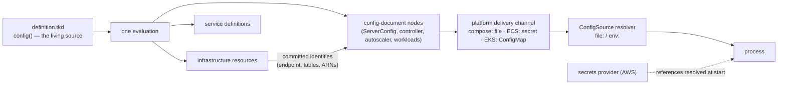

# Proposal 005 — The configuration model: documents, resolution, and secrets

Decision trail: [001](./001-platform-framework-and-realizer.md) (framework/realizer) →
[002](./002-operator-configuration-surface.md) (operator surface) → [003](./003-rust-via-syn-deployment-definition.md) /
[004](./004-tkd-syn-interpreter.md) (the `.tkd` model). This proposal defines how **every configuration
document in the system** is produced, delivered, acquired, and — where secret material is involved —
protected. It supersedes the parts of `../design.md` (config taxonomy item 4) and 002 (§5.3, the
writeback bridge) noted in [§8](#8-deltas-to-the-standing-contract).

Philosophy inputs: [015-configuration](../../../../docs/architecture/015-configuration.md) (knobs trend
toward zero; four operator-visible classes) and 002's classification framework (category × tier ×
exposure × lifecycle). AWS is the first-class provider throughout.

## 1. Purpose and scope

One sentence: **the deployment definition is the living configuration document — it resolves
configuration once and injects it everywhere a value is consumed: infrastructure resources, service
definitions, and every process's rendered runtime config.**

This proposal covers *all* configuration:

- the definition's own operator surface (`config()`);
- the server runtime document (`TokeiraConfig` / `tokeirad.toml`);
- the sibling process documents (`ControllerProcessConfig`, `AutoscalerServiceConfig`);
- workload configuration artifacts (Alloy, Grafana provisioning, Mimir/Loki);
- secret material referenced by any of the above.

It defines three mechanisms — **config-document nodes** (production), platform **delivery channels**,
and the **`ConfigSource` resolver** (acquisition) — plus a **secrets provider** seam, and grounds each in
exemplars for compose, ECS, and EKS.

## 2. The configuration inventory

Every configuration document, its owner, and its consumer. Nothing else on disk is configuration.

| Document | Schema | Consumer | Under this model |
|---|---|---|---|
| `definition.tkd` — `config()` | per-platform config structs, admitted via serde | the bound `tkp` (interpretation) | **The one operator-edited source.** Revisioned, diffed, `#[require]`/`#[create]`-guarded. |
| `tokeirad.toml` | `TokeiraConfig` (`crates/tokeira-config`) | `tokeirad` | **Rendered** by the definition's ServerConfig node; persisted in the deployment dir as the inspectable projection. |
| controller document | `ControllerProcessConfig` | `tokeira-controller` | Rendered the same way (its own node); today it is a hand-fed file. |
| autoscaler document | `AutoscalerServiceConfig` | `tokeira-autoscaler` | Rendered the same way. |
| workload configs | per-tool (Alloy river, Grafana provisioning, Mimir/Loki YAML) | sidecars / observability stack | Already rendered from the definition today (compose `config/` tree; ECS SSM/S3). Same production stage, different templates. |
| secret material | provider-held values | any of the above, at start | **Referenced, never embedded.** See [§6](#6-secrets). |

Explicitly **not** configuration (identity and state, per `../design.md`): `metadata.json` (CLI
registry), the ambient `Cx`, the deployment state envelope, engine `state/`, and every generated
artifact (`docker-compose.yml`, rendered manifests) — derived and reproducible, never a source.
The legacy `deployment.toml` is retired with the in-process platform route. The conformance
dynamic-config override bridge (`--features conformance`) is a test surface, out of scope here.

## 3. The model



Three stages, three owners:

1. **Production** — the definition evaluates once; config-document nodes render each process's document
   from `cfg` plus committed infrastructure identities. Platform-owned.
2. **Delivery** — the platform's channel carries the rendered bytes to the process boundary. Platform-owned.
3. **Acquisition** — the process resolves its document through one shared locator contract. Server-owned
   (`tokeira-config`), identical across platforms and binaries.

What the model buys, concretely:

- **Agreement by construction.** The same `cfg` expression feeds the rendered `grpc_addr` and the
  service's port mapping; the same `cluster_name` reaches `tokeirad`, the controller, and the
  autoscaler. The class of defect where a service publishes a port nothing binds, or two binaries
  derive different coordination-table names, becomes unrepresentable.
- **Uniform guarantees.** Because all configuration flows from `config()`, revisions, diffs,
  `#[require]` admission, and `#[create]`/retarget protection cover *server* configuration exactly as
  they cover deployment configuration. A config change is always a reviewed `plan → apply`.
- **The 015 classes land in one place.** Bootstrap/identity is *derived* (declared once, injected
  everywhere); security/policy and the capacity envelope are `config()` intent rendered into the
  documents; emergency override is a definition edit — which makes every break-glass action a
  revisioned, diffable, revertible record of the incident.

The boundary rule from 002 §5.3 survives in sharpened form: **`config()` never duplicates a server
field as a deployment knob.** Server intent enters through a dedicated overlay section (§4); mechanics
appear in neither surface; identities are injected, not authored.

## 4. Production — config-document nodes

A config-document node is an ordinary resource in the definition whose realization renders one
process's configuration document. The reference shape is the **ServerConfig node**:

- **Typed overlay, full surface, zero vocabulary tax.** The kind's field decode reuses
  `TokeiraConfig`'s own serde (every field optional, `deny_unknown_fields` doing the checking) and
  overlays onto `TokeiraConfig::default()`. Any knob the schema declares is reachable from the
  definition without engine changes; a misspelled field fails admission. The overlay/render helper
  (partial-document-over-defaults + serialization) lives in `tokeira-config` — pure serde/toml, no new
  dependencies.
- **Mechanics are computed, not authored.** Storage mode, region, `cluster_name`, bind addresses, and
  placement counts are rendered from `cfg` and `cx` by the platform's node construction — per 002 §7.3,
  ports and derived names are mechanics, never operator fields. Host *exposure* (a published port, an
  ALB listener) remains a platform knob where the platform genuinely has one.
- **Identities are injected at realize time.** The node declares dependencies on the resources whose
  identities it embeds (DSQL cluster, coordination tables, roles) and reads their committed state
  during its own realization — the established defer-to-realize pattern. No post-apply file patching:
  ordering is the dependency graph, not a convention.
- **Unresolved mode at create.** `tkp config seed` realizes the node with provider-derived fields unset
  (they are `Option` in the schema) to produce the initial document at `tkr deployment create`. The
  same rendering code, no provider access, ReadOnly launch class.
- **The rendered file is a projection.** The node persists `tokeirad.toml` in the deployment directory
  for inspection (`tkr config show`), schema tooling, and revision retention — derived output, not a
  second authority.

The controller and autoscaler documents follow the identical pattern with their own schemas — which is
what makes their `cluster_name`-derived coordination-table coupling correct by construction rather than
by operator discipline. Workload configs (Alloy, Grafana provisioning, Mimir/Loki) are the same stage
with tool-specific templates; they already work this way and are unchanged by this proposal except for
where their rendered artifacts travel (§7).

**Change coupling** is a production-stage obligation: every consumer of a rendered document carries that
document's content digest in its own desired state (compose: digest env in the service manifest; ECS:
digest + pinned secret version in the task-definition manifest; EKS: checksum annotation). A config
change is therefore always plan-visible at the consumer and converges by ordinary reconciliation.

## 5. Acquisition — the `ConfigSource` resolver

One locator grammar, owned by `tokeira-config`, used by **every** Tokeira binary for **every**
document. The resolver produces bytes; each binary parses its own schema.

| Locator | Meaning |
|---|---|
| `/etc/tokeira/tokeirad.toml` (bare) | Filesystem path — today's behavior, full back-compat |
| `file:<path>` | Same, explicit |
| `env:<VAR>` | The document is the *content* of environment variable `VAR` |

Semantics:

- Accepted uniformly by `--config` and the binary's config env var (`TOKEIRA_CONFIG` for `tokeirad`).
  Precedence unchanged: flag > env var > built-in defaults.
- Source *presence* selects; source *failure* is fatal, naming the locator. An unknown scheme is fatal,
  naming the supported schemes. No silent fall-through to defaults.
- One pipeline for every source: parse → defaults → validate. Placement overrides
  (`TOKEIRA_NODE_HOST`/`PORT`) still apply after load — per-node placement facts, not document sources.
  `--dump-config` reports the resolved locator and effective document.
- **Deliberately no network schemes.** Fetching would pull provider SDKs into `tokeira-config` (a
  near-universal dependency) and move delivery into every process's startup path. Acquisition over the
  network is the delivery channel's job (ECS agent, kubelet, bind mount), which already reports its
  failures well. A future scheme is one enum variant — it can earn its place when a platform needs it.

## 6. Secrets

`tokeirad.toml` today contains **no secret material** — DSQL and DynamoDB authenticate through IAM, and
that is the standing preference: **identity over stored credentials, always, wherever AWS offers it.**
The secrets model exists for the residue: the Grafana admin credential (the live case), TLS material
references (015 lists them under bootstrap), and third-party credentials to come.

### Principles

1. **Values never enter the configuration path.** Not in `definition.tkd`, not in `config()`, not in a
   rendered document, and therefore never in revisions, diffs, plans, explanations, or engine state.
   The host-free/revisioned design makes this structural: a value in the source would be retained
   forever. Configuration carries **references**.
2. **Generated, not authored** (002 §7.4). Where Tokeira owns the credential (Grafana admin), the
   platform provisions a `SecretsManagerSecret` with a generated value; the operator surface is at most
   a BYO reference. A plaintext default never round-trips through a config file.
3. **Start-time resolution; rotation is a restart.** References resolve when a process starts (or when
   the platform injects at task start). Live re-resolution is out of scope; rotating a secret is a
   rolling restart, matching the correctness-over-cleverness posture.

### `SecretRef` — the value-level locator

Symmetric with `ConfigSource`, at field granularity. A secret-typed schema field (`SecretRef` in
`tokeira-config`) deserializes from a locator string:

| Locator | Provider |
|---|---|
| `env:<VAR>` | Process environment (delivery-boundary injection; no provider call) |
| `aws-sm:<arn-or-name>` | AWS Secrets Manager, `AWSCURRENT` at resolution time |
| `aws-ssm:<parameter-name>` | AWS SSM Parameter Store (SecureString) |

Resolution happens post-acquisition, in-process, through a `SecretsProvider` seam: the trait lives
beside `SecretRef`; the AWS implementation (Secrets Manager + SSM, one small crate so `tokeira-config`
stays SDK-free) is constructed by the binary and handed to config resolution. `env:` needs no provider.
Resolved values are taint-typed (`Secret<T>`: no `Debug`/`Display`/serialize leakage) — reviving the
`Secret<T>` rules from the retired declared-provider design (proposals `HISTORY.md`), now attached to
the schema rather than a context block.

**Credentials for the provider itself are always ambient identity** — task role (ECS), pod identity
(EKS), operator credentials (compose) — scoped to exactly the referenced secrets. A secret is never
used to fetch a secret.

### Two distinct secret flows — do not conflate them

| Flow | What moves | Coupling |
|---|---|---|
| **Delivery via a secret channel** (ECS whole-document delivery, §7) | The rendered config document — protected in transit/storage, not itself secret material | **Pinned version** in the task definition: a content change is a plan-visible redeploy |
| **Referenced secret values** (`SecretRef`) | Actual secret material | `AWSCURRENT` at start: rotation reaches processes on the next (rolling) restart, with no definition change |

### Provisioned secrets in the definition

The definition declares secrets as resources (`SecretsManagerSecret`: generated or adopted) and wires
*references* onward — into a config-document node field (rendered as the locator string) or into a
service's native injection (ECS `secrets.valueFrom`). IAM grants are mechanics derived from the wiring:
whichever role a consumer runs as receives `secretsmanager:GetSecretValue` / `ssm:GetParameter` on
exactly the referenced ARNs.

## 7. Delivery — the three platforms

The production and acquisition stages are identical everywhere; only the channel differs.

| | compose | ECS | EKS |
|---|---|---|---|
| Channel | rendered file in the deployment dir, bind-mounted `ro` | rendered bytes as a `SecretsManagerSecret`, injected by the agent | rendered bytes as a ConfigMap, mounted by the kubelet |
| Acquisition | `TOKEIRA_CONFIG=/etc/tokeira/tokeirad.toml` | `TOKEIRA_CONFIG=env:TOKEIRA_CONFIG_CONTENT`; `secrets.valueFrom` pinned to the version-id | `TOKEIRA_CONFIG=/etc/tokeira/tokeirad.toml` |
| Coupling | config digest env in the service manifest | digest + pinned version-id in the task-definition manifest | pod-template checksum annotation |
| Secrets (`SecretRef`) | provider with ambient operator credentials | provider via task role; native `valueFrom` for workload env | provider via pod identity — no K8s `Secret` sync layer |

The exemplars below use **target vocabulary**: compose names are current source; the ECS and EKS kinds
are what the respective migrations bind. Illustrative, per the
[definition patterns](../../../../docs/provisioning/deployment-definition-patterns.md) caveat.

### 7.1 Compose

```rust
struct Compose {
    #[create]
    storage: Storage,
    tokeirad: Tokeirad,            // image, replicas, published (host) ports
    server: ServerOverlay,         // policy / capacity intent — TokeiraConfig-shaped
    grafana_admin: Option<String>, // None => generated; Some("aws-sm:…") => BYO reference
}

fn deployment(cfg: Compose, cx: Context) -> Deployment {
    let d = Deployment::new(&["default"]);
    let state = d.module("local_state", vec![]);

    let mut server_deps = vec![];
    if let Storage::Dsql(s) = &cfg.storage {
        let dsql = d.module("dsql", vec![state]);
        let cluster = dsql.resource("cluster", DsqlCluster { region: s.region.clone(), /* … */ });
        let rate = dsql.resource("rate_limiter", DynamoDbTable { /* {cluster_name}-dsql-rate-limiter */ });
        let lease = dsql.resource("conn_lease", DynamoDbTable { /* {cluster_name}-dsql-conn-lease */ });
        server_deps = vec![cluster, rate, lease];
    }

    let runtime = d.module("runtime", vec![state]);
    // Renders tokeirad.toml: defaults ⊕ mechanics(cfg, cx) ⊕ cfg.server overlay,
    // ⊕ dsql identities read from dependency state at realize time.
    let server_config = runtime.resource(
        "server_config",
        ServerConfig { overlay: cfg.server.clone(), ..ServerConfig::EMPTY },
        server_deps,
    );
    runtime.resource(
        "tokeirad",
        Service {
            image: cfg.tokeirad.image.clone(),
            publish: vec![cfg.tokeirad.grpc_port, cfg.tokeirad.metrics_port],
            ..Service::EMPTY
        },
        vec![server_config],   // mount + TOKEIRA_CONFIG + digest env derive from this edge
    );
    d
}
```

The `d.writeback(…)` declarations disappear: the dsql→document flow is the `server_config` dependency
edge. Emergency override is `cfg.server` (e.g. an `emergency` field) → `tkr deploy apply` — one edited
line, one revision, one restart, and the incident is in the history.

### 7.2 ECS

```rust
struct Ecs {
    #[create] project_name: String,
    #[create] environment: String,
    #[create] region: String,
    capacity: Capacity,
    server: ServerOverlay,
}
```

`deployment()` has the same shape as compose plus the ECS module chain
(`remote-state → networking → dsql → cluster → observability → services`). The differences are all in
delivery, and all mechanics:

- The `server_config` node's rendered bytes become a `SecretsManagerSecret` resource (the channel —
  protected, versioned); its committed **version-id** is a declared output.
- Each consuming task definition depends on it, carries the content digest in its manifest, and injects
  `TOKEIRA_CONFIG_CONTENT` via `secrets.valueFrom` **pinned to that version-id**, with
  `TOKEIRA_CONFIG=env:TOKEIRA_CONFIG_CONTENT` in plain environment. Config change ⇒ new version ⇒ new
  task-definition revision ⇒ service convergence — the ordinary plan/apply path end to end.
- Controller and autoscaler tasks receive their own rendered documents through the same channel — same
  `cfg`, so `cluster_name` and the coordination-table names cannot diverge from `tokeirad`'s.
- IAM is derived: execution roles get `GetSecretValue` on exactly the delivery secrets they inject;
  task roles get the DSQL/DynamoDB grants their document implies, plus provider grants for any
  `SecretRef` the document carries.

### 7.3 EKS

Same definition shape. The `server_config` node renders into a ConfigMap manifest; pod templates mount
it and set the file locator; a checksum annotation on the pod template carries the digest so a content
change rolls the Deployment. `SecretRef` values resolve in-process through the AWS provider under **pod
identity** — deliberately no ExternalSecrets/CSI sync layer: AWS-first here means the secret store *is*
Secrets Manager, and copies of secret material into cluster objects are avoided rather than managed.

## 8. Deltas to the standing contract

What this proposal changes, stated flatly (rationale above; no history carried):

1. `../design.md` config-taxonomy item 4: `tokeirad.toml` moves from "seeded artifact the operator
   edits, patched by writeback" to "rendered projection of the definition". The operator's server
   intent lives in `config()` (the overlay section); hand-editing the rendered file is not a supported
   surface for definition-backed platforms. The file-ownership tables in
   `docs/provisioning/deployment-configuration.md` change accordingly.
2. 002 §5.3's writeback bridge: replaced by config-document node injection. The `server-config`
   category's routing note becomes "reaches the server via the rendered document". `d.writeback`
   narrows to a legacy bridge (compose retires it at its ServerConfig rewrite; new platforms declare
   none), and design Property 9 is restated over node rendering.
3. Compose's current `ServerConfig` node semantics (operator-authored file, refuse-if-missing, no-op
   diff) are replaced by the rendering node.
4. `tkp config seed` (Proposal-005 companion to the ECS migration direction) is defined as "realize the
   ServerConfig node in unresolved mode", subsuming `prototypical_server_config`.
5. New shared machinery: the `ConfigSource` resolver and the overlay/render helper in `tokeira-config`;
   `SecretRef` + `SecretsProvider` trait there, with the AWS provider in a new small crate
   (architectural: new crate + dependency, flagged per the change-classification table).
6. Controller and autoscaler adopt the resolver and gain rendered documents (they currently hand-load
   bespoke files via the generic loader).

Open judgments this document deliberately leaves to the operator:

| Question | Recommendation |
|---|---|
| Full definition authority vs a layered operator-editable base file | **Full authority** — one living document; layering reintroduces two owners and merge semantics |
| Where the AWS `SecretsProvider` implementation lives | New `tokeira-secrets` crate (small, SDK-bearing, consumed by the binaries) |
| EKS secrets: in-process provider vs ExternalSecrets/CSI | In-process provider under pod identity (no synced copies) |
| Break-glass ergonomics | Through the definition (revisioned); revisit only if incident latency proves unacceptable |

## Further reading

- [015-configuration](../../../../docs/architecture/015-configuration.md) — the philosophy this model serves.
- [002 — operator configuration surface](./002-operator-configuration-surface.md) — categories, tiers, and the knob inventory.
- [Deployment definitions](../../../../docs/provisioning/deployment-definitions.md) · [patterns](../../../../docs/provisioning/deployment-definition-patterns.md) — the language this model rides on.
- [The provisioner](../../../../docs/provisioning/provisioner.md) · [`tkr` and `tkp`](../../../../docs/provisioning/tkr-and-tkp.md) — lifecycle, revisions, and delivery hosts.
