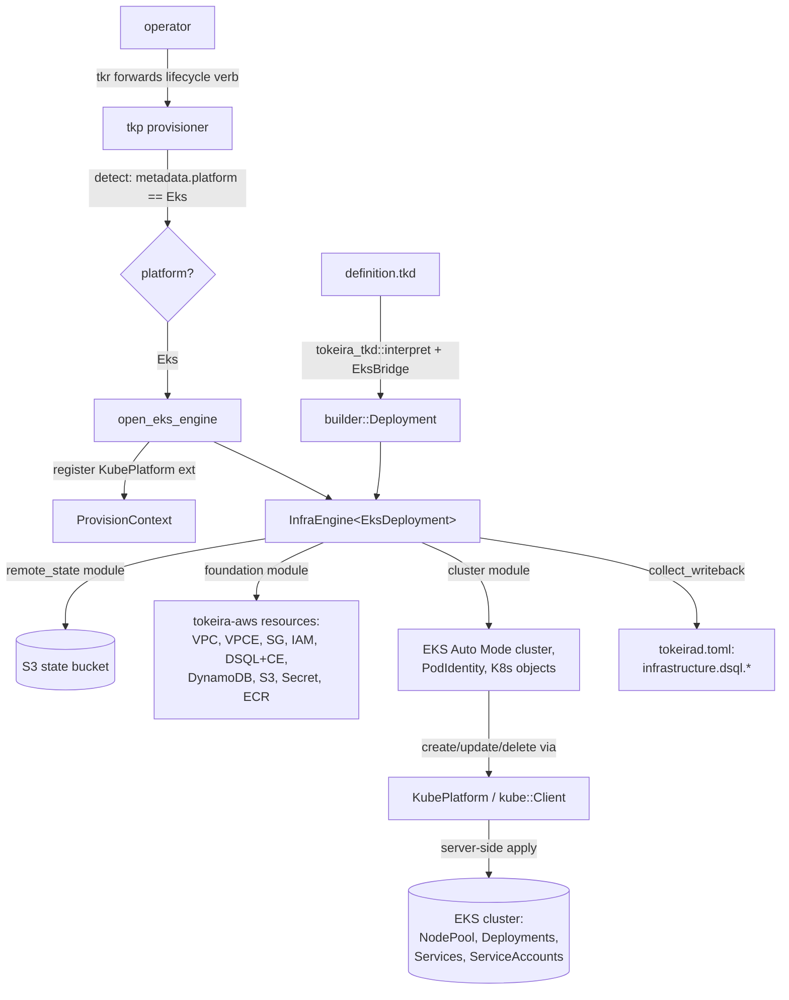

# Design Document

## Overview

`platforms/eks` provisions tokeira on AWS EKS with Aurora DSQL, authored in the `syn` deployment DSL and
driven by `tkp`. This design derives its wire/behaviour from four grounded sources: the tokeira framework
crates it targets (`tokeira-aws`, `tokeira-iac`, `tokeira-deploy-engine`, `tokeira-orchestrator`,
`tokeira-state`, `tokeira-provisioner`), the `platforms/compose-syn` `syn` platform it mirrors, the
`platforms/ecs` platform it is the Kubernetes sibling of, and the source EKS deployment workspace whose
mechanics (EKS Auto Mode, Karpenter, Pod Identity, DSQL PrivateLink, the Alloy-sidecar/arm64/downward-API
pod shape) are the structural template. Topology currency was verified 2026-07 (requirements
"Topology currency").

The work lands in three units, in dependency order:

1. **`crates/tokeira-tkd`** — the platform-agnostic `syn` interpreter, extracted from
   `platforms/compose-syn/src/interp/`, generic over a platform-supplied `HostBridge`. Prerequisite
   (Requirement 14); `platforms/compose-syn` is refactored onto it with fidelity preserved.
2. **`crates/tokeira-k8s`** — the live `kube` platform (`KubePlatform`) plus shared `k8s-openapi` manifest
   helpers (`standard_labels`, `build_node_pool`, the namespace `iac::Resource`). Analog of
   `tokeira-compose`.
3. **`platforms/eks`** — the `syn` surface (`config.rs`, `context.rs`, `builder.rs`, `kinds.rs`,
   `definition.tkd` + compiled `definition.rs` oracle, `adapter.rs`) plus the `EksBridge` (`HostBridge`
   impl) and the `k8s-openapi` manifest builders. Wired into `tkp`/`tkr` via `PlatformKind::Eks`.

Two ground-truth resolutions shape the design:

- **Membership is controller-based, not gossip.** Runtime nodes register with the controller over the
  `runtime_membership` gRPC stream (`tokeira-controller/src/connect_service.rs`); the controller holds
  `LiveMembership` (`tokeira-controller/src/membership.rs`). There is **no ringpop gossip ring**, so **no
  headless Services** are needed — services reach the controller via a ClusterIP DNS name, matching
  `platforms/ecs` (which exposes only gRPC + metrics, no membership port).
- **The interpreter core need never match the platform's host enum.** It only *routes* host operations, so
  the extraction makes the core generic over an opaque `H` behind `HostBridge`; the closed `HostObj` enum
  and method tables stay platform-side. No `Box<dyn Any>`, preserving the no-reflection stance.

## Dependencies and Non-Goals

**Owns:** `platforms/eks`, `crates/tokeira-tkd`, `crates/tokeira-k8s`, the `platforms/compose-syn` refactor
onto `tokeira-tkd`, and the `tkp`/`tkr` wiring for EKS.

**Depends on (unchanged):** `tokeira-aws` resource implementations; `tokeira-iac`/`-deploy-engine`/
`-orchestrator`/`-state` framework; the `platform-provisioner-binary` lifecycle (binding gate, integrity,
locks, upgrade/rollback) — consumed, not redefined; the `platform-config-dsl` (003/004) interpreter
*design* — extracted, not redesigned.

**Non-goals:** the `syn` interpreter redesign (this work extracts it, not redesigns it); the provisioner
lifecycle mechanics (binding gate, integrity, upgrade/rollback, locks — consumed, not redefined) and
binary self-update / release signing (deferred by `platform-provisioner-binary`). The first milestone
deploys tokeira's core service topology plus the observability stack; additional service sets are
follow-on.

## Architecture

`tkp` binds a deployment, interprets its `.tkd` config revision through the shared interpreter, and drives
the `InfraEngine`. The `EksBridge` realizes the interpreted deployment to `iac::Resource`s: AWS resources
(reused from `tokeira-aws`) and Kubernetes objects (built with `k8s-openapi`, applied live through a
`KubePlatform` handle `tkp` registers on the provision context — exactly as compose-syn registers
`ComposePlatform`).



Control plane vs data path: the `InfraEngine` plan/apply/destroy is the control path (`tkp` verbs, gated
and locked by the provisioner). The `KubePlatform`/AWS-SDK calls inside resource lifecycle methods are the
mutation path. Day-2 `scale`/`logs`/`port-forward` (the `Ops` trait) use the same `KubePlatform`.

**Apply-path decision (single InfraEngine path).** The tokeira service K8s manifests are modelled as
`iac::Resource` kinds (in the `cluster` module), whose `create/update/delete/describe` call the registered
`KubePlatform`. This mirrors how compose-syn models a container as a `compose_service` infra resource
applied via `ComposePlatform`, and keeps every mutation on `tkp`'s single `InfraEngine` path. The
`deploy_engine::Service`/`DeployEngine` path is **not** used for EKS (consistent with compose-syn).

## Components and Interfaces

### 1. `crates/tokeira-tkd` — the generic interpreter

The five passes move verbatim in behaviour; the host-typed parts become a trait. The core treats a host
value as opaque and routes every host operation through `HostBridge`.

```rust
/// The seam each `syn` platform implements. The interpreter core names none of a
/// platform's concrete kinds; it holds `Value<Self::Host>` opaquely and calls back
/// here for construction, dispatch, and context reads.
pub trait HostBridge {
    /// The platform's opaque host handle (its closed `HostObj` enum).
    type Host: Clone + std::fmt::Debug;
    /// The platform's engine-injected context (compose `Cx`, eks `Cx`, …).
    type Cx;
    /// The realized deployment `interpret` returns (the platform's builder type).
    type Output;

    /// Is `name` an author kind (vs a `.tkd`-defined config struct)?
    fn is_kind(&self, name: &str) -> bool;
    /// The interpreter image of `<Kind>::EMPTY` for `..EMPTY` spread, if any.
    fn kind_defaults(&self, name: &str) -> Option<FieldMap<Self::Host>>;
    /// Build a kind from its evaluated field map (consumes the map; unknown keys error).
    fn construct_kind(&self, name: &str, fields: FieldMap<Self::Host>, cx: &Self::Cx)
        -> Result<Self::Host, EvalError>;
    /// Associated-fn call, e.g. `Deployment::new`.
    fn assoc(&self, path: &str, args: Vec<Value<Self::Host>>, cx: &Self::Cx)
        -> Result<Self::Host, EvalError>;
    /// Method dispatch on a host receiver (`d.module`, `r.output`, `cx.state`, …).
    fn call_method(&self, recv: &Self::Host, method: &str, args: Vec<Value<Self::Host>>, cx: &Self::Cx)
        -> Result<Value<Self::Host>, EvalError>;
    /// Check-time validation: is `name` a method some host type exposes?
    fn knows_method(&self, name: &str) -> bool;
    /// Read a whitelisted field of the injected context (`cx.project_name`).
    fn cx_field(&self, cx: &Self::Cx, field: &str) -> Result<Value<Self::Host>, EvalError>;
    /// Seed the top-level `cx` binding as a host value.
    fn cx_host(&self, cx: &Self::Cx) -> Self::Host;
    /// Unwrap the `deployment()` return host into the realized deployment.
    fn finish(&self, ret: Self::Host) -> Result<Self::Output, EvalError>;
}

/// Generic over the host type; identical variants to today minus the host-typed ones.
pub enum Value<H> {
    Unit, Bool(bool), Int(i128), Str(String),
    Vec(Vec<Value<H>>), Tuple(Vec<Value<H>>), Opt(Option<Box<Value<H>>>),
    Struct { ty: String, fields: FieldMap<H> },
    Enum { path: EnumPath, variant: String, body: VariantBody<H> },
    Host(H),                       // opaque; never matched by the core
}
pub type FieldMap<H> = std::collections::BTreeMap<String, Value<H>>;

pub fn interpret<B: HostBridge>(src: &str, bridge: &B, cx: &B::Cx)
    -> Result<(B::Output, Value<B::Host>), Diagnostics>;
pub fn validate<B: HostBridge>(src: &str, bridge: &B) -> Result<(), Diagnostics>;
pub fn retarget_check(src: &str, old: &Value<()>, new: &Value<()>) -> Result<(), Vec<String>>;
```

- `schema.rs` and `subset.rs` operate on the `syn` AST + `TypeTable` and are **not** generic over `H`
  (`subset` queries `bridge.knows_method`). `eval.rs` and `admission.rs` become generic over `B`.
- Host-typed coercions (`as_host_module`, `take_boxed_kind`, `take_vols`, …) and the `HostObj`/`HostKind`
  enums move **platform-side** (they name platform types). `tokeira-tkd` keeps only the host-free
  `FieldMapExt` scalar/collection takers (`take_str`/`take_bool`/`take_u16`/`take_u32`/`take_opt_str`/
  `take_vec_str`/`expect_empty`).
- `retarget_check` runs over config values only (host-free), so it takes `Value<()>`; the platform lowers
  its config `Value<H>` to `Value<()>` for the diff (config is proven host-free at `interpret`).

**`platforms/compose-syn` refactor (Requirement 14).** `src/interp/` is deleted; compose-syn adds a
`ComposeBridge` implementing `HostBridge` (wrapping today's `Registry` tables, `HostObj`, `HostKindVal`,
`Cx`, `Deployment`), and its `adapter.rs` calls `tokeira_tkd::interpret(&ComposeBridge, &cx)`. All existing
tests (`fidelity`, `fidelity_interp`, `subset`, `admission`, `interp_edges`) stay green; `.tkd` ==
`definition.rs` byte-identity holds (Property 3).

### 2. `crates/tokeira-k8s` — the live Kubernetes platform

```rust
/// The live-apply handle `tkp` registers on the provision context (analog of
/// `tokeira_compose::ComposePlatform`). K8s resource kinds read it via
/// `ctx.extension::<KubePlatform>()`.
pub struct KubePlatform { client: kube::Client }

impl KubePlatform {
    /// Connect from the operator's kubeconfig/EKS auth. Does not ping.
    pub async fn connect(context: Option<&str>) -> Result<Self, K8sError>;
    /// Probe reachability so an unreachable cluster is a clear error, not a later failure.
    pub async fn ensure_reachable(&self) -> Result<(), K8sError>;

    /// Server-side apply one manifest (field-manager "tkp"); returns the applied object.
    pub async fn apply(&self, manifest: &serde_json::Value) -> Result<(), K8sError>;
    /// Get a manifest's live state (for `describe` → Present/Absent).
    pub async fn get(&self, gvk: &Gvk, ns: &str, name: &str) -> Result<Option<DynamicObject>, K8sError>;
    pub async fn delete(&self, gvk: &Gvk, ns: &str, name: &str) -> Result<(), K8sError>;
    pub async fn wait_ready(&self, ns: &str, deployment: &str, timeout: Duration) -> Result<(), K8sError>;

    // Day-2 ops (the Ops trait):
    pub async fn scale(&self, ns: &str, deployment: &str, replicas: u32) -> Result<(), K8sError>;
    pub async fn logs(&self, ns: &str, selector: &str, tail: usize) -> Result<Vec<String>, K8sError>;
    pub async fn port_forward(&self, ns: &str, service: &str, ports: &[(u16, u16)]) -> Result<PortForward, K8sError>;
}

/// Shared manifest helpers (no platform-specific types).
pub fn standard_labels(service: &str, project: &str) -> BTreeMap<String, String>;
pub fn build_node_pool(node_families: &[String]) -> serde_json::Value; // karpenter.sh/v1 NodePool → eks.amazonaws.com NodeClass "default"

/// A Kubernetes Namespace as an IaC resource (dep on the EKS cluster).
pub struct NamespaceResource { /* name, cluster dep, module */ }
impl tokeira_iac::Resource for NamespaceResource { /* create/update/delete/describe via KubePlatform */ }
```

- Pin `k8s-openapi` to a single recent feature (`v1_33`; EKS supports up to 1.36 — the Deployment/Service/
  ServiceAccount/`ObjectMeta` types are stable across these, so the exact feature pin is low-risk).
- `SCALE_UP_ORDER`/`scale` follow tokeira's startup order (see the `EksDeployment::Ops` below), not
  Temporal's — the source's `[history, matching, frontend, worker, ui]` is replaced by tokeira's order.

### 3. `platforms/eks` — the `syn` surface

- **config surface (authored in `definition.tkd`, not a `config.rs`)** — per Proposal 003 §3 the DSL *is*
  the config: the `EksConfig` types (§Data Models), their `config()` defaults, and their `#[create]`
  (retarget-immutable) / `#[require]` (validation: canonical ports, `max_idle_conns == max_conns`, capacity
  ranges) attributes are authored in `definition.tkd` and read by the interpreter's `TypeTable`. There is no
  serde `EksConfig` and no platform-config TOML — the shape is reconciled against `platforms/ecs/src/config.rs`
  but its serde/TOML mechanism is not carried (ecs is a classic, non-`syn` platform).
- **`context.rs`** — `Cx { project_name, region, account_id, deployment_dir }` (no bind-mount `Vol` helpers;
  K8s manifests are built in kinds, not from host paths).
- **`builder.rs`** — `Deployment`/`ModuleRef`/`ResourceRef`/`Output`/`WbValue` and the `Kind` trait
  (`realize(&self, cx: &Cx) -> Box<dyn iac::Resource>`), same shape as compose-syn's builder. (Extracting
  the builder itself into `tokeira-tkd` is a later cleanup; milestone-1 keeps it platform-side, as
  compose-syn does.)
- **`kinds.rs`** — one kind per engine construct:
  - *AWS kinds* → `tokeira-aws` resources: `Vpc`, `VpcEndpoint`, `SecurityGroup`, `IamRole`, `EksCluster`,
    `PodIdentityAssociation`, `DsqlCluster`, `DsqlConnectionEndpoint`, `DynamoDbTable`, `S3Bucket`,
    `SecretsManagerSecret`, `EcrRepository`.
  - *K8s kinds* → `iac::Resource`s applying `k8s-openapi` manifests via `KubePlatform`: `Namespace`
    (from `tokeira-k8s`), `NodePool`, and per-service `ServiceDeployment` (the Deployment + ClusterIP
    Service + Pod-Identity ServiceAccount for one tokeira service) + the observability manifests.
  - The K8s manifest *builders* (Deployment with Alloy native sidecar, arm64 affinity, downward-API
    broadcast env, DSQL env contract; ClusterIP Service with gRPC+metrics) live here, using `k8s-openapi`
    typed structs → `serde_json::Value` fed to `KubePlatform::apply`.
- **`adapter.rs`** — `EksDeployment` + `EksBridge`:

```rust
pub struct EksBridge; // implements tokeira_tkd::HostBridge { Host = HostObj, Cx = Cx, Output = builder::Deployment }
pub struct EksDeployment { aws: Arc<OnceLock<tokeira_aws::AwsClients>> }

impl tokeira_orchestrator::Deployment for EksDeployment {
    type Config = TkdConfig;                       // { source: String, cx: Cx } (mirrors compose-syn)
    fn remote_state_module(..)   -> Box<dyn iac::Module>;   // the `remote_state` bootstrap (S3 bucket)
    fn infra_modules(..)         -> Vec<Box<dyn iac::Module>>; // from module_names, excl. bootstrap
    fn required_namespaces(..)   -> Vec<String>;            // from Deployment::namespaces()
    fn collect_writeback(..)     -> Vec<(String,String)>;   // resolve WbValue::Output vs InfraState (DSQL keys)
    fn create_infra_store(..)    -> Box<dyn DeploymentStore<InfraState>>;  // S3StateStore (Req 12)
    fn create_deploy_store(..)   -> Box<dyn DeploymentStore<RuntimeState>>; // S3StateStore
    fn register_infra_extensions(..); // set AwsClients (KubePlatform is registered by tkp, §4)
    fn hydrate_config(..);            // fill empty DSQL endpoint/arn from state
}
impl tokeira_orchestrator::Ops for EksDeployment {
    fn valid_services(&self) -> &[&str];      // tokeira topology
    fn desired_replicas(..)  -> Vec<ServiceReplicas>;  // from Deployment::service_replicas()
    async fn scale_up/scale_down(..);         // KubePlatform::scale in startup order
    async fn logs(..);                        // KubePlatform::logs / Loki
    async fn port_mappings(..);               // via KubePlatform::port_forward
}
impl tokeira_orchestrator::PlatformConfig for EksDeployment { /* prototypical .tkd + tokeirad.toml */ }
```

`collect_writeback` resolves `WbValue::Output` handles exactly as compose-syn's adapter does:
`realize_resource_id(module, resource, cx)` → physical `ResourceId` → the named `InfraState` property.

### 4. `tkp` / `tkr` wiring

- `tokeira_orchestrator::PlatformKind` gains `Eks`.
- `apps/tkr/src/prototypical.rs`: add `PlatformKind::Eks` arms (`EksDeployment::prototypical_config` /
  `prototypical_server_config`), with the DSQL region patch (as compose/ecs do).
- `apps/tkp/src/platform.rs`: `enum Platform { Local, ComposeSyn, Eks }`. **`detect` reads the recorded
  discriminator** — `DeploymentMetadata.platform` from `metadata.json` (which `tkr` already writes at
  create and which already carries `PlatformKind`) — rather than inferring from `.tkd` presence (both
  compose-syn and eks use a `.tkd`). Falls back to the `.tkd`/local heuristic only when metadata is absent.
- `open_eks_engine(config, dir, require_cluster)`: builds `InfraEngine<EksDeployment>`, then
  `KubePlatform::connect(...).ensure_reachable()` and registers it on the provision context via
  `set_extension` — the direct analog of `open_compose_syn_engine` registering `ComposePlatform`. When the
  cluster is unreachable and the verb is read-only (`plan`), the handle is omitted (K8s `describe` returns
  `Unsupported`/absent → all Creates); apply/destroy require it (clear error otherwise).

## Data Models

### `EksConfig` (the `syn` config types, authored in `definition.tkd`)

Per Proposal 003 §3 these are declared **in `definition.tkd`** (the DSL is the config), not a serde
`config.rs`; the interpreter models them generically from the `.tkd`'s own struct/enum AST, and `#[create]`/
`#[require]` gate admission. Translated from the source `ProjectConfig` and reconciled against
`platforms/ecs`. Sections:
`project { name, region, environment, account_id, tags }`, `state { bucket, key_prefix }`,
`vpc { cidr, availability_zones }`, `eks { version="1.36", namespace, node_families=[m8g,c8g,r8g],
kms_key_arn?, deletion_protection=true, bootstrap_admin_permissions=false, cluster_admin_principal_arn? }`,
`dsql { mode(inferred), endpoint?, arn?, max_conns=50, max_idle_conns=50, max_conn_lifetime, connection_timeout,
reservoir{…}, rate_coordination{…}, conn_lease{…} }`, `services { edge_api, edge_poll, runtime, projection,
controller, autoscaler, admin : { image, desired_count/replicas, cpu, memory, grpc_port?, metrics_port } }`,
`observability { {mimir,loki,grafana,alloy}_image, cpu/memory, retention }`, `debug { cloudwatch_logs,
log_retention_days }`. `#[create]` on `dsql` mode/storage identity (retarget-immutable). Invariant:
`max_idle_conns == max_conns` (DSQL survival, per root AGENTS).

### `HostObj` (eks-platform, closed enum)

`Deployment(Rc<RefCell<builder::Deployment>>)`, `Module(ModuleRef)`, `Resource(ResourceRef)`,
`Output(Output)`, `Kind(Rc<RefCell<Option<HostKindVal>>>)`, `Cx(Rc<Cx>)`. No `Vol` variant (K8s manifests
are built in kinds, so the operator surface needs no bind-mount vocabulary). `HostKindVal::Boxed(Box<dyn
Kind>)` for AWS/K8s resource kinds; no concrete-typed workload variant (there is no compose-`Service`
analog — tokeira service Deployments are `Box<dyn Kind>` like every other K8s object).

### tokeira service topology (data)

`valid_services = [tokeirad, tokeira-controller, tokeira-autoscaler, mimir, loki, grafana]` — tokeira's
**real** process topology, ground-truthed against the binaries (`apps/tokeirad`, `apps/tokeira-controller`,
`apps/tokeira-autoscaler`). `tokeirad` is the monolithic edge+runtime+projection process (no role selector:
`build_and_serve` always builds the full stack), run as N controller-joined runtime nodes;
`tokeira-controller` is the active-active placement controller; `tokeira-autoscaler` is the leader-elected
autoscaler. Ports: `tokeirad` gRPC 7233 + metrics 9090; `tokeira-controller` gRPC 7240 + metrics 9090;
`tokeira-autoscaler` metrics 9090 (no inbound gRPC). Dependency DAG: `tokeira-controller → {}`;
`tokeirad → {tokeira-controller}`; `grafana → {mimir, loki}`; `tokeira-autoscaler → {tokeira-controller,
mimir}`. Scale-up order derives from this DAG (controller first, then `tokeirad`, then dependents). The
decomposed `edge-api/edge-poll/runtime/projection/admin` set in `platforms/ecs/src/services.rs` is a
scaffold that does not map to real tokeira binaries and is **not** used here.

### Platform discriminator

`DeploymentMetadata { name, id, platform: PlatformKind, storage: StorageKind, status, … }` at
`metadata.json` (existing, `apps/tkr/src/metadata.rs`). `platform = Eks` is written at
`tkr deployment create`; `tkp::platform::detect` reads it. No provisioner-envelope schema change.

### K8s manifests (via `k8s-openapi`, feature `v1_33`)

Per tokeira service: `apps/v1 Deployment` (main container + Alloy native sidecar init-container with
`restartPolicy: Always`, arm64 `nodeAffinity`, pod anti-affinity by `app` label, `serviceAccountName`,
downward-API `POD_IP`/`TOKEIRA_NODE_HOST ← status.podIP`, and a mounted `tokeirad.toml`/`controller.toml`/
`autoscaler.toml` ConfigMap located by `TOKEIRA_CONFIG` — the DSQL contract arrives in that file via
writeback, not as env), `core/v1 Service` (ClusterIP, gRPC + metrics, topology-aware routing), `core/v1
ServiceAccount` (Pod-Identity). Cluster-wide:
`karpenter.sh/v1 NodePool` (arm64/on-demand/families → `eks.amazonaws.com` default NodeClass). No headless
Service, no `Ingress`, no `LoadBalancer` Service.

## Correctness Properties

- **Property 1 — Interpreted/compiled fidelity.** *For any* EksConfig (default and DSQL),
  `interpret(definition.tkd, EksBridge, cx)` produces a `Deployment` byte-identical to the compiled
  `definition.rs` in workloads, namespaces, per-module resource shape (`resource_id`+`type`+`module`+deps),
  and writeback keys/values. **Validates: Requirements 1.3, 13.1.**
- **Property 2 — Interpreter no-panic.** *For any* input string, `interpret`/`validate` return `Ok` or
  `Diagnostics`, never `panic!`/`unreachable!` on an operator-reachable path. **Validates: Requirements
  1.2, 14.6.**
- **Property 3 — Extraction preserves compose-syn.** *For any* compose config, after the refactor onto
  `tokeira-tkd`, compose-syn's realized deployment equals its pre-refactor result and the interpreted
  `.tkd` equals the compiled `definition.rs`. **Validates: Requirements 14.3, 14.4.**
- **Property 4 — Platform-agnostic core.** `tokeira-tkd` names no platform's concrete kind or builder type
  (enforced by a module-boundary/grep check in CI). **Validates: Requirement 14.2.**
- **Property 5 — Module composition is a valid DAG.** *For any* EksConfig, module names and resource ids
  are unique, `desired ⊆ known`, dependencies are present, and the module graph is acyclic
  (`remote_state → foundation → cluster`). **Validates: Requirements 4.1, 4.5.**
- **Property 6 — Writeback resolves to DSQL identity only.** *For any* applied `InfraState`,
  `collect_writeback` emits exactly the DSQL endpoint (connection-endpoint `private_hostname` preferred,
  cluster endpoint fallback), ARN, region, and the two coordination table names, each `WbValue::Output`
  resolved to its `InfraState` property; no other key. **Validates: Requirements 8, 9.1, 9.3.**
- **Property 7 — `#[create]` retarget refusal.** *For any* config pair differing in a `#[create]` field
  (DSQL mode/identity), `retarget_check` returns an error; differing only in non-`#[create]` fields
  reconciles. **Validates: Requirement 13.3.**
- **Property 8 — Config round-trips and rejects unknowns.** *For any* authored `config()`, interpreting it
  yields a config value equal to the authored literal (round-trip through the interpreter is identity), and a
  config struct-literal carrying an unknown field is rejected by the subset's exact-set check (Proposal 004
  §18, fix #4) — the `syn`-model analog of serde `deny_unknown_fields`. **Validates: Requirement 13.2.**
- **Property 9 — Manifest round-trip + acyclic services.** *For any* generated K8s manifest,
  `serde_json` round-trip is lossless; the service dependency graph is acyclic. **Validates: Requirement
  13.4.**
- **Property 10 — Private-only, least-privilege.** *For any* EksConfig, the plan contains no public subnet,
  no internet gateway, a private EKS API, no `0.0.0.0/0` ingress rule, no `Ingress`/`LoadBalancer`; every
  service pod's AWS access is a Pod-Identity association. **Validates: Requirement 11.**
- **Property 11 — Live apply, plan-without-cluster.** `apply` routes every K8s object mutation through the
  registered `KubePlatform` (no manifest-only path); `plan` with no reachable cluster yields Creates.
  **Validates: Requirements 2.4, 2.5, 3.3.**
- **Property 12 — Single DSQL datastore.** *For any* EksConfig, exactly one DSQL cluster is provisioned and
  it backs both persistence and projection; no separate visibility/search datastore appears. **Validates:
  Requirement 8.**
- **Property 13 — Topology currency.** The generated NodePool is `karpenter.sh/v1` referencing the
  `eks.amazonaws.com` default NodeClass; node families are Graviton4 `m8g/c8g/r8g`; the Alloy sidecar is a
  native (init + `restartPolicy: Always`) sidecar; the EKS version defaults to the latest supported.
  **Validates: Requirements 5.5, 6.6.**
- **Property 14 — Discriminator selects the platform.** *For any* deployment dir carrying a `.tkd`,
  `tkp::platform::detect` returns `Eks` iff `metadata.platform == Eks`, independent of `.tkd` presence.
  **Validates: Requirement 2.2.**

## Error Handling

| Condition | Internal type | Surface |
|---|---|---|
| `.tkd` outside subset / eval failure | `tokeira_tkd::Diagnostics` / `EvalError` (spanned) | reject at load (`tkp` refuses); line/col diagnostics |
| `#[create]` field changed on re-apply | retarget error (`Vec<String>`) | `tkp apply` refuses (retarget, not reconcile) |
| K8s apply conflict (409) | `K8sError::Conflict` | retry with backoff (server-side apply handles fields) |
| K8s not-found (404) on apply of should-exist | `K8sError::NotFound` | fail with resource id |
| cluster/credentials unreachable | `K8sError::Unreachable` | clear remediation ("check VPC access / EKS auth"); day-2 verbs fail loudly (Req 10.4) |
| AWS SDK throttling | SDK retry | SDK's built-in retry; no custom loop |
| AWS permission error | `IacError::AwsSdk` | fail fast with the API + resource |
| S3 state ETag conflict | `StateError::Conflict` | re-read + re-plan (CAS, never force) |
| AWS clients unregistered at state-store creation | `MissingAwsClientsBackend` error | fail loudly (mirror ecs) |

## Testing Strategy

- **Property-based (proptest)** — Properties 1–14 become PBT tasks. Config generators for EksConfig
  (Properties 5–10, 12); fixture/fuzz inputs for the interpreter (Properties 2–4); `InfraState` fixtures
  for writeback (Property 6).
- **Fidelity tests** — `tests/fidelity.rs` (compiled `definition.rs` vs engine reference) and
  `tests/fidelity_interp.rs` (interpreted `definition.tkd` vs compiled), mirroring compose-syn, for default
  and DSQL configs — the three-way lock (Property 1).
- **Example unit tests** — per-kind round-trips (AWS + K8s manifest builders), the NodePool shape, the DSQL
  env contract, the private-only invariants, and `tkp::platform::detect` discriminator resolution.
- **compose-syn regression** — the full compose-syn suite re-run after the `tokeira-tkd` refactor
  (Property 3), unchanged in expectations.
- **Out of the default suite** — no live AWS credentials and no live cluster: `KubePlatform` live paths
  (apply/scale/logs/port-forward) are exercised behind an ignored/feature-gated integration test; the
  default suite covers manifest generation, plan shape, and desired-state fidelity only.
