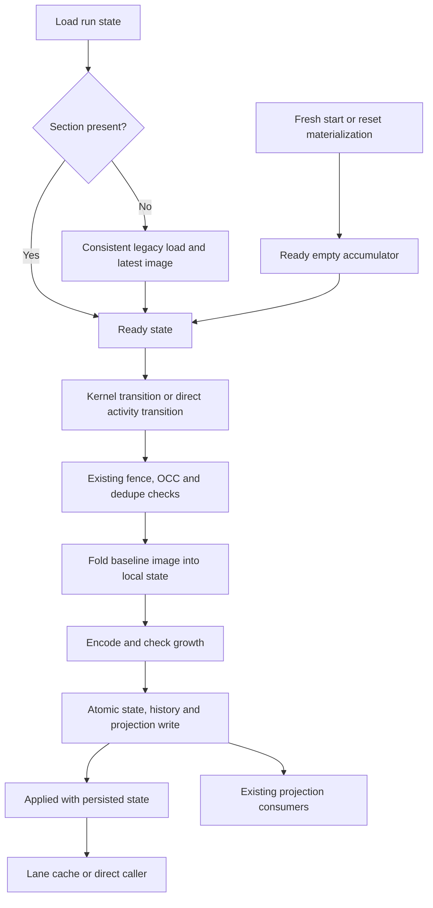

# Design: projection accumulator in run state

## Overview

Carry the preceding image's used-deployment-versions list on `WorkflowState`, seed
legacy state on load, and fold the next observation in the storage commit's local
state copy before measuring or writing it. Both stores use the same pure fold.
Their successful result returns the exact state persisted with the image, so the
lane caches the updated list without a new runtime feedback mechanism.

This implements the [approved requirements](bugfix.md). The compatibility baseline
is Tokeira `689e89a8622d114de1dd80232a22bb63705d50d1`. The four differences documented
in the requirements remain deferred: reset-prefix accumulation, inherited initial
versions, reported versions with unspecified behaviour, and trimming.

Temporal v1.31.0 supports the architectural decision to store the list in run state
(`service/history/workflow/mutable_state_impl.go:3564-3585, 3696-3722 @ v1.31.0`).
It is not the differential test oracle for this storage-only change. In particular,
Temporal's completion/replay helper would change Tokeira's reset image
(`service/history/workflow/workflow_task_state_machine.go:250-257, 1381-1389 @ v1.31.0`).
The vendored `proto/upstream/temporal/api/history/v1/message.proto` supplies the
completion wire shape; neither that wire shape nor event encoding changes here.

## Dependencies and non-goals

- [activity-heartbeat-time](../activity-heartbeat-time/requirements.md) owns the
  extensible hot-state and in-memory snapshot framing. This design adds run-state
  section tag **3**; tag 2 remains reserved.
- [run-growth-limits](../run-growth-limits/bugfix.md) owns size measurement, thresholds
  and the response to a breach. The new section contributes to that measurement.
- The existing commit protocol owns fencing, OCC, deduplication and atomic writes.
  This design keeps those checks and their existing outcome precedence.
- The later image-deletion work described in
  [Durable Actionable State](../../../docs/architecture/042-durable-actionable-state.md)
  consumes the two independent retention prerequisites in Requirements 4.1-4.2.
  No deletion implementation, backfill or rollout control is added here.

There are no new database tables, indexes, dependencies, configuration fields,
public RPC fields or history-event fields. Existing projection cursors and the
projection record's positional layout stay unchanged. The implementation scope is
`tokeira-kernel` state initialization, `tokeira-storage`, and focused runtime tests;
other crate edits are limited to fixtures requiring the new Rust struct field.

## Architecture

The kernel continues to decide workflow transitions. It carries the accumulator
without changing it on task completion or replay. Storage owns this projection
bookkeeping and performs no new workflow-semantic decision.



Seeding is a read-side migration, not a storage write. A successful load may return
ready state while the stored blob still lacks the section. Only a successful
transition persists that readiness. A no-op, failed commit or discarded loaded
copy does not make the run eligible for deletion of its last recovery image.

## Data model

### Per-run field

Add this field to `WorkflowState` in `crates/tokeira-kernel/src/state.rs`:

```rust
/// The previous committed image's ordered deployment observations.
/// None requires repository seeding; Some(empty) is ready and deliberately empty.
/// Storage persists this field in run-state extension tag 3.
#[serde(skip)]
pub used_worker_deployment_versions: Option<Vec<String>>,
```

The name identifies the single search attribute being retained; this is not a
generic projection extension bag. `None` defaults when serde decodes the unchanged
positional state. `Some(Vec::new())` is distinct from absence both in memory and in
the encoded extension. Requirements 2.5-2.6 and 2.16-2.17 define these states.

Keep the field outside `WorkflowVersioningInfo`. That struct can compact to `None`
on an unversioned run, and its values are used for routing inheritance and public
versioning-info presence checks. The accumulator must survive compaction without
manufacturing routing state or changing those checks. A fresh run never inherits
the parent's or predecessor's accumulator through versioning info.

| State | Meaning | Encoding | Source |
|---|---|---|---|
| `None` | Legacy/unseeded state; not an input to an applying commit | No tag 3 | Requirements 2.4, 2.17 |
| `Some([])` | Ready, no accumulated keyword-list entries | Tag 3 with encoded empty vector | Requirements 2.5-2.6, 2.13, 2.16 |
| `Some(values)` | Ready, preceding image's ordered list | Tag 3 with exactly those strings | Requirements 2.1-2.3, 3.1 |

No normalization is performed on seeded values: preserve their order, spelling,
empty strings and any pre-existing duplicates. The baseline only suppresses new
duplicate observations; a sorted set or codec-level deduplication would change it.

### Frozen extension payload

Add `USED_WORKER_DEPLOYMENT_VERSIONS_SECTION: u32 = 3` in `codec.rs`. Its payload is
exactly postcard's encoding of `Vec<String>`, with no nested `Option` or additional
version prefix. Tag presence encodes readiness. A future payload layout requires a
different tag, following the existing extension contract.

The writer includes tag 3 for every `Some`, even an empty vector, emits each tag
once in ascending order, and leaves tag 1 and any separately landed tag 2 intact.
The reader uses `decode_exact::<Vec<String>>` and returns `StateExtensionError`
when the payload is malformed or has trailing bytes. Existing framing validation
continues to reject duplicate tags and bad magic; unknown tags remain skippable.
Do not newly reject an otherwise valid section solely because its values repeat.

`snapshot_extension` already nests each run's `encode_state_extension` result in
the snapshot's run-state section. Reuse that path and `apply_snapshot_extension`;
do not add another snapshot tag or change `SnapshotDoc.runs`' positional layout.
Legacy decoders continue to ignore this new run-state section when they can read
the surrounding snapshot format; the mixed-writer tests use the supported
pre-accumulator codec, not an assumed older snapshot format.

## Components and interfaces

### State initialization: kernel and reset materialization

The fresh-state constructors in `BasicKernel::apply_start` and
`apply_signal_with_start` initialize the field to `Some(Vec::new())`.
Update-with-start delegates to the existing start path and gets the same value.

`replay_history_prefix` initializes its freshly reconstructed state to ready empty
and leaves the field empty while applying the prefix. Its production consumers
are the two reset materializers; it does not replace normal hot-state loads.
Document that replay reconstructs workflow state for a new projection lineage and
does not recover an existing run's accumulated projection history. Neither
`apply_replayed_event` nor `apply_wft_versioning` folds versions into the field.

Both reset materializers persist this empty section alongside their copied prefix,
without emitting a new projection row. For prefix completions v1 then v2, the first
ordinary reset commit observes the stored v2 and produces `[v2]`. If the first
ordinary commit instead changes the stored version to v3, it produces `[v3]`, as
the baseline with no preceding image does. No prefix observation is pre-added.

### Shared projection preparation: `tokeira-storage/src/api.rs`

Replace the production previous-image merge entry point with:

```rust
pub(crate) fn prepare_workflow_projection(
    state: &mut WorkflowState,
    history_size_bytes: i64,
) -> Result<ProjectionContext>;

pub(crate) fn seed_workflow_projection_accumulator(
    state: &mut WorkflowState,
    previous: Option<&ProjectionRecord>,
) -> Result<()>;
```

Both helpers are pure and perform no repository lookup. Use a small
`ProjectionAccumulatorError` deriving `Debug` and `thiserror::Error` for an unseeded
commit input or invalid seed identity/sequence. The existing `anyhow::Result`
repository surface wraps it without adding a public API error variant.

`prepare_workflow_projection` performs these steps on the commit's local state:

1. Require `Some` and clone its preceding list. Never infer readiness from the
   current deployment, sequence zero or an empty versioning-info struct.
2. Build the current raw `projection_context` with exactly the baseline inputs:
   lifecycle, update time, redaction flag false and the updated history size.
3. Read that context's `TemporalUsedWorkerDeploymentVersions` keyword list and
   append each not-yet-present value to the preceding list in encounter order.
4. If the result is non-empty, replace that attribute with the accumulated list.
   If empty, leave the raw context unchanged. This preserves absent, empty and
   differently typed values inherited from `state.search_attributes`.
5. Set `state.used_worker_deployment_versions = Some(result)` and return the
   context. No other workflow field, event, effect or search-attribute map changes.

Perform all fallible context construction before changing the local accumulator.
Preparing an already prepared local copy is idempotent because newly observed
values are appended only if absent. That is a useful property, not permission to
run the fold multiple times during the commit.

Keep `projection_context` as the baseline raw-image builder, including its current
stored-version observation. Keep `deleted_workflow_projection_context` on its
redacting path; it never invokes the ordinary preparation helper. A tombstone may
erase the public list while the soon-to-be-deleted state still has an accumulator.

`seed_workflow_projection_accumulator` acts only on `None`. It validates a supplied
record's run key, namespace/workflow/run identity and that its row sequence is no
greater than the loaded state's sequence. It extracts the keyword list verbatim;
no record, no attribute or a non-keyword-list value produces `Some([])`.
An older image sequence is allowed. Decoding errors never become an empty seed.

### DSQL commit: `dsql/run_repository/commit.rs`

Keep the public `RunRepository` signatures and the bundle wrapper unchanged.
The inner applying path retains a mutable clone of `transition.next_state`.
Preserve the existing epoch, OCC, deduplication and current-execution checks before
preparation; their conflict/duplicate outcomes still short-circuit without writes.

Reshape the internal writer to accept that mutable local copy:

```rust
async fn write_transition(
    tx: &mut sqlx::Transaction<'_, sqlx::Postgres>,
    run_key: RunKey,
    shard_id: ShardId,
    projection_partition_count: u32,
    transition: &Transition,
    state: &mut WorkflowState,
    prior_history_size_bytes: i64,
) -> Result<()>;
```

Inside it, encode the history batch once and compute the updated history size with
the existing arithmetic. Prepare the image and accumulator, encode the resulting
state once, then run `growth::check_commit` using those exact state bytes. No write
occurs before readiness, image construction, encoding and growth validation pass.

Write the state and existing effects as today. Encode the prepared context before
the first write and pass those bytes to `insert_projection_log`; it is an
INSERT-only helper and cannot fetch a preceding image. Keep partition assignment
for the new row unchanged. Return
`Applied { new_state: state }` only after the transaction commits. A transaction
failure discards the prepared local copy; the lane's cached input is unaffected.

The transition's semantic fields are not changed by preparation. The only local
state difference from `transition.next_state` is this projection-owned field; all
state encoding, sizing, projection and the returned state use the prepared copy.

### In-memory commit: `memory.rs`

Keep a mutable local clone of the transition state. Under the existing mutex,
perform the current fence, OCC, deduplication and current-execution checks first.
Compute history size in local variables, prepare the image, and measure the folded
state before mutating `history_size`, history, indexes, runs or other durable maps.
Append the prepared record after inserting that same state; return that state.

Remove the `latest_projection` call from the commit. Retain the disposable latest
index for legacy load seeding, and retain the cursor index for projector reads.
Maintaining those indexes on append does not require reading an old image.
This slice does not change their snapshot representation or projector ordering.

### Legacy DSQL loads: `dsql/run_repository/load.rs`

`do_load_run` continues to delegate to `do_load_run_with_stats`. The latter has a
fast path and a migration path using the existing `DbClass::Read` permit:

1. Perform the existing single hot-state/statistics read and decode. Absent runs
   return `Absent`; ready runs return immediately, with no projection lookup.
2. If unseeded, begin a read-only repeatable-read transaction on the same acquired
   connection and **reread** the hot state and statistics inside it. Discard the
   first read's state and statistics. If the run disappeared, return `Absent`; if
   another writer persisted readiness, return that newly read state without a
   projection lookup.
3. For an unseeded row in that snapshot, run the following parameterized query and
   decode the result through the existing projection codec:

```sql
SELECT partition_id, fanout, run_key, transition_seq, context_data
FROM projection_log
WHERE run_key = $1
ORDER BY transition_seq DESC
LIMIT 1
```

4. Construct the corresponding `ProjectionRecord`, validate and seed the local
   state, finish the read-only transaction, and return the seeded state with the
   statistics from the same transaction. No hot-state UPDATE is issued.

Use `connection.begin_with("BEGIN ISOLATION LEVEL REPEATABLE READ READ ONLY")`,
following the explicit-BEGIN pattern already used in `dsql/control_lease.rs`.
Aurora DSQL supports that BEGIN form and repeatable-read isolation. Integration
tests execute this exact transaction through SQLx with bound parameters on an
ephemeral Aurora DSQL cluster. See [AWS transaction syntax](https://docs.aws.amazon.com/aurora-dsql/latest/userguide/working-with-postgresql-compatibility-supported-sql-features.html)
and [DSQL client transaction parameters](https://docs.aws.amazon.com/aurora-dsql/latest/userguide/accessing.html)
(checked 2026-10-07).

This intentionally retains the cross-partition lookup **only on an unseeded load**.
A full-primary-key lookup computed from today's partition count can miss a legacy
row. No index or partition-history registry is introduced to optimize this one
migration path. A load can repeat it after eviction before persistence or after a
legacy writer drops the section. It is not promised to happen once per run forever.

Do not add a `transition_seq <= loaded_seq` predicate: a newer image in the same
snapshot is an inconsistency to report, not a row to hide. Validate the row sequence
before seeding. A lower sequence remains a legitimate legacy predecessor under
Requirement 2.12. Healthy data has one latest image for the run's commit sequence;
this change does not repair contradictory duplicate records.

The reread is essential. Beginning a transaction only for the image query would
combine an earlier hot-state snapshot with a later image. With both reads in one
transaction, a concurrent writer is wholly visible or wholly invisible. A writer
that commits after this load is handled by the existing expected-sequence check
when the caller later attempts its commit.

### Legacy in-memory loads and snapshots

`load_run_with_stats` clones the stored state and statistics while holding the
existing mutex. For an unseeded clone, retrieve `latest_projection` under that same
lock and call the shared seed helper. Return the ready clone without replacing
`store.runs`. `load_run` delegates to it as today.

Keeping the stored copy unseeded makes the durability distinction concrete: a
snapshot taken after a load but before a successful transition still has no tag 3
for that run. Restore reapplies existing sections, rebuilds disposable indexes and
leaves legacy runs for ordinary load-time seeding. No eager scan/backfill occurs.

## State sources and commit consumers

| Source/path | How readiness reaches its next commit |
|---|---|
| Lane cold load in `run_activation_with_cache` | `repo.load_run`; shared seeding is mandatory before caching |
| Lane OCC retry | Existing cache eviction followed by `load_run`; never merge the losing local accumulator |
| Lane post-reset bookkeeping | `materialize_reset_successor` persists ready empty; `load_run_with_stats` reads it; later follow-up commands use the lane load |
| `record_activity_heartbeat` | `load_run`, clone, direct `commit_transition_for_bundle`; both initial and retry loads seed |
| `force_start_activity_for_completion` | `load_run` before its direct commit |
| `start_activity_task_inner` | `load_run` before the direct activity-start commit, including offers originating in recovery |
| `commit_activity_retry` | `deps.repo.load_run` before its direct commit; failure and timeout callers use this path |
| `prepare_activity_dispatch_publish` | `deps.repo.load_run` before changing dispatch-related state through a commit |
| Normal, signal-with-start and update-with-start fresh starts | Kernel fresh-state constructors supply ready empty |
| Continue-as-new and child starts | Existing routing resolvers supply versioning info; fresh-state constructors independently supply ready empty |
| Retry successor starts, including timeout retries | `build_retry_successor_start` may carry inherited versioning info; the successor's fresh state has its own ready empty list |
| Cron successor starts, including timeout crons | `build_cron_successor_start` supplies no inherited versioning info at the baseline; its new state is ready empty |
| Both reset materializers | Replay constructs ready empty without folding the prefix, then storage persists it before follow-up transitions |
| `list_recovery_candidates_for_shard` and `recovery_entries` | Rebuild disposable offers/trackers, not lane cached state; submitted work reloads through the paths above |
| Dispatch, visibility and pinned-workflow scans | Read-only projections of decoded state; they do not directly commit that returned state |
| Run deletion | Separate fenced deletion path, redacted tombstone; no ordinary accumulator fold or seed is required |
| In-memory snapshot restoration | Section restore or unseeded legacy state; the subsequent commit-capable load performs seeding |

The two public commit methods share the readiness guard. Direct tests or alternate
repository consumers cannot bypass the contract by handing storage an unseeded
existing state. There is no special exemption for `expected_seq == 0`, because a
materialized reset can already exist with that sequence. Update test fixtures to
state explicitly whether they represent fresh, seeded or legacy runs.

Only successful commits return a new durable accumulator. Callers that ignore the
returned state, such as heartbeat acknowledgements, reload before their next
direct commit. The lane already caches `Applied.new_state`. No new cache writeback
or protocol field is required.

## Recovery, mixed writers and later deletion

The new writer's image is identical to the baseline image. Therefore an old writer
can consume that image, ignore tag 3 and produce the next baseline image; a new
reader can then seed from it. This compatibility argument depends on retaining the
latest image, and on leaving the deferred behavioural corrections out of this slice.

Later deletion must enforce both requirements: no legacy writer or rollback can
rewrite an affected run, and that run's **stored** state has tag 3. A ready lane
copy, a minimum binary version alone, or a no-op response proves neither condition.
This design provides no deletion eligibility API, since the later work must decide
how it proves those conditions without racing a writer.

Once both conditions hold, ordinary commits can continue after every old applied
image has been removed. For a legacy run whose recovery image was already lost,
the empty seed matches the baseline's missing-image result; history reconstruction
would change the selected preservation contract and is not added here.

## Correctness properties

References below are numbered criteria in [bugfix.md](bugfix.md). All properties
have required property-based-test tasks in the [implementation plan](tasks.md).

### Property 1: no projection reads in commits

*For any* ready run and valid ordinary transition, either commit entry point SHALL
apply without fetching a preceding projection image. A durably ready load SHALL
perform no seed lookup. An otherwise applying commit with an unseeded existing
input SHALL fail before any durable write.

**Validates: Requirements 1.1, 1.2, 2.1, 2.4, 2.13.**

### Property 2: complete baseline image equivalence

*For any* equivalent successful transition sequence and baseline-accepted search
attribute values, preparation SHALL produce the complete frozen-baseline image
after every commit. The persisted and returned accumulators SHALL equal that
image's extracted keyword list, retaining first-seen order and existing duplicates
without trimming; unspecified behaviour SHALL add no cleared parameter value.

**Validates: Requirements 2.2, 2.3, 3.1, 3.4, 3.5.**

### Property 3: new run boundaries

*For any* fresh start or materialized reset, the pre-projection accumulator SHALL
be ready empty independently of parent/predecessor lists and copied completions.
Its first ordinary image SHALL match the baseline with no preceding image,
including inherited initial versions and any change before that first commit.

**Validates: Requirements 2.5, 2.6, 3.2, 3.3.**

### Property 4: consistent, non-durable legacy seeding

*For any* generated legacy state/image history, historical partition assignment and
concurrent commit schedule, a successful legacy load SHALL return the seed and
statistics from the same snapshot as its returned state. Missing images, absent
or differently typed attributes and older sequences SHALL follow the baseline;
invalid identity, newer sequence or undecodable data SHALL produce no ready
result. The load alone SHALL leave stored readiness unchanged.

**Validates: Requirements 2.7, 2.8, 2.9, 2.10, 2.11, 2.12, 2.15.**

### Property 5: extension compatibility

*For any* accumulator state and combination of unrelated valid sections, hot-state
and snapshot round trips SHALL preserve absence versus ready empty versus ordered
values without changing positional state bytes. Known sections SHALL coexist,
unknown tags SHALL be skipped, emitted tags SHALL be ordered and unique, and
malformed tag-3 payloads or framing SHALL fail rather than return decoded state.

**Validates: Requirements 2.16, 2.17, 2.18, 2.19.**

### Property 6: restart, legacy writers and pruning

*For any* baseline-equivalent sequence of eviction, restart, legacy writer cycles
and successful new commits, the next new commit SHALL retain the baseline list.
Seeding discarded before persistence SHALL not count as durable readiness. Once
legacy writers are excluded and the run is durably ready, deleting all applied
images SHALL leave later images identical to a control run with images retained.

**Validates: Requirements 1.3, 2.14, 2.15, 2.20, 4.1, 4.2.**

### Property 7: failure isolation and existing commit contract

*For any* OCC race, rejected input, duplicate or no-op transition, no losing local
fold SHALL change a durable image or overwrite the winner's accumulator. Existing
fence and dedupe outcomes SHALL remain unchanged. A deletion tombstone SHALL keep
its baseline redaction regardless of the stored accumulator's contents.

**Validates: Requirements 2.4, 3.6, 3.7, 3.8.**

### Property 8: exact state growth accounting

*For any* ready accumulator and otherwise identical state, measured state size
SHALL equal the actual encoded state length less the existing activity-input
exclusion. Section framing and empty-list overhead SHALL count. Crossing a growth
threshold due to these bytes SHALL invoke the existing warning/error response,
with no changed threshold or independent accumulator limit.

**Validates: Requirements 2.21, 2.22, 3.8.**

## Error handling

| Condition | Internal result | Boundary behaviour |
|---|---|---|
| Unseeded otherwise-applying commit | `ProjectionAccumulatorError::Unseeded { run_key }` | No writes; existing generic storage-error propagation, `INTERNAL` when surfaced by an RPC; diagnostic directs the caller through a seed-capable load |
| Wrong seed run/identity or row sequence newer than state | `ProjectionAccumulatorError::InvalidSeed { run_key, defect }` | Fail load, return no ready state; `INTERNAL` at RPC boundary; retain persisted evidence |
| Undecodable projection image or invalid row conversion | Existing decode/conversion error with run-key context | Fail load, never substitute an empty seed; `INTERNAL` at RPC boundary |
| Invalid state envelope | Existing `BlobFormatError` | Existing load failure and operator guidance |
| Malformed section framing or tag-3 payload | Existing `StateExtensionError`; snapshot restore wraps via `SnapshotError::Extension` | No decoded run/partial restored store returned; existing storage/restore error surface |
| Image construction or state/history encoding failure | Existing codec/conversion error | No commit writes; local fold discarded |
| DSQL acquisition, query or read-transaction failure | Existing SQLx/director error with operation context | No ready result; existing caller retry/error handling |
| Existing fence, OCC, duplicate or current-execution collision | Existing `CommitResult` variant | Existing runtime retry/admission handling; no new classification |
| DSQL write transaction failure | Existing error or normalized conflict | No `Applied` result; reload on the existing OCC retry path |
| Growth threshold crossed | Existing `RunLimitExceeded` | Existing runtime termination/warning policy and `INVALID_ARGUMENT` mapping where applicable |
| No seed image, absent attribute, non-keyword-list value | Successful ready-empty seed | Intentional baseline fallback, not corruption recovery |

The RPC mapping above follows `crates/tokeira-edge/src/errors.rs`,
`From<anyhow::Error>`, and `grpc/errors.rs`'s `EdgeError::Internal` mapping. Background
callers retain their existing error handling; this work adds no retry scheduler.
Diagnostics name the run and defect but need not dump stored payloads.

## Testing strategy

Use existing `proptest` support, at least 100 cases per property, with deterministic
coordination through channels or barriers for races. No sleeps, new dependencies,
production test switches or modified shared configuration are needed.

| Property | Primary implementation/test location |
|---|---|
| 1 | `tokeira-storage/src/memory.rs` lookup instrumentation and `src/projection_accumulator_tests.rs`; actual SQLx statement capture in `src/dsql/run_repository/projection_accumulator_tests.rs`, both commit entry points |
| 2 | Pure preparation and shared repository generators in `tokeira-storage/src/projection_accumulator_tests.rs`, reused by the DSQL contract; independent frozen raw-image and merge oracle in `src/projection_accumulator_oracle.rs` |
| 3 | Kernel `tests/golden_tests.rs`, storage reset contracts on both backends, runtime successor tests in `runtime/workflow_task.rs` and reset bookkeeping in `src/projection_accumulator_tests.rs` |
| 4 | Seed-helper and memory load contracts in `tokeira-storage/src/projection_accumulator_tests.rs`; DSQL legacy loads and channel-coordinated snapshot schedules in `src/dsql/run_repository/projection_accumulator_tests.rs` |
| 5 | Existing codec and snapshot test modules in `codec.rs` and `memory.rs` |
| 6 | Shared memory/DSQL survival contracts, frozen reader/writer in `tokeira-storage/src/projection_accumulator_legacy_codec.rs`, and runtime lane eviction/reload tests |
| 7 | Memory/DSQL repository contracts and runtime lane OCC tests; deletion tests for both stores |
| 8 | Both repository contracts and `tokeira-runtime/tests/runtime_run_growth.rs` |

The first implementation task is the bug-condition exploration test: observe a
preceding-image lookup during a baseline ordinary commit and fail the no-read
assertion. Record the shrunk sequence before changing implementation.

Freeze the baseline previous-image merge and raw projection derivation as
test-only Tokeira code at the cited baseline commit, with provenance comments. The
oracle must not delegate the accumulator-dependent portion to the production
preparation function. Generate the same valid commands against both models;
compare **all** `ProjectionContext` fields, not only this search attribute.

Run the shared generated contract against memory and an ephemeral Aurora DSQL
cluster using the existing `dsql-integration` mechanism. The existing recording
connection acquirer proves acquisition class only; it is not evidence about SQL
statement counts. Assert statement-level absence of `projection_log` SELECTs
where the SQL harness exposes executed statements, and explicitly report that
coverage as unavailable otherwise. Keep pure fold/codec and in-memory coverage
mandatory in the default suite; do not describe a skipped live database run as a
passed DSQL contract. Database seeding/cleanup must stay scoped to each test's runs.

Named regressions supplement the properties:

- Prefix v1 then v2, followed by reset's first ordinary commit: `[v2]`.
- Reset materialization with no image, including the legacy no-section form.
- First post-materialization commit changes v2 to v3: `[v3]`.
- Inherited continue-as-new/child/retry version appears in the first image; cron
  uses the baseline constructor without invented inherited versioning info.
- Unspecified behaviour with valid versioned worker options retains old values
  but adds no cleared stored version.
- Seeded empty, missing attribute, explicitly empty list, differently typed raw
  attribute and repeated values retain their baseline distinctions.
- Historical partition-count changes locate the old latest row; a ready run with
  deliberately undecodable old projection data never reads it.
- A writer commits between the fast legacy read and migration reread, and another
  schedule commits between the two reads inside the transaction. Returned state,
  seed and statistics always come from one accepted snapshot.
- Snapshot immediately after seed-only load still represents an unseeded durable
  run; snapshot after successful commit preserves the section across restart.
- An actual legacy cycle reads a new state while ignoring tag 3, uses the old
  projection merge, writes without tag 3, and is then reseeded by the new reader.
- Negative pruning controls show why each retention prerequisite is necessary:
  prune an unseeded run after excluding old writers, or prune a seeded run before
  a legacy rewrite. The positive pruning property excludes both schedules.
- Growth at exactly the threshold succeeds; one encoded byte above it produces
  the existing breach response. Include the framing overhead of `Some([])`.

The completion bar remains AGENTS.md §10.4 plus relative-link checks. The approved
implementation and all eight property contracts are now present; completion and
execution evidence are recorded in the [implementation plan](tasks.md).
