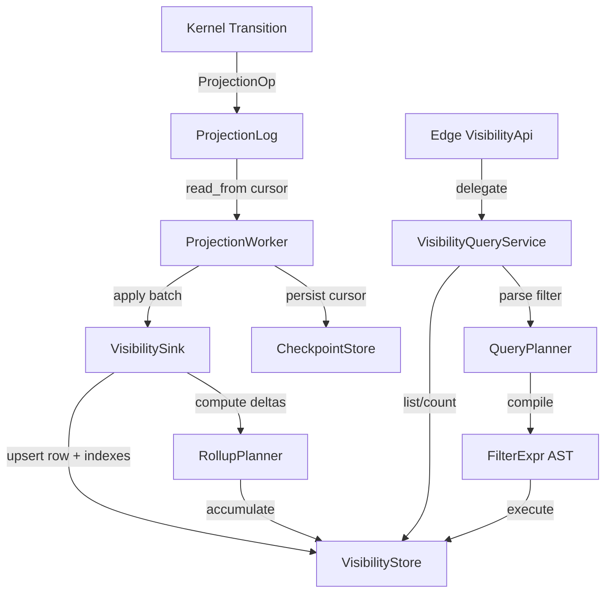

# Design Document: Projection Visibility

## Overview

This design extends `tokeira-projection` from a 137-line stub into a working visibility layer that materializes SQL-queryable execution rows from committed `ProjectionOp`s. The pipeline flows:

```
Kernel transitions → ProjectionOp → ProjectionLog → ProjectionWorker → VisibilitySink → VisibilityStore → VisibilityApi
```

The projection plane is explicitly **not on the correctness path**. A lagging or temporarily unavailable visibility layer does not affect workflow execution semantics. Sinks are independently checkpointed and replayable.

The primary implementation target is an in-memory `VisibilityStore` for dev/test. The trait surface is designed so a DSQL backend can be added later without changing callers.

## Architecture



### Component Ownership

| Component | Crate | Responsibility |
|---|---|---|
| `ProjectionOp` | `tokeira-kernel` | Exists; `UpsertExecution`, `CloseExecution` |
| `ProjectionLog` | `tokeira-storage` | Exists; cursor-based read |
| `ProjectionSink` | `tokeira-projection` | Exists; `apply(record)` trait |
| `VisibilitySink` | `tokeira-projection` | New; materializes rows + indexes |
| `VisibilityStore` | `tokeira-projection` | New; storage trait for rows, indexes, rollups |
| `QueryPlanner` | `tokeira-projection` | New; filter parse + compile |
| `VisibilityQueryService` | `tokeira-projection` | New; implements `VisibilityApi` |
| `InMemoryVisibilityStore` | `tokeira-projection` | New; replaces `InMemoryVisibilitySink` |
| `ProjectionWorker` | `tokeira-projection` | Exists; extended with loop + checkpoint |

All new code lives in `tokeira-projection`. The edge crate already defines `VisibilityApi` and the DTOs; no changes needed there.

## Components and Interfaces

### VisibilityStore Trait

The core storage abstraction behind the visibility sink and query service.

```rust
#[async_trait]
pub trait VisibilityStore: Send + Sync {
    // ── Write path (sink) ──
    async fn upsert_execution(
        &self,
        row: &ExecutionRow,
    ) -> Result<()>;

    async fn upsert_search_attr_index(
        &self,
        run_key: RunKey,
        attr_id: AttrId,
        attr_type: SearchAttrType,
        value: &SearchAttrValue,
    ) -> Result<()>;

    async fn remove_search_attr_index(
        &self,
        run_key: RunKey,
        attr_id: AttrId,
        attr_type: SearchAttrType,
    ) -> Result<()>;

    async fn accumulate_rollup(
        &self,
        entries: &[RollupDelta],
    ) -> Result<()>;

    // ── Read path (query) ──
    async fn list_executions(
        &self,
        namespace_id: NamespaceId,
        filter: &CompiledFilter,
        sort: SortOrder,
        page: &PageBounds,
    ) -> Result<ListResult>;

    async fn count_executions(
        &self,
        namespace_id: NamespaceId,
        filter: &CompiledFilter,
        group_by: Option<GroupByField>,
    ) -> Result<CountResult>;

    async fn count_from_rollup(
        &self,
        namespace_id: NamespaceId,
        dimension: RollupDimension,
    ) -> Result<CountResult>;

    // ── Checkpoint ──
    async fn load_checkpoint(
        &self,
        sink_id: &str,
    ) -> Result<Option<ProjectionCursor>>;

    async fn save_checkpoint(
        &self,
        sink_id: &str,
        cursor: &ProjectionCursor,
    ) -> Result<()>;

    // ── Registry ──
    async fn resolve_attr(
        &self,
        namespace_id: NamespaceId,
        name: &str,
    ) -> Result<Option<AttrDescriptor>>;

    async fn register_attr(
        &self,
        namespace_id: NamespaceId,
        name: String,
        attr_type: SearchAttrType,
    ) -> Result<AttrId>;

    // ── Backward compat ──
    async fn get_row(
        &self,
        run_key: RunKey,
    ) -> Option<ExecutionRow>;
}
```

### VisibilitySink

Implements `ProjectionSink`. Consumes `ProjectionRecord`s and writes to `VisibilityStore`.

```rust
pub struct VisibilitySink<S: VisibilityStore> {
    store: S,
    sink_id: String,
}

#[async_trait]
impl<S: VisibilityStore> ProjectionSink
    for VisibilitySink<S>
{
    async fn apply(
        &self,
        record: &ProjectionRecord,
    ) -> Result<()>;
}
```

The `apply` method:
1. Loads or creates the `ExecutionRow` for `record.run_key`.
2. Populates system fields (namespace_id, workflow_id, run_id, workflow_type, task_queue, start_time, history_length, state_transition_count) from `record.context`. **Note:** The current `ProjectionRecord` in `tokeira-storage` does not carry a `ProjectionContext`. This feature adds a `context: ProjectionContext` field to `ProjectionRecord` (following the pattern from the prototyping crate), populated by `InMemoryStore::commit_transition` from `WorkflowState` at commit time.
3. Applies each `ProjectionOp` in order:
   - `UpsertExecution`: merges status, memo, search attributes.
   - `CloseExecution`: sets terminal status and `closed_at`.
4. For each search attribute in the patch, resolves via registry, removes old index entries, inserts new ones.
5. Computes rollup deltas for status/workflow_type/task_queue dimension changes.
6. Writes the updated row, index entries, and rollup deltas to the store.

**Checkpoint ownership:** The `ProjectionSink` trait only has `apply(record)` and does not see batch or cursor boundaries. Checkpointing is a `ProjectionWorker` responsibility — the worker calls `store.save_checkpoint` after each successfully applied batch and `store.load_checkpoint` on startup.

### SearchAttributeRegistry

Namespace-scoped mapping from attribute names to typed descriptors.

```rust
pub struct AttrDescriptor {
    pub attr_id: AttrId,
    pub attr_type: SearchAttrType,
}

#[derive(
    Clone, Copy, Debug, PartialEq, Eq, Hash,
)]
pub struct AttrId(pub u64);

#[derive(
    Clone, Copy, Debug, PartialEq, Eq, Hash,
)]
pub enum SearchAttrType {
    Keyword,
    KeywordList,
    Int,
    Bool,
    Double,
    Datetime,
    Text,
}
```

The registry lives inside `VisibilityStore`. The sink calls `resolve_attr` during apply; the query planner calls it during filter compilation.

### QueryPlanner

Parses Temporal-compatible list-filter expressions and compiles them into a `CompiledFilter` that the store can execute.

```rust
/// Parsed filter expression AST.
#[derive(Clone, Debug, PartialEq)]
pub enum FilterExpr {
    And(Box<FilterExpr>, Box<FilterExpr>),
    Or(Box<FilterExpr>, Box<FilterExpr>),
    Compare {
        field: FieldRef,
        op: CompareOp,
        value: FilterValue,
    },
    In {
        field: FieldRef,
        values: Vec<FilterValue>,
    },
    Between {
        field: FieldRef,
        low: FilterValue,
        high: FilterValue,
    },
    StartsWith {
        field: FieldRef,
        prefix: String,
    },
}

#[derive(Clone, Debug, PartialEq)]
pub enum FieldRef {
    System(SystemField),
    Custom(AttrId, SearchAttrType),
}

#[derive(Clone, Copy, Debug, PartialEq, Eq)]
pub enum SystemField {
    WorkflowId,
    RunId,
    WorkflowType,
    TaskQueue,
    ExecutionStatus,
    StartTime,
    CloseTime,
    HistoryLength,
    StateTransitionCount,
}

#[derive(Clone, Copy, Debug, PartialEq, Eq)]
pub enum CompareOp {
    Eq,
    Ne,
    Lt,
    Le,
    Gt,
    Ge,
}

#[derive(Clone, Debug, PartialEq)]
pub enum FilterValue {
    String(String),
    Int(i64),
    Float(f64),
    Bool(bool),
    Datetime(OffsetDateTime),
    Status(ExecutionStatus),
}
```

Compilation pipeline:
1. **Parse** filter string → `FilterExpr` AST.
2. **Resolve** custom attribute names via registry → `FieldRef::Custom(attr_id, attr_type)`.
3. **Type-check** each predicate (value type matches field type).
4. **Wrap** into `CompiledFilter` for store execution.

```rust
pub struct CompiledFilter {
    pub expr: Option<FilterExpr>,
}

pub fn compile_filter(
    input: Option<&str>,
    namespace_id: NamespaceId,
    store: &dyn VisibilityStore,
) -> Result<CompiledFilter>;
```

### Pagination

```rust
#[derive(Clone, Debug, PartialEq)]
pub struct PageToken {
    pub close_time: Option<OffsetDateTime>,
    pub start_time: OffsetDateTime,
    pub run_key: RunKey,
}

#[derive(Clone, Debug, PartialEq)]
pub struct PageBounds {
    pub limit: usize,
    pub after: Option<PageToken>,
}

pub const MAX_PAGE_SIZE: usize = 1000;
```

Page tokens are serialized as base64-encoded JSON. The sort tuple is `(close_time DESC NULLS FIRST, start_time DESC, run_key DESC)` for the default sort order.

```rust
#[derive(Clone, Copy, Debug, PartialEq, Eq)]
pub enum SortOrder {
    Default,
    StartTimeAsc,
    StartTimeDesc,
    CloseTimeAsc,
    CloseTimeDesc,
}
```

### Rollup Acceleration

```rust
#[derive(Clone, Copy, Debug, PartialEq, Eq, Hash)]
pub enum RollupDimension {
    ExecutionStatus,
    WorkflowType,
    TaskQueue,
}

#[derive(Clone, Debug, PartialEq)]
pub struct RollupDelta {
    pub namespace_id: NamespaceId,
    pub dimension: RollupDimension,
    pub value: String,
    pub delta: i64,
}
```

The `RollupPlanner` computes signed deltas during each apply cycle:
- New row: `+1` for current status, workflow type, task queue.
- Status change: `-1` for old value, `+1` for new value.
- The store accumulates deltas into rollup counters.

### VisibilityQueryService

Implements `VisibilityApi` by delegating to the query planner and store.

```rust
pub struct VisibilityQueryService<S: VisibilityStore> {
    store: S,
}

#[async_trait]
impl<S: VisibilityStore> VisibilityApi
    for VisibilityQueryService<S>
{
    async fn list_workflows(
        &self,
        req: ListWorkflowExecutionsRequest,
    ) -> Result<ListWorkflowExecutionsResponse>;

    async fn count_workflows(
        &self,
        req: CountWorkflowExecutionsRequest,
    ) -> Result<CountWorkflowExecutionsResponse>;
}
```

`list_workflows`:
1. Parse namespace to `NamespaceId`.
2. Compile filter via `compile_filter`.
3. Decode page token (if present).
4. Call `store.list_executions(...)`.
5. Map `ExecutionRow` → `WorkflowExecutionSummary`.
6. Encode next page token if more results exist.

`count_workflows`:
1. Parse namespace and filter.
2. If filter is empty and group-by targets a rollup dimension, use `store.count_from_rollup`.
3. Otherwise call `store.count_executions`.

### ProjectionWorker Extensions

The existing `ProjectionWorker` is extended with:

```rust
impl<L, S> ProjectionWorker<L, S>
where
    L: ProjectionLog,
    S: ProjectionSink,
{
    /// Long-running loop with backoff and cancellation.
    pub async fn run(
        &self,
        cancel: CancellationToken,
    ) -> Result<()>;
}
```

The `run` method:
1. Load checkpoint from store (or start from beginning).
2. Loop: read batch → apply → save checkpoint → repeat.
3. On empty batch: exponential backoff (100ms base, 5s cap).
4. On sink error: log, backoff, retry without advancing checkpoint.
5. On cancellation: finish current batch, save checkpoint, return.

## Data Models

### ExecutionRow

```rust
#[derive(Clone, Debug, PartialEq)]
pub struct ExecutionRow {
    pub run_key: RunKey,
    pub namespace_id: NamespaceId,
    pub workflow_id: WorkflowId,
    pub run_id: RunId,
    pub workflow_type: WorkflowType,
    pub task_queue: TaskQueueName,
    pub status: ExecutionStatus,
    pub start_time: OffsetDateTime,
    pub execution_time: Option<OffsetDateTime>,
    pub close_time: Option<OffsetDateTime>,
    pub history_length: i64,
    pub state_transition_count: i64,
    pub memo: Memo,
    pub search_attr_version: u64,
}
```

### TypedIndex

Seven in-memory index structures, each keyed by `(NamespaceId, AttrId)`:

| Index | Value Type | Lookup |
|---|---|---|
| `sa_keyword_idx` | `String` | exact, IN, StartsWith |
| `sa_keyword_list_idx` | `Vec<String>` | exact per element |
| `sa_int_idx` | `i64` | range, exact |
| `sa_bool_idx` | `bool` | exact |
| `sa_double_idx` | `f64` | range, exact |
| `sa_datetime_idx` | `OffsetDateTime` | range, exact, BETWEEN |
| `sa_text_token_idx` | `Vec<String>` (tokens) | token match |

Each index entry maps `(NamespaceId, AttrId, value) → BTreeSet<RunKey>` for efficient predicate evaluation.

### RollupEntry

```rust
#[derive(Clone, Debug, Default)]
pub struct RollupCounter {
    /// dimension_value → accumulated count
    pub counts: HashMap<String, i64>,
}
```

Stored per `(NamespaceId, RollupDimension)`.

### PageToken (serialized)

```rust
#[derive(Serialize, Deserialize)]
struct PageTokenWire {
    ct: Option<i64>,  // close_time unix millis
    st: i64,          // start_time unix millis
    rk: Uuid,         // run_key
    so: u8,           // sort_order discriminant
}
```

Base64-encoded JSON. Compact to keep gRPC response sizes small.

### SearchAttributeRegistry (in-memory)

```rust
struct RegistryState {
    /// (namespace_id, attr_name) → descriptor
    attrs: HashMap<
        (NamespaceId, String),
        AttrDescriptor,
    >,
    next_attr_id: u64,
}
```

### InMemoryVisibilityStore State

```rust
struct VisibilityState {
    rows: HashMap<RunKey, ExecutionRow>,
    // Search attribute current values
    sa_current: HashMap<
        (RunKey, AttrId),
        SearchAttrValue,
    >,
    // Typed indexes: (ns, attr_id, value) → run_keys
    keyword_idx: BTreeMap<
        (NamespaceId, AttrId, String),
        BTreeSet<RunKey>,
    >,
    keyword_list_idx: BTreeMap<
        (NamespaceId, AttrId, String),
        BTreeSet<RunKey>,
    >,
    int_idx: BTreeMap<
        (NamespaceId, AttrId, i64),
        BTreeSet<RunKey>,
    >,
    bool_idx: BTreeMap<
        (NamespaceId, AttrId, bool),
        BTreeSet<RunKey>,
    >,
    double_idx: BTreeMap<
        (NamespaceId, AttrId, OrderedFloat<f64>),
        BTreeSet<RunKey>,
    >,
    datetime_idx: BTreeMap<
        (NamespaceId, AttrId, OffsetDateTime),
        BTreeSet<RunKey>,
    >,
    text_token_idx: BTreeMap<
        (NamespaceId, AttrId, String),
        BTreeSet<RunKey>,
    >,
    // Rollups
    rollups: HashMap<
        (NamespaceId, RollupDimension),
        RollupCounter,
    >,
    // Registry
    registry: RegistryState,
    // Checkpoints
    checkpoints: HashMap<String, ProjectionCursor>,
}
```

Wrapped in `Arc<Mutex<VisibilityState>>` following the existing `InMemoryStore` pattern.


## Correctness Properties

*A property is a characteristic or behavior that should hold true across all valid executions of a system — essentially, a formal statement about what the system should do. Properties serve as the bridge between human-readable specifications and machine-verifiable correctness guarantees.*

### Property 1: Apply Correctness

*For any* valid `ProjectionRecord` containing one or more `ProjectionOp`s (UpsertExecution and/or CloseExecution), applying the record to the visibility sink SHALL produce an `ExecutionRow` whose status, memo, search attributes, close time, and system fields (namespace, workflow ID, run ID, workflow type, task queue, start time, history length, transition count) correctly reflect the sequential application of all ops in the record.

**Validates: Requirements 1.1, 1.2, 1.4, 1.5**

### Property 2: Idempotent Apply

*For any* valid `ProjectionRecord`, applying it once and applying it twice SHALL produce identical `ExecutionRow` state and identical typed index entries. That is, `apply(apply(state, record), record) == apply(state, record)`.

**Validates: Requirements 1.3**

### Property 3: Search Attribute Indexing

*For any* `ProjectionOp::UpsertExecution` with a non-empty search attribute patch where all attribute names are registered and all value types match, applying the op SHALL produce typed index entries that contain the run key under the correct `(namespace, attr_id, value)` key for each of the seven attribute types (Keyword, KeywordList, Int, Bool, Double, Datetime, Text).

**Validates: Requirements 2.1, 2.2, 2.6**

### Property 4: Index Update Cleanup

*For any* execution row with an existing indexed search attribute value, when a new value is applied for the same attribute, the old typed index entries SHALL be removed and only the new entries SHALL be present. The run key SHALL NOT appear under the old value in the typed index.

**Validates: Requirements 2.3**

### Property 5: Text Tokenization

*For any* non-empty text string applied as a `Text` search attribute, the text token index SHALL contain one entry per unique lowercase alphanumeric token extracted from the string, and each token SHALL map to the run key.

**Validates: Requirements 2.7**

### Property 6: Filter Expression Round-Trip

*For any* valid `FilterExpr` AST, printing it to a filter string and parsing it back SHALL produce an equivalent AST.

**Validates: Requirements 3.1**

### Property 7: Pagination Completeness

*For any* set of execution rows in a namespace and any page size between 1 and `MAX_PAGE_SIZE`, iterating through all pages using the returned page tokens SHALL yield exactly the same set of rows (in the same order) as a single unbounded query. No rows are duplicated or omitted.

**Validates: Requirements 4.1, 4.2, 4.3**

### Property 8: Sort Order Correctness

*For any* set of execution rows containing a mix of open (null close time) and closed executions, querying with the default sort order SHALL return open executions before closed executions, with closed executions ordered by close time descending, and ties broken by start time descending then run key descending. For each non-default sort order, rows SHALL be ordered by the specified field and direction.

**Validates: Requirements 4.4, 4.5**

### Property 9: Count-List Consistency

*For any* namespace, filter expression, and set of execution rows, the count returned by `count_executions` SHALL equal the number of rows returned by `list_executions` with the same filter (ignoring pagination).

**Validates: Requirements 5.1**

### Property 10: Group-By Count Correctness

*For any* namespace, filter, and group-by field (system or custom search attribute), the sum of all per-group counts SHALL equal the total count, and each per-group count SHALL equal the count of rows matching the filter whose group-by field has that value.

**Validates: Requirements 5.2, 5.3**

### Property 11: Rollup Delta Conservation

*For any* sequence of `ProjectionRecord` applications that cause status transitions, the sum of all rollup deltas for each `(namespace, dimension, value)` tuple SHALL equal the net change in the number of execution rows with that dimension value. In particular, for a single status transition from A to B, the deltas SHALL be exactly -1 for A and +1 for B.

**Validates: Requirements 6.1, 6.2**

### Property 12: Rollup Time Bucketing

*For any* timestamp and configurable time window, the rollup bucket assignment SHALL be deterministic and the bucket boundaries SHALL be aligned to the window size. Two timestamps in the same window SHALL map to the same bucket.

**Validates: Requirements 6.3**

### Property 13: Rollup-Accelerated Count Consistency

*For any* namespace and rollup-accelerated dimension (ExecutionStatus, WorkflowType, TaskQueue) with no additional filter predicates, the count returned via rollup aggregates SHALL equal the count returned by a direct scan of execution rows.

**Validates: Requirements 6.4**

### Property 14: ExecutionRow to Summary Mapping

*For any* `ExecutionRow`, the `WorkflowExecutionSummary` produced by the query service SHALL have matching namespace, workflow ID, run ID, workflow type, task queue, execution status, start time, and close time fields.

**Validates: Requirements 7.1, 7.5**

### Property 15: Checkpoint Round-Trip

*For any* valid `ProjectionCursor`, saving it via `save_checkpoint` and loading it via `load_checkpoint` SHALL return an identical cursor.

**Validates: Requirements 9.1, 9.2**

### Property 16: Checkpoint-After-Apply Invariant

*For any* batch of projection records, if the sink apply fails (returns an error), the checkpoint SHALL NOT be advanced past the pre-apply position. The checkpoint is advanced only after successful application.

**Validates: Requirements 9.4**

## Error Handling

### Sink Errors

| Condition | Behavior |
|---|---|
| Unknown search attribute name | Return `anyhow::Error` with message identifying the unknown attribute name and namespace |
| Search attribute type mismatch | Return `anyhow::Error` with message identifying the attribute, expected type, and actual type |
| Store write failure | Propagate error to worker; worker retries with backoff without advancing checkpoint |

### Query Errors

| Condition | Behavior |
|---|---|
| Unparseable filter expression | Return `anyhow::Error` with parse error details and position |
| Unknown attribute in filter | Return `anyhow::Error` identifying the unknown attribute name |
| Type mismatch in filter predicate | Return `anyhow::Error` identifying the field, expected type, and literal type |
| Invalid/corrupted page token | Return `anyhow::Error` indicating malformed token |
| Page size > MAX_PAGE_SIZE | Silently clamp to `MAX_PAGE_SIZE` |

### Worker Errors

| Condition | Behavior |
|---|---|
| Sink apply error | Log error at `warn` level, backoff, retry from same checkpoint |
| Projection log read error | Log error at `warn` level, backoff, retry |
| Checkpoint save error | Log error at `error` level, continue (next successful batch will re-save) |
| Cancellation signal | Complete current batch, save checkpoint, return `Ok(())` |

All errors use `anyhow::Result` following the existing codebase pattern. No custom error enums are introduced; error context is added via `anyhow::Context`.

## Testing Strategy

### Property-Based Tests (proptest)

The codebase uses `proptest` for property-based testing. Each property from the Correctness Properties section maps to one `proptest!` test with a minimum of 100 iterations.

Tag format: `// Feature: projection-visibility, Property N: <title>`

Tests run against `InMemoryVisibilityStore` which exercises the full pipeline without external dependencies.

Key generators needed:
- `arb_execution_row()` — random `ExecutionRow` with valid field combinations
- `arb_projection_record()` — random `ProjectionRecord` with valid `ProjectionOp` sequences
- `arb_search_attr_patch()` — random `SearchAttributes` with registered attribute names and matching types
- `arb_filter_expr()` — random valid `FilterExpr` AST
- `arb_page_token()` — random valid `PageToken`
- `arb_sort_order()` — random `SortOrder` variant

### Unit Tests

Focused on specific examples and edge cases not covered by property tests:
- Unknown search attribute name returns descriptive error (Req 2.4)
- Search attribute type mismatch returns descriptive error (Req 2.5)
- Unknown attribute in filter returns descriptive error (Req 3.4)
- Type mismatch in filter returns descriptive error (Req 3.5)
- Empty filter returns all executions (Req 3.6)
- Invalid page token returns descriptive error (Req 4.6)
- Count with no filter returns total (Req 5.4)
- `get_row(run_key)` backward compatibility (Req 8.6)
- No persisted cursor starts from beginning (Req 9.3)
- Worker backoff on empty batch (Req 10.2)
- Worker graceful shutdown on cancellation (Req 10.3)
- Worker retry on sink error (Req 10.4)

### Integration Tests

- End-to-end: start workflow → commit transition → projection worker applies → list_workflows returns the execution (Req 7.3)
- Full pagination walk-through with real filter expressions (Req 7.4)
- Worker lifecycle: start, process batches, cancel, verify checkpoint (Req 10.1)
