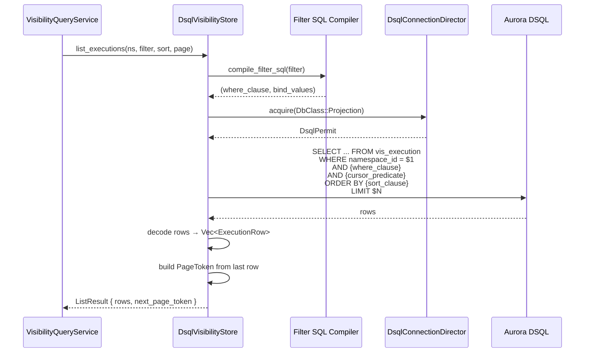
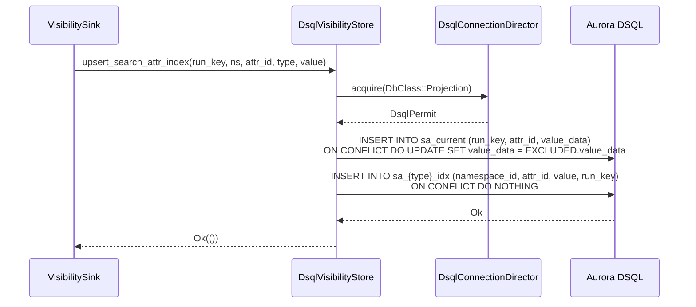
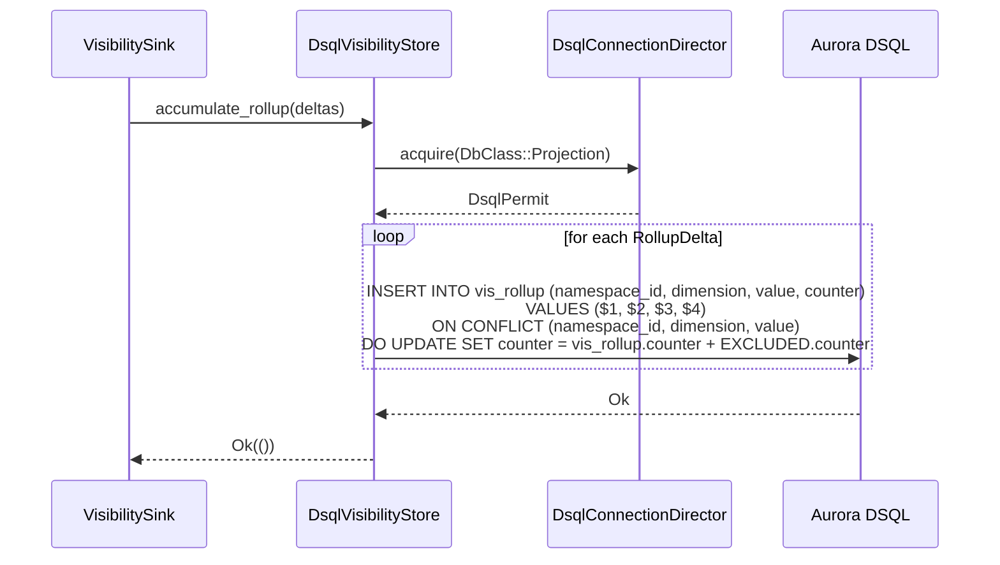

# Design Document: Projection Visibility (DSQL Query Surface)

## Overview

This design completes the DSQL visibility store by replacing the `bail!("projection-visibility spec")` stubs in `DsqlVisibilityStore` with real implementations. The write path (`ProjectionSink::apply`, checkpoint, `upsert_execution`, `delete_execution`) was delivered by `dsql-projection-persistence`. This spec adds:

1. **Query methods** — `list_executions`, `count_executions`, `count_from_rollup`, `get_row` with filter-to-SQL compilation, keyset pagination, and rollup-accelerated counts.
2. **Search attribute registry** — `resolve_attr` and `register_attr` against a new `sa_registry` table.
3. **Search attribute indexing** — `upsert_search_attr_index` and `remove_search_attr_index` maintaining typed side-index tables and `sa_current`.
4. **Rollup accumulation** — `accumulate_rollup` updating pre-aggregated counters in `vis_rollup`.
5. **Schema DDL** — 14 new migration files (V029–V042) for tables, indexes, and the rollup table.

### Key Design Decisions

1. **Filter-to-SQL as a pure function producing `(sql_fragment, bind_values)`.** The `FilterExpr` tree is walked recursively. System field predicates compile to direct column comparisons on `vis_execution`. Custom search attribute predicates compile to `run_key IN (SELECT run_key FROM sa_{type}_idx WHERE ...)` subqueries. This keeps the SQL compiler testable in isolation — the pure function takes a `FilterExpr` and returns a SQL string with positional parameters and a `Vec<SqlValue>` of bind values. The caller appends these to the base query.

2. **Keyset pagination using row-value comparison.** The default sort order is `(close_time DESC NULLS LAST, start_time DESC, run_key DESC)`, matching Rust's `Option::cmp` where `None < Some` — closed executions sort before open ones in descending order. The page token encodes the last row's sort-key tuple. The cursor predicate uses row-value comparison with `COALESCE(close_time, '-infinity')` to map NULL to negative infinity so open executions sort last. Other sort orders use analogous two-column `(sort_col, run_key)` comparisons. The query fetches `limit + 1` rows; the caller returns only the first `limit` and emits a page token only when the extra row exists.

3. **Application-generated `attr_id` via deterministic namespace/name hash.** Since DSQL doesn't support BIGSERIAL, `register_attr` generates `attr_id` by hashing `(namespace_id, attr_name)` to a positive i64 using BLAKE3 (via `dsql_spread_uuid` lower 63 bits). This is deterministic — the same `(namespace_id, attr_name)` always produces the same `attr_id`, making primary-key collisions cryptographically unlikely (~2^63 space). If a primary-key conflict occurs where the existing row has a different `(namespace_id, attr_name)`, the implementation returns a clear collision error. The `INSERT ... ON CONFLICT (namespace_id, attr_name) DO NOTHING` pattern handles concurrent registrations — a follow-up SELECT retrieves the winning row's `attr_id`.

4. **Text tokenization matches `InMemoryVisibilityStore::index_text`.** Lowercase alphanumeric token extraction: split on non-alphanumeric characters, lowercase each token, deduplicate. One row per token in `sa_text_token_idx`. KeywordList indexing inserts one row per list element into `sa_keyword_list_idx`, matching the in-memory store's per-element indexing.

5. **Rollup upsert via `INSERT ... ON CONFLICT DO UPDATE SET counter = vis_rollup.counter + EXCLUDED.counter`.** Atomic delta application. The `dimension` column uses a stable SMALLINT encoding: `ExecutionStatus = 0`, `WorkflowType = 1`, `TaskQueue = 2`.

6. **`SearchAttrType` and `RollupDimension` stable numeric mappings in `tokeira-projection/src/types.rs`.** Following the `ExecutionStatus::to_db_smallint` / `TryFrom<i16>` pattern. These live in the projection crate because they are projection-specific types, unlike `ExecutionStatus` which is a core type.

7. **Migration numbering V029–V042.** Continues from the existing V028. One DDL statement per file. All indexes use `CREATE INDEX ASYNC`.

8. **`sa_current.value_data` stores postcard-serialized `SearchAttrValue`.** This allows `remove_search_attr_index` to read the previous value for index cleanup without needing to know the type at the call site (the type is passed as a parameter, but the stored value is needed for deletion from the typed index table).

9. **`get_row` reuses the existing `get_execution_row` helper.** The current implementation already works — it just needs to be wired through instead of returning `None` on the happy path. The existing `get_row` implementation already handles errors by logging and returning `None`, matching the `Option` return type of the trait.

## Architecture

### Module Layout

All new code goes into `tokeira-projection/src/dsql_store.rs` (replacing stubs) plus new migration files in `tokeira-storage/migrations/`. The stable numeric mappings for `SearchAttrType` and `RollupDimension` go into `tokeira-projection/src/types.rs`.

```
tokeira-projection/
├── src/
│   ├── dsql_store.rs         # DsqlVisibilityStore — stubs replaced with real implementations
│   ├── types.rs              # SearchAttrType + RollupDimension stable numeric mappings (NEW)
│   ├── filter.rs             # FilterExpr types (unchanged — compile_filter stays here)
│   ├── memory.rs             # InMemoryVisibilityStore (behavioral reference, unchanged)
│   ├── store.rs              # VisibilityStore trait (unchanged)
│   └── ...
│
tokeira-storage/
├── migrations/
│   ├── V029__sa_registry.sql
│   ├── V030__idx_sa_registry_ns_name.sql
│   ├── V031__sa_current.sql
│   ├── V032__sa_keyword_idx.sql
│   ├── V033__sa_keyword_list_idx.sql
│   ├── V034__sa_int_idx.sql
│   ├── V035__sa_bool_idx.sql
│   ├── V036__sa_datetime_idx.sql
│   ├── V037__sa_double_idx.sql
│   ├── V038__sa_text_token_idx.sql
│   ├── V039__vis_rollup.sql
│   ├── V040__idx_vis_execution_ns_status.sql
│   ├── V041__idx_vis_execution_ns_start.sql
│   └── V042__idx_vis_execution_ns_tq.sql
```

### Data Flow — List Query



### Data Flow — Search Attribute Index Write



### Data Flow — Rollup Accumulation



## Components and Interfaces

### Filter-to-SQL Compiler

A new internal module within `dsql_store.rs` (or a private submodule). The compiler is a pure function — no I/O, no async.

```rust
/// Compiled SQL fragment with positional bind values.
struct SqlFragment {
    /// SQL WHERE clause fragment (e.g., "workflow_type = $2")
    sql: String,
    /// Bind values in positional order
    values: Vec<SqlValue>,
}

/// A typed bind value for parameterized queries.
enum SqlValue {
    Text(String),
    Int(i64),
    Float(f64),
    Bool(bool),
    Timestamp(OffsetDateTime),
    Smallint(i16),
    Uuid(Uuid),
}

/// Compile a FilterExpr tree into a SQL WHERE clause fragment.
///
/// `param_offset` is the starting parameter index (e.g., 2 if $1 is
/// already used for namespace_id). Returns the SQL fragment and the
/// next available parameter index.
fn compile_filter_sql(
    expr: &FilterExpr,
    param_offset: usize,
) -> (SqlFragment, usize);
```

**System field mapping:**

| SystemField | SQL Column | SQL Type |
|---|---|---|
| `WorkflowId` | `workflow_id` | TEXT |
| `RunId` | `run_id::TEXT` | TEXT (cast UUID to text for string comparison) |
| `WorkflowType` | `workflow_type` | TEXT |
| `TaskQueue` | `task_queue` | TEXT |
| `ExecutionStatus` | `execution_status` | SMALLINT (via `to_db_smallint()`) |
| `StartTime` | `start_time` | TIMESTAMPTZ |
| `CloseTime` | `close_time` | TIMESTAMPTZ |
| `HistoryLength` | `history_length` | BIGINT |
| `StateTransitionCount` | `state_transition_count` | BIGINT |

**Custom attribute predicate patterns:**

Filter predicates on custom search attributes use the typed index tables directly. For scalar types (Keyword, Int, Bool, Datetime, Double), the index contains one row per value. For KeywordList and Text, the index tables contain one row per element/token, which naturally provides the correct Temporal semantics: element-membership for KeywordList and token-matching for Text.

```sql
-- Keyword equality (one value per row)
run_key IN (SELECT run_key FROM sa_keyword_idx WHERE namespace_id = $1 AND attr_id = $2 AND value = $3)

-- KeywordList element-membership: matches if any element equals the filter value
run_key IN (SELECT run_key FROM sa_keyword_list_idx WHERE namespace_id = $1 AND attr_id = $2 AND value = $3)

-- KeywordList inequality: matches only if no element equals the filter value
NOT EXISTS (
  SELECT 1 FROM sa_keyword_list_idx idx
  WHERE idx.namespace_id = vis_execution.namespace_id
    AND idx.run_key = vis_execution.run_key
    AND idx.attr_id = $2
    AND idx.value = $3
)

-- Text token-matching: query literal is normalized (lowercased) before comparison
-- matches if any token equals the normalized filter value
run_key IN (SELECT run_key FROM sa_text_token_idx WHERE namespace_id = $1 AND attr_id = $2 AND value = $3)

-- Text inequality: matches only if no token equals the normalized filter value
NOT EXISTS (
  SELECT 1 FROM sa_text_token_idx idx
  WHERE idx.namespace_id = vis_execution.namespace_id
    AND idx.run_key = vis_execution.run_key
    AND idx.attr_id = $2
    AND idx.value = $3
)

-- Int range
run_key IN (SELECT run_key FROM sa_int_idx WHERE namespace_id = $1 AND attr_id = $2 AND value >= $3 AND value <= $4)

-- Keyword STARTS_WITH
run_key IN (SELECT run_key FROM sa_keyword_idx WHERE namespace_id = $1 AND attr_id = $2 AND value LIKE $3)

-- KeywordList STARTS_WITH: matches if any element starts with the prefix
run_key IN (SELECT run_key FROM sa_keyword_list_idx WHERE namespace_id = $1 AND attr_id = $2 AND value LIKE $3)

-- Text STARTS_WITH: prefix is lowercased and LIKE-escaped before matching against tokens
run_key IN (SELECT run_key FROM sa_text_token_idx WHERE namespace_id = $1 AND attr_id = $2 AND value LIKE $3)
```

The per-element/per-token index structure means positive membership operators (`Eq`, `In`, `StartsWith`) naturally return the correct run_keys — a row exists in the index if and only if the attribute contains that element/token. Negative membership (`Ne`) must use `NOT EXISTS` anti-semijoin semantics; `value <> $N` is incorrect because a multi-value attribute containing both the rejected value and another value would still have a row satisfying the inequality.

**Text literal normalization:** Text stored values and Text query literals both use the same tokenizer: lowercase alphanumeric token extraction. `Eq` and `Ne` accept a query literal only when it normalizes to exactly one token. A zero-token or multi-token literal compiles/evaluates as `FALSE` for `Eq` and `TRUE` for `Ne`. `In` normalizes each candidate independently, discards candidates that do not normalize to exactly one token, and compiles/evaluates as `FALSE` if no normalized candidates remain. `StartsWith` lowercases the prefix and applies LIKE escaping; it does not require full-token extraction because it is a prefix predicate.

**`FilterExpr::StartsWith` LIKE escaping:** The prefix is escaped by replacing `\` with `\\`, `%` with `\%`, and `_` with `\_` (in that order — backslash first to avoid double-escaping), then appending `%`. The query uses `LIKE $N ESCAPE '\'`. The backslash escape is required because `ESCAPE '\'` makes backslash a semantic character in the LIKE pattern.

### Pagination SQL

**Default sort order** (`SortOrder::Default`):

```sql
ORDER BY close_time DESC NULLS LAST,
         start_time DESC,
         run_key DESC
```

Rust's `Option::cmp` sorts `None < Some`, so in descending order `Some(close_time)` values come first and `None` (open executions) come last. `NULLS LAST` in SQL matches this behavior.

**Cursor predicate for default sort:**

```sql
AND (COALESCE(close_time, '-infinity'::timestamptz), start_time, run_key)
    < (COALESCE($p1, '-infinity'::timestamptz), $p2, $p3)
```

Where `$p1`, `$p2`, `$p3` are the `PageToken`'s `close_time`, `start_time`, and `run_key`. `COALESCE` maps NULL to negative infinity so that open executions sort last in descending order, matching the Rust `None < Some` comparison.

**Other sort orders:**

| SortOrder | ORDER BY | Cursor Predicate |
|---|---|---|
| `StartTimeAsc` | `start_time ASC, run_key ASC` | `(start_time, run_key) > ($p1, $p2)` |
| `StartTimeDesc` | `start_time DESC, run_key DESC` | `(start_time, run_key) < ($p1, $p2)` |
| `CloseTimeAsc` | `close_time ASC NULLS FIRST, run_key ASC` | `(COALESCE(close_time, '-infinity'), run_key) > (COALESCE($p1, '-infinity'), $p2)` |
| `CloseTimeDesc` | `close_time DESC NULLS LAST, run_key DESC` | `(COALESCE(close_time, '-infinity'), run_key) < (COALESCE($p1, '-infinity'), $p2)` |

### `list_executions` SQL Template

```sql
SELECT run_key, namespace_id, workflow_id, run_id, workflow_type,
       task_queue, execution_status, start_time, execution_time,
       close_time, history_length, state_transition_count, memo
FROM vis_execution
WHERE namespace_id = $1
  AND {filter_where_clause}
  AND {cursor_predicate}
ORDER BY {sort_clause}
LIMIT $N  -- page.limit + 1 to detect next page
```

When the filter is empty (`CompiledFilter { expr: None }`), the `{filter_where_clause}` is omitted (or replaced with `TRUE`). The query fetches `limit + 1` rows; the caller returns only the first `limit` and emits a page token only when the extra row exists.

### `count_executions` SQL

**Without group_by:**

```sql
SELECT COUNT(*) AS total_count
FROM vis_execution
WHERE namespace_id = $1
  AND {filter_where_clause}
```

**With system field group_by:**

```sql
SELECT {group_column} AS group_value, COUNT(*) AS group_count
FROM vis_execution
WHERE namespace_id = $1
  AND {filter_where_clause}
GROUP BY {group_column}
```

For `ExecutionStatus` group-by, the query returns the SMALLINT value. The Rust code converts each SMALLINT back to `ExecutionStatus` via `TryFrom<i16>` and then formats it as `format!("{:?}", status)` to match the `InMemoryVisibilityStore` behavior (e.g., `"Running"`, `"Completed"`).

**With custom attribute group_by:**

Custom group-by is restricted to **scalar attribute types** (Keyword, Int, Bool, Datetime, Double). KeywordList and Text are multi-value types where the typed index tables contain one row per element/token, which would over-count rows into multiple groups and return different group labels than the `InMemoryVisibilityStore` reference. If a group-by request targets a KeywordList or Text attribute, the implementation SHALL return an error.

For scalar custom group-by, use a LEFT JOIN against the typed index table and format group labels in Rust through a shared helper that matches `InMemoryVisibilityStore::group_value`, rather than relying on SQL `::TEXT` casts which produce database-specific formatting:

```sql
-- Scalar custom attribute group-by (Keyword, Int, Bool, Datetime, Double)
-- Fetch raw typed values, format labels in Rust
SELECT idx.value AS group_value, COUNT(*) AS group_count
FROM vis_execution ve
LEFT JOIN sa_{type}_idx idx ON idx.run_key = ve.run_key
  AND idx.namespace_id = ve.namespace_id
  AND idx.attr_id = $2
WHERE ve.namespace_id = $1
  AND {filter_where_clause}
GROUP BY idx.value
```

The LEFT JOIN ensures rows without the attribute appear with `NULL` group_value. The Rust code maps `NULL` to `""` (empty string) and formats non-NULL values through the same label helper used by the in-memory store. For typed index tables where the SQL value type matches the Rust type directly (e.g., `TEXT` for Keyword, `BIGINT` for Int), the SQL `GROUP BY` operates on the native type and the Rust formatter converts to the label string.

### `count_from_rollup` SQL

```sql
SELECT value, counter
FROM vis_rollup
WHERE namespace_id = $1 AND dimension = $2
```

The Rust code sums `counter` values for `total_count` and returns individual `(value, counter)` pairs as `RollupCounter` groups.

### `resolve_attr` SQL

```sql
SELECT attr_id, attr_type
FROM sa_registry
WHERE namespace_id = $1 AND attr_name = $2
```

### `register_attr` SQL

```sql
INSERT INTO sa_registry (attr_id, namespace_id, attr_name, attr_type)
VALUES ($1, $2, $3, $4)
ON CONFLICT (namespace_id, attr_name) DO NOTHING
RETURNING attr_id
```

If `RETURNING` yields no rows (conflict), a follow-up SELECT retrieves the existing `attr_id`:

```sql
SELECT attr_id FROM sa_registry WHERE namespace_id = $1 AND attr_name = $2
```

### `upsert_search_attr_index` SQL

**Step 1 — Update `sa_current`:**

```sql
INSERT INTO sa_current (run_key, attr_id, value_data)
VALUES ($1, $2, $3)
ON CONFLICT (run_key, attr_id) DO UPDATE SET value_data = EXCLUDED.value_data
```

**Step 2 — Insert into typed index table (example for Keyword):**

```sql
INSERT INTO sa_keyword_idx (namespace_id, attr_id, value, run_key)
VALUES ($1, $2, $3, $4)
ON CONFLICT DO NOTHING
```

**KeywordList type — insert one row per list element:**

```sql
-- For each element in the keyword list:
INSERT INTO sa_keyword_list_idx (namespace_id, attr_id, value, run_key)
VALUES ($1, $2, $3, $4)
ON CONFLICT DO NOTHING
```

**Text type — tokenize and insert one row per token:**

```sql
-- For each token extracted from the text value:
INSERT INTO sa_text_token_idx (namespace_id, attr_id, value, run_key)
VALUES ($1, $2, $3, $4)
ON CONFLICT DO NOTHING
```

### `remove_search_attr_index` SQL

**Step 1 — Read current value from `sa_current`:**

```sql
SELECT value_data FROM sa_current WHERE run_key = $1 AND attr_id = $2
```

If no row exists, return `Ok(())`.

**Step 2 — Delete from typed index table (example for Keyword):**

```sql
DELETE FROM sa_keyword_idx
WHERE namespace_id = $1 AND attr_id = $2 AND value = $3 AND run_key = $4
```

**KeywordList type — delete all per-element rows:**

```sql
-- For each element in the stored keyword list:
DELETE FROM sa_keyword_list_idx
WHERE namespace_id = $1 AND attr_id = $2 AND value = $3 AND run_key = $4
```

**Text type — tokenize stored value and delete each token:**

```sql
DELETE FROM sa_text_token_idx
WHERE namespace_id = $1 AND attr_id = $2 AND value = $3 AND run_key = $4
```

**Step 3 — Delete from `sa_current`:**

```sql
DELETE FROM sa_current WHERE run_key = $1 AND attr_id = $2
```

### `accumulate_rollup` SQL

```sql
INSERT INTO vis_rollup (namespace_id, dimension, value, counter)
VALUES ($1, $2, $3, $4)
ON CONFLICT (namespace_id, dimension, value)
DO UPDATE SET counter = vis_rollup.counter + EXCLUDED.counter
```

### Stable Numeric Mappings

**`SearchAttrType` (in `tokeira-projection/src/types.rs`):**

```rust
#[derive(Clone, Debug, Error, PartialEq, Eq)]
#[error("unknown search attribute type database value {value}")]
pub struct SearchAttrTypeDecodeError {
    pub value: i16,
}

impl SearchAttrType {
    pub fn to_db_smallint(self) -> i16 {
        match self {
            Self::Keyword => 0,
            Self::KeywordList => 1,
            Self::Int => 2,
            Self::Bool => 3,
            Self::Double => 4,
            Self::Datetime => 5,
            Self::Text => 6,
        }
    }
}

impl TryFrom<i16> for SearchAttrType {
    type Error = SearchAttrTypeDecodeError;
    fn try_from(value: i16) -> Result<Self, Self::Error> {
        match value {
            0 => Ok(Self::Keyword),
            1 => Ok(Self::KeywordList),
            2 => Ok(Self::Int),
            3 => Ok(Self::Bool),
            4 => Ok(Self::Double),
            5 => Ok(Self::Datetime),
            6 => Ok(Self::Text),
            value => Err(SearchAttrTypeDecodeError { value }),
        }
    }
}
```

**`RollupDimension` (in `tokeira-projection/src/types.rs`):**

```rust
#[derive(Clone, Debug, Error, PartialEq, Eq)]
#[error("unknown rollup dimension database value {value}")]
pub struct RollupDimensionDecodeError {
    pub value: i16,
}

impl RollupDimension {
    pub fn to_db_smallint(self) -> i16 {
        match self {
            Self::ExecutionStatus => 0,
            Self::WorkflowType => 1,
            Self::TaskQueue => 2,
        }
    }
}

impl TryFrom<i16> for RollupDimension {
    type Error = RollupDimensionDecodeError;
    fn try_from(value: i16) -> Result<Self, Self::Error> {
        match value {
            0 => Ok(Self::ExecutionStatus),
            1 => Ok(Self::WorkflowType),
            2 => Ok(Self::TaskQueue),
            value => Err(RollupDimensionDecodeError { value }),
        }
    }
}
```

## Data Models

### New Tables

#### `sa_registry` (V029)

```sql
CREATE TABLE IF NOT EXISTS sa_registry (
    attr_id       BIGINT      NOT NULL,
    namespace_id  UUID        NOT NULL,
    attr_name     TEXT        NOT NULL,
    attr_type     SMALLINT    NOT NULL,
    PRIMARY KEY (attr_id)
);
```

#### `sa_registry` unique index (V030)

```sql
CREATE UNIQUE INDEX ASYNC idx_sa_registry_ns_name
ON sa_registry (namespace_id, attr_name);
```

#### `sa_current` (V031)

```sql
CREATE TABLE IF NOT EXISTS sa_current (
    run_key    UUID    NOT NULL,
    attr_id    BIGINT  NOT NULL,
    value_data BYTEA   NOT NULL,
    PRIMARY KEY (run_key, attr_id)
);
```

#### `sa_keyword_idx` (V032)

```sql
CREATE TABLE IF NOT EXISTS sa_keyword_idx (
    namespace_id UUID    NOT NULL,
    attr_id      BIGINT  NOT NULL,
    value        TEXT    NOT NULL,
    run_key      UUID    NOT NULL,
    PRIMARY KEY (namespace_id, attr_id, value, run_key)
);
```

#### `sa_keyword_list_idx` (V033)

```sql
CREATE TABLE IF NOT EXISTS sa_keyword_list_idx (
    namespace_id UUID    NOT NULL,
    attr_id      BIGINT  NOT NULL,
    value        TEXT    NOT NULL,
    run_key      UUID    NOT NULL,
    PRIMARY KEY (namespace_id, attr_id, value, run_key)
);
```

#### `sa_int_idx` (V034)

```sql
CREATE TABLE IF NOT EXISTS sa_int_idx (
    namespace_id UUID    NOT NULL,
    attr_id      BIGINT  NOT NULL,
    value        BIGINT  NOT NULL,
    run_key      UUID    NOT NULL,
    PRIMARY KEY (namespace_id, attr_id, value, run_key)
);
```

#### `sa_bool_idx` (V035)

```sql
CREATE TABLE IF NOT EXISTS sa_bool_idx (
    namespace_id UUID    NOT NULL,
    attr_id      BIGINT  NOT NULL,
    value        BOOLEAN NOT NULL,
    run_key      UUID    NOT NULL,
    PRIMARY KEY (namespace_id, attr_id, value, run_key)
);
```

#### `sa_datetime_idx` (V036)

```sql
CREATE TABLE IF NOT EXISTS sa_datetime_idx (
    namespace_id UUID        NOT NULL,
    attr_id      BIGINT      NOT NULL,
    value        TIMESTAMPTZ NOT NULL,
    run_key      UUID        NOT NULL,
    PRIMARY KEY (namespace_id, attr_id, value, run_key)
);
```

#### `sa_double_idx` (V037)

```sql
CREATE TABLE IF NOT EXISTS sa_double_idx (
    namespace_id UUID             NOT NULL,
    attr_id      BIGINT           NOT NULL,
    value        DOUBLE PRECISION NOT NULL,
    run_key      UUID             NOT NULL,
    PRIMARY KEY (namespace_id, attr_id, value, run_key)
);
```

#### `sa_text_token_idx` (V038)

```sql
CREATE TABLE IF NOT EXISTS sa_text_token_idx (
    namespace_id UUID    NOT NULL,
    attr_id      BIGINT  NOT NULL,
    value        TEXT    NOT NULL,
    run_key      UUID    NOT NULL,
    PRIMARY KEY (namespace_id, attr_id, value, run_key)
);
```

#### `vis_rollup` (V039)

```sql
CREATE TABLE IF NOT EXISTS vis_rollup (
    namespace_id UUID     NOT NULL,
    dimension    SMALLINT NOT NULL,
    value        TEXT     NOT NULL,
    counter      BIGINT   NOT NULL DEFAULT 0,
    PRIMARY KEY (namespace_id, dimension, value)
);
```

#### Additional `vis_execution` indexes (V040, V041, V042)

```sql
-- V040: namespace + execution_status for filtered counts
CREATE INDEX ASYNC idx_vis_execution_ns_status
ON vis_execution (namespace_id, execution_status);

-- V041: namespace + start_time + run_key for time-ordered keyset pagination
CREATE INDEX ASYNC idx_vis_execution_ns_start
ON vis_execution (namespace_id, start_time DESC, run_key DESC);

-- V042: namespace + task_queue for task-queue-filtered queries
CREATE INDEX ASYNC idx_vis_execution_ns_tq
ON vis_execution (namespace_id, task_queue);
```

Note: V017 (`idx_vis_execution_ns_close`) is updated in-place from `NULLS FIRST` to `NULLS LAST` to match the default sort order. V018 (`idx_vis_execution_ns_type`) already exists unchanged.

### Existing Tables (No Changes)

| Table | Used By |
|---|---|
| `vis_execution` | `list_executions`, `count_executions`, `get_row` (read); already written by `ProjectionSink::apply` |
| `projector_checkpoint` | `load_checkpoint`, `save_checkpoint` (already implemented) |

### Type Mappings (New)

| Rust Type | SQL Column | Encoding |
|---|---|---|
| `AttrId(u64)` | `attr_id BIGINT` | Checked `i64` conversion via `i64_from_u64` |
| `SearchAttrType` | `attr_type SMALLINT` | `to_db_smallint()` / `TryFrom<i16>` |
| `RollupDimension` | `dimension SMALLINT` | `to_db_smallint()` / `TryFrom<i16>` |
| `SearchAttrValue` | `value_data BYTEA` | Postcard `codec::encode` / `codec::decode` |
| `f64` (Double) | `DOUBLE PRECISION` | Direct sqlx binding |


### InMemoryVisibilityStore Filter Semantics Fix

The current `InMemoryVisibilityStore` has incorrect filter evaluation for KeywordList and Text attributes. The `search_attr_to_filter` function collapses multi-value attributes into a single `FilterValue::String`:

- **KeywordList**: `v.join(",")` — so `CustomKeywordList = "a"` compares against `"a,b"`, which never matches. Should use element-membership.
- **Text**: returns the full string — so `CustomText = "hello world"` does exact string equality. Should use token-matching.

The fix replaces the single-dispatch `field_value` → `search_attr_to_filter` → `compare` path with type-aware evaluation in `eval_expr` that handles multi-value attributes directly:

```rust
// For KeywordList: element-membership
FieldRef::Custom { attr_type: SearchAttrType::KeywordList, attr_id, .. } => {
    let Some(SearchAttrValue::KeywordList(elements)) = inner.sa_current.get(&(row.run_key, *attr_id)) else {
        return false;
    };
    // For Compare(Eq, "a"): any element == "a"
    // For In(["a", "b"]): any element in set
    // For StartsWith("pre"): any element starts with "pre"
    elements.iter().any(|e| /* match against filter value */)
}

// For Text: token-matching
FieldRef::Custom { attr_type: SearchAttrType::Text, attr_id, .. } => {
    let Some(SearchAttrValue::Text(text)) = inner.sa_current.get(&(row.run_key, *attr_id)) else {
        return false;
    };
    let tokens = InMemoryVisibilityStore::index_text(text);
    // For Compare(Eq, "word"): any token == "word"
    // For StartsWith("pre"): any token starts with "pre"
    tokens.iter().any(|t| /* match against filter value */)
}
```

This aligns the in-memory reference with Temporal's documented semantics and with the DSQL index table structure, making behavioral equivalence tests meaningful.


## Correctness Properties

*A property is a characteristic or behavior that should hold true across all valid executions of a system — essentially, a formal statement about what the system should do. Properties serve as the bridge between human-readable specifications and machine-verifiable correctness guarantees.*

The following properties are derived from the acceptance criteria prework analysis. The existing test suite (in `memory.rs`, `rollup.rs`, `visibility_sink.rs`, `filter.rs`, `query_service.rs`) already validates the behavioral correctness of the `VisibilityStore` contract through Properties 1–15 against `InMemoryVisibilityStore`. The DSQL implementation must pass the same behavioral tests via integration tests. The new properties here focus on DSQL-specific concerns: stable numeric encodings, SQL compilation correctness, and serialization round-trips.

### Property 1: SearchAttrType Numeric Round-Trip

*For any* `SearchAttrType` variant, encoding to `i16` via `to_db_smallint` and then decoding via `TryFrom<i16>` SHALL produce the original variant. Unknown `i16` values SHALL produce `SearchAttrTypeDecodeError`.

**Validates: Requirements 1.4, 6.3, 6.5, 16.1, 16.2, 16.5**

### Property 2: RollupDimension Numeric Round-Trip

*For any* `RollupDimension` variant, encoding to `i16` via `to_db_smallint` and then decoding via `TryFrom<i16>` SHALL produce the original variant. Unknown `i16` values SHALL produce `RollupDimensionDecodeError`.

**Validates: Requirements 4.3, 10.3, 14.3, 17.1, 17.2, 17.5**

### Property 3: SearchAttrValue Serialization Round-Trip

*For any* valid `SearchAttrValue` instance, serializing via postcard and then deserializing SHALL produce a value equal to the original.

**Validates: Requirements 2.3**

### Property 4: Attribute Registry Register-Then-Resolve Round-Trip

*For any* `(namespace_id, attr_name, attr_type)` tuple, registering the attribute and then resolving it SHALL return an `AttrDescriptor` with the same `attr_type` and a valid `AttrId`. Re-registering the same `(namespace_id, attr_name)` SHALL return the same `AttrId`.

**Validates: Requirements 6.1, 7.1, 7.2**

### Property 5: Filter SQL Compiler Parameterization Safety

*For any* `FilterExpr` tree, the compiled SQL fragment SHALL contain only positional parameter placeholders (`$N`) and no interpolated filter values. The number of bind values SHALL equal the number of distinct parameter placeholders in the SQL fragment.

**Validates: Requirements 11.1, 11.9**

### Property 6: LIKE Prefix Escaping Correctness

*For any* string prefix (including strings containing `%`, `_`, and `\` characters), the escaped LIKE pattern produced by the filter SQL compiler SHALL not contain unescaped `%`, `_`, or `\` characters from the original prefix. Backslashes SHALL be escaped before percent and underscore characters, and the pattern SHALL end with exactly one `%` wildcard.

**Validates: Requirements 11.8**

### Property 7: System Field to Column Name Mapping Completeness

*For any* `SystemField` variant, the filter SQL compiler's column mapping SHALL produce a non-empty column name string. The mapping SHALL cover all `SystemField` variants exhaustively (no panics or fallthrough).

**Validates: Requirements 11.7**

## Error Handling

### OCC Conflicts (SQLSTATE 40001)

All write operations (`accumulate_rollup`, `upsert_search_attr_index`, `remove_search_attr_index`, `register_attr`) surface OCC conflicts as `anyhow::Error`. The caller (typically `VisibilitySink` or `ProjectionWorker`) decides whether and when to retry. Search attribute and rollup writes are idempotent by design — re-applying the same operation produces the same final state.

### Connection Acquisition Failures

If `director.acquire(DbClass::Projection)` fails, the error propagates immediately. The projection worker backs off and retries.

### Unknown Numeric Encodings

- `SearchAttrType::try_from(i16)` returns `SearchAttrTypeDecodeError` for values outside 0–6.
- `RollupDimension::try_from(i16)` returns `RollupDimensionDecodeError` for values outside 0–2.
- `ExecutionStatus::try_from(i16)` returns `ExecutionStatusDecodeError` for values outside 0–7 (already implemented).

These errors propagate as `anyhow::Error` through the `?` operator. They indicate data corruption or schema version mismatch.

### Missing `sa_current` Row on Remove

Per Requirement 9.5, if no `sa_current` row exists when `remove_search_attr_index` is called, the method returns `Ok(())` without error. This handles the case where the attribute was never indexed or was already removed.

### Filter Compilation Errors

The filter SQL compiler does not perform I/O — it operates on the already-compiled `FilterExpr` tree. Errors from the compiler (e.g., unsupported field types) propagate as `anyhow::Error` to the caller.

### `get_row` Error Handling

The `get_row` method returns `Option<ExecutionRow>` (not `Result`), so DSQL errors are logged as warnings and mapped to `None`. This matches the existing implementation and the trait signature.

### Attribute Registration Conflicts

Concurrent `register_attr` calls for the same `(namespace_id, attr_name)` are handled by `INSERT ... ON CONFLICT DO NOTHING` followed by a SELECT. The first writer wins; subsequent callers get the existing `attr_id`. No error is returned for conflicts.

## Testing Strategy

### Property-Based Tests (proptest)

Property-based tests validate the correctness properties above. Each test runs a minimum of 100 iterations with random inputs. The `proptest` library is already a dev-dependency of `tokeira-projection`.

| Property | Test Location | Library |
|----------|--------------|---------|
| P1: SearchAttrType numeric round-trip | `tokeira-projection/src/types.rs` | `proptest` |
| P2: RollupDimension numeric round-trip | `tokeira-projection/src/types.rs` | `proptest` |
| P3: SearchAttrValue serialization round-trip | `tokeira-projection/src/dsql_store.rs` | `proptest` |
| P4: Attribute registry register-then-resolve | `tokeira-projection/src/memory.rs` | `proptest` |
| P5: Filter SQL parameterization safety | `tokeira-projection/src/dsql_store.rs` | `proptest` |
| P6: LIKE prefix escaping correctness | `tokeira-projection/src/dsql_store.rs` | `proptest` |
| P7: System field column mapping completeness | `tokeira-projection/src/dsql_store.rs` | `proptest` |

**Tag format:** `Feature: projection-visibility, Property {N}: {title}`

**P1 (SearchAttrType round-trip):** Uses `prop_oneof!` over all `SearchAttrType` variants. Verifies `TryFrom::<i16>::try_from(x.to_db_smallint()) == Ok(x)`.

**P2 (RollupDimension round-trip):** Uses `prop_oneof!` over all `RollupDimension` variants. Verifies `TryFrom::<i16>::try_from(x.to_db_smallint()) == Ok(x)`.

**P3 (SearchAttrValue round-trip):** Generates random `SearchAttrValue` instances across all variants (Keyword, KeywordList, Int, Bool, Double, Datetime, Text). Verifies `codec::decode(codec::encode(x)) == x`.

**P4 (Attribute registry round-trip):** Generates random `(NamespaceId, String, SearchAttrType)` tuples. Registers via `InMemoryVisibilityStore`, resolves, verifies the descriptor matches. Registers again, verifies same `AttrId`. This tests the behavioral contract that the DSQL implementation must match.

**P5 (Filter SQL parameterization):** Generates random `FilterExpr` trees with system fields and various operators. Compiles to SQL. Verifies: (a) the SQL contains no literal filter values, (b) the number of `$N` placeholders equals the number of bind values, (c) parameter indices are sequential starting from the offset.

**P6 (LIKE escaping):** Generates random strings including `%`, `_`, `\` characters. Passes through the LIKE escape function. Verifies the escaped string does not contain unescaped `%`, `_`, or `\` from the original, backslash is escaped first, and the pattern ends with exactly one `%`.

**P7 (System field mapping):** Uses `prop_oneof!` over all `SystemField` variants. Verifies the column mapping function returns a non-empty string for each variant.

### Unit Tests

Unit tests cover specific examples and edge cases:

- **SearchAttrType stability**: Assert exact numeric values for each variant (prevents accidental reordering).
- **SearchAttrType unknown value**: Verify `TryFrom<i16>` returns error for values 7, -1, 100.
- **RollupDimension stability**: Assert exact numeric values for each variant.
- **RollupDimension unknown value**: Verify `TryFrom<i16>` returns error for values 3, -1, 100.
- **Filter SQL: system field Compare**: Compile `WorkflowType = "Foo"`, verify SQL contains `workflow_type = $N`.
- **Filter SQL: system field status Compare**: Compile `ExecutionStatus = Running`, verify SQL uses `execution_status = $N` with `to_db_smallint()` value.
- **Filter SQL: custom attribute Compare**: Compile a custom Keyword equality, verify SQL contains `run_key IN (SELECT run_key FROM sa_keyword_idx ...)`.
- **Filter SQL: multi-value Ne**: Compile KeywordList/Text inequality, verify SQL uses `NOT EXISTS` rather than `value <>`.
- **Filter SQL: And/Or composition**: Compile `A AND B`, verify SQL contains `AND`. Compile `A OR B`, verify SQL contains `OR`.
- **Filter SQL: In clause**: Compile `WorkflowType IN ("A", "B")`, verify SQL contains `IN ($N, $M)`.
- **Filter SQL: Between clause**: Compile `StartTime BETWEEN t1 AND t2`, verify SQL contains `BETWEEN $N AND $M`.
- **Filter SQL: StartsWith**: Compile `WorkflowId STARTS_WITH "prefix"`, verify SQL contains `LIKE $N`.
- **Filter SQL: StartsWith with special chars**: Compile `WorkflowId STARTS_WITH "a%b_c"`, verify LIKE pattern is `a\%b\_c%`.
- **Filter SQL: empty filter**: Compile `CompiledFilter { expr: None }`, verify no WHERE clause fragment.
- **LIKE escape: empty string**: Verify produces `%`.
- **LIKE escape: no special chars**: Verify `abc` produces `abc%`.
- **LIKE escape: all special chars**: Verify `%_\` produces `\%\_\\%`.
- **remove_search_attr_index with no current value**: Verify returns `Ok(())`.
- **Text tokenization edge cases**: Empty string produces no tokens. All-whitespace produces no tokens. Single word produces one lowercase token.
- **Attr ID generation**: Verify generated IDs are positive i64 values.

### Existing Property Tests (Already Implemented)

The following property tests already exist in the codebase and validate the `VisibilityStore` behavioral contract. The DSQL implementation must pass these same behavioral tests via integration tests:

| Property | Test File | What It Tests |
|----------|----------|---------------|
| P1: Apply Correctness | `visibility_sink.rs` | Sink apply produces correct ExecutionRow fields |
| P2: Idempotent Apply | `visibility_sink.rs` | Applying same record twice produces identical rows |
| P3: Search Attribute Indexing | `memory.rs` | Upserted attributes appear in indexes |
| P4: Index Update Cleanup | `memory.rs` | Old index entries removed on attribute update |
| P5: Text Tokenization | `memory.rs` | Tokenization matches reference implementation |
| P6: Filter Expression Round-Trip | `filter.rs` | Compiled filter preserves field, op, value |
| P7: Pagination Completeness | `memory.rs` | Paginated results equal unpaginated results |
| P8: Sort Order Correctness | `memory.rs` | Results respect requested sort order |
| P9: Count-List Consistency | `memory.rs` | Count equals list length for same filter |
| P10: Group-By Count Correctness | `memory.rs` | Group sums equal total count |
| P11: Rollup Delta Conservation | `rollup.rs` | Net delta is 0 for transitions, +1 for inserts |
| P12: Rollup Determinism | `rollup.rs` | Same inputs produce same deltas |
| P13: Rollup-Accelerated Count Consistency | `memory.rs` | Rollup count matches scan count |
| P14: ExecutionRow to Summary Mapping | `query_service.rs` | Row fields map correctly to summary |
| P15: Checkpoint Round-Trip | `memory.rs` | Save then load produces same cursor |

### Integration Tests (gated behind `dsql-integration` feature)

- **list_executions with system field filter**: Insert rows, query with `WorkflowType = "X"`, verify correct subset returned.
- **list_executions pagination cycle**: Insert multiple rows, paginate through all pages, verify all rows returned in correct order.
- **list_executions with custom attribute filter**: Register attribute, index values, query with custom attribute filter, verify correct subset.
- **count_executions with group_by**: Insert rows with different statuses, count with `GROUP BY ExecutionStatus`, verify group counts.
- **count_from_rollup**: Accumulate rollup deltas, query rollup counts, verify they match.
- **register_attr idempotence**: Register same attribute twice, verify same AttrId returned.
- **upsert_search_attr_index then list**: Index a keyword value, list with filter on that keyword, verify the row appears.
- **remove_search_attr_index then list**: Index a value, remove it, list with filter, verify the row no longer appears.
- **accumulate_rollup with positive and negative deltas**: Apply +1 and -1 deltas, verify final counter is correct.
- **Behavioral equivalence**: For a fixed dataset, run the same queries against both `InMemoryVisibilityStore` and `DsqlVisibilityStore`, verify identical results.
