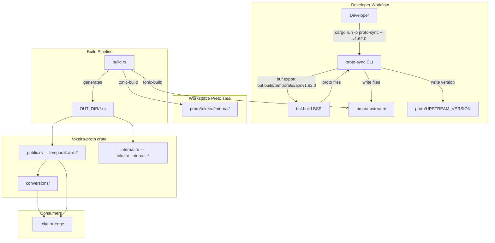

# Design Document: Proto Upstream Sync

## Overview

This feature replaces Tokeira's hand-written Temporal API proto subset with the full upstream proto tree vendored from `buf.build/temporalio/api`. It introduces three coordinated changes:

1. A Rust CLI tool (`tools/proto-sync`) that uses `buf export` to fetch a tagged version of the Temporal API protos and vendor them into `proto/upstream/`.
2. An updated `build.rs` that compiles the full upstream proto tree (including transitive `google/protobuf` and `google/api` dependencies) from the workspace-level `proto/` directory.
3. An expanded `public.rs` that re-exports the complete `temporal.api.*` module hierarchy while preserving backward-compatible convenience aliases.

The translation layer in `tokeira-proto/src/conversions/` and `tokeira-edge/src/translate/` is then migrated to use the upstream-generated types, and the duplicate crate-local proto tree (`crates/tokeira-proto/proto/`) is removed.

After this work, updating to a new Temporal API version is a single `cargo run -p proto-sync -- v1.63.0` invocation followed by a commit.

## Architecture



The sync CLI is a standalone workspace binary with no runtime coupling to the rest of the system. It shells out to `buf` (which must be installed on the developer's machine) and writes files to disk. The build pipeline has zero dependency on `buf` — it reads `.proto` files directly from the vendored tree.

## Components and Interfaces

### 1. Proto Sync CLI (`tools/proto-sync`)

A small Rust binary that orchestrates the upstream fetch.

```rust
// tools/proto-sync/src/main.rs (sketch)

fn main() -> anyhow::Result<()> {
    let version = parse_version_arg()?;       // e.g. "v1.62.0"
    let workspace_root = find_workspace_root()?;
    let upstream_dir = workspace_root.join("proto/upstream");
    let version_file = workspace_root.join("proto/UPSTREAM_VERSION");

    // 1. Clean previous vendor tree
    clean_upstream_dir(&upstream_dir)?;

    // 2. Export from BSR via buf CLI
    buf_export(&version, &upstream_dir)?;

    // 3. Write version file
    write_version_file(&version_file, &version)?;

    Ok(())
}
```

Key behaviors:
- Invokes `buf export buf.build/temporalio/api:<version> --output <upstream_dir>`.
- `buf export` resolves transitive dependencies (`google/protobuf`, `google/api`, `grpc/health`, etc.) and writes them alongside the Temporal protos.
- Cleans the target directory before writing to remove stale files from a previous version.
- Writes the version string (single line, no trailing newline) to `proto/UPSTREAM_VERSION`.
- Exits non-zero with a stderr message on any failure (network, invalid version, missing `buf`).
- Prints usage and exits non-zero if the version argument is omitted.

Cargo.toml for the tool:

```toml
[package]
name = "proto-sync"
version = "0.1.0"
edition = "2024"

[dependencies]
anyhow = "1"
```

The workspace `Cargo.toml` adds `"tools/proto-sync"` to the `members` list.

### 2. Build Script (`crates/tokeira-proto/build.rs`)

The updated build script discovers `.proto` files by walking the workspace-level `proto/upstream/` tree instead of listing files explicitly. This means new upstream packages are compiled automatically after a sync — no build.rs edits needed.

```rust
// Pseudocode for the updated build.rs

fn main() -> Result<(), Box<dyn std::error::Error>> {
    let workspace_root = find_workspace_root()?;
    let upstream_dir = workspace_root.join("proto/upstream");
    let internal_dir = workspace_root.join("proto/tokeira");

    // Discover all .proto files under upstream/
    let upstream_protos = glob_protos(&upstream_dir)?;

    // Rerun triggers
    println!("cargo:rerun-if-changed={}", upstream_dir.display());
    println!("cargo:rerun-if-changed={}", internal_dir.display());

    let out_dir = PathBuf::from(std::env::var("OUT_DIR")?);

    // Public surface — compile all upstream protos
    tonic_build::configure()
        .build_client(true)
        .build_server(true)
        .btree_map(["."])
        .file_descriptor_set_path(out_dir.join("tokeira_public_descriptor.bin"))
        .compile(&upstream_protos, &[&upstream_dir])?;

    // Internal surface — unchanged, but include paths updated
    let internal_protos = glob_protos(&internal_dir)?;
    tonic_build::configure()
        .build_client(true)
        .build_server(true)
        .btree_map(["."])
        .file_descriptor_set_path(out_dir.join("tokeira_internal_descriptor.bin"))
        .compile(
            &internal_protos,
            &[&workspace_root.join("proto"), &upstream_dir],
        )?;

    Ok(())
}
```

Key design decisions:
- **Workspace root discovery**: The build script locates the workspace root by walking up from `CARGO_MANIFEST_DIR` looking for the root `Cargo.toml` with `[workspace]`. This decouples the build from any hardcoded relative path.
- **Glob-based discovery**: Using `walkdir` or `std::fs` to find all `*.proto` files means the build script never needs updating when upstream adds new packages.
- **Include paths**: `proto/upstream/` is the sole include root for the public surface. The internal surface uses both `proto/` (for `tokeira.*` imports) and `proto/upstream/` (for any upstream type references from internal protos).
- **No `buf` dependency**: The build script uses `tonic-build` directly against vendored files. `protoc` is pulled in by `tonic-build`'s `prost-build` dependency (which bundles `protoc` via the `protobuf-src` feature or expects it on `PATH`).
- **Well-known type support**: The upstream protos use `google.protobuf.Timestamp` and `google.protobuf.Duration` extensively. `tonic-build` (via `prost-build`) maps these to `prost_types::Timestamp` and `prost_types::Duration` in generated Rust code. The `prost-types` crate must be added as a dependency of `tokeira-proto` for the generated code to compile. This is a build-blocking requirement that does not exist with the current hand-written protos (which use `int64` for timestamps and durations).

### 3. Public Module (`crates/tokeira-proto/src/public.rs`)

The updated module exports the full `temporal.api.*` hierarchy. Since `tonic-build` generates one Rust module per proto package, and the upstream tree contains ~20+ packages, the module uses a discovery-friendly structure.

```rust
// Expanded public.rs (sketch)

pub mod temporal {
    pub mod api {
        pub mod activity { pub mod v1 { tonic::include_proto!("temporal.api.activity.v1"); } }
        pub mod batch { pub mod v1 { tonic::include_proto!("temporal.api.batch.v1"); } }
        pub mod command { pub mod v1 { tonic::include_proto!("temporal.api.command.v1"); } }
        pub mod common { pub mod v1 { tonic::include_proto!("temporal.api.common.v1"); } }
        pub mod enums { pub mod v1 { tonic::include_proto!("temporal.api.enums.v1"); } }
        pub mod errordetails { pub mod v1 { tonic::include_proto!("temporal.api.errordetails.v1"); } }
        pub mod failure { pub mod v1 { tonic::include_proto!("temporal.api.failure.v1"); } }
        pub mod filter { pub mod v1 { tonic::include_proto!("temporal.api.filter.v1"); } }
        pub mod history { pub mod v1 { tonic::include_proto!("temporal.api.history.v1"); } }
        pub mod namespace { pub mod v1 { tonic::include_proto!("temporal.api.namespace.v1"); } }
        pub mod operatorservice { pub mod v1 { tonic::include_proto!("temporal.api.operatorservice.v1"); } }
        pub mod query { pub mod v1 { tonic::include_proto!("temporal.api.query.v1"); } }
        pub mod schedule { pub mod v1 { tonic::include_proto!("temporal.api.schedule.v1"); } }
        pub mod sdk { pub mod v1 { tonic::include_proto!("temporal.api.sdk.v1"); } }
        pub mod taskqueue { pub mod v1 { tonic::include_proto!("temporal.api.taskqueue.v1"); } }
        pub mod update { pub mod v1 { tonic::include_proto!("temporal.api.update.v1"); } }
        pub mod version { pub mod v1 { tonic::include_proto!("temporal.api.version.v1"); } }
        pub mod workflow { pub mod v1 { tonic::include_proto!("temporal.api.workflow.v1"); } }
        pub mod workflowservice { pub mod v1 { tonic::include_proto!("temporal.api.workflowservice.v1"); } }
        pub mod nexus { pub mod v1 { tonic::include_proto!("temporal.api.nexus.v1"); } }
        // Additional packages added by future syncs get a new entry here.
    }
}

// Backward-compatible convenience aliases (existing API preserved)
pub use temporal::api::common::v1 as common;
pub use temporal::api::enums::v1 as enums;
pub use temporal::api::history::v1 as history;
pub use temporal::api::operatorservice::v1 as operatorservice;
pub use temporal::api::workflowservice::v1 as workflowservice;

pub const FILE_DESCRIPTOR_SET: &[u8] =
    tonic::include_file_descriptor_set!("tokeira_public_descriptor");

// Service name constants (unchanged)
pub const WORKFLOW_SERVICE_NAME: &str = "temporal.api.workflowservice.v1.WorkflowService";
pub const OPERATOR_SERVICE_NAME: &str = "temporal.api.operatorservice.v1.OperatorService";
```

When a future sync introduces a new package (e.g. `temporal.api.compute.v1`), a developer adds one `pub mod` line to `public.rs`. This is the only manual step beyond running the sync CLI.

### 4. Translation Layer Migration

The conversion modules (`tokeira-proto/src/conversions/` and `tokeira-edge/src/translate/`) currently reference types from the hand-written proto subset. After migration they reference the same Rust paths — the generated types just come from the full upstream tree instead.

The migration is **not** a simple recompile-and-verify exercise. While the hand-written protos share package names with upstream, they diverge in important ways:

#### Well-known type field migrations (semantic type changes)

The hand-written protos use `int64` for timestamps and durations. The upstream protos use `google.protobuf.Timestamp` and `google.protobuf.Duration`. This changes the Rust field types:

| Field | Hand-written type | Upstream-generated type |
|-------|------------------|------------------------|
| `HistoryEvent.event_time` | `i64` (unix nanos) | `Option<prost_types::Timestamp>` |
| `*_timeout_millis` fields | `i64` (millis) | `Option<prost_types::Duration>` |
| `RetryPolicy.initial_interval_millis` | `i64` | `Option<prost_types::Duration>` |
| `TimerStartedEventAttributes.fire_at_unix_nanos` | `i64` | `Option<prost_types::Timestamp>` |

This requires conversion helpers, not just `..Default::default()`:

```rust
// Conversion helpers needed in tokeira-proto/src/conversions/common.rs

fn to_proto_timestamp(value: time::OffsetDateTime) -> prost_types::Timestamp {
    prost_types::Timestamp {
        seconds: value.unix_timestamp(),
        nanos: value.nanosecond() as i32,
    }
}

fn to_proto_duration(value: time::Duration) -> prost_types::Duration {
    prost_types::Duration {
        seconds: value.whole_seconds(),
        nanos: value.subsec_nanoseconds(),
    }
}
```

The `history_serializer.rs` currently calls `to_unix_nanos()` returning `i64` for `event_time`. After migration it must call `to_proto_timestamp()` returning `Option<prost_types::Timestamp>`. Similarly, all `*_millis` duration fields must be converted via `to_proto_duration()`. This affects every event attribute struct construction in the file (~1850 lines).

The `workflow.rs` conversion file in `tokeira-proto/src/conversions/` has the same pattern: `to_unix_nanos()` for `start_time_unix_nanos`, `close_time_unix_nanos`, etc. These fields will also change to `Option<prost_types::Timestamp>` in the upstream types.

#### New upstream fields (additive changes)

Beyond the type changes above, upstream types will have additional fields not present in the hand-written subset. These are handled with `..Default::default()` on struct literals.

#### Dead conversion files

`tokeira-proto/src/conversions/workflow.rs` and `operator.rs` exist as files but are **not exported** from `conversions/mod.rs` (which only has `pub mod common;`). The edge crate has its own inline copies of the same functions in `grpc/translate.rs`. These dead files should be either:
- Wired into `mod.rs` and migrated (if we want to consolidate), or
- Deleted as dead code

The recommended approach is to delete them now and consolidate later when the edge layer is refactored, since the edge crate's inline versions are the ones actually in use.

#### Scope of edge crate migration

The edge crate's `grpc/translate.rs` contains inline `to_unix_nanos()` and `execution_status_to_proto()` functions that will also need well-known type conversion updates. The `WorkflowExecutionInfo` struct construction uses `start_time_unix_nanos: i64` which will become `start_time: Option<prost_types::Timestamp>` in the upstream type.

### 5. Crate-Local Proto Tree Removal

After the build pipeline compiles from the workspace-level tree and all tests pass, the directory `crates/tokeira-proto/proto/` (including its `README.md`) is deleted. No code should reference it.

## Data Models

### Version File Format

```
proto/UPSTREAM_VERSION
```

Contents: a single line containing the version tag string, e.g. `v1.62.0`. No trailing newline. This file is committed to version control.

### Proto Tree Layout (after sync)

```
proto/
├── UPSTREAM_VERSION              # "v1.62.0"
├── upstream/
│   ├── temporal/
│   │   └── api/
│   │       ├── activity/v1/*.proto
│   │       ├── batch/v1/*.proto
│   │       ├── command/v1/*.proto
│   │       ├── common/v1/*.proto
│   │       ├── enums/v1/*.proto
│   │       ├── errordetails/v1/*.proto
│   │       ├── export/v1/*.proto
│   │       ├── failure/v1/*.proto
│   │       ├── filter/v1/*.proto
│   │       ├── history/v1/*.proto
│   │       ├── namespace/v1/*.proto
│   │       ├── nexus/v1/*.proto
│   │       ├── operatorservice/v1/*.proto
│   │       ├── query/v1/*.proto
│   │       ├── schedule/v1/*.proto
│   │       ├── sdk/v1/*.proto
│   │       ├── taskqueue/v1/*.proto
│   │       ├── update/v1/*.proto
│   │       ├── version/v1/*.proto
│   │       ├── workflow/v1/*.proto
│   │       └── workflowservice/v1/*.proto
│   ├── google/
│   │   ├── api/
│   │   │   ├── annotations.proto
│   │   │   ├── http.proto
│   │   │   └── ...
│   │   └── protobuf/
│   │       ├── any.proto
│   │       ├── duration.proto
│   │       ├── empty.proto
│   │       ├── timestamp.proto
│   │       ├── wrappers.proto
│   │       └── ...
│   └── grpc/
│       └── health/v1/health.proto   # if present as transitive dep
└── tokeira/
    └── internal/
        ├── admin/v1/service.proto
        └── runtime/v1/
            ├── command.proto
            ├── dispatch.proto
            └── projection.proto
```

### CLI Interface

```
proto-sync <version>

Arguments:
  <version>    Upstream version tag (e.g. v1.62.0)

Examples:
  cargo run -p proto-sync -- v1.62.0
```

### Build Script Workspace Root Discovery

The build script finds the workspace root by reading `CARGO_MANIFEST_DIR` and walking up until it finds a `Cargo.toml` containing `[workspace]`. This is a common pattern in multi-crate Rust workspaces and avoids hardcoding relative paths.

## Correctness Properties

*A property is a characteristic or behavior that should hold true across all valid executions of a system — essentially, a formal statement about what the system should do. Properties serve as the bridge between human-readable specifications and machine-verifiable correctness guarantees.*

Most acceptance criteria in this feature are infrastructure/tooling concerns (CLI invocation, file layout, build configuration, module re-exports) that are best validated by smoke tests, integration tests, and compilation checks. One criterion is suitable for property-based testing: the history serialization round-trip.

### Property 1: History event serialization round-trip

*For any* valid kernel `HistoryEvent` (across all event kinds, field values, and payload sizes), serializing it to proto bytes via `history_event_to_proto` + `prost::Message::encode` and then deserializing back via `prost::Message::decode` SHALL produce an equivalent proto `HistoryEvent` message.

**Validates: Requirements 6.4, 6.6**

This property exercises the full serialization pipeline and implicitly validates wire-format compatibility between the upstream-generated types and the hand-written subset they replace. Different event kinds (workflow started, activity scheduled, timer fired, child workflow initiated, etc.) exercise different attribute struct constructions, and varying payload sizes and field values cover edge cases in the conversion helpers.

## Error Handling

### Sync CLI Errors

| Scenario | Behavior |
|----------|----------|
| Missing version argument | Print usage to stderr, exit code 1 |
| Invalid version tag (not found on BSR) | Print "version not found" to stderr, exit code 1 |
| `buf` not installed or not on PATH | Print "buf command not found" to stderr, exit code 1 |
| Network failure during export | Propagate buf's error message to stderr, exit code 1 |
| Filesystem write failure (permissions, disk full) | Print IO error to stderr, exit code 1 |
| Partial sync (export succeeds but version file write fails) | The upstream dir may contain new files but UPSTREAM_VERSION is stale — developer should re-run |

The CLI uses `anyhow` for error propagation. All errors flow through `main() -> anyhow::Result<()>`, which prints the error chain to stderr and exits non-zero.

### Build Script Errors

| Scenario | Behavior |
|----------|----------|
| No `.proto` files found in upstream dir | `tonic-build` compile call returns an error; `cargo build` fails with a clear message |
| Missing transitive import (e.g. `google/protobuf/timestamp.proto` not vendored) | `tonic-build` reports unresolved import; `cargo build` fails |
| Workspace root not found | Build script panics with a descriptive message |

### Translation Layer Errors

The existing `ProtoConversionError` enum in `tokeira-proto/src/conversions/mod.rs` handles:
- Invalid UUIDs in wire values
- Invalid task tokens
- Invalid timestamp nanos
- Missing required fields

The well-known type conversion helpers (`to_proto_timestamp`, `to_proto_duration`) are infallible — they perform direct arithmetic on `time::OffsetDateTime` and `time::Duration` values. No new error variants are needed for the forward (domain → proto) direction. Upstream types that introduce new optional fields default to `None`/zero/empty, which the existing conversion code handles gracefully.

## Testing Strategy

### Approach

This feature spans tooling, build infrastructure, and code migration. The testing strategy reflects this:

1. **Smoke tests**: Verify the build compiles, modules are accessible, and file layout is correct.
2. **Example-based unit tests**: Verify specific behaviors (stale file cleanup, version file format, error messages).
3. **Integration tests**: Verify the full sync → build → test pipeline works end-to-end.
4. **Property-based tests**: Verify the history serialization round-trip across all event kinds.

### Unit Tests

- **Version file format**: After writing, file contains exactly the version string.
- **Stale file cleanup**: Pre-existing files in upstream dir are removed before new sync.
- **CLI argument parsing**: Missing version prints usage; valid version proceeds.
- **Struct default fields**: Upstream types with new fields default correctly when constructed with `..Default::default()`.

### Integration Tests

- **Full sync pipeline**: `cargo run -p proto-sync -- <version>` produces the expected file tree.
- **Build from workspace tree**: `cargo build -p tokeira-proto` succeeds after sync.
- **Backward compatibility**: Existing convenience aliases (`common`, `enums`, `history`, etc.) resolve to the same types.
- **Full workspace build**: `cargo build` and `cargo test` pass after migration.

### Property-Based Tests

Property-based testing applies to the history serialization round-trip (Property 1). The test library is `proptest` (already idiomatic in the Rust ecosystem and compatible with the workspace's test infrastructure).

Configuration:
- Minimum 100 iterations per property test
- Custom `Arbitrary` / `proptest::Strategy` implementations for `HistoryEvent` and `HistoryEventKind` to generate valid events across all variant kinds
- Each property test tagged with a comment referencing the design property

Tag format: **Feature: proto-upstream-sync, Property 1: History event serialization round-trip**

```rust
// Sketch of the property test
proptest! {
    // Feature: proto-upstream-sync, Property 1: History event serialization round-trip
    #![proptest_config(ProptestConfig::with_cases(100))]
    #[test]
    fn history_event_round_trip(event in arb_history_event()) {
        let proto_event = history_event_to_proto(&event);
        let bytes = proto_event.encode_to_vec();
        let decoded = history::HistoryEvent::decode(&bytes[..]).unwrap();
        prop_assert_eq!(proto_event, decoded);
    }
}
```

### What Is NOT Property-Tested

- CLI behavior (external process invocation, file I/O) → integration tests
- Build script correctness (tonic-build invocation) → compilation smoke tests
- Module re-export structure → compilation smoke tests
- File layout after sync → integration tests
- buf.yaml configuration → static analysis / smoke tests

These are infrastructure and configuration concerns where behavior doesn't vary meaningfully with input, making PBT inappropriate.

