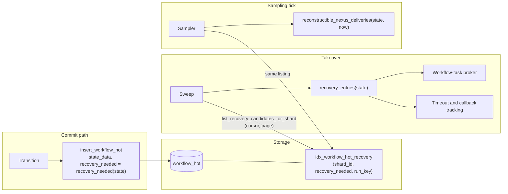

# Design Document: Recovery Index

## Overview

Each `workflow_hot` row gains a nullable boolean, `recovery_needed`, written by the same statement that writes the row's state and set to a pure predicate of that state. An asynchronous index on `(shard_id, recovery_needed, run_key)` lets the repository list a shard's Candidates in run-key order with a cursor. The Sweep and the Sampler replace their full-shard reads with that paged listing, decode each Candidate's state once, and derive every entry from it through one shared function.

Nothing a run's recovery produces changes: the entries, broker publications and tracking inserts are the ones the per-kind listings yield today. What changes is which rows are read, how often each is decoded, and how many are held in memory at once.

## Dependencies and Non-Goals

- **Builds on** runtime-sweeper-recovery (the Sweep and its entry types) and dsql-core-persistence (`workflow_hot`, the commit path). It amends runtime-sweeper-recovery Requirements 8.5, 10.5 and 14, which name listings this design removes.
- **Enables** persisting each activity's last heartbeat time: once activity entries come from the run's state, that time can travel in the state rather than in the `activity_state` side table.
- **Non-goals:** durable task rows; volatile state the Sweep does not rebuild today; timers and activity dispatch rows (durable, with their own paged listings and scanners); a backfill of Legacy_Rows.

## Architecture



The Candidate listing on DSQL runs in two phases behind one cursor: Legacy_Rows (`recovery_needed IS NULL`) first, then flagged rows (`recovery_needed = true`). Writes only ever set a non-NULL value, so a Legacy_Row written during a listing moves to the flagged phase, which has not yet run; a row that becomes `false` holds no Recovery_Work, so skipping it is correct. While a shard is sweeping it admits no commands, so a row cannot gain Recovery_Work mid-listing except through work already in flight on live paths.

## Components and Interfaces

### Migrations (`crates/tokeira-storage/migrations/`)

- `V072__workflow_hot_recovery_needed.sql`: `ALTER TABLE workflow_hot ADD COLUMN IF NOT EXISTS recovery_needed BOOLEAN;`
- `V073__idx_workflow_hot_recovery.sql`: `CREATE INDEX ASYNC IF NOT EXISTS idx_workflow_hot_recovery ON workflow_hot (shard_id, recovery_needed, run_key);`

Both pass `DdlValidator`. They follow V068's path: the baseline lock, both schema-contract files (target and maximum readable version, migration-set digest), the migration runner's expected head and the schema-bootstrap tests move to V073.

### Shared derivation (`crates/tokeira-storage/src/recovery_index.rs`)

```rust
/// Whether `state` holds work the Sweep or the Sampler rebuilds (Recovery_Work).
pub fn recovery_needed(state: &WorkflowState) -> bool;

/// Everything the Sweep derives from one run's state.
pub struct RecoveryEntries {
    pub dispatchable_workflow_task: Option<DispatchableWorkflowTask>,
    pub workflow_timeout: Option<WorkflowTimeoutSweepEntry>,
    pub started_workflow_task: Option<WftTimeoutSweepEntry>,
    pub activities: Vec<ActivitySweepEntry>,
    pub nexus_timeouts: Vec<NexusSweepEntry>,
    pub completion_callbacks: Vec<CompletionCallbackSweepEntry>,
}

/// Derive every Sweep entry from one decoded state.
pub fn recovery_entries(state: &WorkflowState) -> RecoveryEntries;
```

`recovery_entries` folds the per-kind rules of `collect_*` and `dispatchable_workflow_task` into one pass over one state, unchanged:

| Entry | Derived when |
|---|---|
| dispatchable workflow task | status `Running`, pending workflow task not started (existing `dispatchable_workflow_task`) |
| workflow timeout | status open and an execution or run timeout set |
| started workflow task | pending workflow task with a started event id and start time |
| activities | status open: one entry per activity in `state.activities` |
| Nexus timeouts | status open: one entry per pending operation with any timeout |
| completion callbacks | one entry per callback in `Scheduled` or `BackingOff`, any status |

`reconstructible_nexus_deliveries(state, now)` (`api.rs`) stays the Sampler's derivation. `recovery_needed` is the disjunction of the table's conditions plus "status open with a pending Nexus operation", which covers every reconstructible delivery. Activity entries come from the run's state, not from `activity_state`, and so exclude the activities a closed run keeps.

### RunRepository

```rust
/// Where a Candidate listing resumes. Opaque to callers.
#[derive(Clone, Debug, PartialEq, Eq)]
pub struct RecoveryCursor { /* phase and last run key read */ }

/// One page of a shard's Candidates, in run-key order within a phase.
pub struct RecoveryPage {
    pub states: Vec<WorkflowState>,
    /// The cursor for the next page, or `None` once the listing is complete.
    pub next: Option<RecoveryCursor>,
}

async fn list_recovery_candidates_for_shard(
    &self,
    shard_id: ShardId,
    cursor: Option<&RecoveryCursor>,
    limit: usize,
) -> Result<RecoveryPage>;
```

Removed from the trait, the stores, the `Arc` and edge delegates and the test doubles: `list_dispatchable_workflow_tasks_for_shard`, `list_runs_with_workflow_timeouts_for_shard`, `list_started_workflow_tasks_for_shard`, `list_open_activities_for_shard`, `list_pending_nexus_operations_for_shard`, `list_reconstructible_nexus_deliveries_for_shard` and `list_runs_with_pending_completion_callbacks_for_shard`.

**DSQL.** `insert_workflow_hot` adds `recovery_needed` to its column list and to `ON CONFLICT ... DO UPDATE SET`, bound to `recovery_needed(state)`; the statement count is unchanged. The listing:

```sql
-- phase Legacy, then phase Flagged (recovery_needed = true); the first page of a
-- phase omits the run_key bound
SELECT run_key, state_data
FROM workflow_hot
WHERE shard_id = $1 AND recovery_needed IS NULL AND run_key > $2
ORDER BY run_key ASC
LIMIT $3
```

The phase and cursor logic is a pure function over a "fetch one page of a phase" step, so it is unit-tested without a database. A page shorter than `limit` ends its phase; the cursor then moves to the next phase or, after the flagged phase, to `None`.

**In-memory store.** No Legacy_Rows: the listing filters the shard's runs by `recovery_needed`, orders them by run key, and applies the same cursor and page contract.

### Sweep (`crates/tokeira-runtime/src/recovery.rs`)

`sweep_shard` keeps its activity-dispatch and due-timer passes. It replaces the six per-kind reads with one loop over Candidate pages of `RECOVERY_PAGE` (100) states. For each state it calls `recovery_entries` and performs the same publication and tracking inserts as today: the workflow-task broker, workflow-timeout, workflow-task-timeout, activity, Nexus and completion-callback tracking. It holds one page of states at a time.

### Sampler (`crates/tokeira-runtime/src/worker_compute/sampling.rs`)

For each active shard, the Sampler pages through Candidates and counts `reconstructible_nexus_deliveries(state, now)` per worker-compute queue, as it does today from the replaced listing.

## Data Models

| Field | Type | Written by | Meaning |
|---|---|---|---|
| `workflow_hot.recovery_needed` | `BOOLEAN NULL` | `insert_workflow_hot`, every write | `recovery_needed(state)` of the state in `state_data`; NULL only on Legacy_Rows |
| `RecoveryCursor` | in-memory | the repository | listing phase (DSQL) and the last run key read |

No kernel type changes, and no stored blob changes layout.

## Correctness Properties

### Property 1: The predicate covers every derived entry

*For any* `WorkflowState` `s` and *for any* time `now`, if `recovery_entries(s)` holds any entry or `reconstructible_nexus_deliveries(s, now)` is non-empty, then `recovery_needed(s)` SHALL be true.

**Validates: Requirements 1.3, 7.1, 7.3**

### Property 2: Paging returns every Candidate exactly once, in order

*For any* set of runs in a shard and *for any* page size of at least one, concatenating the pages of one in-memory listing SHALL yield exactly the runs whose state satisfies `recovery_needed`, each once, in run-key order.

**Validates: Requirements 2.2, 2.3, 2.4, 6.1**

### Property 3: Phases end in order and resume strictly after the cursor

*For any* sequence of phase results, the DSQL listing's cursor logic SHALL read the Legacy phase to exhaustion before the Flagged phase, resume each page strictly after the previous page's last run key, and return `None` only after a short page of the Flagged phase.

**Validates: Requirements 2.3, 2.5, 3.1**

### Property 4: The stored flag matches the committed state

*For any* transition committed through the in-memory store, the run SHALL be listed as a Candidate exactly when `recovery_needed(next_state)` holds. For DSQL, the `workflow_hot` write SHALL bind `recovery_needed(state)` for the state it encodes.

**Validates: Requirements 1.2, 7.2**

### Property 5: The Sweep's reconstruction is unchanged

The Sweep's existing properties (runtime-sweeper-recovery Properties 5–11: workflow-task, activity and timer completeness, sticky fallback, activity, workflow and Nexus tracking reconstruction) SHALL hold unchanged on the paged Sweep.

**Validates: Requirements 4.2, 4.3, 4.4**

## Error Handling

| Condition | Behaviour |
|---|---|
| Listing query fails | The error propagates and the Sweep fails, as a failed per-kind read does today |
| A Candidate's state fails to decode | The error propagates (a corrupt blob is a storage error), as in today's `collect_*` |
| A Candidate yields no entries (a Legacy_Row, or a flag set by an older predicate) | Skipped |
| Index still building after V073 | The listing is correct and slower; DSQL serves it with a scan until `CREATE INDEX ASYNC` completes |

## Testing Strategy

- **Property tests:** Property 1 over generated states covering every Recovery_Work kind, including closed runs with callbacks and kept activities. Property 2 over the in-memory store with random runs and page sizes. Property 3 over the pure cursor logic. Property 4 over in-memory commits.
- **Unit tests:** `recovery_entries` for each row of the derivation table; `insert_workflow_hot` binds the predicate; the migrations pass `DdlValidator` and the schema-bootstrap tests.
- **Regression:** runtime-sweeper-recovery's sweep property tests and the Sampler's tests run unchanged on the paged implementation (Property 5).
- **Needs live DSQL:** the planner's use of `idx_workflow_hot_recovery` for both phases, and the index build time on a large table.
