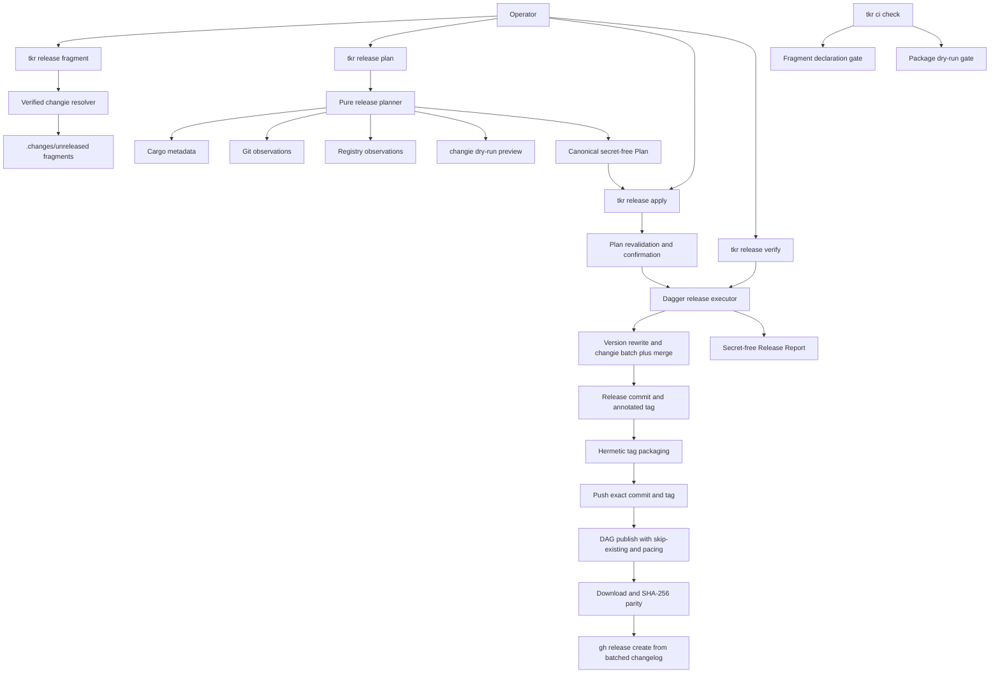
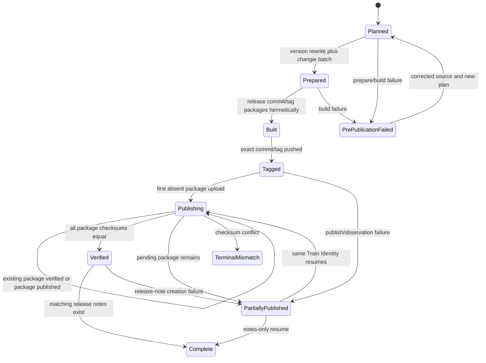

# Design Document: Release Engineering

## Overview

This design adds a workspace-generic release control plane to `tkr` and a Dagger-backed
release executor to `tokeira-build`. The control plane resolves one workspace, produces
a canonical secret-free Plan, renders confirmation, and exports reports. The executor
owns all command execution: changie, Cargo package verification, Git release-object
creation, registry publication, registry download, checksum comparison, and GitHub
release creation.

The design uses current tool contracts rather than release-script conventions:

- Cargo packages and verifies the source archive, uploads one package at a time, and
  can time out while waiting for an upload that already succeeded. The state machine
  therefore observes registry state before every upload and after every ambiguous
  response.
- crates.io versions are immutable. An Existing Package is accepted only when its
  downloaded bytes match the Hermetic Tag Build.
- changie `v1.25.2` renders one version file from conflict-free YAML fragments, then
  merges that version into root `CHANGELOG.md`.
- `gh release create --verify-tag --notes-file` refuses tag synthesis and consumes the
  deterministic notes produced by this design.

No GitHub Actions surface exists. The operator invokes `tkr`; `tkr` drives Dagger; the
Dagger graph is the only release-train executor. Local fragment authoring is the sole
host tool path and cannot publish, tag, or create a release.

## Dependencies and Non-Goals

### Owning relationships

- The existing release-process governance spec owns build provenance, pin
  monotonicity, and the reusable Dagger CI shape. This design consumes
  `run_ci_checks` and adds only `ChangelogFragments` and `PackageDryRun`.
- `crates/tokeira-build/src/dagger_release.rs` supplies the pattern for one external
  release pin, checksum-verified acquisition, and fail-closed version admission.
- Cargo metadata owns workspace membership, publish fencing, dependency edges,
  manifest paths, package versions, and `rust-version`.
- changie owns fragment validation and deterministic fragment-to-version rendering.
  Tokeira owns when the tool runs, the exact config, and the release state machine.
- The Git remote owns commit/tag visibility. crates.io owns package/version existence
  and checksum metadata. GitHub releases own the final announcement object. None of
  these projections substitutes for another.
- `tokeira/tokeira` owns the `tkr` implementation and changie pin. Odori pins a full
  Tokeira source revision and consumes the binary outside its Cargo dependency graph.

### Non-goals

- Token issuance or account procedure.
- Trusted Publishing or an OIDC issuer.
- Hosted workflows, scheduled releases, or release-on-tag automation.
- Alternate registries, pre-release channels, or package-specific versions.
- Automatic changelog prose generation from commit messages or pull requests.
- Automatically repairing a conflicting tag, registry artifact, or existing release.
- Editing dependency membership as part of version preparation.

## Architecture



`tkr` is the control plane. It may inspect inputs, resolve the operator's secret at the
last responsible moment, attach that value to Dagger as a secret, and render sanitized
results. It does not run a host `cargo publish`, host changie, or host `gh release`.

The release state has three authorities:

1. The Release Tag is source authority.
2. The registry download bytes are package authority.
3. The changie version file in the tag is release-note authority.

Plan and Release Report are evidence about those authorities, not replacement state.

## Command Shape

```text
tkr release fragment [--workspace-root <path>] [--kind <kind>] [--body <text>]
tkr release plan [--workspace-root <path>] --version <semver>
                 [--base-ref <git-ref>] [--output <path>]
tkr release apply [--workspace-root <path>] --plan <path>
                  [--token-env <name>] [--yes]
tkr release verify [--workspace-root <path>] --version <semver>
                   [--output <path>]
```

`fragment` is the local authoring entry point and the only release sub-verb that exists
outside the train. `plan` admits and previews a train. `apply` is the only mutating
train command. `verify` rebuilds and checks all postconditions without a registry
credential.

For Tokeira, the binary is the in-tree `cargo run --locked -p tkr -- release ...`
target. For Odori, a repository-owned bootstrap reads a full Tokeira revision from a
non-Cargo pin file, installs `tkr` with locked Git-source Cargo installation into the
operator cache, verifies `tkr version --json`, then forwards the identical release
arguments with the Odori root. The bootstrap never edits `Cargo.toml` or `Cargo.lock`.

## Repository Release Configuration

Each repository commits root `.tokeira-release.toml`. Strict deserialization rejects
unknown keys. The common shape is:

```toml
schema_version = 1
release_branch = "main"

[[extra_version_fields]]
path = "<workspace-relative-toml-path>"
key = ["<table>", "<version-field>"]
```

`extra_version_fields` is empty when Cargo metadata owns every version. It admits only
workspace-relative TOML files and an exact scalar key path. The preparer requires the
old scalar to equal the current Unified Version and replaces it with the target version;
there is no regex or command hook.

Odori additionally carries:

```toml
[tkr]
repository = "<tokeira-git-source>"
revision = "<full-40-hex-commit>"
```

Tokeira's in-tree config forbids the `tkr` table. This keeps the engine repository as
the single tool source and prevents the cross-repository bootstrap from entering
Odori's Cargo dependency graph.

## Changie Configuration

Both repositories commit byte-equivalent copies of this policy (comments and final
newlines included in the config digest):

```yaml
changesDir: .changes
unreleasedDir: unreleased
headerPath: header.tpl.md
changelogPath: CHANGELOG.md
versionExt: md
versionFormat: '## {{.Version}} on {{.Time.Format "2006-01-02"}}'
fragmentFileFormat: '{{.Kind}}-{{.Custom.Slice}}'
kindFormat: '### {{.Kind}}'
changeFormat: '* {{.Body}}'
body:
  minLength: 8
  maxLength: 180
custom:
  - key: Slice
    label: Fragment slice identifier
    type: string
    minLength: 36
    maxLength: 36
kinds:
  - label: Added
    key: added
  - label: Changed
    key: changed
  - label: Deprecated
    key: deprecated
  - label: Removed
    key: removed
  - label: Fixed
    key: fixed
  - label: Security
    key: security
  - label: Internal
    key: internal
    skipBody: true
    format: '{{- "" -}}'
    changeFormat: '{{- "" -}}'
newlines:
  afterChangelogHeader: 1
  afterKind: 1
  afterChangelogVersion: 1
  beforeKind: 1
  endOfVersion: 1
```

The byte-equivalent header template is exactly:

```markdown
# Changelog

All notable user-facing changes to this project are documented here.
```

There are no components or repository names in the shared configuration. `tkr` embeds
the canonical SHA-256 of `.changie.yaml` plus `.changes/header.tpl.md` in sorted relative
path order; each selected workspace must match it. This makes either repository's local
comparison sufficient to prove it uses the shared config set.

For each `fragment` invocation, `tkr` generates a lowercase UUID version 4 and supplies
it to `changie new` as `--custom Slice=<generated-uuid>`. Changie's tagged `cmd/new.go`,
`core/prompt.go`, and `core/change.go` sources at `v1.25.2` verify that this value is
validated, retained in the fragment, and available to `fragmentFileFormat`. The
generated identity keeps concurrently authored fragments on separate paths without
asking an author to coordinate a sequence number.

The `internal` kind is the deliberate escape hatch. The CI gate does not attempt to
infer whether a diff is user-visible; such classification is unstable across languages
and refactors. Every coherent slice declares intent in a fragment, and `internal`
records the explicit no-changelog decision while its non-empty per-kind templates
render empty output. This detail is deliberate: `KindHeader` and
`ChangeFormatForKind` in tagged `core/config.go @ v1.25.2` fall back to the root
template when a per-kind override is the empty string. A release that contains only
internal fragments still produces a version heading, preserving the fact that a
version shipped.

The proposed one-line constitution rule, to be landed by the operator after spec
approval, is:

> Every coherent change slice adds one `.changes/unreleased/` changie fragment; use the
> `internal` kind when no user-facing changelog entry is warranted.

## Changie Release Pin

The pin lives once in `crates/tokeira-build/src/changie_release.rs`, parallel to the
existing Dagger release pin. The upstream GitHub release API publishes these SHA-256
digests for `v1.25.2`:

| Platform key | Upstream asset | SHA-256 |
|---|---|---|
| `macos-x86_64` | `changie_1.25.2_darwin_amd64.tar.gz` | `729561d13d45c2cdf0daef2c6eb494bf185135747bbdf600e4e0e586683f372b` |
| `macos-aarch64` | `changie_1.25.2_darwin_arm64.tar.gz` | `03205b2ddc042458693e4e8e1d663d0bcc1cec9c519e15e92c8b81a286e0977e` |
| `linux-x86_64` | `changie_1.25.2_linux_amd64.tar.gz` | `7489b5a6a595e5a9f8b0d392114b10c130634639ef1190fafb2f15a5cd9058cd` |
| `linux-aarch64` | `changie_1.25.2_linux_arm64.tar.gz` | `84c3f158906da24f9a4941518dcf55a2badf9524bfb9579c78b5e7876ae675fa` |

The pin also carries the exact source revision
`8406ffac34697bd95d153550d0423e403fac9a90`. Each download is admitted only after its
archive digest matches and `changie --version` reports `1.25.2`.

Local authoring caches the extracted binary beneath the platform cache directory at a
content-derived path equivalent to `tkr/tools/changie/1.25.2/<asset-sha256>/changie`.
The resolver uses an inter-process lock and atomic rename, reusing the existing engine
bootstrap pattern. It never falls back to `PATH`. Dagger acquisition uses the same pin
but selects the executor's Linux architecture and keeps the binary within the Dagger
graph.

## Components and Interfaces

### CLI shape (`apps/tkr/src/cli.rs`)

```rust
#[derive(Args)]
pub(crate) struct ReleaseArgs {
    #[command(subcommand)]
    pub command: ReleaseCommand,
}

#[derive(Subcommand)]
pub(crate) enum ReleaseCommand {
    Fragment(FragmentArgs),
    Plan(ReleasePlanArgs),
    Apply(ReleaseApplyArgs),
    Verify(ReleaseVerifyArgs),
}
```

All path arguments use `PathBuf`; version input remains a string at the clap edge and
is parsed by the release library. The CLI contains no credential value field. Apply
accepts only `token_env: Option<String>`.

### Command handler (`apps/tkr/src/commands/release/mod.rs`)

```rust
pub(crate) async fn run(command: ReleaseCommand, global_json: bool) -> anyhow::Result<()>;

fn require_release_confirmation(
    plan: &ReleasePlan,
    yes: bool,
    interactive: bool,
) -> anyhow::Result<()>;
```

The handler resolves the workspace, renders the Plan, applies the existing
confirmation convention, resolves the named environment variable after confirmation,
wraps it directly as a Dagger secret, and drops the host string after the session is
created. After parity, it resolves the fixed `GH_TOKEN` environment value only if a
release object still needs creation and supplies that value as a second Dagger secret.
Neither value enters an error context or `Debug` implementation.

### Tool resolver (`apps/tkr/src/commands/release/changie.rs`)

```rust
pub(crate) async fn pinned_changie() -> anyhow::Result<PathBuf>;

pub(crate) async fn create_fragment(
    workspace_root: &Path,
    kind: Option<&str>,
    body: Option<&str>,
) -> anyhow::Result<PathBuf>;
```

This host-side exception exists only for local fragment authoring. It runs the exact
verified binary with `changie new`, passing non-interactive values as arguments only
when supplied by the user. Release batching itself always runs in Dagger.

### Release pin (`crates/tokeira-build/src/changie_release.rs`)

```rust
#[derive(Clone, Copy, Debug, Eq, PartialEq)]
pub struct ChangieAsset {
    pub platform: &'static str,
    pub name: &'static str,
    pub url: &'static str,
    pub sha256: &'static str,
}

#[derive(Clone, Copy, Debug, Eq, PartialEq)]
pub struct ChangieRelease {
    pub version: &'static str,
    pub source_revision: &'static str,
    pub assets: &'static [ChangieAsset],
}

pub const CHANGIE_RELEASE: ChangieRelease;
```

### Planner (`crates/tokeira-build/src/pipelines/release/plan.rs`)

```rust
pub fn plan_release(
    request: &ReleasePlanRequest,
    observations: &dyn ReleaseObservations,
) -> Result<ReleasePlan, ReleaseError>;

pub trait ReleaseObservations: Send + Sync {
    fn git(&self, request: &ReleasePlanRequest) -> Result<GitObservation, ReleaseError>;
    fn registry(
        &self,
        package: &PackageIdentity,
    ) -> Result<RegistryObservation, ReleaseError>;
}
```

Cargo metadata parsing, graph construction, stable topological sorting, fragment
inventory, version rewrite planning, notes preview, and canonical digesting are pure
functions. Git and registry reads cross the trait seam. The real implementation obtains
those reads through the Dagger session; tests use generated observations.

Plan digesting uses canonical JSON: object fields are in schema order, maps are
`BTreeMap`, package and fragment arrays have defined order, and paths are workspace
relative. `workspace_root` and advancing external observations are excluded. The digest
therefore identifies intent, not one machine or one instant.

### Source preparer (`crates/tokeira-build/src/pipelines/release/prepare.rs`)

```rust
pub fn prepare_release_source(
    plan: &ReleasePlan,
    source: &dyn ReleaseSource,
) -> Result<PreparedRelease, ReleaseError>;
```

The preparer operates in an isolated Dagger source directory. It uses structured TOML
editing to update the workspace version and every version requirement on an internal
publishable edge. It does not call Cargo's dependency-editing commands. Repository-owned
non-Cargo version fields are declared through a small checked replacement list in
release configuration; every replacement must match exactly once or preparation fails.

The preparer then runs:

```text
changie batch <target-version> --allow-no-changes=false
changie merge
```

It verifies that the resulting diff is limited to admitted version fields, configured
replacement fields, consumed fragments, the generated version file, `CHANGELOG.md`, and
the lockfile changes produced by the pinned Cargo version. Only a complete validated
diff can be exported to the operator checkout and committed.

### Release executor (`crates/tokeira-build/src/pipelines/release/apply.rs`)

```rust
pub async fn apply_release(
    request: &ReleaseApplyRequest,
    dagger: &dyn ReleaseDaggerClient,
) -> Result<ReleaseReport, ReleaseError>;

pub async fn verify_release(
    request: &ReleaseVerifyRequest,
    dagger: &dyn ReleaseDaggerClient,
) -> Result<ReleaseReport, ReleaseError>;
```

`ReleaseDaggerClient` is the test seam around Dagger operations. The production
implementation constructs one graph from the tagged source. A secret is an opaque
handle in `ReleaseApplyRequest`, never a serializable string.

### CI extensions (`crates/tokeira-build/src/pipelines/ci.rs`)

`CiCheck` gains `ChangelogFragments` and `PackageDryRun`. The fragment check computes
the selected diff from the admitted base ref. Any non-release diff requires at least
one newly added valid fragment. A release diff is admitted only when a reference-model
batch of the base fragments produces exactly the observed fragment deletion, version
file, and `CHANGELOG.md` transition.

The package check calls Cargo's locked publish dry-run independently for every
Publishable Package in topological order. It additionally inspects normalized packaged
manifests so path-only normal/build dependencies cannot hide behind a host workspace.
The existing `CiCheckReport` surface remains unchanged.

### Git gateway

The Git phase creates the Release Commit and annotated Release Tag in isolation, then
performs the Hermetic Tag Build before any remote push. If packaging succeeds, it
pushes the exact commit and tag. A matching remote tag is a resume observation; a tag
pointing elsewhere is a conflict. The implementation never moves or deletes a remote
tag.

### Registry gateway

For each package in order:

1. Observe package/version metadata.
2. If present, download and verify it; mark `existing-verified`.
3. If absent, run locked Cargo publish from the tag source with the Dagger secret.
4. Observe until metadata and download bytes are available.
5. Verify the three-way checksum equality; mark `published`.
6. Start the 600-second minimum cooldown before another upload request.

Existing-package verification is not paced because it sends no upload. A Cargo polling
timeout is ambiguous, not failure proof: the gateway observes first. A registry
`Retry-After` greater than the remaining cooldown wins. Only one upload request can be
in flight.

### Release-note gateway

After all packages have parity, the executor reads the changie version file from the
tag, appends the minimum-Rust statement, and appends the package inventory sorted by
package name. Package names link to their crates.io pages; a separate README column
uses each version's registry README URL. The generated notes file exists only in the
Dagger graph.

Creation uses the equivalent of:

```text
gh release create <tag> --verify-tag --title <tag> --notes-file <generated-notes>
```

An existing release is fetched first. Matching tag, target, and notes digest mean
success; any difference is `ReleaseConflict`. The gateway does not edit releases.
Authentication is the fixed `GH_TOKEN` environment value injected as a Dagger secret
after parity; no credential file or host `gh` session is mounted.

## Train State Machine



Once any package exists, source identity and target version are immutable. There is no
rollback path because registry versions cannot be overwritten. A checksum mismatch is
terminal for that version. Any corrective change uses a new version and a new Plan.

## Data Models

```rust
#[derive(Clone, Debug, Eq, PartialEq, Serialize, Deserialize)]
pub struct ReleasePlan {
    pub schema_version: u32,
    pub repository: RepositoryIdentity,
    pub workspace_root: PathBuf,
    pub base_commit: String,
    pub target_version: String,
    pub tag: String,
    pub packages: Vec<PackagePlan>,
    pub fragments: Vec<FragmentIdentity>,
    pub changelog_config_sha256: String,
    pub changie_release: ChangieIdentity,
    pub toolchain: ToolchainIdentity,
    pub release_notes_sha256: String,
    pub effects: Vec<ReleaseEffect>,
    pub digest: String,
}

#[derive(Clone, Debug, Eq, PartialEq, Serialize, Deserialize)]
pub struct PackagePlan {
    pub name: String,
    pub manifest_path: PathBuf,
    pub from_version: String,
    pub target_version: String,
    pub publishable_dependencies: Vec<String>,
    pub registry: PlannedRegistryState,
}

#[derive(Clone, Debug, Eq, PartialEq, Serialize, Deserialize)]
pub enum PlannedRegistryState {
    Absent,
    Existing { checksum: String },
}

#[derive(Clone, Debug, Eq, PartialEq, Serialize, Deserialize)]
pub struct ReleaseReport {
    pub schema_version: u32,
    pub train: TrainIdentity,
    pub state: TrainState,
    pub packages: Vec<PackageResult>,
    pub tag: TagResult,
    pub release_notes: ReleaseNotesResult,
    pub diagnostics: Vec<ReleaseDiagnostic>,
}

#[derive(Clone, Copy, Debug, Eq, PartialEq, Serialize, Deserialize)]
pub enum PackageOutcome {
    Published,
    ExistingVerified,
    Pending,
    Failed,
}

#[derive(Clone, Copy, Debug, Eq, PartialEq, Serialize, Deserialize)]
pub enum TrainState {
    Planned,
    PrePublicationFailed,
    PartiallyPublished,
    TerminalMismatch,
    Complete,
}
```

Every path serialized in a portable identity is workspace-relative. External URLs are
normalized and stripped of user-info. `ReleaseReport` has no secret field. The opaque
Dagger secret handle is held only by the live apply request and lacks `Serialize` and a
value-bearing `Debug` representation.

## Correctness Properties

### Property 1: Workspace-generic deterministic package plan

*For any* admitted Cargo workspace graph with an acyclic publishable subgraph, planning
SHALL return every Publishable Package exactly once in a valid topological order, use a
lexical tie break, and return the same portable Plan for isomorphic Tokeira and Odori
workspace shapes regardless of absolute root path.

**Validates: Requirements 1.2, 1.3, 1.4, 2.3, 2.5, 8.1, 8.2, 12.5**

### Property 2: Canonical Plan determinism and secret independence

*For any* admitted source inputs and external observations, repeated planning SHALL
produce identical canonical bytes and digest across host roots, and varying a registry
token value SHALL not change Plan bytes, digest, or confirmation text.

**Validates: Requirements 2.1, 2.6, 2.7, 2.8, 2.12, 7.2, 7.6**

### Property 3: Confirmation is a mutation fence

*For any* planned train and generated Git/registry/release state, declining
confirmation, omitting `--yes` non-interactively, or presenting drift SHALL leave all
modeled source and external state identical to its pre-apply value.

**Validates: Requirements 2.7, 2.8, 2.9, 2.10, 2.11, 3.10**

### Property 4: Unified version rewrite preserves dependency membership

*For any* admitted workspace manifest set and greater stable target version, source
preparation SHALL update every Publishable Package and every internal publishable edge
to exactly the target version while preserving all unrelated dependency entries,
features, sources, and ordering.

**Validates: Requirements 3.1, 3.2, 3.3, 3.4, 12.6, 12.7**

### Property 5: Fragment gate is complete and explicit

*For any* generated base/tip diff, the changelog gate SHALL accept a non-release diff
exactly when it adds at least one pinned-valid fragment, accept a release diff exactly
when it equals the reference changie batch-and-merge transition, and render no public
entry for any `internal` fragment. Distinct generated UUID version 4 Slice values SHALL
also produce distinct fragment paths under the pinned filename template.

**Validates: Requirements 4.2, 4.3, 4.4, 4.5, 4.6, 4.7, 4.8, 4.11**

### Property 6: Tool acquisition fails closed

*For any* supported platform asset, corrupted archive bytes, substituted version
output, ambient executable, or unsupported platform, the resolver SHALL return the
verified pinned binary only when asset digest and version match the pin and SHALL never
select the ambient executable.

**Validates: Requirements 5.2, 5.3, 5.4, 5.5, 5.6, 5.7**

### Property 7: Packaging gate covers the publishable closure

*For any* generated workspace metadata and normalized package manifests, the package
gate SHALL run once per Publishable Package in dependency order, reject every path-only
normal/build dependency or missing required consumer field, and leave source bytes
unchanged.

**Validates: Requirements 6.1, 6.2, 6.3, 6.4, 6.5, 6.6, 6.7, 6.8**

### Property 8: Publish execution is idempotent

*For any* acyclic package graph and any sequence of success, timeout, absence,
existence, and transient registry observations, repeated apply with the same Train
Identity SHALL upload each package/version at most once after it becomes observable,
verify every Existing Package, and resume from the first pending DAG node.

**Validates: Requirements 8.3, 8.4, 8.5, 8.8, 8.9, 8.10, 11.1, 11.2, 11.3**

### Property 9: Publish pacing respects both clocks

*For any* generated sequence of successful upload times and registry retry intervals,
the next upload time SHALL be no earlier than both 600 seconds after the prior success
and the registry-specified retry deadline, with verification-only observations excluded
from the upload clock.

**Validates: Requirements 8.5, 8.6, 8.7**

### Property 10: Credential noninterference

*For any* registry-token and release-API-token byte strings, success/failure schedule,
report format, and diagnostic chain, changing only either credential SHALL not change
serialized Plan/Report fields or sanitized log/error text, and no output byte sequence
SHALL contain either credential.

**Validates: Requirements 7.2, 7.3, 7.4, 7.5, 7.6, 7.7, 7.8, 7.9, 10.9, 10.10**

### Property 11: Artifact parity is three-way equality

*For any* package set and generated local bytes, downloaded bytes, and registry
checksum metadata, the parity verifier SHALL admit a package exactly when all three
SHA-256 values are equal and SHALL prevent release-note mutation for every other
combination.

**Validates: Requirements 8.4, 9.1, 9.2, 9.3, 9.4, 9.5, 9.7**

### Property 12: Release notes are deterministic and changelog-authored

*For any* Batched Changelog and verified package set, release-note generation SHALL
preserve the tagged changie version body, append the fixed minimum-Rust sentence and a
lexically ordered complete package table, and produce identical bytes for repeated
generation.

**Validates: Requirements 10.1, 10.2, 10.3, 10.7**

### Property 13: Partial-train state classification and resume

*For any* sequence of phase outcomes, the train model SHALL classify the state as
`pre-publication-failed`, `partially-published`, `terminal-mismatch`, or `complete`
according to the first durable public effect and SHALL permit only the resume
transitions shown in the state machine.

**Validates: Requirements 10.4, 10.5, 10.6, 11.1, 11.2, 11.3, 11.4, 11.5, 11.6, 11.7, 11.8, 11.9**

### Property 14: Cross-repository tool bootstrap isolation

*For any* Odori manifest/lockfile bytes and pinned Tokeira revision, successful or
failed bootstrap plus release invocation SHALL preserve those bytes except for the
release preparer's explicitly modeled version rewrites, and a mismatched reported
revision SHALL prevent release planning.

**Validates: Requirements 12.2, 12.3, 12.4, 12.6, 12.7, 12.8**

## Error Handling

| Condition | Internal error | External status / code |
|---|---|---|
| Workspace absent or ambiguous | `ReleaseError::Workspace` | exit 2, `workspace_not_found` / `ambiguous_workspace` |
| Dirty or stale source | `ReleaseError::SourceAdmission` | exit 2, `dirty_workspace` / `stale_workspace` |
| Invalid or non-increasing version | `ReleaseError::TargetVersion` | exit 2, `invalid_target_version` |
| Publishable versions differ | `ReleaseError::NonUnifiedVersion` | exit 2, `non_unified_workspace_version` |
| Cyclic publish graph | `ReleaseError::PublishGraphCycle` | exit 2, `invalid_publish_graph` |
| Invalid fragment or config drift | `ReleaseError::Changelog` | exit 2, `invalid_fragment` / `changelog_config_drift` |
| Unsupported/corrupt tool asset | `ReleaseError::Tool` | exit 3, `unsupported_tool_platform` / `tool_pin_drift` |
| Package dry-run failure | `ReleaseError::PackageDryRun` | exit 4, `package_dry_run_failed` |
| Plan schema/digest/source mismatch | `ReleaseError::Plan` | exit 2, `invalid_plan` / `plan_drift` |
| Confirmation missing/declined | `ReleaseError::Confirmation` | exit 2, `confirmation_required` / `declined` |
| Token environment absent | `ReleaseError::CredentialMissing` | exit 3, `registry_credential_missing` |
| Release API credential absent | `ReleaseError::ReleaseCredentialMissing` | exit 3, `release_credential_missing` |
| External dependency unavailable | `ReleaseError::ExternalDependency` | exit 4, `external_dependency_unavailable` |
| Existing remote tag differs | `ReleaseError::TagConflict` | exit 5, `tag_conflict` |
| Registry absent after ambiguous result | `ReleaseError::RegistryPending` | exit 6, `registry_state_pending` |
| Registry rejects publish | `ReleaseError::RegistryPublish` | exit 6, `registry_publish_failed` |
| Artifact checksum differs | `ReleaseError::ArtifactMismatch` | exit 7, `artifact_mismatch` |
| Existing release differs | `ReleaseError::ReleaseConflict` | exit 5, `release_conflict` |
| Executor/session failure | `ReleaseError::Executor` | exit 8, `executor_failed` |

Errors serialize as the established code/summary/details report shape. Secret-bearing
inputs are never sources for `Debug`, `Display`, `source()`, or JSON details.

## Testing Strategy

- **Property tests (required):** implement Properties 1–14 with the workspace-standard
  `proptest`, at least 256 cases each. Pure planner, manifest rewrite, fragment gate,
  pacing, parity, note generation, and state transitions live under
  `crates/tokeira-build/src/pipelines/release/`. Host resolver and bootstrap isolation
  properties live beside `apps/tkr/src/commands/release/`.
- **Example-based unit tests:** exact sub-verb spelling; exact changie version, revision,
  asset names, and checksums; exact proposed config digest; exact `gh release create`
  arguments; exact `--allow-no-changes=false`; non-TTY confirmation; unsupported host
  diagnostics; minimum-Rust and README URL annotations.
- **Offline pipeline tests:** use the existing fake Dagger facility, deterministic
  `.crate` bytes, fake Git refs, fake registry observations, a virtual clock, and a fake
  release API. No test sleeps and no test uses a live token or network.
- **Integration tests:** exercise `fragment -> ci checks -> plan -> confirmed apply ->
  verify` against fixture workspaces shaped like both repositories. Scenarios cover a
  fresh train, all-existing rerun, timeout-after-upload, partial DAG resume, parity
  mismatch, note-only resume, tag conflict, release conflict, and Odori bootstrap
  revision mismatch.
- **Packaging fixtures:** include path-only dependency failure, missing packaged README,
  an internal-only fragment train, concurrent fragment filenames, and the Odori
  workspace-dependency preservation case.
- **Manual live validation:** is outside automated tests but required before enabling
  real publication. The operator runs Plan and Verify against public read-only state;
  a real apply requires separate explicit authorization and a scoped token.
