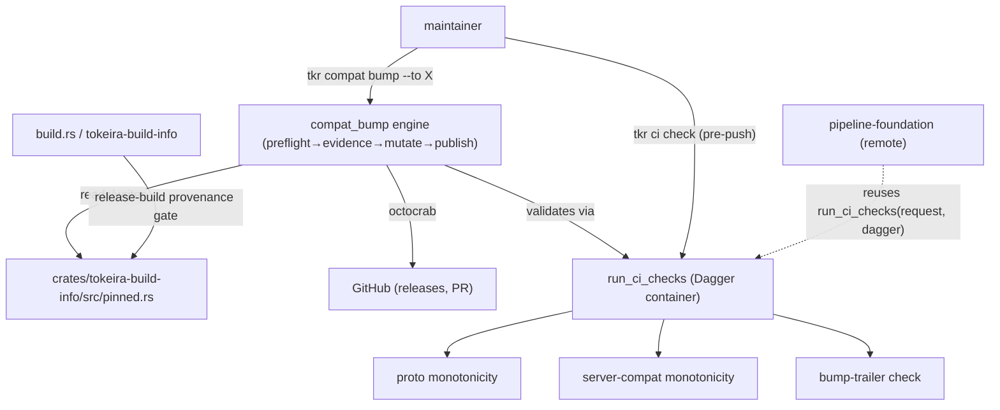

# Design Document — Release Process Governance

## Overview

This design realises the four release-governance concerns (provenance, version-pin monotonicity, the
server-compat bump protocol, the CI substrate) as: a small set of **CI checks** hosted in a
Dagger-backed `run_ci_checks` pipeline; a phased **bump engine** (`compat_bump/`) driven by
`tkr compat bump`; and **build-time provenance** rules in `build.rs`/`tokeira-build-info`. It consolidates
the design from the retired `temporal-compatibility/design-orig.md` §7–§8 (the live `design.md` kept the
matrix/handshake/CLI-show surface and trimmed this release machinery).

The guiding principle, carried from the source: **compile-time wherever possible** — the pins and
provenance are `&'static str` constants; the startup log, `--version`, and the handshake embed the same
values with no runtime computation. Governance is enforced at commit/CI time, not at runtime.

## Dependencies and Non-Goals

- **Consumes** `temporal-compatibility`: the pins (`pinned.rs`), the `FEATURE_MATRIX` (for the bump
  Disposition Table / Matrix Delta), and the `tkr` Dagger re-exec substrate (`tkr ci`/`tkr compat`
  command groups, `DaggerClient`). This spec adds the release-governance *checks* and the *bump engine*;
  it does not re-own the matrix or the handshake.
- **Consumes** `image-lifecycle`: the Dagger image pipeline that injects provenance env vars.
- **Hands off to** `pipeline-foundation`: remote-trigger wiring calls `run_ci_checks` directly.
- **Non-goal:** tagging, release channels, changelog, registry publication (deferred broad
  release-management strategy); the matrix content; `tkr compat show/diff`; image build/publish.

## Architecture



## Components and Interfaces

### 1. CI pipeline — `crates/tokeira-build/src/pipelines/ci.rs`

A pure function over a `DaggerClient`, mounting the workspace with the same `target/`-excluding filter
the image build uses (cold invocations never upload the multi-GB target tree):

```rust
pub enum CiCheck { ProtoMonotonicity, ServerCompatMonotonicity, BumpTrailer /* + workspace checks */ }

pub struct CiCheckRequest { pub workspace_root: PathBuf, pub checks: Vec<CiCheck> } // empty = all

pub struct CiCheckReport { pub results: Vec<CiCheckResult> }
pub struct CiCheckResult { pub check: CiCheck, pub passed: bool, pub summary: String, pub details: Option<String> }

pub fn run_ci_checks(request: &CiCheckRequest, dagger: &dyn DaggerClient) -> Result<CiCheckReport, BuildError>;
```

Each check runs `rg`/`git` inside a pinned `debian:bookworm-slim` container (determinism) and returns a
`CiCheckResult`. The monotonicity checks compare the pin at the tip commit against the pin at the last
tagged tokeira release (`git` + `sort -V`); the bump-trailer check, for any commit whose diff touches
`pinned.rs`, extracts the `Server-Compat-Bump:` trailer via `git interpret-trailers --parse` and
validates it against the observed `pinned.rs` diff.

### 2. CLI — `apps/tkr/src/commands/ci/` and `apps/tkr/src/commands/compat/bump.rs`

`tkr ci check [--check <name>] [--json]` re-execs under `dagger run` (shared `dagger_reexec` helper,
extracted from `commands/image/` into `apps/tkr/src/dagger_reexec.rs` so both groups consume it),
invokes `run_ci_checks`, renders the report, and exits non-zero on any failure.
`tkr compat bump --to <version> [--dry-run] [--no-open] [--derive-surfaces] [--resume ...]` is a thin
wrapper over the bump engine.

### 3. Bump engine — `crates/tokeira-build/src/compat_bump/`

```
compat_bump/
├── mod.rs          // BumpRequest, BumpOutcome, run_bump
├── phases/{preflight,evidence,surfaces,mutate,publish}.rs
├── github.rs       // octocrab wrappers: pagination, rate-limit (X-RateLimit-* → BumpError::RateLimited)
├── template.rs     // PR-body markdown rendering
├── trailer.rs      // Server-Compat-Bump trailer parse/render
└── pr_template.md
```

```rust
pub struct BumpRequest {
    pub workspace_root: PathBuf, pub target: semver::Version,
    pub trigger: Option<BumpTrigger>, pub dry_run: bool, pub derive_surfaces: bool,
    pub no_open: bool, pub resume_policy: ResumePolicy, pub github: GithubAuth,
}
pub enum BumpTrigger { One, Two, Three }
pub enum ResumePolicy { StrictNew, Resume, Reset }
pub struct BumpOutcome { pub pr_url: Option<String>, pub branch_name: String, pub commit_sha: String, pub phases_completed: Vec<BumpPhase> }
pub async fn run_bump(request: BumpRequest) -> Result<BumpOutcome, BumpError>;
```

**Phase responsibilities** (each `execute(ctx: &mut BumpContext)`, validating preconditions before any
side effect):

- **preflight** — read current pin; error on equal/downgrade target; ensure working tree clean and on
  the default branch; validate GitHub creds (`GET /user`) and scopes.
- **evidence** — enumerate `temporalio/temporal` releases in `(current, target]` (octocrab, paginated);
  fetch + cache release bodies; compute the matrix delta; optional `--derive-surfaces` (two-stage: raw
  diff → skeleton disposition table), which falls back to manual disposition on failure (logged, not
  fatal).
- **mutate** — create branch `compat/server-compat-bump-<old>-<new>`; write `pinned.rs` (PR number
  placeholder); commit with the rendered message + `Server-Compat-Bump:` trailer; run the CI checks on
  the branch and fail on any check failure.
- **publish** — push; if `--no-open`, stop; else open the PR (octocrab) with the templated body, rewrite
  the real PR number into `pinned.rs`, and amend (force-with-lease).

### 4. Trailer — `compat_bump/trailer.rs`

```rust
pub const TRAILER_KEY: &str = "Server-Compat-Bump";
pub struct BumpTrailer { pub old: semver::Version, pub new: semver::Version, pub trigger: BumpTrigger }
// render: "Server-Compat-Bump: {old} -> {new}, trigger: {n}"; parse validates the Req 3.3 regex.
```

`BumpTrailer::parse` is what the CI `BumpTrailer` check invokes inside the container.

### 5. Build-time provenance — `tokeira-build-info` `build.rs`

The release-build gate (Requirement 1): in `release` + `CI`, fail on empty `TOKEIRA_GIT_SHA`; in
`release` outside CI, warn and stamp `dev`; in debug, resolve `git rev-parse --short=8 HEAD` or `dev`.
The image pipeline injects `TOKEIRA_GIT_SHA` / `TOKEIRA_SOURCE_TREE_HASH`.

## Data Models

- `CiCheck` / `CiCheckRequest` / `CiCheckReport` / `CiCheckResult` (serde; the report is the
  remote-reusable artifact).
- `BumpRequest` / `BumpOutcome` / `BumpTrigger` / `ResumePolicy` / `BumpPhase` / `BumpError`.
- `BumpTrailer { old, new, trigger }`.
- `ReleaseEvidence { tag, published_at, body }` and the rendered PR-body sections (Upstream Releases,
  Disposition, Matrix Delta, SDK Evidence).
- The committed baseline record `docs/compat-bumps/0-baseline.md`.

## Correctness Properties

### Property 1: Pins never silently regress

For any commit, if `TEMPORAL_PROTO_VERSION` (resp. `TEMPORAL_SERVER_COMPAT`) at the tip is semver-less
than at the last tagged release, `run_ci_checks` fails unless a matching `Proto-Downgrade:` (resp.
`Server-Compat-Downgrade:`) trailer is present.

**Validates: Requirements 2.1, 2.2, 2.3**

### Property 2: Every pin change is trailered and consistent

For any commit whose diff touches `pinned.rs`'s `TEMPORAL_SERVER_COMPAT`, the bump-trailer check passes
iff a `Server-Compat-Bump:` trailer is present, matches the regex, and its old/new versions equal the
pin at the parent/commit respectively.

**Validates: Requirements 3.2, 3.3**

### Property 3: Trailer round-trip

For any `BumpTrailer`, `parse(render(t)) == t`, and `render` always matches the Requirement 3.3 regex.

**Validates: Requirements 3.3**

### Property 4: Bump phases are ordered and fail-closed

`run_bump` records `phases_completed` strictly in `preflight → evidence → mutate → publish` order and
stops at the first phase whose preconditions fail; a target equal-or-older than the current pin fails in
preflight and performs no mutation, push, or PR.

**Validates: Requirements 4.1, 4.2**

### Property 5: Release-build provenance gate

A `release` build with `CI` set and empty `TOKEIRA_GIT_SHA` fails the build; a debug build with no
provenance env succeeds with `dev`.

**Validates: Requirements 1.1, 1.2, 1.3**

### Property 6: CI report round-trips for reuse

`CiCheckReport` serialises and deserialises losslessly so a remote runner consumes it unchanged.

**Validates: Requirements 6.1, 6.2**

## Error Handling

| Condition | Outcome |
|---|---|
| Pin regression without override trailer | `run_ci_checks` → failing `CiCheckResult`; `tkr ci check` exits non-zero |
| Missing/malformed/ mismatched bump trailer on a `pinned.rs` change | failing `BumpTrailer` `CiCheckResult` |
| Bump target == current | `BumpError::AlreadyOnVersion` (preflight) |
| Bump target < current | `BumpError::Downgrade { current, target }` (preflight) |
| Dirty tree / wrong branch / bad GitHub creds | preflight `BumpError`; no mutation |
| CI checks fail during mutate | `BumpError::CiChecksFailed(report)`; no push |
| GitHub rate-limited | `BumpError::RateLimited { reset_at }` |
| Release build, CI, empty `TOKEIRA_GIT_SHA` | build failure (`build.rs`) |

## Testing Strategy

- **Pipeline checks:** unit tests over `run_ci_checks` with a fake `DaggerClient` — proto/server-compat
  regression detected; override trailers honoured; bump-trailer mismatch fails. (Property 1, 2, 6.)
- **Trailer:** proptest round-trip + regex conformance (Property 3).
- **Bump engine:** phase-ordering / fail-closed tests with stubbed git + GitHub (`run_bump` dry-run);
  equal/downgrade target rejected in preflight (Property 4). No live GitHub in the default suite.
- **Provenance:** `build.rs` behaviour under `release`+`CI` / `release` / `debug` (Property 5).
- **Baseline:** `docs/compat-bumps/0-baseline.md` exists and renders the templated sections.

## Out of Scope

Remote-trigger wiring (`pipeline-foundation`); tagging/channels/changelog/registry publication; the
matrix content, handshake, and `tkr compat show/diff` (`temporal-compatibility`); image build/publish
(`image-lifecycle`).

## Change Classification

**Architectural** — new CLI command group (`tkr compat bump`), a new bump engine + CI checks in
`tokeira-build`, a build-time provenance gate, and a new dependency (`octocrab`, already proposed by the
source drafts) to confirm at implementation. Consumes the `temporal-compatibility` substrate; introduces
no kernel surface.
