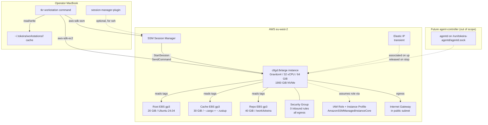

# Design Document: Remote Workstation

## Overview

This spec restores Rust build and validation throughput by moving the cargo loop off the MacBook onto a dedicated Graviton4 `c8gd.8xlarge` EC2 instance in the operator's own AWS account. The MacBook keeps the editor, git history, and the `tkr` CLI; the EC2 instance runs `cargo build`, `cargo test`, `cargo lint`, and (via a later `agent-controller` spec) any Codex-driven agent work.

The design optimises for three simultaneous goals: **throughput** (minute-scale cold builds on 32 Graviton4 vCPUs vs tens of minutes on a MacBook), **cost** (~£15/day active, ~£0.20/day stopped, ~£300/month at ~20 active days/month), and **scope discipline** (no agentd, no Codex, no Tokeira runtime on the workstation — those belong to follow-up specs). The workstation must be usable on its own for at least a week before the agent controller layer begins; this is a non-negotiable ordering constraint.

Constraints honoured:

- **No dedicated NAT Gateway.** A NAT Gateway is ~£36/month of standing cost that a solo-developer workstation does not justify. Egress comes from a public subnet with a transient public IP assigned on `up` and released on `stop`.
- **No public ingress.** Security group has zero inbound rules. The only authorised inbound channel is AWS Systems Manager Session Manager, scoped to the operator's IAM identity. SSM Session Manager is free.
- **No SSH keys.** SSM Session Manager removes the need for any SSH key material on the instance.
- **Direct AWS SDK, not `tokeira-iac`.** A one-instance-plus-two-EBS-volumes topology does not benefit from the `Module`/`Resource` machinery; AWS tags on live resources are the source of truth for state. Detailed rationale in §7.
- **Storage tiering matches the data.** Local NVMe (1900 GiB on-instance, ephemeral, erased on stop) for `CARGO_TARGET_DIR` and the sccache filesystem cache — both latency-sensitive and recreatable. EBS gp3 for `~/.cargo`, `~/.rustup`, repo checkouts, and the root filesystem — everything that must survive `stop`.
- **Idle-shutdown by default.** 30-minute idle window; configurable. Prevents the "forgot to stop" cost-leak.

### SDK behaviour reference

The design is grounded in:

- `aws-sdk-ec2` 1.x — `RunInstances`, `StopInstances`, `StartInstances`, `TerminateInstances`, `DescribeInstances`, `CreateVolume`, `AttachVolume`, `DetachVolume`, `DeleteVolume`, `CreateSecurityGroup`, `DeleteSecurityGroup`, `AllocateAddress`, `AssociateAddress`, `DisassociateAddress`, `ReleaseAddress`, `CreateTags`.
- `aws-sdk-ssm` 1.x — `StartSession` (with `AWS-StartInteractiveCommand` for `ssh`, and document-less sessions for `remote-exec` via a combination of `SendCommand` + `GetCommandInvocation`), `SendCommand` (run-command model for `remote-exec`).
- `aws-sdk-iam` 1.x — `CreateRole`, `DeleteRole`, `AttachRolePolicy`, `CreateInstanceProfile`, `AddRoleToInstanceProfile`, `DeleteInstanceProfile`.
- `session-manager-plugin` on the MacBook — required for interactive SSM sessions; the CLI validates its presence.

### Cost model

The table below is what an operator signs up for at the defaults (eu-west-2 London, 10 active hours/day, 20 working days/month). Costs are USD, as-of 2026-05. See Requirement 2.2 for the volume sizes that drive the EBS line.

| Component | Active rate | Stopped rate | Daily (10h active, 14h stopped) | Monthly (20 × daily) |
|---|---|---|---|---|
| `c8gd.8xlarge` instance (32 vCPU, 64 GiB, 1900 GiB NVMe) | $1.878/hour | $0.00 | $18.78 | $375.55 |
| EBS gp3 × 90 GiB (20 root + 30 cache + 40 repo) | $0.0103/hour | $0.0103/hour | $0.25 | $7.42 |
| Elastic IP (transient, released on stop per Req 4.1.3) | $0.005/hour attached | $0.00 released | $0.05 | $1.00 |
| SSM Session Manager | $0.00 | $0.00 | $0.00 | $0.00 |
| **Daily total** | | | **$19.08** | **$384** |
| **Weekend idle (10 days/month, stopped all day)** | — | $0.25/day | — | **$2.50** |
| **Month-total (working days + weekends)** | | | | **~$387** |

Compared to keeping the instance running 24/7 (which would be **$1,392/month** on the instance alone), the aggressive stop-on-idle posture saves ~70% of the annualised bill.

Three levers can cut this further if needed:

1. **Region shift to us-east-1** saves ~17% on compute (~$325/month total). Rejected for this spec because SSM-session latency from the MacBook matters; eu-west-2 keeps round-trips under 20ms.
2. **Compute Savings Plans** at a ~66% commitment level save ~28% on the commitment tranche. Deferred until 4+ weeks of usage data exist; committing on speculation wastes money if patterns change.
3. **Smaller instance** (`c8gd.4xlarge` at 16 vCPU / 32 GiB, $0.94/hour in eu-west-2) halves compute cost for ~1.5× cold-build time. Deferred; 32 vCPU is chosen to match Tokeira workspace scale (150+ crates) where `-j32` actually helps.

### Cross-spec positioning

This spec is consumed by:

- [`agent-controller`](../agent-controller/requirements.md) — a future spec that will run a Codex-driven agent daemon on this workstation. `agent-controller` depends on `tkr workstation up` / `tkr workstation remote-exec` being operational. This spec pre-declares the Unix-socket path convention (`/run/tokeira-agentd/agentd.sock`) per Req 8.1 so the follow-up spec can bind without reshaping anything here.
- The [`temporal-api-v1.62-sync`](../temporal-api-v1.62-sync/tasks.md) facade + integration-test tasks (tasks 15 and 16) — those tasks were deferred mid-spec because MacBook-local cold-rebuild cycles exceeded acceptable iteration bounds. They are expected to land on a running workstation instance under a follow-up PR.

This spec is NOT consumed by:

- `tokeira-iac` — explicitly by-design (Req 6.3; §7 of this design document).
- Any Tokeira runtime crate. The workstation compiles and tests Tokeira; it does not host `tokeirad`.

## Architecture



The operator's MacBook runs `tkr workstation` subcommands that drive the AWS control plane via `aws-sdk-ec2`, `aws-sdk-ssm`, and `aws-sdk-iam`. State lives on AWS (as tags on live resources) and in a MacBook-local cache under `~/.tokeira/workstations/<workstation-id>/`. The cache is a performance optimisation: every command reconciles cache against AWS before returning, and AWS wins every conflict. Interactive access (`tkr workstation ssh`) goes through SSM Session Manager with the `session-manager-plugin` invoked as a subprocess on the MacBook. Non-interactive command execution (`tkr workstation remote-exec`) uses `SendCommand` with polling via `GetCommandInvocation` — no session-manager-plugin required for the non-interactive path.

## Components and Interfaces

### 1. CLI surface — `tkr workstation` subcommand group (Req 6.1)

`apps/tkr/src/cli.rs` gains one `Command::Workstation` variant; `WorkstationAction` enumerates eight actions plus the idle-control convenience:

```rust
// apps/tkr/src/cli.rs — additions

#[derive(Subcommand)]
pub enum Command {
    // existing variants …
    Workstation {
        #[command(subcommand)]
        action: WorkstationAction,
    },
}

#[derive(Subcommand)]
pub enum WorkstationAction {
    /// Create or resume a workstation.
    Up {
        #[arg(long, default_value = "c8gd-rust")]
        profile: String,
        #[arg(long)]
        workstation: Option<String>,
        #[arg(long)]
        cache_volume_gib: Option<u32>,
        #[arg(long)]
        repo_volume_gib: Option<u32>,
        #[arg(long)]
        root_volume_gib: Option<u32>,
        #[arg(long)]
        instance_type: Option<String>,
        #[arg(long)]
        region: Option<String>,
        #[arg(long)]
        subnet_id: Option<String>,
    },
    /// Stop the instance; EBS persists, NVMe is erased, public IP is released.
    Stop {
        #[arg(long)]
        workstation: Option<String>,
    },
    /// Destroy all AWS resources associated with the workstation.
    Destroy {
        #[arg(long)]
        workstation: Option<String>,
        /// Skip confirmation. Matches the `tkr` convention for destructive ops.
        #[arg(long)]
        yes: bool,
    },
    /// Interactive shell via SSM Session Manager. Requires session-manager-plugin.
    Ssh {
        #[arg(long)]
        workstation: Option<String>,
    },
    /// Run a single shell command; stdout/stderr stream to the terminal.
    RemoteExec {
        #[arg(long)]
        workstation: Option<String>,
        #[arg(long, default_value = "/work/tokeira")]
        cwd: String,
        /// The command and its arguments, joined with spaces and executed under
        /// `bash -lc`. Use `--` to separate from flags.
        #[arg(trailing_var_arg = true)]
        command: Vec<String>,
    },
    /// Show state, cost rate, uptime, and bootstrap fingerprint.
    Status {
        #[arg(long)]
        workstation: Option<String>,
    },
    /// Enumerate every workstation visible to the current IAM principal.
    List,
    /// Force a bootstrap refresh on a running workstation.
    Bootstrap {
        #[arg(long)]
        workstation: Option<String>,
    },
    /// Defer the next idle-shutdown firing.
    Idle {
        #[arg(long)]
        workstation: Option<String>,
        /// Extend the idle-shutdown window by this duration. Parsed by
        /// `humantime` (e.g. `2h`, `90m`, `1d`).
        #[arg(long)]
        defer: Option<humantime::Duration>,
    },
}
```

Dispatch in `apps/tkr/src/main.rs` routes each variant to a handler module under `apps/tkr/src/commands/workstation/`:

```
apps/tkr/src/commands/workstation/
├── mod.rs          — exports and common arg helpers (resolve_workstation_id, etc.)
├── up.rs           — WorkstationAction::Up handler
├── stop.rs         — WorkstationAction::Stop
├── destroy.rs      — WorkstationAction::Destroy, with --yes confirmation
├── ssh.rs          — WorkstationAction::Ssh
├── remote_exec.rs  — WorkstationAction::RemoteExec
├── status.rs       — WorkstationAction::Status
├── list.rs         — WorkstationAction::List
├── bootstrap.rs    — WorkstationAction::Bootstrap
└── idle.rs         — WorkstationAction::Idle
```

Each handler is a thin wrapper: argument translation, confirmation logic (for `Destroy`), and output formatting (text vs `--json`). All AWS work lives in the engine layer described in §2.

### 2. Engine layer — `tokeira-aws::remote_workstation` (Req 6.2, 6.3)

`crates/tokeira-aws/src/remote_workstation.rs` is a single module (not a directory under `resources/`) that exposes the `Workstation` surface the CLI handlers call. The public types:

```rust
// crates/tokeira-aws/src/remote_workstation.rs

//! Workstation lifecycle management via direct AWS SDK calls.
//!
//! This module intentionally bypasses the `tokeira_iac::Module` / `Resource`
//! pattern used elsewhere in `tokeira-aws/src/resources/`. A single
//! c8gd.8xlarge instance with a small fixed set of supporting resources
//! (two EBS volumes, one security group, one IAM role, one instance profile)
//! does not benefit from IaC machinery designed for multi-module
//! compositions with state persistence, project wiring, and cross-resource
//! dependency ordering. See §7 of the spec's design.md for the rationale.
//!
//! State authority is AWS tags on the live resources:
//!   - tag:tokeira-workstation=true
//!   - tag:workstation-id=<ulid>
//!
//! The MacBook-local cache at ~/.tokeira/workstations/<workstation-id>/ is
//! a performance optimisation only; every call reconciles the cache against
//! AWS before returning, and AWS wins every conflict (Req 7.1.1).

#[derive(Debug, Clone)]
pub struct WorkstationProfile {
    pub name: String,
    pub instance_type: String,        // default "c8gd.8xlarge"
    pub ami_family: AmiFamily,        // Ubuntu2404 | AmazonLinux2023
    pub region: String,               // default "eu-west-2"
    pub root_volume_gib: u32,         // default 20
    pub cache_volume_gib: u32,        // default 30
    pub repo_volume_gib: u32,         // default 40
    pub idle_shutdown_minutes: u32,   // default 30
    pub idle_shutdown_enabled: bool,  // default true
    pub repo_url: String,             // default: origin URL of local checkout
    pub git_user_name: Option<String>,
    pub git_user_email: Option<String>,
}

#[derive(Debug, Clone, Copy)]
pub enum AmiFamily {
    Ubuntu2404,
    AmazonLinux2023,
}

/// Handle to an existing workstation. Carries AWS IDs for subsequent calls.
#[derive(Debug, Clone)]
pub struct WorkstationHandle {
    pub workstation_id: String,
    pub instance_id: String,
    pub cache_volume_id: String,
    pub repo_volume_id: String,
    pub root_volume_id: String,
    pub security_group_id: String,
    pub iam_role_name: String,
    pub instance_profile_name: String,
    pub region: String,
    pub subnet_id: String,
}

#[derive(Debug, Clone)]
pub enum InstanceState {
    Running,
    Stopped,
    Pending,
    Stopping,
    ShuttingDown,
    Terminated,
}

/// Outcome of a `Workstation::up` call, exposing whether the call created a
/// new workstation or resumed an existing one.
#[derive(Debug)]
pub enum UpOutcome {
    Created {
        handle: WorkstationHandle,
        bootstrap_log_url: String,
    },
    Resumed {
        handle: WorkstationHandle,
        bootstrap_drift: BootstrapDrift,
    },
    AlreadyRunning {
        handle: WorkstationHandle,
    },
}

#[derive(Debug)]
pub enum BootstrapDrift {
    UpToDate,
    Drift {
        local_fingerprint: String,
        remote_fingerprint: String,
    },
}

pub struct Workstation {
    ec2: aws_sdk_ec2::Client,
    ssm: aws_sdk_ssm::Client,
    iam: aws_sdk_iam::Client,
    region: String,
}

impl Workstation {
    pub async fn new(region: impl Into<String>) -> Result<Self, WorkstationError> { … }

    pub async fn up(
        &self,
        profile: &WorkstationProfile,
        workstation_override: Option<&str>,
    ) -> Result<UpOutcome, WorkstationError> { … }

    pub async fn stop(
        &self,
        workstation_id: &str,
    ) -> Result<(), WorkstationError> { … }

    pub async fn destroy(
        &self,
        workstation_id: &str,
    ) -> Result<(), WorkstationError> { … }

    pub async fn status(
        &self,
        workstation_id: &str,
    ) -> Result<WorkstationStatus, WorkstationError> { … }

    pub async fn list(
        &self,
    ) -> Result<Vec<WorkstationSummary>, WorkstationError> { … }

    pub async fn remote_exec(
        &self,
        workstation_id: &str,
        cwd: &str,
        command: &[String],
        stdout: impl AsyncWrite + Send + Unpin,
        stderr: impl AsyncWrite + Send + Unpin,
    ) -> Result<i32, WorkstationError> { … }

    pub async fn bootstrap(
        &self,
        workstation_id: &str,
        profile: &WorkstationProfile,
    ) -> Result<(), WorkstationError> { … }

    pub async fn idle_defer(
        &self,
        workstation_id: &str,
        until: chrono::DateTime<chrono::Utc>,
    ) -> Result<(), WorkstationError> { … }
}

#[derive(Debug, thiserror::Error)]
pub enum WorkstationError {
    #[error("aws ec2 error: {0}")]
    Ec2(String),
    #[error("aws ssm error: {0}")]
    Ssm(String),
    #[error("aws iam error: {0}")]
    Iam(String),
    #[error("workstation {0} not found")]
    NotFound(String),
    #[error("multiple workstations match: {0:?}")]
    AmbiguousMatch(Vec<String>),
    #[error("workstation {workstation_id} is in unexpected state {state:?}")]
    UnexpectedState { workstation_id: String, state: InstanceState },
    #[error("bootstrap drift detected and refresh failed: {0}")]
    BootstrapRefresh(String),
    #[error("session-manager-plugin not installed on the local machine; install it and retry")]
    SessionManagerPluginMissing,
    #[error("io error: {0}")]
    Io(#[from] std::io::Error),
}
```

The engine methods sequence the AWS SDK calls described in §3 (for lifecycle) and §4 (for SSM).

### 3. Lifecycle sequences

#### 3.1 `up` sequence (Req 1.1)

`Workstation::up` is the most involved operation. It either creates a fresh workstation or resumes an existing stopped one. The flow:

```
1. Discover existing workstations:
     ec2.describe_instances(
         Filter("tag:tokeira-workstation", "true")
         (+ Filter("tag:workstation-id", override) if --workstation set)
     )

2a. Zero matches (and no --workstation) → create fresh:
       - Generate workstation_id: ULID
       - Create IAM role "tokeira-workstation-<id>-role"
         - AttachRolePolicy: AmazonSSMManagedInstanceCore
       - Create instance profile "tokeira-workstation-<id>-profile"
         - AddRoleToInstanceProfile
       - Create security group "tokeira-workstation-<id>-sg"
         - ZERO inbound rules
         - All egress to 0.0.0.0/0
       - Create Cache_Volume (gp3, encrypted, 30 GiB, tagged)
       - Create Repo_Volume (gp3, encrypted, 40 GiB, tagged)
       - RunInstances:
         - AMI: resolve latest Ubuntu 24.04 arm64 (or AL2023) via SSM parameter
         - InstanceType: c8gd.8xlarge
         - SubnetId: from profile or discovered public subnet
         - AssociatePublicIpAddress: true (one-shot; re-associated on start)
         - BlockDeviceMappings: root 20 GiB gp3 encrypted
         - IamInstanceProfile: the one created above
         - UserData: rendered cloud-init script (see §5)
         - TagSpecifications: tokeira-workstation=true, workstation-id=<id>,
           bootstrap-fingerprint=<sha>
       - Wait for instance running
       - AttachVolume Cache_Volume → /dev/sdf
       - AttachVolume Repo_Volume → /dev/sdg
       - Poll /etc/tokeira/workstation-fingerprint via ssm.SendCommand
         until bootstrap completes (or 15-min timeout)
       - Write state cache to ~/.tokeira/workstations/<id>/
       - Return UpOutcome::Created

2b. One match, stopped → resume:
       - Compute local Bootstrap_Fingerprint from the current rust-toolchain.toml
       - StartInstances
       - Wait for instance running
       - AllocateAddress + AssociateAddress (if no public IP re-assigned)
       - Read instance fingerprint via ssm.SendCommand
         (cat /etc/tokeira/workstation-fingerprint)
       - If mismatch, call bootstrap() (§3.4)
       - Update state cache
       - Return UpOutcome::Resumed

2c. One match, running → already up:
       - Return UpOutcome::AlreadyRunning

2d. One match, transitional → wait up to 5 min, re-evaluate

2e. Two or more matches → error AmbiguousMatch unless --workstation
    resolves to exactly one
```

**Subnet discovery.** When `--subnet-id` is omitted, the engine discovers an eligible public subnet in the target region: `ec2.describe_subnets` filtered by `MapPublicIpOnLaunch=false` and `VpcId` of the default VPC. If multiple match, the first one by subnet-ID lexicographic order is chosen (deterministic and documented). If none match, the engine errors with a clear message telling the operator to pass `--subnet-id` explicitly.

**AMI resolution.** The cloud-init script is AMI-family-agnostic in its shell-level contents, but the exact AMI ID is resolved via SSM Parameter Store: `/aws/service/canonical/ubuntu/server/24.04/stable/current/arm64/hvm/ebs-gp3/ami-id` for Ubuntu 24.04, or `/aws/service/ami-amazon-linux-latest/al2023-ami-kernel-default-arm64` for AL2023. Canonical maintains these parameters; AWS maintains AL2023's. No AMI ID is hard-coded in Rust.

#### 3.2 `stop` sequence (Req 1.2)

```
1. Discover workstation by ID (or resolve from ~/.tokeira/.latest).
2. Warn the operator: "The following paths will be erased:
     /work/target (CARGO_TARGET_DIR)
     /work/sccache (sccache cache)"
3. Invoke stop_instances.
4. Wait for instance state to reach Stopped (up to 2-minute timeout).
5. Release public IP via DisassociateAddress + ReleaseAddress (if the
   EIP was allocated by the engine; skip if a pre-existing EIP is tagged
   tokeira-workstation-eip).
6. Append a stop event to ~/.tokeira/workstations/<id>/uptime-log.jsonl.
7. Return Ok.
```

EBS volumes remain attached across stop. NVMe contents are gone on the next `start`.

#### 3.3 `destroy` sequence (Req 1.3)

```
1. If not --yes, prompt: "Destroy workstation <id>? This deletes the
   instance and both EBS volumes permanently. (y/N):"
2. Terminate the instance: terminate_instances.
3. Wait for Terminated.
4. Delete Cache_Volume, Repo_Volume (via delete_volume; already detached
   after terminate).
5. Delete security group. If it fails with DependencyViolation (rare —
   something else using it), log warning and continue.
6. Detach role from instance profile, delete instance profile.
7. Detach managed policy from role, delete role.
8. Release the allocated Elastic IP if one is tagged for this workstation.
9. Remove ~/.tokeira/workstations/<id>/ from the local cache.
10. If .latest pointed at this <id>, clear it.
```

Destroy is best-effort: individual resource-deletion failures are logged and the sequence continues, per Req 1.3.3.

#### 3.4 `bootstrap` sequence (Req 1.4, 3.1, 7.2)

Bootstrap is idempotent by design. The flow:

```
1. Compute the Bootstrap_Fingerprint:
     sha256(render_bootstrap_script(profile, rust_toolchain_toml_bytes))
2. Read the instance's stored fingerprint:
     ssm.SendCommand(instance_id, "cat /etc/tokeira/workstation-fingerprint || echo MISSING")
3. If match, return BootstrapDrift::UpToDate — no work.
4. If mismatch (or missing), re-run the bootstrap script remotely:
     ssm.SendCommand(instance_id, rendered_bootstrap_script)
5. Poll GetCommandInvocation until terminal.
6. Verify the new fingerprint lands by re-reading it.
7. Return BootstrapDrift::Drift { local, remote }.
```

The bootstrap script is rendered once and passed as the `RunInstances` UserData on fresh creation, and re-sent via `SendCommand` on drift. Idempotency is a contract of the script itself: every step detects existing state before touching it.

### 4. SSM-based access (Req 4.3, 4.4)

#### 4.1 `ssh` — interactive shell

```rust
// apps/tkr/src/commands/workstation/ssh.rs

1. Resolve workstation_id → instance_id via the engine.
2. Verify `session-manager-plugin` on PATH via `which::which`.
3. exec `aws ssm start-session --target <instance_id>`.
4. Let the shell manage its own lifetime; return its exit code.
```

Using the `aws` CLI subprocess (rather than the SDK) for the interactive path is intentional: interactive SSM sessions require the `session-manager-plugin` companion binary which speaks the SSM proprietary protocol, and the cleanest way to invoke it is through the `aws` CLI that already knows how. Non-interactive `remote-exec` uses the SDK directly (see §4.2). This is the same boundary the AWS team documents.

#### 4.2 `remote-exec` — stream one command (Req 4.4)

```rust
// apps/tkr/src/commands/workstation/remote_exec.rs

1. Resolve workstation_id → instance_id.
2. Build the command string: `cd <cwd> && <command words, shell-escaped>`.
3. Call ssm.send_command(...).document_name("AWS-RunShellScript")
     .parameters(HashMap::from([("commands", vec![command_str])]))
     .instance_ids(vec![instance_id])
     .send().await
4. Extract the command_id from the response.
5. Poll ssm.get_command_invocation(command_id, instance_id) in a loop:
     - On Pending / InProgress: fetch standard_output_content and
       standard_error_content deltas (use the inline-chunk fields if
       available; otherwise re-fetch and diff), stream to caller.
     - On Success: stream final output, return exit code 0.
     - On Failed: stream final output, return the command's response_code
       (typically the shell exit code).
     - Stream until terminal; honour local SIGINT by calling
       ssm.cancel_command(command_id).
```

**Streaming caveat.** The SSM Run Command model is poll-based: `GetCommandInvocation` returns the accumulated output so far. For real-time streaming of `cargo build` output over a 30-second compile, the engine polls at 500-ms intervals and streams the delta. This is "near-real-time": the operator sees lines in batches of up to ~half a second of output. In practice this feels responsive enough for build-style workloads. If it doesn't, a v2 upgrade path is to use `StartSession` with the non-interactive stream-session document, which gives true streaming — but requires the session-manager-plugin on the MacBook and is more complex to wire in Rust. The v1 poll-based implementation suffices for this spec's acceptance gate.

**Working directory.** The command is wrapped as `bash -lc "cd <cwd> && <cmd>"`. `bash -l` sources `/etc/profile.d/tokeira-workstation.sh` which exports `CARGO_TARGET_DIR`, `RUSTC_WRAPPER`, `SCCACHE_DIR`, and `CARGO_INCREMENTAL` (Req 2.1.5). This means `tkr workstation remote-exec cargo build` sees the correct environment without the MacBook having to forward anything.

**SIGINT handling.** The CLI installs a SIGINT handler via `tokio::signal::ctrl_c` that cancels the outstanding command via `ssm.cancel_command` and exits non-zero. Best-effort — the remote process gets SIGTERM via the Run Command cancel path.

### 5. Cloud-init bootstrap script (Req 3.1, 3.2, 3.3)

The bootstrap script lives at `crates/tokeira-aws/src/remote_workstation_bootstrap.rs` and is rendered from a Rust template at `up` and `bootstrap` time. The template takes a `BootstrapContext`:

```rust
pub struct BootstrapContext {
    pub workstation_id: String,
    pub bootstrap_fingerprint: String,
    pub profile: WorkstationProfile,
    pub rust_toolchain_toml_bytes: Vec<u8>,
    pub cargo_tools: Vec<CargoTool>,      // default: nextest, deny, insta, llvm-cov, sccache
    pub apt_packages: Vec<String>,        // default: git, gh, ripgrep, fd-find, jq, mold, lld, protoc
}
```

The rendered script is ~200 lines of idempotent bash with the following phase structure:

```bash
#!/bin/bash
set -euo pipefail

# PHASE 1: Mount filesystem tiers (Req 2.1)
#   - Detect the NVMe block device (vendor-specific naming; use
#     lsblk + grep for "ephemeral" or by size-threshold).
#   - Format if not already ext4; mount at /work.
#   - Identify EBS volumes by EC2 metadata tag via IMDSv2 token → DescribeVolumes:
#       by-tag:workstation-id + by-tag:Name=Cache or by-tag:Name=Repo.
#   - Format if not already ext4 (detect by blkid); mount at /work/cache, /work/repo.
#   - Bind-mount ~/.cargo, ~/.rustup from /work/cache/{cargo,rustup}.
#   - Write /etc/fstab entries for persistent mounts (Cache + Repo).
#   - NVMe is re-formatted on every boot per Req 2.1.1 (not in fstab).

# PHASE 2: Install toolchain + tools (Req 3.1, 3.2)
#   - apt-get install -y <apt_packages>
#   - Install rustup via https://sh.rustup.rs (idempotent; skip if .rustup exists
#     and rust_toolchain_toml hash matches a stored marker).
#   - Run rustup show to force toolchain install from rust-toolchain.toml.
#   - Install cargo tools with `cargo install` (idempotent: cargo short-circuits).

# PHASE 3: Write profile.d env (Req 2.1.5)
#   - Generate /etc/profile.d/tokeira-workstation.sh with:
#       export CARGO_TARGET_DIR=/work/target
#       export RUSTC_WRAPPER=sccache
#       export SCCACHE_DIR=/work/sccache
#       export CARGO_INCREMENTAL=1
#       export PATH="$HOME/.cargo/bin:$PATH"
#   - chmod 0644; readable by all users.

# PHASE 4: Clone repo if empty (Req 3.3)
#   - If /work/repo/tokeira/.git does not exist: git clone <repo_url> /work/repo/tokeira.
#   - Symlink /work/tokeira → /work/repo/tokeira.
#   - Configure git user.name and user.email if provided in BootstrapContext.

# PHASE 5: Create /run/tokeira-agentd/ (Req 4.5, 8.1)
#   - mkdir -p /run/tokeira-agentd
#   - chown ubuntu:ubuntu
#   - chmod 0750
#   - Add a tmpfiles.d entry so it survives across reboots.

# PHASE 6: Install idle-shutdown systemd service + timer (Req 5.1)
#   - Write /etc/systemd/system/tokeira-workstation-idle.service
#   - Write /etc/systemd/system/tokeira-workstation-idle.timer
#   - systemctl enable --now tokeira-workstation-idle.timer
#   - Write /etc/tokeira/idle-config.env with idle_shutdown_minutes
#     and idle_shutdown_enabled. The service script reads this.

# PHASE 7: Write bootstrap fingerprint (Req 7.2)
#   - mkdir -p /etc/tokeira
#   - echo "{bootstrap_fingerprint}" > /etc/tokeira/workstation-fingerprint
```

The script's idempotency contract is tested in `crates/tokeira-aws/tests/remote_workstation_bootstrap.rs` by invoking the renderer with two contexts that differ only in `bootstrap_fingerprint` and asserting the rendered byte diff is limited to the fingerprint-write line (proves no spurious non-determinism in the renderer).

### 6. Idle-shutdown watchdog (Req 5.1)

The systemd service is short — ~40 lines of bash at `/usr/local/bin/tokeira-workstation-idle-check`:

```bash
#!/bin/bash
set -euo pipefail

# Read config written by cloud-init.
source /etc/tokeira/idle-config.env

if [[ "${idle_shutdown_enabled:-true}" != "true" ]]; then
    exit 0
fi

# Check the defer sentinel.
DEFER_FILE=/var/lib/tokeira/idle-defer.timestamp
if [[ -f "$DEFER_FILE" ]]; then
    defer_until=$(cat "$DEFER_FILE")
    if (( $(date +%s) < defer_until )); then
        exit 0
    fi
fi

# Condition A: 1-minute load average below threshold.
load_1min=$(cut -d' ' -f1 /proc/loadavg)
threshold="${idle_load_threshold:-0.5}"
if (( $(echo "$load_1min >= $threshold" | bc -l) )); then
    # Active: reset the idle counter.
    echo 0 > /var/lib/tokeira/idle-counter
    exit 0
fi

# Condition B: no active SSM Session Manager session.
if pgrep -f "amazon-ssm-agent.*session" > /dev/null; then
    echo 0 > /var/lib/tokeira/idle-counter
    exit 0
fi

# Both quiet: increment counter.
counter=$(cat /var/lib/tokeira/idle-counter 2>/dev/null || echo 0)
counter=$((counter + 1))
echo "$counter" > /var/lib/tokeira/idle-counter

# Convert idle_shutdown_minutes to firings (timer fires every 5 min).
firings_required=$(( idle_shutdown_minutes / 5 ))

if (( counter >= firings_required )); then
    logger -t tokeira-idle-check "Idle for $((counter * 5)) minutes; initiating shutdown."
    /sbin/shutdown -h +1 "Tokeira workstation idle-shutdown: no activity for $((counter * 5)) minutes"
fi
```

The timer fires every 5 minutes:

```ini
# /etc/systemd/system/tokeira-workstation-idle.timer
[Unit]
Description=Tokeira workstation idle-shutdown check

[Timer]
OnBootSec=10min
OnUnitActiveSec=5min

[Install]
WantedBy=timers.target
```

`tkr workstation idle --defer 2h` writes `$(date +%s +7200)` to `/var/lib/tokeira/idle-defer.timestamp` via `ssm.SendCommand`.

### 7. Direct AWS SDK vs `tokeira-iac` (Req 6.3)

The explicit deviation from the `temporal-dsql-deploy-eks` pattern merits its own section so future readers understand the choice.

**Why `tokeira-iac` is not the right fit here:**

- The workstation's resource topology is fixed and small: 1 instance + 2 EBS volumes + 1 security group + 1 IAM role + 1 instance profile + 0 or 1 Elastic IPs. `tokeira-iac`'s value is multi-module composition with cross-module dependency ordering; one-module compositions do not benefit.
- AWS tags are an authoritative, queryable, always-consistent source of state. `tokeira-iac::InfraState` persistence is redundant: every call would read the state, verify it against AWS, and reconcile. The single source of truth is already AWS.
- `tokeira-iac` resources expect `ProvisionContext::extension` for provider handles, project tags, and a reporter API. For `tkr workstation`, which is operator-driven with immediate feedback, the thinner handler → engine → SDK path reads more clearly.
- State documents on local disk create two problems this spec does not want: a synchronisation concern between the local state and AWS, and a temptation for operators to edit the state document to "fix" a diff mismatch. Tag-based state cannot be locally edited.

**What we keep from the `tokeira-iac` spirit:**

- The handler-engine-SDK split (Req 6.2). CLI handlers do no SDK work; all of that is in `Workstation`. This mirrors the `Module` pattern's separation of "what to do" (handlers) from "how to do it" (resources).
- The tag vocabulary (`tokeira-workstation`, `workstation-id`) is consistent with the project-tag convention `tokeira-iac` imposes on resources. A reviewer looking at tags in the AWS console sees the same shape as EKS / DSQL resources.
- The error enum pattern (`WorkstationError` with `thiserror` variants for each SDK source) matches `IacError`'s split by source.

**Future migration path.** If a subsequent spec introduces a second, closely-related workstation-like resource (e.g. a CI build agent with shared caching), and the combined topology justifies `tokeira-iac`, migrating is straightforward: the `Workstation::up/stop/destroy` methods become the bodies of corresponding `Resource::create/delete` impls, tags remain the source of truth, and the engine becomes the caller of `Engine::apply`. Nothing locks us out of that move.

## Data Models

### `WorkstationProfile` — default values

```rust
impl WorkstationProfile {
    pub fn c8gd_rust() -> Self {
        Self {
            name: "c8gd-rust".to_string(),
            instance_type: "c8gd.8xlarge".to_string(),
            ami_family: AmiFamily::Ubuntu2404,
            region: std::env::var("AWS_REGION").unwrap_or_else(|_| "eu-west-2".to_string()),
            root_volume_gib: 20,
            cache_volume_gib: 30,
            repo_volume_gib: 40,
            idle_shutdown_minutes: 30,
            idle_shutdown_enabled: true,
            repo_url: discover_origin_url().unwrap_or_else(|| "https://github.com/<org>/tokeira.git".to_string()),
            git_user_name: discover_git_user_name(),
            git_user_email: discover_git_user_email(),
        }
    }
}
```

### `WorkstationStatus` — `tkr workstation status` output

```rust
pub struct WorkstationStatus {
    pub handle: WorkstationHandle,
    pub state: InstanceState,
    pub public_ip: Option<IpAddr>,
    pub private_ip: IpAddr,
    pub bootstrap_fingerprint: String,
    pub uptime: Option<Duration>,  // Some when running
    pub hourly_cost_usd: Option<f64>,  // None when region/instance-type unknown
    pub cumulative_uptime_hours: f64,  // from uptime-log.jsonl
    pub cache_volume_gib: u32,
    pub repo_volume_gib: u32,
}
```

### Cost-rate table — embedded constants

```rust
// crates/tokeira-aws/src/remote_workstation.rs

/// On-demand hourly rates as of 2026-05. Stale-table tolerated; see Req 5.2.3.
const COST_RATE_TABLE: &[(&str, &str, f64)] = &[
    // (region, instance_type, usd_per_hour)
    ("eu-west-2", "c8gd.8xlarge", 1.87776),
    ("us-east-1", "c8gd.8xlarge", 1.56768),
    ("eu-west-2", "c8g.8xlarge",  1.63632),
    ("us-east-1", "c8g.8xlarge",  1.36224),
    // add more as discovered on demand
];

pub fn hourly_rate(region: &str, instance_type: &str) -> Option<f64> {
    COST_RATE_TABLE
        .iter()
        .find(|(r, t, _)| *r == region && *t == instance_type)
        .map(|(_, _, rate)| *rate)
}
```

### Local state file — `~/.tokeira/workstations/<id>/state.json`

```json
{
  "workstation_id": "ws-01HXYZ...",
  "instance_id": "i-0abcdef0123456789",
  "cache_volume_id": "vol-0abcdef0123456789",
  "repo_volume_id": "vol-0abcdef0123456788",
  "root_volume_id": "vol-0abcdef0123456787",
  "security_group_id": "sg-0abcdef0123456789",
  "iam_role_name": "tokeira-workstation-ws-01HXYZ...-role",
  "instance_profile_name": "tokeira-workstation-ws-01HXYZ...-profile",
  "region": "eu-west-2",
  "subnet_id": "subnet-0abcdef0123456789",
  "profile_name": "c8gd-rust",
  "bootstrap_fingerprint": "abcd1234...",
  "ami_id": "ami-0abcdef0123456789",
  "created_at": "2026-05-11T08:00:00Z",
  "last_seen_state": "Stopped",
  "last_seen_at": "2026-05-11T18:30:00Z"
}
```

## Testing Strategy

### Correctness properties (Req 9)

| Property | Test location | Strategy |
|---|---|---|
| **P1 — `up` is idempotent** (Req 9.1) | `crates/tokeira-aws/tests/remote_workstation_idempotence.rs` | `proptest` strategy over command sequences `[up, up, stop, up, start, up, ...]` with mock `aws-sdk-ec2`. Assert exactly one instance carrying the expected tags at the end. Min 64 iterations. |
| **P2 — destroy is total** (Req 9.2) | `crates/tokeira-aws/tests/remote_workstation_destroy.rs` | Seed a mock AWS state with one workstation, inject failures on individual sub-resource deletes, call destroy, assert no tagged resource remains. Min 32 iterations over fault-injection permutations. |
| **P3 — fingerprint determinism** (Req 9.3) | `crates/tokeira-aws/tests/remote_workstation_fingerprint.rs` | Compute the fingerprint twice over equal inputs; assert byte-equal. Mutate any single byte of any input component; assert different. |
| **P4 — CLI defaults stay sane** (Req 9.4) | `apps/tkr/tests/workstation_resolution.rs` | `proptest` over `~/.tokeira/workstations/` directory states (empty, stale, corrupted, dangling `.latest`). Assert every `WorkstationAction` resolves to `Ok(_)` or `Err(_)` with a clear message — never panics. |

### Mocking strategy

The AWS SDK crates all accept mocked clients via their `aws_smithy_mocks` integration. Every test constructs a mock `aws-sdk-ec2` / `aws-sdk-ssm` / `aws-sdk-iam` client with a scripted request-response sequence. The `Workstation` engine never depends on live AWS credentials, and `cargo test --workspace` runs the properties offline.

### Example-based tests

| Scenario | Test location |
|---|---|
| Ambiguous-match error enumerates instance IDs (Req 1.1.5) | `remote_workstation_ambiguous.rs` |
| Transitional-state wait times out cleanly (Req 1.1.6) | `remote_workstation_transitional.rs` |
| `stop` warning lists both `/work/target` and `/work/sccache` (Req 1.2.3) | `workstation_stop_warnings.rs` |
| Public IP released on stop, reallocated on start (Req 4.1.3) | `remote_workstation_eip_lifecycle.rs` |
| `remote_exec` streams stdout/stderr in near-real-time (Req 4.4.3) | `remote_workstation_remote_exec_streaming.rs` |
| `idle --defer` writes the sentinel correctly (Req 5.1.5) | `remote_workstation_idle_defer.rs` |
| Cost-rate table returns `None` for unknown region/type (Req 5.2.3) | `remote_workstation_cost_lookup.rs` |

### Live-AWS acceptance test

One `#[ignore]`'d end-to-end test at `crates/tokeira-aws/tests/remote_workstation_live.rs` that spins up a real `c8gd.8xlarge`, issues `tkr workstation remote-exec "uname -a"`, asserts the output, and destroys. Estimated cost per run: ~$0.50 (two minutes of c8gd time plus the volume prorata). Runs only when the operator explicitly triggers it.

## Tradeoffs

**SSM `SendCommand` polling vs `StartSession` streaming.** `remote-exec` uses `SendCommand` with 500-ms polling, which gives near-real-time output for build-style workloads but not truly streaming low-latency output. True streaming would require the `session-manager-plugin` and a more complex non-interactive session setup. Accepted trade-off for v1; v2 upgrade path is documented in §4.2.

**Public subnet with transient EIP vs private subnet with NAT Gateway.** NAT Gateway standing cost is ~$36/month. For a solo developer workstation that cost is disproportionate. Public subnet + transient EIP preserves the zero-ingress security posture (security group has no inbound rules) while halving the monthly bill. If the operator's account already runs a NAT Gateway for unrelated workloads, they can pass `--subnet-id <private-subnet>` to route through it.

**NVMe for sccache (ephemeral) vs EBS for sccache (persistent).** Lost sccache on stop means a cold build on first compile after resume. Accepted because (a) cargo's incremental state on the persistent Cache_Volume captures most of the benefit anyway, (b) sccache's latency advantage on NVMe is a compound win on every subsequent build within a session, and (c) the stop-on-idle cadence makes post-resume cold builds rare — they happen once a day at most.

**30 GiB Cache_Volume vs 100 GiB.** The original draft sized the Cache_Volume at 100 GiB on the reasoning that "more headroom never hurts". It does hurt — it costs $0.0928/GB-month in London, so the extra 70 GiB is $6.50/month of unused capacity. 30 GiB covers the realistic load (cargo registry + rustup) with meaningful headroom.

**c8gd.8xlarge vs c8gd.4xlarge.** 32 vCPU is chosen for the Tokeira workspace (150+ crates, aggressive `-j32` parallelism). 16 vCPU would save ~50% on compute but ~1.5× cold-build time. The cost-per-build tells the story: $1.878/hour × 3 min = $0.094 per cold build on c8gd.8xlarge, vs $0.939/hour × 4.5 min = $0.070 per cold build on c8gd.4xlarge. The 4xlarge wins on raw dollars-per-build, but loses on developer-minutes-per-build. Developer time is the binding constraint, so 8xlarge is the default. Operators willing to trade build time for cost can pass `--instance-type c8gd.4xlarge`.

**Eu-west-2 vs us-east-1.** London pays a ~17% premium (~$65/month at the defaults). For a UK-based operator, London's ~20 ms SSM round-trip beats us-east-1's ~80 ms, which matters noticeably on interactive `ssh` sessions. The premium is worth paying for interactive latency. Bulk `remote-exec` operations are less sensitive.

**Toolchain pin from `rust-toolchain.toml` vs hardcoded in cloud-init.** Driving from `rust-toolchain.toml` means toolchain upgrades do not require a spec change — they flow from the workspace root through `Bootstrap_Fingerprint` into the next `up` call, which triggers drift detection and re-bootstraps. The alternative (hardcoding `1.95.0` in the script) would require a spec edit on every MSRV bump. The chosen approach is lower-friction and more correct.

## Open questions for tasks phase

1. **Exact SSM streaming cadence.** 500 ms is a guess; the tasks phase should measure the operator-perceived latency on a representative `cargo build` and tune if needed. Window: 250–1000 ms.
2. **Default subnet discovery.** If the operator's default VPC has zero subnets (possible in a fresh account), `up` errors with a clear message. Tasks phase confirms the error text reads well.
3. **cost-rate table refresh cadence.** The embedded table is stale-tolerant, but how often should maintainers refresh it? Once per quarter feels right; tasks phase records a calendar reminder.

---

Requirements and design are ready. The tasks.md draft follows once this design is approved.
