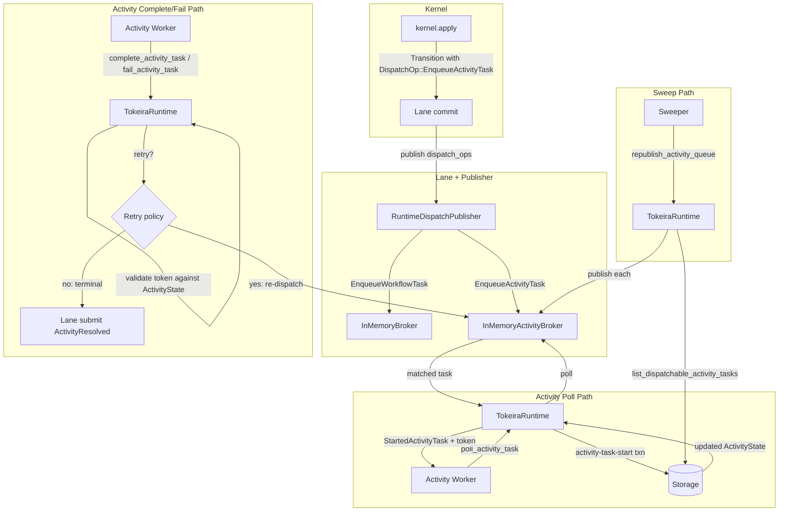

# Design Document: Activity Pump — Dispatch, Poll, Complete, Retry

## Overview

This design adds the activity task delivery pipeline to `tokeira-runtime`, completing the second major runtime feature after Lane OCC Retry (Feature 1). The Activity Pump is the counterpart to the existing workflow task path (`InMemoryBroker` + `poll_workflow_task` + `complete_workflow_task`) but with two structural differences that shape every design decision:

1. **Activity starts are not history events.** `WorkflowTaskStarted` is a kernel command that produces a history event in the same fenced transition. `ActivityTaskStarted` in Temporal is recorded retroactively when the activity resolves. The runtime must track activity starts in its own mutable state — updating `ActivityState` through a storage commit — without going through `kernel.apply`.

2. **Activity retry is a runtime concern.** When an activity fails and the retry policy permits another attempt, the runtime re-dispatches the activity with an incremented attempt count. The kernel only sees `ActivityResolved` when the activity is terminally done (completed, failed after exhausting retries, timed out, or canceled).

The implementation touches four areas:
- A new `InMemoryActivityBroker` for matching activity tasks with pollers (parallel to `InMemoryBroker`).
- Three new facade methods on `TokeiraRuntime`: `poll_activity_task`, `complete_activity_task`, `fail_activity_task`.
- Retry policy evaluation logic in the runtime (not the kernel).
- Wiring `DispatchOp::EnqueueActivityTask` in `RuntimeDispatchPublisher` to the activity broker (replacing the current stub).

The existing `ActivityTaskToken` type in `tokeira-types` needs to be extended with an `activity_id` field so that completions and failures can be validated against the current `ActivityState` by activity identity, not just by `schedule_event_id`.

## Architecture



### Key design decisions

**Activity-task-start as a direct storage commit, not a kernel command.** The kernel's `apply` method produces history events. Since `ActivityTaskStarted` is not a history event (it's recorded retroactively at resolution time), the start transaction bypasses the kernel entirely. Instead, the runtime loads the current `WorkflowState`, validates the activity is still pending, updates the `ActivityState` (recording the start), and commits the updated state directly to storage using the same fenced `commit_transition` path. This preserves the history-as-authority invariant: the activity start is recorded in mutable state that is explained by the original `ActivityTaskScheduled` transition.

**Retry evaluation in the runtime, not the kernel.** The kernel should only see terminal activity outcomes. Retry logic (max_attempts check, non_retryable_error_types check, backoff computation) lives in a pure function in the runtime crate. The retry policy is obtained from `ActivityState.retry_policy` (per-activity), falling back to `WorkflowState.retry_policy` (workflow-level) if no per-activity policy is set. This requires extending `ActivityState` with `input` and `retry_policy` fields as a prerequisite (Requirement 0). When retry is permitted, the runtime publishes a new activity task to the broker with an incremented attempt — no kernel command, no history event. When retry is exhausted, the runtime submits `Command::ActivityResolved` with a `Failed` resolution through the lane.

**Token validation before any mutation.** Every `complete_activity_task` and `fail_activity_task` call validates the `ActivityTaskToken` against the current `ActivityState` before doing anything. The three checks are: (1) `activity_id` exists in the run's activities map, (2) `attempt` matches the current attempt, (3) `shard_epoch` matches the current epoch. If any check fails, the request is rejected with an error. Note: until shard lease ownership is implemented (Feature 11), `shard_epoch` is always `ShardEpoch::ZERO` and the epoch check is a no-op.

**Deduplication in the activity broker by `(run_key, activity_id, attempt)`.** This is the natural composite key because a single activity can have multiple attempts over its lifetime, and each attempt is a distinct deliverable unit. This differs from the workflow broker which deduplicates by `(run_key, logical_seq)`.

## Components and Interfaces

### InMemoryActivityBroker

Parallel to `InMemoryBroker` but simpler — no sticky routing for activities.

```rust
/// In-memory activity task broker.
///
/// Activities don't have sticky routing (unlike workflow tasks), so this
/// broker is simpler: just a per-queue FIFO with dedup by
/// (run_key, activity_id, attempt).
#[derive(Default, Clone)]
pub struct InMemoryActivityBroker {
    inner: Arc<Mutex<ActivityBrokerState>>,
    wake: Arc<Notify>,
}

#[derive(Default)]
struct ActivityBrokerState {
    ready: HashMap<QueueKey, VecDeque<DispatchableActivityTask>>,
    enqueued: HashSet<(RunKey, String, u32)>,  // (run_key, activity_id, attempt)
}

impl InMemoryActivityBroker {
    /// Publish an activity task. Silently deduplicates by (run_key, activity_id, attempt).
    pub async fn publish_activity_task(&self, task: DispatchableActivityTask) -> Result<()>;

    /// Long-poll for an activity task on the given queue.
    pub async fn poll_activity_task(
        &self,
        queue: &QueueKey,
        wait_for: Duration,
    ) -> Result<Option<DispatchableActivityTask>>;
}
```

### Updated ActivityTaskToken

The existing `ActivityTaskToken` in `tokeira-types/src/tokens.rs` needs an `activity_id` field added:

```rust
#[derive(Clone, Debug, PartialEq, Eq, Serialize, Deserialize)]
pub struct ActivityTaskToken {
    pub run_key: RunKey,
    pub activity_id: String,
    pub schedule_event_id: i64,
    pub attempt: u32,
    pub shard_epoch: ShardEpoch,
}
```

The `started_event_id` field is removed because activity starts don't produce history events. The `activity_id` field is added for token validation against `ActivityState`.

### Activity Task Start Transaction

This is a method on `TokeiraRuntime` that performs a direct storage commit to record the activity start:

```rust
impl<R> TokeiraRuntime<R> where R: RunRepository + 'static {
    /// Record an activity task start in authoritative state.
    ///
    /// This bypasses the kernel because ActivityTaskStarted is not a history
    /// event. The runtime updates ActivityState directly through a fenced
    /// storage commit.
    async fn start_activity_task(
        &self,
        task: &DispatchableActivityTask,
        worker_identity: &WorkerIdentity,
    ) -> Result<Option<StartedActivityTask>>;
}
```

The transaction:
1. Loads the current `WorkflowState` via `repo.load_run(task.run_key)`.
2. Validates the activity still exists in `state.activities` and the attempt matches.
3. Updates the `ActivityState` to record the start (the `stamp` field is incremented to track the start).
4. Commits the updated state via `repo.commit_transition` with an empty history batch but an `ActivityOp::Upsert` for the updated activity.
5. On success, constructs and returns the `ActivityTaskToken`.
6. On OCC conflict: retry from step 1 with bounded retries (reusing the lane's `max_occ_retries` config). If the activity is gone after reload, return `None`. If retries exhaust and the activity is still present, re-publish the task to the broker and return `None`.
7. If the activity is not found in `state.activities` after any load, return `None` (activity was canceled or run closed).

### Retry Policy Evaluation

A pure function in the runtime crate:

```rust
pub enum RetryDecision {
    Retry { next_attempt: u32 },
    Exhausted,
}

/// Evaluate whether an activity failure should be retried.
///
/// This is a pure function — no I/O, no state mutation.
pub fn evaluate_activity_retry(
    policy: &RetryPolicy,
    current_attempt: u32,
    failure_error_type: Option<&str>,
) -> RetryDecision;

/// Compute the backoff interval for a retry attempt.
///
/// Formula: initial_interval * backoff_coefficient^(attempt - 1),
/// capped at maximum_interval.
pub fn compute_retry_backoff(
    policy: &RetryPolicy,
    attempt: u32,
) -> Duration;
```

### Updated RuntimeDispatchPublisher

The existing stub for `EnqueueActivityTask` is replaced with a real call:

```rust
DispatchOp::EnqueueActivityTask {
    queue, activity_id, schedule_event_id, attempt, ..
} => {
    self.activity_broker.publish_activity_task(DispatchableActivityTask {
        run_key,
        queue: queue.clone(),
        activity_id: activity_id.clone(),
        schedule_event_id: *schedule_event_id,
        attempt: *attempt,
    }).await;
}
```

### New TokeiraRuntime facade methods

```rust
impl<R> TokeiraRuntime<R> where R: RunRepository + 'static {
    pub async fn poll_activity_task(
        &self,
        queue: QueueKey,
        worker_identity: WorkerIdentity,
        timeout_after: tokio::time::Duration,
    ) -> Result<Option<StartedActivityTask>>;

    pub async fn complete_activity_task(
        &self,
        token: ActivityTaskToken,
        result: Payloads,
    ) -> Result<CommitResult>;

    pub async fn fail_activity_task(
        &self,
        token: ActivityTaskToken,
        failure_message: String,
        failure_error_type: Option<String>,
    ) -> Result<()>;

    pub async fn republish_activity_queue(
        &self,
        queue: QueueKey,
        limit: usize,
    ) -> Result<usize>;
}
```

### StartedActivityTask

```rust
#[derive(Clone, Debug)]
pub struct StartedActivityTask {
    pub run_key: RunKey,
    pub activity_id: String,
    pub task_queue: TaskQueueName,
    pub token: ActivityTaskToken,
    pub input: Payloads,
    pub attempt: u32,
    pub schedule_to_close_timeout: Option<Duration>,
    pub start_to_close_timeout: Option<Duration>,
    pub heartbeat_timeout: Option<Duration>,
}
```

## Data Models

### Modified types

| Type | Crate | Change |
|------|-------|--------|
| `ActivityState` | `tokeira-kernel` | Add `input: Payloads` and `retry_policy: Option<RetryPolicy>` fields |
| `ScheduleActivity` (WorkflowCommand) | `tokeira-kernel` | Add `retry_policy: Option<RetryPolicy>` field |
| `DispatchOp::EnqueueActivityTask` | `tokeira-kernel` | Add `input: Payloads` field |
| `DispatchableActivityTask` | `tokeira-storage` | Add `input: Payloads` field |
| `ActivityTaskToken` | `tokeira-types` | Add `activity_id: String`, remove `started_event_id: i64` |
| `RuntimeDispatchPublisher` | `tokeira-runtime` | Add `activity_broker: InMemoryActivityBroker` field, wire `EnqueueActivityTask` |
| `TokeiraRuntime` | `tokeira-runtime` | Add `activity_broker: InMemoryActivityBroker` field, add 4 new facade methods |

### New types

| Type | Crate | Role |
|------|-------|------|
| `InMemoryActivityBroker` | `tokeira-runtime` | In-memory activity task matching with dedup by `(run_key, activity_id, attempt)` |
| `StartedActivityTask` | `tokeira-runtime` | Return value from `poll_activity_task` containing token and task metadata |
| `RetryDecision` | `tokeira-runtime` | Enum: `Retry { next_attempt }` or `Exhausted` |
| `evaluate_activity_retry` | `tokeira-runtime` | Pure function: `(RetryPolicy, attempt, error_type) -> RetryDecision` |
| `compute_retry_backoff` | `tokeira-runtime` | Pure function: `(RetryPolicy, attempt) -> Duration` |

### Activity broker state model

```
ActivityBrokerState:
  ready: HashMap<QueueKey, VecDeque<DispatchableActivityTask>>
  enqueued: HashSet<(RunKey, String, u32)>   // dedup set
```

### Activity task lifecycle

```
ScheduleActivity (workflow command)
  → kernel produces ActivityTaskScheduled event + DispatchOp::EnqueueActivityTask
  → lane commits transition
  → RuntimeDispatchPublisher publishes to InMemoryActivityBroker
  → worker polls, broker matches
  → runtime performs activity-task-start transaction (direct storage commit)
  → worker receives StartedActivityTask with token

Worker completes:
  → runtime validates token against ActivityState
  → runtime submits Command::ActivityResolved(Completed) via lane
  → kernel produces ActivityTaskCompleted event + ActivityOp::Delete

Worker fails:
  → runtime validates token against ActivityState
  → runtime evaluates retry policy
  → if retry: runtime publishes new task to activity broker (incremented attempt)
  → if exhausted: runtime submits Command::ActivityResolved(Failed) via lane
```

### Token validation flow

```
Input: ActivityTaskToken { run_key, activity_id, schedule_event_id, attempt, shard_epoch }

1. Load WorkflowState for run_key
2. Check activity_id exists in state.activities → reject if missing
3. Check token.attempt == state.activities[activity_id].attempt → reject if mismatch
4. Check token.shard_epoch == current_shard_epoch → reject if mismatch
5. Proceed with completion or failure handling
```


## Correctness Properties

*A property is a characteristic or behavior that should hold true across all valid executions of a system — essentially, a formal statement about what the system should do. Properties serve as the bridge between human-readable specifications and machine-verifiable correctness guarantees.*

### Property 1: Activity broker deduplication by (run_key, activity_id, attempt)

*For any* `DispatchableActivityTask` published to the `InMemoryActivityBroker` multiple times with the same `(run_key, activity_id, attempt)` triple, the broker shall contain at most one copy of that task — a subsequent poll shall return the task exactly once, and a second poll shall return `None`.

**Validates: Requirements 1.3, 1.5, 9.4**

### Property 2: Activity broker queue isolation

*For any* two distinct `QueueKey` values `A` and `B`, publishing an activity task on queue `A` and polling on queue `B` shall never return that task. Only polling on queue `A` shall return it.

**Validates: Requirements 1.2**

### Property 3: Activity start produces no history events

*For any* activity-task-start transaction, the committed transition shall have an empty `history_events` batch. The `ActivityState` shall be updated via an `ActivityOp::Upsert` in the same transition, but no `HistoryEvent` shall be appended.

**Validates: Requirements 3.1, 3.6**

### Property 4: ActivityTaskToken round-trip fidelity

*For any* combination of `(run_key, activity_id, schedule_event_id, attempt, shard_epoch)`, constructing an `ActivityTaskToken` from those fields and reading them back shall produce identical values. Additionally, cloning the token shall produce a value equal to the original.

**Validates: Requirements 3.2, 8.1, 8.2**

### Property 5: Stale token rejection

*For any* `ActivityTaskToken` where at least one of the following holds — (a) `activity_id` is not present in the run's `ActivityState` map, (b) `attempt` does not match the current `ActivityState.attempt`, or (c) `shard_epoch` does not match the current shard epoch — both `complete_activity_task` and `fail_activity_task` shall reject the request with an error and shall not mutate any state.

**Validates: Requirements 3.3, 3.4, 3.5, 4.3, 5.2, 8.4**

### Property 6: Completion submits correct ActivityResolved command

*For any* valid `ActivityTaskToken` and result `Payloads`, calling `complete_activity_task` shall submit a `Command::ActivityResolved` to the lane where the resolution is `ActivityResolution::Completed` carrying the provided result, the `activity_id` matches the token's `activity_id`, and the `worker_identity` is present.

**Validates: Requirements 4.2, 4.4**

### Property 7: Retry-or-resolve decision

*For any* `RetryPolicy` and `(current_attempt, failure_error_type)` pair, `evaluate_activity_retry` shall return `Exhausted` if and only if either (a) `maximum_attempts > 0` and `current_attempt >= maximum_attempts`, or (b) `failure_error_type` matches any entry in `non_retryable_error_types`. In all other cases it shall return `Retry { next_attempt: current_attempt + 1 }`. When `maximum_attempts == 0`, retry is always permitted for retryable error types.

**Validates: Requirements 5.3, 5.4, 5.6, 6.2, 6.3**

### Property 8: Backoff computation

*For any* `RetryPolicy` with `initial_interval`, `backoff_coefficient`, and optional `maximum_interval`, and *for any* attempt number `n ≥ 1`, `compute_retry_backoff` shall return `min(initial_interval * backoff_coefficient^(n-1), maximum_interval)` when `maximum_interval` is set, or `initial_interval * backoff_coefficient^(n-1)` when it is not.

**Validates: Requirements 6.4, 6.5**

### Property 9: Re-dispatch preserves identity with incremented attempt

*For any* activity failure where the retry policy permits retry, the task published to the `InMemoryActivityBroker` shall have the same `run_key`, `activity_id`, `schedule_event_id`, and `queue` as the original task, but with `attempt` incremented by 1. No `Command::ActivityResolved` shall be submitted to the lane.

**Validates: Requirements 5.3, 6.6**

### Property 10: Publisher wires EnqueueActivityTask to activity broker

*For any* committed `Transition` containing a `DispatchOp::EnqueueActivityTask`, the `RuntimeDispatchPublisher` shall publish a `DispatchableActivityTask` to the `InMemoryActivityBroker` with `run_key`, `queue`, `activity_id`, `schedule_event_id`, and `attempt` matching the dispatch op's fields.

**Validates: Requirements 7.1, 7.2**

### Property 11: Publisher continues on activity broker failure

*For any* sequence of `DispatchOp` values where the activity broker's publish call fails, the `RuntimeDispatchPublisher` shall continue processing the remaining dispatch ops and shall not return an error to the lane.

**Validates: Requirements 7.4**

### Property 12: Sweep republishes all dispatchable tasks and returns count

*For any* set of `DispatchableActivityTask` records in storage for a given `QueueKey`, calling `republish_activity_queue` shall publish each task to the `InMemoryActivityBroker` and return a count equal to the number of tasks read from storage.

**Validates: Requirements 9.1, 9.2, 9.3**

### Property 13: Successful poll returns started task with valid token

*For any* activity task published to the broker and a poller on the matching queue, when the activity-task-start transaction succeeds, the returned `StartedActivityTask` shall contain an `ActivityTaskToken` whose `run_key`, `activity_id`, `schedule_event_id`, `attempt`, and `shard_epoch` match the activity's current state.

**Validates: Requirements 2.2, 2.4, 2.5**

## Error Handling

### Stale activity task token

When `complete_activity_task` or `fail_activity_task` receives a token that fails validation (activity not found, attempt mismatch, or epoch mismatch), the runtime returns an `anyhow::Error` describing which check failed. No state is mutated. This is the expected path for late-arriving completions after failover or retry.

### Activity-task-start transaction failure

When the start transaction encounters an OCC conflict, the runtime retries (reload state, revalidate activity, re-commit) with bounded retries matching the lane's `max_occ_retries` config. If after reload the activity is no longer in `state.activities`, the task is discarded and `poll_activity_task` returns `Ok(None)`. If retries exhaust and the activity is still present, the task is re-published to the broker (so it can be matched to another poller) and `poll_activity_task` returns `Ok(None)`. This is safe because the broker is not authoritative — the sweeper can also reconstruct from durable state.

### Retry policy evaluation errors

The retry evaluation functions are pure and infallible. Invalid policy configurations (e.g., `backoff_coefficient < 1.0`, `initial_interval` of zero) are handled defensively: `backoff_coefficient` is clamped to `max(1.0, value)`, and `initial_interval` of zero produces zero backoff. These are not error paths — they are defensive defaults.

### Activity broker publish failure

If `InMemoryActivityBroker::publish_activity_task` fails (which in the in-memory implementation should not happen, but the interface allows it), the `RuntimeDispatchPublisher` logs at `warn` level and continues. This is consistent with the workflow broker error handling and the non-authoritative nature of the broker (architecture doc 040).

### Lane submission errors for ActivityResolved

When the lane rejects the `ActivityResolved` command (kernel rejection, OCC exhaustion), the error propagates to the caller of `complete_activity_task` or `fail_activity_task`. The caller (transport layer) should surface this as a retriable server error to the worker. The activity's durable state remains unchanged, so the worker can retry the completion.

### Run not found during token validation

If `repo.load_run` returns `LoadedRun::Absent` for the `run_key` in the token, the runtime rejects the request with an error. This can happen if the run was deleted or the token references a non-existent run.

## Testing Strategy

### Property-based testing

All 13 correctness properties will be implemented as property-based tests using the [`proptest`](https://docs.rs/proptest) crate, consistent with the existing test infrastructure in `tokeira-runtime`.

Each property test will:
- Run a minimum of 100 iterations (proptest default is 256).
- Use mock implementations where needed (mock `RunRepository`, mock lane for command capture).
- Be tagged with a comment referencing the design property.
- Tag format: `// Feature: runtime-activity-pump, Property N: <title>`

Properties 7 and 8 (retry evaluation and backoff computation) are pure functions and can be tested with proptest directly — no mocks needed. These are the highest-value property tests because the retry logic has a rich input space (attempt counts, error types, policy configurations).

Properties 1, 2 (broker dedup and queue isolation) test the `InMemoryActivityBroker` in isolation using proptest-generated `RunKey`, `activity_id`, `attempt`, and `QueueKey` values.

Properties 5, 6, 9 (token validation, completion, retry re-dispatch) require a mock `RunRepository` and a way to capture commands submitted to the lane. The existing `MockRepo` and `MockKernel` patterns from `lane.rs` tests can be reused.

Property 4 (token round-trip) is a straightforward proptest over the `ActivityTaskToken` fields.

### Unit tests

Unit tests complement property tests for specific examples and edge cases:

- **Poll timeout returns None**: verify that polling an empty queue with a short timeout returns `None`.
- **Start transaction failure returns None**: verify that when the activity is removed between match and start, `poll_activity_task` returns `None`.
- **Zero max_attempts means unlimited retry**: verify that `evaluate_activity_retry` with `maximum_attempts = 0` returns `Retry` for any attempt count.
- **Backoff capping**: verify that when `maximum_interval` is set, the computed backoff never exceeds it.
- **Republish on empty storage**: verify that `republish_activity_queue` returns 0 when storage has no dispatchable tasks.
- **Complete after activity resolved**: verify that completing an activity whose `activity_id` was already deleted from state returns an error.

### Integration tests

Integration tests exercise the full `TokeiraRuntime` with `InMemoryStore`:

- Schedule an activity via workflow task completion, poll it, complete it, and verify the `ActivityResolved(Completed)` command produces the correct history events.
- Schedule an activity, poll it, fail it with a retryable error, and verify the activity is re-dispatched with `attempt + 1`.
- Schedule an activity, poll it, fail it with a non-retryable error, and verify `ActivityResolved(Failed)` is submitted.
- Call `republish_activity_queue` after restart and verify the activity becomes pollable again.

### Test configuration

```toml
[dev-dependencies]
proptest = "1"
```

Each property test annotation:
```rust
// Feature: runtime-activity-pump, Property 7: Retry-or-resolve decision
proptest! {
    #[test]
    fn prop_retry_or_resolve(
        max_attempts in 0u32..20,
        current_attempt in 1u32..25,
        error_type in prop::option::of("[a-z]{3,8}"),
        non_retryable in prop::collection::vec("[a-z]{3,8}", 0..5),
    ) {
        // ...
    }
}
```
