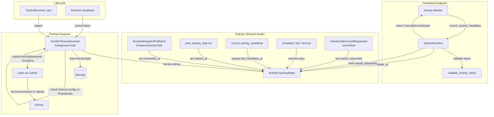

# Design Document: Activity Heartbeat and Timeouts

## Overview

This design adds activity heartbeat recording and four timeout detection mechanisms to `tokeira-runtime`, completing Feature 3 of the runtime roadmap. It builds on Feature 2 (Activity Pump), which provides the activity broker, poll/complete/fail facade methods, activity-task-start transactions, and `ActivityTaskToken` validation.

The feature has two distinct halves:

1. **Heartbeat endpoint.** A new `record_activity_heartbeat` method on `TokeiraRuntime` that accepts an `ActivityTaskToken` and heartbeat details, updates a runtime-local timestamp, and returns a cancellation indicator. This is a purely runtime-side operation — no kernel command, no history event, no storage commit. The heartbeat path reuses the existing token validation logic from Feature 2.

2. **Timeout scanner.** A background `tokio::spawn` task (`ActivityTimeoutScanner`) that periodically iterates over runtime-local tracking state, loads timeout configuration from the kernel's `ActivityState` via storage, and submits `Command::ActivityResolved(TimedOut)` through the lane when a timeout is detected. The scanner is non-authoritative: the kernel is the final arbiter. If the activity was already resolved or the run is closed, the kernel rejects the command harmlessly.

The runtime-local tracking state (`ActivityTrackingState`) is a new in-memory structure keyed by `(RunKey, String)` (run_key, activity_id). It records `scheduled_at`, `started_at`, `last_heartbeat_at`, and `cancel_requested` per activity. This state is populated by hooks in the existing activity lifecycle: dispatch publication sets `scheduled_at`, the activity-task-start transaction sets `started_at`, heartbeat calls update `last_heartbeat_at`, and activity resolution removes the entry.

The four timeout types follow Temporal's semantics:
- **Heartbeat timeout**: elapsed since `last_heartbeat_at` (or `started_at` if no heartbeat received) exceeds `ActivityState.heartbeat_timeout`. Only checked for started activities.
- **Schedule-to-start timeout**: elapsed since `scheduled_at` exceeds `ActivityState.schedule_to_start_timeout`. Only checked for unstarted activities.
- **Start-to-close timeout**: elapsed since `started_at` exceeds `ActivityState.start_to_close_timeout`. Only checked for started activities.
- **Schedule-to-close timeout**: elapsed since `scheduled_at` exceeds `ActivityState.schedule_to_close_timeout`. Checked regardless of start state. Takes precedence when multiple timeouts fire in the same scan cycle.

## Architecture



### Key design decisions

**Runtime-local tracking state, not kernel state.** The kernel's `ActivityState` stores timeout *configuration* (durations), but not the timestamps needed for timeout *detection* (`scheduled_at`, `started_at`, `last_heartbeat_at`). Adding these to `ActivityState` would mean every heartbeat requires a storage commit, which defeats the purpose of lightweight heartbeats. Instead, the runtime maintains an in-memory `ActivityTrackingState` that is populated from lifecycle events. This state is ephemeral — if the runtime restarts, it is rebuilt from storage during the first scan cycle (activities without tracking entries are loaded from storage and re-populated).

**Heartbeat is a pure runtime operation.** `record_activity_heartbeat` validates the token (reusing `validate_activity_token` from Feature 2), updates `last_heartbeat_at` in the tracking state, reads `cancel_requested`, and returns. No kernel command, no history event, no storage write. This keeps heartbeat latency minimal and avoids amplifying write pressure on storage.

**Scanner reads timeout config from storage, not from tracking state.** The tracking state only holds timestamps and cancellation status. Timeout durations (`heartbeat_timeout`, `schedule_to_start_timeout`, etc.) are read from the kernel's `ActivityState` via `repo.load_run()`. This ensures the scanner always uses the authoritative timeout configuration, even if it was updated via `UpdateActivityOptions` after the activity was scheduled.

**Schedule-to-close takes precedence.** When multiple timeouts fire for the same activity in a single scan cycle, only the `SCHEDULE_TO_CLOSE` resolution is submitted. This matches Temporal's semantics: schedule-to-close is the outer bound that subsumes all other timeouts.

**Scanner submits through the lane, not directly to the kernel.** The scanner uses the same `self.submit(run_key, Command::ActivityResolved(...))` path as completions and failures. This preserves the lane's single-writer serialization for each run and ensures the kernel's fenced transition logic handles conflicts correctly.

**Bounded batches per scan cycle.** The scanner processes at most `max_timeouts_per_scan` activities per cycle to avoid starving other lane work. Remaining timed-out activities are picked up in the next cycle.

**Graceful lifecycle management.** The scanner is spawned as a `tokio::JoinHandle` during `TokeiraRuntime::new` and cancelled via a `CancellationToken` on shutdown. Transient storage errors during scanning are logged and the scanner continues to the next cycle.

## Components and Interfaces

### ActivityTrackingState

In-memory state for timeout detection and heartbeat processing.

```rust
/// Per-activity tracking entry for timeout detection and heartbeat processing.
///
/// This is runtime-local state — not persisted, not part of the kernel's
/// ActivityState. It is populated from lifecycle hooks and consulted by the
/// heartbeat endpoint and timeout scanner.
#[derive(Clone, Debug)]
pub struct ActivityTrackingEntry {
    pub run_key: RunKey,
    pub activity_id: String,
    pub scheduled_at: OffsetDateTime,
    pub started_at: Option<OffsetDateTime>,
    pub last_heartbeat_at: Option<OffsetDateTime>,
    pub cancel_requested: bool,
}

/// Thread-safe container for activity tracking entries.
///
/// Keyed by (RunKey, activity_id) for O(1) lookup from both heartbeat
/// processing and timeout scanning.
#[derive(Default, Clone)]
pub struct ActivityTrackingState {
    inner: Arc<Mutex<HashMap<(RunKey, String), ActivityTrackingEntry>>>,
}

impl ActivityTrackingState {
    /// Record that an activity was scheduled (called from dispatch publication).
    pub fn record_scheduled(&self, run_key: RunKey, activity_id: String, now: OffsetDateTime);

    /// Record that an activity was started (called from activity-task-start txn).
    pub fn record_started(&self, run_key: RunKey, activity_id: &str, now: OffsetDateTime);

    /// Update the last heartbeat timestamp (called from record_activity_heartbeat).
    pub fn record_heartbeat(&self, run_key: RunKey, activity_id: &str, now: OffsetDateTime);

    /// Mark an activity as having a pending cancellation.
    pub fn mark_cancel_requested(&self, run_key: RunKey, activity_id: &str);

    /// Check whether an activity has a pending cancellation.
    pub fn is_cancel_requested(&self, run_key: RunKey, activity_id: &str) -> bool;

    /// Remove an activity from tracking (called on resolution).
    pub fn remove(&self, run_key: RunKey, activity_id: &str);

    /// Snapshot all tracked entries for the scanner to iterate.
    pub fn snapshot(&self) -> Vec<ActivityTrackingEntry>;
}
```

### record_activity_heartbeat

New facade method on `TokeiraRuntime`:

```rust
impl<R> TokeiraRuntime<R> where R: RunRepository + 'static {
    /// Record a heartbeat from a running activity.
    ///
    /// This is a purely runtime-side operation: no kernel command, no history
    /// event, no storage commit. Returns true if the activity has a pending
    /// cancellation request.
    pub async fn record_activity_heartbeat(
        &self,
        token: ActivityTaskToken,
        _details: Payloads,
    ) -> Result<bool>;
}
```

The method:
1. Calls `validate_activity_token(&token)` (existing method from Feature 2).
2. Updates `last_heartbeat_at` in `ActivityTrackingState`.
3. Reads and returns `cancel_requested` from `ActivityTrackingState`.

### ActivityTimeoutScanner

Background task that detects timeout violations:

```rust
pub struct ActivityTimeoutScannerConfig {
    /// How often the scanner runs. Default: 1 second.
    pub scan_interval: tokio::time::Duration,
    /// Maximum number of timeout commands to submit per scan cycle.
    pub max_timeouts_per_scan: usize,
}

impl Default for ActivityTimeoutScannerConfig {
    fn default() -> Self {
        Self {
            scan_interval: tokio::time::Duration::from_secs(1),
            max_timeouts_per_scan: 100,
        }
    }
}
```

The scanner loop:
1. Sleep for `scan_interval`.
2. Take a snapshot of `ActivityTrackingState`.
3. For each entry (up to `max_timeouts_per_scan`):
   a. Load the run's `WorkflowState` from storage to get the `ActivityState` with timeout config.
   b. If the activity is no longer in the run's activities map, remove it from tracking and skip.
   c. Evaluate timeouts in precedence order: schedule-to-close first, then heartbeat / schedule-to-start / start-to-close.
   d. If a timeout is detected, submit `Command::ActivityResolved(TimedOut { timeout_type })` via `self.submit()`.
   e. On success or harmless rejection, remove the entry from tracking state.
   f. On transient error, log and continue.

### Timeout evaluation (pure function)

```rust
pub enum TimeoutViolation {
    ScheduleToClose,
    ScheduleToStart,
    StartToClose,
    Heartbeat,
}

/// Evaluate which timeout (if any) has been violated for an activity.
///
/// Returns the highest-precedence violation, or None if no timeout has fired.
/// Schedule-to-close takes precedence over all others.
pub fn evaluate_activity_timeout(
    entry: &ActivityTrackingEntry,
    activity: &ActivityState,
    now: OffsetDateTime,
) -> Option<TimeoutViolation>;
```

### Updated TokeiraRuntime

```rust
pub struct TokeiraRuntime<R> {
    repo: Arc<R>,
    broker: InMemoryBroker,
    activity_broker: InMemoryActivityBroker,
    lanes: Vec<LaneHandle>,
    config: LaneConfig,
    // New fields:
    activity_tracking: ActivityTrackingState,
    scanner_handle: Option<tokio::task::JoinHandle<()>>,
    scanner_cancel: tokio_util::sync::CancellationToken,
}
```

### Lifecycle hooks (integration points)

The following existing methods are modified to update `ActivityTrackingState`:

| Method | Hook |
|--------|------|
| `RuntimeDispatchPublisher::publish` (EnqueueActivityTask) | `activity_tracking.record_scheduled(...)` |
| `start_activity_task` (on successful commit) | `activity_tracking.record_started(...)` |
| `complete_activity_task` (on success) | `activity_tracking.remove(...)` |
| `fail_activity_task` (on terminal failure) | `activity_tracking.remove(...)` |
| `fail_activity_task` (on retry) | entry stays in tracking (attempt changes are handled by re-scheduling) |

The `cancel_requested` flag is set when the kernel commits an `ActivityTaskCancelRequested` history event. This requires a small hook in the lane's dispatch path: after a successful commit, if the transition's history events contain `ActivityTaskCancelRequested`, the runtime marks the activity in tracking state.

## Data Models

### New types

| Type | Crate | Role |
|------|-------|------|
| `ActivityTrackingEntry` | `tokeira-runtime` | Per-activity timestamps and cancellation flag for timeout detection |
| `ActivityTrackingState` | `tokeira-runtime` | Thread-safe container for tracking entries, keyed by `(RunKey, String)` |
| `ActivityTimeoutScannerConfig` | `tokeira-runtime` | Configurable scan interval and batch size |
| `TimeoutViolation` | `tokeira-runtime` | Enum of the four timeout types for evaluation results |
| `evaluate_activity_timeout` | `tokeira-runtime` | Pure function: `(entry, activity_state, now) -> Option<TimeoutViolation>` |

### Modified types

| Type | Crate | Change |
|------|-------|--------|
| `TokeiraRuntime` | `tokeira-runtime` | Add `activity_tracking: ActivityTrackingState`, `scanner_handle`, `scanner_cancel` fields |
| `RuntimeDispatchPublisher` | `tokeira-runtime` | Add `activity_tracking: ActivityTrackingState` field, call `record_scheduled` on `EnqueueActivityTask` |

### Tracking state model

```
ActivityTrackingState:
  inner: HashMap<(RunKey, String), ActivityTrackingEntry>

ActivityTrackingEntry:
  run_key: RunKey
  activity_id: String
  scheduled_at: OffsetDateTime
  started_at: Option<OffsetDateTime>
  last_heartbeat_at: Option<OffsetDateTime>
  cancel_requested: bool
```

### Timeout evaluation logic

```
evaluate_activity_timeout(entry, activity_state, now):
  // Schedule-to-close takes precedence
  if activity_state.schedule_to_close_timeout is Some(d):
    if now - entry.scheduled_at > d:
      return Some(ScheduleToClose)

  if entry.started_at is Some(started):
    // Heartbeat timeout (only for started activities)
    if activity_state.heartbeat_timeout is Some(d):
      let baseline = entry.last_heartbeat_at.unwrap_or(started)
      if now - baseline > d:
        return Some(Heartbeat)

    // Start-to-close timeout (only for started activities)
    if activity_state.start_to_close_timeout is Some(d):
      if now - started > d:
        return Some(StartToClose)
  else:
    // Schedule-to-start timeout (only for unstarted activities)
    if activity_state.schedule_to_start_timeout is Some(d):
      if now - entry.scheduled_at > d:
        return Some(ScheduleToStart)

  return None
```

### Scanner lifecycle

```
TokeiraRuntime::new:
  1. Create ActivityTrackingState (shared across runtime and publisher)
  2. Spawn ActivityTimeoutScanner with clone of repo, tracking state, lane submit fn, cancel token
  3. Store JoinHandle and CancellationToken

TokeiraRuntime::shutdown (or Drop):
  1. Cancel the CancellationToken
  2. Await the JoinHandle (with timeout)
```


## Correctness Properties

*A property is a characteristic or behavior that should hold true across all valid executions of a system — essentially, a formal statement about what the system should do. Properties serve as the bridge between human-readable specifications and machine-verifiable correctness guarantees.*

### Property 1: Heartbeat cancellation indicator reflects tracking state

*For any* `ActivityTrackingEntry` with `cancel_requested` set to some boolean value, calling `record_activity_heartbeat` with a valid token for that activity shall return a cancellation indicator equal to `cancel_requested`.

**Validates: Requirements 1.3, 1.4**

### Property 2: Heartbeat updates last_heartbeat_at

*For any* valid `ActivityTaskToken` and any `ActivityTrackingEntry` for that activity, calling `record_activity_heartbeat` shall update `last_heartbeat_at` in the `ActivityTrackingState` to a value that is >= the time immediately before the call.

**Validates: Requirements 1.2, 2.3**

### Property 3: Stale heartbeat token rejection preserves tracking state

*For any* `ActivityTaskToken` where the token fails validation (activity not found, attempt mismatch, or shard epoch mismatch), calling `record_activity_heartbeat` shall return an error, and the `ActivityTrackingState` shall remain unchanged (no entry added, modified, or removed).

**Validates: Requirements 1.5**

### Property 4: Heartbeat produces no kernel commands

*For any* valid heartbeat call (valid token, activity exists in tracking state), the runtime shall not submit any `Command` to the lane. The lane's command count before and after the heartbeat call shall be identical.

**Validates: Requirements 1.6**

### Property 5: Dispatch publication records scheduled_at in tracking state

*For any* `DispatchOp::EnqueueActivityTask` published through `RuntimeDispatchPublisher`, the `ActivityTrackingState` shall contain an entry keyed by `(run_key, activity_id)` with `scheduled_at` set and `started_at` equal to `None`.

**Validates: Requirements 2.1**

### Property 6: Activity resolution removes tracking entry

*For any* activity that is terminally resolved (completed, failed with exhausted retries, timed out, or canceled), the `ActivityTrackingState` shall no longer contain an entry for `(run_key, activity_id)` after the resolution is processed.

**Validates: Requirements 2.4**

### Property 7: Heartbeat timeout fires for started activities with expired heartbeat

*For any* `ActivityTrackingEntry` with `started_at = Some(t)` and *for any* `ActivityState` with `heartbeat_timeout = Some(d)`, if `now - max(last_heartbeat_at, started_at) > d`, then `evaluate_activity_timeout` shall return `Some(Heartbeat)` — unless `schedule_to_close_timeout` also fires, in which case `ScheduleToClose` takes precedence. If `last_heartbeat_at` is `None`, the baseline shall be `started_at`. If `started_at` is `None`, the function shall never return `Heartbeat`.

**Validates: Requirements 3.1, 3.2, 3.3**

### Property 8: Schedule-to-start timeout fires only for unstarted activities

*For any* `ActivityTrackingEntry` with `started_at = None` and *for any* `ActivityState` with `schedule_to_start_timeout = Some(d)`, if `now - scheduled_at > d`, then `evaluate_activity_timeout` shall return `Some(ScheduleToStart)` — unless `schedule_to_close_timeout` also fires, in which case `ScheduleToClose` takes precedence. If `started_at` is `Some(_)`, the function shall never return `ScheduleToStart`.

**Validates: Requirements 4.1, 4.2**

### Property 9: Start-to-close timeout fires only for started activities

*For any* `ActivityTrackingEntry` with `started_at = Some(t)` and *for any* `ActivityState` with `start_to_close_timeout = Some(d)`, if `now - t > d`, then `evaluate_activity_timeout` shall return `Some(StartToClose)` — unless `schedule_to_close_timeout` or `heartbeat_timeout` also fires with higher precedence. If `started_at` is `None`, the function shall never return `StartToClose`.

**Validates: Requirements 5.1, 5.2**

### Property 10: Schedule-to-close timeout fires regardless of start state

*For any* `ActivityTrackingEntry` (with or without `started_at`) and *for any* `ActivityState` with `schedule_to_close_timeout = Some(d)`, if `now - scheduled_at > d`, then `evaluate_activity_timeout` shall return `Some(ScheduleToClose)`.

**Validates: Requirements 6.1**

### Property 11: Schedule-to-close takes precedence over all other timeouts

*For any* `ActivityTrackingEntry` and `ActivityState` where `schedule_to_close_timeout` fires AND at least one other timeout (heartbeat, schedule-to-start, or start-to-close) also fires, `evaluate_activity_timeout` shall return `Some(ScheduleToClose)`.

**Validates: Requirements 6.2**

### Property 12: No timeout fires when no timeout is configured

*For any* `ActivityTrackingEntry` and *for any* `ActivityState` where all four timeout fields (`heartbeat_timeout`, `schedule_to_start_timeout`, `start_to_close_timeout`, `schedule_to_close_timeout`) are `None`, `evaluate_activity_timeout` shall return `None` regardless of the timestamps in the entry.

**Validates: Requirements 3.1, 4.1, 5.1, 6.1** (inverse)

### Property 13: Scanner batch bound

*For any* set of `N` timed-out activities in the `ActivityTrackingState` where `N > max_timeouts_per_scan`, the scanner shall submit at most `max_timeouts_per_scan` timeout commands per scan cycle.

**Validates: Requirements 7.6**

### Property 14: Scanner resilience to kernel rejections

*For any* `ActivityResolved(TimedOut)` command submitted by the scanner that the kernel rejects (unknown activity, run closed, activity already resolved), the scanner shall continue processing remaining entries without crashing or propagating the error.

**Validates: Requirements 7.5**

### Property 15: Scanner resilience to transient storage errors

*For any* transient error returned by `repo.load_run()` during a scan cycle, the scanner shall log the error and continue to the next entry (or next cycle) without crashing.

**Validates: Requirements 8.3**

## Error Handling

### Stale heartbeat token

When `record_activity_heartbeat` receives a token that fails `validate_activity_token` (activity not found, attempt mismatch, or shard epoch mismatch), the runtime returns an `anyhow::Error`. No tracking state is modified. This is the expected path for late-arriving heartbeats after failover or retry.

### Activity not in tracking state during heartbeat

If the token passes validation but the activity is not in `ActivityTrackingState` (e.g., the activity was just resolved between validation and tracking lookup), the heartbeat is treated as a no-op: no error, returns `false` for cancellation. This is a benign race condition.

### Scanner storage errors

If `repo.load_run()` fails during a scan cycle (transient network error, DSQL conflict), the scanner logs at `warn` level and skips that entry. The entry remains in tracking state and will be re-evaluated in the next cycle. The scanner does not crash or stop.

### Scanner kernel rejections

When the scanner submits `Command::ActivityResolved(TimedOut)` and the kernel rejects it (via `Reject::UnknownActivity`, `Reject::RunAlreadyExists`, or any other rejection), the scanner treats this as a successful cleanup: the activity is no longer relevant, so the tracking entry is removed. The rejection is logged at `debug` level.

### Scanner lane submission errors

If `self.submit()` returns an `Err` (lane channel closed, OCC exhaustion), the scanner logs at `warn` level and continues to the next entry. The tracking entry is not removed, so the timeout will be retried in the next cycle.

### Race between heartbeat and timeout

If a heartbeat arrives while the scanner is evaluating the same activity, the heartbeat updates `last_heartbeat_at` and the scanner may see the old value. This is acceptable: the scanner will re-evaluate in the next cycle with the updated timestamp. The kernel is the final arbiter — if the activity is still alive, the `ActivityResolved(TimedOut)` command will be rejected because the activity's state has progressed.

### Race between resolution and scanner

If an activity is resolved (completed/failed) while the scanner is about to submit a timeout for it, the scanner's `ActivityResolved(TimedOut)` command will be rejected by the kernel (activity not found in state). The scanner removes the tracking entry on rejection. This is the intended non-authoritative behavior.

## Testing Strategy

### Property-based testing

All 15 correctness properties will be implemented as property-based tests using the [`proptest`](https://docs.rs/proptest) crate, consistent with the existing test infrastructure in `tokeira-runtime`.

Each property test will:
- Run a minimum of 100 iterations (proptest default is 256).
- Be tagged with a comment referencing the design property.
- Tag format: `// Feature: runtime-activity-timeouts, Property N: <title>`

**Pure function properties (highest value):** Properties 7–12 test `evaluate_activity_timeout`, which is a pure function with a rich input space (four optional timeout durations, three optional timestamps, started/unstarted state). These are the highest-value property tests because they cover the core timeout logic without any mocking. Generators produce random `ActivityTrackingEntry` and `ActivityState` values with random timeout configurations and timestamps.

**Tracking state properties:** Properties 1–6 test `ActivityTrackingState` operations and the heartbeat endpoint. These require a mock `RunRepository` for token validation but the tracking state itself is in-memory and straightforward to test.

**Scanner properties:** Properties 13–15 test the scanner's batch bounding and error resilience. These require mock storage that can be configured to return errors or specific activity states.

### Unit tests

Unit tests complement property tests for specific examples and edge cases:

- **Heartbeat with no tracking entry**: verify that heartbeat for a valid token but missing tracking entry returns `false` (no cancellation) without error.
- **Scanner default config**: verify that `ActivityTimeoutScannerConfig::default()` has `scan_interval = 1s` and `max_timeouts_per_scan = 100`.
- **Timeout evaluation with all timeouts configured and all expired**: verify that `ScheduleToClose` is returned (precedence).
- **Timeout evaluation with zero-duration timeout**: verify that a timeout of `Duration::ZERO` fires immediately.
- **Scanner removes tracking entry after successful timeout submission**: verify the entry is gone after the scanner processes it.
- **Scanner removes tracking entry after kernel rejection**: verify the entry is gone even when the kernel rejects.

### Integration tests

Integration tests exercise the full `TokeiraRuntime` with `InMemoryStore`:

- Schedule an activity, poll it (start it), wait without heartbeating, and verify the scanner submits a heartbeat timeout that produces an `ActivityTaskTimedOut` history event.
- Schedule an activity, do not poll it, and verify the scanner submits a schedule-to-start timeout.
- Schedule an activity, poll it, send heartbeats, then stop heartbeating, and verify the heartbeat timeout fires after the configured interval.
- Schedule an activity with `schedule_to_close_timeout`, poll it, and verify the schedule-to-close timeout fires and takes precedence over start-to-close.
- Verify that `record_activity_heartbeat` returns `true` after a `RequestCancelActivity` command is processed.

### Test configuration

```toml
[dev-dependencies]
proptest = "1"
tokio-util = { version = "0.7", features = ["rt"] }  # for CancellationToken in tests
```

Each property test annotation:
```rust
// Feature: runtime-activity-timeouts, Property 7: Heartbeat timeout fires for started activities
proptest! {
    #[test]
    fn prop_heartbeat_timeout_detection(
        heartbeat_timeout_ms in 1i64..60_000,
        elapsed_ms in 0i64..120_000,
        has_heartbeat in any::<bool>(),
        has_started in any::<bool>(),
    ) {
        // ...
    }
}
```

Each correctness property MUST be implemented by a SINGLE property-based test. Property tests should run a minimum of 100 iterations.
