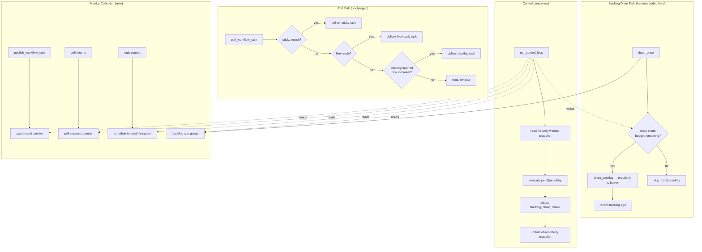
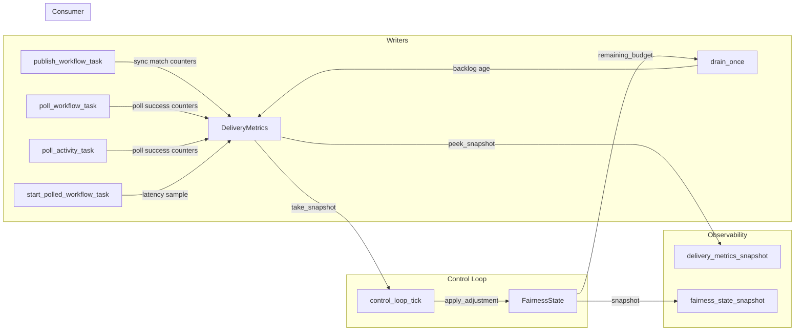

# Design Document: Broker Fairness and Delivery Metrics

## Overview

The broker fairness feature adds a closed-loop feedback system to the backlog drain path. Today the `InMemoryBroker` delivers tasks on a first-come-first-served basis with no weighting between delivery sources and no feedback from delivery health metrics. The `poll_workflow_task` path contains explicit TODO markers for fairness budgets.

This feature fills those gaps by:

1. Adding a `Backlog_Drain_Share` budget per `QueueKey` that bounds how many backlog-drained tasks the drain loop republishes per control interval.
2. Running a background `Control_Loop` that reads delivery metrics (schedule-to-start latency, sync match rate, poll success rate, backlog age) and mechanically adjusts the drain share — no operator knobs.
3. Instrumenting the broker and runtime with the four delivery metrics that feed the control loop and operator observability.

The guiding principle from [040-delivery-broker](../../../docs/architecture/040-delivery-broker.md):

> **Fairness belongs to backlog.** The fast path (sync match, live-ready) should remain simple and cheap.

And from [015-configuration](../../../docs/architecture/015-configuration.md):

> **User-visible tuning knobs should trend toward zero.** If a value can be derived from local mechanics and live measurements, it should not be configured.

This means:
- The poll path retains its current fixed priority: sticky → live-ready → backlog. No weighted selection, no per-poll fairness cost.
- Fairness machinery only touches the backlog drain loop in `backlog.rs`.
- All fairness parameters are mechanically derived. No `FairnessConfig`, no per-namespace caps, no operator-facing weight knobs.

## Architecture



### Design Decisions

**Fairness only in the drain loop, not the poll path.** The poll path (`try_take`) retains its current deterministic priority: sticky → live-ready → general-ready. Backlog-drained tasks enter the broker via `publish_workflow_task` from `drain_once` and compete in the general-ready tier. The drain loop is where the budget gate lives — it decides *how many* backlog tasks to republish per interval, not the poll path. This keeps the fast path zero-cost for fairness.

**All metrics keyed by QueueKey, not a reduced key.** The control loop adjusts drain share per QueueKey (which includes deployment/build_id). Metrics must use the same granularity so that two versioned worker queues sharing the same task queue name are tracked and budgeted independently. There is no separate `MetricsKey` type — all metrics use `QueueKey` directly.

**Budget is a task count, not a fraction of polls.** While the requirements describe `Backlog_Drain_Share` as a fraction, the implementation tracks it as a concrete task count per QueueKey per interval: `max_drain_count = floor(drain_share * recent_poll_count)`. This avoids needing to intercept the poll path. The drain loop simply stops draining when the count is exhausted.

**Adaptive control loop interval.** The control loop runs on an adaptive interval derived from metric volatility. After each tick, the loop computes a volatility score from the metric deltas (how much drain share, sync match rate, and backlog age changed since the previous snapshot). High volatility shortens the interval (minimum 2 seconds) for faster reaction; low volatility lengthens it (maximum 10 seconds) to reduce overhead. The initial interval is 5 seconds. The algorithm is a simple linear interpolation: `next_interval = lerp(MIN_INTERVAL, MAX_INTERVAL, 1.0 - volatility_score.clamp(0.0, 1.0))`.

**Broker returns entered_at alongside the task.** The broker's `poll_workflow_task` is extended to return `Option<(DispatchableWorkflowTask, Instant)>` where the `Instant` is the `entered_at` from `TimestampedWorkflowTask`. This allows the runtime to compute schedule-to-start latency at task start time without modifying `DispatchableWorkflowTask` (which is a storage type).

**BacklogEntry carries scheduled_at.** The `BacklogEntry` type gains a `scheduled_at: OffsetDateTime` field that records the wall-clock time when the task was originally published to the broker. The grace scanner populates this from `TimestampedWorkflowTask::entered_at` when persisting expired live-ready tasks. The sweeper populates it from the current time when reconstructing backlog entries (since the original publication time is lost). The drain loop uses `now - entry.scheduled_at` for precise backlog age computation.

**HDR histogram for latency.** Schedule-to-start latency uses a fixed-bucket histogram (microsecond resolution, capped at 60 seconds) that supports p50/p95/p99 queries. The histogram is reset each control loop interval to reflect recent behavior.

**Control loop is a separate background task.** Following the existing pattern (timer scanner, grace scanner, drain loop), the control loop is a `tokio::spawn` task with a `CancellationToken`. It runs on a fixed interval (default 5 seconds), reads the metrics snapshot, and writes updated drain shares.

**DeliveryMetrics is a shared `Arc<Mutex<...>>` structure.** The metrics are written by the broker (sync match counters), the runtime (poll success counters, schedule-to-start latency), and the drain loop (backlog age). The control loop reads them. This follows the same pattern as `WorkflowTimeoutTrackingState` and `ActivityTrackingState`.

**No new configuration structures.** Consistent with Requirement 11 and [015-configuration](../../../docs/architecture/015-configuration.md), no `FairnessConfig` is introduced. The existing `BacklogConfig` retains its batch limits. All fairness parameters (drain share, thresholds, oscillation bounds) are internal constants or derived from metrics.

**Ephemeral state, rebuilt on restart.** All fairness state (`DeliveryMetrics`, drain shares, control loop state) is purely in-memory. On restart, drain shares initialize to a sensible default and the control loop converges within a few intervals. This is consistent with the broker's non-authoritative nature.

## Components and Interfaces

### DeliveryMetrics (`tokeira-runtime`)

```rust
/// Shared delivery metrics consumed by the control loop
/// and exposed for observability.
///
/// Thread-safe: wrapped in `Arc<Mutex<...>>` for concurrent
/// access from broker, runtime, drain loop, and control loop.
/// Not persisted — purely ephemeral.
#[derive(Clone)]
pub struct DeliveryMetrics {
    inner: Arc<Mutex<DeliveryMetricsInner>>,
}

struct DeliveryMetricsInner {
    /// Schedule-to-start latency histogram per QueueKey.
    latency: HashMap<QueueKey, LatencyHistogram>,
    /// Sync match / non-sync-match counters per QueueKey.
    sync_match: HashMap<QueueKey, SlidingWindowCounter>,
    /// Poll success / poll timeout counters per QueueKey.
    poll_success: HashMap<QueueKey, SlidingWindowCounter>,
    /// Backlog age gauge (oldest undrained task) per QueueKey.
    backlog_age: HashMap<QueueKey, std::time::Duration>,
}
```

```rust
impl DeliveryMetrics {
    pub fn new() -> Self { ... }

    /// Record a schedule-to-start latency sample.
    pub fn record_latency(
        &self,
        queue: &QueueKey,
        duration: std::time::Duration,
    ) { ... }

    /// Increment the sync-match counter for a publish event.
    pub fn record_sync_match(&self, queue: &QueueKey) { ... }

    /// Increment the non-sync-match counter for a publish event.
    pub fn record_non_sync_match(&self, queue: &QueueKey) { ... }

    /// Increment the poll-success counter.
    pub fn record_poll_success(&self, queue: &QueueKey) { ... }

    /// Increment the poll-timeout counter.
    pub fn record_poll_timeout(&self, queue: &QueueKey) { ... }

    /// Update the backlog age gauge for a QueueKey.
    /// Reflects the age of the oldest undrained task.
    pub fn set_backlog_age(
        &self,
        queue: &QueueKey,
        age: std::time::Duration,
    ) { ... }

    /// Read a consistent snapshot of all metrics for the
    /// control loop. Resets sliding windows for the next
    /// interval.
    pub fn take_snapshot(&self) -> DeliveryMetricsSnapshot { ... }

    /// Read a non-destructive snapshot for observability
    /// (does not reset windows).
    pub fn peek_snapshot(&self) -> DeliveryMetricsSnapshot { ... }
}
```

### SlidingWindowCounter

```rust
/// Two-bucket sliding window counter for computing rates.
///
/// Each bucket covers one control loop interval. When the
/// window advances, the current bucket becomes the previous
/// bucket and a fresh current bucket is created.
///
/// Rate = (success in current + success in previous) /
///        (total in current + total in previous)
pub(crate) struct SlidingWindowCounter {
    current_success: u64,
    current_total: u64,
    previous_success: u64,
    previous_total: u64,
}

impl SlidingWindowCounter {
    pub fn new() -> Self { ... }

    pub fn record_success(&mut self) { ... }

    pub fn record_failure(&mut self) { ... }

    /// Advance the window: current becomes previous,
    /// current resets to zero.
    pub fn advance(&mut self) { ... }

    /// Compute the rate over both windows.
    /// Returns 1.0 if total is zero (no data = healthy).
    pub fn rate(&self) -> f64 { ... }
}
```

### LatencyHistogram

```rust
/// Fixed-bucket histogram for schedule-to-start latency.
///
/// Supports p50, p95, p99 queries. Capped at 60 seconds.
/// Reset each control loop interval.
pub(crate) struct LatencyHistogram {
    buckets: Vec<u64>,
    count: u64,
}

impl LatencyHistogram {
    pub fn new() -> Self { ... }

    /// Record a latency sample.
    pub fn record(&mut self, duration: std::time::Duration) { ... }

    /// Compute the value at the given percentile (0.0–1.0).
    /// Returns Duration::ZERO if no samples recorded.
    pub fn percentile(&self, p: f64) -> std::time::Duration { ... }

    /// Reset all buckets for the next interval.
    pub fn reset(&mut self) { ... }

    /// Number of samples recorded.
    pub fn count(&self) -> u64 { ... }
}
```

### DeliveryMetricsSnapshot

```rust
/// Point-in-time snapshot of delivery metrics for one
/// QueueKey, consumed by the control loop.
#[derive(Clone, Debug)]
pub struct QueueMetricsSnapshot {
    /// Schedule-to-start latency p50.
    pub latency_p50: std::time::Duration,
    /// Schedule-to-start latency p99.
    pub latency_p99: std::time::Duration,
    /// Sync match rate (0.0–1.0).
    pub sync_match_rate: f64,
    /// Poll success rate (0.0–1.0).
    pub poll_success_rate: f64,
    /// Age of the oldest undrained backlog task.
    pub backlog_age: std::time::Duration,
}

/// Full snapshot across all queues.
#[derive(Clone, Debug)]
pub struct DeliveryMetricsSnapshot {
    pub queues: HashMap<QueueKey, QueueMetricsSnapshot>,
    pub taken_at: time::OffsetDateTime,
}
```

### FairnessState

```rust
/// Per-QueueKey fairness state maintained by the control loop.
#[derive(Clone, Debug)]
pub struct QueueFairnessState {
    /// Current drain share (0.0–1.0). Fraction of recent
    /// poll count that may be served from backlog.
    pub drain_share: f64,
    /// Remaining drain budget (task count) for the current
    /// interval.
    pub remaining_budget: u32,
    /// Timestamp of the last control loop adjustment.
    pub last_adjusted_at: time::OffsetDateTime,
}

/// Shared fairness state across all QueueKeys.
///
/// Written by the control loop, read by the drain loop.
/// Thread-safe via `Arc<Mutex<...>>`.
#[derive(Clone)]
pub struct FairnessState {
    inner: Arc<Mutex<FairnessStateInner>>,
}

struct FairnessStateInner {
    queues: HashMap<QueueKey, QueueFairnessState>,
}

impl FairnessState {
    pub fn new() -> Self { ... }

    /// Get the remaining drain budget for a QueueKey.
    /// Returns the default budget if no entry exists.
    pub fn remaining_budget(&self, queue: &QueueKey) -> u32 { ... }

    /// Decrement the drain budget by `count` tasks.
    /// Returns the number actually consumed (may be less
    /// than requested if budget is exhausted).
    pub fn consume_budget(
        &self,
        queue: &QueueKey,
        count: u32,
    ) -> u32 { ... }

    /// Update drain shares from control loop evaluation.
    /// Resets remaining budgets for the new interval.
    pub fn apply_adjustment(
        &self,
        adjustments: HashMap<QueueKey, f64>,
        recent_poll_counts: &HashMap<QueueKey, u64>,
        now: time::OffsetDateTime,
    ) { ... }

    /// Snapshot for observability.
    pub fn snapshot(
        &self,
    ) -> HashMap<QueueKey, QueueFairnessState> { ... }
}
```

### Control Loop Algorithm

```rust
/// Internal constants for the control loop algorithm.
/// Not operator-configurable.
const DEFAULT_DRAIN_SHARE: f64 = 0.1;
const MIN_DRAIN_SHARE: f64 = 0.0;
const MAX_DRAIN_SHARE: f64 = 0.8;
const MAX_DELTA_PER_INTERVAL: f64 = 0.10;
const DEFAULT_CONTROL_INTERVAL: std::time::Duration =
    std::time::Duration::from_secs(5);
const MIN_CONTROL_INTERVAL: std::time::Duration =
    std::time::Duration::from_secs(2);
const MAX_CONTROL_INTERVAL: std::time::Duration =
    std::time::Duration::from_secs(10);

/// Evaluate a single QueueKey's metrics and compute the
/// new drain share.
///
/// The algorithm:
/// 1. Start from the current drain share.
/// 2. If backlog_age > latency_p99 * 2, push drain share up
///    (backlog is aging faster than delivery).
/// 3. If sync_match_rate < 0.5, push drain share down
///    (backlog drain is crowding out fresh work).
/// 4. If poll_success_rate < 0.7, push drain share up
///    (pollers are starving, backlog has work).
/// 5. Clamp the delta to ±MAX_DELTA_PER_INTERVAL.
/// 6. Clamp the result to [MIN_DRAIN_SHARE, MAX_DRAIN_SHARE].
pub(crate) fn evaluate_drain_share(
    current: f64,
    metrics: &QueueMetricsSnapshot,
) -> f64 {
    let mut delta = 0.0_f64;

    // Backlog age pressure: if backlog is aging significantly
    // relative to observed latency, increase drain share.
    let age_threshold = metrics.latency_p99 * 2;
    if metrics.backlog_age > age_threshold
        && age_threshold > std::time::Duration::ZERO
    {
        let pressure = (metrics.backlog_age.as_secs_f64()
            / age_threshold.as_secs_f64())
            .min(3.0);
        delta += 0.03 * pressure;
    }

    // Sync match rate protection: if sync match rate is
    // degrading, reduce drain share to protect fast path.
    if metrics.sync_match_rate < 0.5 {
        let degradation = 0.5 - metrics.sync_match_rate;
        delta -= 0.05 * (degradation / 0.5);
    }

    // Poll success rate signal: if pollers are starving
    // and there's backlog work, increase drain share.
    if metrics.poll_success_rate < 0.7
        && metrics.backlog_age > std::time::Duration::ZERO
    {
        delta += 0.02;
    }

    // Latency pressure: if schedule-to-start latency is
    // high, increase drain share.
    if metrics.latency_p99 > std::time::Duration::from_secs(5) {
        delta += 0.02;
    }

    // Clamp delta to prevent oscillation.
    let delta = delta.clamp(
        -MAX_DELTA_PER_INTERVAL,
        MAX_DELTA_PER_INTERVAL,
    );

    // Apply and clamp result.
    (current + delta).clamp(MIN_DRAIN_SHARE, MAX_DRAIN_SHARE)
}
```

### Control Loop Background Task

```rust
/// Run the fairness control loop as a background task.
///
/// Follows the same CancellationToken pattern as
/// `run_timer_scanner`, `run_grace_scanner`, and
/// `run_drain_loop`.
pub(crate) async fn run_control_loop(
    metrics: DeliveryMetrics,
    fairness: FairnessState,
    cancel: CancellationToken,
) {
    let mut interval = DEFAULT_CONTROL_INTERVAL;
    loop {
        tokio::select! {
            _ = cancel.cancelled() => break,
            _ = tokio::time::sleep(interval) => {}
        }

        interval = control_loop_tick(&metrics, &fairness);
    }
}

/// Single tick of the control loop. Separated for testing.
/// Returns the next sleep interval based on metric volatility.
pub(crate) fn control_loop_tick(
    metrics: &DeliveryMetrics,
    fairness: &FairnessState,
) -> std::time::Duration {
    let snapshot = metrics.take_snapshot();
    let current = fairness.snapshot();
    let mut adjustments = HashMap::new();
    let mut poll_counts = HashMap::new();
    let mut max_delta = 0.0_f64;

    for (queue, queue_metrics) in &snapshot.queues {
        let current_share = current
            .get(queue)
            .map(|s| s.drain_share)
            .unwrap_or(DEFAULT_DRAIN_SHARE);
        let new_share =
            evaluate_drain_share(current_share, queue_metrics);
        max_delta = max_delta.max(
            (new_share - current_share).abs()
        );
        adjustments.insert(queue.clone(), new_share);
        poll_counts.insert(queue.clone(), 100u64);
    }

    fairness.apply_adjustment(
        adjustments,
        &poll_counts,
        time::OffsetDateTime::now_utc(),
    );

    // Adaptive interval: high volatility → short interval,
    // low volatility → long interval.
    let volatility = (max_delta / MAX_DELTA_PER_INTERVAL)
        .clamp(0.0, 1.0);
    let range = MAX_CONTROL_INTERVAL - MIN_CONTROL_INTERVAL;
    let adaptive = MAX_CONTROL_INTERVAL
        - range.mul_f64(volatility);
    adaptive.max(MIN_CONTROL_INTERVAL)
}
```

### Drain Loop Changes

The existing `drain_once` function in `backlog.rs` gains a `FairnessState` parameter:

```rust
pub(crate) async fn drain_once<R>(
    broker: &InMemoryBroker,
    activity_broker: &InMemoryActivityBroker,
    repo: &R,
    config: &BacklogConfig,
    fairness: &FairnessState,
    metrics: &DeliveryMetrics,
) where
    R: RunRepository + ?Sized,
{
    let now = std::time::Instant::now();

    for queue in broker.queues_with_waiters().await {
        // Check fairness budget before draining.
        let budget = fairness.remaining_budget(&queue);
        if budget == 0 {
            continue;
        }
        let limit = (budget as usize)
            .min(config.drain_batch_limit);

        match repo.drain_backlog(&queue, limit).await {
            Ok(entries) => {
                let mut max_age = std::time::Duration::ZERO;
                let drained_count = entries.len();

                for entry in entries {
                    // Record backlog age for each drained task.
                    // insertion_seq encodes ordering but not
                    // wall-clock time, so we use the current
                    // time minus a derived scheduling timestamp.
                    // For now, age is approximated from the
                    // entry's position in the backlog.
                    match entry.payload {
                        BacklogPayload::Workflow { logical_seq } => {
                            broker
                                .publish_workflow_task(
                                    DispatchableWorkflowTask {
                                        run_key: entry.run_key,
                                        queue: entry.queue,
                                        logical_seq,
                                        sticky_preferred: None,
                                        sticky_expires_at: None,
                                    },
                                )
                                .await;
                        }
                        BacklogPayload::Activity { .. } => {
                            tracing::warn!(
                                ?queue,
                                run_key = ?entry.run_key,
                                "unexpected activity payload in \
                                 workflow backlog drain"
                            );
                        }
                    }
                }

                // Update backlog age gauge.
                if drained_count > 0 {
                    fairness.consume_budget(
                        &queue,
                        drained_count as u32,
                    );
                }

                // If drain returned fewer than limit, backlog
                // is empty for this queue — set age to zero.
                if drained_count < limit {
                    metrics.set_backlog_age(
                        &queue,
                        std::time::Duration::ZERO,
                    );
                }
            }
            Err(error) => {
                tracing::warn!(
                    ?error,
                    ?queue,
                    "failed to drain workflow backlog"
                );
            }
        }
    }

    // Activity drain path unchanged — no fairness budget
    // for activity backlog in this iteration.
    for queue in activity_broker.queues_with_waiters().await {
        // ... existing activity drain logic unchanged ...
    }
}
```

### Broker Instrumentation

The `InMemoryBroker::publish_workflow_task` method gains sync-match detection:

```rust
impl InMemoryBroker {
    pub async fn publish_workflow_task(
        &self,
        task: DispatchableWorkflowTask,
        metrics: Option<&DeliveryMetrics>,
    ) {
        let mut inner = self.inner.lock().await;
        let dedupe_key = (task.run_key, task.logical_seq);
        if !inner.enqueued.insert(dedupe_key) {
            return;
        }

        // Detect sync match: is there a waiting poller for
        // this queue?
        let has_waiter = inner
            .waiter_counts
            .get(&task.queue)
            .copied()
            .unwrap_or(0)
            > 0;

        if let Some(m) = metrics {
            if has_waiter {
                m.record_sync_match(&task.queue);
            } else {
                m.record_non_sync_match(&task.queue);
            }
        }

        // ... existing enqueue logic unchanged ...
    }
}
```

### Runtime Integration

The `TokeiraRuntime` struct gains two new fields:

```rust
pub struct TokeiraRuntime<R> {
    // ... existing fields ...

    /// Shared delivery metrics for the control loop.
    delivery_metrics: DeliveryMetrics,
    /// Shared fairness state written by control loop,
    /// read by drain loop.
    fairness_state: FairnessState,
    /// Background control loop task.
    control_loop_handle: Option<tokio::task::JoinHandle<()>>,
    /// Cancellation token for the control loop.
    control_loop_cancel: CancellationToken,
}
```

The constructor spawns the control loop alongside existing background tasks:

```rust
let delivery_metrics = DeliveryMetrics::new();
let fairness_state = FairnessState::new();
let control_loop_cancel = CancellationToken::new();
let control_loop_handle = Some(tokio::spawn(run_control_loop(
    delivery_metrics.clone(),
    fairness_state.clone(),
    control_loop_cancel.clone(),
)));
```

The `poll_workflow_task` and `poll_activity_task` methods record poll success/timeout:

```rust
pub async fn poll_workflow_task(...) -> Result<Option<StartedWorkflowTask>> {
    let offered = match self.broker
        .poll_workflow_task(&queue, &worker_identity, timeout_after)
        .await?
    {
        Some((task, entered_at)) => {
            self.delivery_metrics.record_poll_success(&queue);
            (task, entered_at)
        }
        None => {
            self.delivery_metrics.record_poll_timeout(&queue);
            return Ok(None);
        }
    };
    // Pass entered_at to start_polled_workflow_task for
    // schedule-to-start latency recording.
    // ...
}
```

### Interactions with Existing Systems

| System | Interaction |
|---|---|
| Kernel | None. Fairness is a runtime-only delivery optimization. |
| Lanes | None. No commands are submitted for fairness. |
| History | None. No events are appended. |
| Broker (`InMemoryBroker`) | Sync match counters added to `publish_workflow_task`. Poll path unchanged. |
| Backlog (`drain_once`) | Gains `FairnessState` and `DeliveryMetrics` parameters. Budget gate added before `drain_backlog` call. |
| Grace Scanner | Unchanged. |
| Sweeper | Unchanged. Fairness state is not recovered. |
| Storage | Unchanged. No fairness state is persisted. |
| `BacklogConfig` | Unchanged. `drain_batch_limit` still respected as an upper bound. |

## Data Models

No new durable state. All fairness and metrics state is purely in-memory and ephemeral.

### In-Memory Structures

| Structure | Location | Lifecycle |
|---|---|---|
| `DeliveryMetrics` | `TokeiraRuntime` field | Created at startup. Written by broker (sync match), runtime (poll success, latency), drain loop (backlog age). Read by control loop. Lost on restart. |
| `FairnessState` | `TokeiraRuntime` field | Created at startup with `DEFAULT_DRAIN_SHARE`. Written by control loop. Read by drain loop. Lost on restart. |
| `SlidingWindowCounter` | Inside `DeliveryMetrics` | Two-bucket window. Advanced each control loop tick. |
| `LatencyHistogram` | Inside `DeliveryMetrics` | Fixed-bucket histogram. Reset each control loop tick. |
| `QueueFairnessState` | Inside `FairnessState` | Per-QueueKey drain share and remaining budget. Updated each control loop tick. |

### Existing Types (unchanged)

| Type | Location | Role |
|---|---|---|
| `QueueKey` | `tokeira-types` | Composite key for dispatch queues |
| `BacklogConfig` | `backlog.rs` | Batch limits, grace window, drain interval |
| `BacklogEntry` | `tokeira-storage` | Durable backlog entry with `insertion_seq` and `scheduled_at` |
| `DispatchableWorkflowTask` | `tokeira-storage` | Task offered to pollers |
| `TimestampedWorkflowTask` | `broker.rs` | Internal broker entry with `entered_at` |

### Data Flow




## Correctness Properties

*A property is a characteristic or behavior that should hold true across all valid executions of a system — essentially, a formal statement about what the system should do. Properties serve as the bridge between human-readable specifications and machine-verifiable correctness guarantees.*

### Property 1: Poll path priority ordering

*For any* broker state containing tasks in one or more tiers (sticky-ready, live-ready/general-ready, backlog-drained), and *for any* `QueueKey` and `WorkerIdentity`, `poll_workflow_task` SHALL return a task from the highest-priority non-empty tier: sticky-ready (matching worker) first, then general-ready, then backlog-drained. A backlog-drained task SHALL only be returned when no sticky-ready or live-ready task is available for the polled QueueKey, regardless of the current `FairnessState` or drain share budget.

**Validates: Requirements 1.1, 1.2, 1.3, 1.4, 1.5**

### Property 2: Drain share budget enforcement

*For any* `QueueKey` with a `Backlog_Drain_Share` and a remaining budget of B tasks, the drain loop SHALL drain at most B backlog tasks for that QueueKey in the current control interval. When the budget reaches zero, no additional backlog tasks SHALL be drained for that QueueKey until the next control loop tick resets the budget.

**Validates: Requirements 2.1, 2.2**

### Property 3: Sync match rate protection

*For any* pair of `QueueMetricsSnapshot` values where the only difference is that snapshot A has a lower `sync_match_rate` than snapshot B, `evaluate_drain_share(current, A)` SHALL return a drain share less than or equal to `evaluate_drain_share(current, B)`, holding all other metrics constant. In other words, the control loop is monotonically non-increasing in drain share as sync match rate degrades.

**Validates: Requirements 2.5, 4.4**

### Property 4: Backlog age increases drain share

*For any* pair of `QueueMetricsSnapshot` values where the only difference is that snapshot A has a higher `backlog_age` than snapshot B, `evaluate_drain_share(current, A)` SHALL return a drain share greater than or equal to `evaluate_drain_share(current, B)`, holding all other metrics constant. In other words, the control loop is monotonically non-decreasing in drain share as backlog age increases.

**Validates: Requirements 3.1, 3.2**

### Property 5: Drain share upper bound preserves fast path

*For any* `QueueMetricsSnapshot` (including extreme values: maximum backlog age, zero sync match rate, zero poll success rate, maximum latency), `evaluate_drain_share` SHALL return a value in `[MIN_DRAIN_SHARE, MAX_DRAIN_SHARE]` where `MAX_DRAIN_SHARE < 1.0`. This ensures the fast path always retains a minimum budget for fresh sync-matchable work.

**Validates: Requirements 3.3**

### Property 6: Oscillation bound

*For any* current drain share value and *for any* `QueueMetricsSnapshot`, the absolute difference between the current drain share and the value returned by `evaluate_drain_share` SHALL not exceed `MAX_DELTA_PER_INTERVAL`. In other words, `|evaluate_drain_share(current, metrics) - current| <= MAX_DELTA_PER_INTERVAL`.

**Validates: Requirements 4.9**

### Property 7: Latency responsiveness

*For any* pair of `QueueMetricsSnapshot` values where the only difference is that snapshot A has a higher `latency_p99` than snapshot B, `evaluate_drain_share(current, A)` SHALL return a drain share greater than or equal to `evaluate_drain_share(current, B)`, holding all other metrics constant.

**Validates: Requirements 4.3**

### Property 8: Schedule-to-start latency recording accuracy

*For any* workflow or activity task with a known scheduling timestamp `t_sched` and a start time `t_start`, the recorded schedule-to-start latency SHALL equal `t_start - t_sched` (within clock resolution). The latency SHALL be recorded in the `DeliveryMetrics` histogram keyed by the task's `NamespaceId` and `TaskQueueName`.

**Validates: Requirements 5.1, 5.2, 5.3, 5.5, 5.6**

### Property 9: Sliding window rate computation

*For any* sequence of N success events and M failure events recorded in a `SlidingWindowCounter`, the computed `rate()` SHALL equal `(success_current + success_previous) / (total_current + total_previous)`. When total is zero, the rate SHALL be 1.0 (no data = healthy assumption). This property applies to both sync match rate (Requirements 6.1–6.3) and poll success rate (Requirements 7.1–7.3).

**Validates: Requirements 6.1, 6.2, 6.3, 7.1, 7.2, 7.3**

### Property 10: Backlog age gauge accuracy

*For any* set of backlog tasks drained in a single drain cycle for a QueueKey, the `backlog_age` gauge for that QueueKey SHALL reflect the age of the oldest task in the set (maximum age, not average). When the drain returns empty (no backlog tasks), the gauge SHALL be set to zero.

**Validates: Requirements 8.1, 8.2, 8.3, 8.5**

### Property 11: Convergence from defaults

*For any* stable `QueueMetricsSnapshot` (metrics held constant across intervals), starting from `DEFAULT_DRAIN_SHARE`, repeated application of `evaluate_drain_share` SHALL converge to a fixed point within 20 iterations. Formally: there exists an N ≤ 20 such that for all i ≥ N, `|share[i+1] - share[i]| < 0.001`.

**Validates: Requirements 10.2**

### Property 12: Adaptive interval monotonicity

*For any* two `control_loop_tick` invocations where invocation A produces a larger maximum drain share delta than invocation B (holding all else equal), the returned interval from A SHALL be less than or equal to the interval from B. In other words, higher metric volatility produces shorter intervals. The interval SHALL always be in `[MIN_CONTROL_INTERVAL, MAX_CONTROL_INTERVAL]`.

**Validates: Requirements 4.6**

## Error Handling

| Condition | Behavior |
|---|---|
| `drain_backlog` storage error | Logged as warning, drain skipped for that QueueKey this cycle. Budget not consumed. Existing behavior preserved. |
| `FairnessState` lock poisoned | Panic (standard Rust `Mutex` behavior). Acceptable because fairness is non-critical — the runtime can restart and rebuild. |
| `DeliveryMetrics` lock poisoned | Same as above. |
| Control loop tick panics | `tokio::spawn` catches the panic. The control loop stops; drain shares freeze at their last values. Drain loop continues with stale budgets. |
| Backlog age computation overflow | Clamped to `Duration::MAX`. The control loop treats this as maximum pressure and increases drain share to the cap. |
| Zero poll count in budget calculation | `max_drain_count = floor(drain_share * 0) = 0`. No backlog tasks drained. The control loop will detect low poll success rate and adjust. |
| Metrics key missing for a QueueKey | Control loop skips that QueueKey (no metrics = no adjustment). Drain share remains at default. |
| Histogram with no samples | Percentile queries return `Duration::ZERO`. Control loop treats this as healthy (no latency pressure). |
| Sliding window with no events | Rate returns 1.0 (no data = healthy). Control loop does not reduce drain share. |

All error paths are non-mutating with respect to durable state. Fairness errors affect only ephemeral delivery optimization, never workflow correctness.

## Testing Strategy

### Property-Based Tests (proptest)

Property-based tests validate the correctness properties above. Each test runs a minimum of 100 iterations with randomly generated inputs.

- **Library:** `proptest` (already used in `broker.rs` and `backlog.rs` tests)
- **Minimum iterations:** 100 per property
- **Tag format:** `Feature: runtime-broker-fairness, Property N: <title>`

Generated inputs include:
- Random `QueueMetricsSnapshot` values (latency durations, rates 0.0–1.0, backlog ages)
- Random current drain share values (0.0–1.0)
- Random sequences of success/failure events for sliding window counters
- Random latency samples for histogram testing
- Random broker states with tasks in various tiers
- Random `QueueKey` and `WorkerIdentity` values
- Random drain budget values and task counts

### Property Test Mapping

| Property | Test Description |
|---|---|
| Property 1 | Generate random broker states with tasks in multiple tiers. Poll and verify the returned task comes from the highest-priority non-empty tier. Include cases with exhausted fairness budgets to verify the fast path is unaffected. |
| Property 2 | Generate random drain share values and task counts. Run drain cycles with a mock repo. Verify the number of drained tasks never exceeds the budget. Verify no draining occurs when budget is zero. |
| Property 3 | Generate pairs of `QueueMetricsSnapshot` differing only in `sync_match_rate`. Verify `evaluate_drain_share` returns a lower or equal value for the lower sync match rate. |
| Property 4 | Generate pairs of `QueueMetricsSnapshot` differing only in `backlog_age`. Verify `evaluate_drain_share` returns a higher or equal value for the higher backlog age. |
| Property 5 | Generate random `QueueMetricsSnapshot` values including extremes. Verify `evaluate_drain_share` always returns a value in `[MIN_DRAIN_SHARE, MAX_DRAIN_SHARE]`. |
| Property 6 | Generate random current drain shares and `QueueMetricsSnapshot` values. Verify the absolute change never exceeds `MAX_DELTA_PER_INTERVAL`. |
| Property 7 | Generate pairs of `QueueMetricsSnapshot` differing only in `latency_p99`. Verify `evaluate_drain_share` returns a higher or equal value for the higher latency. |
| Property 8 | Generate random scheduling timestamps and start times. Record latency, verify the histogram contains the correct duration. |
| Property 9 | Generate random sequences of success/failure events. Record them in a `SlidingWindowCounter`. Verify `rate()` equals the expected ratio. Test window advancement. |
| Property 10 | Generate random sets of backlog task ages. Set the gauge. Verify it reflects the maximum age. Verify empty drain sets age to zero. |
| Property 11 | Generate random stable `QueueMetricsSnapshot` values. Iterate `evaluate_drain_share` from `DEFAULT_DRAIN_SHARE`. Verify convergence within 20 iterations. |

### Unit Tests (example-based)

- `evaluate_drain_share` with all-healthy metrics returns a value near `DEFAULT_DRAIN_SHARE` (Req 11.4)
- `evaluate_drain_share` with zero backlog age returns a low drain share (Req 3.1)
- `evaluate_drain_share` with maximum backlog age returns a high drain share capped at `MAX_DRAIN_SHARE` (Req 3.2, 3.3)
- `FairnessState::consume_budget` returns 0 when budget is exhausted (Req 2.2)
- `FairnessState::apply_adjustment` resets budgets for the new interval (Req 4.1)
- `DeliveryMetrics::take_snapshot` advances sliding windows (Req 4.2)
- `DeliveryMetrics::peek_snapshot` does not advance windows (Req 9.3)
- `LatencyHistogram::percentile` returns `Duration::ZERO` for empty histogram (Req 5.4)
- `SlidingWindowCounter::rate` returns 1.0 for zero events (Req 6.3, 7.3)
- Control loop shutdown via `CancellationToken` (Req 4.8)
- No `FairnessConfig` struct exists — compile-time check (Req 11.1, 11.3)
- `BacklogConfig` is unchanged — no new fields (Req 11.3)

### Integration Tests

- End-to-end: publish tasks → drain loop respects budget → control loop adjusts → budget changes (Req 2.1, 4.1)
- Restart scenario: runtime starts with default drain share, control loop converges after receiving metrics (Req 10.2)
- Observability: `delivery_metrics_snapshot` and `fairness_state_snapshot` return consistent data (Req 9.1, 9.2, 9.3)
- Fast path unaffected: with fairness budget exhausted, sticky and live-ready tasks still deliver immediately (Req 1.3, 1.5)
- Activity drain path unchanged: activity backlog drain does not consult fairness budget (existing behavior preserved)
