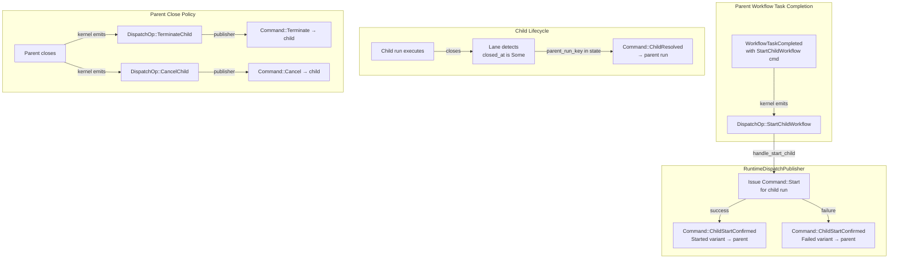

# Design Document: Child Workflow Orchestration

## Overview

This design wires the runtime's `DispatchPublisher` to handle the three child workflow dispatch ops (`StartChildWorkflow`, `TerminateChild`, `CancelChild`) and delivers child resolution results back to the parent workflow. It replaces the current stub logging in `RuntimeDispatchPublisher` with working implementations.

The kernel already handles all child-related commands authoritatively:
- `WorkflowCommand::StartChildWorkflow` emits `DispatchOp::StartChildWorkflow` and inserts a `ChildWorkflowState` entry in the parent's `children` map.
- `Command::ChildStartConfirmed` updates the child entry with `child_run_id` and `started_event_id`, or removes it on failure.
- `Command::ChildResolved` emits the appropriate terminal history event and removes the child from the parent's `children` map.
- `apply_parent_close_policy()` is called on every close path and emits `DispatchOp::TerminateChild` or `DispatchOp::CancelChild` for started children based on their `ParentClosePolicy`.

The runtime's job is purely orchestration: translate dispatch ops into commands on the correct runs, and detect child closure to deliver resolution back to the parent.

The central design challenge is **parent identity propagation**. When a child run closes, the runtime must know which parent run to notify. The child's `WorkflowState` does not currently carry parent identity. This design extends `StartRequest` and `WorkflowState` with optional `parent_run_key` and `parent_workflow_id` fields so that parent identity is durable, survives restarts, and works cross-shard.

A secondary challenge is **close detail availability**. The runtime needs the child's terminal result payload (for `Completed`) or failure message (for `Failed`) to build the `ChildResolution`. The current `WorkflowState` does not retain these. This design extends `WorkflowState` with `close_result: Option<Payloads>` and `close_failure: Option<String>`, populated by the kernel during the close path.

A third challenge is **child run resolution for terminate/cancel**. The `TerminateChild` and `CancelChild` dispatch ops carry `child_run_id` (a `RunId`), not a `RunKey`. The publisher needs repository access to resolve `RunId` → `RunKey` for lane routing.

This feature depends on Feature 1 (Lane OCC Retry) and Feature 2 (Activity Pump), both already implemented.

## Architecture



### Key design decisions

**Durable parent identity via `StartRequest` and `WorkflowState` extension (Option a).** The child's `WorkflowState` gains optional `parent_run_key: Option<RunKey>` and `parent_workflow_id: Option<WorkflowId>` fields. These are set by the runtime when constructing the child's `Command::Start` and persisted in the child's durable state. This approach:
- Survives runtime restarts (Req 6.2) because the parent identity is in durable storage.
- Works cross-shard (Req 6.3) because any runtime node can read the child's state and discover the parent.
- Requires no runtime-local mapping or volatile data structure.

The alternative (runtime-local parent-child mapping) was rejected because it would be lost on restart and would not work when parent and child are on different shards.

**Child resolution detection in the lane.** After a committed transition closes a child run (i.e., `new_state.closed_at.is_some()` and `new_state.parent_run_key.is_some()`), the lane's post-commit hook delivers a `Command::ChildResolved` to the parent. This is done in the lane's `run_activation` after a successful commit, alongside dispatch op publication. The lane already has access to the committed `new_state` and the `DispatchPublisher`.

**Async, fire-and-forget dispatch for parent close policy.** `TerminateChild` and `CancelChild` dispatch ops are processed by the publisher like any other dispatch op. Failures are logged at warn level and do not block the parent's close commit. The sweeper (Feature 11) can reconcile any missed dispatches.

**Publisher handles child start as a two-phase operation.** The publisher:
1. Constructs a `StartRequest` for the child with parent identity fields populated.
2. Submits `Command::Start` to the child's lane.
3. Regardless of success or failure, submits `Command::ChildStartConfirmed` back to the parent's lane.

This ensures the parent always gets a confirmation, even if the child start fails.

**Publisher needs lane access.** The `RuntimeDispatchPublisher` must be able to submit commands to lanes (for child start, terminate, cancel, and resolution delivery). This requires extending the publisher to hold a reference to the lane handles and the runtime's lane routing logic.

## Components and Interfaces

### Extended StartRequest

Two new optional fields are added to `StartRequest`:

```rust
pub struct StartRequest {
    // ... existing fields ...
    /// RunKey of the parent workflow, if this is a child workflow.
    pub parent_run_key: Option<RunKey>,
    /// WorkflowId of the parent workflow, if this is a child workflow.
    pub parent_workflow_id: Option<WorkflowId>,
}
```

### Extended WorkflowState

Four new optional fields are added to `WorkflowState`:

```rust
pub struct WorkflowState {
    // ... existing fields ...
    /// RunKey of the parent workflow, if this is a child workflow.
    pub parent_run_key: Option<RunKey>,
    /// WorkflowId of the parent workflow, if this is a child workflow.
    pub parent_workflow_id: Option<WorkflowId>,
    /// Terminal result payload, populated on CompleteWorkflow.
    pub close_result: Option<Payloads>,
    /// Terminal failure message, populated on FailWorkflow.
    pub close_failure: Option<String>,
}
```

The kernel's `apply_start` populates `parent_run_key` and `parent_workflow_id` from the `StartRequest`. The kernel's `close()` path populates `close_result` (for `CompleteWorkflow`) and `close_failure` (for `FailWorkflow`).

### Extended DispatchOp::StartChildWorkflow

The dispatch op needs to carry the parent's `RunKey` and `WorkflowId` so the publisher can set them on the child's `StartRequest`. It also needs the `initiated_event_id` so the publisher can set it on the `ChildStartConfirmedRequest`:

```rust
DispatchOp::StartChildWorkflow {
    child_workflow_id: WorkflowId,
    namespace_id: NamespaceId,
    workflow_type: WorkflowType,
    task_queue: TaskQueueName,
    input: Payloads,
    // New fields:
    parent_run_key: RunKey,
    parent_workflow_id: WorkflowId,
    initiated_event_id: i64,
}
```

The kernel's `apply_workflow_command` for `WorkflowCommand::StartChildWorkflow` already has access to `builder.state.run_key` and `builder.state.workflow_id`, so it can populate these fields. The `initiated_event_id` is the return value of `builder.emit(...)` which is already computed.

### Extended RuntimeDispatchPublisher

The publisher gains lane access for submitting commands to child and parent runs:

```rust
pub struct RuntimeDispatchPublisher<R> {
    broker: InMemoryBroker,
    activity_broker: InMemoryActivityBroker,
    lanes: Vec<LaneHandle>,
    lane_count: usize,
    repo: Arc<R>,
}

impl<R: RunRepository> RuntimeDispatchPublisher<R> {
    pub fn new(
        broker: InMemoryBroker,
        activity_broker: InMemoryActivityBroker,
        lanes: Vec<LaneHandle>,
        lane_count: usize,
        repo: Arc<R>,
    ) -> Self {
        Self { broker, activity_broker, lanes, lane_count, repo }
    }

    fn pick_lane(&self, run_key: RunKey) -> &LaneHandle {
        pick_lane(&self.lanes, self.lane_count, run_key)
    }

    /// Resolve a child's RunId to a RunKey via storage.
    async fn resolve_child_run_key(
        &self,
        namespace_id: NamespaceId,
        child_workflow_id: &WorkflowId,
        child_run_id: RunId,
    ) -> Result<Option<RunKey>> {
        self.repo.resolve_execution(&ExecutionRef {
            namespace_id,
            workflow_id: child_workflow_id.clone(),
            run_id: Some(child_run_id),
        }).await
    }
}
```

### DispatchPublisher::publish — child workflow handling

The `publish` method gains three new match arms:

```rust
DispatchOp::StartChildWorkflow {
    child_workflow_id,
    namespace_id,
    workflow_type,
    task_queue,
    input,
    parent_run_key,
    parent_workflow_id,
    initiated_event_id,
} => {
    let child_run_key = RunKey::new();
    let child_run_id = RunId::new();
    let now = OffsetDateTime::now_utc();

    let start_request = StartRequest {
        run_key: child_run_key,
        namespace_id: *namespace_id,
        workflow_id: child_workflow_id.clone(),
        run_id: child_run_id,
        workflow_type: workflow_type.clone(),
        task_queue: task_queue.clone(),
        input: input.clone(),
        memo: Memo::default(),
        search_attributes: SearchAttributes::default(),
        workflow_execution_timeout: None,
        workflow_run_timeout: None,
        workflow_task_timeout: Duration::seconds(10),
        retry_policy: None,
        attempt: 1,
        continued_execution_run_id: None,
        first_execution_run_id: None,
        parent_run_key: Some(*parent_run_key),
        parent_workflow_id: Some(parent_workflow_id.clone()),
        request: RequestContext { /* ... */ },
        now,
    };

    let confirm_result = match self.pick_lane(child_run_key)
        .submit(child_run_key, Command::Start(start_request))
        .await
    {
        Ok(CommitResult::Applied { .. }) => {
            ChildStartResult::Started {
                child_run_id,
                workflow_type: workflow_type.clone(),
            }
        }
        Ok(CommitResult::Conflict { reason }) | Err(_) => {
            ChildStartResult::Failed {
                cause: /* error description */,
            }
        }
        Ok(CommitResult::Duplicate) => {
            // Duplicate means the request was already committed,
            // but we don't know the actual child RunId. Treat as
            // failure — the sweeper (Feature 11) will reconcile
            // if the child was actually started by a prior attempt.
            ChildStartResult::Failed {
                cause: "duplicate start request".to_string(),
            }
        }
    };

    // Always confirm back to parent
    let confirm_command = Command::ChildStartConfirmed(
        ChildStartConfirmedRequest {
            child_workflow_id: child_workflow_id.clone(),
            initiated_event_id: *initiated_event_id,
            result: confirm_result,
            now: OffsetDateTime::now_utc(),
        },
    );
    if let Err(error) = self.pick_lane(*parent_run_key)
        .submit(*parent_run_key, confirm_command)
        .await
    {
        tracing::warn!(?error, "failed to deliver ChildStartConfirmed to parent");
    }
}
```

```rust
DispatchOp::TerminateChild {
    child_workflow_id,
    child_run_id,
    reason,
} => {
    let now = OffsetDateTime::now_utc();
    let command = Command::Terminate(TerminateRequest {
        reason: reason.clone(),
        details: None,
        identity: "parent-close-policy".to_string(),
        request: RequestContext::new_internal(),
        now,
    });
    // child_run_id is a RunId, need to resolve to RunKey
    // via repo.resolve_execution or a direct lookup
    match self.resolve_and_submit_to_child(child_run_id, command).await {
        Ok(_) => {}
        Err(error) => {
            let msg = error.to_string();
            if msg.contains("kernel rejected") || msg.contains("not found") {
                tracing::debug!(?error, "TerminateChild no-op (child closed or absent)");
            } else {
                tracing::warn!(?error, "TerminateChild dispatch failed");
            }
        }
    }
}
```

```rust
DispatchOp::CancelChild {
    child_workflow_id,
    child_run_id,
    reason,
} => {
    // Similar pattern to TerminateChild but with Command::Cancel
}
```

### Child Resolution Detection

When the lane commits a transition that closes a run, it checks if the run has a `parent_run_key`. If so, it constructs a `Command::ChildResolved` and submits it to the parent's lane via the publisher. This logic lives in the lane's post-commit path (inside `run_activation`), after the existing dispatch op publication:

```rust
// In run_activation, after successful commit and dispatch op publication:
if let CommitResult::Applied { new_state } = &commit_result {
    if new_state.closed_at.is_some() {
        if let (Some(parent_run_key), Some(parent_workflow_id)) =
            (new_state.parent_run_key, new_state.parent_workflow_id.clone())
        {
            let resolution = match new_state.status {
                ExecutionStatus::Completed => ChildResolution::Completed {
                    result: new_state.close_result.clone()
                        .unwrap_or_default(),
                },
                ExecutionStatus::Failed => ChildResolution::Failed {
                    failure: new_state.close_failure.clone()
                        .unwrap_or_else(|| "child workflow failed".to_string()),
                },
                ExecutionStatus::Cancelled => ChildResolution::Canceled,
                ExecutionStatus::Terminated => ChildResolution::Terminated,
                ExecutionStatus::TimedOut => ChildResolution::TimedOut,
                _ => return, // not a terminal state
            };
            let command = Command::ChildResolved(ChildResolvedRequest {
                child_workflow_id: new_state.workflow_id.clone(),
                resolution,
                now: OffsetDateTime::now_utc(),
            });
            // Submit to parent lane (fire-and-forget)
            if let Err(error) = publisher.submit_to_parent(
                parent_run_key, command
            ).await {
                tracing::warn!(?error, "failed to deliver ChildResolved to parent");
            }
        }
    }
}
```

To support this, the `DispatchPublisher` trait gains an optional method for submitting commands to a specific run (used for child resolution delivery). Alternatively, the lane can hold a reference to the lane handles directly. The cleaner approach is to extend `DispatchPublisher` with a `submit_to_run` method:

```rust
#[async_trait]
pub trait DispatchPublisher: Send + Sync {
    async fn publish(&self, run_key: RunKey, ops: &[DispatchOp]) -> Result<()>;
    /// Submit a command to a specific run. Used for child resolution delivery.
    async fn submit_to_run(&self, run_key: RunKey, command: Command) -> Result<CommitResult>;
}
```

## Data Models

### Modified types

| Type | Crate | Change |
|------|-------|--------|
| `StartRequest` | `tokeira-kernel` | Add `parent_run_key: Option<RunKey>` and `parent_workflow_id: Option<WorkflowId>` |
| `WorkflowState` | `tokeira-kernel` | Add `parent_run_key: Option<RunKey>`, `parent_workflow_id: Option<WorkflowId>`, `close_result: Option<Payloads>`, `close_failure: Option<String>` |
| `DispatchOp::StartChildWorkflow` | `tokeira-kernel` | Add `parent_run_key: RunKey`, `parent_workflow_id: WorkflowId`, `initiated_event_id: i64` |
| `RuntimeDispatchPublisher` | `tokeira-runtime` | Add `lanes: Vec<LaneHandle>`, `lane_count: usize`, `repo: Arc<R>` for lane routing and child run resolution |
| `DispatchPublisher` trait | `tokeira-runtime` | Add `submit_to_run(run_key, command)` method for child resolution delivery |

### New types

None. All new functionality is expressed through extensions to existing types.

### Existing types used (no changes needed)

| Type | Crate | Role |
|------|-------|------|
| `ChildStartConfirmedRequest` | `tokeira-kernel` | Command payload for confirming child start to parent |
| `ChildStartResult` | `tokeira-kernel` | `Started { child_run_id, workflow_type }` or `Failed { cause }` |
| `ChildResolvedRequest` | `tokeira-kernel` | Command payload for delivering child resolution to parent |
| `ChildResolution` | `tokeira-kernel` | `Completed`, `Failed`, `Canceled`, `Terminated`, `TimedOut` |
| `ChildWorkflowState` | `tokeira-kernel` | Parent's tracking state for an open child |
| `TerminateRequest` | `tokeira-kernel` | Command payload for forcible termination |
| `CancelRequest` | `tokeira-kernel` | Command payload for cooperative cancellation |
| `RunKey` | `tokeira-types` | Durable identity of a workflow run |
| `RunId` | `tokeira-types` | Unique run identifier |
| `ExecutionRef` | `tokeira-types` | Used to resolve child runs for terminate/cancel |
| `CommitResult` | `tokeira-storage` | `Applied`, `Conflict`, `Duplicate` |
| `Reject` | `tokeira-kernel` | `RunClosed`, `MissingRun`, `UnknownChild`, etc. |

### Data flow: Start Child Workflow

```
Parent WFT Completed with StartChildWorkflow command
  → Kernel emits DispatchOp::StartChildWorkflow {
      child_workflow_id, namespace_id, workflow_type,
      task_queue, input, parent_run_key, parent_workflow_id,
      initiated_event_id
    }
  → Lane commits parent transition
  → Publisher.publish() handles StartChildWorkflow:
      1. child_run_key = RunKey::new()
      2. child_run_id = RunId::new()
      3. Build StartRequest with parent_run_key, parent_workflow_id
      4. Submit Command::Start to child lane
      5. Build ChildStartConfirmedRequest from result
      6. Submit Command::ChildStartConfirmed to parent lane
```

### Data flow: Child Resolution

```
Child run closes (any terminal status)
  → Lane commits child transition
  → Lane detects: new_state.closed_at.is_some()
                   && new_state.parent_run_key.is_some()
  → Lane builds ChildResolvedRequest from child's terminal status
  → Publisher.submit_to_run(parent_run_key, Command::ChildResolved)
  → Parent kernel processes ChildResolved:
      emits terminal history event, removes child from children map
```

### Data flow: Parent Close Policy

```
Parent run closes (complete, fail, cancel, terminate, timeout, reset, CAN)
  → Kernel calls apply_parent_close_policy()
  → For each started child with Terminate policy:
      emit DispatchOp::TerminateChild { child_workflow_id, child_run_id, reason }
  → For each started child with RequestCancel policy:
      emit DispatchOp::CancelChild { child_workflow_id, child_run_id, reason }
  → Lane commits parent transition
  → Publisher.publish() handles TerminateChild/CancelChild:
      resolve child run → submit Command::Terminate or Command::Cancel
      on failure: log and continue (non-blocking)
```

## Correctness Properties

*A property is a characteristic or behavior that should hold true across all valid executions of a system — essentially, a formal statement about what the system should do. Properties serve as the bridge between human-readable specifications and machine-verifiable correctness guarantees.*

### Property 1: Child StartRequest construction

*For any* `DispatchOp::StartChildWorkflow` with arbitrary `child_workflow_id`, `namespace_id`, `workflow_type`, `task_queue`, `input`, `parent_run_key`, `parent_workflow_id`, and `initiated_event_id`, the `Command::Start` issued by the publisher shall have:
- `workflow_id` equal to `child_workflow_id`
- `namespace_id`, `workflow_type`, `task_queue`, `input` matching the dispatch op
- `parent_run_key` equal to `Some(parent_run_key)` from the dispatch op
- `parent_workflow_id` equal to `Some(parent_workflow_id)` from the dispatch op
- `run_key` and `run_id` that are freshly generated (non-equal to the parent's)
- `workflow_task_timeout` equal to 10 seconds
- `memo`, `search_attributes` set to defaults; `retry_policy`, `workflow_execution_timeout`, `workflow_run_timeout` set to `None`
- `attempt` equal to 1; `continued_execution_run_id` and `first_execution_run_id` set to `None`

**Validates: Requirements 1.1, 1.2, 1.3, 6.1, 8.1, 8.2, 8.3**

### Property 2: Successful child start produces Started confirmation

*For any* `DispatchOp::StartChildWorkflow` where the child `Command::Start` succeeds (returns `CommitResult::Applied`), the publisher shall submit a `Command::ChildStartConfirmed` to the parent run with `ChildStartResult::Started { child_run_id, workflow_type }` where `child_run_id` matches the child's assigned `RunId` and `workflow_type` matches the dispatch op, and `initiated_event_id` matches the dispatch op's `initiated_event_id`.

**Validates: Requirements 1.4, 1.6**

### Property 3: Failed child start produces Failed confirmation

*For any* `DispatchOp::StartChildWorkflow` where the child `Command::Start` fails (returns an error or `CommitResult::Conflict` after retry exhaustion), the publisher shall submit a `Command::ChildStartConfirmed` to the parent run with `ChildStartResult::Failed { cause }` containing a non-empty failure description, and `initiated_event_id` matching the dispatch op's `initiated_event_id`.

**Validates: Requirements 1.5, 1.6, 7.1**

### Property 4: TerminateChild and CancelChild dispatch correct commands

*For any* `DispatchOp::TerminateChild` with arbitrary `child_run_id` and `reason`, the publisher shall submit a `Command::Terminate` to the child run with the `reason` from the dispatch op. *For any* `DispatchOp::CancelChild` with arbitrary `child_run_id` and `reason`, the publisher shall submit a `Command::Cancel` to the child run with the `reason` from the dispatch op.

**Validates: Requirements 2.1, 3.1, 5.1, 5.2**

### Property 5: Child resolution delivers correct mapping and routing

*For any* child workflow run that reaches a terminal state with `parent_run_key = Some(pk)` and `parent_workflow_id = Some(pwid)`, the runtime shall submit a `Command::ChildResolved` to `pk` with `child_workflow_id` equal to the child's `workflow_id` and `ChildResolution` variant matching the child's terminal `ExecutionStatus`:
- `Completed` → `ChildResolution::Completed`
- `Failed` → `ChildResolution::Failed`
- `Cancelled` → `ChildResolution::Canceled`
- `Terminated` → `ChildResolution::Terminated`
- `TimedOut` → `ChildResolution::TimedOut`

**Validates: Requirements 4.1, 4.2, 4.5**

### Property 6: Dispatch continues after individual failures

*For any* batch of dispatch ops containing N `TerminateChild` and/or `CancelChild` ops where K of them fail (child closed, child absent, transient error), the publisher shall still attempt dispatch for all remaining N - K ops. The parent's `CommitResult::Applied` shall be returned to the caller regardless of dispatch failures.

**Validates: Requirements 5.3, 5.4, 7.4**

### Property 7: Parent identity round-trip durability

*For any* `RunKey` and `WorkflowId` used as parent identity in a child's `StartRequest`, after the child's `Command::Start` is committed and the child's state is reloaded from storage, the loaded `WorkflowState` shall have `parent_run_key` and `parent_workflow_id` equal to the original values.

**Validates: Requirements 6.2**

## Error Handling

### Child start failure

If the child `Command::Start` fails for any reason (storage error, lane channel closed, OCC exhaustion, `Reject::RunAlreadyExists`), the publisher constructs a `ChildStartResult::Failed { cause }` with a description of the failure and delivers `Command::ChildStartConfirmed` to the parent. This ensures the parent is never left waiting indefinitely for a child that will never start.

### ChildStartConfirmed delivery failure

If the `Command::ChildStartConfirmed` delivery to the parent fails (parent lane closed, OCC exhaustion), the publisher logs at `warn` level. The parent's `ChildWorkflowState` remains in the initiated-but-unconfirmed state. The sweeper (Feature 11) or a future reconciliation mechanism will resolve this by re-checking the child's existence and delivering the confirmation.

### ChildResolved delivery failure

If the `Command::ChildResolved` delivery to the parent fails (parent lane closed, parent already closed, OCC exhaustion), the publisher logs at `warn` level. The parent's `ChildWorkflowState` remains in the started-but-unresolved state. The sweeper (Feature 11) will reconcile by scanning for closed children whose parents still have open `ChildWorkflowState` entries.

### TerminateChild / CancelChild on closed or absent child

When the publisher submits `Command::Terminate` or `Command::Cancel` to a child that is already closed (`Reject::RunClosed`) or absent (`Reject::MissingRun`), the rejection is treated as a harmless no-op and logged at `debug` level. This is expected during normal operation — the child may have closed between the parent's close and the dispatch execution.

### TerminateChild / CancelChild transient failure

If a `TerminateChild` or `CancelChild` dispatch encounters a transient error (storage unavailable, lane channel closed), the publisher logs at `warn` level and continues processing remaining dispatch ops in the batch. The sweeper can reconcile any missed policy enforcement.

### Parent close policy is non-blocking

Parent close policy dispatch ops are processed after the parent's transition is committed. Failures in policy enforcement do not affect the parent's `CommitResult`. The parent's close is authoritative regardless of whether child termination/cancellation succeeds.

## Testing Strategy

### Property-based testing

All 7 correctness properties will be implemented as property-based tests using the [`proptest`](https://docs.rs/proptest) crate, consistent with the existing test infrastructure in `tokeira-runtime`.

Each property test will:
- Run a minimum of 100 iterations (proptest default is 256).
- Use mock implementations of `Kernel`, `RunRepository`, `DispatchPublisher`, and `LaneHandle` that are configurable per test.
- Be tagged with a comment referencing the design property.
- Tag format: `// Feature: runtime-child-workflows, Property N: <title>`

Each correctness property MUST be implemented by a SINGLE property-based test.

**Property 1 (Child StartRequest construction):** A generator produces random `DispatchOp::StartChildWorkflow` values with random `namespace_id`, `workflow_type`, `task_queue`, `input`, `parent_run_key`, `parent_workflow_id`, and `initiated_event_id`. A mock lane captures the `Command::Start` submitted to it. The test verifies all field mappings, defaults, and parent identity propagation.

**Property 2 (Successful child start confirmation):** A generator produces random dispatch ops. The mock child lane returns `CommitResult::Applied`. A mock parent lane captures the `Command::ChildStartConfirmed`. The test verifies the `Started` variant with correct `child_run_id`, `workflow_type`, and `initiated_event_id`.

**Property 3 (Failed child start confirmation):** A generator produces random dispatch ops. The mock child lane returns an error. A mock parent lane captures the `Command::ChildStartConfirmed`. The test verifies the `Failed` variant with a non-empty cause and correct `initiated_event_id`.

**Property 4 (TerminateChild and CancelChild dispatch):** A generator produces random `TerminateChild` and `CancelChild` dispatch ops with random `child_run_id` and `reason`. Mock lanes capture submitted commands. The test verifies the correct `Command::Terminate` or `Command::Cancel` is submitted with the matching `reason`.

**Property 5 (Child resolution delivery):** A generator produces random terminal `ExecutionStatus` values and random parent identity (`parent_run_key`, `parent_workflow_id`). A mock parent lane captures the `Command::ChildResolved`. The test verifies the correct `ChildResolution` variant and `child_workflow_id`, and that the command is routed to the correct `parent_run_key`.

**Property 6 (Dispatch continues after failure):** A generator produces random batches of `TerminateChild`/`CancelChild` ops and random failure patterns (which ops fail). Mock lanes are configured to fail on specific ops. The test verifies that all non-failing ops are still dispatched and that the parent's commit result is unaffected.

**Property 7 (Parent identity round-trip):** A generator produces random `RunKey` and `WorkflowId` values. The test creates a child workflow with these as parent identity, commits it to an `InMemoryStore`, reloads the state, and verifies `parent_run_key` and `parent_workflow_id` are preserved.

### Unit tests

Unit tests complement property tests for specific examples and edge cases:

- **TerminateChild on closed child:** Verify that a `Reject::RunClosed` from the child lane is treated as a no-op (no error propagated).
- **CancelChild on absent child:** Verify that a `Reject::MissingRun` from the child lane is treated as a no-op.
- **ChildResolved when parent is closed:** Verify that a `Reject::RunClosed` from the parent lane is treated as a no-op.
- **ChildResolved when parent is absent:** Verify that a `Reject::MissingRun` from the parent lane is treated as a no-op.
- **ChildStartConfirmed delivery failure:** Verify that when the parent lane fails to accept the confirmation, the error is logged but does not crash the publisher.
- **Duplicate child start:** Verify that `CommitResult::Duplicate` from the child lane is treated as a successful start (idempotent retry).
- **No resolution for non-child runs:** Verify that when a run closes with `parent_run_key = None`, no `ChildResolved` command is submitted.

### Integration tests

Integration tests exercise the full `TokeiraRuntime` with `InMemoryStore`:

- **Happy path:** Start a parent workflow, complete a workflow task with a `StartChildWorkflow` command, verify the child is created and the parent receives `ChildStartConfirmed::Started`. Then complete the child, and verify the parent receives `ChildResolved::Completed`.
- **Parent close policy — Terminate:** Start a parent with a child that has `ParentClosePolicy::Terminate`. Close the parent. Verify the child receives a `Command::Terminate`.
- **Parent close policy — RequestCancel:** Same as above but with `ParentClosePolicy::RequestCancel`. Verify the child receives a `Command::Cancel`.
- **Parent close policy — Abandon:** Same as above but with `ParentClosePolicy::Abandon`. Verify the child is left running.
- **Child start failure:** Configure the runtime so the child start fails (e.g., workflow ID already exists). Verify the parent receives `ChildStartConfirmed::Failed`.

### Test configuration

```toml
[dev-dependencies]
proptest = "1"
```

Each property test annotation:
```rust
// Feature: runtime-child-workflows, Property 1: Child StartRequest construction
proptest! {
    #[test]
    fn prop_child_start_request_construction(
        // ... generators for dispatch op fields
    ) {
        // ...
    }
}
```
