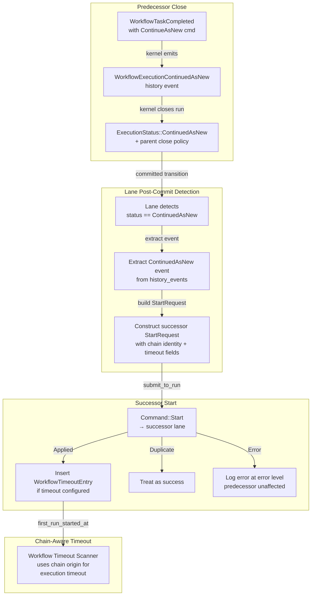

# Design Document: Continue-As-New

## Overview

This design wires the runtime's lane post-commit path to detect when a run closes with `ExecutionStatus::ContinuedAsNew`, extract the successor parameters from the `WorkflowExecutionContinuedAsNew` history event, and issue a `Command::Start` for the successor run. It also completes the chain-aware execution timeout story deferred by Feature 5 (Workflow Timeouts) by propagating `first_run_started_at` through the `StartRequest`, `WorkflowState`, and `WorkflowTimeoutTrackingState`.

The kernel already handles the authoritative close: `WorkflowCommand::ContinueAsNew` emits a `WorkflowExecutionContinuedAsNew` history event carrying the successor's `new_run_id`, `workflow_type`, `task_queue`, `input`, `memo`, `search_attributes`, and timeout configuration, then closes the run with `ExecutionStatus::ContinuedAsNew` and applies parent close policy. The runtime's job is purely orchestration: detect this close, construct the successor `StartRequest`, and submit it.

The feature has three parts:

1. **Successor detection and start.** The lane's post-commit path (in `run_activation`) already detects child workflow closure and delivers `ChildResolved` to the parent. A new branch detects `ExecutionStatus::ContinuedAsNew`, extracts the `WorkflowExecutionContinuedAsNew` event from the committed transition's `history_events`, constructs a `StartRequest`, and submits it via `publisher.submit_to_run`. This is fire-and-forget — successor start failure does not affect the predecessor's committed close.

2. **Chain identity propagation.** The successor's `StartRequest` carries `continued_execution_run_id` (the predecessor's `run_id`) and `first_execution_run_id` (the very first run in the chain). If the predecessor already has a `first_execution_run_id`, it is forwarded; otherwise the predecessor's `run_id` becomes the chain origin.

3. **Chain-aware execution timeout.** A new `first_run_started_at: Option<OffsetDateTime>` field on `StartRequest` and `WorkflowState` carries the `started_at` timestamp of the first run in the chain. The `WorkflowTimeoutTrackingState` entry and `evaluate_workflow_timeout` use `first_run_started_at` (when present) for execution timeout measurement, while run timeout continues to use the current run's `started_at`.

This feature depends on Feature 1 (Lane OCC Retry), Feature 5 (Workflow Timeouts), and Feature 6 (Child Workflow Orchestration).

## Architecture



### Key design decisions

**Detection in the lane post-commit path.** The lane's `run_activation` already has a post-commit hook that checks `new_state.closed_at.is_some()` for child resolution delivery and workflow timeout tracking cleanup. Continue-as-new detection is added as a new branch in this same path, checking `new_state.status == ExecutionStatus::ContinuedAsNew`. This keeps all post-commit orchestration in one place.

**Event extraction from committed transition's history_events.** The `WorkflowExecutionContinuedAsNew` event carries all successor parameters (`new_run_id`, `workflow_type`, `task_queue`, `input`, `memo`, `search_attributes`, timeout config). The lane has access to the committed transition's `history_events` (via the `Transition` struct returned from `handle_message`). The detection code scans `history_events` for the `WorkflowExecutionContinuedAsNew` variant and extracts the fields. If the status is `ContinuedAsNew` but no matching event is found, this is an anomaly logged at error level.

**Successor start via `publisher.submit_to_run`.** The `DispatchPublisher::submit_to_run` method (added in Feature 6) submits a command to a specific run's lane. The successor's `RunKey` is freshly generated, so it routes to a lane determined by `hash(successor_run_key) mod lane_count`. This is the same mechanism used for child resolution delivery.

**Fire-and-forget with bounded retries.** The successor start is submitted through the lane, which already has OCC retry logic (`max_occ_retries`). The lane's `handle_message` retries OCC conflicts internally and surfaces exhaustion as `Err`. It does not return `CommitResult::Conflict` to callers — only `Applied`, `Duplicate`, or `Err`. If the start fails after retry exhaustion, the error is logged at error level. The predecessor's committed close is not affected. The sweeper (Feature 11) can reconcile orphaned continue-as-new chains.

**No duplicate-as-success path.** The current storage contract returns `CommitResult::Duplicate` only for request-dedupe collisions, not for "successor already exists." A retried continue-as-new start uses a fresh `RunKey` and would not normally hit `Duplicate`. All non-`Applied` outcomes (`Err` from retry exhaustion, `Duplicate` from unexpected dedupe collision) are treated as failures and logged at error level.

**`first_run_started_at` as a kernel-level field.** Adding `first_run_started_at` to `StartRequest` and `WorkflowState` makes the chain origin timestamp durable and available to any component that reads the workflow state. The kernel's `apply_start` populates `WorkflowState.first_run_started_at` from `StartRequest.first_run_started_at`. For the first run in a chain (no continue-as-new predecessor), this field is `None`.

**Execution timeout uses `first_run_started_at`, run timeout uses `started_at`.** The `WorkflowTimeoutEntry` gains a new `first_run_started_at: Option<OffsetDateTime>` field. The `evaluate_workflow_timeout` function uses `first_run_started_at.unwrap_or(started_at)` for execution timeout comparison, and always uses `started_at` for run timeout. This is backward-compatible: non-chain runs have `first_run_started_at = None` and fall back to `started_at`.

**Parent identity does not transfer.** The successor's `parent_run_key` and `parent_workflow_id` are set to `None`. The predecessor's parent relationship (if it was a child workflow) does not carry over to the successor. This matches Temporal semantics where continue-as-new creates a new independent run.


## Components and Interfaces

### Modified StartRequest (tokeira-kernel)

One new optional field:

```rust
pub struct StartRequest {
    // ... existing fields ...
    /// Wall-clock `started_at` of the very first run in the
    /// execution chain. `None` for the first run; set by the
    /// runtime when constructing a continue-as-new successor.
    pub first_run_started_at: Option<OffsetDateTime>,
}
```

### Modified WorkflowState (tokeira-kernel)

One new optional field:

```rust
pub struct WorkflowState {
    // ... existing fields ...
    /// Wall-clock `started_at` of the very first run in the
    /// execution chain. `None` for the first run; populated
    /// from `StartRequest` during `apply_start`.
    pub first_run_started_at: Option<OffsetDateTime>,
}
```

### Modified apply_start (tokeira-kernel)

The kernel's `apply_start` populates the new field from the `StartRequest`:

```rust
let initial = WorkflowState {
    // ... existing fields ...
    first_run_started_at: req.first_run_started_at,
};
```

No other kernel changes are needed. The kernel does not interpret `first_run_started_at` — it is a pass-through field for the runtime's timeout scanner.

### Modified WorkflowTimeoutEntry (tokeira-runtime)

One new optional field:

```rust
pub struct WorkflowTimeoutEntry {
    pub run_key: RunKey,
    pub workflow_execution_timeout: Option<Duration>,
    pub workflow_run_timeout: Option<Duration>,
    pub started_at: OffsetDateTime,
    /// Chain origin timestamp for execution timeout.
    /// When present, execution timeout is measured from this
    /// timestamp instead of `started_at`.
    pub first_run_started_at: Option<OffsetDateTime>,
    pub has_retry_policy: bool,
}
```

### Modified evaluate_workflow_timeout (tokeira-runtime)

The execution timeout comparison changes to use the chain origin timestamp:

```rust
pub fn evaluate_workflow_timeout(
    entry: &WorkflowTimeoutEntry,
    now: OffsetDateTime,
) -> Option<WorkflowTimeoutViolation> {
    // Execution timeout: measured from chain origin
    if let Some(timeout) = entry.workflow_execution_timeout {
        let origin = entry.first_run_started_at.unwrap_or(entry.started_at);
        if now - origin > timeout || timeout.is_zero() && now >= origin {
            return Some(WorkflowTimeoutViolation::ExecutionTimeout);
        }
    }

    // Run timeout: always measured from current run's started_at
    if let Some(timeout) = entry.workflow_run_timeout {
        if now - entry.started_at > timeout
            || timeout.is_zero() && now >= entry.started_at
        {
            return Some(WorkflowTimeoutViolation::RunTimeout);
        }
    }

    None
}
```

### Modified start_workflow (tokeira-runtime)

The `WorkflowTimeoutEntry` insertion gains the new field:

```rust
self.workflow_timeout_tracking.insert(WorkflowTimeoutEntry {
    run_key: request.run_key,
    workflow_execution_timeout: request.workflow_execution_timeout,
    workflow_run_timeout: request.workflow_run_timeout,
    started_at: request.now,
    first_run_started_at: request.first_run_started_at,
    has_retry_policy: request.retry_policy.is_some(),
});
```

### Lane post-commit: continue-as-new detection

In `run_activation`, after the existing child resolution and timeout tracking cleanup, a new branch handles continue-as-new:

```rust
// In run_activation, after successful commit:
if let CommitResult::Applied { new_state } = &commit_result {
    if new_state.closed_at.is_some() {
        workflow_timeout_tracking.remove(message.run_key);

        // Existing: child resolution delivery
        if let Some(parent_run_key) = new_state.parent_run_key {
            // ... existing child resolution code ...
        }

        // New: continue-as-new successor creation
        if new_state.status == ExecutionStatus::ContinuedAsNew {
            let maybe_event = transition.history_events.iter().find_map(|e| {
                match &e.kind {
                    HistoryEventKind::WorkflowExecutionContinuedAsNew {
                        new_run_id,
                        workflow_type,
                        task_queue,
                        input,
                        memo,
                        search_attributes,
                        workflow_execution_timeout,
                        workflow_run_timeout,
                        workflow_task_timeout,
                    } => Some((
                        new_run_id.clone(),
                        workflow_type.clone(),
                        task_queue.clone(),
                        input.clone(),
                        memo.clone(),
                        search_attributes.clone(),
                        *workflow_execution_timeout,
                        *workflow_run_timeout,
                        *workflow_task_timeout,
                    )),
                    _ => None,
                }
            });

            match maybe_event {
                Some((
                    new_run_id,
                    workflow_type,
                    task_queue,
                    input,
                    memo,
                    search_attributes,
                    workflow_execution_timeout,
                    workflow_run_timeout,
                    workflow_task_timeout,
                )) => {
                    let successor_run_key = RunKey::new();
                    let first_execution_run_id = new_state
                        .first_execution_run_id
                        .unwrap_or(new_state.run_id);
                    let first_run_started_at = Some(
                        new_state
                            .first_run_started_at
                            .unwrap_or(new_state.started_at),
                    );

                    let start_request = StartRequest {
                        run_key: successor_run_key,
                        namespace_id: new_state.namespace_id,
                        workflow_id: new_state.workflow_id.clone(),
                        run_id: new_run_id,
                        workflow_type,
                        task_queue,
                        input,
                        memo,
                        search_attributes,
                        workflow_execution_timeout,
                        workflow_run_timeout,
                        workflow_task_timeout,
                        retry_policy: new_state.retry_policy.clone(),
                        attempt: 1,
                        continued_execution_run_id: Some(new_state.run_id),
                        first_execution_run_id: Some(first_execution_run_id),
                        parent_run_key: None,
                        parent_workflow_id: None,
                        first_run_started_at,
                        request: RequestContext {
                            request_id: RequestId(format!(
                                "continue-as-new-{:?}",
                                message.run_key
                            )),
                            caller_identity: Some(
                                "runtime-continue-as-new-orchestrator"
                                    .to_string(),
                            ),
                            received_at: OffsetDateTime::now_utc(),
                        },
                        now: OffsetDateTime::now_utc(),
                    };

                    let command = Command::Start(start_request.clone());
                    match publisher
                        .submit_to_run(successor_run_key, command)
                        .await
                    {
                        Ok(CommitResult::Applied { new_state: successor_state }) => {
                            // Insert timeout tracking using committed state
                            if start_request.workflow_execution_timeout.is_some()
                                || start_request.workflow_run_timeout.is_some()
                            {
                                workflow_timeout_tracking.insert(
                                    WorkflowTimeoutEntry {
                                        run_key: successor_run_key,
                                        workflow_execution_timeout: start_request
                                            .workflow_execution_timeout,
                                        workflow_run_timeout: start_request
                                            .workflow_run_timeout,
                                        started_at: successor_state.started_at,
                                        first_run_started_at: successor_state
                                            .first_run_started_at,
                                        has_retry_policy: successor_state
                                            .retry_policy
                                            .is_some(),
                                    },
                                );
                            }
                        }
                        Ok(CommitResult::Duplicate) => {
                            // Unexpected: request-dedupe collision with fresh RunKey.
                            // Treat as failure — sweeper will reconcile.
                            tracing::error!(
                                predecessor_run_key = ?message.run_key,
                                successor_run_key = ?successor_run_key,
                                "continue-as-new successor start returned Duplicate (unexpected)"
                            );
                        }
                        Ok(CommitResult::Conflict { reason }) => {
                            // Note: the lane retries OCC conflicts internally.
                            // This branch should not be reached in practice.
                            tracing::error!(
                                predecessor_run_key = ?message.run_key,
                                workflow_id = ?new_state.workflow_id,
                                predecessor_run_id = ?new_state.run_id,
                                successor_run_key = ?successor_run_key,
                                reason,
                                "continue-as-new successor start conflict"
                            );
                        }
                        Err(error) => {
                            tracing::error!(
                                ?error,
                                predecessor_run_key = ?message.run_key,
                                workflow_id = ?new_state.workflow_id,
                                predecessor_run_id = ?new_state.run_id,
                                successor_run_key = ?successor_run_key,
                                "continue-as-new successor start failed"
                            );
                        }
                    }
                }
                None => {
                    tracing::error!(
                        run_key = ?message.run_key,
                        workflow_id = ?new_state.workflow_id,
                        "ContinuedAsNew status but no WorkflowExecutionContinuedAsNew event found"
                    );
                }
            }
        }
    }
}
```

Note: the lane needs access to the committed transition's `history_events` in the post-commit path. Currently `handle_message` returns `(CommitResult, SmallVec<[DispatchOp; 4]>)`. This must be extended to also return the `history_events` from the committed transition so the post-commit code can extract the `ContinuedAsNew` event. The simplest approach is to return the full `SmallVec<[HistoryEvent; 8]>` alongside the dispatch ops.

### Modified handle_message return type

```rust
async fn handle_message<K, R>(
    kernel: &K,
    repo: &R,
    run_key: RunKey,
    command: Command,
    max_retries: u32,
) -> Result<(CommitResult, SmallVec<[DispatchOp; 4]>, SmallVec<[HistoryEvent; 8]>)>
```

The history events are captured from the transition before commit and returned alongside the dispatch ops. The lane's `run_activation` uses them for continue-as-new event extraction.


## Data Models

### Modified types

| Type | Crate | Change |
|------|-------|--------|
| `StartRequest` | `tokeira-kernel` | Add `first_run_started_at: Option<OffsetDateTime>` |
| `WorkflowState` | `tokeira-kernel` | Add `first_run_started_at: Option<OffsetDateTime>` |
| `apply_start` | `tokeira-kernel` | Populate `first_run_started_at` from `StartRequest` |
| `WorkflowTimeoutEntry` | `tokeira-runtime` | Add `first_run_started_at: Option<OffsetDateTime>` |
| `evaluate_workflow_timeout` | `tokeira-runtime` | Use `first_run_started_at.unwrap_or(started_at)` for execution timeout |
| `handle_message` return type | `tokeira-runtime` | Return `SmallVec<[HistoryEvent; 8]>` alongside dispatch ops |
| `run_activation` | `tokeira-runtime` | Add continue-as-new detection branch in post-commit path |
| `start_workflow` | `tokeira-runtime` | Pass `first_run_started_at` to `WorkflowTimeoutEntry` |

### New types

None. All new functionality is expressed through extensions to existing types.

### Existing types used (no changes needed)

| Type | Crate | Role |
|------|-------|------|
| `WorkflowExecutionContinuedAsNew` | `tokeira-kernel` | History event variant carrying successor parameters |
| `ExecutionStatus::ContinuedAsNew` | `tokeira-types` | Terminal status indicating continue-as-new close |
| `Command::Start` | `tokeira-kernel` | Command to create the successor run |
| `CommitResult` | `tokeira-storage` | `Applied`, `Conflict`, `Duplicate` |
| `DispatchPublisher::submit_to_run` | `tokeira-runtime` | Submit command to a specific run's lane |
| `WorkflowTimeoutTrackingState` | `tokeira-runtime` | In-memory timeout tracking |
| `RunKey` | `tokeira-types` | Durable identity of a workflow run |
| `RunId` | `tokeira-types` | Unique run identifier |
| `RequestContext` | `tokeira-types` | Request metadata for dedupe and tracing |

### Data flow: Continue-As-New successor creation

```
Predecessor WFT Completed with ContinueAsNew command
  → Kernel emits WorkflowExecutionContinuedAsNew history event
  → Kernel closes run with ExecutionStatus::ContinuedAsNew
  → Kernel applies parent close policy
  → Lane commits predecessor transition
  → Lane post-commit detects: status == ContinuedAsNew
  → Lane extracts ContinuedAsNew event from history_events
  → Lane constructs successor StartRequest:
      - run_key: fresh RunKey
      - run_id: new_run_id from event
      - workflow_id: predecessor's workflow_id
      - namespace_id: predecessor's namespace_id
      - workflow_type, task_queue, input, memo, search_attributes: from event
      - timeout config: from event
      - retry_policy: predecessor's retry_policy
      - attempt: 1
      - continued_execution_run_id: predecessor's run_id
      - first_execution_run_id: predecessor's first_execution_run_id
                                 or predecessor's run_id
      - first_run_started_at: predecessor's first_run_started_at
                               or predecessor's started_at
      - parent_run_key: None
      - parent_workflow_id: None
  → publisher.submit_to_run(successor_run_key, Command::Start)
  → On Applied: insert WorkflowTimeoutEntry if timeout configured
  → On Duplicate: treat as success
  → On Error: log at error level, predecessor unaffected
```

### Data flow: Chain-aware execution timeout

```
Successor run starts with first_run_started_at = Some(T0)
  → start_workflow inserts WorkflowTimeoutEntry with first_run_started_at
  → Workflow timeout scanner snapshots entries
  → evaluate_workflow_timeout:
      execution_timeout: now - first_run_started_at > workflow_execution_timeout
      run_timeout: now - started_at > workflow_run_timeout
  → If violated: submit WorkflowExecutionTimedOut command
```


## Correctness Properties

*A property is a characteristic or behavior that should hold true across all valid executions of a system — essentially, a formal statement about what the system should do. Properties serve as the bridge between human-readable specifications and machine-verifiable correctness guarantees.*

### Property 1: Successor StartRequest construction

*For any* predecessor `WorkflowState` closed with `ContinuedAsNew` and any `WorkflowExecutionContinuedAsNew` history event, the successor `StartRequest` shall have:
- `run_id` equal to the event's `new_run_id`
- `workflow_type`, `task_queue`, `input`, `memo`, `search_attributes`, `workflow_execution_timeout`, `workflow_run_timeout`, `workflow_task_timeout` equal to the corresponding event fields
- `run_key` that is freshly generated (not equal to the predecessor's `run_key`)
- `workflow_id` equal to the predecessor's `workflow_id`
- `namespace_id` equal to the predecessor's `namespace_id`
- `continued_execution_run_id` equal to `Some(predecessor.run_id)`
- `first_execution_run_id` equal to `Some(predecessor.first_execution_run_id.unwrap_or(predecessor.run_id))`
- `first_run_started_at` equal to `Some(predecessor.first_run_started_at.unwrap_or(predecessor.started_at))`
- `retry_policy` equal to the predecessor's `retry_policy`
- `attempt` equal to `1`
- `parent_run_key` equal to `None`
- `parent_workflow_id` equal to `None`

**Validates: Requirements 2.1, 2.2, 2.3, 2.4, 2.5, 2.6, 2.7, 2.8, 2.9, 3.1, 3.2, 4.3, 4.4**

### Property 2: Chain-aware execution timeout evaluation

*For any* `WorkflowTimeoutEntry` with arbitrary `started_at`, `first_run_started_at`, `workflow_execution_timeout`, `workflow_run_timeout`, and any `now` timestamp:
- Execution timeout fires when `now - first_run_started_at.unwrap_or(started_at) > workflow_execution_timeout`
- Run timeout fires when `now - started_at > workflow_run_timeout`
- Execution timeout takes precedence over run timeout when both fire
- When `first_run_started_at` is `None`, execution timeout uses `started_at` (backward-compatible)
- When `first_run_started_at` is `Some(t)`, execution timeout uses `t` regardless of `started_at`

**Validates: Requirements 4.5, 4.6**

### Property 3: Detection triggers only for ContinuedAsNew

*For any* committed transition that closes a run, successor creation shall be attempted if and only if the terminal status is `ExecutionStatus::ContinuedAsNew`. For all other terminal statuses (`Completed`, `Failed`, `Cancelled`, `Terminated`, `TimedOut`), no `Command::Start` shall be submitted for a successor.

**Validates: Requirements 1.1, 1.2**

### Property 4: apply_start populates first_run_started_at

*For any* `StartRequest` with arbitrary `first_run_started_at` (including `None`), after `apply_start` produces a `WorkflowState`, the state's `first_run_started_at` shall equal the request's `first_run_started_at`.

**Validates: Requirements 4.2**

### Property 5: Predecessor unaffected by successor outcome

*For any* predecessor run that closes with `ContinuedAsNew`, and any outcome of the successor `Command::Start` (success, conflict, duplicate, error), the predecessor's committed `CommitResult::Applied` shall be returned to the caller before the successor start is attempted. No commands shall be submitted to the predecessor's `RunKey` as a result of successor start failure.

**Validates: Requirements 5.3, 6.2**

### Property 6: Successor timeout tracking entry

*For any* successor `StartRequest` with a non-None `workflow_execution_timeout` or `workflow_run_timeout`, when the successor `Command::Start` returns `CommitResult::Applied`, the `WorkflowTimeoutTrackingState` shall contain an entry for the successor's `RunKey` with:
- `workflow_execution_timeout` and `workflow_run_timeout` matching the `StartRequest`
- `started_at` equal to the `StartRequest`'s `now`
- `first_run_started_at` equal to the `StartRequest`'s `first_run_started_at`
- `has_retry_policy` equal to `start_request.retry_policy.is_some()`

When the `StartRequest` has neither `workflow_execution_timeout` nor `workflow_run_timeout`, no tracking entry shall be inserted.

**Validates: Requirements 7.1, 7.2**

## Error Handling

### Successor start failure

If the successor `Command::Start` fails for any reason (storage error, lane channel closed, OCC exhaustion after bounded retries), the error is logged at `error` level with the predecessor's `run_key`, `workflow_id`, `run_id`, the successor's `new_run_id`, and the error details. The predecessor's committed close is not affected. The sweeper (Feature 11) can reconcile orphaned continue-as-new chains by scanning for runs closed with `ContinuedAsNew` whose successor does not exist.

### Duplicate successor start

If `submit_to_run` returns `CommitResult::Duplicate`, this is unexpected — the current storage contract returns `Duplicate` only for request-dedupe collisions, and a retried continue-as-new start uses a fresh `RunKey`. This is logged at `error` level. The sweeper (Feature 11) can reconcile.

### Missing ContinuedAsNew event

If the committed transition has `ExecutionStatus::ContinuedAsNew` but no `WorkflowExecutionContinuedAsNew` event is found in `history_events`, this is an internal consistency anomaly. It is logged at `error` level and successor creation is skipped. This should never happen in normal operation because the kernel always emits the event before setting the status.

### Successor start does not block predecessor reply

The predecessor's `CommitResult::Applied` is returned to the caller (the lane message's `reply_tx`) before the successor start is attempted. The successor start happens in the post-commit path, after the reply is sent. This ensures the predecessor's workflow task completion is not delayed by successor creation.

### Predecessor timeout tracking cleanup

When the predecessor closes with `ContinuedAsNew`, the existing `closed_at` check in the lane's post-commit path removes the predecessor's `WorkflowTimeoutEntry` from the tracking state. This is already implemented and requires no changes.

### Race between successor start and timeout scanner

If the successor is started and the timeout scanner runs before the tracking entry is inserted, the successor's timeout will not be checked in that scan cycle. This is acceptable because the tracking entry is inserted immediately after the successor start succeeds, and the scanner runs on a 1-second interval. The worst case is a 1-second delay in timeout detection.

## Testing Strategy

### Property-based testing

All 6 correctness properties will be implemented as property-based tests using the [`proptest`](https://docs.rs/proptest) crate, consistent with the existing test infrastructure in `tokeira-runtime` and `tokeira-kernel`.

Each property test will:
- Run a minimum of 100 iterations (proptest default is 256).
- Use mock implementations of `Kernel`, `RunRepository`, `DispatchPublisher`, and `LaneHandle` that are configurable per test.
- Be tagged with a comment referencing the design property.
- Tag format: `// Feature: runtime-continue-as-new, Property N: <title>`

Each correctness property MUST be implemented by a SINGLE property-based test.

**Property 1 (Successor StartRequest construction):** A generator produces random predecessor `WorkflowState` values (with random `workflow_id`, `namespace_id`, `run_id`, `retry_policy`, `first_execution_run_id`, `first_run_started_at`, `started_at`) and random `WorkflowExecutionContinuedAsNew` event fields (`new_run_id`, `workflow_type`, `task_queue`, `input`, `memo`, `search_attributes`, timeout config). A mock publisher captures the `Command::Start` submitted via `submit_to_run`. The test verifies all field mappings: event fields map to the corresponding `StartRequest` fields, predecessor fields map correctly, chain identity fields follow the `unwrap_or` logic, and `parent_run_key`/`parent_workflow_id` are `None`.

**Property 2 (Chain-aware execution timeout evaluation):** A generator produces random `WorkflowTimeoutEntry` values with random `started_at`, `first_run_started_at` (including `None`), `workflow_execution_timeout`, `workflow_run_timeout`, and random `now` timestamps. The test calls `evaluate_workflow_timeout` and verifies: execution timeout uses `first_run_started_at.unwrap_or(started_at)`, run timeout uses `started_at`, execution timeout takes precedence, and `None` timeouts produce `None` result.

**Property 3 (Detection triggers only for ContinuedAsNew):** A generator produces random terminal `ExecutionStatus` values. For `ContinuedAsNew`, a mock publisher captures the `Command::Start`. For all other statuses, the test verifies no `Command::Start` is submitted. The generator also produces random `WorkflowState` and `history_events` to ensure the detection logic is robust across different state configurations.

**Property 4 (apply_start populates first_run_started_at):** A generator produces random `StartRequest` values with random `first_run_started_at` (including `None`). The test calls `BasicKernel::apply_start` and verifies the resulting `WorkflowState.first_run_started_at` equals the request's value.

**Property 5 (Predecessor unaffected by successor outcome):** A generator produces random predecessor states and random successor start outcomes (success, conflict, duplicate, error). A mock publisher is configured to return the generated outcome. The test verifies the predecessor's `CommitResult::Applied` is returned to the caller regardless of the successor outcome, and no commands are submitted to the predecessor's `RunKey` after the close.

**Property 6 (Successor timeout tracking entry):** A generator produces random successor `StartRequest` values with random timeout configurations (including `None` for both timeouts). A mock `WorkflowTimeoutTrackingState` captures insertions. The test verifies: when either timeout is configured, an entry is inserted with matching fields; when neither is configured, no entry is inserted.

### Unit tests

Unit tests complement property tests for specific examples and edge cases:

- **Missing ContinuedAsNew event:** Verify that when status is `ContinuedAsNew` but no matching event exists in `history_events`, no successor start is attempted and the anomaly is handled gracefully.
- **Duplicate successor start:** Verify that `CommitResult::Duplicate` from the successor lane is treated as success (no error logged).
- **Successor start conflict:** Verify that `CommitResult::Conflict` is logged at error level with all required context fields.
- **Chain identity across 3 runs:** Integration test creating a chain of 3 runs via continue-as-new, verifying `first_execution_run_id` and `first_run_started_at` are consistent across the chain.
- **Execution timeout fires from chain origin:** Integration test starting a chain of 2 runs where the execution timeout is set to a short duration. Verify the timeout fires based on the first run's `started_at`, not the successor's.
- **Run timeout fires from current run:** Integration test verifying run timeout uses the current run's `started_at`, not the chain origin.
- **Predecessor timeout entry removed:** Verify the predecessor's `WorkflowTimeoutEntry` is removed when it closes with `ContinuedAsNew`.
- **No timeout tracking for successor without timeouts:** Verify no `WorkflowTimeoutEntry` is inserted when the successor has no timeout configuration.

### Test configuration

```toml
[dev-dependencies]
proptest = "1"
```

Each property test annotation:
```rust
// Feature: runtime-continue-as-new, Property 1: Successor StartRequest construction
proptest! {
    #[test]
    fn prop_successor_start_request_construction(
        // ... generators ...
    ) {
        // ...
    }
}
```

Each correctness property MUST be implemented by a SINGLE property-based test. Property tests should run a minimum of 100 iterations.
