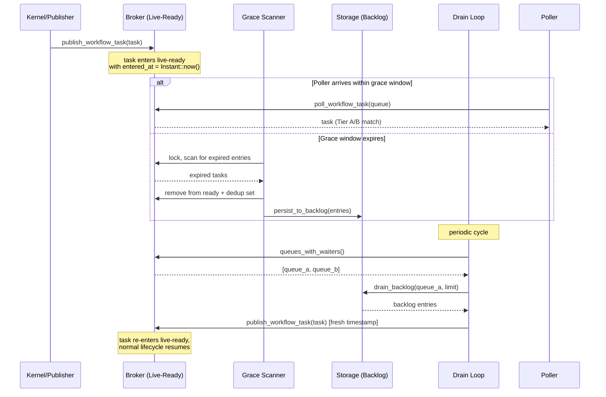

# Design Document: Durable Backlog Integration

## Overview

This design adds Tier C (durable backlog) to the three-tier delivery model described in [040-delivery-broker](../../../docs/architecture/040-delivery-broker.md). Today, `InMemoryBroker` and `InMemoryActivityBroker` implement only Tier A (sync match) and Tier B (live-ready). Tasks that are not matched by a poller sit in memory indefinitely — a liability if the process restarts or a shard is relinquished.

This feature introduces:

1. **Timestamped entries** in the live-ready tier so the runtime can measure how long a task has been waiting.
2. **Grace scanner** — a periodic background task that moves expired live-ready tasks to durable backlog via `persist_to_backlog`.
3. **Drain loop** — a periodic background task that retrieves persisted tasks via `drain_backlog` and re-publishes them to the broker for matching with waiting pollers.
4. **Deduplication coordination** across tiers to prevent double dispatch.

The authoritative pending-task state remains with the run (`pending_wft`, `activity_state`). If the broker dies before durable backlog is written, the sweeper (Feature 11) reconstructs delivery candidates from authoritative state. Live-ready and backlog are optimizations, not correctness dependencies.

## Architecture

### Interaction Flow



### Background Task Topology

Both the grace scanner and drain loop follow the established `run_timer_scanner` pattern:

- Spawned as `tokio::spawn` tasks during runtime construction.
- Controlled by a `CancellationToken` for graceful shutdown.
- Each cycle: `tokio::select!` on cancellation vs `tokio::time::sleep(interval)`.
- On cancellation, the current in-flight storage call completes before the task exits.

```
TokeiraRuntime
├── timer_scanner          (existing)
├── workflow_timeout_scanner (existing)
├── activity_timeout_scanner (existing)
├── nexus_timeout_scanner  (existing)
├── grace_scanner          ← NEW
└── drain_loop             ← NEW
```

### Broker Lock Strategy

Both brokers use `tokio::sync::Mutex`. The grace scanner and drain loop share the broker lock with pollers and publishers. Critical sections must be kept short:

- **Grace scanner**: lock → scan + collect expired → remove from ready + dedup → unlock → call `persist_to_backlog` (outside lock).
- **Drain loop**: call `drain_backlog` (no lock) → lock → re-publish each task → unlock.
- **Pollers/publishers**: unchanged, already short critical sections.

## Components and Interfaces

### New Structs

#### `BacklogConfig`

Configuration for the grace scanner and drain loop. Passed to `TokeiraRuntime` constructors.

```rust
#[derive(Clone, Debug, PartialEq, Eq)]
pub struct BacklogConfig {
    /// Grace window for workflow tasks before
    /// persisting to durable backlog.
    pub workflow_grace_window: tokio::time::Duration,
    /// Grace window for activity tasks.
    pub activity_grace_window: tokio::time::Duration,
    /// How often the grace scanner runs.
    pub grace_scan_interval: tokio::time::Duration,
    /// How often the drain loop runs.
    pub drain_interval: tokio::time::Duration,
    /// Max entries drained per queue per cycle.
    pub drain_batch_limit: usize,
}

impl Default for BacklogConfig {
    fn default() -> Self {
        Self {
            workflow_grace_window:
                tokio::time::Duration::from_secs(5),
            activity_grace_window:
                tokio::time::Duration::from_secs(5),
            grace_scan_interval:
                tokio::time::Duration::from_secs(1),
            drain_interval:
                tokio::time::Duration::from_secs(2),
            drain_batch_limit: 100,
        }
    }
}
```

#### `TimestampedWorkflowTask` / `TimestampedActivityTask`

Wrappers that pair a dispatchable task with its live-ready entry timestamp.

```rust
#[derive(Clone, Debug)]
struct TimestampedWorkflowTask {
    task: DispatchableWorkflowTask,
    entered_at: tokio::time::Instant,
}

#[derive(Clone, Debug)]
struct TimestampedActivityTask {
    task: DispatchableActivityTask,
    entered_at: tokio::time::Instant,
}
```

### Modified Structs

#### `BrokerState`

```rust
#[derive(Default)]
struct BrokerState {
    sticky_ready: HashMap<
        QueueKey,
        VecDeque<TimestampedWorkflowTask>,
    >,
    general_ready: HashMap<
        QueueKey,
        VecDeque<TimestampedWorkflowTask>,
    >,
    enqueued: HashSet<(RunKey, LogicalTaskSeq)>,
    /// Reference-counted waiter tracking. The count
    /// tracks active concurrent pollers per queue.
    /// A queue is considered to have waiters when
    /// its count is > 0.
    waiter_counts: HashMap<QueueKey, usize>,
}
```

#### `ActivityBrokerState`

```rust
#[derive(Default)]
struct ActivityBrokerState {
    ready: HashMap<
        QueueKey,
        VecDeque<TimestampedActivityTask>,
    >,
    enqueued: HashSet<(RunKey, String, u32)>,
    /// Reference-counted waiter tracking.
    waiter_counts: HashMap<QueueKey, usize>,
}
```

### New Broker Methods

```rust
impl InMemoryBroker {
    /// Return the set of QueueKeys that currently
    /// have at least one registered waiting poller.
    pub async fn queues_with_waiters(
        &self,
    ) -> HashSet<QueueKey>;

    /// Remove expired entries from the live-ready
    /// tier and return them. Also removes their
    /// dedup keys from the enqueued set.
    pub(crate) async fn take_expired(
        &self,
        grace_window: tokio::time::Duration,
    ) -> Vec<DispatchableWorkflowTask>;
}

impl InMemoryActivityBroker {
    /// Return the set of QueueKeys that currently
    /// have at least one registered waiting poller.
    pub async fn queues_with_waiters(
        &self,
    ) -> HashSet<QueueKey>;

    /// Remove expired entries from the live-ready
    /// tier and return them. Also removes their
    /// dedup keys from the enqueued set.
    pub(crate) async fn take_expired(
        &self,
        grace_window: tokio::time::Duration,
    ) -> Vec<DispatchableActivityTask>;
}
```

### Waiter Tracking

The `poll_workflow_task` and `poll_activity_task` methods already block on `Notify`. To track waiting queues, the broker state uses `waiter_counts: HashMap<QueueKey, usize>` — a reference-counted map where the count tracks active concurrent pollers per queue.

- On poll entry (before waiting on `Notify`): increment `waiter_counts[queue]` (insert 1 if absent).
- On poll exit (task received or timeout): decrement `waiter_counts[queue]`. If the count reaches 0, remove the entry.

The `queues_with_waiters()` method returns all keys where count > 0. This correctly handles multiple concurrent pollers on the same queue — a `HashSet` would not, because it cannot distinguish one poller from many.

### New Background Functions

```rust
/// Grace scanner: periodic background task.
pub(crate) async fn run_grace_scanner<R>(
    broker: InMemoryBroker,
    activity_broker: InMemoryActivityBroker,
    repo: Arc<R>,
    config: BacklogConfig,
    cancel: CancellationToken,
) where
    R: RunRepository + 'static;

/// Drain loop: periodic background task.
pub(crate) async fn run_drain_loop<R>(
    broker: InMemoryBroker,
    activity_broker: InMemoryActivityBroker,
    repo: Arc<R>,
    config: BacklogConfig,
    cancel: CancellationToken,
) where
    R: RunRepository + 'static;
```

### `TokeiraRuntime` Changes

New fields:

```rust
pub struct TokeiraRuntime<R> {
    // ... existing fields ...
    grace_scanner_handle:
        Option<tokio::task::JoinHandle<()>>,
    grace_scanner_cancel: CancellationToken,
    drain_loop_handle:
        Option<tokio::task::JoinHandle<()>>,
    drain_loop_cancel: CancellationToken,
}
```

New shutdown methods following the existing pattern:

```rust
pub async fn shutdown_grace_scanner(
    &mut self,
) -> Result<()>;
pub async fn shutdown_drain_loop(
    &mut self,
) -> Result<()>;
```

## Data Models

### BacklogEntry Extension

The current `BacklogEntry` does not carry enough fields to reconstruct a `DispatchableWorkflowTask` or `DispatchableActivityTask` on drain. We extend it to carry the full task payload, avoiding per-task storage lookups during drain.

**Option chosen: (a) Extend `BacklogEntry` with task-specific fields.**

```rust
#[derive(Clone, Debug, PartialEq)]
pub struct BacklogEntry {
    pub run_key: RunKey,
    pub queue: QueueKey,
    pub kind: BacklogTaskKind,
    pub insertion_seq: u64,
    /// Workflow-specific: monotonic task sequence.
    pub logical_seq: Option<LogicalTaskSeq>,
    /// Activity-specific: serialized input payloads.
    pub input: Option<Payloads>,
    /// Activity-specific: schedule event id.
    pub schedule_event_id: Option<i64>,
    /// Activity-specific: retry attempt number.
    pub attempt: Option<u32>,
}
```

Alternatively, use two entry variants via an enum payload:

```rust
#[derive(Clone, Debug, PartialEq)]
pub enum BacklogPayload {
    Workflow {
        logical_seq: LogicalTaskSeq,
    },
    Activity {
        activity_id: String,
        input: Payloads,
        schedule_event_id: i64,
        attempt: u32,
    },
}

pub struct BacklogEntry {
    pub run_key: RunKey,
    pub queue: QueueKey,
    pub payload: BacklogPayload,
    pub insertion_seq: u64,
}
```

**Recommended: the enum variant approach.** It is type-safe, avoids `Option` fields that are always `Some` for one variant and `None` for the other, and aligns with the existing `BacklogTaskKind` discriminant pattern. The `BacklogTaskKind` enum can be removed in favor of `BacklogPayload`.

### Reconstruction on Drain

When the drain loop receives a `BacklogEntry`, it reconstructs the dispatchable task:

- **Workflow**: `DispatchableWorkflowTask { run_key, queue, logical_seq, sticky_preferred: None, sticky_expires_at: None }` — sticky affinity is not preserved across backlog persistence (by design: the original sticky worker likely timed out).
- **Activity**: `DispatchableActivityTask { run_key, queue, activity_id, input, schedule_event_id, attempt }` — all fields carried in the backlog entry.

### Timestamp Source

`tokio::time::Instant` (monotonic) is used for `entered_at` timestamps. This avoids wall-clock drift issues and is appropriate since grace window comparison is always local to the same process. `Instant` is not serialized — it exists only in the in-memory `TimestampedWorkflowTask` / `TimestampedActivityTask` wrappers.


## Correctness Properties

*A property is a characteristic or behavior that should hold true across all valid executions of a system — essentially, a formal statement about what the system should do. Properties serve as the bridge between human-readable specifications and machine-verifiable correctness guarantees.*

### Property 1: Publish records entry timestamp

*For any* workflow or activity task published to the broker when no sync match occurs, the task SHALL be stored in the live-ready tier with a non-default `entered_at` timestamp captured at the time of publication.

**Validates: Requirements 1.1, 1.2, 4.8, 8.1**

### Property 2: Sticky promotion preserves original timestamp

*For any* sticky workflow task that is promoted from the sticky tier to the general tier (due to sticky expiry or non-matching poller), the `entered_at` timestamp in the general tier SHALL equal the original `entered_at` timestamp from when the task first entered the sticky tier.

**Validates: Requirements 1.3**

### Property 3: Grace scanner moves exactly the expired tasks

*For any* set of tasks in the live-ready tier with varying entry timestamps, after one grace scanner cycle, all tasks whose age exceeds the configured grace window SHALL be removed from the live-ready tier and included in the `persist_to_backlog` call, and all tasks whose age is within the grace window SHALL remain in the live-ready tier.

**Validates: Requirements 3.2, 3.3, 8.2**

### Property 4: Grace scanner clears dedup keys on backlog persistence

*For any* task moved from the live-ready tier to durable backlog by the grace scanner, the task's deduplication key SHALL be removed from the broker's `enqueued` set, so that a subsequent publish of the same `(run_key, logical_seq)` or `(run_key, activity_id, attempt)` is accepted.

**Validates: Requirements 3.4, 5.2**

### Property 5: Persist failure retains tasks in live-ready

*For any* set of expired tasks in the live-ready tier, if `persist_to_backlog` returns an error, all expired tasks SHALL remain in the live-ready tier with their dedup keys intact, and SHALL be eligible for persistence on the next scan cycle.

**Validates: Requirements 3.7**

### Property 6: Drain loop targets only queues with waiters

*For any* set of queues in the system, the drain loop SHALL call `drain_backlog` only for queues where `queues_with_waiters()` reports at least one active poller, and SHALL not call `drain_backlog` for any queue with zero waiters.

**Validates: Requirements 4.2, 4.3, 10.3**

### Property 7: Drain loop routes entries to the correct broker by kind

*For any* `BacklogEntry` drained from storage, if the payload is `Workflow` the drain loop SHALL re-publish it to `InMemoryBroker`, and if the payload is `Activity` the drain loop SHALL re-publish it to `InMemoryActivityBroker`, with all task fields correctly reconstructed from the backlog entry.

**Validates: Requirements 4.4, 9.3, 9.4**

### Property 8: Dedup prevents double dispatch

*For any* task that exists in the live-ready tier, re-publishing the same task (same dedup key) SHALL be suppressed by the broker's `enqueued` set, ensuring that a single logical task is delivered to at most one poller.

**Validates: Requirements 5.1, 5.3, 5.4, 8.4**

### Property 9: FIFO order preserved through drain and re-publish

*For any* ordered sequence of `BacklogEntry` values returned by `drain_backlog` (ascending `insertion_seq`), the drain loop SHALL re-publish them to the broker in the same order, so that the resulting ready queue preserves FIFO delivery semantics.

**Validates: Requirements 6.3, 7.3**

## Error Handling

### `persist_to_backlog` Failure

- **Behavior**: Grace scanner retains expired tasks in the live-ready tier. Dedup keys are NOT removed. Tasks are retried on the next scan cycle.
- **Safety**: Tasks remain deliverable from live-ready. No data loss.
- **Logging**: `tracing::warn!` with the error, queue, and count of affected tasks.

### `drain_backlog` Failure

- **Behavior**: Drain loop skips the failed queue and continues to the next. Retries on the next cycle.
- **Safety**: Tasks remain safely persisted in durable backlog. No data loss.
- **Logging**: `tracing::warn!` with the error and queue.

### Broker Lock Contention

- **Grace scanner**: Acquires the lock only to scan and collect expired entries + remove them from ready queues and dedup set. The `persist_to_backlog` call happens outside the lock.
- **Drain loop**: Calls `drain_backlog` outside the lock. Acquires the lock only to re-publish each drained task (which is a fast `VecDeque::push_back` + `HashSet::insert`).
- **Pollers/publishers**: Unchanged. Already short critical sections.

### Re-publish After Drain Dedup Conflict

- **Behavior**: If a drained task's dedup key is already in the `enqueued` set (e.g., the sweeper already re-published it), the re-publish is silently suppressed. The task was already removed from backlog by `drain_backlog`, so it is not lost — it exists in live-ready from the sweeper's publish.
- **Safety**: At-most-once delivery is preserved.

### Shutdown

- **Grace scanner**: On `CancellationToken` cancellation, the `tokio::select!` exits the sleep branch. If a `persist_to_backlog` call is in flight, it completes before the async function returns. The `JoinHandle` is awaited with a 5-second timeout (matching existing scanner shutdown pattern).
- **Drain loop**: Same pattern. In-flight `drain_backlog` completes before exit.
- **Shard relinquish**: When a shard transitions to `Draining`, tasks remaining in live-ready for that shard are not persisted — the sweeper on the new owner reconstructs them from authoritative state.

## Testing Strategy

### Property-Based Tests (proptest)

The project already uses `proptest` (see `shard.rs`, `worker_registry.rs`, `activity_timeout.rs`). Each correctness property above maps to one property-based test with a minimum of 100 iterations.

Tag format: `Feature: runtime-durable-backlog, Property {N}: {title}`

Tests will use:
- **Arbitrary generators** for `RunKey`, `QueueKey`, `LogicalTaskSeq`, `DispatchableWorkflowTask`, `DispatchableActivityTask`.
- **Mock storage** implementing `RunRepository` with configurable `persist_to_backlog` / `drain_backlog` behavior (success, error injection, recording calls).
- **`tokio::time::pause()`** for deterministic time control in grace window tests.

### Unit Tests (example-based)

- Default `BacklogConfig` values are in expected ranges (Requirements 2.2, 2.3, 3.6).
- Zero grace window edge case (Requirement 2.4).
- Batching: multiple expired tasks produce a single `persist_to_backlog` call (Requirement 3.5).
- No-waiters skip: drain loop makes zero `drain_backlog` calls when no pollers are registered (Requirement 10.4).
- `BacklogEntry` construction: correct `BacklogPayload` variant for workflow vs activity tasks (Requirement 9.3).

### Integration Tests

- Full lifecycle: publish → grace expiry → backlog persist → drain → re-publish → poll delivery.
- Shutdown: cancel token during in-flight storage call, verify completion.
- FIFO ordering through the memory store's `drain_backlog` implementation.
- Sweeper interaction: sweeper re-publish → grace expiry → backlog → drain → delivery.
