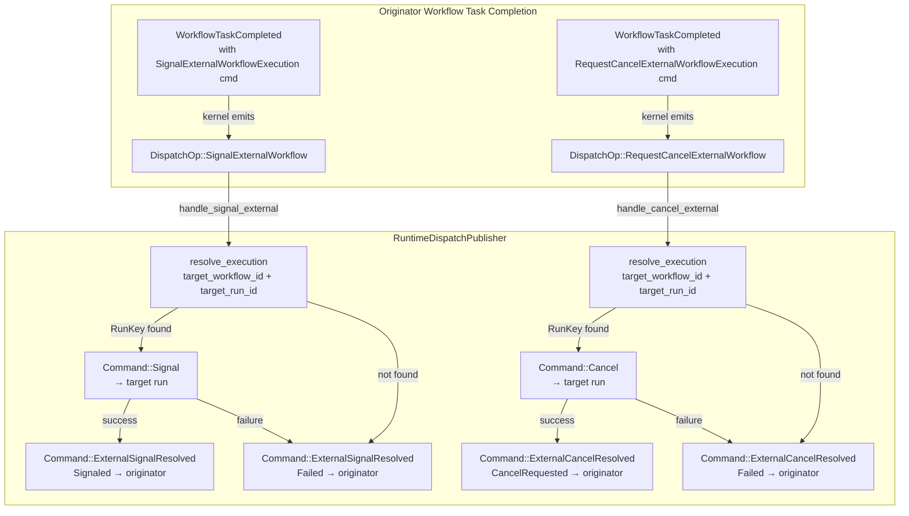

# Design Document: External Signal and Cancel Delivery

## Overview

This design wires the runtime's `DispatchPublisher` to handle the two external workflow dispatch ops (`SignalExternalWorkflow`, `RequestCancelExternalWorkflow`) and delivers resolution results back to the originating workflow. It replaces the current stub logging in `RuntimeDispatchPublisher` (the `other =>` catch-all arm) with working implementations.

The kernel already handles all external signal/cancel commands authoritatively:
- `WorkflowCommand::SignalExternalWorkflowExecution` emits `DispatchOp::SignalExternalWorkflow` and inserts a `PendingExternalSignal` entry in the originator's `pending_external_signals` map.
- `WorkflowCommand::RequestCancelExternalWorkflowExecution` emits `DispatchOp::RequestCancelExternalWorkflow` and inserts a `PendingExternalCancel` entry in the originator's `pending_external_cancels` map.
- `Command::ExternalSignalResolved` emits the appropriate history event and removes the entry from `pending_external_signals`.
- `Command::ExternalCancelResolved` emits the appropriate history event and removes the entry from `pending_external_cancels`.

The runtime's job is purely orchestration: translate dispatch ops into commands on the correct target runs, and deliver resolution results back to the originator.

The central design challenge is **originator identity propagation**. The current `DispatchOp::SignalExternalWorkflow` and `DispatchOp::RequestCancelExternalWorkflow` do not carry the originator's `RunKey`, `namespace_id`, or `initiated_event_id`. The publisher needs all three to resolve the target execution and deliver the resolution command back to the originator. This is the same pattern solved in Feature 6 for `StartChildWorkflow`, which was extended with `parent_run_key`, `parent_workflow_id`, and `initiated_event_id`.

Unlike child workflow orchestration, external signals and cancels:
- Target arbitrary workflows (not just children).
- May target workflows in different namespaces.
- Do not require child resolution detection — the operation is fire-and-resolve (signal/cancel the target, then report success or failure back to the originator).

The publisher already has repository access (`resolve_execution`) and `submit_to_run` from Feature 6. The main new work is:
1. Extending `DispatchOp::SignalExternalWorkflow` and `DispatchOp::RequestCancelExternalWorkflow` with `originator_run_key`, `namespace_id`, and `initiated_event_id`.
2. Implementing the two new match arms in `RuntimeDispatchPublisher::publish`.
3. Constructing proper `Signal` and `Cancel` commands with `RequestContext`.

This feature depends on Feature 1 (Lane OCC Retry) and Feature 6 (Child Workflow Orchestration), both already implemented.

## Architecture



### Key design decisions

**Extend dispatch ops with originator identity (same pattern as Feature 6).** The `DispatchOp::SignalExternalWorkflow` and `DispatchOp::RequestCancelExternalWorkflow` variants gain `originator_run_key: RunKey`, `namespace_id: NamespaceId` (the target namespace, from the workflow command's `target_namespace_id`), and `initiated_event_id: i64`. The kernel's `apply_workflow_command` populates `originator_run_key` from `builder.state.run_key`, `namespace_id` from the workflow command's `target_namespace_id`, and `initiated_event_id` from the emitted event ID.

**Namespace on the dispatch op is the target namespace.** The `namespace_id` field on the dispatch op identifies the namespace of the target workflow, not the originator. This is needed for `resolve_execution` to look up the target in the correct namespace. The `WorkflowCommand::SignalExternalWorkflowExecution` and `RequestCancelExternalWorkflowExecution` are extended with a `target_namespace_id: NamespaceId` field, which the kernel propagates into the dispatch op's `namespace_id`. For same-namespace signals, the caller sets `target_namespace_id` equal to their own namespace. For cross-namespace signals, the caller sets it to the target's namespace.

**Async, fire-and-forget dispatch via `tokio::spawn`.** Each external signal/cancel dispatch op is processed in a spawned task, consistent with the child workflow pattern. This ensures one slow or failing dispatch does not block other dispatch ops in the same batch.

**Resolution always delivered.** Regardless of whether the signal/cancel succeeds or fails (target not found, target closed, transient error), the publisher always delivers a resolution command back to the originator. This ensures the originator's `PendingExternalSignal` or `PendingExternalCancel` entry is resolved and a history event is emitted.

**Cancel command carries `external_initiator`.** The `Command::Cancel` submitted to the target run populates the `external_initiator` field with the originator's namespace, workflow ID, and run ID. This requires the dispatch op to also carry the originator's `workflow_id` and `run_id` (or the publisher can read them from the originator's state). To keep the dispatch op lean, the publisher reads the originator's identity from the dispatch op's `originator_run_key` and resolves the remaining fields from the originator's state via `repo.load_run`. However, this adds a storage read. A simpler approach: extend the dispatch op with `originator_namespace_id`, `originator_workflow_id`, and `originator_run_id` so the publisher has everything it needs without an extra load. This is the chosen approach.

## Components and Interfaces

### Extended DispatchOp::SignalExternalWorkflow

```rust
DispatchOp::SignalExternalWorkflow {
    target_workflow_id: WorkflowId,
    target_run_id: Option<RunId>,
    signal_name: String,
    input: Payloads,
    // New fields:
    originator_run_key: RunKey,
    namespace_id: NamespaceId,
    initiated_event_id: i64,
}
```

### Extended DispatchOp::RequestCancelExternalWorkflow

```rust
DispatchOp::RequestCancelExternalWorkflow {
    target_workflow_id: WorkflowId,
    target_run_id: Option<RunId>,
    // New fields:
    originator_run_key: RunKey,
    originator_namespace_id: NamespaceId,
    originator_workflow_id: WorkflowId,
    originator_run_id: RunId,
    namespace_id: NamespaceId,
    initiated_event_id: i64,
    reason: String,
}
```

The `reason` field is added so the cancel command can carry a descriptive reason (e.g., "cancel requested by external workflow {workflow_id}"). The `originator_namespace_id`, `originator_workflow_id`, and `originator_run_id` fields are needed to populate the `external_initiator` on the `CancelRequest`.

### Kernel changes: WorkflowCommand extension

The `WorkflowCommand::SignalExternalWorkflowExecution` and `RequestCancelExternalWorkflowExecution` variants gain a `target_namespace_id: NamespaceId` field:

```rust
WorkflowCommand::SignalExternalWorkflowExecution {
    target_namespace_id: NamespaceId,
    target_workflow_id: WorkflowId,
    target_run_id: Option<RunId>,
    signal_name: String,
    input: Payloads,
}

WorkflowCommand::RequestCancelExternalWorkflowExecution {
    target_namespace_id: NamespaceId,
    target_workflow_id: WorkflowId,
    target_run_id: Option<RunId>,
}
```

### Kernel changes: apply_workflow_command

The kernel's `apply_workflow_command` for `SignalExternalWorkflowExecution` currently emits:

```rust
builder.dispatch_ops.push(DispatchOp::SignalExternalWorkflow {
    target_workflow_id,
    target_run_id,
    signal_name,
    input,
});
```

This becomes:

```rust
builder.dispatch_ops.push(DispatchOp::SignalExternalWorkflow {
    target_workflow_id,
    target_run_id,
    signal_name,
    input,
    originator_run_key: builder.state.run_key,
    namespace_id: target_namespace_id,
    initiated_event_id,
});
```

Similarly for `RequestCancelExternalWorkflowExecution`:

```rust
builder.dispatch_ops.push(DispatchOp::RequestCancelExternalWorkflow {
    target_workflow_id,
    target_run_id,
    originator_run_key: builder.state.run_key,
    originator_namespace_id: builder.state.namespace_id,
    originator_workflow_id: builder.state.workflow_id.clone(),
    originator_run_id: builder.state.run_id,
    namespace_id: target_namespace_id,
    initiated_event_id,
    reason: format!(
        "cancel requested by external workflow {}",
        builder.state.workflow_id.0
    ),
});
```

### RuntimeDispatchPublisher — new handler methods

Two new async methods on `RuntimeDispatchPublisher`:

```rust
async fn handle_signal_external_workflow(
    &self,
    target_workflow_id: WorkflowId,
    target_run_id: Option<RunId>,
    signal_name: String,
    input: Payloads,
    originator_run_key: RunKey,
    namespace_id: NamespaceId,
    initiated_event_id: i64,
) {
    let signal_result = match self.repo.resolve_execution(&ExecutionRef {
        namespace_id,
        workflow_id: target_workflow_id.clone(),
        run_id: target_run_id,
    }).await {
        Ok(Some(target_run_key)) => {
            let signal_command = Command::Signal(SignalRequest {
                signal_name,
                input,
                request: RequestContext {
                    request_id: RequestId(format!(
                        "ext-signal-{originator_run_key:?}-{initiated_event_id}"
                    )),
                    caller_identity: Some(
                        "runtime-external-signal-orchestrator".to_string()
                    ),
                    received_at: OffsetDateTime::now_utc(),
                },
                now: OffsetDateTime::now_utc(),
            });
            match self.pick_lane(target_run_key)
                .submit(target_run_key, signal_command).await
            {
                Ok(CommitResult::Applied { .. })
                | Ok(CommitResult::Duplicate) => {
                    ExternalSignalResult::Signaled
                }
                Ok(CommitResult::Conflict { reason }) => {
                    ExternalSignalResult::Failed { cause: reason }
                }
                Err(error) => {
                    ExternalSignalResult::Failed {
                        cause: error.to_string(),
                    }
                }
            }
        }
        Ok(None) => ExternalSignalResult::Failed {
            cause: format!(
                "target workflow not found: {}",
                target_workflow_id.0
            ),
        },
        Err(error) => ExternalSignalResult::Failed {
            cause: error.to_string(),
        },
    };

    let resolve_command = Command::ExternalSignalResolved(
        ExternalSignalResolvedRequest {
            initiated_event_id,
            result: signal_result,
            now: OffsetDateTime::now_utc(),
        },
    );
    if let Err(error) = self.pick_lane(originator_run_key)
        .submit(originator_run_key, resolve_command).await
    {
        tracing::warn!(
            ?error,
            originator_run_key = ?originator_run_key,
            initiated_event_id,
            "failed to deliver ExternalSignalResolved to originator"
        );
    }
}
```

```rust
async fn handle_cancel_external_workflow(
    &self,
    target_workflow_id: WorkflowId,
    target_run_id: Option<RunId>,
    originator_run_key: RunKey,
    originator_namespace_id: NamespaceId,
    originator_workflow_id: WorkflowId,
    originator_run_id: RunId,
    namespace_id: NamespaceId,
    initiated_event_id: i64,
    reason: String,
) {
    let cancel_result = match self.repo.resolve_execution(&ExecutionRef {
        namespace_id,
        workflow_id: target_workflow_id.clone(),
        run_id: target_run_id,
    }).await {
        Ok(Some(target_run_key)) => {
            let cancel_command = Command::Cancel(CancelRequest {
                reason,
                external_initiator: Some(ExternalWorkflowExecution {
                    namespace_id: originator_namespace_id,
                    workflow_id: originator_workflow_id,
                    run_id: originator_run_id,
                }),
                request: RequestContext {
                    request_id: RequestId(format!(
                        "ext-cancel-{originator_run_key:?}-{initiated_event_id}"
                    )),
                    caller_identity: Some(
                        "runtime-external-cancel-orchestrator".to_string()
                    ),
                    received_at: OffsetDateTime::now_utc(),
                },
                now: OffsetDateTime::now_utc(),
            });
            match self.pick_lane(target_run_key)
                .submit(target_run_key, cancel_command).await
            {
                Ok(CommitResult::Applied { .. })
                | Ok(CommitResult::Duplicate) => {
                    ExternalCancelResult::CancelRequested
                }
                Ok(CommitResult::Conflict { reason }) => {
                    ExternalCancelResult::Failed { cause: reason }
                }
                Err(error) => {
                    ExternalCancelResult::Failed {
                        cause: error.to_string(),
                    }
                }
            }
        }
        Ok(None) => ExternalCancelResult::Failed {
            cause: format!(
                "target workflow not found: {}",
                target_workflow_id.0
            ),
        },
        Err(error) => ExternalCancelResult::Failed {
            cause: error.to_string(),
        },
    };

    let resolve_command = Command::ExternalCancelResolved(
        ExternalCancelResolvedRequest {
            initiated_event_id,
            result: cancel_result,
            now: OffsetDateTime::now_utc(),
        },
    );
    if let Err(error) = self.pick_lane(originator_run_key)
        .submit(originator_run_key, resolve_command).await
    {
        tracing::warn!(
            ?error,
            originator_run_key = ?originator_run_key,
            initiated_event_id,
            "failed to deliver ExternalCancelResolved to originator"
        );
    }
}
```

### RuntimeDispatchPublisher::publish — new match arms

The `publish` method gains two new match arms before the `other =>` catch-all:

```rust
DispatchOp::SignalExternalWorkflow {
    target_workflow_id,
    target_run_id,
    signal_name,
    input,
    originator_run_key,
    namespace_id,
    initiated_event_id,
} => {
    let publisher = RuntimeDispatchPublisher::clone(self);
    let target_workflow_id = target_workflow_id.clone();
    let signal_name = signal_name.clone();
    let input = input.clone();
    let originator_run_key = *originator_run_key;
    let namespace_id = *namespace_id;
    let initiated_event_id = *initiated_event_id;
    let target_run_id = *target_run_id;
    tokio::spawn(async move {
        publisher
            .handle_signal_external_workflow(
                target_workflow_id,
                target_run_id,
                signal_name,
                input,
                originator_run_key,
                namespace_id,
                initiated_event_id,
            )
            .await;
    });
}

DispatchOp::RequestCancelExternalWorkflow {
    target_workflow_id,
    target_run_id,
    originator_run_key,
    originator_namespace_id,
    originator_workflow_id,
    originator_run_id,
    namespace_id,
    initiated_event_id,
    reason,
} => {
    let publisher = RuntimeDispatchPublisher::clone(self);
    let target_workflow_id = target_workflow_id.clone();
    let target_run_id = *target_run_id;
    let originator_run_key = *originator_run_key;
    let originator_namespace_id = *originator_namespace_id;
    let originator_workflow_id = originator_workflow_id.clone();
    let originator_run_id = *originator_run_id;
    let namespace_id = *namespace_id;
    let initiated_event_id = *initiated_event_id;
    let reason = reason.clone();
    tokio::spawn(async move {
        publisher
            .handle_cancel_external_workflow(
                target_workflow_id,
                target_run_id,
                originator_run_key,
                originator_namespace_id,
                originator_workflow_id,
                originator_run_id,
                namespace_id,
                initiated_event_id,
                reason,
            )
            .await;
    });
}
```

## Data Models

### Modified types

| Type | Crate | Change |
|------|-------|--------|
| `WorkflowCommand::SignalExternalWorkflowExecution` | `tokeira-kernel` | Add `target_namespace_id: NamespaceId` |
| `WorkflowCommand::RequestCancelExternalWorkflowExecution` | `tokeira-kernel` | Add `target_namespace_id: NamespaceId` |
| `DispatchOp::SignalExternalWorkflow` | `tokeira-kernel` | Add `originator_run_key: RunKey`, `namespace_id: NamespaceId`, `initiated_event_id: i64` |
| `DispatchOp::RequestCancelExternalWorkflow` | `tokeira-kernel` | Add `originator_run_key: RunKey`, `originator_namespace_id: NamespaceId`, `originator_workflow_id: WorkflowId`, `originator_run_id: RunId`, `namespace_id: NamespaceId`, `initiated_event_id: i64`, `reason: String` |
| `apply_workflow_command` (SignalExternalWorkflowExecution arm) | `tokeira-kernel` | Populate new dispatch op fields from `builder.state` |
| `apply_workflow_command` (RequestCancelExternalWorkflowExecution arm) | `tokeira-kernel` | Populate new dispatch op fields from `builder.state` |
| `RuntimeDispatchPublisher` | `tokeira-runtime` | Add `handle_signal_external_workflow` and `handle_cancel_external_workflow` methods |
| `RuntimeDispatchPublisher::publish` | `tokeira-runtime` | Add two new match arms for `SignalExternalWorkflow` and `RequestCancelExternalWorkflow` |

### New types

None. All new functionality is expressed through extensions to existing types.

### Existing types used (no changes needed)

| Type | Crate | Role |
|------|-------|------|
| `ExternalSignalResolvedRequest` | `tokeira-kernel` | Command payload for delivering signal resolution to originator |
| `ExternalSignalResult` | `tokeira-kernel` | `Signaled` or `Failed { cause }` |
| `ExternalCancelResolvedRequest` | `tokeira-kernel` | Command payload for delivering cancel resolution to originator |
| `ExternalCancelResult` | `tokeira-kernel` | `CancelRequested` or `Failed { cause }` |
| `SignalRequest` | `tokeira-kernel` | Command payload for delivering signal to target |
| `CancelRequest` | `tokeira-kernel` | Command payload for delivering cancel to target |
| `ExternalWorkflowExecution` | `tokeira-kernel` | Originator identity for cancel history |
| `PendingExternalSignal` | `tokeira-kernel` | Originator's tracking state for in-flight signal |
| `PendingExternalCancel` | `tokeira-kernel` | Originator's tracking state for in-flight cancel |
| `RequestContext` | `tokeira-types` | Request metadata for dedupe and tracing |
| `ExecutionRef` | `tokeira-types` | Used to resolve target workflow to `RunKey` |
| `CommitResult` | `tokeira-storage` | `Applied`, `Conflict`, `Duplicate` |

### Data flow: Signal External Workflow

```
Originator WFT Completed with SignalExternalWorkflowExecution command
  → Kernel emits DispatchOp::SignalExternalWorkflow {
      target_workflow_id, target_run_id, signal_name, input,
      originator_run_key, namespace_id, initiated_event_id
    }
  → Lane commits originator transition
  → Publisher.publish() handles SignalExternalWorkflow:
      1. resolve_execution(namespace_id, target_workflow_id, target_run_id) → RunKey
      2. Submit Command::Signal to target lane
      3. Build ExternalSignalResolvedRequest from result
      4. Submit Command::ExternalSignalResolved to originator lane
```

### Data flow: Cancel External Workflow

```
Originator WFT Completed with RequestCancelExternalWorkflowExecution command
  → Kernel emits DispatchOp::RequestCancelExternalWorkflow {
      target_workflow_id, target_run_id,
      originator_run_key, originator_namespace_id,
      originator_workflow_id, originator_run_id,
      namespace_id, initiated_event_id, reason
    }
  → Lane commits originator transition
  → Publisher.publish() handles RequestCancelExternalWorkflow:
      1. resolve_execution(namespace_id, target_workflow_id, target_run_id) → RunKey
      2. Submit Command::Cancel to target lane (with external_initiator)
      3. Build ExternalCancelResolvedRequest from result
      4. Submit Command::ExternalCancelResolved to originator lane
```

## Correctness Properties

*A property is a characteristic or behavior that should hold true across all valid executions of a system — essentially, a formal statement about what the system should do. Properties serve as the bridge between human-readable specifications and machine-verifiable correctness guarantees.*

### Property 1: Signal command construction

*For any* `DispatchOp::SignalExternalWorkflow` with arbitrary `signal_name`, `input`, `originator_run_key`, `namespace_id`, and `initiated_event_id`, the `Command::Signal` submitted to the target run shall have:
- `signal_name` equal to the dispatch op's `signal_name`
- `input` equal to the dispatch op's `input`
- `request.request_id` that is non-empty
- `request.caller_identity` equal to `Some("runtime-external-signal-orchestrator")`

**Validates: Requirements 1.2, 7.1, 7.2, 7.3**

### Property 2: Cancel command construction

*For any* `DispatchOp::RequestCancelExternalWorkflow` with arbitrary `originator_namespace_id`, `originator_workflow_id`, `originator_run_id`, and `reason`, the `Command::Cancel` submitted to the target run shall have:
- `reason` equal to the dispatch op's `reason`
- `request.request_id` that is non-empty
- `request.caller_identity` equal to `Some("runtime-external-cancel-orchestrator")`
- `external_initiator` equal to `Some(ExternalWorkflowExecution { namespace_id: originator_namespace_id, workflow_id: originator_workflow_id, run_id: originator_run_id })`

**Validates: Requirements 2.2, 8.1, 8.2, 8.3**

### Property 3: Signal resolution always delivered with correct result

*For any* `DispatchOp::SignalExternalWorkflow` and any outcome of the signal delivery attempt (target found and signal committed, target not found, target closed, transient error), the publisher shall submit a `Command::ExternalSignalResolved` to the originator run with:
- `initiated_event_id` matching the dispatch op's `initiated_event_id`
- `result` equal to `ExternalSignalResult::Signaled` when the signal was committed, or `ExternalSignalResult::Failed { cause }` with a non-empty cause when the delivery failed for any reason

**Validates: Requirements 1.3, 1.4, 1.5, 1.6, 5.1, 6.1, 6.2**

### Property 4: Cancel resolution always delivered with correct result

*For any* `DispatchOp::RequestCancelExternalWorkflow` and any outcome of the cancel delivery attempt (target found and cancel committed, target not found, target closed, transient error), the publisher shall submit a `Command::ExternalCancelResolved` to the originator run with:
- `initiated_event_id` matching the dispatch op's `initiated_event_id`
- `result` equal to `ExternalCancelResult::CancelRequested` when the cancel was committed, or `ExternalCancelResult::Failed { cause }` with a non-empty cause when the delivery failed for any reason

**Validates: Requirements 2.3, 2.4, 2.5, 2.6, 5.2, 6.1, 6.2**

### Property 5: Kernel populates signal dispatch op fields from workflow state

*For any* `WorkflowState` with arbitrary `run_key` and `namespace_id`, when the kernel processes a `WorkflowCommand::SignalExternalWorkflowExecution`, the emitted `DispatchOp::SignalExternalWorkflow` shall have:
- `originator_run_key` equal to `state.run_key`
- `namespace_id` equal to `state.namespace_id`
- `initiated_event_id` equal to the event ID of the emitted `SignalExternalWorkflowExecutionInitiated` history event

**Validates: Requirements 4.1, 4.2, 4.3, 4.7**

### Property 6: Kernel populates cancel dispatch op fields from workflow state

*For any* `WorkflowState` with arbitrary `run_key`, `namespace_id`, `workflow_id`, and `run_id`, when the kernel processes a `WorkflowCommand::RequestCancelExternalWorkflowExecution`, the emitted `DispatchOp::RequestCancelExternalWorkflow` shall have:
- `originator_run_key` equal to `state.run_key`
- `originator_namespace_id` equal to `state.namespace_id`
- `originator_workflow_id` equal to `state.workflow_id`
- `originator_run_id` equal to `state.run_id`
- `namespace_id` equal to `state.namespace_id`
- `initiated_event_id` equal to the event ID of the emitted `RequestCancelExternalWorkflowExecutionInitiated` history event

**Validates: Requirements 4.4, 4.5, 4.6, 4.8**

### Property 7: Target resolution uses dispatch op namespace

*For any* `DispatchOp::SignalExternalWorkflow` or `DispatchOp::RequestCancelExternalWorkflow` with arbitrary `namespace_id`, `target_workflow_id`, and `target_run_id`, the publisher shall call `resolve_execution` with an `ExecutionRef` whose `namespace_id` equals the dispatch op's `namespace_id`, `workflow_id` equals `target_workflow_id`, and `run_id` equals `target_run_id`.

**Validates: Requirements 1.1, 2.1, 3.1, 3.2**

## Error Handling

### Target not found

If `resolve_execution` returns `None` (target workflow does not exist or has no matching run), the publisher delivers a `Failed` resolution to the originator with a descriptive cause. The originator's `PendingExternalSignal` or `PendingExternalCancel` entry is resolved and a failure history event is emitted by the kernel.

### Target run closed

If the `Command::Signal` or `Command::Cancel` submission to the target run is rejected by the kernel (e.g., `Reject::RunClosed`), the error surfaces through the lane's `handle_message` as an `Err`. The publisher treats this as a failure and delivers a `Failed` resolution to the originator.

### Transient errors

If `resolve_execution` or the command submission encounters a transient error (storage unavailable, lane channel closed), the publisher delivers a `Failed` resolution to the originator. The originator can retry the operation if needed (via a new workflow task completion with the same command).

### Resolution delivery failure

If the `Command::ExternalSignalResolved` or `Command::ExternalCancelResolved` delivery to the originator fails (originator lane closed, OCC exhaustion), the publisher logs at `warn` level. The originator's `PendingExternalSignal` or `PendingExternalCancel` entry remains until the sweeper (Feature 11) or a future reconciliation mechanism resolves it.

### Duplicate signal/cancel delivery

If the `Command::Signal` or `Command::Cancel` returns `CommitResult::Duplicate`, the publisher treats this as a success (`Signaled` or `CancelRequested`). Duplicate delivery is idempotent from the originator's perspective.

### Async dispatch isolation

Each external signal/cancel dispatch op is processed in a `tokio::spawn` task. Failure in one dispatch does not block or affect other dispatch ops in the same batch. This is consistent with the child workflow dispatch pattern.

## Testing Strategy

### Property-based testing

All 7 correctness properties will be implemented as property-based tests using the [`proptest`](https://docs.rs/proptest) crate, consistent with the existing test infrastructure in `tokeira-runtime` and `tokeira-kernel`.

Each property test will:
- Run a minimum of 100 iterations (proptest default is 256).
- Use mock implementations of `RunRepository`, `LaneHandle`, and `DispatchPublisher` that are configurable per test.
- Be tagged with a comment referencing the design property.
- Tag format: `// Feature: runtime-external-signals, Property N: <title>`

Each correctness property MUST be implemented by a SINGLE property-based test.

**Property 1 (Signal command construction):** A generator produces random `signal_name` (arbitrary non-empty strings), `input` (arbitrary `Payloads`), `originator_run_key`, `namespace_id`, and `initiated_event_id`. A mock repo returns a valid `RunKey` for the target. A mock lane captures the `Command::Signal` submitted to it. The test verifies `signal_name`, `input`, `request.request_id` (non-empty), and `request.caller_identity` match expectations.

**Property 2 (Cancel command construction):** A generator produces random `originator_namespace_id`, `originator_workflow_id`, `originator_run_id`, `reason`, and target identity. A mock repo returns a valid `RunKey`. A mock lane captures the `Command::Cancel`. The test verifies `reason`, `request.request_id` (non-empty), `request.caller_identity`, and `external_initiator` field mapping.

**Property 3 (Signal resolution always delivered):** A generator produces random dispatch ops and a random outcome selector (success, not-found, closed, transient error). Mock repo and lanes are configured per the outcome. A mock originator lane captures the `Command::ExternalSignalResolved`. The test verifies the resolution is always delivered with the correct `initiated_event_id` and appropriate `ExternalSignalResult` variant.

**Property 4 (Cancel resolution always delivered):** Same structure as Property 3 but for cancel dispatch ops and `ExternalCancelResult`.

**Property 5 (Kernel populates signal dispatch op fields):** A generator produces random `WorkflowState` values (varying `run_key`, `namespace_id`, `last_event_id`) and random `SignalExternalWorkflowExecution` commands. The test applies the command via `BasicKernel` and verifies the emitted `DispatchOp::SignalExternalWorkflow` carries `originator_run_key`, `namespace_id`, and `initiated_event_id` matching the state and emitted event.

**Property 6 (Kernel populates cancel dispatch op fields):** Same structure as Property 5 but for `RequestCancelExternalWorkflowExecution` and the cancel dispatch op fields.

**Property 7 (Target resolution uses dispatch op namespace):** A generator produces random `namespace_id`, `target_workflow_id`, and `target_run_id` values. A mock repo captures the `ExecutionRef` passed to `resolve_execution`. The test verifies the `ExecutionRef` fields match the dispatch op values.

### Unit tests

Unit tests complement property tests for specific examples and edge cases:

- **Signal to closed target:** Verify that a kernel rejection (RunClosed) from the target lane results in `ExternalSignalResult::Failed` with a descriptive cause.
- **Cancel to absent target:** Verify that `resolve_execution` returning `None` results in `ExternalCancelResult::Failed`.
- **Resolution delivery failure:** Verify that when the originator lane fails to accept the resolution command, the handler completes without panic.
- **Duplicate signal delivery:** Verify that `CommitResult::Duplicate` from the target lane is treated as `Signaled`.
- **Duplicate cancel delivery:** Verify that `CommitResult::Duplicate` from the target lane is treated as `CancelRequested`.
- **Batch isolation:** Verify that a failing signal dispatch does not prevent a subsequent cancel dispatch in the same batch from being processed.
