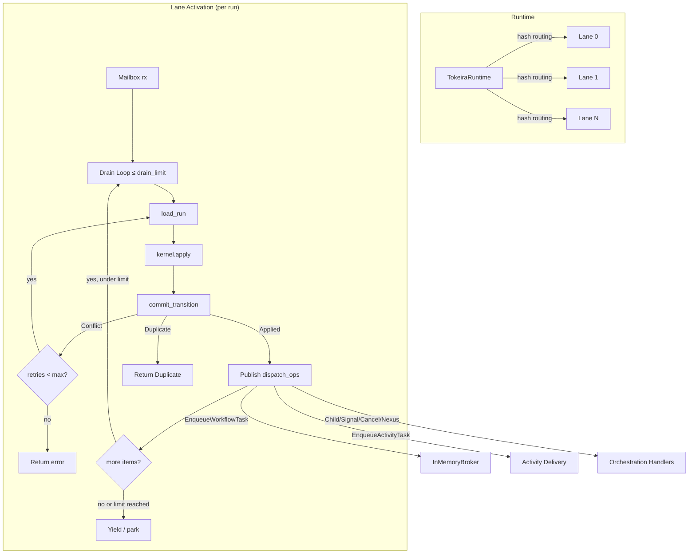

# Design Document: Lane OCC Retry and Mailbox Coalescing

## Overview

This design hardens the `tokeira-runtime` lane execution path by introducing three interlocking mechanisms on top of the existing load → kernel → commit pipeline:

1. An **OCC retry loop** inside `handle_message` that reloads state and recomputes the transition when storage returns `CommitResult::Conflict`.
2. **Mailbox coalescing** so that a lane drains multiple pending commands for the same run in one activation cycle before yielding.
3. **Dispatch op publication** so that every `DispatchOp` variant emitted by a committed `Transition` is forwarded to the `DispatchPublisher`. In this feature, only `EnqueueWorkflowTask` is fully wired to the broker; all other variants are logged as stubs until their respective features (Activity Pump, Child Workflows, External Signals, Nexus) are implemented.

The current `lane.rs` performs a single load → apply → commit with no retry. The current `runtime.rs` publishes only `EnqueueWorkflowTask` and only from the facade level. This design moves publication into the lane (where the committed transition is available) and makes the lane resilient to OCC conflicts that are expected under concurrent writes to the same run.

Routing remains `hash(run_key) mod lane_count` as already implemented in `runtime.rs::pick_lane`. This design formalizes that contract and adds the configuration surface for retry and coalescing limits.

## Architecture



The lane task loop changes from processing one message at a time to:

1. Receive a message from the channel.
2. Enter the OCC retry loop for that message.
3. On success, check the channel for more messages targeting the same `run_key` (up to `drain_limit`).
4. Process each coalesced message through its own OCC retry loop.
5. After the drain batch completes (or on error), yield back to the channel recv.

Publication happens inside the lane task, immediately after each successful commit, before processing the next coalesced item. This ensures dispatch ops are published even after OCC retries and keeps the publication close to the commit site.

## Components and Interfaces

### LaneConfig

A plain configuration struct passed to `spawn_lane`:

```rust
/// Tuning knobs for lane execution behavior.
#[derive(Clone, Debug)]
pub struct LaneConfig {
    /// Maximum OCC retry attempts before returning an error.
    /// Default: 5. Setting to 0 disables retry.
    pub max_occ_retries: u32,

    /// Maximum mailbox items drained per activation cycle.
    /// Default: 16. Setting to 1 disables coalescing.
    pub max_drain_per_activation: u32,
}

impl Default for LaneConfig {
    fn default() -> Self {
        Self {
            max_occ_retries: 5,
            max_drain_per_activation: 16,
        }
    }
}
```

### DispatchPublisher trait

An abstraction so the lane can publish dispatch ops without depending on concrete broker/orchestration types:

```rust
/// Receives committed dispatch ops from the lane.
///
/// Implementations are not authoritative — the lane logs errors and
/// continues. The sweeper can reconstruct any missed publications
/// from durable state.
#[async_trait]
pub trait DispatchPublisher: Send + Sync {
    async fn publish(&self, run_key: RunKey, ops: &[DispatchOp]) -> Result<()>;
}
```

The runtime will provide a concrete `RuntimeDispatchPublisher` that delegates:
- `EnqueueWorkflowTask` → `InMemoryBroker::publish_workflow_task` (fully wired)
- `EnqueueActivityTask` → logged stub (wired in Feature 2: Activity Pump)
- All other variants → logged stub (wired in Features 6, 7, 9)

### Updated spawn_lane signature

```rust
pub fn spawn_lane<K, R, P>(
    kernel: K,
    repo: R,
    publisher: P,
    config: LaneConfig,
) -> LaneHandle
where
    K: Kernel + Send + Sync + 'static,
    R: RunRepository + 'static,
    P: DispatchPublisher + 'static,
```

### handle_message with OCC retry

The inner function becomes a retry loop:

```rust
async fn handle_message<K, R>(
    kernel: &K,
    repo: &R,
    run_key: RunKey,
    command: Command,
    max_retries: u32,
) -> Result<(CommitResult, SmallVec<[DispatchOp; 4]>)>
```

On `Conflict`, it reloads and reapplies the same `command` up to `max_retries` times. On `Applied`, it returns the result together with the transition's `dispatch_ops` so the caller can publish them. On `Duplicate`, it returns immediately with an empty ops vec.

### Lane task loop with coalescing

```rust
// Pseudocode for the lane task
loop {
    let first_msg = rx.recv().await;  // block for first message
    let run_key = first_msg.run_key;
    let (result, ops) = handle_message(..., first_msg, config.max_occ_retries);
    if let Ok(ref ops) = ops { publisher.publish(run_key, ops).await; }
    reply(result);

    // Coalescing: drain more items for the SAME run_key only
    let mut drained = 1;
    while drained < config.max_drain_per_activation {
        match rx.try_recv() {
            Ok(msg) if msg.run_key == run_key => {
                let (result, ops) = handle_message(...);
                if let Ok(ref ops) = ops { publisher.publish(run_key, ops).await; }
                reply(result);
                drained += 1;
            }
            Ok(msg) => {
                // Different run_key — put it back and stop coalescing.
                // The next activation will pick it up.
                requeue(msg);
                break;
            }
            Err(TryRecvEmpty) => break,
        }
    }
    // If limit reached or no more same-run items, yield to let other runs progress
}
```

Coalescing is strictly per-run. Messages for other runs that appear during the drain are put back into the channel (or held in a local buffer and re-sent) so they are processed in the next activation. This matches the requirement that coalescing reduces load/park cycles for the same run during signal floods, not that it batch-processes unrelated runs.

### Updated TokeiraRuntime

`TokeiraRuntime::new` changes to accept `LaneConfig` and construct a `RuntimeDispatchPublisher` for each lane. The facade methods (`start_workflow`, `signal_workflow`, `complete_workflow_task`) no longer call `publish_pending_workflow_task` themselves — the lane handles it.

```rust
impl<R> TokeiraRuntime<R>
where
    R: RunRepository + 'static,
{
    pub fn new(repo: Arc<R>, lane_count: usize, config: LaneConfig) -> Self {
        let broker = InMemoryBroker::default();
        let lanes = (0..lane_count.max(1))
            .map(|_| {
                let publisher = RuntimeDispatchPublisher::new(broker.clone());
                spawn_lane(BasicKernel::default(), repo.clone(), publisher, config.clone())
            })
            .collect();
        Self { repo, broker, lanes }
    }
}
```

### RuntimeDispatchPublisher

```rust
struct RuntimeDispatchPublisher {
    broker: InMemoryBroker,
}

#[async_trait]
impl DispatchPublisher for RuntimeDispatchPublisher {
    async fn publish(&self, run_key: RunKey, ops: &[DispatchOp]) -> Result<()> {
        for op in ops {
            match op {
                DispatchOp::EnqueueWorkflowTask { queue, logical_seq, sticky_preferred } => {
                    self.broker.publish_workflow_task(DispatchableWorkflowTask {
                        run_key,
                        queue: queue.clone(),
                        logical_seq: *logical_seq,
                        sticky_preferred: sticky_preferred.clone(),
                        sticky_expires_at: None,
                    }).await;
                }
                DispatchOp::EnqueueActivityTask { .. } => {
                    // TODO(runtime): wire to activity broker in Feature 2
                    tracing::info!(?op, "activity dispatch op (handler not yet wired)");
                }
                other => {
                    // TODO(runtime): wire to orchestration handlers in Features 6, 7, 9
                    tracing::info!(?other, "orchestration dispatch op (handler not yet wired)");
                }
            }
        }
        Ok(())
    }
}
```


## Data Models

### Existing types (unchanged)

| Type | Crate | Role |
|------|-------|------|
| `CommitResult` | `tokeira-storage` | `Applied { new_state }`, `Conflict { reason }`, `Duplicate` |
| `Transition` | `tokeira-kernel` | Full result of one authoritative transition, including `dispatch_ops: SmallVec<[DispatchOp; 4]>` |
| `DispatchOp` | `tokeira-kernel` | Enum with variants: `EnqueueWorkflowTask`, `EnqueueActivityTask`, `StartChildWorkflow`, `TerminateChild`, `CancelChild`, `SignalExternalWorkflow`, `RequestCancelExternalWorkflow`, `ScheduleNexusOperation`, `CancelNexusOperation` |
| `LoadedRun` | `tokeira-kernel` | `Absent` or `Existing(WorkflowState)` — input to `Kernel::apply` |
| `RunKey` | `tokeira-types` | Durable identity of a workflow run, `Hash + Copy` |
| `Command` | `tokeira-kernel` | The authoritative thing that happened — input to `Kernel::apply` alongside `LoadedRun` |

### New types

| Type | Crate | Role |
|------|-------|------|
| `LaneConfig` | `tokeira-runtime` | Holds `max_occ_retries: u32` (default 5) and `max_drain_per_activation: u32` (default 16) |
| `DispatchPublisher` trait | `tokeira-runtime` | Async trait returning `Result<()>` for publishing committed dispatch ops; the lane logs and swallows errors |
| `RuntimeDispatchPublisher` | `tokeira-runtime` | Concrete publisher: wires `EnqueueWorkflowTask` to broker, logs all other variants as stubs |

### State flow through the OCC retry loop

```
Input:  (RunKey, Command, max_retries)
        │
        ▼
   ┌─── attempt = 0 ───┐
   │                    │
   │  loaded = repo.load_run(run_key)
   │  transition = kernel.apply(loaded, command.clone())
   │  result = repo.commit_transition(run_key, transition)
   │                    │
   │  match result:     │
   │    Applied  ──────►│──► return (Applied, transition.dispatch_ops)
   │    Duplicate ─────►│──► return (Duplicate, [])
   │    Conflict ──────►│──► attempt += 1
   │                    │    if attempt > max_retries → return Err(retry exhaustion)
   │                    │    else → loop back to load_run
   └────────────────────┘
```

The `Command` must be `Clone` so it can be reused across retries. `Command` already derives `Clone`.

### Routing invariant

The routing function `hash(run_key) mod lane_count` is already implemented in `TokeiraRuntime::pick_lane` using `DefaultHasher`. This design does not change the hash function. The invariant is: for a fixed `lane_count`, the same `RunKey` always maps to the same lane index. This is guaranteed by the determinism of `DefaultHasher` within a single process lifetime.


## Correctness Properties

*A property is a characteristic or behavior that should hold true across all valid executions of a system — essentially, a formal statement about what the system should do. Properties serve as the bridge between human-readable specifications and machine-verifiable correctness guarantees.*

### Property 1: Reload-and-recompute on conflict

*For any* `RunKey`, `Command`, and mock repository that returns `Conflict` on the first K attempts (K ≤ max_retries) then `Applied`, the lane shall call `load_run` exactly K+1 times and `kernel.apply` exactly K+1 times, and the final result shall be `Applied` with the state from the successful commit.

**Validates: Requirements 1.1, 1.2, 1.6**

### Property 2: Same command across retries

*For any* `Command` and retry sequence where the repository returns `Conflict` before eventually returning `Applied`, every call to `kernel.apply` shall receive the same `Command` value (bitwise equal to the original).

**Validates: Requirements 1.3**

### Property 3: Retry bound and exhaustion error

*For any* `max_occ_retries` value N (0 ≤ N ≤ 255) and a repository that always returns `Conflict`, the lane shall attempt exactly N + 1 commit calls (1 initial + N retries) and then return an error indicating retry exhaustion.

**Validates: Requirements 1.4, 1.5**

### Property 4: Duplicate passthrough without retry

*For any* `RunKey` and `Command`, when the repository returns `CommitResult::Duplicate`, the lane shall return `Duplicate` to the caller and shall not call `load_run` a second time.

**Validates: Requirements 1.8**

### Property 5: Mailbox coalescing drains pending items

*For any* sequence of N commands (1 ≤ N ≤ drain_limit) sent to the lane channel before the lane processes the first one, the lane shall process all N commands in one activation cycle without going back to a blocking recv between them.

**Validates: Requirements 2.1, 2.2**

### Property 6: Drain limit enforcement

*For any* `max_drain_per_activation` value D and a burst of D + K messages (K > 0), the lane shall process at most D messages before yielding, allowing messages for other runs to be processed.

**Validates: Requirements 2.3, 2.6**

### Property 7: Sequential processing with fresh state

*For any* sequence of commands drained in one coalesced activation, the Kernel input for command i+1 shall be the `WorkflowState` produced by the successful commit of command i (not the state loaded for command i).

**Validates: Requirements 2.4**

### Property 8: Fail-stop on coalesced drain error

*For any* sequence of N coalesced commands where command K (1 ≤ K < N) fails with an unrecoverable error, commands K+1 through N shall not be processed, and the error for command K shall be returned to its caller.

**Validates: Requirements 2.5**

### Property 9: Deterministic hash routing

*For any* `RunKey` and `lane_count` ≥ 1, `hash(run_key) mod lane_count` shall always produce the same lane index, and that index shall be in the range `[0, lane_count)`.

**Validates: Requirements 3.1, 3.3**

### Property 10: All dispatch ops published after commit

*For any* committed `Transition` containing N dispatch ops (of any variant), the `DispatchPublisher` shall receive exactly those N ops after the commit succeeds. This holds regardless of whether the commit succeeded on the first attempt or after OCC retries.

**Validates: Requirements 4.1, 4.2, 4.3, 4.4, 4.6**

### Property 11: No publication on failed commit

*For any* `RunKey` and `Command` where the commit fails (returns an error or exhausts OCC retries), the `DispatchPublisher` shall receive zero dispatch ops.

**Validates: Requirements 4.5**

### Property 12: Graceful publication failure

*For any* committed `Transition`, when the `DispatchPublisher` returns an error, the lane shall still return the successful `CommitResult::Applied` to the caller.

**Validates: Requirements 4.7**

### Property 13: Idempotent workflow task publication

*For any* `DispatchableWorkflowTask` published to the `InMemoryBroker` multiple times with the same `(run_key, logical_seq)`, the broker shall contain at most one copy of that task.

**Validates: Requirements 6.4**


## Error Handling

### OCC retry exhaustion

When the lane exhausts `max_occ_retries` attempts, it returns `anyhow::Error` with a message like `"OCC retry exhaustion after {N} attempts for run {run_key}"`. The caller (runtime facade or test) decides how to surface this — the lane does not panic or silently drop the command.

### Kernel rejection

`Kernel::apply` returns `Result<Transition, Reject>`. A `Reject` is a semantic refusal (e.g., command on a closed workflow). The lane converts `Reject` into `anyhow::Error` and returns it to the caller. Kernel rejections are **not retried** — they are deterministic given the same state and command, so retrying would produce the same rejection.

### Storage I/O errors

If `repo.load_run` or `repo.commit_transition` returns an `Err` (as opposed to `Ok(Conflict)`), the lane returns the error immediately without retrying. I/O errors are not OCC conflicts — they indicate infrastructure problems that retry at this level cannot fix.

### Dispatch publication errors

Publication failures are logged at `warn` level and do not affect the `CommitResult` returned to the caller. The sweeper can reconstruct any missed publications from durable state. This is safe because the broker is not authoritative (architecture doc 040).

### Channel errors

If the lane's `mpsc::Sender` is dropped (lane task panicked or was cancelled), `LaneHandle::submit` returns a channel-closed error. The runtime should treat this as a fatal lane failure and either restart the lane or propagate the error.

## Testing Strategy

### Property-based testing

All correctness properties (1–13) will be implemented as property-based tests using the [`proptest`](https://docs.rs/proptest) crate, which is the standard PBT library for Rust.

Each property test will:
- Run a minimum of 100 iterations (proptest default is 256, which exceeds this).
- Use mock implementations of `Kernel`, `RunRepository`, and `DispatchPublisher` that are configurable per test.
- Be tagged with a comment referencing the design property: `// Feature: runtime-lane-occ-retry, Property N: <title>`

The mock `RunRepository` will be a struct that accepts a closure or a sequence of `CommitResult` values to return, allowing tests to simulate conflict sequences, duplicates, and I/O errors.

The mock `Kernel` will record each `(LoadedRun, Command)` pair it receives and return a configurable `Transition`.

The mock `DispatchPublisher` will record all published ops for assertion.

### Unit tests

Unit tests complement property tests for specific examples and edge cases:

- **LaneConfig defaults**: verify `max_occ_retries == 5` and `max_drain_per_activation == 16`.
- **Zero retries config**: verify that `max_occ_retries = 0` causes immediate error on Conflict.
- **Drain limit of 1**: verify that exactly one message is processed per activation.
- **Lane count of 0**: verify that `TokeiraRuntime::new` with `lane_count = 0` creates at least 1 lane.
- **Applied on first attempt**: verify the happy path returns immediately without retry.
- **Broker deduplication**: verify that publishing the same `(run_key, logical_seq)` twice results in one entry.

### Integration tests

Integration tests (in a separate `tests/` directory or behind a feature flag) will exercise the full `TokeiraRuntime` with the in-memory `DevStore`:

- Start a workflow, signal it, and verify that both the workflow task and signal-derived dispatch ops are published.
- Simulate an OCC conflict by racing two signals to the same run and verify both eventually commit.
- Send a burst of signals and verify coalescing behavior (all processed, correct final state).

### Test configuration

```toml
[dev-dependencies]
proptest = "1"
```

Each property test should be annotated:
```rust
// Feature: runtime-lane-occ-retry, Property 1: Reload-and-recompute on conflict
proptest! {
    #[test]
    fn prop_reload_and_recompute(conflicts in 0u32..=10, max_retries in 1u32..=20) {
        // ...
    }
}
```
