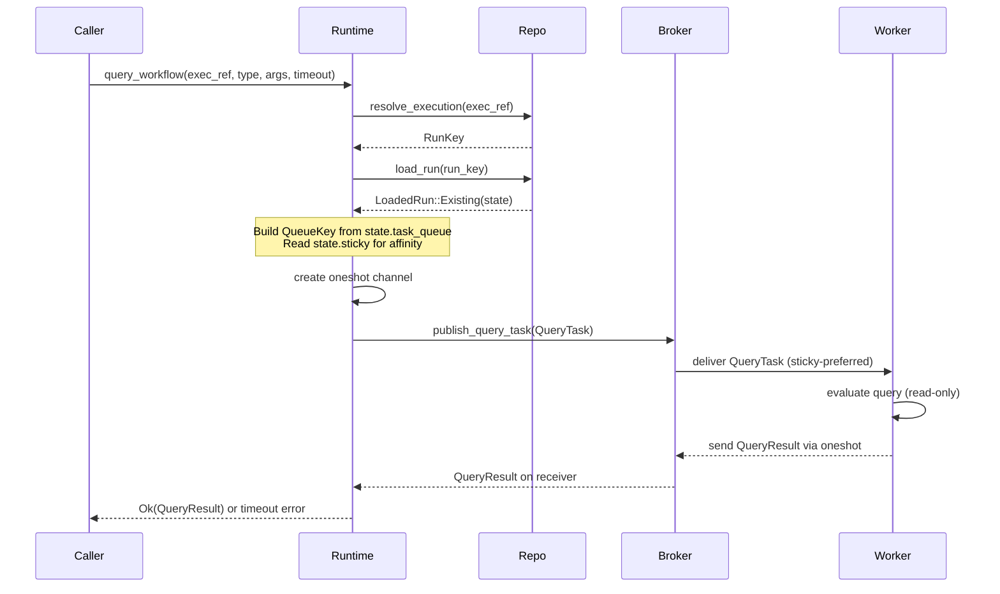

# Design Document: Query Dispatch

## Overview

Query dispatch is a runtime-only request-response mechanism that lets callers inspect workflow state without modifying it. Queries bypass the kernel entirely — they produce no history events, no transitions, and no dispatch ops.

The flow is:

1. Caller invokes `runtime.query_workflow(execution_ref, query_type, query_args, timeout)`.
2. Runtime resolves `ExecutionRef → RunKey` via the repository.
3. Runtime loads the run state to obtain the task queue and sticky affinity.
4. Runtime creates a `QueryTask` with a oneshot response channel.
5. Runtime publishes the `QueryTask` to the broker (sticky-preferred when available).
6. Worker receives the `QueryTask`, evaluates the query, sends the result through the channel.
7. Runtime awaits the channel with timeout, returns the result to the caller.

Query tasks are transient: not deduplicated, not persisted to backlog, not swept on restart, and not recorded in history.

## Architecture



### Design Decisions

**Separate query channel on the broker (Option A).** Query tasks live in a dedicated `query_ready` queue inside `BrokerState`, separate from `sticky_ready` and `general_ready`. This avoids contaminating the WFT dedup set and backlog lifecycle. The broker gets two new methods: `publish_query_task` and `poll_query_task`.

**Separate query Notify.** The broker uses a dedicated `query_wake: Arc<Notify>` for query task wakeups, separate from the existing `wake` used for workflow tasks. This prevents query publications from causing spurious wakeups on workflow-task long-polls and vice versa.

**No enum wrapper on the poll path.** Rather than unifying WFT and query delivery behind a discriminated enum, the worker poll layer calls `poll_query_task` separately. This keeps the existing `poll_workflow_task` return type unchanged and avoids complexity in the broker state machine.

**Oneshot channel per query.** Each query dispatch creates a fresh `tokio::sync::oneshot` channel. The sender travels with the `QueryTask`; the receiver is held by the runtime's `query_workflow` future. On timeout, the receiver is dropped, and any late send by the worker fails silently.

**Sticky query routing: skip, don't promote.** When a query task has `sticky_preferred = Some(worker)` and the polling worker does not match, the broker skips that task (it stays in the queue for the matching worker). Unlike workflow tasks, there is no sticky-to-general promotion for queries — queries are short-lived and the caller's timeout handles the case where the sticky worker is unavailable.

**Closed execution resolution requires run_id.** The current `resolve_execution` contract returns only the current open run when `run_id` is `None`. Querying a closed execution requires the caller to provide the specific `run_id` in the `ExecutionRef`. The runtime does not reject queries to closed runs at the dispatch level — it dispatches normally and lets the timeout handle the case where no worker has the state cached.

**No-mutation contract scoped to transitions.** Query dispatch does not produce transitions, history events, or dispatch ops. Storage-side housekeeping (such as `clear_expired_sticky_if_needed` during `load_run`) is not considered a query mutation — it is a storage implementation detail that happens on any read path.

## Components and Interfaces

### New Types (`tokeira-runtime`)

```rust
/// A query dispatched to a worker for evaluation.
pub struct QueryTask {
    /// Durable storage key for the target run.
    pub run_key: RunKey,
    /// Query type name (maps to a handler on the worker).
    pub query_type: String,
    /// Serialized query arguments.
    pub query_args: Payloads,
    /// Task queue for routing to compatible workers.
    pub queue: QueueKey,
    /// Worker with cached state, if sticky affinity
    /// is active and not expired.
    pub sticky_preferred: Option<WorkerIdentity>,
    /// Channel for the worker to send the result.
    pub response_tx: tokio::sync::oneshot::Sender<QueryResult>,
}

/// Result of a query evaluation by a worker.
pub enum QueryResult {
    /// Query succeeded with a serialized result payload.
    Completed { result: Payloads },
    /// Query evaluation failed with an error message.
    Failed { message: String },
}
```

### Broker Changes (`InMemoryBroker`)

Add a `query_ready` field to `BrokerState`:

```rust
struct BrokerState {
    sticky_ready: HashMap<QueueKey, VecDeque<TimestampedWorkflowTask>>,
    general_ready: HashMap<QueueKey, VecDeque<TimestampedWorkflowTask>>,
    enqueued: HashSet<(RunKey, LogicalTaskSeq)>,
    waiter_counts: HashMap<QueueKey, usize>,
    // NEW: transient query tasks, no dedup
    query_ready: HashMap<QueueKey, VecDeque<QueryTask>>,
    query_waiter_counts: HashMap<QueueKey, usize>,
}
```

New methods on `InMemoryBroker`:

```rust
impl InMemoryBroker {
    /// Publish a query task for delivery.
    ///
    /// No deduplication — each query is unique.
    /// No backlog — query tasks are transient.
    /// Wakes query pollers via `query_wake` (separate
    /// from the workflow-task `wake` notifier).
    pub async fn publish_query_task(
        &self,
        task: QueryTask,
    );

    /// Long-poll for a query task on `queue`.
    ///
    /// Sticky-preferred tasks matching `worker` are
    /// returned first. Non-matching sticky tasks are
    /// skipped (not promoted or taken by other pollers).
    /// Uses `query_wake` for notifications.
    pub async fn poll_query_task(
        &self,
        queue: &QueueKey,
        worker: &WorkerIdentity,
        wait_for: Duration,
    ) -> Option<QueryTask>;
}
```

The `InMemoryBroker` struct gains a `query_wake: Arc<Notify>` field alongside the existing `wake`, ensuring query publications do not cause spurious wakeups on workflow-task polls.
```

### Runtime Method (`TokeiraRuntime`)

```rust
impl<R: RunRepository + 'static> TokeiraRuntime<R> {
    /// Dispatch a read-only query to a workflow execution.
    ///
    /// Resolves the execution, builds a QueryTask with
    /// sticky affinity, publishes it to the broker, and
    /// awaits the response channel with timeout.
    pub async fn query_workflow(
        &self,
        execution: ExecutionRef,
        query_type: String,
        query_args: Payloads,
        timeout: Duration,
    ) -> Result<QueryResult>;
}
```

Implementation sketch:

1. `resolve_execution(&execution)` → `RunKey` (or error).
2. `load_run(run_key)` → `WorkflowState` (or error if `Absent`).
3. Build `QueueKey` from `state.task_queue`, `state.namespace_id`, `state.deployment`, `state.build_id`, `TaskKind::Workflow`.
4. Read `state.sticky` — if `Some(affinity)` and `affinity.expires_at > now`, set `sticky_preferred = Some(affinity.worker_identity)`.
5. Create `oneshot::channel()`.
6. Build `QueryTask { run_key, query_type, query_args, queue, sticky_preferred, response_tx: tx }`.
7. `broker.publish_query_task(task)`.
8. `tokio::time::timeout(timeout, rx).await` → map to `Result<QueryResult>`.

### Interactions with Existing Systems

| System | Interaction |
|---|---|
| Kernel | None. Queries bypass the kernel entirely. |
| Lanes | None. No `Command` is submitted. |
| History | None. No events are appended. |
| Backlog / Grace Scanner | None. Query tasks are not persisted. |
| Sweeper | None. Query tasks are not recovered. |
| Dedup set (`enqueued`) | None. Query tasks do not enter the dedup set. |

## Data Models

No new durable state. Query dispatch is entirely in-memory.

The only new data structures are `QueryTask` and `QueryResult`, both transient. `QueryTask` lives in the broker's `query_ready` map until polled. `QueryResult` travels through a oneshot channel and is never persisted.

The `BrokerState` struct gains one new field (`query_ready: HashMap<QueueKey, VecDeque<QueryTask>>`) and one waiter counter (`query_waiter_counts`). These are not serialized or persisted.

## Correctness Properties

*A property is a characteristic or behavior that should hold true across all valid executions of a system — essentially, a formal statement about what the system should do. Properties serve as the bridge between human-readable specifications and machine-verifiable correctness guarantees.*


### Property 1: Query dispatch produces no transitions

*For any* valid query dispatch (resolved or timed-out), no `Command` is submitted to any lane, no `Transition` is committed, no history events are appended, and no dispatch ops are produced. The run's `transition_seq` and `last_event_id` are unchanged. Storage-side housekeeping (such as expired sticky cleanup during `load_run`) is excluded from this property — it occurs on any read path and is not query-specific.

**Validates: Requirements 1.4, 1.5, 5.3, 7.1**

### Property 2: QueryTask carries correct metadata from run state

*For any* query dispatch to a run with known state, the resulting `QueryTask` SHALL carry the same `run_key` as the resolved key, the caller-provided `query_type` and `query_args`, and a `QueueKey` constructed from the run's `namespace_id`, `task_queue`, `TaskKind::Workflow`, `deployment`, and `build_id`.

**Validates: Requirements 2.1, 2.2**

### Property 3: Sticky affinity is correctly reflected on QueryTask

*For any* query dispatch, if the target run has a `StickyAffinity` whose `expires_at` is in the future, the `QueryTask.sticky_preferred` SHALL equal `Some(affinity.worker_identity)`. If the run has no sticky affinity or the affinity has expired, `sticky_preferred` SHALL be `None`.

**Validates: Requirements 3.1, 3.2, 3.3**

### Property 4: Query result round-trip

*For any* `QueryResult` sent by a worker through the oneshot channel before the timeout expires, the caller SHALL receive that exact `QueryResult` — `Completed { result }` or `Failed { message }` — without modification.

**Validates: Requirements 4.3, 4.4, 4.5**

### Property 5: Timeout enforcement

*For any* query dispatch where no response arrives on the oneshot channel within the caller-provided timeout duration, the runtime SHALL return a timeout error. The timeout is measured from when the `QueryTask` is published to the broker.

**Validates: Requirements 5.1, 5.2, 8.2**

### Property 6: Concurrent queries are independent

*For any* set of N concurrent `query_workflow` calls targeting the same `RunKey`, each call SHALL have its own independent oneshot channel and timeout. Completing, failing, or timing out one query SHALL NOT affect any other concurrent query to the same run.

**Validates: Requirements 6.1, 6.2, 6.3**

### Property 7: Query tasks bypass dedup

*For any* sequence of N query tasks published to the broker for the same `RunKey`, all N tasks SHALL be delivered to pollers. The broker's `enqueued` dedup set SHALL NOT contain entries for query tasks, and no query task SHALL be silently suppressed.

**Validates: Requirements 6.4, 7.2**

### Property 8: Queries to closed executions are not rejected at dispatch

*For any* `ExecutionRef` with a specific `run_id` that resolves to a run in a terminal `ExecutionStatus` (Completed, Failed, Cancelled, Terminated, ContinuedAsNew, TimedOut), the runtime SHALL still create and publish a `QueryTask` to the broker without returning an error at the dispatch level. Note: querying a closed execution by workflow_id alone (without `run_id`) will fail at resolution because `resolve_execution` only returns the current open run when `run_id` is `None`.

**Validates: Requirements 8.1, 8.3, 8.4**

## Error Handling

| Condition | Behavior |
|---|---|
| `ExecutionRef` not found | `resolve_execution` returns `None` → `query_workflow` returns `anyhow!("execution not found")` |
| `load_run` returns `Absent` | `query_workflow` returns an error (run was deleted between resolve and load) |
| `load_run` I/O failure | Error propagated to caller |
| Broker publish failure | Error propagated to caller (should not happen with in-memory broker) |
| Oneshot receiver closed (worker crashed or dropped sender) | `rx.await` returns `Err(RecvError)` → mapped to a channel-closed error |
| Timeout expires | `tokio::time::timeout` returns `Err(Elapsed)` → mapped to a timeout error |
| Worker query evaluation failure | Worker sends `QueryResult::Failed { message }` → propagated to caller |

All error paths are non-mutating: no run state, history, or broker dedup state is modified.

## Testing Strategy

### Property-Based Tests (proptest)

Property-based tests validate the correctness properties above. Each test runs a minimum of 100 iterations with randomly generated inputs.

- **Library:** `proptest` (already used in `broker.rs` tests)
- **Minimum iterations:** 100 per property
- **Tag format:** `Feature: runtime-query-dispatch, Property N: <title>`

Generated inputs include:
- Random `ExecutionRef` values (namespace, workflow_id, optional run_id)
- Random query type strings and `Payloads`
- Random `StickyAffinity` with varying expiry times (past, future, None)
- Random `ExecutionStatus` values for closed-execution tests
- Random timeout durations
- Random concurrency levels (1–16 concurrent queries)

### Unit Tests (example-based)

- `query_workflow` returns error when `ExecutionRef` cannot be resolved (Req 1.3)
- `QueryTask` struct does not have a `logical_seq` field (Req 2.4, compile-time)
- Oneshot channel is dropped on timeout; late send fails silently (Req 5.4)
- `query_workflow` accepts a per-call timeout parameter (Req 5.5, compile-time)

### Integration Tests

- End-to-end: runtime dispatches query → broker delivers to mock worker → worker sends result → caller receives it (Req 4.1, 4.2)
- Worker query handler cannot produce workflow commands (Req 7.5)
- Grace scanner does not persist query tasks to backlog (Req 7.3)
- Sweeper does not recover query tasks after restart (Req 7.4)
