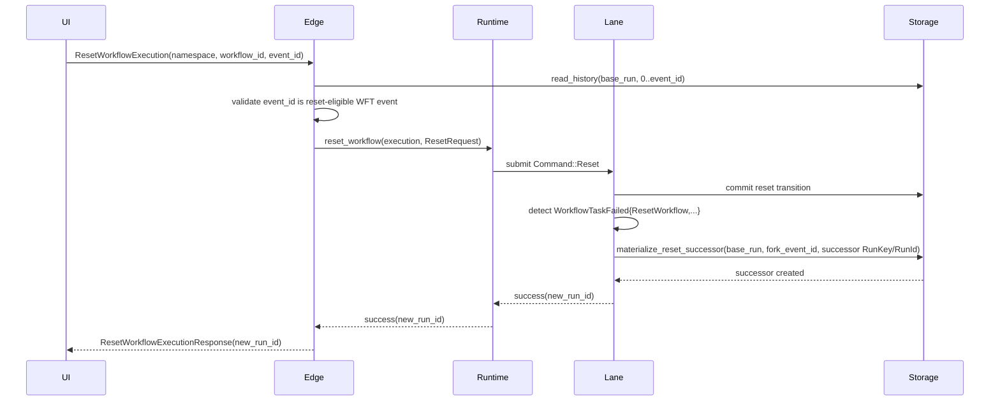

# Design: Runtime Reset Replay Support

## Overview

Reset already commits correctly in the kernel. The missing piece is what happens after commit.

The minimal design is:

1. edge validates the requested fork event against committed history
2. edge calls a new runtime `reset_workflow(...)`
3. runtime chooses the successor `RunKey` and `RunId` before reset submission
4. runtime submits `Command::Reset`
5. lane post-commit detects the committed reset close by reading the emitted `WorkflowTaskFailed { cause: ResetWorkflow, ... }`
6. runtime/storage materialize a successor run from the base run's history prefix up to `fork_event_id`
7. runtime returns the successor `run_id` only after that materialization completes

This deliberately avoids fabricating successor state from `WorkflowState`. The authoritative input is the committed history prefix.

## Architecture



## Key Decisions

### 0. State reconstruction uses kernel history replay, not state snapshots

The current storage model persists only the final `WorkflowState` per run — there are no per-transition or per-event state snapshots. Reconstructing state at an arbitrary `fork_event_id` requires replaying the history prefix through the kernel.

The kernel is pure and deterministic. A new `replay_history_prefix(ctx: ReplayContext, events: &[HistoryEvent]) -> Result<WorkflowState>` function processes events sequentially, applying each event's effect to reconstruct the state at any point.

The `ReplayContext` carries non-historical envelope fields that are not present in history events:

```rust
pub struct ReplayContext {
    pub run_key: RunKey,
    pub namespace_id: NamespaceId,
    pub workflow_id: WorkflowId,
    pub run_id: RunId,
    pub deployment: Option<DeploymentId>,
    pub build_id: Option<BuildId>,
    pub parent_run_key: Option<RunKey>,
    pub parent_workflow_id: Option<WorkflowId>,
    pub first_run_started_at: Option<OffsetDateTime>,
}
```

These are supplied by the caller (storage materialization) from the predecessor run's metadata and the chosen successor identity. The replay function initializes state from `WorkflowExecutionStarted` for the history-derivable fields and from `ReplayContext` for the envelope fields.

The output `WorkflowState` has `transition_seq = TransitionSeq::ZERO` because history does not encode transition boundaries — the successor starts with a fresh OCC fence. `last_event_id` is set to the last event in the prefix.

Non-historical state fields are set to reset defaults because they are mutated by kernel operations (PauseActivity, UnpauseActivity, ResetActivity, sticky affinity from WFT start) that do not emit history events:

| Field | Reset default | Rationale |
|---|---|---|
| `sticky` | `None` | Set from WFT start state, not a history event |
| `wft_stamp` | `0` | Monotonic stamp, reset on new run |
| `ActivityState.pause_info` | `None` | Operational action per activity, no history event |
| `ActivityState.stamp` | `0` | Monotonic stamp per activity, no history event |

The following fields ARE represented in history and must be reconstructed from events, not defaulted:

| Field | History event source |
|---|---|
| `pause_info` | `WorkflowExecutionPaused` / `WorkflowExecutionUnpaused` |
| `versioning_override` | `WorkflowExecutionOptionsUpdated` |
| `completion_callbacks` | `WorkflowExecutionOptionsUpdated` |

This means the replay function produces *authoritative mutable state* (activities, timers, children, WFT lifecycle, status, pause state, versioning) but not *operational delivery state* (sticky affinity, delivery stamps). This is correct for reset — the successor is a fresh run that will re-establish delivery state through normal execution.

### 1. Detection is based on committed history, not terminal status alone

`ExecutionStatus::Terminated` is not enough to distinguish reset from ordinary terminate. The lane must inspect the committed `WorkflowTaskFailed` event and require:

- `failure_cause == ResetWorkflow`
- `base_run_id.is_some()`
- `new_run_id.is_some()`
- `fork_event_id.is_some()`

That keeps the orchestration tied to the authoritative event contract already defined by the kernel.

### 2. Successor creation uses storage materialization, not a synthetic `StartRequest`

Continue-As-New can reconstruct a successor from a dedicated close event because the successor starts fresh. Reset cannot. Reset must preserve a historical prefix. That means the runtime needs a storage primitive that can materialize the successor from the committed base history rather than trying to rebuild it from `WorkflowState`.

### 3. Reset completion is synchronous

The edge API requires that `ResetWorkflowExecution` return a real successor `run_id`, not a promise of eventual background work. So unlike the existing detached Continue-As-New branch, reset successor creation must be awaited before success is returned to the caller. The predecessor reset transition still commits first and remains authoritative if successor creation later fails.

### 4. Runtime owns successor `RunKey` — derived deterministically from `new_run_id`

Kernel reset metadata carries `new_run_id` but not `RunKey`. The successor `RunKey` is derived deterministically from `new_run_id`: `RunKey(new_run_id.0)`. This means:

- The runtime can derive the `RunKey` before reset submission
- If the process crashes between reset commit and successor materialization, recovery can re-derive the same `RunKey` from the committed `new_run_id` in history
- No durable side table is needed to persist the `RunKey` separately

This is safe because `RunKey` is `RunKey(Uuid)` and `RunId` is `RunId(Uuid)` — using the same UUID for both is a valid identity assignment.

### 5. Edge validation stays shallow and cheap

The edge does not replay history. It only verifies that the requested `workflow_task_finish_event_id` names a reset-eligible event kind in committed history before asking the runtime to reset.

## Proposed Interfaces

### Runtime

Add a first-class method:

```rust
pub async fn reset_workflow(
    &self,
    execution: ExecutionRef,
    request: ResetRequest,
) -> Result<ResetWorkflowResult>;
```

The edge-side `WorkflowRuntimeApi` trait gets a matching method so `WorkflowService` can depend on it cleanly.

Suggested result shape:

```rust
pub struct ResetWorkflowResult {
    pub successor_run_key: RunKey,
    pub successor_run_id: RunId,
}
```

### Storage

Add a narrow materialization method to `RunRepository`:

```rust
async fn materialize_reset_successor(
    &self,
    base_run_key: RunKey,
    fork_event_id: i64,
    successor_run_key: RunKey,
    successor_run_id: RunId,
) -> Result<()>;
```

This method is intentionally specific to reset. It avoids over-designing a general replay/import API.

Expected behavior:

- copy the committed history prefix `[1, fork_event_id]` from `base_run_key`
- create a new durable run at `successor_run_key`
- associate it with `successor_run_id`
- call `kernel.replay_history_prefix(replay_ctx, &copied_events)` to derive the successor `WorkflowState`
- the `ReplayContext` carries `successor_run_key`, `successor_run_id`, and envelope fields from the predecessor run's metadata
- the derived state has `transition_seq = TransitionSeq::ZERO` (fresh OCC fence) and `last_event_id` matching the fork point
- persist the derived state as the successor's durable state
- update the current-execution mapping for `(namespace_id, workflow_id)`
- make it visible to normal load/resolve/history reads

### Lane post-commit hook

Extend the existing post-commit orchestration branch in `run_activation`, next to Continue-As-New detection, but do not detach the reset work as fire-and-forget:

```rust
if new_state.status == ExecutionStatus::Terminated {
    if let Some((new_run_id, fork_event_id, successor_run_key)) =
        extract_reset_metadata_and_runtime_context(&history_events, &command)
    {
        repo.materialize_reset_successor(
            message.run_key,
            fork_event_id,
            successor_run_key,
            new_run_id,
        ).await?;
    }
}
```

The critical part is the contract:

- detection still relies on committed history
- successor `RunKey` comes from runtime-owned context
- reset completion is awaited before the API returns success

## Edge Behavior

`WorkflowService::reset_workflow_execution(...)` should:

1. resolve the target execution
2. read committed history
3. validate that `workflow_task_finish_event_id` points at one of:
   - `WorkflowTaskCompleted`
   - `WorkflowTaskFailed`
   - `WorkflowTaskTimedOut`
   - `WorkflowTaskStarted`
4. construct a `ResetRequest`
5. call runtime `reset_workflow(...)`
6. return the `new_run_id` only after the successor is durably queryable

## Why this is the minimum viable change

Without the storage materialization primitive, reset can only start a fresh run from the original `WorkflowExecutionStarted` contract, which is not reset replay.

Without the runtime reset entry point, edge would have to bypass the runtime and talk directly to lanes or storage, which breaks the layering already used everywhere else.

Without explicit `RunKey` ownership, successor storage identity remains ambiguous.

Without synchronous completion, the API can return a `run_id` for a successor that does not yet exist.

Without history-based detection, the lane cannot distinguish reset termination from ordinary terminate.
