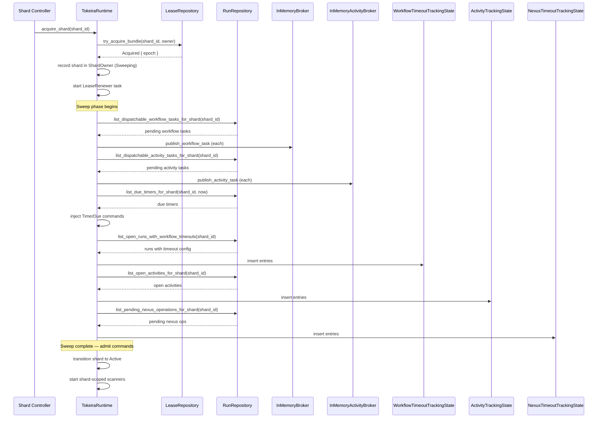
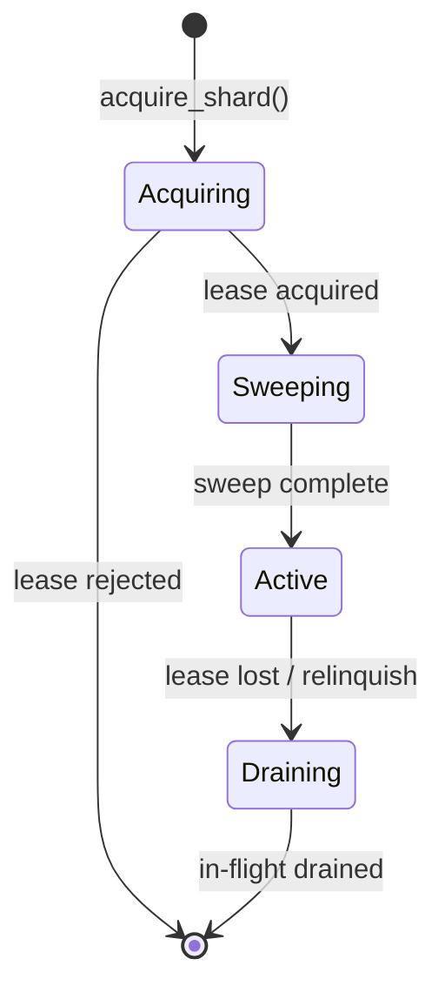

# Design Document: Sweeper and Recovery

## Overview

This design covers the sweeper and recovery subsystem for the Tokeira runtime. The sweeper is a one-time scan executed after shard acquisition that reconstructs volatile delivery state (broker queues, timeout tracking maps) from authoritative durable storage. Combined with epoch-fenced shard leases, it ensures no dispatchable work is lost across failovers while preventing stale owners from committing.

The feature spans five areas:

1. **Shard lifecycle** — lease acquisition with epoch fencing, periodic renewal, and graceful relinquish/drain.
2. **Post-failover reconstruction** — sweeping `workflow_hot`, `activity_state`, and `timer_bucket` to republish pending tasks and due timers.
3. **Timeout tracking reconstruction** — rebuilding `ActivityTrackingState`, `WorkflowTimeoutTrackingState`, and `NexusTimeoutTrackingState` from authoritative storage.
4. **Shard-scoped scanning** — restricting all background scanners (timer, workflow timeout, activity timeout, Nexus timeout) to runs belonging to owned shards.
5. **InMemoryStore shard awareness** — adding shard-to-run mapping and shard-filtered query variants to the development store.

### Design Rationale

The current runtime (`TokeiraRuntime`) operates as if it owns all runs globally. Background scanners scan the entire store, brokers hold tasks for all shards, and there is no concept of shard ownership gating command admission. This design introduces shard-scoped ownership as the partitioning boundary for all volatile state, following the architecture laid out in [090-failover-and-recovery](../../../docs/architecture/090-failover-and-recovery.md).

Key decisions:

- **One-time sweep, not continuous**: The sweeper runs once per shard acquisition. Ongoing delivery is handled by the existing publish-on-commit path. This keeps the sweeper simple and avoids duplicate work.
- **Demand-loaded actors**: After sweep, run actors are not eagerly rehydrated. They load on demand when a command or due timer targets them, respecting DSQL connection pressure.
- **Client-side shard filtering for timeout scanners**: The in-memory tracking states (`WorkflowTimeoutTrackingState`, `ActivityTrackingState`, `NexusTimeoutTrackingState`) already hold entries keyed by `RunKey`. Adding a `ShardId` field to each entry and filtering during snapshot iteration is simpler than storage-side filtering, since these are volatile structures rebuilt by the sweeper.
- **Storage-side shard filtering for durable queries**: The `RunRepository` gains shard-filtered variants of `list_dispatchable_workflow_tasks`, `list_dispatchable_activity_tasks`, `list_due_timers`, and new sweep queries. This keeps sweep I/O bounded to the acquired shard.
- **Epoch on tokens, not on every field**: Task tokens (`WorkflowTaskToken`, `ActivityTaskToken`) already carry a `shard_epoch` field. The runtime sets it at task-start time and validates it at completion time.
- **Epoch on commit_transition**: The `RunRepository::commit_transition` signature is extended to accept a `ShardEpoch` parameter. The storage layer validates the epoch against the shard's current lease epoch and rejects mismatches with `CommitResult::Conflict`. This is the storage-side backstop that prevents stale owners from mutating state after failover.
- **Durable activity timestamps**: The kernel's `ActivityState` is extended with `scheduled_at` and `started_at` fields so the sweeper can reconstruct `ActivityTrackingState` without replaying history. These are populated from the `happened_at` timestamp of the corresponding history events.
- **Scanners start after sweep**: Shard-scoped background scanners (timer, workflow timeout, activity timeout, Nexus timeout) are started only after the shard transitions to Active. This prevents scanners from injecting commands before the sweep has reconstructed the volatile state they depend on. The Lease_Renewer is the only background task started before sweep.

## Architecture



### Shard State Machine



Each shard tracked by the runtime transitions through these states:
- **Acquiring**: Lease acquisition in progress.
- **Sweeping**: Lease held, sweeper running, commands not yet admitted.
- **Active**: Sweep complete, commands admitted, scanners running.
- **Draining**: Lease lost, no new commands accepted, in-flight work completing.

## Components and Interfaces

### ShardOwner

New struct in `tokeira-runtime` that tracks owned shards and their epochs.

```rust
/// Tracks which shards the current runtime node owns.
pub struct ShardOwner {
    /// Map from shard to (epoch, state).
    shards: HashMap<ShardId, OwnedShard>,
}

pub struct OwnedShard {
    pub epoch: ShardEpoch,
    pub state: ShardState,
    /// Cancellation token for shard-scoped background tasks.
    pub cancel: CancellationToken,
}

pub enum ShardState {
    Sweeping,
    Active,
    Draining,
}
```

Methods:
- `owns(&self, shard_id: ShardId) -> Option<ShardEpoch>` — returns epoch if shard is owned and Active.
- `is_active(&self, shard_id: ShardId) -> bool` — true only in Active state.
- `record_acquired(&mut self, shard_id: ShardId, epoch: ShardEpoch) -> CancellationToken`
- `mark_active(&mut self, shard_id: ShardId)`
- `mark_draining(&mut self, shard_id: ShardId)`
- `remove(&mut self, shard_id: ShardId)`

### ShardSweeper

One-time scan logic, implemented as an async function (not a long-lived task).

```rust
pub async fn sweep_shard<R>(
    shard_id: ShardId,
    epoch: ShardEpoch,
    repo: &R,
    broker: &InMemoryBroker,
    activity_broker: &InMemoryActivityBroker,
    lanes: &[LaneHandle],
    lane_count: usize,
    workflow_timeout_tracking: &WorkflowTimeoutTrackingState,
    activity_tracking: &ActivityTrackingState,
    nexus_timeout_tracking: &NexusTimeoutTrackingState,
) -> Result<SweepResult>
where
    R: RunRepository,
```

Returns `SweepResult` with counts of reconstructed items for observability.

### RunRepository Extensions

New shard-filtered query methods added to the `RunRepository` trait (six methods total — see api.rs for the full set):

```rust
async fn list_dispatchable_workflow_tasks_for_shard(
    &self, shard_id: ShardId, limit: usize,
) -> Result<Vec<DispatchableWorkflowTask>>;
// ... plus five more shard-filtered methods
```

#### commit_transition Epoch Extension

The existing `commit_transition` signature is extended to carry a `ShardEpoch`:

```rust
async fn commit_transition(
    &self,
    run_key: RunKey,
    transition: Transition,
    epoch: ShardEpoch,
) -> Result<CommitResult>;
```

The storage layer validates `epoch` against the shard's current lease epoch. On mismatch, it returns `CommitResult::Conflict`. The `InMemoryStore` looks up the run's shard via `run_shard_map`, then checks `bundle_leases[shard_id].epoch == epoch`.

For backward compatibility, existing tests that don't use shards can pass `ShardEpoch::ZERO`, and the store skips epoch validation when `epoch == ShardEpoch::ZERO`.

### Durable ActivityState Timestamp Extension

The kernel's `ActivityState` is extended with two timestamp fields:

```rust
pub struct ActivityState {
    // ... existing fields ...
    /// When the activity was originally scheduled.
    /// Set by the kernel from the `happened_at` of the
    /// `ActivityTaskScheduled` history event.
    pub scheduled_at: OffsetDateTime,
    /// When the activity was started by a worker (None
    /// if not yet started). Set by the runtime during
    /// the activity-start OCC upsert (activity starts
    /// are runtime-side, not kernel events).
    pub started_at: Option<OffsetDateTime>,
}
```

Ownership: `scheduled_at` is set by the kernel when processing `ScheduleActivity`. `started_at` is set by the runtime in `start_activity_task` (the activity-start OCC upsert that bumps `stamp`). This matches the existing codebase where activity starts are runtime-side operations, not kernel history events.

On sweep recovery, `last_heartbeat_at` defaults to `None` (falls back to `started_at` for heartbeat timeout evaluation — may produce false-positive heartbeat timeouts if the activity had been heartbeating regularly before failover but the elapsed time since `started_at` exceeds the heartbeat timeout; this is an accepted trade-off since suppressing heartbeat evaluation entirely would leave genuinely unresponsive activities undetected) and `cancel_requested` defaults to `false` (re-established on next worker heartbeat).

### Durable PendingNexusOperation Extension

The kernel's `PendingNexusOperation` is extended with timeout and timestamp fields:

```rust
pub struct PendingNexusOperation {
    // ... existing fields ...
    /// Maximum time from schedule to completion.
    pub schedule_to_close_timeout: Option<Duration>,
    /// When the operation was scheduled. Set from the
    /// `happened_at` of the `NexusOperationScheduled`
    /// history event.
    pub scheduled_at: OffsetDateTime,
}
```

These fields are set by the kernel when processing `ScheduleNexusOperation`. They enable the sweeper to reconstruct `NexusTimeoutTrackingState` entries without replaying history.

### Sweep Entry Types

New types returned by sweep queries, carrying just enough data to reconstruct tracking state:

```rust
pub struct WorkflowTimeoutSweepEntry {
    pub run_key: RunKey,
    pub workflow_execution_timeout: Option<Duration>,
    pub workflow_run_timeout: Option<Duration>,
    pub started_at: OffsetDateTime,
    pub first_run_started_at: Option<OffsetDateTime>,
    pub has_retry_policy: bool,
}

pub struct ActivitySweepEntry {
    pub run_key: RunKey,
    pub activity_id: String,
    pub schedule_event_id: i64,
    pub attempt: u32,
    pub original_scheduled_at: OffsetDateTime,
    pub started_at: Option<OffsetDateTime>,
    pub schedule_to_close_timeout: Option<Duration>,
    pub schedule_to_start_timeout: Option<Duration>,
    pub start_to_close_timeout: Option<Duration>,
    pub heartbeat_timeout: Option<Duration>,
}

pub struct NexusSweepEntry {
    pub run_key: RunKey,
    pub operation_id: String,
    pub scheduled_event_id: i64,
    pub schedule_to_close_timeout: Duration,
    pub scheduled_at: OffsetDateTime,
}
```

### LeaseRenewer

Background task per shard that periodically renews the lease:

```rust
pub async fn run_lease_renewer(
    repo: Arc<dyn LeaseRepository>,
    shard_id: ShardId,
    owner: String,
    epoch: ShardEpoch,
    interval: tokio::time::Duration,
    max_retries: u32,
    cancel: CancellationToken,
    on_lost: tokio::sync::oneshot::Sender<()>,
)
```

Uses `DbClass::Control` permits. On `LeaseOutcome::Rejected`, signals `on_lost` so the runtime can begin draining.

### Shard-Scoped Timeout Tracking

Each tracking entry gains a `shard_id: ShardId` field:

- `WorkflowTimeoutEntry` → add `shard_id: ShardId`
- `ActivityTrackingEntry` → add `shard_id: ShardId`
- `NexusTimeoutEntry` → add `shard_id: ShardId`

Each tracking state gains:
- `remove_all_for_shard(&self, shard_id: ShardId)` — bulk removal on shard relinquish.
- `snapshot_for_shard(&self, shard_id: ShardId) -> Vec<Entry>` — filtered snapshot for shard-scoped scanning.

### Shard-Scoped Timer Scanner

The timer scanner currently calls `repo.list_due_timers(now, limit)` globally. Two options:

1. **Storage-side filtering**: Use `list_due_timers_for_shard(shard_id, now, limit)` — one scan per owned shard.
2. **Client-side filtering**: Fetch globally, filter by shard ownership.

Design choice: **Storage-side filtering** (option 1). The timer scanner spawns one scan loop per owned shard, or iterates over owned shards in each scan cycle. This avoids loading timers for unowned shards.

### TokeiraRuntime Changes

The `TokeiraRuntime` struct gains:
- `shard_owner: Arc<RwLock<ShardOwner>>` — shared shard ownership state.
- `owner_identity: String` — stable node identity for lease operations.
- `acquire_shard(&self, shard_id: ShardId) -> Result<ShardEpoch>` — public method to acquire a shard.
- `relinquish_shard(&self, shard_id: ShardId)` — public method to drain and release.

Command admission (`submit`) gains a shard ownership check:
```rust
async fn submit(&self, run_key: RunKey, command: Command) -> Result<CommitResult> {
    let shard_id = shard_for(run_key); // deterministic mapping
    let shard_owner = self.shard_owner.read().await;
    if !shard_owner.is_active(shard_id) {
        return Err(anyhow!("shard not active: {shard_id:?}"));
    }
    let lane = self.pick_lane(run_key);
    lane.submit(run_key, command).await
}
```

### Epoch Fencing on Task Tokens

At workflow task start (`start_polled_workflow_task`):
```rust
let shard_id = shard_for(run_key);
let epoch = self.shard_owner.read().await
    .owns(shard_id)
    .ok_or_else(|| anyhow!("shard not owned"))?;
token.shard_epoch = epoch;
```

At activity task start (`start_activity_task`): same pattern.

At completion validation (`validate_activity_token`, `complete_workflow_task`):
```rust
let shard_id = shard_for(token.run_key);
let current_epoch = self.shard_owner.read().await
    .epoch_of(shard_id)
    .ok_or_else(|| anyhow!("shard not owned"))?;
if token.shard_epoch != current_epoch {
    return Err(anyhow!("stale shard epoch"));
}
```

Note: completion validation uses `epoch_of()` (returns epoch in any state including Draining), not `owns()` (returns epoch only when Active). This allows in-flight completions to succeed during the Draining phase, consistent with Requirement 15.3. Command admission uses `is_active()` to gate new work.

### Shard-to-Run Mapping

A deterministic function maps `RunKey` to `ShardId`:

```rust
pub fn shard_for(run_key: RunKey, shard_count: u32) -> ShardId {
    ShardId((run_key.0.as_u128() as u32) % shard_count)
}
```

This is consistent, stateless, and requires no storage lookup.


## Data Models

### ShardOwner State

```
ShardOwner
├── shards: HashMap<ShardId, OwnedShard>
│   ├── epoch: ShardEpoch
│   ├── state: ShardState { Sweeping | Active | Draining }
│   └── cancel: CancellationToken
└── shard_count: u32
```

### InMemoryStore Shard Extensions

The `StoreState` gains:

```rust
/// Mapping from RunKey to assigned ShardId.
run_shard_map: HashMap<RunKey, ShardId>,
/// Total shard count for deterministic assignment.
shard_count: u32,
```

On `commit_transition` for a new run (transition_seq == 0), the store computes `shard_for(run_key, shard_count)` and inserts into `run_shard_map`.

Shard-filtered query implementations filter by looking up each candidate's shard in `run_shard_map`.

### Sweep Result

```rust
pub struct SweepResult {
    pub workflow_tasks_republished: usize,
    pub activity_tasks_republished: usize,
    pub due_timers_injected: usize,
    pub workflow_timeout_entries_reconstructed: usize,
    pub activity_tracking_entries_reconstructed: usize,
    pub nexus_timeout_entries_reconstructed: usize,
    pub expired_sticky_claims_cleared: usize,
}
```

### Modified Tracking Entry Schemas

```rust
// WorkflowTimeoutEntry (existing + shard_id)
pub struct WorkflowTimeoutEntry {
    pub run_key: RunKey,
    pub shard_id: ShardId,  // NEW
    pub workflow_execution_timeout: Option<Duration>,
    pub workflow_run_timeout: Option<Duration>,
    pub started_at: OffsetDateTime,
    pub first_run_started_at: Option<OffsetDateTime>,
    pub has_retry_policy: bool,
}

// ActivityTrackingEntry (existing + shard_id)
pub struct ActivityTrackingEntry {
    pub run_key: RunKey,
    pub shard_id: ShardId,  // NEW
    pub activity_id: String,
    pub original_scheduled_at: OffsetDateTime,
    pub last_dispatched_at: OffsetDateTime,
    pub started_at: Option<OffsetDateTime>,
    pub last_heartbeat_at: Option<OffsetDateTime>,
    pub cancel_requested: bool,
}

// NexusTimeoutEntry (existing + shard_id)
pub struct NexusTimeoutEntry {
    pub run_key: RunKey,
    pub shard_id: ShardId,  // NEW
    pub operation_id: String,
    pub scheduled_event_id: i64,
    pub schedule_to_close_timeout: Duration,
    pub scheduled_at: OffsetDateTime,
}
```


## Correctness Properties

*A property is a characteristic or behavior that should hold true across all valid executions of a system — essentially, a formal statement about what the system should do. Properties serve as the bridge between human-readable specifications and machine-verifiable correctness guarantees.*

### Property 1: Shard ownership round-trip

*For any* `ShardId` and `ShardEpoch`, if `record_acquired(shard_id, epoch)` is called on a `ShardOwner` followed by `mark_active(shard_id)`, then `owns(shard_id)` SHALL return `Some(epoch)` with the same epoch value. After `record_acquired` alone (shard in `Sweeping` state), `owns(shard_id)` SHALL return `None`, but `epoch_of(shard_id)` SHALL return `Some(epoch)`.

**Validates: Requirements 1.2**

### Property 2: Epoch fencing rejects stale commits

*For any* `ShardId` with a current epoch `E` in storage, a commit attempted with epoch `E' ≠ E` SHALL return a rejection (Conflict), and the durable state SHALL remain unchanged.

**Validates: Requirements 1.5**

### Property 3: Task tokens carry current shard epoch

*For any* workflow task or activity task started on a run belonging to an owned shard with epoch `E`, the resulting `WorkflowTaskToken.shard_epoch` or `ActivityTaskToken.shard_epoch` SHALL equal `E`.

**Validates: Requirements 3.1, 3.2**

### Property 4: Stale epoch completions are rejected

*For any* task completion or failure where `token.shard_epoch ≠ current_epoch` for the run's shard, the runtime SHALL reject the completion and the durable run state SHALL remain unchanged.

**Validates: Requirements 3.3**

### Property 5: Workflow task sweep completeness

*For any* set of runs in a shard where each run has a pending workflow task in the scheduled (not started) state, after `sweep_shard` completes, the `InMemoryBroker` SHALL contain a task for each such run with the correct `QueueKey`.

**Validates: Requirements 4.1, 4.2**

### Property 6: Activity task sweep completeness

*For any* set of dispatchable activity attempts belonging to runs in a shard, after `sweep_shard` completes, the `InMemoryActivityBroker` SHALL contain a task for each such activity with the correct `QueueKey`.

**Validates: Requirements 5.1, 5.2**

### Property 7: Due timer sweep completeness

*For any* set of due timers belonging to runs in a shard, after `sweep_shard` completes, a `Command::TimerDue` SHALL have been submitted to the appropriate lane for each due timer.

**Validates: Requirements 6.1, 6.2**

### Property 8: Expired sticky claims are republished without sticky preference

*For any* run in a shard with an expired sticky claim and a pending workflow task in the scheduled state, after `sweep_shard` completes, the task in the `InMemoryBroker` SHALL have `sticky_preferred = None`.

**Validates: Requirements 7.1, 7.2**

### Property 9: Activity tracking reconstruction fidelity

*For any* open activity in a shard with timeout configuration, after `sweep_shard` completes, `ActivityTrackingState` SHALL contain an entry for that activity with `original_scheduled_at`, `started_at`, and timeout-relevant fields matching the authoritative activity state, such that `evaluate_activity_timeout` can correctly evaluate all configured timeout types.

**Validates: Requirements 8.1, 8.2, 8.3**

### Property 10: Workflow timeout tracking reconstruction fidelity

*For any* open run in a shard with a configured `workflow_execution_timeout` or `workflow_run_timeout`, after `sweep_shard` completes, `WorkflowTimeoutTrackingState` SHALL contain an entry with timeout configuration and start timestamps matching the authoritative run state, such that `evaluate_workflow_timeout` can correctly evaluate the timeout.

**Validates: Requirements 9.1, 9.2, 9.3**

### Property 11: Nexus timeout tracking reconstruction fidelity

*For any* pending Nexus operation in a shard with a configured `schedule_to_close_timeout`, after `sweep_shard` completes, `NexusTimeoutTrackingState` SHALL contain an entry with the operation's timeout and scheduled timestamp matching the authoritative state, such that `evaluate_nexus_timeout` can correctly evaluate the timeout.

**Validates: Requirements 10.1, 10.2, 10.3**

### Property 12: Commands are rejected during sweep phase

*For any* shard in the `Sweeping` state, command submissions for runs in that shard SHALL be rejected. After the sweep completes and the shard transitions to `Active`, command submissions SHALL be accepted.

**Validates: Requirements 11.1, 11.2, 11.4**

### Property 13: Command rejection on lease loss

*For any* shard whose lease has been lost (renewal rejected), all subsequent command submissions for runs in that shard SHALL be rejected.

**Validates: Requirements 2.4, 15.1**

### Property 14: Shard-scoped timeout scanning

*For any* set of timeout tracking entries spanning multiple shards, the workflow timeout scanner, activity timeout scanner, and Nexus timeout scanner SHALL only evaluate entries belonging to shards currently owned by the runtime node.

**Validates: Requirements 13.1, 13.2, 13.3**

### Property 15: Tracking state cleanup on shard relinquish

*For any* shard that is relinquished, all entries for runs in that shard SHALL be removed from `WorkflowTimeoutTrackingState`, `ActivityTrackingState`, and `NexusTimeoutTrackingState`.

**Validates: Requirements 13.4, 15.4**

### Property 16: Deterministic shard assignment in InMemoryStore

*For any* `RunKey`, the `shard_for(run_key, shard_count)` function SHALL always return the same `ShardId`, and the `InMemoryStore` SHALL record this mapping when the run is created.

**Validates: Requirements 14.1, 14.2**

### Property 17: Shard-filtered query correctness in InMemoryStore

*For any* `ShardId` and any set of runs, activities, timers, and Nexus operations distributed across multiple shards, the shard-filtered query variants SHALL return only items belonging to the specified shard and SHALL return all such items (up to the limit).

**Validates: Requirements 14.3, 14.4, 14.5, 14.6**

### Property 18: Timer scanner shard scoping

*For any* set of due timers distributed across multiple shards, the timer scanner SHALL only process timers belonging to shards owned by the current runtime node.

**Validates: Requirements 12.1**

## Error Handling

### Lease Acquisition Failures

- `try_acquire_bundle` returns `Rejected`: Log at info level, do not proceed with recovery. The shard remains unowned by this node.
- `try_acquire_bundle` returns a transient error: Retry with bounded backoff. If retries are exhausted, log at warn level and report the shard as unacquirable.

### Lease Renewal Failures

- `renew_bundle` returns `Rejected`: The lease has been stolen by another node. Immediately transition the shard to `Draining`. Cancel all shard-scoped background tasks. Remove tracking entries. Log at warn level.
- `renew_bundle` returns a transient error: Retry with exponential backoff (capped at the renewal interval). After `max_retries` consecutive failures, treat as lease lost and begin draining.

### Sweep Failures

- Storage query failure during sweep (e.g., `list_dispatchable_workflow_tasks_for_shard` fails): Log at error level, retry the failed query with backoff. If the sweep cannot complete after bounded retries, relinquish the shard rather than operating with incomplete state.
- Broker publication failure during sweep: Log at warn level. The broker is in-memory and should not fail, but if it does (e.g., channel full), retry. This is a transient condition.

### Command Admission Failures

- Command submitted for a shard in `Sweeping` state: Return `Err("shard not active")`. The caller (gRPC handler) should return `UNAVAILABLE` so the client retries.
- Command submitted for a shard in `Draining` state: Same as above.
- Command submitted for an unknown shard: Return `Err("shard not owned")`.

### Epoch Mismatch on Completion

- Task completion with stale `shard_epoch`: Return a clear error indicating epoch mismatch. The worker should discard the result. No state mutation occurs. Log at debug level (this is expected after failover).

### Timer Scanner Errors

- `list_due_timers_for_shard` fails: Log at warn level, skip this scan cycle. The next cycle will retry.
- `TimerDue` command rejected by kernel: Expected (timer may have been canceled). Log at debug level, remove from scan scope.

## Testing Strategy

### Property-Based Testing

This feature is well-suited for property-based testing. The core logic involves:
- Pure state management (`ShardOwner` state transitions)
- Deterministic mapping functions (`shard_for`)
- Data reconstruction with fidelity guarantees (sweep → tracking state)
- Filtering correctness (shard-scoped queries)

**Library**: `proptest` (already used throughout the workspace)

**Configuration**: Minimum 100 iterations per property test.

**Tag format**: `Feature: runtime-sweeper-recovery, Property {N}: {title}`

Each correctness property (1–18) maps to a single property-based test. The generators produce:
- Random `RunKey`, `ShardId`, `ShardEpoch` values
- Random `WorkflowState` instances with varying timeout configurations
- Random `ActivityState` instances with varying timeout fields
- Random `NexusTimeoutEntry` instances
- Random sets of runs distributed across multiple shards

### Unit Tests (Example-Based)

- Lease acquisition rejected → no recovery sequence (Req 1.3)
- Lease renewal with transient errors → bounded retry (Req 2.5)
- TimerDue for canceled timer → kernel no-op (Req 6.3)
- No eager actor rehydration during sweep (Req 11.3)
- Shard-scoped scanner adjusts on ownership change (Req 12.2)
- In-flight commands complete after lease loss (Req 15.3)
- Background tasks cancelled on lease loss (Req 15.2)

### Integration Tests

- Full shard lifecycle: acquire → sweep → admit → relinquish → drain
- Two-node failover simulation: node A loses lease, node B acquires, sweeps, and processes work
- Epoch fencing end-to-end: worker holds token from epoch N, shard moves to epoch N+1, completion rejected

