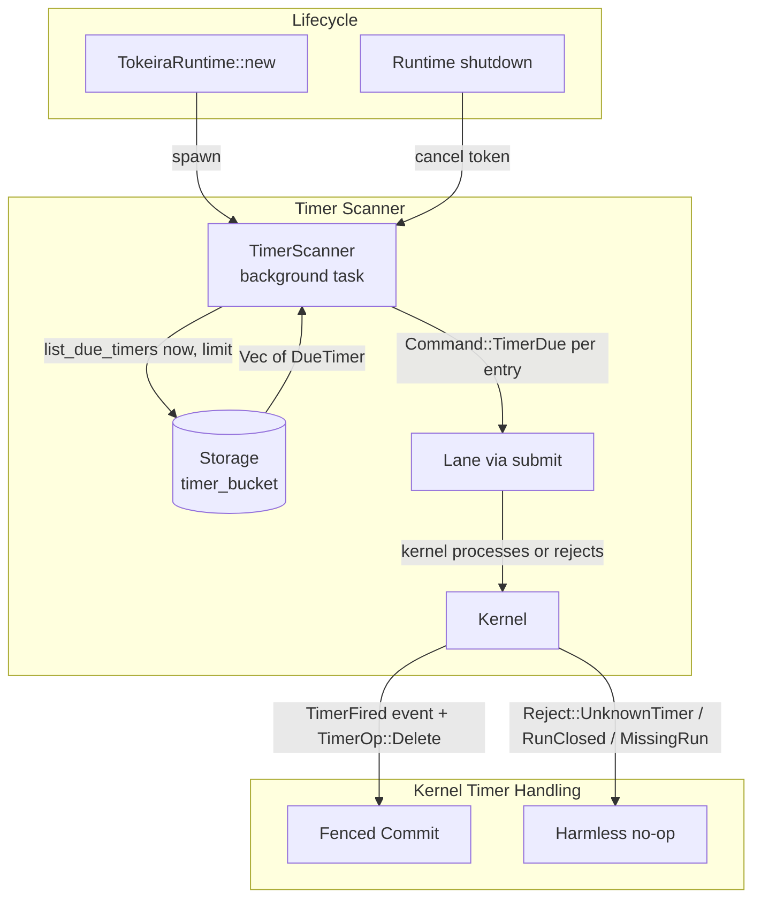

# Design Document: Timer Scanner

## Overview

This design adds a background timer scanner to `tokeira-runtime`, completing Feature 4 of the runtime roadmap. The scanner periodically discovers timers whose deadlines have passed and injects `Command::TimerDue` commands into the owning run's lane mailbox.

The feature is structurally parallel to the Activity Timeout Scanner from Feature 3. Both are background `tokio::spawn` tasks that periodically scan and inject commands through the lane. The key difference is the data source:

- **Activity Timeout Scanner** reads from runtime-local `ActivityTrackingState` (in-memory timestamps populated by lifecycle hooks).
- **Timer Scanner** reads from the storage layer's `list_due_timers(now, limit)` API, which queries the durable timer bucket managed authoritatively by the kernel via `TimerOp::Upsert` and `TimerOp::Delete`.

Timer scanning is non-authoritative. The scanner is a delivery mechanism, not a state authority. The authoritative state transition happens when the kernel processes the `TimerDue` command — it emits a `TimerFired` history event, removes the timer from the open set via `TimerOp::Delete`, and schedules a workflow task. If the scanner fires a stale or duplicate `TimerDue` (timer already canceled or fired, run already closed, run absent), the kernel rejects it harmlessly via `Reject::UnknownTimer`, `Reject::RunClosed`, or `Reject::MissingRun`.

Because the scanner reads from durable storage rather than runtime-local state, it requires no lifecycle hooks or in-memory tracking structures. This makes it simpler than the activity timeout scanner.

## Architecture



### Key design decisions

**Storage-backed scanning, no runtime-local state.** Unlike the activity timeout scanner, the timer scanner does not need an in-memory tracking structure. Timer obligations are managed authoritatively by the kernel in the durable timer bucket (via `TimerOp::Upsert` on `StartTimer` and `TimerOp::Delete` on `TimerFired` or `CancelTimer`). The scanner simply queries `list_due_timers(now, limit)` each cycle. This eliminates lifecycle hooks, reduces memory footprint, and means the scanner works correctly after runtime restart without any rebuild step.

**Scanner submits through the lane, not directly to the kernel.** The scanner uses the same `self.submit(run_key, Command::TimerDue(...))` path as all other runtime commands. This preserves the lane's single-writer serialization for each run and ensures the kernel's fenced transition logic handles conflicts correctly.

**Non-authoritative delivery.** The scanner is a best-effort delivery mechanism. If it submits a `TimerDue` for a timer that has already been canceled or fired, the kernel rejects it with `Reject::UnknownTimer`. If the run is closed or absent, the kernel rejects with `Reject::RunClosed` or `Reject::MissingRun`. All rejections are harmless no-ops. This means duplicate firings from multiple scanner instances (e.g., during rolling deploys before shard-scoped scanning) are safe.

**Bounded batches per scan cycle.** The scanner processes at most `max_timers_per_scan` timers per cycle, passed directly as the `limit` parameter to `list_due_timers`. This bounds the work per cycle and prevents the scanner from starving other lane work. Remaining due timers are picked up in the next cycle.

**Configurable scan interval.** The default scan interval of 200ms provides sub-second timer resolution. Operators can tune this for their workload — lower for tighter timer precision, higher to reduce storage read pressure.

**Graceful lifecycle management.** The scanner is spawned during `TokeiraRuntime::new` and cancelled via a `CancellationToken` on shutdown, mirroring the activity timeout scanner pattern.

**Shard-scoped scanning deferred.** The current implementation scans all timers regardless of shard assignment. This is safe because timer scanning is non-authoritative. Shard-scoped scanning (where only timers for owned shards are scanned) is deferred to Feature 11 (Sweeper and Recovery).

## Components and Interfaces

### TimerScannerConfig

Configuration for the timer scanner background task:

```rust
/// Configuration for the background timer scanner.
pub struct TimerScannerConfig {
    /// How often the scanner runs. Default: 200ms.
    pub scan_interval: tokio::time::Duration,
    /// Maximum number of DueTimer entries processed per scan cycle.
    /// Passed as the `limit` parameter to `list_due_timers`.
    pub max_timers_per_scan: usize,
}

impl Default for TimerScannerConfig {
    fn default() -> Self {
        Self {
            scan_interval: tokio::time::Duration::from_millis(200),
            max_timers_per_scan: 100,
        }
    }
}
```

### Timer scanner loop (async function)

The scanner is implemented as an async function spawned via `tokio::spawn`:

```rust
async fn run_timer_scanner<R>(
    repo: Arc<R>,
    lanes: Vec<LaneHandle>,
    lane_count: usize,
    config: TimerScannerConfig,
    cancel: CancellationToken,
) where
    R: RunRepository + 'static,
{
    loop {
        tokio::select! {
            _ = cancel.cancelled() => break,
            _ = tokio::time::sleep(config.scan_interval) => {}
        }

        let now = OffsetDateTime::now_utc();
        let due_timers = match repo.list_due_timers(now, config.max_timers_per_scan).await {
            Ok(timers) => timers,
            Err(error) => {
                tracing::warn!(?error, "timer scanner: list_due_timers failed, skipping cycle");
                continue;
            }
        };

        for due in due_timers {
            let lane = pick_lane(&lanes, lane_count, due.run_key);
            let command = Command::TimerDue(TimerDueRequest {
                timer_id: due.timer_id,
                fired_at: now,
            });
            match lane.submit(due.run_key, command).await {
                Ok(_) => {}
                Err(error) => {
                    let msg = error.to_string();
                    if msg.contains("kernel rejected") {
                        // Kernel rejections (UnknownTimer, RunClosed,
                        // MissingRun) are harmless for timer scanning.
                        tracing::debug!(
                            ?error,
                            run_key = ?due.run_key,
                            "timer scanner: kernel rejection (harmless)"
                        );
                    } else {
                        // Lane-level failures (channel closed, OCC
                        // exhaustion) indicate real delivery problems.
                        tracing::warn!(
                            ?error,
                            run_key = ?due.run_key,
                            "timer scanner: lane submit failed"
                        );
                    }
                }
            }
        }
    }
}
```

### Updated TokeiraRuntime

```rust
pub struct TokeiraRuntime<R> {
    repo: Arc<R>,
    broker: InMemoryBroker,
    activity_broker: InMemoryActivityBroker,
    lanes: Vec<LaneHandle>,
    config: LaneConfig,
    // New fields for timer scanner:
    timer_scanner_handle: Option<tokio::task::JoinHandle<()>>,
    timer_scanner_cancel: CancellationToken,
}
```

The `new` method is extended to spawn the timer scanner:

```rust
impl<R> TokeiraRuntime<R>
where
    R: RunRepository + 'static,
{
    pub fn new(
        repo: Arc<R>,
        lane_count: usize,
        config: LaneConfig,
        timer_config: TimerScannerConfig,
    ) -> Self {
        let broker = InMemoryBroker::default();
        let activity_broker = InMemoryActivityBroker::default();
        let lanes = (0..lane_count.max(1))
            .map(|_| {
                let publisher = RuntimeDispatchPublisher::new(
                    broker.clone(),
                    activity_broker.clone(),
                );
                spawn_lane(
                    BasicKernel::default(),
                    repo.clone(),
                    publisher,
                    config.clone(),
                )
            })
            .collect::<Vec<_>>();

        let cancel = CancellationToken::new();
        let handle = tokio::spawn(run_timer_scanner(
            repo.clone(),
            lanes.clone(),
            lanes.len(),
            timer_config,
            cancel.clone(),
        ));

        Self {
            repo,
            broker,
            activity_broker,
            lanes,
            config,
            timer_scanner_handle: Some(handle),
            timer_scanner_cancel: cancel,
        }
    }

    /// Shut down the timer scanner gracefully.
    pub async fn shutdown_timer_scanner(&mut self) {
        self.timer_scanner_cancel.cancel();
        if let Some(handle) = self.timer_scanner_handle.take() {
            let _ = tokio::time::timeout(
                tokio::time::Duration::from_secs(5),
                handle,
            ).await;
        }
    }
}
```

### Lane routing helper

The scanner needs to route each `DueTimer` to the correct lane using the same hash-based routing as `TokeiraRuntime::pick_lane`:

```rust
fn pick_lane(lanes: &[LaneHandle], lane_count: usize, run_key: RunKey) -> &LaneHandle {
    let mut hasher = std::collections::hash_map::DefaultHasher::new();
    run_key.hash(&mut hasher);
    &lanes[(hasher.finish() as usize) % lane_count]
}
```

## Data Models

### New types

| Type | Crate | Role |
|------|-------|------|
| `TimerScannerConfig` | `tokeira-runtime` | Configurable scan interval and batch size |

### Modified types

| Type | Crate | Change |
|------|-------|--------|
| `TokeiraRuntime` | `tokeira-runtime` | Add `timer_scanner_handle: Option<JoinHandle<()>>` and `timer_scanner_cancel: CancellationToken` fields |
| `LaneHandle` | `tokeira-runtime` | Derive `Clone` — the inner `mpsc::Sender` is already `Arc`-backed, so cloning is cheap. Required so the scanner can hold its own `Vec<LaneHandle>` without borrowing the runtime. |

### Existing types used (no changes needed)

| Type | Crate | Role |
|------|-------|------|
| `DueTimer` | `tokeira-storage` | Storage query result: `{ run_key: RunKey, timer_id: String }` |
| `TimerDueRequest` | `tokeira-kernel` | Command payload: `{ timer_id: String, fired_at: OffsetDateTime }` |
| `Command::TimerDue` | `tokeira-kernel` | Kernel command variant wrapping `TimerDueRequest` |
| `Reject::UnknownTimer` | `tokeira-kernel` | Kernel rejection for timer not in open set |
| `Reject::RunClosed` | `tokeira-kernel` | Kernel rejection for closed run |
| `Reject::MissingRun` | `tokeira-kernel` | Kernel rejection for absent run |
| `RunRepository::list_due_timers` | `tokeira-storage` | Storage query: `(now, limit) -> Vec<DueTimer>` |
| `LaneHandle` | `tokeira-runtime` | Lane submission handle |
| `CancellationToken` | `tokio-util` | Cooperative shutdown signal |

### Scanner data flow

```
TimerScanner loop:
  1. Sleep for scan_interval (or exit on cancellation)
  2. now = OffsetDateTime::now_utc()
  3. due_timers = repo.list_due_timers(now, max_timers_per_scan)
     - On error: log warn, continue to next cycle
  4. For each DueTimer { run_key, timer_id }:
     a. lane = pick_lane(run_key)
     b. command = Command::TimerDue(TimerDueRequest { timer_id, fired_at: now })
     c. lane.submit(run_key, command)
        - On Ok: timer delivered (kernel will fire or reject)
        - On Err: log debug, continue to next entry
```


## Correctness Properties

*A property is a characteristic or behavior that should hold true across all valid executions of a system — essentially, a formal statement about what the system should do. Properties serve as the bridge between human-readable specifications and machine-verifiable correctness guarantees.*

### Property 1: Each due timer produces a correctly shaped TimerDue command

*For any* set of `DueTimer` entries returned by `list_due_timers`, the scanner shall submit exactly one `Command::TimerDue(TimerDueRequest { timer_id, fired_at })` per entry, where `timer_id` matches the `DueTimer.timer_id` and the command is routed to the lane determined by `hash(due.run_key) mod lane_count`.

**Validates: Requirements 1.2**

### Property 2: Batch limit is respected

*For any* `TimerScannerConfig` with `max_timers_per_scan = N`, the scanner shall pass `N` as the `limit` parameter to `list_due_timers`, ensuring at most `N` timers are processed per scan cycle.

**Validates: Requirements 1.4, 3.4**

### Property 3: All commands in a scan cycle share the same fired_at

*For any* set of `DueTimer` entries processed in a single scan cycle, all resulting `TimerDueRequest` commands shall have the same `fired_at` value — the wall-clock time captured at the start of that cycle.

**Validates: Requirements 1.5**

### Property 4: Scanner continues processing after per-entry failures

*For any* batch of `DueTimer` entries where `submit` fails for some entries (whether due to kernel rejection like `Reject::UnknownTimer`, `Reject::RunClosed`, `Reject::MissingRun`, or lane-level errors like channel closed or OCC exhaustion), the scanner shall attempt submission for all remaining entries in the batch without crashing or short-circuiting.

**Validates: Requirements 2.2, 2.3, 2.4, 5.2, 5.3**

### Property 5: Scanner survives transient storage errors

*For any* transient error returned by `list_due_timers`, the scanner shall log the error and proceed to the next scan cycle without crashing. The scanner's loop shall remain active after the error.

**Validates: Requirements 5.1**

### Property 6: Deterministic lane routing

*For any* `RunKey`, the scanner's lane selection shall be deterministic and consistent with `TokeiraRuntime::pick_lane` — i.e., `hash(run_key) mod lane_count` always produces the same lane index for the same `run_key`.

**Validates: Requirements 1.2**

## Error Handling

### Transient storage errors during list_due_timers

If `repo.list_due_timers(now, limit)` returns an error (transient network error, DSQL conflict), the scanner logs at `warn` level and skips the entire cycle. The scanner continues to the next cycle after sleeping for `scan_interval`. No timers are lost — they remain in the durable timer bucket and will be picked up in a subsequent cycle.

### Lane submission errors

If `lane.submit(run_key, command)` returns an `Err` that is not a kernel rejection (e.g., channel closed, OCC exhaustion), the scanner logs at `warn` level and continues to the next `DueTimer` entry. These are real delivery-path failures that operators should be aware of. The timer remains in the durable timer bucket and will be re-discovered in the next scan cycle.

### Kernel rejections

The lane's `submit` path translates kernel `Reject` variants into `Err`. For timer scanning, the relevant rejections are:

- `Reject::UnknownTimer(timer_id)` — the timer was already fired or canceled. Harmless.
- `Reject::RunClosed(status)` — the run reached a terminal state. Harmless.
- `Reject::MissingRun` — the run does not exist in storage. Harmless.

All three are logged at `debug` level (not warn) and the scanner continues. These are expected during normal operation and should not generate noise in operator logs.

### Race between timer cancellation and scanner

If a `CancelTimer` workflow command is processed between the scanner's `list_due_timers` call and the `submit` call for that timer, the kernel will reject the `TimerDue` with `Reject::UnknownTimer` because the `CancelTimer` transition already removed the timer from the open set and emitted `TimerOp::Delete`. This is the intended non-authoritative behavior.

### Race between duplicate scanner instances

If multiple runtime nodes run timer scanners concurrently (before shard-scoped scanning is implemented), they may both discover the same due timer. The first `TimerDue` command to be processed by the kernel will succeed and fire the timer. The second will be rejected with `Reject::UnknownTimer` because the timer was already removed from the open set. This is safe by design.

## Testing Strategy

### Property-based testing

All 6 correctness properties will be implemented as property-based tests using the [`proptest`](https://docs.rs/proptest) crate, consistent with the existing test infrastructure in `tokeira-runtime`.

Each property test will:
- Run a minimum of 100 iterations (proptest default is 256).
- Be tagged with a comment referencing the design property.
- Tag format: `// Feature: runtime-timer-scanner, Property N: <title>`

**Scanner command generation (Properties 1, 3):** These test the core scan-cycle logic. A generator produces random `Vec<DueTimer>` entries (random `RunKey` and `timer_id` values). A mock `RunRepository` returns these from `list_due_timers`. A mock lane captures submitted commands. The test verifies that each `DueTimer` produces a corresponding `Command::TimerDue` with matching `timer_id` and that all `fired_at` values in a cycle are identical.

**Batch limit (Property 2):** A generator produces random `max_timers_per_scan` values. A mock `RunRepository` records the `limit` parameter passed to `list_due_timers`. The test verifies the recorded limit equals the configured value.

**Error resilience (Properties 4, 5):** A generator produces random batches of `DueTimer` entries and random failure patterns (which entries fail submission, whether `list_due_timers` itself fails). Mock lanes are configured to fail on specific entries. The test verifies that all non-failing entries are still submitted (Property 4) and that the scanner loop continues after a `list_due_timers` error (Property 5).

**Lane routing (Property 6):** A generator produces random `RunKey` values and lane counts. The test verifies that the scanner's lane selection matches `TokeiraRuntime::lane_index` for the same inputs, and that the result is deterministic across repeated calls.

### Unit tests

Unit tests complement property tests for specific examples and edge cases:

- **Default config values**: verify that `TimerScannerConfig::default()` has `scan_interval = 200ms` and `max_timers_per_scan = 100`.
- **Empty scan cycle**: verify that when `list_due_timers` returns an empty vec, no commands are submitted.
- **Scanner shutdown**: verify that cancelling the `CancellationToken` causes the scanner task to complete within a bounded time.
- **Scanner spawned on runtime creation**: verify that `timer_scanner_handle` is `Some` after `TokeiraRuntime::new`.

### Integration tests

Integration tests exercise the full `TokeiraRuntime` with `InMemoryStore`:

- Start a workflow, schedule a timer via `WorkflowTaskCompleted` with a `StartTimer` command whose `fire_at` is in the past, and verify the scanner submits a `TimerDue` that produces a `TimerFired` history event.
- Start a workflow, schedule a timer, cancel it via `CancelTimer`, and verify the scanner does not produce a `TimerFired` event (the `TimerDue` is rejected harmlessly).
- Start a workflow, schedule multiple timers with past deadlines, and verify all are fired within a few scan cycles.

### Test configuration

```toml
[dev-dependencies]
proptest = "1"
tokio-util = { version = "0.7", features = ["rt"] }  # for CancellationToken in tests
```

Each property test annotation:
```rust
// Feature: runtime-timer-scanner, Property 1: Each due timer produces a correctly shaped TimerDue command
proptest! {
    #[test]
    fn prop_each_due_timer_produces_command(
        timer_count in 0usize..20,
        // ... generators for DueTimer entries
    ) {
        // ...
    }
}
```

Each correctness property MUST be implemented by a SINGLE property-based test. Property tests should run a minimum of 100 iterations.
