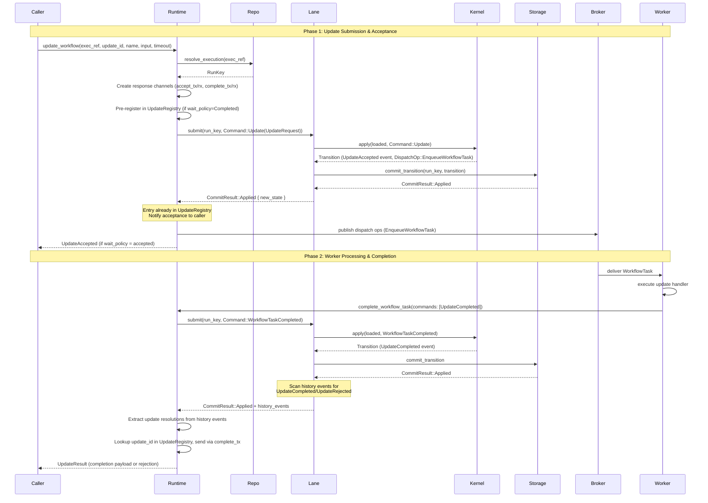
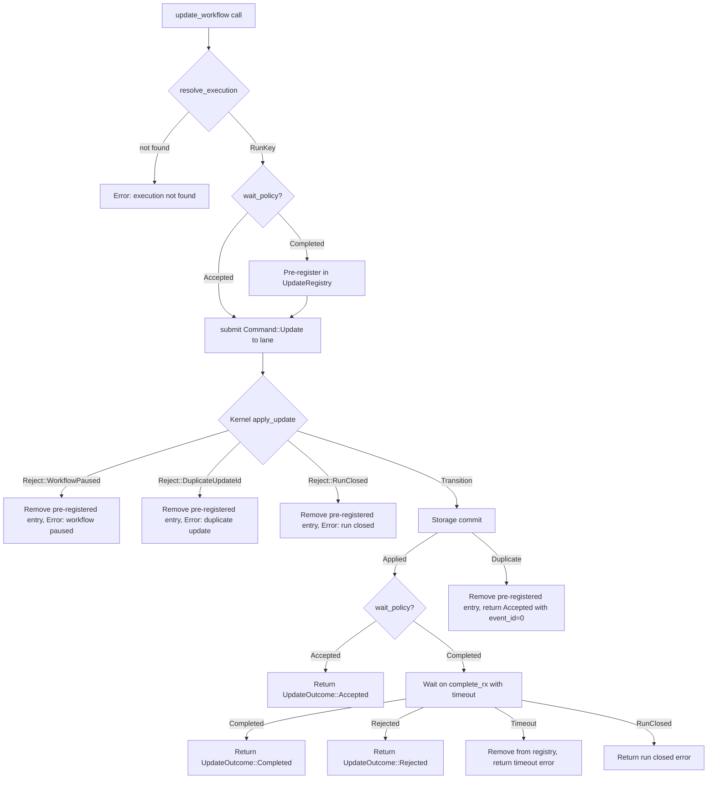

# Design Document: Update Two-Phase Lifecycle

## Overview

Updates are synchronous, tracked write requests that span two kernel transitions: acceptance (when `Command::Update` commits) and completion (when the worker returns `UpdateCompleted`, `UpdateRejected`, or `ProtocolMessage` within a `WorkflowTaskCompleted`). Unlike signals, updates require the caller to wait for a response. Unlike queries, updates mutate workflow state and flow through the kernel via lanes.

The kernel already handles the state machine transitions for updates — `apply_update` records `WorkflowExecutionUpdateAccepted`, adds to `pending_updates`, and schedules a workflow task; `apply_workflow_command` processes `UpdateCompleted`/`UpdateRejected`/`ProtocolMessage` variants to emit completion/rejection events and remove from `pending_updates`. The runtime's job is to:

1. Route `Command::Update` through the existing lane `submit()` path (same as signals).
2. Maintain an in-memory `UpdateRegistry` mapping `(RunKey, update_id)` to response channels so worker responses can be correlated back to waiting callers.
3. Extract update resolution events from committed `WorkflowTaskCompleted` transitions and notify waiting callers.
4. Enforce per-call timeouts without modifying kernel state.
5. Clean up registry entries when runs close.

The design follows the same runtime-level coordination pattern as query dispatch (oneshot channels, timeout wrapping, no kernel involvement in the coordination layer) but differs in that updates flow through the kernel and lane, produce history events, and require a two-phase notification (acceptance then completion). Unlike query dispatch, this feature modifies lane activation semantics: `run_activation` and `spawn_lane` gain an `UpdateRegistry` parameter, and the post-commit path in `run_activation` gains event-scanning and registry-drain logic. This is a cross-cutting change within `tokeira-runtime`, not just a facade method and helper type.

## Architecture



### Design Decisions

**UpdateRegistry lives on the runtime, not on lanes.** The registry must be accessible from both the `update_workflow` caller (which registers entries and waits) and the lane activation path (which notifies on completion). Since lanes are single-threaded executors and the caller may be on any async task, the registry is a shared concurrent structure on `TokeiraRuntime`, similar to how `WorkflowTimeoutTrackingState` and `ActivityTrackingState` are shared.

**Two-channel notification model.** Each update caller gets two oneshot channels: one for acceptance (fired when `Command::Update` commits) and one for completion (fired when the worker resolves the update). This allows callers to choose their wait policy — return after acceptance or wait for full completion. The acceptance channel is resolved synchronously in `update_workflow` after the `submit()` call returns. The completion channel is resolved asynchronously when the lane processes a `WorkflowTaskCompleted` containing update resolution events.

**Event-driven notification from committed history.** The runtime extracts update resolutions from committed `history_events` (specifically `WorkflowExecutionUpdateCompleted` and `WorkflowExecutionUpdateRejected` events), not from raw workflow commands. This ensures only committed resolutions are reported to callers, matching Requirement 4.6.

**Notification happens in `run_activation`, not in a separate task.** When a `WorkflowTaskCompleted` transition commits, the lane's `run_activation` loop scans the committed history events for update resolution events and notifies waiting callers in the same activation cycle. This ensures callers are notified before the next mailbox item is processed (Requirement 7.4).

**Registry cleanup on run close is co-located with existing close handling.** The `run_activation` loop already handles close-related cleanup (removing workflow timeout tracking, nexus timeout tracking). Update registry cleanup for closed runs is added to the same code path, notifying all waiting callers for the closed run's `RunKey` with a run-closed error.

**Timeout does not modify kernel state.** When an update times out at the runtime level, the `UpdateRegistry` entry is removed and the caller receives a timeout error, but the kernel's `pending_updates` is untouched. The update may still be completed by the worker in a future transition — the completion will commit normally but the notification will be silently discarded (no caller waiting).

**Pre-registration before submit to close the race window.** The lane publishes dispatch ops (including `EnqueueWorkflowTask`) before sending the `CommitResult` back to the caller via `reply_tx`. A fast worker could poll the WFT, complete the update, and have the lane commit `WorkflowExecutionUpdateCompleted` — all before `update_workflow` receives the `CommitResult` and registers in the `UpdateRegistry`. To prevent this race, the caller is pre-registered in the `UpdateRegistry` before calling `lane.submit()`. If `submit()` fails or the kernel rejects the command, the pre-registered entry is removed. On `CommitResult::Duplicate`, the entry is also removed (the update may already be terminal). This ensures the registry entry exists before any dispatch ops can trigger a worker response.

## Components and Interfaces

### New Types (`tokeira-runtime`)

```rust
/// Outcome of an update dispatch, returned to the caller.
pub enum UpdateOutcome {
    /// The update was accepted by the kernel. The caller
    /// may continue waiting for completion.
    Accepted {
        /// Event ID of the WorkflowExecutionUpdateAccepted event.
        accepted_event_id: i64,
    },
    /// The update was completed by the worker with a result.
    Completed {
        /// Event ID of the acceptance event.
        accepted_event_id: i64,
        /// Serialized result payload from the worker.
        result: Payloads,
    },
    /// The update was rejected by the worker.
    Rejected {
        /// Event ID of the acceptance event.
        accepted_event_id: i64,
        /// Failure reason from the worker.
        failure: String,
    },
}

/// Policy controlling how long the caller waits.
pub enum UpdateWaitPolicy {
    /// Return as soon as the update is accepted (Phase 1 only).
    Accepted,
    /// Wait for the worker to complete or reject the update (Phase 1 + Phase 2).
    Completed,
}

/// Internal entry in the UpdateRegistry for a single waiting caller.
struct UpdateRegistryEntry {
    /// Channel to notify the caller of completion or rejection.
    complete_tx: oneshot::Sender<UpdateResolution>,
}

/// Resolution of an update, sent through the completion channel.
enum UpdateResolution {
    /// Worker completed the update with a result payload.
    Completed { result: Payloads },
    /// Worker rejected the update with a failure reason.
    Rejected { failure: String },
    /// The run closed before the update was completed.
    RunClosed,
}
```

### UpdateRegistry

```rust
/// In-memory registry of waiting update callers.
///
/// Thread-safe: wrapped in `Arc<Mutex<HashMap<...>>>` for
/// concurrent access from multiple lanes and callers.
/// Not persisted — purely ephemeral.
#[derive(Clone)]
pub struct UpdateRegistry {
    inner: Arc<Mutex<HashMap<(RunKey, String), UpdateRegistryEntry>>>,
}

impl UpdateRegistry {
    pub fn new() -> Self { ... }

    /// Register a waiting caller for the given (run_key, update_id).
    /// Returns the completion receiver.
    pub fn register(
        &self,
        run_key: RunKey,
        update_id: String,
        complete_tx: oneshot::Sender<UpdateResolution>,
    ) { ... }

    /// Notify a waiting caller that the update was resolved.
    /// Returns `true` if a caller was found and notified.
    /// Returns `false` if no caller was waiting (e.g., timed out).
    pub fn notify(
        &self,
        run_key: RunKey,
        update_id: &str,
        resolution: UpdateResolution,
    ) -> bool { ... }

    /// Remove a registry entry without notifying (used on timeout).
    pub fn remove(
        &self,
        run_key: RunKey,
        update_id: &str,
    ) { ... }

    /// Notify and remove all entries for a given RunKey.
    /// Used when a run closes to unblock all waiting callers.
    pub fn drain_for_run(
        &self,
        run_key: RunKey,
    ) -> usize { ... }
}
```

### Runtime Method (`TokeiraRuntime`)

```rust
impl<R: RunRepository + 'static> TokeiraRuntime<R> {
    /// Dispatch a synchronous update to a workflow execution.
    ///
    /// Routes Command::Update through the kernel via the lane,
    /// registers the caller in the UpdateRegistry, and waits
    /// for acceptance and optionally completion within the
    /// given timeout.
    pub async fn update_workflow(
        &self,
        execution: ExecutionRef,
        update_id: String,
        update_name: String,
        input: Payloads,
        request: RequestContext,
        timeout: Duration,
        wait_policy: UpdateWaitPolicy,
    ) -> Result<UpdateOutcome> { ... }
}
```

Implementation sketch:

1. `resolve_execution(&execution)` → `RunKey` (or error).
2. Construct `Command::Update(UpdateRequest { update_id, update_name, input, request, now })`.
3. If `wait_policy == Completed`, create `oneshot::channel()` for completion and pre-register: `self.update_registry.register(run_key, update_id.clone(), complete_tx)`. This must happen before `submit()` to close the race window where a fast worker completes the update before the registry entry exists.
4. `self.submit(run_key, command).await` — routes through lane, kernel applies, storage commits.
5. Match on `CommitResult`:
   - `Applied { new_state }` → extract `accepted_event_id` from `new_state.pending_updates[&update_id]`.
   - `Duplicate` → remove pre-registered entry (if any) via `self.update_registry.remove(run_key, &update_id)`, return `UpdateOutcome::Accepted { accepted_event_id: 0 }` immediately. Do NOT wait for completion — the bare `Duplicate` carries no state, so the runtime cannot know whether the original update is still pending or already terminal.
   - `Conflict` / error → remove pre-registered entry (if any) via `self.update_registry.remove(run_key, &update_id)`, return error to caller.
6. If `wait_policy == Accepted`, return `UpdateOutcome::Accepted { accepted_event_id }`.
7. `tokio::time::timeout(timeout, complete_rx).await` (the channel was created in step 3):
   - `Ok(Ok(Completed { result }))` → return `UpdateOutcome::Completed { accepted_event_id, result }`.
   - `Ok(Ok(Rejected { failure }))` → return `UpdateOutcome::Rejected { accepted_event_id, failure }`.
   - `Ok(Ok(RunClosed))` → return error indicating run closed.
   - `Ok(Err(_))` → channel closed unexpectedly, return error.
   - `Err(_)` → timeout expired, `self.update_registry.remove(run_key, &update_id)`, return timeout error with accepted_event_id context.

### Lane Activation Changes

The `run_activation` function in `lane.rs` gains update-related post-commit logic:

```rust
// After a successful commit in run_activation:
if let CommitResult::Applied { new_state } = &commit_result {
    // ... existing activity tracking, timeout tracking ...

    // NEW: Scan for update resolution events and notify callers
    for event in &history_events {
        match &event.kind {
            HistoryEventKind::WorkflowExecutionUpdateCompleted {
                update_id, result,
            } => {
                update_registry.notify(
                    message.run_key,
                    update_id,
                    UpdateResolution::Completed { result: result.clone() },
                );
            }
            HistoryEventKind::WorkflowExecutionUpdateRejected {
                update_id, failure,
            } => {
                update_registry.notify(
                    message.run_key,
                    update_id,
                    UpdateResolution::Rejected { failure: failure.clone() },
                );
            }
            _ => {}
        }
    }

    // NEW: If run closed, drain all waiting update callers
    if new_state.closed_at.is_some() {
        update_registry.drain_for_run(message.run_key);
        // ... existing close cleanup ...
    }
}
```

### Interactions with Existing Systems

| System | Interaction |
|---|---|
| Kernel | `Command::Update` → `apply_update` produces `WorkflowExecutionUpdateAccepted` event, adds to `pending_updates`, schedules WFT. `WorkflowTaskCompleted` with `UpdateCompleted`/`UpdateRejected`/`ProtocolMessage` → emits completion/rejection events, removes from `pending_updates`. |
| Lanes | `Command::Update` is submitted via `lane.submit()`, same path as signals. Update resolution notification happens in `run_activation` post-commit. |
| History | `WorkflowExecutionUpdateAccepted`, `WorkflowExecutionUpdateCompleted`, `WorkflowExecutionUpdateRejected` events are appended. |
| Broker | `DispatchOp::EnqueueWorkflowTask` is published after `Command::Update` commits, triggering worker delivery. |
| Backlog / Grace Scanner | No direct interaction. Update registry is ephemeral. |
| Sweeper | No direct interaction. Pending updates survive in `WorkflowState.pending_updates` and will be completed when the worker processes them after recovery. |
| Dedup set | `RequestDedupeOp` is emitted by the kernel for `Command::Update`, enabling idempotent redelivery. |


## Data Models

No new durable state. The kernel already maintains `WorkflowState.pending_updates: BTreeMap<String, PendingUpdate>` for tracking accepted-but-not-completed updates. The runtime adds only ephemeral in-memory structures.

### UpdateRegistry (in-memory)

```rust
/// Key: (RunKey, update_id: String)
/// Value: UpdateRegistryEntry { complete_tx }
///
/// Lifecycle:
///   Created  — after Command::Update commits successfully
///   Notified — when WorkflowTaskCompleted commits with
///              UpdateCompleted/UpdateRejected events
///   Removed  — on notification, timeout, or run close
///
/// Not persisted. Lost on process restart. After restart,
/// pending updates remain in WorkflowState.pending_updates
/// and will be completed by the worker, but no caller will
/// be waiting — the original caller will have received a
/// timeout or connection error.
inner: HashMap<(RunKey, String), UpdateRegistryEntry>
```

### Existing Kernel Types (unchanged)

| Type | Location | Role |
|---|---|---|
| `Command::Update(UpdateRequest)` | `tokeira-kernel/src/command.rs` | Kernel command for update acceptance |
| `UpdateRequest` | `tokeira-kernel/src/command.rs` | Carries `update_id`, `update_name`, `input`, `request`, `now` |
| `PendingUpdate` | `tokeira-kernel/src/state.rs` | Kernel state entry: `{ update_id, accepted_event_id, name }` |
| `WorkflowCommand::UpdateCompleted` | `tokeira-kernel/src/command.rs` | Worker command to complete an update |
| `WorkflowCommand::UpdateRejected` | `tokeira-kernel/src/command.rs` | Worker command to reject an update |
| `WorkflowCommand::ProtocolMessage` | `tokeira-kernel/src/command.rs` | Wrapper carrying `UpdateProtocolBody` variants |
| `UpdateProtocolBody` | `tokeira-kernel/src/command.rs` | `Accepted`, `Completed`, `Rejected` variants |
| `HistoryEventKind::WorkflowExecutionUpdateAccepted` | `tokeira-kernel/src/event.rs` | History event for acceptance |
| `HistoryEventKind::WorkflowExecutionUpdateCompleted` | `tokeira-kernel/src/event.rs` | History event for completion |
| `HistoryEventKind::WorkflowExecutionUpdateRejected` | `tokeira-kernel/src/event.rs` | History event for rejection |
| `Reject::WorkflowPaused` | `tokeira-kernel/src/kernel.rs` | Rejection for paused workflows |
| `Reject::DuplicateUpdateId` | `tokeira-kernel/src/kernel.rs` | Rejection for duplicate update IDs |
| `Reject::RunClosed` | `tokeira-kernel/src/kernel.rs` | Rejection for closed runs |

### Data Flow Summary



## Correctness Properties

*A property is a characteristic or behavior that should hold true across all valid executions of a system — essentially, a formal statement about what the system should do. Properties serve as the bridge between human-readable specifications and machine-verifiable correctness guarantees.*

### Property 1: Update command preserves caller parameters

*For any* valid `update_id`, `update_name`, `input` payload, and `RequestContext`, when `update_workflow` is called and the `ExecutionRef` resolves to a `RunKey`, the `Command::Update(UpdateRequest)` submitted to the lane SHALL carry the exact same `update_id`, `update_name`, `input`, and `request` values provided by the caller.

**Validates: Requirements 1.2, 1.4**

### Property 2: Kernel rejections propagate and clean up pre-registered entry

*For any* `update_workflow` call where the kernel rejects the `Command::Update` (with `Reject::WorkflowPaused`, `Reject::DuplicateUpdateId`, or `Reject::RunClosed`), the runtime SHALL return an error to the caller AND the `UpdateRegistry` SHALL NOT contain an entry for that `(RunKey, update_id)` after the call returns. If the caller had `wait_policy = Completed`, the pre-registered entry SHALL be removed before the error is returned.

**Validates: Requirements 1.6, 8.1, 8.2, 8.3, 8.4**

### Property 3: Acceptance notification carries correct event ID

*For any* `update_workflow` call where the `Command::Update` transition commits successfully (`CommitResult::Applied`), the returned `UpdateOutcome` SHALL contain an `accepted_event_id` that matches the `accepted_event_id` stored in the committed `WorkflowState.pending_updates` entry for that `update_id`.

**Validates: Requirements 3.1, 3.2**

### Property 4: Update resolution notification round-trip

*For any* committed `WorkflowTaskCompleted` transition that produces `WorkflowExecutionUpdateCompleted { update_id, result }` or `WorkflowExecutionUpdateRejected { update_id, failure }` history events, if a caller is registered in the `UpdateRegistry` for that `(RunKey, update_id)`, the caller SHALL receive the exact `result` or `failure` payload from the committed event. When a single transition contains N update resolution events, all N corresponding callers SHALL be notified independently.

**Validates: Requirements 4.1, 4.2, 4.3, 4.4, 7.2, 7.3, 7.5**

### Property 5: Silent discard when no caller is waiting

*For any* committed update resolution event (`WorkflowExecutionUpdateCompleted` or `WorkflowExecutionUpdateRejected`) where no caller is registered in the `UpdateRegistry` for that `(RunKey, update_id)` (e.g., the caller already timed out), the runtime SHALL process the transition normally without error. The transition SHALL commit, history events SHALL be appended, and `pending_updates` SHALL be updated — only the caller notification is skipped.

**Validates: Requirements 4.5, 5.6**

### Property 6: Timeout enforcement without kernel state mutation

*For any* `update_workflow` call with a given `timeout` duration where the update is accepted but the worker does not resolve the update within the timeout, the runtime SHALL return a timeout error to the caller. After the timeout, the `UpdateRegistry` entry SHALL be removed, but the kernel's `WorkflowState.pending_updates` SHALL still contain the `PendingUpdate` entry for that `update_id`, and no additional transitions SHALL have been committed as a result of the timeout.

**Validates: Requirements 5.1, 5.3, 5.4**

### Property 7: Concurrent updates are independent

*For any* set of N concurrent `update_workflow` calls targeting the same `RunKey` with distinct `update_id` values, each call SHALL have its own independent `UpdateRegistry` entry and response channel. Completing or rejecting one update SHALL NOT affect the `UpdateRegistry` entry, response channel, or timeout of any other concurrent update to the same run.

**Validates: Requirements 6.1, 6.2, 6.4**

### Property 8: Run close drains all waiting callers

*For any* run with K entries in the `UpdateRegistry`, when a transition closes that run (setting `closed_at`), all K waiting callers SHALL be notified with a run-closed indication, and all K entries SHALL be removed from the `UpdateRegistry`. After the close, the registry SHALL contain zero entries for that `RunKey`.

**Validates: Requirements 9.1, 9.2**

### Property 9: Registry cleanup on all resolution paths

*For any* `UpdateRegistry` entry created by `update_workflow`, the entry SHALL be removed from the registry on exactly one of: (a) the caller receives a completion notification, (b) the caller receives a rejection notification, (c) the caller's timeout expires, or (d) the run closes. After any of these events, the registry SHALL NOT contain an entry for that `(RunKey, update_id)`.

**Validates: Requirements 2.3**

## Error Handling

| Condition | Behavior | Registry Impact |
|---|---|---|
| `ExecutionRef` not found | `resolve_execution` returns `None` → `update_workflow` returns `anyhow!("execution not found")` | No entry created |
| Kernel rejects with `Reject::WorkflowPaused` | Error returned: "workflow is paused" | Pre-registered entry removed |
| Kernel rejects with `Reject::DuplicateUpdateId` | Error returned: "duplicate update id" | Pre-registered entry removed |
| Kernel rejects with `Reject::RunClosed` | Error returned: "run closed" | Pre-registered entry removed |
| OCC retry exhaustion | Lane returns error after max retries | Pre-registered entry removed |
| `CommitResult::Duplicate` | Return `UpdateOutcome::Accepted { accepted_event_id: 0 }` immediately. The bare `Duplicate` carries no state — the original update may be pending, completed, or rejected. | Pre-registered entry removed (caller cannot wait for completion) |
| Timeout before acceptance | `submit()` itself times out (unlikely — lane processes quickly) | Pre-registered entry removed (submit failed) |
| Timeout after acceptance, before completion | Timeout error returned with acceptance context | Entry removed |
| Worker completes after caller timeout | Transition commits normally; notification silently discarded | Entry already removed |
| Run closes with pending updates | All waiting callers notified with run-closed error | All entries for RunKey removed |
| Oneshot channel closed (internal error) | `complete_rx` returns `Err(RecvError)` → mapped to channel-closed error | Entry removed |
| Shard not active | `submit()` returns shard-not-active error | Pre-registered entry removed |

All error paths ensure the pre-registered entry is removed. The only path that retains the entry is `CommitResult::Applied` with `wait_policy = Completed`.

## Testing Strategy

### Property-Based Tests (proptest)

Property-based tests validate the correctness properties above. Each test runs a minimum of 100 iterations with randomly generated inputs.

- **Library:** `proptest` (already used in `broker.rs` and `query.rs` tests)
- **Minimum iterations:** 100 per property
- **Tag format:** `Feature: runtime-update-lifecycle, Property N: <title>`

Generated inputs include:
- Random `ExecutionRef` values (namespace, workflow_id, optional run_id)
- Random `update_id` and `update_name` strings
- Random `Payloads` for input and result
- Random `RequestContext` values
- Random timeout durations (short, medium, long)
- Random `UpdateWaitPolicy` values
- Random rejection variants (`WorkflowPaused`, `DuplicateUpdateId`, `RunClosed`)
- Random concurrency levels (1–16 concurrent updates)
- Random multi-resolution transitions (1–4 updates resolved in one WFT)

### Property Test Mapping

| Property | Test Description |
|---|---|
| Property 1 | Generate random update parameters, submit via `update_workflow`, verify the `Command::Update` submitted to the lane carries the exact input values. |
| Property 2 | Generate random rejection scenarios, call `update_workflow`, verify error is returned and `UpdateRegistry` is empty. |
| Property 3 | Generate random updates, commit successfully, verify `accepted_event_id` in the outcome matches `pending_updates` entry. |
| Property 4 | Generate random update resolutions (completions and rejections), register callers, process the transition, verify each caller receives the exact payload. Include multi-resolution transitions. |
| Property 5 | Generate random updates, remove callers from registry (simulating timeout), then process a resolution transition, verify no error and transition commits normally. |
| Property 6 | Generate random updates with short timeouts, accept them but don't complete, verify timeout error is returned and `pending_updates` still contains the entry. |
| Property 7 | Generate N concurrent updates to the same run, resolve a random subset, verify unresolved updates remain pending and unaffected. |
| Property 8 | Generate runs with K registered update callers, close the run, verify all K callers receive run-closed notification and registry is empty for that RunKey. |
| Property 9 | Generate updates and resolve them via each path (completion, rejection, timeout, run close), verify registry is empty after each. |

### Unit Tests (example-based)

- `update_workflow` returns error when `ExecutionRef` cannot be resolved (Req 1.3)
- `update_workflow` with `wait_policy = Accepted` returns immediately after acceptance (Req 3.4)
- `update_workflow` with `wait_policy = Completed` waits for worker resolution (Req 3.5)
- `CommitResult::Duplicate` returns `UpdateOutcome::Accepted { accepted_event_id: 0 }` immediately without registering in the `UpdateRegistry` (Req 3.3)
- Multiple update resolutions in a single `WorkflowTaskCompleted` all notify independently (Req 7.5)
- Registry cleanup happens in the same activation cycle as the close commit (Req 9.3)
- `UpdateRegistry::drain_for_run` returns correct count of drained entries

### Integration Tests

- End-to-end: runtime submits update → kernel accepts → broker delivers WFT → mock worker completes update → caller receives result (Req 1–4 full path)
- End-to-end rejection: runtime submits update → kernel accepts → mock worker rejects update → caller receives rejection (Req 4.2)
- Timeout scenario: runtime submits update → kernel accepts → no worker response → caller receives timeout → worker later completes → transition commits silently (Req 5.3, 5.6)
- Run close with pending updates: runtime submits update → kernel accepts → run closes via `CompleteWorkflow` → all waiting callers notified (Req 9.1–9.3)
- Dispatch ops published after `Command::Update` commit (Req 1.5) — verify `EnqueueWorkflowTask` reaches the broker
