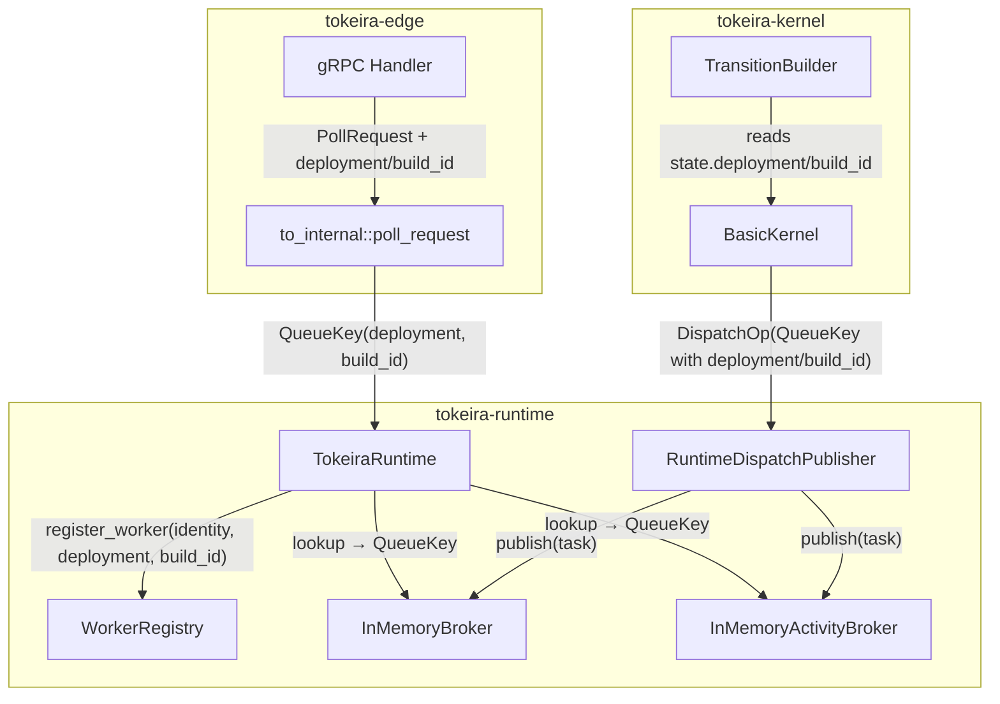

# Design Document: Worker Versioning and Deployment Routing

## Overview

This feature threads deployment and build_id version metadata through the Tokeira runtime's poll and dispatch paths, enabling the existing exact-match broker routing to deliver tasks only to compatible workers.

The `InMemoryBroker` and `InMemoryActivityBroker` already key their ready queues by full `QueueKey` (which includes `deployment: Option<DeploymentId>` and `build_id: Option<BuildId>`). The core gaps are:

1. No worker registration mechanism to record version metadata.
2. Poll APIs construct `QueueKey` with hardcoded `None` for deployment/build_id.
3. The kernel's `DispatchOp` emissions hardcode `None` for deployment/build_id.
4. The edge layer's `poll_request` translation ignores deployment/build_id from gRPC requests.
5. Activity retry in `runtime.rs` hardcodes `None` for deployment/build_id in the retry `QueueKey`.

The design adds a `WorkerRegistry` to store version metadata, wires it into poll paths, propagates version fields from `WorkflowState` through kernel dispatch ops, and updates the edge translation layer.

## Architecture



The data flow is:

1. Worker registers with the edge layer, providing optional deployment/build_id.
2. Edge layer translates gRPC fields into `QueueKey` with deployment/build_id.
3. Runtime stores version metadata in `WorkerRegistry`, keyed by `(WorkerIdentity, NamespaceId, TaskQueueName)`.
4. On poll, runtime looks up the worker's registered metadata and constructs `QueueKey` accordingly.
5. Kernel reads `WorkflowState.deployment`/`build_id` when emitting dispatch ops.
6. Broker matches tasks to pollers by exact `QueueKey` equality (already implemented).

## Components and Interfaces

### 1. WorkerRegistry (new, `tokeira-runtime`)

A concurrent map storing worker version metadata. Thread-safe via `Arc<Mutex<HashMap<...>>>` (matching the broker's concurrency model).

```rust
/// Key for worker registration lookup.
#[derive(Clone, Debug, PartialEq, Eq, Hash)]
pub struct WorkerRegistrationKey {
    pub worker_identity: WorkerIdentity,
    pub namespace_id: NamespaceId,
    pub task_queue: TaskQueueName,
}

/// Stored version metadata for a registered worker.
#[derive(Clone, Debug, PartialEq, Eq)]
pub struct WorkerVersionMetadata {
    pub deployment: Option<DeploymentId>,
    pub build_id: Option<BuildId>,
}

/// In-memory registry of worker version metadata.
#[derive(Default, Clone)]
pub struct WorkerRegistry {
    inner: Arc<Mutex<HashMap<WorkerRegistrationKey, WorkerVersionMetadata>>>,
}

impl WorkerRegistry {
    /// Register or update a worker's version metadata.
    pub fn register(&self, key: WorkerRegistrationKey, metadata: WorkerVersionMetadata);

    /// Look up a worker's version metadata. Returns None-valued
    /// metadata if the worker is not registered.
    pub fn lookup(&self, key: &WorkerRegistrationKey) -> WorkerVersionMetadata;
}
```

Design decision: `lookup` returns a default `WorkerVersionMetadata { deployment: None, build_id: None }` for unregistered workers rather than `Option<WorkerVersionMetadata>`. This simplifies callers — an unregistered worker is semantically identical to an unversioned worker. Note: the registry is observational/diagnostic, not authoritative for routing. Routing is request-carried — the edge layer builds the QueueKey from the poll request's deployment/build_id fields.

### 2. TokeiraRuntime changes (`tokeira-runtime/src/runtime.rs`)

- Add `worker_registry: WorkerRegistry` field to `TokeiraRuntime`.
- Add `pub fn register_worker(...)` method that delegates to `WorkerRegistry::register`.
- `poll_workflow_task` and `poll_activity_task` already accept `QueueKey` — no signature change needed. The caller (edge layer) is responsible for constructing the correct `QueueKey`. Routing is request-carried, not registry-derived.
- `retry_activity_task`: change the hardcoded `deployment: None, build_id: None` to read from the existing `ActivityState`'s associated `QueueKey` or from `WorkflowState`.

### 3. StartRequest changes (`tokeira-kernel/src/command.rs`)

Add two fields to `StartRequest`:

```rust
/// Optional deployment for versioned task routing.
pub deployment: Option<DeploymentId>,
/// Optional build identifier for versioned task routing.
pub build_id: Option<BuildId>,
```

The edge layer propagates these from the `StartWorkflowExecutionRequest` gRPC message.

### 3. WorkflowState changes (`tokeira-kernel/src/state.rs`)

Add two fields to `WorkflowState`:

```rust
/// Optional deployment for versioned task routing.
pub deployment: Option<DeploymentId>,
/// Optional build identifier for versioned task routing.
pub build_id: Option<BuildId>,
```

These are set at workflow start time from the `StartRequest` and remain immutable for the lifetime of the run (matching Temporal's semantics where a workflow is pinned to a deployment).

### 4. ActivityState changes (`tokeira-kernel/src/state.rs`)

Add two optional fields to `ActivityState`:

```rust
/// Optional deployment override for this activity.
pub deployment: Option<DeploymentId>,
/// Optional build_id override for this activity.
pub build_id: Option<BuildId>,
```

When `None`, the kernel falls back to the workflow run's values.

### 5. Kernel TransitionBuilder changes (`tokeira-kernel/src/kernel.rs`)

All sites that construct `QueueKey` in dispatch ops currently hardcode `deployment: None, build_id: None`. These change to:

- `schedule_workflow_task()`: read `self.state.deployment.clone()` and `self.state.build_id.clone()`.
- `EnqueueActivityTask` sites: read from `ActivityState.deployment`/`build_id`, falling back to `self.state.deployment`/`self.state.build_id`.

This is a mechanical change across ~7 call sites in `kernel.rs`.

### 6. Edge Layer changes (`tokeira-edge`)

#### PollWorkflowTaskQueueRequest

Add optional fields:

```rust
pub deployment: Option<String>,
pub build_id: Option<String>,
```

#### to_internal::poll_request

Map the new fields into `QueueKey`:

```rust
deployment: req.deployment.map(DeploymentId),
build_id: req.build_id.map(BuildId),
```

#### gRPC translation

`poll_request_to_edge` extracts `worker_versioning_capabilities` or `deployment_id`/`build_id` from the proto `PollWorkflowTaskQueueRequest` and maps them to the edge-layer struct fields.

### 7. RuntimeDispatchPublisher (no changes)

The publisher already forwards `DispatchOp` queue fields verbatim to the broker. Once the kernel populates deployment/build_id in the `QueueKey`, the publisher propagates them automatically.

### 8. InMemoryBroker / InMemoryActivityBroker (no changes)

Both brokers already use `HashMap<QueueKey, VecDeque<...>>` where `QueueKey` derives `Eq + Hash` including deployment/build_id. Exact-match routing is already correct. No broker code changes are needed.

## Data Models

### WorkerRegistrationKey

| Field | Type | Description |
|-------|------|-------------|
| worker_identity | WorkerIdentity | Self-reported worker identity string |
| namespace_id | NamespaceId | Namespace the worker belongs to |
| task_queue | TaskQueueName | Task queue the worker polls |

### WorkerVersionMetadata

| Field | Type | Description |
|-------|------|-------------|
| deployment | Option\<DeploymentId\> | Deployment group, None for unversioned |
| build_id | Option\<BuildId\> | Build identifier, None for unversioned |

### WorkflowState additions

| Field | Type | Description |
|-------|------|-------------|
| deployment | Option\<DeploymentId\> | Deployment pinned at workflow start |
| build_id | Option\<BuildId\> | Build ID pinned at workflow start |

### ActivityState additions

| Field | Type | Description |
|-------|------|-------------|
| deployment | Option\<DeploymentId\> | Activity-specific deployment override |
| build_id | Option\<BuildId\> | Activity-specific build_id override |


## Correctness Properties

*A property is a characteristic or behavior that should hold true across all valid executions of a system — essentially, a formal statement about what the system should do. Properties serve as the bridge between human-readable specifications and machine-verifiable correctness guarantees.*

### Property 1: Worker registration round-trip

*For any* worker identity, namespace, task queue, and version metadata (arbitrary `Option<DeploymentId>` × `Option<BuildId>`), registering the worker and then looking up its metadata SHALL return the most recently registered values. If the worker re-registers with different metadata, the lookup SHALL return the new values.

**Validates: Requirements 1.2, 1.3, 1.4, 1.5**

### Property 2: Poll QueueKey reflects registered metadata

*For any* worker with registered version metadata (including the unversioned case of `(None, None)`), when the edge layer constructs a `QueueKey` for a poll request, the resulting `QueueKey.deployment` and `QueueKey.build_id` SHALL equal the values provided in the poll request's deployment and build_id fields.

**Validates: Requirements 2.1, 2.2, 2.3, 2.4**

### Property 3: Edge translation preserves deployment and build_id

*For any* `PollWorkflowTaskQueueRequest` with arbitrary `Option<String>` deployment and build_id fields, `to_internal::poll_request` SHALL produce a `QueueKey` whose deployment equals `req.deployment.map(DeploymentId)` and whose build_id equals `req.build_id.map(BuildId)`. The same SHALL hold for activity poll request translation.

**Validates: Requirements 3.1, 3.2, 3.3**

### Property 4: Broker routing isolation

*For any* two distinct `QueueKey` values that differ only in their deployment or build_id fields, a task published to one QueueKey SHALL never be delivered to a poller waiting on the other QueueKey. This SHALL hold for both `InMemoryBroker` (workflow tasks) and `InMemoryActivityBroker` (activity tasks).

**Validates: Requirements 4.1, 4.2, 4.5, 7.1, 7.2, 7.3, 7.4**

### Property 5: Versioned task holding and delivery

*For any* versioned task published to the broker when no compatible poller is waiting, the task SHALL be held in the ready queue. When a poller with a matching QueueKey subsequently arrives, the broker SHALL deliver the held task. This SHALL hold for both workflow and activity brokers.

**Validates: Requirements 5.1, 5.2, 5.4**

### Property 6: Kernel dispatch op version propagation

*For any* `WorkflowState` with arbitrary `(Option<DeploymentId>, Option<BuildId>)`, when the kernel emits a `DispatchOp::EnqueueWorkflowTask`, the QueueKey SHALL carry the workflow state's deployment and build_id. For `DispatchOp::EnqueueActivityTask`, the QueueKey SHALL carry the activity's deployment and build_id when present, falling back to the workflow state's values otherwise.

**Validates: Requirements 6.1, 6.2, 6.3**

### Property 7: Activity retry version preservation

*For any* activity whose original dispatch carried a non-None deployment and/or build_id, when the runtime re-dispatches the activity for retry, the retry QueueKey SHALL carry the same deployment and build_id as the original dispatch.

**Validates: Requirements 8.1, 8.2**

## Error Handling

| Scenario | Handling |
|----------|----------|
| Worker polls without prior registration | Treated as unversioned: `QueueKey` gets `(None, None)` for deployment/build_id. No error. |
| Worker re-registers with different metadata mid-flight | Registry overwrites. In-flight polls that already constructed a QueueKey are unaffected (they use the QueueKey they were given). Next poll uses updated metadata. |
| Edge layer receives empty string for deployment/build_id | Treated as `None` (empty string → `None` mapping in translation). |
| Kernel encounters WorkflowState with no deployment/build_id | Already the default. QueueKey gets `(None, None)`. No error. |
| Versioned task published but no compatible poller exists | Task held in broker ready queue indefinitely (current behavior). Future: durable backlog fallback after grace window. |
| Activity retry for a run that has been terminated | Existing `validate_activity_token` catches this and returns an error before retry dispatch. No change needed. |

## Testing Strategy

### Property-Based Tests (proptest)

The project already uses `proptest` (visible in `runtime.rs` tests). All property tests will use `proptest` with a minimum of 100 iterations per property.

Each property test will be tagged with a comment referencing the design property:

```
// Feature: runtime-worker-versioning, Property N: <title>
```

**Property tests to implement:**

1. **WorkerRegistry round-trip** (Property 1): Generate random `(WorkerIdentity, NamespaceId, TaskQueueName, Option<DeploymentId>, Option<BuildId>)` tuples. Register, lookup, verify equality. Then re-register with different metadata, verify overwrite.

2. **Edge translation preservation** (Property 3): Generate random `PollWorkflowTaskQueueRequest` with arbitrary `Option<String>` deployment/build_id. Call `to_internal::poll_request`, verify QueueKey fields match.

3. **Broker routing isolation** (Property 4): Generate two QueueKeys sharing namespace/task_queue/task_kind but with different deployment/build_id. Publish a task to one, poll on the other, verify no delivery. Poll on the matching key, verify delivery.

4. **Versioned task holding** (Property 5): Generate a versioned QueueKey and task. Publish without a waiting poller. Then poll with matching key, verify the held task is delivered.

5. **Kernel dispatch version propagation** (Property 6): Generate a `WorkflowState` with random deployment/build_id. Run the kernel through a workflow task schedule path, verify the emitted `DispatchOp` QueueKey carries the state's values. For activity dispatch, generate activity-level overrides and verify fallback logic.

6. **Activity retry version preservation** (Property 7): Generate an activity with non-None deployment/build_id in its QueueKey. Fail it, trigger retry, verify the retry dispatch QueueKey preserves the original values.

### Unit Tests (example-based)

- Edge layer: empty-string deployment/build_id maps to `None`.
- Broker: unversioned task not delivered to versioned poller (and vice versa) — concrete example with specific deployment values.
- Kernel: workflow with `None` deployment produces `None` in dispatch op (regression guard for the current behavior).
- Activity retry: verify the specific bug fix where `retry_activity_task` previously hardcoded `deployment: None, build_id: None`.

### Integration Tests

- End-to-end: start a versioned workflow, poll with matching deployment/build_id, complete the workflow task, schedule an activity, poll activity with matching key, complete it. Verify the full lifecycle works with version metadata threaded through.
- Isolation: start two workflows on the same task queue but different deployments. Verify each worker only receives tasks for its deployment.
