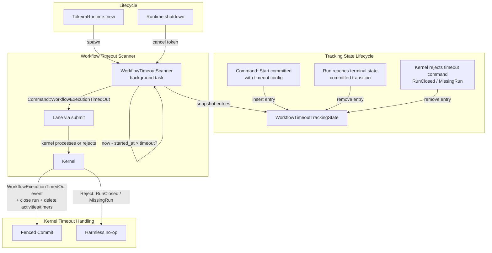

# Design Document: Workflow Timeouts

## Overview

This design adds a background workflow timeout scanner to `tokeira-runtime`, completing Feature 5 of the runtime roadmap. The scanner periodically checks runtime-local tracking state for open runs that have exceeded their configured execution or run timeouts, and injects `Command::WorkflowExecutionTimedOut` commands into the owning run's lane mailbox.

The feature is structurally parallel to the Activity Timeout Scanner (Feature 3) and the Timer Scanner (Feature 4). Like the activity timeout scanner, it uses runtime-local tracking state rather than a storage query — because there is no dedicated storage query for "runs approaching timeout." Like the timer scanner, it submits commands through the lane and is non-authoritative.

The feature has two halves:

1. **Tracking state.** A new `WorkflowTimeoutTrackingState` structure in `tokeira-runtime` that records open runs with timeout configuration. Entries are keyed by `RunKey` and store the timeout durations, `started_at` timestamp, and whether a retry policy is configured. The tracking state is populated when `Command::Start` is committed (if the `StartRequest` contains a non-None timeout) and cleaned up when the run reaches a terminal state.

2. **Timeout scanner.** A background `tokio::spawn` task (`WorkflowTimeoutScanner`) that periodically iterates over the tracking state, computes whether each run has exceeded its execution or run timeout, and submits `Command::WorkflowExecutionTimedOut` through the lane when a violation is detected. The scanner is non-authoritative: the kernel is the final arbiter. If the run is already closed or absent, the kernel rejects the command harmlessly.

There are two distinct timeout types with a precedence rule:
- **Execution timeout** (`workflow_execution_timeout`): bounds the wall-clock time for the current run. Measured from `started_at`. Note: chain-aware measurement across continue-as-new/retry requires a `first_run_started_at` timestamp not yet in `StartRequest` or `WorkflowState`; deferred to Feature 8.
- **Run timeout** (`workflow_run_timeout`): bounds the wall-clock time for a single run. Measured from `started_at` of the current run.
- When both fire in the same scan cycle, only the execution timeout command is submitted.

## Architecture



### Key design decisions

**Runtime-local tracking state, not a storage query.** Unlike the timer scanner (which queries `list_due_timers`), there is no dedicated storage API for "runs approaching timeout." Scanning all open runs in storage would be expensive and wasteful. Instead, the runtime maintains an in-memory `WorkflowTimeoutTrackingState` populated from the `Start` command's committed transition. This is the same pattern used by the activity timeout scanner.

**Tracking state is minimal.** The tracking state stores only what the scanner needs: `RunKey`, `workflow_execution_timeout`, `workflow_run_timeout`, `started_at`, and `has_retry_policy`. It does not duplicate the full `WorkflowState`. Timeout durations are captured at start time and do not change during the run's lifetime.

**Execution timeout takes precedence.** When both execution and run timeouts fire for the same run in the same scan cycle, only one `WorkflowExecutionTimedOut` command is submitted with `timeout_type: ExecutionTimeout`. This avoids redundant commands and matches Temporal's semantics where execution timeout is the outer bound.

**Scanner submits through the lane.** The scanner uses the same `submit(run_key, command)` path as all other runtime commands. This preserves the lane's single-writer serialization and ensures the kernel's fenced transition logic handles conflicts correctly.

**Non-authoritative delivery.** The scanner is a best-effort delivery mechanism. If it submits a timeout for a run that is already closed, the kernel rejects with `Reject::RunClosed`. If the run is absent, `Reject::MissingRun`. Both are harmless. This means duplicate firings from multiple scanner instances (before shard-scoped scanning) are safe.

**Bounded batches per scan cycle.** The scanner processes at most `max_timeouts_per_scan` entries per cycle to avoid starving other lane work. Remaining timed-out runs are picked up in the next cycle.

**Single timestamp per scan cycle.** The scanner captures `OffsetDateTime::now_utc()` once at the start of each cycle and uses it for all timeout comparisons and as the `now` field in submitted commands. This ensures consistent evaluation within a cycle.

**Graceful lifecycle management.** The scanner is spawned during `TokeiraRuntime::new` and cancelled via a `CancellationToken` on shutdown, mirroring the timer scanner and activity timeout scanner patterns.

**Shard-scoped scanning deferred.** The current implementation checks all tracked runs regardless of shard assignment. This is safe because workflow timeout scanning is non-authoritative. Shard-scoped scanning is deferred to Feature 11.

## Components and Interfaces

### WorkflowTimeoutTrackingState

In-memory state for workflow timeout detection:

```rust
/// Per-run tracking entry for workflow timeout detection.
///
/// This is runtime-local state — not persisted, not part of the kernel's
/// WorkflowState. It is populated when a Start command is committed with
/// timeout configuration, and removed when the run closes.
#[derive(Clone, Debug)]
pub struct WorkflowTimeoutEntry {
    pub run_key: RunKey,
    pub workflow_execution_timeout: Option<Duration>,
    pub workflow_run_timeout: Option<Duration>,
    pub started_at: OffsetDateTime,
    pub has_retry_policy: bool,
}

/// Thread-safe container for workflow timeout tracking entries.
///
/// Keyed by RunKey for O(1) lookup and efficient iteration by the scanner.
#[derive(Default, Clone)]
pub struct WorkflowTimeoutTrackingState {
    inner: Arc<Mutex<HashMap<RunKey, WorkflowTimeoutEntry>>>,
}

impl WorkflowTimeoutTrackingState {
    /// Record a run with timeout configuration (called after Start commit).
    pub fn insert(&self, entry: WorkflowTimeoutEntry);

    /// Remove a run from tracking (called on run close or kernel rejection).
    pub fn remove(&self, run_key: RunKey);

    /// Snapshot all tracked entries for the scanner to iterate.
    pub fn snapshot(&self) -> Vec<WorkflowTimeoutEntry>;
}
```

### WorkflowTimeoutScannerConfig

```rust
/// Configuration for the background workflow timeout scanner.
pub struct WorkflowTimeoutScannerConfig {
    /// How often the scanner runs. Default: 1 second.
    pub scan_interval: tokio::time::Duration,
    /// Maximum number of timeout commands submitted per scan cycle.
    pub max_timeouts_per_scan: usize,
}

impl Default for WorkflowTimeoutScannerConfig {
    fn default() -> Self {
        Self {
            scan_interval: tokio::time::Duration::from_secs(1),
            max_timeouts_per_scan: 100,
        }
    }
}
```

### Timeout evaluation (pure function)

```rust
/// Which workflow-level timeout fired, if any.
#[derive(Clone, Debug, PartialEq)]
pub enum WorkflowTimeoutViolation {
    ExecutionTimeout,
    RunTimeout,
}

/// Evaluate which workflow timeout (if any) has been violated.
///
/// Returns the highest-precedence violation, or None if no timeout has fired.
/// Execution timeout takes precedence over run timeout.
pub fn evaluate_workflow_timeout(
    entry: &WorkflowTimeoutEntry,
    now: OffsetDateTime,
) -> Option<WorkflowTimeoutViolation>;
```

Evaluation logic:
```
evaluate_workflow_timeout(entry, now):
  // Execution timeout takes precedence
  if entry.workflow_execution_timeout is Some(d):
    if now - entry.started_at > d:
      return Some(ExecutionTimeout)

  if entry.workflow_run_timeout is Some(d):
    if now - entry.started_at > d:
      return Some(RunTimeout)

  return None
```

### Scanner loop (async function)

```rust
async fn run_workflow_timeout_scanner<R>(
    tracking: WorkflowTimeoutTrackingState,
    lanes: Vec<LaneHandle>,
    lane_count: usize,
    config: WorkflowTimeoutScannerConfig,
    cancel: CancellationToken,
) where
    R: RunRepository + 'static,
{
    loop {
        tokio::select! {
            _ = cancel.cancelled() => break,
            _ = tokio::time::sleep(config.scan_interval) => {}
        }

        let now = OffsetDateTime::now_utc();
        let entries = tracking.snapshot();
        let mut submitted = 0usize;

        for entry in entries {
            if submitted >= config.max_timeouts_per_scan {
                break;
            }

            let violation = match evaluate_workflow_timeout(&entry, now) {
                Some(v) => v,
                None => continue,
            };

            let (timeout_type, retry_state) = match violation {
                WorkflowTimeoutViolation::ExecutionTimeout => (
                    WorkflowTimeoutType::ExecutionTimeout,
                    if entry.has_retry_policy {
                        RetryState::Timeout
                    } else {
                        RetryState::RetryPolicyNotSet
                    },
                ),
                WorkflowTimeoutViolation::RunTimeout => (
                    WorkflowTimeoutType::RunTimeout,
                    if entry.has_retry_policy {
                        RetryState::Timeout
                    } else {
                        RetryState::RetryPolicyNotSet
                    },
                ),
            };

            let command = Command::WorkflowExecutionTimedOut(
                WorkflowExecutionTimedOutRequest {
                    timeout_type,
                    retry_state,
                    now,
                },
            );

            let lane = pick_lane(&lanes, lane_count, entry.run_key);
            match lane.submit(entry.run_key, command).await {
                Ok(_) => {
                    tracking.remove(entry.run_key);
                    submitted += 1;
                }
                Err(error) => {
                    let msg = error.to_string();
                    if msg.contains("kernel rejected") {
                        tracing::debug!(
                            ?error,
                            run_key = ?entry.run_key,
                            "workflow timeout scanner: kernel rejection (harmless)"
                        );
                        tracking.remove(entry.run_key);
                    } else {
                        tracing::warn!(
                            ?error,
                            run_key = ?entry.run_key,
                            "workflow timeout scanner: lane submit failed"
                        );
                    }
                    submitted += 1;
                }
            }
        }
    }
}
```

### Updated TokeiraRuntime

```rust
pub struct TokeiraRuntime<R> {
    repo: Arc<R>,
    broker: InMemoryBroker,
    activity_broker: InMemoryActivityBroker,
    lanes: Vec<LaneHandle>,
    config: LaneConfig,
    timer_scanner_handle: Option<tokio::task::JoinHandle<()>>,
    timer_scanner_cancel: CancellationToken,
    // New fields for workflow timeout scanner:
    workflow_timeout_tracking: WorkflowTimeoutTrackingState,
    workflow_timeout_scanner_handle: Option<tokio::task::JoinHandle<()>>,
    workflow_timeout_scanner_cancel: CancellationToken,
}
```

### Lifecycle hooks (integration points)

| Method / Path | Hook |
|---------------|------|
| `start_workflow` (after successful commit with timeout config) | `workflow_timeout_tracking.insert(...)` |
| Lane `run_activation` (after successful commit when `new_state.closed_at.is_some()`) | `workflow_timeout_tracking.remove(...)` |
| Scanner (on kernel rejection) | `workflow_timeout_tracking.remove(...)` |

The `start_workflow` method checks the `StartRequest` for non-None `workflow_execution_timeout` or `workflow_run_timeout`. If either is present, it inserts a `WorkflowTimeoutEntry` into the tracking state after the commit succeeds.

For run closure cleanup, the lane's `run_activation` function checks the committed `CommitResult::Applied { new_state }`. If `new_state.closed_at` is `Some(_)` (terminal state), the lane calls `tracking.remove(run_key)`. This requires passing the `WorkflowTimeoutTrackingState` to the lane (via the `DispatchPublisher` or a separate post-commit callback). The `DispatchPublisher` trait itself is not suitable because it only receives `DispatchOp`s, not `next_state`. Instead, the lane receives a shared reference to the tracking state and performs cleanup directly after publishing dispatch ops.

## Data Models

### New types

| Type | Crate | Role |
|------|-------|------|
| `WorkflowTimeoutEntry` | `tokeira-runtime` | Per-run timeout config and started_at for timeout detection |
| `WorkflowTimeoutTrackingState` | `tokeira-runtime` | Thread-safe container for tracking entries, keyed by `RunKey` |
| `WorkflowTimeoutScannerConfig` | `tokeira-runtime` | Configurable scan interval and batch size |
| `WorkflowTimeoutViolation` | `tokeira-runtime` | Enum: `ExecutionTimeout` or `RunTimeout` |
| `evaluate_workflow_timeout` | `tokeira-runtime` | Pure function: `(entry, now) -> Option<WorkflowTimeoutViolation>` |

### Modified types

| Type | Crate | Change |
|------|-------|--------|
| `TokeiraRuntime` | `tokeira-runtime` | Add `workflow_timeout_tracking`, `workflow_timeout_scanner_handle`, `workflow_timeout_scanner_cancel` fields |

### Existing types used (no changes needed)

| Type | Crate | Role |
|------|-------|------|
| `WorkflowExecutionTimedOutRequest` | `tokeira-kernel` | Command payload: `{ timeout_type, retry_state, now }` |
| `Command::WorkflowExecutionTimedOut` | `tokeira-kernel` | Kernel command variant |
| `WorkflowTimeoutType` | `tokeira-kernel` | Enum: `ExecutionTimeout`, `RunTimeout` |
| `RetryState` | `tokeira-kernel` | Enum: `Timeout`, `RetryPolicyNotSet`, etc. |
| `Reject::RunClosed` | `tokeira-kernel` | Kernel rejection for closed run |
| `Reject::MissingRun` | `tokeira-kernel` | Kernel rejection for absent run |
| `LaneHandle` | `tokeira-runtime` | Lane submission handle (already `Clone`) |
| `CancellationToken` | `tokio-util` | Cooperative shutdown signal |

### Tracking state model

```
WorkflowTimeoutTrackingState:
  inner: HashMap<RunKey, WorkflowTimeoutEntry>

WorkflowTimeoutEntry:
  run_key: RunKey
  workflow_execution_timeout: Option<Duration>
  workflow_run_timeout: Option<Duration>
  started_at: OffsetDateTime
  has_retry_policy: bool
```

### Scanner data flow

```
WorkflowTimeoutScanner loop:
  1. Sleep for scan_interval (or exit on cancellation)
  2. now = OffsetDateTime::now_utc()
  3. entries = tracking.snapshot()
  4. For each entry (up to max_timeouts_per_scan):
     a. violation = evaluate_workflow_timeout(entry, now)
     b. If None: skip
     c. Build WorkflowExecutionTimedOutRequest with timeout_type and retry_state
     d. lane = pick_lane(entry.run_key)
     e. lane.submit(entry.run_key, command)
        - On Ok: remove entry from tracking
        - On kernel rejection: log debug, remove entry from tracking
        - On lane error: log warn, keep entry for next cycle
```


## Correctness Properties

*A property is a characteristic or behavior that should hold true across all valid executions of a system — essentially, a formal statement about what the system should do. Properties serve as the bridge between human-readable specifications and machine-verifiable correctness guarantees.*

### Property 1: Workflow timeout evaluation correctness

*For any* `WorkflowTimeoutEntry` and any `now` timestamp:
- If `workflow_execution_timeout` is `Some(d)` and `now - started_at > d`, then `evaluate_workflow_timeout` shall return `Some(ExecutionTimeout)`, regardless of whether `workflow_run_timeout` also fires.
- If `workflow_execution_timeout` is `None` or `now - started_at <= d`, and `workflow_run_timeout` is `Some(d2)` and `now - started_at > d2`, then `evaluate_workflow_timeout` shall return `Some(RunTimeout)`.
- If neither timeout is configured (`None`), or neither has elapsed, then `evaluate_workflow_timeout` shall return `None`.
- Execution timeout always takes precedence over run timeout.

**Validates: Requirements 1.1, 1.4, 2.1, 2.3, 2.4**

### Property 2: Retry state derivation from retry policy presence

*For any* `WorkflowTimeoutEntry` where a timeout violation is detected, the scanner shall set `retry_state` to `RetryState::Timeout` if `has_retry_policy` is `true`, and `RetryState::RetryPolicyNotSet` if `has_retry_policy` is `false`.

**Validates: Requirements 1.2**

### Property 3: All commands in a scan cycle share the same now timestamp

*For any* set of `WorkflowTimeoutEntry` values processed in a single scan cycle, all resulting `WorkflowExecutionTimedOutRequest` commands shall have the same `now` value — the wall-clock time captured at the start of that cycle.

**Validates: Requirements 1.3, 5.5**

### Property 4: Start with timeout config populates tracking state

*For any* `StartRequest` with a non-None `workflow_execution_timeout` or `workflow_run_timeout`, after the `Command::Start` is successfully committed, the `WorkflowTimeoutTrackingState` shall contain an entry keyed by the run's `RunKey` with matching `workflow_execution_timeout`, `workflow_run_timeout`, `started_at`, and `has_retry_policy` values.

**Validates: Requirements 4.1**

### Property 5: Run closure removes tracking entry

*For any* run tracked in `WorkflowTimeoutTrackingState`, when the run reaches a terminal state (committed transition has `closed_at` set to `Some`), the tracking state shall no longer contain an entry for that `RunKey`.

**Validates: Requirements 4.2, 4.4**

### Property 6: Scanner batch bound

*For any* set of `N` timed-out entries in the `WorkflowTimeoutTrackingState` where `N > max_timeouts_per_scan`, the scanner shall submit at most `max_timeouts_per_scan` timeout commands per scan cycle.

**Validates: Requirements 5.4**

### Property 7: Scanner continues after kernel rejections and removes entries

*For any* batch of timed-out entries where `submit` returns a kernel rejection error (containing "kernel rejected" in the error message, indicating `Reject::RunClosed` or `Reject::MissingRun`), the scanner shall remove the rejected entry from `WorkflowTimeoutTrackingState` and continue processing remaining entries without crashing.

**Validates: Requirements 3.2, 3.3, 8.2**

### Property 8: Scanner continues after lane errors

*For any* batch of timed-out entries where `submit` returns a non-rejection error (lane channel closed, OCC exhaustion), the scanner shall continue processing remaining entries in the batch without crashing. The failed entry shall remain in the tracking state for retry in the next cycle.

**Validates: Requirements 8.1**

## Error Handling

### Lane submission errors

If `lane.submit(run_key, command)` returns an `Err` that is not a kernel rejection (e.g., lane channel closed, OCC exhaustion), the scanner logs at `warn` level and continues to the next entry. The tracking entry is not removed, so the timeout will be retried in the next scan cycle. These are real delivery-path failures that operators should be aware of.

### Kernel rejections

The lane's `submit` path translates kernel `Reject` variants into `Err`. For workflow timeout scanning, the relevant rejections are:

- `Reject::RunClosed(status)` — the run already reached a terminal state. Harmless.
- `Reject::MissingRun` — the run does not exist in storage. Harmless.

Both are logged at `debug` level (not warn) and the scanner removes the entry from tracking state. These are expected during normal operation — a run may close between the scanner's snapshot and the submit call.

### Tracking state cleanup on rejection

When the scanner receives a kernel rejection, it removes the entry from `WorkflowTimeoutTrackingState`. This prevents the scanner from repeatedly submitting timeout commands for runs that are already closed or absent. This is the same pattern used by the activity timeout scanner.

### Race between run closure and scanner

If a run closes (via completion, failure, cancellation, termination) between the scanner's snapshot and the submit call, the kernel will reject the `WorkflowExecutionTimedOut` with `Reject::RunClosed`. The scanner removes the tracking entry on rejection. This is the intended non-authoritative behavior.

### Race between duplicate scanner instances

If multiple runtime nodes run workflow timeout scanners concurrently (before shard-scoped scanning), they may both detect the same timeout. The first `WorkflowExecutionTimedOut` command to be processed by the kernel will succeed and close the run. The second will be rejected with `Reject::RunClosed`. This is safe by design.

### Tracking state is ephemeral

If the runtime restarts, the tracking state is lost. Runs with timeout configuration that were being tracked will not be checked until they are re-populated. This is acceptable for the current single-node design. Feature 11 (Sweeper and Recovery) will address reconstruction of tracking state after restart by scanning open runs in storage.

## Testing Strategy

### Property-based testing

All 8 correctness properties will be implemented as property-based tests using the [`proptest`](https://docs.rs/proptest) crate, consistent with the existing test infrastructure in `tokeira-runtime`.

Each property test will:
- Run a minimum of 100 iterations (proptest default is 256).
- Be tagged with a comment referencing the design property.
- Tag format: `// Feature: runtime-workflow-timeouts, Property N: <title>`

**Pure function properties (highest value):** Properties 1 and 2 test `evaluate_workflow_timeout` and the retry state derivation, which are pure functions with a rich input space (two optional timeout durations, a started_at timestamp, a now timestamp, and a boolean). Generators produce random `WorkflowTimeoutEntry` values with random timeout configurations and timestamps. These are the highest-value property tests because they cover the core timeout logic without any mocking.

**Timestamp consistency (Property 3):** A generator produces random sets of `WorkflowTimeoutEntry` values. A mock lane captures submitted commands. The test verifies that all `now` values in commands from a single scan cycle are identical.

**Tracking state lifecycle (Properties 4, 5):** These test the tracking state population and cleanup hooks. Property 4 generates random `StartRequest` values with timeout config and verifies the tracking state is populated. Property 5 generates random runs that reach terminal states and verifies the tracking entry is removed.

**Scanner behavior (Properties 6, 7, 8):** These test the scanner's batch bounding and error resilience. Property 6 generates random entry counts and max_timeouts_per_scan values. Properties 7 and 8 generate random failure patterns (which entries get kernel rejections vs lane errors) and verify the scanner continues processing.

### Unit tests

Unit tests complement property tests for specific examples and edge cases:

- **Default config values**: verify that `WorkflowTimeoutScannerConfig::default()` has `scan_interval = 1s` and `max_timeouts_per_scan = 100`.
- **Timeout evaluation with both timeouts configured and both expired**: verify that `ExecutionTimeout` is returned (precedence).
- **Timeout evaluation with zero-duration timeout**: verify that a timeout of `Duration::ZERO` fires immediately.
- **Timeout evaluation with no timeouts configured**: verify that `None` is returned.
- **Tracking state insert and remove**: verify basic CRUD operations on `WorkflowTimeoutTrackingState`.
- **Scanner removes tracking entry after successful timeout submission**: verify the entry is gone after the scanner processes it.
- **Scanner removes tracking entry after kernel rejection**: verify the entry is gone even when the kernel rejects.
- **Scanner keeps tracking entry after lane error**: verify the entry remains for retry.
- **Scanner shutdown**: verify that cancelling the `CancellationToken` causes the scanner task to complete within a bounded time.

### Integration tests

Integration tests exercise the full `TokeiraRuntime` with `InMemoryStore`:

- Start a workflow with `workflow_execution_timeout` set to a very short duration (e.g., 1ms), and verify the scanner submits a `WorkflowExecutionTimedOut` command that produces a `WorkflowExecutionTimedOut` history event with `timeout_type: ExecutionTimeout` and closes the run with `ExecutionStatus::TimedOut`.
- Start a workflow with `workflow_run_timeout` set to a very short duration, and verify the scanner produces a `WorkflowExecutionTimedOut` history event with `timeout_type: RunTimeout`.
- Start a workflow with both timeouts set to very short durations, and verify only one `WorkflowExecutionTimedOut` event is produced with `timeout_type: ExecutionTimeout`.
- Start a workflow with no timeout configuration, and verify the scanner does not produce any timeout events.
- Start a workflow with timeout config, terminate it manually, and verify the scanner does not produce a timeout event (tracking entry was cleaned up on close).

### Test configuration

```toml
[dev-dependencies]
proptest = "1"
tokio-util = { version = "0.7", features = ["rt"] }  # for CancellationToken in tests
```

Each property test annotation:
```rust
// Feature: runtime-workflow-timeouts, Property 1: Workflow timeout evaluation correctness
proptest! {
    #[test]
    fn prop_workflow_timeout_evaluation(
        exec_timeout_ms in proptest::option::of(1i64..86_400_000),
        run_timeout_ms in proptest::option::of(1i64..86_400_000),
        elapsed_ms in 0i64..172_800_000,
    ) {
        // ...
    }
}
```

Each correctness property MUST be implemented by a SINGLE property-based test. Property tests should run a minimum of 100 iterations.
