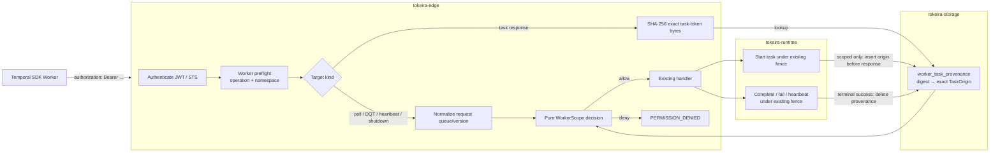

# Design Document: Scoped Worker Authorization

## Overview

This design adds a Tokeira-native `WorkerScope` attenuation to the configured authentication
foundation. It lets an ordinary Temporal SDK Worker use standard bearer metadata while limiting
that credential to:

- one exact namespace name;
- a non-empty set of normal task-queue names;
- one exact `(deployment_name, build_id)` pair; and
- the fixed Worker-operation matrix in
  [`requirements.md`](./requirements.md#fixed-operation-matrix).

The design is derived from:

- the approved [`requirements.md`](./requirements.md);
- `common/authorization/{interceptor.go,default_authorizer.go,roles.go}` and
  `common/api/metadata.go @ v1.31.0` for the existing role and admission behavior;
- vendored WorkflowService, Deployment, Worker, and Task Queue protos for request fields;
- `crates/tokeira-auth`, `crates/tokeira-edge/src/interceptors.rs`,
  `crates/tokeira-edge/src/workflow_service.rs`, and
  `crates/tokeira-edge/src/grpc/workflow_service.rs` for the current authorization chokepoint;
- committed run state and started-task DTOs for Workflow and Activity task origin;
- the existing query and Nexus correlation stores; and
- [`tokeira/tokeira#29`](https://github.com/tokeira/tokeira/issues/29) plus the sibling Yadori
  contract for the downstream untrusted-Worker boundary.

The design preserves Tokeira's architecture:

- `tokeira-auth` owns pure scope parsing and decisions.
- `tokeira-edge` owns request-aware admission and never decides Workflow semantics.
- Runtime started-task values expose the delivery origin they already know.
- A storage-owned authorization-provenance registry binds an exact opaque task-token digest to
  that origin after a scoped task start commits and before the token is returned.
- The provenance registry can only withhold scoped completion authority. It cannot complete a
  task, dispatch work, or alter Workflow state.
- The kernel, history, lanes, projection plane, and delivery ordering are unchanged.

Temporal v1.31.0 does not provide this resource-scoped credential. Its stock `Worker=1` role
satisfies none of the default author's Reader/Writer/Admin thresholds. The scope model and
provenance registry are therefore explicitly Tokeira-native; the unscoped default authorizer
continues to reproduce v1.31.0.

## Dependencies and Non-Goals

### Owning relationships

- **`authorization-foundation`** owns JWT/JWKS verification, AWS IAM presigned-STS verification,
  `Claims`, namespace roles, generic denial shape, principal attribution, and the
  `Authenticator`/`Authorizer` seams. This design extends those types without changing their
  ordinary decision path.
- **`worker-compute-controller`** owns provider invocation and scaling. It consumes no credential
  material and remains operational without this feature; safe untrusted guest polling depends
  on this spec.
- **Worker Deployments / versioned delivery** own routing and the exact version selected for a
  task. This design observes the final started-task origin; it does not choose routing.
- **Activity, Workflow Task, Query, Nexus, standalone-activity, HTTP gateway, and Worker
  inventory specs** retain their lifecycle semantics. This design adds admission around their
  existing handlers.
- **Tokeira configuration catalog generation** owns the canonical accepted-field inventory.
  This design adds typed fields and catalog metadata through that existing pipeline.

### Non-goals

- No credential issuer, token minting, refresh protocol, secret distribution, or provider API.
- No upstream proto modification and no new public RPC.
- No mTLS identity or client certificate mapping.
- No wildcard or multi-namespace Worker scope.
- No arbitrary operator-configured RPC permission list.
- No Activity By-ID authority for scoped identities.
- No unversioned, deprecated-build-only, or standalone-activity task delivery to scoped
  identities.
- No namespace-wide Worker inventory, Workflow visibility, or Workflow history access.
- No kernel command, kernel state field, transition effect, or history event.
- No new delivery ordering, broker correctness, lane affinity, or projection dependency.
- No requirement that unscoped Workers create provenance rows.

### New dependencies

No new third-party dependency is required. `sha2` is already a workspace dependency and already
used by `tokeira-storage`; it computes the non-secret digest of exact task-token bytes.
`proptest` is already the workspace property-test library. `tokeira-auth` gains one internal
dependency on `tokeira-types` for the shared `WorkerTaskClass`; `tokeira-types` has no auth
dependency, so this creates no cycle and keeps the decision engine transport-independent.

## Architecture

Authorization is a two-phase edge operation for resource-bearing Worker calls:

1. **Preflight** authenticates the bearer and checks that the API operation and request namespace
   are permitted. This preserves deny-before-namespace-existence and deny-before-token-detail
   behavior.
2. **Resource authorization** checks a normalized queue/version target. Poll, heartbeat,
   shutdown, and `DescribeTaskQueue` targets come from their request fields. Token responses
   obtain their target from the storage-owned task-provenance registry.

An unscoped identity follows the existing single-phase numeric-role decision. A scoped identity
never falls back to that role decision.



The provenance row is an authorization capability record, not Workflow authority:

- it is written only after the existing authoritative task-start transition commits;
- insertion failure withholds the token and lets existing timeout/retry recovery restore
  liveness;
- absence, expiry, or lookup failure never permits a scoped response;
- a stale row cannot bypass the runtime's existing task-token fencing;
- deleting a row cannot lose Workflow work; it can only force a scoped task to timeout and
  retry; and
- provenance is keyed by a digest of the exact opaque bytes, so changing any token field yields
  a lookup miss.

This storage shape is chosen over a process-local map because poll and response may reach
different edge replicas. It is chosen over a signed token extension because Tokeira has no
cluster-wide task-token signing secret and adding a secret/configuration lifecycle solely for
this feature would enlarge the production surface. It is chosen over kernel state because task
origin is an edge authorization concern, not replayable Workflow semantics.

## Components and Interfaces

### 1. Scope model and decision engine (`crates/tokeira-auth`)

`Claims` gains an optional normalized `WorkerScope`. `BTreeSet` gives deterministic queue order
without silently accepting duplicates: constructors reject duplicate source entries before
building the set.

```rust
#[derive(Clone, Debug, PartialEq, Eq, Serialize, Deserialize)]
pub struct WorkerScope {
    namespace: String,
    task_queues: BTreeSet<String>,
    deployment_name: String,
    build_id: String,
}

impl WorkerScope {
    pub fn try_new(
        namespace: String,
        task_queues: Vec<String>,
        deployment_name: String,
        build_id: String,
    ) -> Result<Self, WorkerScopeError>;

    pub fn authorize(
        &self,
        operation: WorkerOperation,
        namespace: &str,
        target: WorkerTarget<'_>,
    ) -> WorkerScopeDecision;
}

pub struct Claims {
    pub subject: String,
    pub system: Role,
    pub namespaces: HashMap<String, Role>,
    pub auth_type: String,
    pub worker_scope: Option<WorkerScope>,
}
```

`WorkerOperation` is the fixed code-owned operation matrix. It is deliberately not serialized
from production config.

```rust
#[derive(Clone, Copy, Debug, PartialEq, Eq)]
pub enum WorkerOperation {
    PollWorkflowTaskQueue,
    PollActivityTaskQueue,
    PollNexusTaskQueue,
    RespondWorkflowTaskCompleted,
    RespondWorkflowTaskFailed,
    RespondQueryTaskCompleted,
    RespondActivityTaskCompleted,
    RespondActivityTaskFailed,
    RespondActivityTaskCanceled,
    RecordActivityTaskHeartbeat,
    RespondNexusTaskCompleted,
    RespondNexusTaskFailed,
    RecordWorkerHeartbeat,
    ShutdownWorker,
    DescribeTaskQueue,
}

#[derive(Clone, Copy, Debug, PartialEq, Eq)]
pub enum WorkerTarget<'a> {
    /// Checks operation and namespace before a token or resource is decoded.
    Preflight,
    /// DQT or the top-level normal queue on shutdown.
    TaskQueue {
        normal_task_queue: &'a str,
    },
    /// Poll, token response, or heartbeat with exact code identity.
    VersionedTask {
        normal_task_queue: &'a str,
        task_class: tokeira_types::WorkerTaskClass,
        deployment_name: &'a str,
        build_id: &'a str,
    },
}
```

The pure decision procedure is:

1. deny when the namespace differs;
2. deny when the operation is not one of `WorkerOperation`;
3. allow `Preflight` only as a non-terminal admission phase;
4. require an Allowed_Queue for every resolved target;
5. require an exact non-empty Deployment-Version for `VersionedTask`;
6. require the target shape appropriate to the operation; and
7. never consult ordinary role bits when `Claims.worker_scope` is present.

`CallTarget` gains `worker: Option<WorkerCallTarget<'a>>`. `DefaultAuthorizer` preserves the
existing exact universal health check first, then branches on `claims.worker_scope`:

```rust
pub struct WorkerCallTarget<'a> {
    pub operation: WorkerOperation,
    pub target: WorkerTarget<'a>,
}

pub struct CallTarget<'a> {
    pub api_name: &'a str,
    pub namespace: Option<&'a str>,
    pub classification: CallClassification,
    pub worker: Option<WorkerCallTarget<'a>>,
}
```

For a scoped identity, `worker: None` is a denial except for exact `Health/Check` and
`GetSystemInfo`, which v1.31.0 permits before consulting claims
(`default_authorizer.go:37-43 @ v1.31.0`). That fail-closed default closes any non-health handler
that has not opted into the scoped Worker admission path. For an ordinary identity, `worker` is
ignored and the existing v1.31.0 numeric role procedure runs unchanged.

`WorkerScopeError` and `WorkerScopeDenyReason` are bounded enums. Their `Display` output is for
startup diagnostics and internal logs; the public response remains the authorization
foundation's generic denial.

### 2. JWT claim and configured rule resolution (`crates/tokeira-auth`)

The JWT module parses the fixed claim only after normal signature/issuer/audience/lifetime
verification:

```rust
const TOKEIRA_WORKER_SCOPE_CLAIM: &str = "tokeira_worker_scope";
const WORKER_SCOPE_VERSION: u32 = 1;

#[derive(Deserialize)]
#[serde(deny_unknown_fields)]
struct WorkerScopeClaimV1 {
    version: u32,
    namespace: String,
    task_queues: Vec<String>,
    deployment_name: String,
    build_id: String,
}
```

The verified JSON map remains the source so the existing configurable `permissions_claim`
continues to work. If the fixed claim exists, deserialization is strict and any error aborts
authentication. Missing claim preserves current behavior.

Configured scope rules reuse `GlobPattern`:

```rust
pub struct WorkerScopeRule {
    pattern: GlobPattern,
    scope: WorkerScope,
}

#[derive(Clone, Debug, Default)]
pub struct WorkerScopeRules {
    rules: Vec<WorkerScopeRule>,
}

impl WorkerScopeRules {
    pub fn resolve(&self, identity: &str) -> Result<Option<WorkerScope>, ScopeConflict>;
}
```

Resolution collects matching normalized scopes:

- zero distinct scopes → no configured scope;
- one distinct scope → that scope;
- repeated equal scopes → one scope;
- more than one distinct scope → authentication failure.

For JWT, a signed claim and configured result are resolved by the same equality rule. For STS,
only ARN rules participate. Existing role `GrantRules` continue to union independently, but the
authorizer attenuation makes those roles unable to widen a resolved Worker scope.

`JwtIssuerProfile` and `StsAuthenticator` each receive `WorkerScopeRules` beside `GrantRules`.
`MultiSourceClaimMapper` needs no new routing behavior.

### 3. Typed configuration (`crates/tokeira-config`)

The new strict types mirror the approved TOML:

```rust
#[derive(Clone, Debug, Default, PartialEq, Eq, Serialize, Deserialize)]
#[serde(deny_unknown_fields)]
pub struct JwtWorkerScopeConfig {
    pub match_sub: String,
    pub namespace: String,
    pub task_queues: Vec<String>,
    pub deployment_name: String,
    pub build_id: String,
}

#[derive(Clone, Debug, Default, PartialEq, Eq, Serialize, Deserialize)]
#[serde(deny_unknown_fields)]
pub struct AwsIamWorkerScopeConfig {
    pub match_arn: String,
    pub namespace: String,
    pub task_queues: Vec<String>,
    pub deployment_name: String,
    pub build_id: String,
}
```

`JwtIssuerConfig` gains `worker_scopes: Vec<JwtWorkerScopeConfig>`;
`AwsIamAuthorizationConfig` gains `worker_scopes: Vec<AwsIamWorkerScopeConfig>`.

`AuthorizationConfig::has_identity_source()` remains unchanged: a JWT issuer or AWS IAM table
activates enforcement. A scope rule cannot exist outside one of those verified identity sources.
An AWS IAM table is valid when it has at least one ordinary grant **or** one Worker-Scope rule;
the existing “empty source” boot error remains for a table with neither.

Validation reuses:

- `GlobPattern::new` for `match_sub`/`match_arn`;
- `WorkerScope::try_new` for resource validation; and
- the config crate's indexed `ValidationError::Field` reporting.

There is no `enabled`, claim-name, operation-list, wildcard, TTL, or token-signing config.

### 4. Started-task origin (`tokeira-types` and `tokeira-runtime`)

The shared transport-neutral origin type lives in `tokeira-types`:

```rust
#[derive(Clone, Debug, PartialEq, Eq, Hash, Serialize, Deserialize)]
pub struct WorkerTaskOrigin {
    pub namespace_id: NamespaceId,
    pub normal_task_queue: TaskQueueName,
    pub task_class: WorkerTaskClass,
    pub deployment: DeploymentId,
    pub build_id: BuildId,
}
```

`WorkerTaskClass` lives in `tokeira-types` and is shared directly by auth, runtime, edge, and
storage. The implementation must not move auth policy into `tokeira-types`.

Runtime already knows the final delivery target:

- Workflow start has the committed run's normal queue and the final `offered.queue`
  deployment/build, including sticky delivery and Worker Deployment routing.
- Activity start has the Activity's normal queue and final `DispatchableActivityTask.queue`
  deployment/build after routing.
- Query delivery has `QueryTask.queue`.
- Nexus delivery has `NexusQueueKey`.

The existing started/delivered DTOs gain a plain `origin: WorkerTaskOrigin`. It is returned data,
not kernel or persisted Workflow state:

```rust
pub struct StartedWorkflowTask {
    // existing fields
    pub origin: WorkerTaskOrigin,
}

pub struct StartedActivityTask {
    // existing fields
    pub origin: WorkerTaskOrigin,
}

pub struct QueryTask {
    // existing fields
    pub origin: WorkerTaskOrigin,
}

pub struct NexusTask {
    // existing fields
    pub origin: WorkerTaskOrigin,
}
```

An unversioned task cannot construct the exact origin required by scoped authorization and is
therefore never returned to a scoped poll. Ordinary delivery continues to represent unversioned
origins internally as today.

For Workflow sticky delivery, `normal_task_queue` is always the stable run queue, while
deployment/build come from the actual final sticky or normal queue key. This is the
requirements-level distinction between authorizing the normal alias and allowing the ephemeral
sticky name.

### 5. Durable task-provenance registry (`crates/tokeira-storage`)

`WorkerTaskProvenance` binds a digest of the exact public token bytes to the exact origin:

```rust
#[derive(Clone, Debug, PartialEq, Eq)]
pub struct WorkerTaskProvenance {
    pub token_digest: [u8; 32],
    pub origin: WorkerTaskOrigin,
    pub expires_at: OffsetDateTime,
    pub created_at: OffsetDateTime,
}

#[derive(Clone, Copy, Debug, PartialEq, Eq)]
pub enum ProvenancePut {
    Inserted,
    AlreadyPresent,
}

#[async_trait]
pub trait WorkerTaskProvenanceStore: Send + Sync {
    async fn put(
        &self,
        record: WorkerTaskProvenance,
    ) -> Result<ProvenancePut, WorkerTaskProvenanceError>;

    async fn get(
        &self,
        token_digest: [u8; 32],
    ) -> Result<Option<WorkerTaskProvenance>, WorkerTaskProvenanceError>;

    async fn delete(
        &self,
        token_digest: [u8; 32],
    ) -> Result<(), WorkerTaskProvenanceError>;

    async fn delete_expired(
        &self,
        now: OffsetDateTime,
        limit: usize,
    ) -> Result<usize, WorkerTaskProvenanceError>;
}
```

The digest is `SHA-256(public_task_token_bytes)`, domain-separated with the fixed prefix
`tokeira-worker-task-provenance-v1\0`. It is an index key, not a signature. Security comes from
the server-side row: a caller changing token bytes cannot create the corresponding row.

`put` is idempotent only when an existing digest has the exact same origin and expiry. A digest
collision with different data is a storage-corruption error and never overwrites.

The DSQL schema is a new base-table migration followed by its asynchronous expiry index, one
statement per migration:

```sql
CREATE TABLE IF NOT EXISTS worker_task_provenance (
    token_digest BYTEA NOT NULL,
    namespace_id UUID NOT NULL,
    normal_task_queue TEXT NOT NULL,
    task_class SMALLINT NOT NULL,
    deployment_name TEXT NOT NULL,
    build_id TEXT NOT NULL,
    expires_at TIMESTAMPTZ NOT NULL,
    created_at TIMESTAMPTZ NOT NULL,
    PRIMARY KEY (token_digest)
)
```

```sql
CREATE INDEX ASYNC idx_worker_task_provenance_expiry
ON worker_task_provenance (expires_at, token_digest)
```

The final migration numbers are assigned from the contiguous migration tail at implementation
time. The in-memory store implements the same idempotency, conflict, expiry, and deletion
semantics.

Expiry is the existing server-authored task deadline:

- Workflow Task: `started_time + workflow_task_timeout`;
- Activity Task: the earliest applicable start-to-close or schedule-to-close deadline;
- Query: the pending query's server deadline; and
- Nexus: the dispatch deadline retained by the request/correlation.

No arbitrary production TTL is added. The bounded expiry scanner deletes in batches and is
liveness/space maintenance only. An expired row authorizes nothing, even before physical
deletion.

### 6. Two-phase interceptor admission (`crates/tokeira-edge/src/interceptors.rs`)

`Authenticator::authorize` and `CallTarget` accept an optional `WorkerCallTarget`.
`EdgeInterceptors` exposes:

```rust
pub async fn begin_worker_preflight(
    &self,
    headers: &HeaderMap,
    namespace_name: Option<&str>,
    action: Action,
    operation: WorkerOperation,
    is_long_poll: bool,
) -> EdgeResult<EdgeContext>;

pub async fn authorize_worker_target(
    &self,
    context: &EdgeContext,
    action: Action,
    operation: WorkerOperation,
    namespace_name: &str,
    target: WorkerTarget<'_>,
) -> EdgeResult<()>;
```

`begin_worker_preflight` performs:

1. request ID;
2. authentication;
3. `WorkerTarget::Preflight` authorization;
4. namespace resolution; and
5. context construction.

`authorize_worker_target` reuses the already authenticated claims and authorizer. It never reruns
JWKS or STS work.

For an Ordinary_Identity, preflight runs the existing role decision and final authorization is
observably redundant. For a Scoped_Identity, preflight proves only API+namespace and final
authorization proves the resource. No handler effect may occur between the phases.

`Action` gains distinct By-ID variants:

- `RespondActivityTaskCompletedById`;
- `RespondActivityTaskFailedById`;
- `RespondActivityTaskCanceledById`; and
- `RecordActivityTaskHeartbeatById`.

They retain the v1.31.0 namespace-Write classification for Ordinary_Identities but intentionally
map to no `WorkerOperation`. A Scoped_Identity therefore hits the `worker: None` fail-closed
branch.

`Action::worker_operation()` is a total explicit mapping over the fixed allowed operations. No
wildcard action arm exists.

### 7. Poll and inline-return admission (`crates/tokeira-edge`)

Workflow, Activity, and Nexus poll handlers retain the complete wire target during translation:

- namespace;
- queue kind/name and sticky `normal_name`;
- `worker_instance_key`;
- `worker_control_task_queue` where present; and
- normalized `WorkerDeploymentOptions`.

Poll flow:

1. translate enough fields to construct a target;
2. run preflight;
3. validate normal/sticky queue and exact VERSIONED deployment/build;
4. validate or establish the Worker session association described below;
5. run final resource authorization;
6. call the existing runtime poll;
7. if the returned context is scoped, serialize the final public token bytes;
8. insert provenance with the returned task's actual origin;
9. return the response only after successful insertion.

If provenance insertion fails, the task has already started but its token is not exposed. The
handler returns `UNAVAILABLE`; existing task timeout/retry recovers it. There is no rollback
command and no queue repair action.

The same provenance-before-exposure rule applies to:

- legacy query tasks returned on Workflow poll;
- `RespondWorkflowTaskCompleted.workflow_task`;
- eager Activity tasks in `RespondWorkflowTaskCompleted.activity_tasks`; and
- Nexus poll responses.

Before claiming an optional eager or inline task for a Scoped_Identity, the edge compares its
actual target with the scope. An out-of-scope optional return is skipped and its normal durable
dispatch remains available to a correctly scoped poller. If an in-scope optional task is claimed
but provenance insertion fails, it is withheld and recovers through normal timeout.

The CHASM standalone-activity bridge remains before the workflow-activity broker only after full
scoped admission. Because standalone activities are unversioned, a Scoped_Identity never enters
the bridge; an Ordinary_Identity observes the existing configured behavior.

### 8. Token-response admission and lifecycle

For non-empty request namespaces:

1. authenticate and preflight the API+namespace;
2. decode the task token;
3. preserve the existing namespace-ID mismatch validation;
4. compute the exact token digest;
5. load non-expired provenance;
6. require provenance `namespace_id` to equal the resolved namespace's stable ID;
7. authorize its exact queue/class/version origin;
8. invoke the existing runtime/correlation response; and
9. delete provenance only after successful terminal consumption.

For an omitted request namespace, the existing v1.31.0 precedence remains: decode/back-fill the
namespace first, then authenticate/preflight, then look up provenance.

Activity heartbeat is non-terminal and retains provenance. Activity completion, failure, and
cancellation delete it after the runtime accepts the response. Workflow completion/failure,
Query completion, and Nexus completion/failure delete it after their existing terminal
correlation or transition succeeds.

Deletion failure after a successful response is logged and retried by expiry cleanup. The stale
row grants no extra authority because the runtime token/correlation has already been consumed or
fenced. Lookup failure or expiry denies before mutation. Store unavailability returns
`UNAVAILABLE` before mutation.

The query pending store and Nexus correlation remain required for their existing result routing;
provenance is an additional authorization check, not a replacement. Nexus correlation also
retains the actual `NexusQueueKey` and verifies it agrees with the public token's namespace/queue
before final authorization.

### 9. Worker lifecycle/session association (`crates/tokeira-edge`)

Request fields such as `identity`, `worker_instance_key`, sticky queue, and
`worker_control_task_queue` are caller supplied and cannot independently prove resource
authority. A small volatile `ScopedWorkerSessionRegistry` prevents those fields from targeting
another Worker session:

```rust
pub struct ScopedWorkerSessionKey {
    namespace_id: NamespaceId,
    subject: String,
    worker_instance_key: WorkerInstanceKey,
}

pub struct ScopedWorkerSession {
    scope: WorkerScope,
    worker_identity: WorkerIdentity,
    normal_task_queue: TaskQueueName,
    worker_control_task_queue: Option<TaskQueueName>,
    sticky_task_queues: BTreeSet<TaskQueueName>,
}
```

After full poll authorization and before registering a broker waiter, the first scoped poll
creates the session. Later polls may add a sticky queue after proving its `normal_name`, but
cannot change scope, identity, normal queue, or non-empty control queue. Conflicts deny before
poll registration.

`ShutdownWorker` requires a matching session for its subject, worker-instance key, identity,
normal queue, optional sticky queue, and optional control/heartbeat information. A missing
session fails closed; the Worker poll naturally times out if shutdown reaches another replica
after session loss. This is a bounded liveness deviation, never a cross-worker mutation.

Session state is intentionally not durable:

- it does not authorize task completion;
- loss cannot widen access;
- stale entries expire with the existing Worker/poller history horizon; and
- durable readiness remains the heartbeat/poller surfaces, not this guard.

### 10. Heartbeat and shutdown admission

`RecordWorkerHeartbeat` performs preflight once, translates all repeated heartbeats without
inserting, and validates every element:

- enclosing namespace matches;
- heartbeat task queue is allowed;
- deployment version is present and exact; and
- all structural Worker heartbeat validation succeeds.

Only after the whole batch passes are existing store insertions performed. To avoid partial
mutation if the store fails mid-batch, the heartbeat store interface gains an atomic
`insert_batch(Vec<HeartbeatObservation>)` operation; the in-memory implementation acquires one
lock and DSQL/other future implementations use one transaction.

Nexus piggyback heartbeats run the same batch validator before session registration, heartbeat
insertion, or broker poll.

`ShutdownWorker` validates:

- namespace preflight;
- non-empty Allowed_Queue;
- matching scoped Worker session;
- any heartbeat under the batch rules; and
- any sticky queue under the session binding.

Only then does it insert the shutdown heartbeat and deny the sticky poller. When the existing
v1.31.0 `frontend.enableCancelWorkerPollsOnShutdown` policy is enabled, it also cancels normal
outstanding polls for only the task-queue types named by the SDK (defaulting an absent list to
Workflow and Activity exactly as v1.31.0 does). With the stock-default-off policy, those polls
are terminated by the SDK after the namespace capability advertises `false`. These effects remain
in their current edge/runtime components; Nexus cancellation is disposable broker state and never
enters the kernel.

### 11. DescribeTaskQueue

`DescribeTaskQueue` has a fully request-declared target, so it uses preflight followed by
`WorkerTarget::TaskQueue`. Report mode, version selectors, task-queue types, and stats flags
select response shape only; they never widen the queue target.

The existing response is not filtered by credential version. It describes the authorized queue
family and preserves all PollerInfo rows, including exact Deployment name and Build ID. Yadori
selects its exact pair from that result. This matches the approved requirement and avoids
inventing a filtered DQT behavior that v1.31.0 does not promise.

### 12. Bootstrap, catalog, and documentation

`apps/tokeirad/src/lib.rs::build_authorization_stack` builds `WorkerScopeRules` beside existing
`GrantRules` for each JWT issuer and AWS IAM source. The same `DefaultAuthorizer` instance serves
ordinary and scoped decisions.

Bootstrap also supplies:

- `Arc<dyn WorkerTaskProvenanceStore>` to the Workflow service;
- `ScopedWorkerSessionRegistry`; and
- a bounded provenance-expiry maintenance task using the existing cancellation/lifecycle
  pattern.

The Feature Catalog gains `scoped-worker-authorization`, classified as:

- Tokeira-native;
- implemented when this spec is complete;
- presence-activated by a signed or configured Worker scope;
- default inert; and
- dependent on configured JWT or AWS IAM verification.

`config.example.toml` and
`docs/conformance/v1.31.0/tokeira-configuration.md` gain the fixed claim, static mapping
examples, attenuation warning, exact VERSIONED requirement, and standard SDK bearer-supplier
example. No real token, private key, presigned URL, or tenant identifier is committed.

## Data Models

### Normalized Worker scope

| Field | Type | Source | Persistence |
|---|---|---|---|
| `namespace` | `String` | signed claim / static mapping | authenticated Claims only |
| `task_queues` | `BTreeSet<String>` | signed claim / static mapping | authenticated Claims only |
| `deployment_name` | `String` | signed claim / static mapping | authenticated Claims only |
| `build_id` | `String` | signed claim / static mapping | authenticated Claims only |

### Task origin

| Field | Type | Source | Persistence |
|---|---|---|---|
| `namespace_id` | `NamespaceId` | resolved namespace / final queue key | provenance row |
| `normal_task_queue` | `TaskQueueName` | committed run/activity or final query/Nexus queue | provenance row |
| `task_class` | `WorkerTaskClass` | actual returned task variant | provenance row |
| `deployment` | `DeploymentId` | final versioned delivery key | provenance row |
| `build_id` | `BuildId` | final versioned delivery key | provenance row |

### Provenance record

| Field | Type | Source | Persistence |
|---|---|---|---|
| `token_digest` | `[u8; 32]` | domain-separated SHA-256 of exact response token bytes | DSQL primary key |
| `origin` | `WorkerTaskOrigin` | actual started/delivered task | DSQL columns |
| `expires_at` | `OffsetDateTime` | existing task deadline | DSQL + expiry index |
| `created_at` | `OffsetDateTime` | edge insertion time | DSQL diagnostics |

No bearer, subject, role, task payload, Workflow ID, Activity ID, Run ID, or raw task token is
stored in provenance.

## Correctness Properties

Every property below becomes a required `proptest` task with at least 100 generated cases.

### Property 1: Worker-Scope normalization and validation

*For any* namespace, queue vector, deployment name, and build ID, `WorkerScope::try_new` accepts
exactly the inputs with non-blank exact resource strings, a non-empty duplicate-free queue list,
and no wildcard syntax; every accepted result exposes queues in lexical order and round-trips
through serde without changing equality.

**Validates: Requirements 1.1, 1.5-1.10, 12.1**

### Property 2: Scope-source resolution is non-composable

*For any* identity, configured rule set, and optional signed Worker scope, resolution returns no
scope for zero matches, one normalized scope for one or repeated-equal matches, and an error for
two distinct matches; role grants never change that result.

**Validates: Requirements 3.3, 3.5-3.12, 12.3**

### Property 3: Fixed JWT claim parsing is fail-closed

*For any* verified JWT JSON value at `tokeira_worker_scope`, parsing accepts exactly the
version-1, known-field, correctly typed values accepted by Property 1; absence preserves
ordinary claims, while any present malformed value rejects instead of falling back to roles.

**Validates: Requirements 2.1-2.10, 12.2**

### Property 4: Scoped authorizer decision matrix

*For any* Claims, API action, namespace, and Worker target, the authorizer follows this reference
model: the exact universal health set allows before claims; ordinary Claims otherwise use the
existing numeric role decision; scoped Claims ignore roles, deny an absent non-health Worker
target, allow preflight only for a fixed Worker operation in the exact namespace, and allow a
resolved target only when its shape, queue, and exact version satisfy the Fixed Operation Matrix.

**Validates: Requirements 1.2-1.4, 4.2-4.5, 5.1-5.12, 8.1-8.2, 9.2-9.4, 9.7,
9.12, 11.1-11.3, 12.4**

### Property 5: Poll-target normalization

*For any* normal or sticky TaskQueue wire value and any WorkerDeploymentOptions, target
normalization authorizes a scoped poll exactly when the normal queue is allowed, mode is
VERSIONED, and both version coordinates match; deprecated-only, partial, unversioned, missing
sticky-normal-name, and mismatched inputs deny before poll state exists.

**Validates: Requirements 5.1-5.15, 12.5**

### Property 6: Provenance-store state machine

*For any* token byte string, origin, expiry, and sequence of put/get/delete/expire operations,
the in-memory and DSQL-model stores equal a reference map keyed by the domain-separated SHA-256
digest: equal duplicate puts are idempotent, conflicting puts fail without overwrite, expired
rows never read as authority, deletes are idempotent, and bounded expiry removes no live row.

**Validates: Requirements 6.5-6.7, 6.12-6.13, 4.3, 4.10**

### Property 7: Exact-token origin binding

*For any* recorded task token and origin, changing any token byte or any claimed scope coordinate
cannot produce an allowed scoped response; the unchanged token is allowed only for a scope
matching every origin coordinate.

**Validates: Requirements 6.1-6.7, 6.10-6.11, 12.6**

### Property 8: Heartbeat batch atomicity

*For any* preexisting heartbeat-store state and generated repeated heartbeat request, the batch
changes the store exactly when every heartbeat matches the scope and validates structurally; any
mismatch or insertion failure leaves the complete pre-request state unchanged.

**Validates: Requirements 9.1-9.6, 12.10**

### Property 9: Scoped Worker-session monotonicity

*For any* session key and sequence of poll/shutdown observations, the first fully authorized poll
fixes scope, identity, normal queue, and non-empty control queue; later equal observations may add
authorized sticky queues, conflicting observations never change the session, and shutdown
effects are eligible only for an exact session match.

**Validates: Requirements 5.13-5.14, 9.7-9.11, 12.11**

### Property 10: Workflow-completion return filtering

*For any* scoped Own_Task completion and generated set of same-namespace commands, eager Activity
targets, inline Workflow targets, and cross-namespace targets, valid same-namespace commands
remain unchanged, unauthorized cross-namespace commands reject the whole completion, and
optional returned tasks are exposed exactly when their actual origin matches scope; withheld
tasks retain durable dispatch.

**Validates: Requirements 7.1-7.8, 12.8-12.9**

### Property 11: Configuration validation and round-trip

*For any* generated authorization configuration, TOML encode/decode is lossless for valid scope
rules; invalid patterns or Worker scopes produce indexed field errors; and an AWS IAM source is
considered non-empty when it has an ordinary grant or a Worker-Scope rule.

**Validates: Requirements 3.1-3.4**

### Property 12: Ordinary-identity preservation

*For any* ordinary Claims and CallTarget from the full Action classification, adding this feature
does not change the DefaultAuthorizer decision or computed principal relative to the
authorization-foundation reference implementation.

**Validates: Requirements 1.4, 4.7, 11.1-11.3**

### Property 13: Bounded denial classification

*For any* scoped authorization rejection, the internal reason maps to exactly one bounded metric
label from `operation`, `namespace`, `queue`, `version`, `task_origin`, `heartbeat`, `shutdown`,
or `ambiguous_mapping`; public formatting contains none of the scope coordinates, bearer bytes,
or task-token bytes.

**Validates: Requirements 11.4-11.6**

## Integration and Structural Invariants

These guarantees are tested with focused integration or structural tests rather than generated
pure-model inputs.

### Invariant I1: No effect before final authorization

For every poll, response, heartbeat, shutdown, DQT, CHASM, legacy-token, Nexus piggyback, and HTTP
gateway path, a scoped mismatch leaves broker waiters, task starts, correlations, heartbeat
state, poll cancellation, and committed transitions unchanged.

**Validates: Requirements 4.1-4.3, 4.6, 5.13, 6.7, 9.5-9.11, 10.1-10.8, 12.12**

### Invariant I2: Token error precedence

An explicit namespace is authenticated/preflighted before malformed-token or namespace-mismatch
details become observable; an omitted namespace preserves the existing token-decode/backfill
precedence; after scoped admission, malformed/stale/fenced tokens retain existing status
mapping.

**Validates: Requirements 4.6-4.7, 6.8, 10.6**

### Invariant I3: Provenance cannot complete work

Creating, retaining, deleting, expiring, corrupting, or losing a provenance row never starts,
completes, fails, cancels, heartbeats, or dispatches a Workflow/Activity/Nexus task. Runtime
fencing remains necessary for every accepted response.

**Validates: Requirements 4.8-4.10, 6.11-6.13**

### Invariant I4: Fixed deny surface

Every Activity By-ID RPC and every WorkflowService/OperatorService operation absent from the
Fixed Operation Matrix and universal health set denies a Scoped_Identity, including
`ResetStickyTaskQueue`, `ListWorkers`, and `DescribeWorker`.

**Validates: Requirements 6.9, 8.5, 9.12, 10.6, 12.7**

### Invariant I5: Readiness contract

A standard SDK Worker bearing a valid Worker scope can poll and complete Workflow, Activity, and
Nexus tasks and can observe its exact version through `DescribeTaskQueue`; the same credential
cannot poll another queue/version or call namespace-wide read/write APIs.

**Validates: Requirements 8.1-8.7, 12.13-12.16**

### Invariant I6: Kernel and history isolation

The dependency graph, kernel state codecs, transition types, history event codecs, and migrations
for authoritative run state remain byte-for-byte unchanged by scoped authorization.

**Validates: Requirements 4.8-4.10, 10.8**

### Invariant I7: Credential confidentiality

Logs, metrics, provenance rows, config examples, and docs contain no bearer token, presigned STS
URL, task payload, raw task token, or real secret.

**Validates: Requirements 2.10, 11.4-11.6, 11.10-11.11**

### Invariant I8: Operator surface is explicit

The Feature Catalog and public Tokeira configuration guide identify this as a default-inert
Tokeira-native extension, enumerate both static mapping shapes and the fixed JWT claim, explain
attenuation and external credential ownership, show a secret-free standard SDK example, require
the exact VERSIONED pair, and cite the relevant compatibility evidence.

**Validates: Requirements 11.7-11.13**

## Error Handling

| Condition | Internal error / reason | External result |
|---|---|---|
| Invalid configured scope/pattern | `ValidationError::Field` | startup failure naming indexed field |
| Malformed present JWT scope | `AuthError::InvalidWorkerScope` | `PERMISSION_DENIED`, `Request unauthorized.` |
| Conflicting signed/configured scopes | `AuthError::WorkerScopeConflict` | generic `PERMISSION_DENIED` |
| Scoped API absent from fixed matrix | `WorkerScopeDenyReason::Operation` | generic `PERMISSION_DENIED` |
| Request namespace differs | `WorkerScopeDenyReason::Namespace` | generic `PERMISSION_DENIED` before namespace lookup |
| Queue differs / sticky normal name absent | `WorkerScopeDenyReason::Queue` | generic `PERMISSION_DENIED` before poll/DQT effect |
| Mode unversioned, partial, deprecated-only, or version differs | `WorkerScopeDenyReason::Version` | generic `PERMISSION_DENIED` before poll effect |
| Worker control/session mismatch | `WorkerScopeDenyReason::WorkerSession` | generic `PERMISSION_DENIED` |
| By-ID Activity response | no `WorkerOperation` target | generic `PERMISSION_DENIED` |
| Task provenance missing or expired | `WorkerScopeDenyReason::TaskOrigin` | generic `PERMISSION_DENIED` before response effect |
| Task provenance store unavailable on lookup | `WorkerTaskProvenanceError::Unavailable` | `UNAVAILABLE`, no response effect |
| Provenance insertion unavailable after start | `WorkerTaskProvenanceError::Unavailable` | `UNAVAILABLE`, token withheld; normal timeout/retry |
| Digest row conflicts with different origin | `WorkerTaskProvenanceError::Conflict` | `INTERNAL`, token withheld |
| Malformed task token after authorized explicit-namespace preflight | existing token decode error | existing `INVALID_ARGUMENT` |
| Token namespace mismatch | existing namespace validator | existing `INVALID_ARGUMENT` |
| Stale/fenced task token after scoped origin allow | existing runtime error | existing v1.31.0-compatible status |
| Mixed-scope heartbeat batch | `WorkerScopeDenyReason::Heartbeat` | generic `PERMISSION_DENIED`, no insert |
| Heartbeat batch storage failure | `HeartbeatStoreError` | existing `INTERNAL`, no partial insert |
| Shutdown target mismatch | `WorkerScopeDenyReason::Shutdown` | generic `PERMISSION_DENIED`, no lifecycle effect |
| DQT queue mismatch | `WorkerScopeDenyReason::Queue` | generic `PERMISSION_DENIED`, no stats/poller read |

Authorizer implementation-error exposure remains governed by
`policy.authorization.expose_authorizer_errors`. Resource mismatches are intentional denials, not
implementation errors, and therefore never expose internal coordinates.

## Testing Strategy

### Property tests

Use workspace `proptest`, at least 100 cases, with
`// Feature: scoped-worker-authorization, Property N` tags:

| Properties | Home |
|---|---|
| P1-P4, P7, P12-P13 | `crates/tokeira-auth` |
| P5, P9-P10 | `crates/tokeira-edge` |
| P6 | `crates/tokeira-storage` in-memory store + pure DSQL record model |
| P8 | `crates/tokeira-runtime/src/heartbeat.rs` |
| P11 | `crates/tokeira-config` |

### Example-based unit tests

- exact Fixed Operation Matrix rows and By-ID Action split;
- exact version-1 JWT claim examples and fixed claim name;
- config field-path diagnostics;
- Workflow sticky `normal_name`;
- partial/deprecated/unversioned poll forms;
- Worker control queue and session conflicts;
- token digest domain separation;
- provenance put conflict and expiry boundary;
- heartbeat all-or-nothing failure injection;
- `DescribeTaskQueue` report/version selector non-authority;
- CHASM denial before bridge call; and
- exact public error codes/messages from the Error Handling table.

### Integration tests

- **Auth-stack integration:** locally signed JWT through real `PolicyAuthenticator`, including
  signed claim, subject mapping, AWS IAM mapping fixture, conflict, and ordinary-role
  preservation.
- **Real gRPC Worker:** standard Temporal SDK auth metadata supplier; exact VERSIONED Workflow,
  Activity, and Nexus poll/response; heartbeat; shutdown; DQT readiness.
- **Negative scope matrix:** same credential against wrong namespace, queue, deployment, build,
  unversioned mode, By-ID response, ListWorkers, DescribeWorker, visibility, and Workflow start.
- **Universal health regression:** `Health/Check` and `GetSystemInfo` remain callable with no
  token and with a scoped token, preserving SDK connect behavior.
- **Provenance lifecycle:** poll→record→heartbeat-retain→terminal-delete; edge-process
  reconstruction against the same DSQL store; missing/expired/store-unavailable fail closed.
- **Mutation guards:** instrumented broker/runtime/heartbeat/session stores prove every denial is
  side-effect free.
- **Workflow completion:** same-namespace commands accepted; cross-namespace rejected; out-of-scope
  eager/inline returns withheld without durable work loss.
- **Path closure:** direct gRPC, HTTP/gRPC gateway, legacy token, query, Nexus piggyback heartbeat,
  and CHASM fast path.
- **Yadori contract:** record the exact tokeira commit and sibling contract revision used to
  launch a Firecracker guest and satisfy exact-version `DescribeTaskQueue` readiness.

### Structural checks

- `tokeira-kernel` source and dependency graph remain untouched.
- No Tokeira field is added to vendored upstream protos.
- Migration versions are contiguous; DDL validator accepts both new statements.
- Provenance schema stores no raw credential, subject, task token, or payload.
- Every `Action` is classified; every Fixed Operation Matrix row maps explicitly; every By-ID
  action maps to no Worker operation.
- Every public Worker task exposure site records provenance for a Scoped_Identity before return.
- Generated configuration inventory and Feature Catalog remain in sync with typed config.
