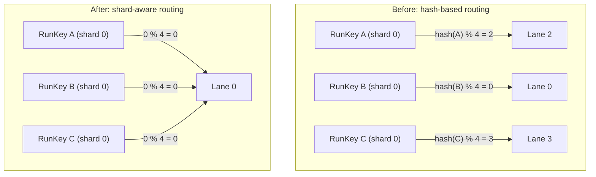
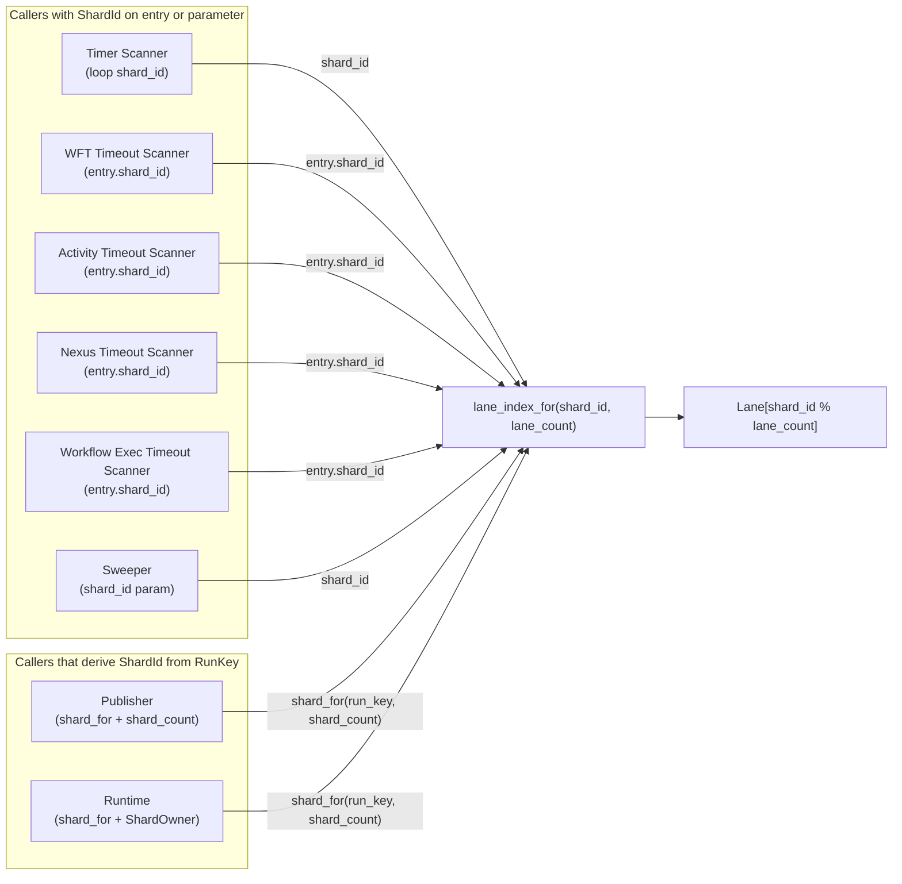

# Design Document: Shard-Aware Lane Routing

## Overview

This design replaces the hash-based lane routing in `scanner.rs` with shard-aware routing. Today, `lane_index_for` hashes a `RunKey` to pick a lane — this scatters runs from the same shard across all lanes. When a shard moves between nodes, every lane must drain affected runs, making shard movement expensive.

The fix is simple: route by `shard_id % lane_count` instead of `hash(run_key) % lane_count`. All runs in the same shard land on the same lane, so shard acquisition/relinquishment only affects one lane.

The change touches two core functions in `scanner.rs` and their callers across six subsystems: timer scanner, WFT timeout scanner, activity timeout scanner, nexus timeout scanner, recovery sweeper, publisher, and the runtime facade.

## Architecture



### Caller routing flow



### Key Design Decisions

1. **`shard_id.0 as usize % lane_count` — no hashing needed.** ShardId is already a well-distributed integer produced by `shard_for`. Hashing it would add cost with no benefit. The modulo operation is sufficient.

2. **Two caller patterns, not one.** Callers with shard context (all timeout scanners via `entry.shard_id`, timer scanner via loop `shard_id`, sweeper via parameter) pass it directly. Callers that only have `run_key` (publisher, runtime) derive `shard_id` via `shard_for(run_key, shard_count)`. Only the latter two need `shard_count`.

3. **Timeout scanners use `entry.shard_id`, not the loop variable.** Each tracking entry (`WftTimeoutEntry`, `ActivityTrackingEntry`, `NexusTimeoutEntry`, `WorkflowTimeoutEntry`) already carries `shard_id`. Using `entry.shard_id` is safer than the loop variable because it works correctly even if the scan helper is ever called in unfiltered mode (no shard parameter).

4. **Timer scanner uses the loop `shard_id`.** The timer scanner iterates `for shard_id in active_shards` and queries `list_due_timers_for_shard(shard_id, ...)`. The due-timer entries don't carry `shard_id`, so the loop variable is the correct source.

5. **Publisher already has `shard_count`.** The `RuntimeDispatchPublisher` constructor already accepts `shard_count: u32` (added during the sharding spec). Its `pick_lane` method just needs to call `shard_for` before delegating.

6. **Runtime gets `shard_count` from `ShardOwner`.** `TokeiraRuntime` holds `Arc<RwLock<ShardOwner>>`, and `ShardOwner::shard_count()` returns the value. The runtime's `pick_lane` and `lane_index` methods read it once per call.

7. **Sweeper passes `shard_id` directly.** `sweep_shard` already receives `shard_id: ShardId` as its first parameter. The due-timer loop passes it straight to `pick_lane`. No `shard_count` needed on this path.

## Components and Interfaces

### Core routing functions (`scanner.rs`)

**Before:**
```rust
pub(crate) fn lane_index_for(run_key: RunKey, lane_count: usize) -> usize {
    let mut hasher = std::collections::hash_map::DefaultHasher::new();
    run_key.hash(&mut hasher);
    (hasher.finish() as usize) % lane_count.max(1)
}

pub(crate) fn pick_lane(
    lanes: &[LaneHandle], lane_count: usize, run_key: RunKey,
) -> &LaneHandle {
    &lanes[lane_index_for(run_key, lane_count.max(1)) % lanes.len()]
}
```

**After:**
```rust
pub(crate) fn lane_index_for(shard_id: ShardId, lane_count: usize) -> usize {
    (shard_id.0 as usize) % lane_count.max(1)
}

pub(crate) fn pick_lane(
    lanes: &[LaneHandle], lane_count: usize, shard_id: ShardId,
) -> &LaneHandle {
    debug_assert!(!lanes.is_empty());
    debug_assert_eq!(lanes.len(), lane_count.max(1));
    &lanes[lane_index_for(shard_id, lane_count.max(1)) % lanes.len()]
}
```

The `Hash` import and `DefaultHasher` usage are removed.

### Caller migrations

| Caller | File | Current arg | New arg | How |
|--------|------|-------------|---------|-----|
| `run_timer_scanner` closure | `scanner.rs` | `due.run_key` | `shard_id` | Captured from `for shard_id in active_shards` |
| `run_wft_timeout_scanner` closure | `wft_timeout.rs` | `entry.run_key` | `entry.shard_id` | Use `entry.shard_id` from `WftTimeoutEntry` |
| `scan_activity_timeouts_once` | `activity_timeout.rs` | `entry.run_key` | `entry.shard_id` | Use `entry.shard_id` from `ActivityTrackingEntry` (works for both filtered and unfiltered scans) |
| `run_nexus_timeout_scanner` closure | `nexus.rs` | `entry.run_key` | `entry.shard_id` | Use `entry.shard_id` from `NexusTimeoutEntry` |
| `sweep_shard` due-timer loop | `recovery.rs` | `due.run_key` | `shard_id` | Already the first parameter of `sweep_shard` |
| `RuntimeDispatchPublisher::pick_lane` | `publisher.rs` | `run_key` | `shard_for(run_key, self.shard_count)` | `shard_count` already on struct |
| `TokeiraRuntime::pick_lane` | `runtime.rs` | `run_key` | `shard_for(run_key, shard_count)` | Read `shard_count` from `self.shard_owner` |
| `TokeiraRuntime::lane_index` | `runtime.rs` | `run_key` | `shard_for(run_key, shard_count)` | Read `shard_count` from `self.shard_owner` |
| `run_workflow_timeout_scanner` closure | `timeout.rs` | `entry.run_key` | `entry.shard_id` | Use `entry.shard_id` from tracking entry |

### `RuntimeDispatchPublisher::pick_lane` (after)

```rust
fn pick_lane(&self, run_key: RunKey) -> LaneHandle {
    let shard_id = shard_for(run_key, self.shard_count);
    let lanes = self.lanes.lock().unwrap();
    pick_lane(&lanes, self.lane_count, shard_id).clone()
}
```

### `TokeiraRuntime::pick_lane` and `lane_index` (after)

```rust
fn pick_lane(&self, run_key: RunKey) -> &LaneHandle {
    let shard_count = self.shard_owner.read().unwrap().shard_count();
    let shard_id = shard_for(run_key, shard_count);
    pick_lane(&self.lanes, self.lanes.len(), shard_id)
}

#[cfg(test)]
fn lane_index(&self, run_key: RunKey) -> usize {
    let shard_count = self.shard_owner.read().unwrap().shard_count();
    let shard_id = shard_for(run_key, shard_count);
    crate::scanner::lane_index_for(shard_id, self.lanes.len())
}
```

## Data Models

No new data models are introduced. The change only alters the routing key from `RunKey` to `ShardId` in existing function signatures.

Existing types used:
- `ShardId(u32)` — already defined in `tokeira_types`
- `RunKey(Uuid)` — unchanged, still used by callers to derive `ShardId`
- `shard_for(RunKey, u32) -> ShardId` — already defined in `shard.rs`


## Correctness Properties

*A property is a characteristic or behavior that should hold true across all valid executions of a system — essentially, a formal statement about what the system should do. Properties serve as the bridge between human-readable specifications and machine-verifiable correctness guarantees.*

### Property 1: Shard-to-lane computation correctness

*For any* valid `ShardId` and `lane_count >= 1`, `lane_index_for(shard_id, lane_count)` SHALL return `shard_id.0 as usize % lane_count`.

**Validates: Requirements 1.1**

### Property 2: Shard-lane affinity

*For any* two `RunKey` values `a` and `b`, *for any* `shard_count >= 1` and `lane_count >= 1`, if `shard_for(a, shard_count) == shard_for(b, shard_count)`, then `lane_index_for(shard_for(a, shard_count), lane_count) == lane_index_for(shard_for(b, shard_count), lane_count)`.

**Validates: Requirements 1.4, 2.1**

### Property 3: Lane index bounds

*For any* valid `ShardId` and `lane_count >= 1`, `lane_index_for(shard_id, lane_count)` SHALL produce a value in the range `[0, lane_count)`.

**Validates: Requirements 2.2**

### Property 4: End-to-end routing determinism

*For any* `RunKey`, `shard_count >= 1`, and `lane_count >= 1`, the composed routing `lane_index_for(shard_for(run_key, shard_count), lane_count)` SHALL produce the same result on every invocation with the same inputs.

**Validates: Requirements 2.3, 11.1, 11.2**

### Property 5: RunKey-to-lane affinity through shard derivation

*For any* two `RunKey` values that map to the same shard (via `shard_for`), *for any* `shard_count >= 1` and `lane_count >= 1`, callers that derive `ShardId` from `RunKey` (publisher, runtime) SHALL route both keys to the same lane index.

**Validates: Requirements 8.1, 9.1, 9.2**

## Error Handling

This change introduces no new error paths. The routing functions are pure arithmetic (`%` on integers) and cannot fail.

Existing guards are preserved:
- `lane_count.max(1)` prevents division by zero in `lane_index_for`.
- `debug_assert!(!lanes.is_empty())` and `debug_assert_eq!(lanes.len(), lane_count.max(1))` in `pick_lane` catch misconfiguration in debug builds.
- `shard_for` panics if `shard_count == 0` (existing behavior, unchanged).

No new error types, no new Result returns, no new logging.

## Testing Strategy

### Property-Based Tests (proptest, minimum 100 iterations each)

| Test | Property | Description |
|------|----------|-------------|
| `property_shard_to_lane_computation` | Property 1 | Generate random `(ShardId, lane_count)`, verify result equals `shard_id.0 as usize % lane_count` |
| `property_shard_lane_affinity` | Property 2 | Generate random `(run_key_a, run_key_b, shard_count, lane_count)` where both keys map to the same shard, verify same lane index |
| `property_lane_index_bounds` | Property 3 | Generate random `(ShardId, lane_count)`, verify `0 <= result < lane_count` |
| `property_end_to_end_routing_determinism` | Property 4 | Generate random `(run_key, shard_count, lane_count)`, call composed routing twice, verify equal results |
| `property_runkey_to_lane_affinity` | Property 5 | Generate random `(run_key_a, run_key_b, shard_count, lane_count)` in same shard, verify `shard_for` + `lane_index_for` produces same lane for both |

Each property test is tagged: `// Feature: shard-aware-lane-routing, Property N: <title>`

All property tests use `proptest` with `ProptestConfig { cases: 100, .. }` minimum.

### Unit Tests (example-based)

| Test | Requirement | Description |
|------|-------------|-------------|
| `test_lane_index_for_basic` | 1.1 | Concrete examples: `ShardId(0)` with 4 lanes → 0, `ShardId(7)` with 4 lanes → 3 |
| `test_pick_lane_returns_correct_handle` | 1.3 | Build a `Vec<LaneHandle>`, verify `pick_lane` returns the handle at the expected index |
| `test_lane_count_one_always_zero` | 2.2 | Any ShardId with `lane_count=1` returns lane 0 |
| `test_publisher_routes_via_shard` | 8.1 | Two RunKeys in the same shard routed by publisher land on the same lane |
| `test_runtime_pick_lane_uses_shard` | 9.1 | Two RunKeys in the same shard routed by runtime land on the same lane |
| `test_sweep_shard_uses_shard_id_directly` | 7.1 | Verify sweeper passes `shard_id` (not `run_key`) to `pick_lane` |

### Integration Tests

Scanner integration tests (timer, WFT, activity, nexus) should verify that commands submitted by each scanner land on the lane corresponding to the shard being scanned. These are existing test patterns extended to assert lane affinity.
