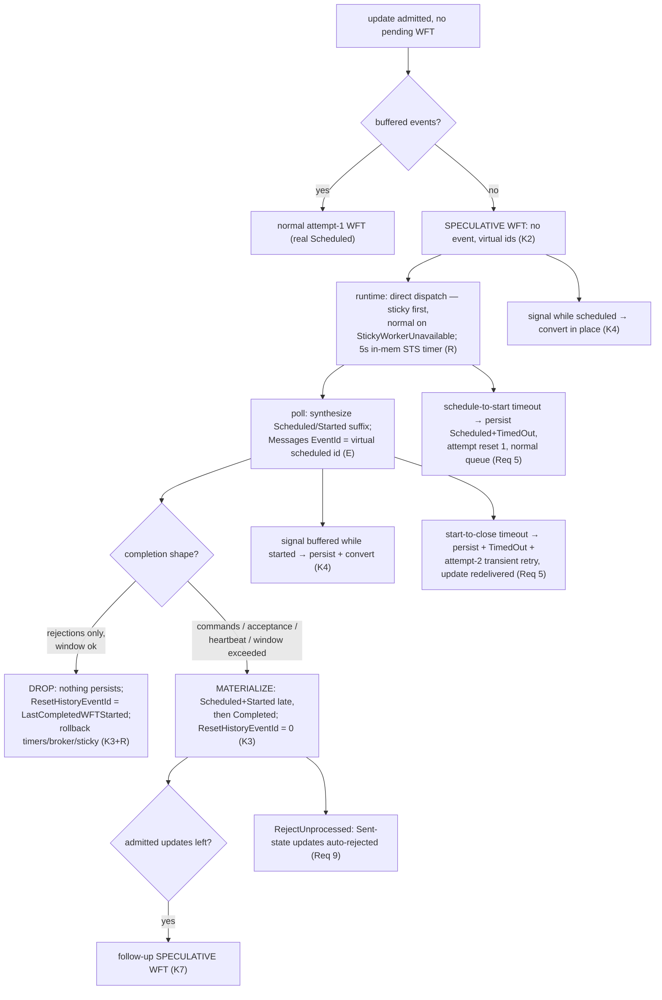

# Design Document: Speculative Workflow-Task Model (Kernel + Runtime + Edge)

## Overview

This feature adopts Temporal's **speculative workflow-task model** into `tokeira-kernel` and the
derived runtime/edge paths, plus four riders the same corpus leaves gate (message-validation
taxonomy, update-event fidelity, follow-up WFT, server-side RejectUnprocessed).

Requirements: [requirements.md](./requirements.md). **Requirement 0 is PROPOSED — the kernel is
frozen and every kernel item below is a raised decision; no kernel work begins until the owner
accepts.** Ground truth is v1.31.0 (`TEMPORAL_SERVER_COMPAT`), read from the local `../temporal`
checkout (AGENTS §8); tokeira adopts the observable contract, not Temporal's Go structures.

### The gap in one picture

```
tokeira today                                     v1.31.0 (speculative model)
update, idle run → apply_update emits a           update, idle run → SPECULATIVE WFT:
  durable WorkflowTaskScheduled (attempt 1)         no event, scheduled_id = last_event_id+1 (virtual)
  + EnqueueWorkflowTask dispatch op                 pushed DIRECTLY to matching (sticky→normal)
worker rejects the update →                       worker rejects (messages only) →
  Scheduled/Started/Completed all persisted         NOTHING persists; ResetHistoryEventId rewinds SDK
worker accepts →                                  worker accepts →
  events already durable                            Scheduled/Started materialize LATE, then Completed
```

The transient-WFT spec (accepted 2026-07-03) already built the suppress-and-synthesize machinery
for `attempt > 1`; speculative is the **attempt-1 analogue with a different existence bit** — the
completion decision (drop vs materialize) needs to know the task was speculative, which
`attempt > 1` cannot express.

### Why this is kernel work and stays pure

The existence bit, event suppression at schedule, the drop/materialize completion decision, the
conversion rules, the follow-up-WFT decision, and the event-fidelity changes are pure deterministic
state-machine logic (state + command → `Transition`; no I/O/async — AGENTS §2). The runtime/edge
own dispatch (broker, sticky fallback), in-memory timers, wire synthesis, `ResetHistoryEventId`,
waiter aborts, RejectUnprocessed, and metrics.

### Ground-truth anchors (v1.31.0, agent-verified)

- Creation + Noop-attach + direct dispatch — `updateworkflow/api.go:168-252`.
- Speculative schedule/start write no events; virtual ids; buffered-events downgrade —
  `workflow_task_state_machine.go:309-410, 556-627`.
- In-memory timer tasks, no transfer task — `task_generator.go:466-512`;
  `SpeculativeWorkflowTaskScheduleToStartTimeout = 5s`, `workflow_task_timer.go:15-19`.
- Drop predicate — `skipWorkflowTaskCompletedEvent`, `workflow_task_state_machine.go:676-748`;
  late materialization — `:750-819`; `ResetHistoryEventId` — `respondworkflowtaskcompleted/
  api.go:768-774`; discard capability window — `constants.go:2447-2451` (default 10).
- Convert-to-normal at transaction close — `workflow_task_state_machine.go:1466-1530`.
- Timeouts — `workflow_task_state_machine.go:270-306, 934-990`;
  `timer_queue_active_task_executor.go:364-462`.
- Validation taxonomy — `workflow_task_completed_handler.go:159-211, 319, 375-425`;
  `update/update.go:648-656`; waiter abort `errors_failures.go:14`; resurrect
  `update/registry.go:238-281`.
- RejectUnprocessed — `workflow_task_completed_handler.go:213-262`; `update/registry.go:297-317`;
  `errors_failures.go:18-25`.
- Event attribute shapes — `event_factory.go:424-467`; `mutable_state_impl.go:5288-5378`.
- Follow-up WFT decision — `respondworkflowtaskcompleted/api.go:512-541`.
- Metrics — `metric_defs.go:597, 940-941`.

## Kernel Decisions (RAISED — each requires Requirement 0 acceptance)

- **K1 — Existence bit on `PendingWorkflowTask`.** Add
  `task_type: WorkflowTaskType { Normal, Speculative }` with `#[serde(default)]` (old persisted
  data decodes as `Normal`; precedent: `schedule_to_start_deadline`,
  `crates/tokeira-kernel/src/state.rs:427-432`). A derived predicate is impossible: speculative is
  attempt 1, and completion must decide drop-vs-materialize from the bit
  (`skipWorkflowTaskCompletedEvent` checks the type, not the attempt).
- **K2 — Speculative scheduling.** `apply_update` (`kernel.rs:727`) currently always emits a
  durable `WorkflowTaskScheduled` for attempt 1. Change: with no pending WFT and no buffered
  events, schedule a speculative task — no event, virtual ids exactly as the transient arm of
  `schedule_workflow_task` (`kernel.rs:4375-4446`) already computes; buffered events keep today's
  normal path. The dispatch op is marked speculative so the runtime routes it directly (K-pure:
  the kernel only emits the op).
- **K3 — Completion drop-vs-materialize.** In `apply_workflow_task_completed`: if the completing
  task is speculative and the completion is rejection-only (no commands, not heartbeat,
  events-window check per Req 3.3), drop — emit nothing, clear the pending task, leave
  `last_event_id` untouched; else materialize Scheduled+Started late (reuse the transient
  materialization path) then proceed. The wire-message model must therefore reach the kernel: the
  completion command set alone cannot distinguish "only rejections" from "no messages processed".
  **Owner amendment (F1, review 2026-07-06): the type crossing the boundary is a KERNEL-OWNED
  value model — a `tokeira-kernel` enum (e.g. `UpdateMessage::{Acceptance, Response, Rejection}`
  extending/adjacent to the existing `UpdateProtocolBody`) decoded at the EDGE in `to_internal`;
  no upstream/proto type may cross into the kernel. The kernel classifies "rejection-only" from
  this owned model alone; the edge owns the decode. Purity-by-construction: the kernel stays a
  deterministic `state + command → Transition` machine with no proto dependency.**
- **K4 — Convert-to-normal transitions.** Signal while SCHEDULED: materialize Scheduled before
  appending the signal (Scheduled, Signaled, Started ordering at start). Signal buffered while
  STARTED: convert at completion (persist; flush after Completed). Timeouts and heartbeat: Req 5 /
  Req 4.3 shapes. These generalize the transient conversion rules (B.4) to the speculative flag.
- **K5 — `WorkflowTaskFailedCause::BadUpdateWorkflowExecutionMessage`.** Appended LAST after
  `BadRequestCancelExternalWorkflowExecutionAttributes` — postcard encodes variants positionally
  (discipline comment, `command.rs:225-228`); `as_str()` renders
  `"BadUpdateWorkflowExecutionMessage"`. Bad-message rejects convert to the K4-seam
  fail-the-WFT path instead of aborting the transition as `KernelRejected → INTERNAL`.
- **K6 — Update-event fidelity.** `UpdateProtocolBody::Accepted` gains the worker-provided
  `sequencing_event_id` (kernel stops hardcoding 0, `kernel.rs:4129`). **Owner amendment (F5,
  review 2026-07-06): the value is worker-controlled and lands in a persisted event — the kernel
  bounds-checks it (`0 < id <= last_event_id + pending-task virtual window`) and rejects the
  message as a bad update message (K5 cause) when out of range; v1.31.0's
  `validateAcceptanceMsg` requires it non-zero (`update.go` validation), and tokeira additionally
  refuses forward references beyond the delivering task's virtual ids.** For the failure-capable
  completion outcome: `HistoryEventKind` is postcard-persisted, so the existing
  `WorkflowExecutionUpdateCompleted { result: Payloads, … }` variant cannot change shape in place.
  **Decision: append a new variant** carrying `outcome: UpdateOutcome { Success(Payloads),
  Failure(Payload) }` + `accepted_event_id`; the old variant stays decode-only (append-only
  discipline, same as the enum rule). The serializer emits `Meta.UpdateId` and maps both variants;
  the legacy `WorkflowExecutionUpdateRejected` kind stays decode-only (already unemitted).
- **K7 — Follow-up WFT.** `apply_workflow_task_completed` consults `admitted_updates`: when
  non-empty after a non-failing, non-close completion and no other trigger forced a normal task,
  schedule a **speculative** follow-up (buffered events force normal, mirroring
  `respondworkflowtaskcompleted/api.go:512-541`).

Everything else is runtime/edge and does not touch the kernel.

## Architecture



## Components and Interfaces

### Kernel (`crates/tokeira-kernel`)

- `state.rs` — `PendingWorkflowTask.task_type` (K1, `serde(default)`).
- `kernel.rs` — `apply_update` speculative arm (K2); `apply_workflow_task_completed`
  drop/materialize + follow-up (K3, K7); conversion hooks on signal/buffer/timeout paths (K4);
  `ProtocolMessage` arms take the worker sequencing id and emit the new completed variant (K6).
- `command.rs` — `BadUpdateWorkflowExecutionMessage` appended (K5);
  `UpdateProtocolBody::{Accepted, Completed}` field additions (wire-message model, K6).
- `event.rs` — appended failure-capable completed variant (K6).

### Runtime (`crates/tokeira-runtime`)

- **Direct dispatch:** the speculative dispatch op bypasses durable backlog — publish straight to
  the broker; sticky-first with normal-queue fallback on sticky-unavailable; failures logged only.
  Zero-message dispatch is suppressed (Req 1.5).
- **In-memory timers:** 5s normal-queue schedule-to-start (pinned const), sticky schedule-to-start,
  and start-to-close for the started speculative task — tracked beside the existing WFT timeout
  tracking, **invalidated when the tracked task changes** (stale-guard analogue of
  `CheckSpeculativeWorkflowTaskTimeoutTask`). No durable timer rows.
  **Owner amendment (F2, review 2026-07-06) — re-arm-on-load:** a pending speculative WFT lives in
  mutable state with no persisted events, so on a bundle/shard reload the state survives but the
  in-memory timer does not. When a load/sweep observes a pending speculative task, the runtime
  RE-DERIVES the appropriate timer from the persisted attempt/timestamps — schedule-to-start if
  scheduled-not-started, start-to-close if started — with the same stale-guard invalidation.
  Without this an update caller is stranded (no dispatch, no timeout, no completion); "history is
  authority, queues are disposable" holds only if timers re-derive from authoritative state.
- **Rollback bookkeeping (Invariant I.1):** on kernel drop, clear the broker in-flight entry,
  disarm the timers, and leave sticky state consistent — the seam that already handles WFT
  completion cleanup grows a rollback arm. A dropped task must not leave the run undispatchable.
- **K4 seam extension:** bad-message failures route through the existing
  `Reject::InvalidCommandAttributes`-style path (`workflow_task.rs:444-510`) with the new cause;
  waiter aborts get WorkflowNotReady (Req 6.3); explicit `RespondWorkflowTaskFailed` keeps the
  update admitted (redelivery via the registry's non-accepted set).
- **RejectUnprocessed (Req 9):** after a successful non-heartbeat completion, resolve every
  update the task delivered but the worker ignored with `unprocessedUpdateFailure`; remove from
  the sendable set.
- **Metrics (Req 10):** commit/rollback counters (namespace label) at the completion seam; timer
  operation tag on the start-to-close firing.

### Edge (`crates/tokeira-edge`)

- **Poll synthesis:** widen the transient predicate (`from_internal.rs:47-76`,
  `append_transient_suffix` in `workflow_service.rs:5414`) to speculative; anchor `Messages[]`
  sequencing ids at the virtual scheduled id (Req 2).
- **Completion wire:** thread unreferenced messages through
  `to_internal::workflow_task_completed_request` (Req 6.5); decode `Response`-with-Failure as
  Completed-with-failure (fix `grpc/translate.rs:2342-2367`); surface `ResetHistoryEventId` on the
  gRPC response; consume `client_discards_speculative_with_events` (Req 3.3).
- **GetHistory:** unchanged reads — speculative events never appear until commit (Req 2.4); the
  existing transient suffix append stays correct because a speculative task also sits at
  `scheduled == last_event_id + 1`.

### Fork (`../temporal`, conformance harness)

- `tests/testcore/tokeira_metrics_bridge.go` — rename entries for
  `speculative_workflow_task_commits/_rollbacks` and the timer-task pair (Req 10.3).
- `tests/testcore/tokeira_conformance_skip.go` — register the cluster 9/10/11 harness-class skips
  **before the first full run** (nil-panic leaves abort the whole parallel suite).

## Data Models

- `PendingWorkflowTask.task_type` — `serde(default)` → `Normal`; round-trip holds for old data.
- Appended `WorkflowExecutionUpdateCompleted` outcome variant; appended
  `WorkflowTaskFailedCause` variant — both append-only per the postcard positional discipline.
  Run `cargo test --workspace` (postcard lesson) after every enum/event change.
- No new storage interfaces: drop paths commit a transition with zero events (state-only), which
  the OCC/fencing path already supports.

## Error Handling

| Condition | Wire result |
|---|---|
| Unknown update id, no resurrect payload | WFT fails (`BadUpdateWorkflowExecutionMessage`); NotFound "update {id} wasn't found on the server…" |
| `PROTOCOL_MESSAGE` command → absent message id | WFT fails; InvalidArgument "ProtocolMessageCommand referenced absent message ID {id}" |
| Wrong-state message (double accept, complete-before-accept) | WFT fails; InvalidArgument "invalid state transition attempted for Update {id}: …" |
| Any of the above | update waiter aborts: WorkflowNotReady "Unable to perform workflow execution update due to unexpected workflow task failure." |
| Explicit RespondWorkflowTaskFailed | update stays admitted; redelivered on the retry WFT |
| Late completion of timed-out started speculative | NotFound "Workflow task not found." |
| Update delivered but unprocessed | server rejection with `unprocessedUpdateFailure` (exact string, Req 9) |

Existing WFT fencing rejects are untouched; speculative tokens fence on the virtual started id the
same way transient tokens already do.

## Correctness Properties

- **P1 — Speculative schedule/start persist nothing;** virtual ids `scheduled = last_event_id+1`,
  `started = scheduled+1`. (Req 1.1, 2.1)
- **P2 — Rejection-only completion drops without trace** and resolves waiters with the rejection
  outcomes; `ResetHistoryEventId = LastCompletedWorkflowTaskStartedEventId`. (Req 3.1-3.2, I.1)
- **P3 — Substantive completion materializes** Scheduled+Started (original times) before
  Completed; `ResetHistoryEventId = 0`. (Req 3.4)
- **P4 — Conversions:** signal-while-scheduled yields Scheduled, Signaled, Started; buffered
  signal persists the task; heartbeat successor is normal with no redelivery. (Req 4)
- **P5 — Timeouts:** start-to-close persists + transient attempt-2 + redelivery; schedule-to-start
  persists + attempt reset 1. (Req 5)
- **P6 — Follow-up:** completion with admitted updates unsent schedules a speculative successor;
  RejectUnprocessed empties the Sent set. (Req 8, 9)
- **Golden G1** (assumes the standard 4-event lead-in: 1 WorkflowExecutionStarted,
  2 WorkflowTaskScheduled, 3 WorkflowTaskStarted, 4 WorkflowTaskCompleted — owner review minor
  note) — empty-speculative accept+complete history: WFTScheduled(5) WFTStarted(6)
  WFTCompleted(7) UpdateAccepted(8, sequencing 5) UpdateCompleted(9, accepted 8).
- **Golden G2** — reject leaves history ending at the prior WFTCompleted (no trace).

**Validates: Requirements 1-10, I.1, I.2.**

## Testing Strategy

- **Kernel property/golden tests** (`property_tests.rs` / `golden_tests.rs`): P1-P6, G1, G2,
  tagged `// Feature: speculative-wft, Property N`; generators drive idle-run update → speculative
  schedule → {reject | accept+complete | signal | heartbeat | timeout} at attempt 1.
- **Runtime/edge tests:** direct-dispatch (no backlog row), sticky fallback, rollback bookkeeping
  (timers disarmed, broker cleared, re-dispatch works), poll suffix + message anchoring, drop
  response carries `ResetHistoryEventId`, RejectUnprocessed resolution, validation-taxonomy wire
  errors, metrics counter emission.
- **Conformance (operator-invoked):** the ~36 cluster 3/4/5/7/8 leaves (tasks.md checkpoint) after
  the Phase S skip registrations; run under the parallel-suite load shape (every leaf
  `t.Parallel`).
- `cargo test --workspace` in every bar (postcard lesson); `cargo +nightly fmt`, `cargo lint`,
  `cargo test-lint`.

## Sequencing and Cross-Spec Notes

- **Transient first, speculative on top:** all speculative kernel arms reuse the transient
  suppress/synthesize/materialize helpers; they must extend, not fork, those paths (one predicate,
  three modes — normal / transient / speculative — per Invariant I.2).
- **api-conformance-multi-operation** consumes this spec for its running-attach speculative paths;
  land this spec's Phases K-E before that spec's cluster-1 leaves that attach to running workflows.
- The `WorkflowExecutionUpdateRejected` event kind is already unemitted (registry-only rejection
  landed earlier); this spec only freezes it decode-only — no read-path change remains.

## Documentation (part of the change, AGENTS §9)

Amend `docs/architecture/020-kernel.md` (WFT lifecycle: the three task modes, drop/materialize,
conversion table) and `docs/readiness/command-surface.md` (BadUpdateWorkflowExecutionMessage,
wire-message model, appended event variant) on landing.
