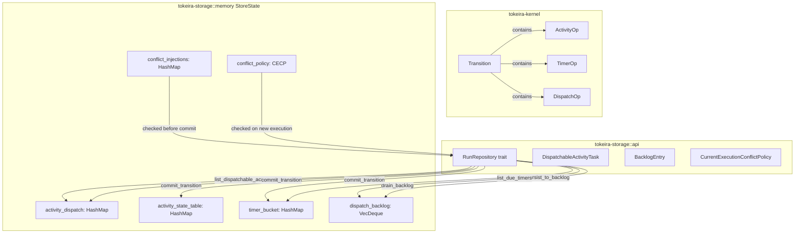

# Design Document: Storage Memory Fidelity

## Overview

This design closes the fidelity gaps between `InMemoryStore` and the planned DSQL storage backend. Today the in-memory store tracks workflow task dispatch, history, request dedup, projection log, and lease management, but it silently drops activity task dispatch information, has no dispatch backlog, offers no way to inject OCC conflicts for testing, hardcodes a single current-execution conflict policy, and embeds activity/timer state only inside `WorkflowState` maps rather than maintaining independent normalized structures.

The changes are scoped entirely to `tokeira-storage` (with minor trait additions in `api.rs` and implementation in `memory.rs`). No kernel logic changes. The kernel already produces the right `ActivityOp`, `TimerOp`, and `DispatchOp` variants — the storage layer just needs to honor them faithfully.

### Design Principles

- Respect the authoritative-transition model (010-history-as-authority): no semantically visible state change without a committed kernel transition.
- Respect the delivery broker's three-tier model (040-delivery-broker): the durable fact is pending work in `workflow_hot` and `activity_state`, not a queue row. Backlog is Tier C, explicitly persisted by the broker, not automatically on every enqueue.

### Design Goals

- Make `InMemoryStore` a high-fidelity stand-in for DSQL so runtime/broker code can be developed and tested without a cluster.
- Keep all new structures behind the existing `Mutex<StoreState>` — no new concurrency primitives.
- Preserve the existing `CommitResult` enum and `RunRepository` trait shape, extending only where the requirements demand new methods.
- Ensure all mutations are atomic within a single `commit_transition` call (all-or-nothing inside the lock).

## Architecture

The changes are confined to two files:

```
tokeira-storage/src/
  api.rs     — new types + trait method additions
  memory.rs  — StoreState fields + commit_transition logic
```



### Commit Flow (Updated)

Within `commit_transition`, after the existing OCC fence check and before returning `CommitResult::Applied`, the following new steps execute in order:

1. **Conflict injection check** — if `conflict_injections[run_key] > 0`, decrement and return `Conflict` immediately.
2. **Current-execution conflict policy** — on seq-zero open-status transitions, apply the configured policy (`Reject` or `AllowAfterClose`) instead of the current hardcoded reject.
3. **Activity ops → independent activity state table** — `Upsert` inserts/updates, `Delete` removes.
4. **Timer ops → independent timer bucket** — `Upsert` inserts/updates, `Delete` removes.
5. **Dispatch ops → activity dispatch** — `EnqueueActivityTask` populates the activity dispatch tracking structure.
6. **Activity delete → activity dispatch cleanup** — `ActivityOp::Delete` also removes from the activity dispatch map.

Note: `commit_transition` does NOT insert into the dispatch backlog. Per the delivery broker architecture (040-delivery-broker), backlog is Tier C — the broker explicitly calls `persist_to_backlog` when it decides a task should be durably backed.

All steps happen inside the single `Mutex` lock, so atomicity is trivially maintained.

## Components and Interfaces

### New Types in `api.rs`

```rust
/// Dispatchable activity task returned by sweep queries.
#[derive(Clone, Debug, PartialEq)]
pub struct DispatchableActivityTask {
    pub run_key: RunKey,
    pub queue: QueueKey,
    pub activity_id: String,
    pub schedule_event_id: i64,
    pub attempt: u32,
}

/// Discriminant for backlog entries.
#[derive(Clone, Debug, PartialEq)]
pub enum BacklogTaskKind {
    Workflow,
    Activity { activity_id: String },
}

/// One entry in the dispatch backlog.
#[derive(Clone, Debug, PartialEq)]
pub struct BacklogEntry {
    pub run_key: RunKey,
    pub queue: QueueKey,
    pub kind: BacklogTaskKind,
    pub insertion_seq: u64,
}

/// Policy for handling start-workflow when a current execution exists.
///
/// Reuse and TerminateThenStart are intentionally deferred:
/// - Reuse would overload CommitResult::Applied, losing semantics for callers.
/// - TerminateThenStart would let storage invent a termination with no kernel
///   transition, violating the authoritative-transition model.
#[derive(Clone, Copy, Debug, PartialEq, Eq)]
pub enum CurrentExecutionConflictPolicy {
    Reject,
    AllowAfterClose,
}

impl Default for CurrentExecutionConflictPolicy {
    fn default() -> Self {
        Self::Reject
    }
}
```

### Trait Extensions on `RunRepository`

```rust
// Added to the RunRepository trait:

async fn list_dispatchable_activity_tasks(
    &self,
    queue: &QueueKey,
    limit: usize,
) -> Result<Vec<DispatchableActivityTask>>;

async fn persist_to_backlog(
    &self,
    entries: Vec<BacklogEntry>,
) -> Result<()>;

async fn drain_backlog(
    &self,
    queue: &QueueKey,
    limit: usize,
) -> Result<Vec<BacklogEntry>>;
```

### New Methods on `InMemoryStore` (not trait methods)

```rust
impl InMemoryStore {
    /// Inject N artificial OCC conflicts for a run.
    pub async fn inject_conflict(&self, run_key: RunKey, count: usize);

    /// Set the current-execution conflict policy.
    pub async fn set_conflict_policy(&self, policy: CurrentExecutionConflictPolicy);
}
```

### Updated `StoreState` Fields

```rust
struct StoreState {
    // ... existing fields ...

    // Req 1: activity dispatch tracking
    activity_dispatch: HashMap<(RunKey, String), DispatchableActivityTask>,

    // Req 3: explicit-persist dispatch backlog (Tier C)
    dispatch_backlog: VecDeque<BacklogEntry>,
    backlog_next_seq: u64,

    // Req 4: OCC conflict injection
    conflict_injections: HashMap<RunKey, usize>,

    // Req 5: current-execution conflict policy
    conflict_policy: CurrentExecutionConflictPolicy,

    // Req 6: independent normalized structures
    activity_state_table: HashMap<(RunKey, String), ActivityState>,
    timer_bucket: HashMap<(RunKey, String), TimerState>,
}
```

## Data Models

### Activity Dispatch Tracking (Req 1)

Keyed by `(RunKey, activity_id: String)`. Populated from `DispatchOp::EnqueueActivityTask`. Cleaned up on `ActivityOp::Delete`. This mirrors the DSQL `activity_state` table's role in dispatch queries.

| Field | Type | Source |
|---|---|---|
| run_key | RunKey | commit context |
| queue | QueueKey | EnqueueActivityTask.queue |
| activity_id | String | EnqueueActivityTask.activity_id |
| schedule_event_id | i64 | EnqueueActivityTask.schedule_event_id |
| attempt | u32 | EnqueueActivityTask.attempt |

Timeout fields (`schedule_to_close_timeout`, `schedule_to_start_timeout`, `start_to_close_timeout`, `heartbeat_timeout`) are stored in the activity dispatch entry but not surfaced in `DispatchableActivityTask` — they are used by the runtime when it starts the task, not by the sweep query. They live in the internal `ActivityDispatchEntry` struct inside `StoreState`.

### Dispatch Backlog (Req 3)

A `VecDeque<BacklogEntry>` with a monotonic `backlog_next_seq` counter. Each entry carries a `BacklogTaskKind` discriminant. Entries are inserted via `persist_to_backlog` (called by the broker when it decides a task should be durably backed, per the Tier C model in 040-delivery-broker). `drain_backlog` filters by `QueueKey`, removes matching entries, and returns them in insertion-sequence order.

`commit_transition` does NOT write to the backlog. The durable fact is pending work in `workflow_hot` and `activity_state`; the backlog is a broker-managed fallback.

| Field | Type | Source |
|---|---|---|
| run_key | RunKey | broker context |
| queue | QueueKey | broker context |
| kind | BacklogTaskKind | Workflow or Activity{activity_id} |
| insertion_seq | u64 | monotonic counter (assigned by persist_to_backlog) |

### Independent Activity State Table (Req 6)

Keyed by `(RunKey, activity_id: String)`. Value is `ActivityState` from `tokeira_kernel::state`. Populated from `ActivityOp::Upsert`, removed on `ActivityOp::Delete`. This is a denormalized mirror of the data that also lives in `WorkflowState.activities`.

### Independent Timer Bucket (Req 6)

Keyed by `(RunKey, timer_id: String)`. Value is `TimerState` from `tokeira_kernel::state`. Populated from `TimerOp::Upsert`, removed on `TimerOp::Delete`. `list_due_timers` switches to scanning this structure instead of iterating `WorkflowState.timers`.

### Conflict Injection (Req 4)

`HashMap<RunKey, usize>`. `inject_conflict(run_key, count)` sets the value. Each `commit_transition` call for that `run_key` decrements and returns `Conflict` until the count reaches zero. Calling `inject_conflict` again replaces the previous count.

### Current-Execution Conflict Policy (Req 5)

A single `CurrentExecutionConflictPolicy` value on `StoreState`, defaulting to `Reject`. The existing hardcoded conflict check in `commit_transition` is replaced with a match on this policy:

- `Reject`: return `Conflict` when an open execution exists (existing behavior).
- `AllowAfterClose`: return `Conflict` only when an open execution exists; allow creation when only closed executions exist.

#### Deferred Policies

- **Reuse**: Would overload `CommitResult::Applied` — the caller's transition (run_key, history batch, request dedupe ops, dispatch/projection ops) would be silently discarded while the return type says they were persisted. Needs either a distinct `CommitResult` variant or a higher-level `start_workflow` method. Deferred until the runtime's start-workflow path is designed.
- **TerminateThenStart**: Would let storage invent a termination side effect with no kernel transition, no history event, no projection close, and no transition audit record. This directly violates the core invariant in 010-history-as-authority: "No state visible to the rest of the system may exist unless it can be explained by a committed history transition and its fenced summary update." Deferred until the kernel has a proper terminate-and-replace command path.


## Correctness Properties

*A property is a characteristic or behavior that should hold true across all valid executions of a system — essentially, a formal statement about what the system should do. Properties serve as the bridge between human-readable specifications and machine-verifiable correctness guarantees.*

### Property 1: Activity dispatch round-trip fidelity

*For any* transition containing one or more `DispatchOp::EnqueueActivityTask` entries, after a successful `commit_transition`, the activity dispatch tracking structure shall contain an entry for each `(run_key, activity_id)` with `queue`, `schedule_event_id`, `attempt`, and all timeout fields matching the original dispatch op.

**Validates: Requirements 1.1, 1.2**

### Property 2: Activity dispatch cleanup on delete

*For any* `(run_key, activity_id)` that exists in the activity dispatch tracking structure, committing a transition containing `ActivityOp::Delete { activity_id }` for that run shall remove the corresponding entry from the activity dispatch structure.

**Validates: Requirements 1.3**

### Property 3: Failed commits leave all structures unchanged

*For any* transition that results in `CommitResult::Conflict` or `CommitResult::Duplicate`, the activity dispatch tracking structure, the independent activity state table, and the independent timer bucket shall all remain identical to their state before the commit attempt.

**Validates: Requirements 1.4, 6.6**

### Property 4: Activity task sweep returns matching tasks up to limit

*For any* set of committed activity dispatch entries across multiple queues, calling `list_dispatchable_activity_tasks` with a given `QueueKey` and `limit` shall return only entries whose `queue` matches the provided key, and the result count shall be at most `limit`.

**Validates: Requirements 2.2**

### Property 5: Backlog insertion via persist_to_backlog

*For any* sequence of `BacklogEntry` values passed to `persist_to_backlog`, the dispatch backlog shall contain one entry per input, with `insertion_seq` values assigned monotonically, and the correct `run_key`, `queue`, and `kind` preserved.

**Validates: Requirements 3.1, 3.5**

### Property 6: Drain backlog returns matching entries in insertion order

*For any* sequence of `persist_to_backlog` calls that populate the backlog, calling `drain_backlog` with a `QueueKey` and `limit` shall return and remove up to `limit` entries matching that queue, and the returned entries shall have strictly increasing `insertion_seq` values.

**Validates: Requirements 3.3, 7.4**

### Property 7: Conflict injection lifecycle

*For any* `run_key` and injection count N, after calling `inject_conflict(run_key, N)`, the next N calls to `commit_transition` for that `run_key` shall return `CommitResult::Conflict` without modifying stored state, and the (N+1)th call shall proceed with normal commit behavior. If `inject_conflict` is called again with count M before the previous count is exhausted, only M conflicts shall remain.

**Validates: Requirements 4.1, 4.2, 4.3, 4.4**

### Property 8: Reject and AllowAfterClose policies block when open execution exists

*For any* `(namespace_id, workflow_id)` pair with an existing open execution, under either the `Reject` or `AllowAfterClose` conflict policy, attempting to create a new execution via `commit_transition` (seq-zero, open status) shall return `CommitResult::Conflict`.

**Validates: Requirements 5.3, 5.5**

### Property 9: AllowAfterClose permits creation after close

*For any* `(namespace_id, workflow_id)` pair where the only existing execution is closed, under the `AllowAfterClose` conflict policy, creating a new execution shall succeed with `CommitResult::Applied`.

**Validates: Requirements 5.4**

### Property 10: Independent activity and timer state upsert/delete

*For any* transition containing `ActivityOp::Upsert` or `TimerOp::Upsert` ops, after a successful commit, the independent activity state table and timer bucket shall contain the upserted entries keyed by `(run_key, activity_id)` and `(run_key, timer_id)` respectively. For any transition containing `ActivityOp::Delete` or `TimerOp::Delete`, the corresponding entries shall be removed.

**Validates: Requirements 6.1, 6.2, 6.3, 6.4**

### Property 11: Independent structures mirror WorkflowState maps

*For any* sequence of successfully committed transitions, the independent activity state table shall contain exactly the same entries as the union of all `WorkflowState.activities` maps across stored runs, and the independent timer bucket shall contain exactly the same entries as the union of all `WorkflowState.timers` maps across stored runs.

**Validates: Requirements 6.7, 6.8**

### Property 12: Backlog size invariant

*For any* sequence of `persist_to_backlog` and `drain_backlog` operations, the dispatch backlog size shall equal the total number of entries inserted via `persist_to_backlog`, minus the total number of entries returned by all `drain_backlog` calls.

**Validates: Requirements 7.1, 7.2**

## Error Handling

### OCC Conflict on `commit_transition`

When `expected_seq` does not match the stored `transition_seq`, `commit_transition` returns `CommitResult::Conflict`. No state is modified. The caller (runtime) is responsible for reload-and-retry.

### Injected Conflicts

Injected conflicts behave identically to real OCC conflicts from the caller's perspective — `CommitResult::Conflict` with a descriptive reason string. The runtime's retry logic exercises the same code path.

### Duplicate Request Detection

When a `RequestDedupeOp` matches an already-committed request ID, `commit_transition` returns `CommitResult::Duplicate`. No state is modified. This is idempotent and safe to retry.

### Current-Execution Conflict Policies

- **Reject (open exists)**: Returns `CommitResult::Conflict` with a reason string identifying the existing execution.
- **AllowAfterClose (open exists)**: Returns `CommitResult::Conflict` with a reason string identifying the existing execution.
- **AllowAfterClose (only closed exists)**: Proceeds with normal execution creation.

### Backlog Drain with No Matches

`drain_backlog` returns an empty `Vec` when no entries match the provided `QueueKey`. This is not an error condition.

### Panics

The in-memory store does not panic on any valid input. Invalid inputs (e.g., loading a non-existent `RunKey`) return `LoadedRun::Absent` or empty collections rather than errors.

## Testing Strategy

### Property-Based Testing

All correctness properties (1–12) shall be implemented as property-based tests using the `proptest` crate. Each test shall:

- Run a minimum of 100 iterations (configured via `proptest::test_runner::Config`)
- Use `proptest` strategies to generate random `RunKey`, `NamespaceId`, `WorkflowId`, `QueueKey`, `ActivityState`, `TimerState`, `Transition`, and `DispatchOp` values
- Be tagged with a comment referencing the design property: `// Feature: storage-memory-fidelity, Property {N}: {title}`
- Each correctness property shall be implemented by a single property-based test

Key generators needed:
- `arb_run_key()` — random `RunKey`
- `arb_namespace_id()` — random `NamespaceId`
- `arb_queue_key()` — random `QueueKey` with random namespace, queue name, and task kind
- `arb_activity_state()` — random `ActivityState` with random timeouts
- `arb_timer_state()` — random `TimerState` with random fire times
- `arb_transition(expected_seq)` — random `Transition` with configurable ops
- `arb_enqueue_activity_task()` — random `DispatchOp::EnqueueActivityTask`
- `arb_enqueue_workflow_task()` — random `DispatchOp::EnqueueWorkflowTask`

### Unit Tests

Unit tests complement property tests for specific examples and edge cases:

- **Default policy is Reject**: Verify that without calling `set_conflict_policy`, the store behaves as `Reject` (Req 5.6).
- **Empty queue sweep**: Verify `list_dispatchable_activity_tasks` returns empty for a queue with no tasks (Req 2.4).
- **Empty drain**: Verify `drain_backlog` returns empty for a non-matching queue (Req 7.3).
- **Inject conflict replacement**: Verify that calling `inject_conflict` twice replaces the count (specific example of Property 7).
- **Backlog insertion ordering**: Verify entries from a single `persist_to_backlog` call appear in the backlog in the order they were provided.
- **commit_transition does not write backlog**: Verify that committing a transition with `EnqueueWorkflowTask` or `EnqueueActivityTask` does not insert any backlog entries.

### Test Organization

Tests shall live in `tokeira/crates/tokeira-storage/src/memory.rs` as a `#[cfg(test)] mod tests` block, or in a separate `tokeira/crates/tokeira-storage/tests/` integration test file if the module grows too large. Property tests and unit tests coexist in the same module.
