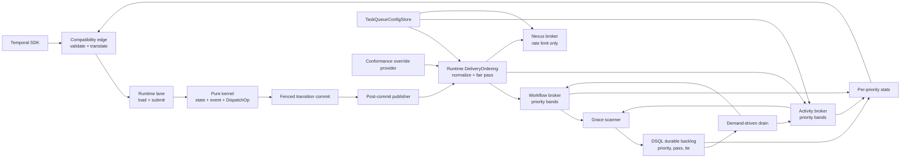

# Design Document: Task Queue Priority and Fairness

## Overview

This design adds Temporal v1.31.0 task-queue priority and weighted fairness to
Tokeira without importing Temporal's matching-service architecture.

The design follows Tokeira's existing boundary:

- **Kernel:** records raw priority on authoritative workflow/activity state and
  history, performs deterministic field-wise inheritance, and emits effective
  priority on declarative `DispatchOp`s. It retains no state between calls.
- **Runtime:** converts effective priority into delivery order, owns volatile
  fair-pass and limiter state, compares sticky and normal work, and publishes
  ordered tasks.
- **Storage:** preserves the runtime-selected order while tasks are parked in the
  disposable backlog. History and run state remain the source from which delivery
  can be rebuilt.
- **Edge:** validates the public wire contract, translates priority-bearing
  requests/responses, and projects real per-priority statistics.

Wire shape is derived from the vendored proto under `proto/upstream/`. Behavioral
rules are derived from `common/priorities/priority_util.go`,
`service/matching/{config.go,fair_level.go,fair_task_writer.go,fairness_util.go,
pri_matcher.go,task_queue_partition_manager.go,ratelimit_manager.go}`,
`service/history/api/{command_attr_validator.go,recordactivitytaskstarted/api.go,
updateworkflowoptions/api.go,updateactivityoptions/api.go}`,
`service/history/transfer_queue_active_task_executor.go`, and
`tests/priority_fairness_test.go @ v1.31.0`.

## Dependencies and Non-Goals

### Owning relationships

- `.kiro/specs/runtime-broker-tiered-delivery/` owns the named sticky,
  live-ready, and durable-backlog tiers. This design changes ordering *within*
  those tiers.
- `.kiro/specs/runtime-broker-fairness/` owns inter-queue drain budgets. Its
  `FairnessState` remains independent from user fairness keys.
- `.kiro/specs/api-conformance-task-queue/` owns public task-queue Describe/List
  behavior. This design supplies its per-priority data.
- `.kiro/specs/temporal-api-v1.62-sync/` introduced `TaskQueueConfigStore`.
  This design corrects its task-kind isolation and makes accepted values active
  on dispatch.
- `.kiro/specs/conformance-config-override/` owns the test-only override
  registry and honesty boundary.

### Non-goals

- No Temporal matching-service, physical-task-queue manager, partition owner,
  subqueue ack level, or old/new matcher migration object.
- No priority-based lane routing, actor placement, shard ownership, or kernel
  scheduling policy.
- No production fairness-enable setting until the configuration-surface
  decision is accepted.
- No DSQL persistence for `TaskQueueConfigStore` in this feature.
- No attempt to provide strict total ordering across independent processes;
  Temporal specifies best-effort ordering even within its own partitioned
  delivery system.
- No test-body edits in the Temporal conformance fork.

## Architecture

The semantic path and delivery path remain separate. The kernel decides what
priority metadata belongs to a committed task; the runtime decides how competing
tasks are handed out.



### Ordering rules

One dispatchable task has:

1. raw/effective public Priority metadata used in poll responses;
2. a normalized priority band;
3. a fair pass selected when the task first enters delivery;
4. a monotonically increasing insertion tie.

The ready-key order is lexicographic:

```text
(priority_key ASC, fair_pass ASC, insertion_tie ASC)
```

When priority-aware delivery is disabled, all tasks use band 3. When fairness is
disabled, `fair_pass` follows insertion order, yielding FIFO within a band. When
fairness is enabled, pass advances per fairness key by:

```text
stride = max(1, floor(1000 / effective_weight))
next_pass[key] = max(band_frontier, previous_pass[key]) + stride
```

The first task for a newly observed key starts at the current band frontier so a
late key cannot jump arbitrarily far ahead of service already granted.

### Sticky versus normal

A sticky workflow poll retains both the SDK-supplied sticky queue and
`TaskQueue.normal_name`. The broker peeks at the best eligible task from the
sticky queue and the declared normal queue:

- lower priority key wins;
- equal priority selects sticky;
- fairness-key order remains disabled inside the sticky queue;
- the selected task still passes normal start-time fencing.

The broker records a volatile sticky-to-normal alias so publication on the normal
queue wakes sticky pollers and a sticky parked poll contributes demand to normal
backlog draining. It does not register the same reserved poller twice; eager
reservation stays exact-queue-only.

### Direct match

Direct delivery remains permitted when no competing ready work exists. Once the
queue family contains ready work, a new task enters the same ordered structures
and cannot jump equal-or-higher priority backlog. Speculative workflow tasks keep
their existing direct-only exception.

### Failure and recovery

Delivery order is policy, not authority. A graceful live-ready demotion preserves
its selected order in DSQL. After broker loss, recovery derives public Priority
from `WorkflowState`/`ActivityState` and assigns fresh fair-pass state. This may
shift best-effort fairness after failover but cannot create, lose, start, or
complete a task incorrectly.

## Components and Interfaces

### 1. Pure priority helpers and kernel state

Files:

- `crates/tokeira-kernel/src/state.rs`
- `crates/tokeira-kernel/src/command.rs`
- `crates/tokeira-kernel/src/event.rs`
- `crates/tokeira-kernel/src/transition.rs`
- `crates/tokeira-kernel/src/kernel.rs`

Representative helpers:

```rust
/// Field-wise merge. Zero/empty override fields inherit from `base`.
pub fn merge_priority(
    base: Option<&Priority>,
    override_: Option<&Priority>,
) -> Option<Priority>;

/// Replaces an unstarted pending WFT's internal delivery identity without
/// authoring a second WorkflowTaskScheduled history event.
fn redispatch_pending_workflow_task(&mut self);
```

The following priority fields are added:

```rust
pub struct ActivityState {
    // existing fields...
    #[serde(default)]
    pub priority: Option<Priority>, // raw activity override
}

pub struct ActivityOriginalOptions {
    // existing fields...
    #[serde(default)]
    pub priority: Option<Priority>,
}

pub struct UpdateExecutionOptionsRequest {
    // existing fields...
    pub priority: FieldChange<Priority>,
}

pub struct UpdateActivityOptionsRequest {
    // existing fields...
    pub priority: FieldChange<Priority>,
}
```

`WorkflowCommand::ScheduleActivity` and
`WorkflowCommand::StartChildWorkflow` gain raw `priority`. The matching activity
schedule, child-initiation, and workflow-options-updated internal history variants
gain trailing `#[serde(default)]` priority fields. `DispatchOp` gains effective
priority on:

```rust
DispatchOp::EnqueueWorkflowTask { priority: Option<Priority>, ... }
DispatchOp::EnqueueActivityTask { priority: Option<Priority>, ... }
DispatchOp::StartChildWorkflow { priority: Option<Priority>, ... }
```

These are declarative values only. No runtime mode, priority clipping, fair pass,
rate limiter, clock, queue, or counter enters `tokeira-kernel`.

The internal event/state layout changes are pre-baseline and explicitly
owner-authorized. Fields are trailing and defaulted for named formats, but postcard
reports end-of-input before Serde can default a missing positional element. Genuine
pre-change postcard fixtures therefore assert rejection with
`DeserializeUnexpectedEnd`; the pre-baseline store boundary, not a false decoding
claim, makes the layout change safe.

### 2. Edge validation and translation

Files:

- `crates/tokeira-edge/src/translate/mod.rs`
- `crates/tokeira-edge/src/grpc/translate.rs`
- `crates/tokeira-edge/src/grpc/workflow_service.rs`
- `crates/tokeira-edge/src/workflow_service.rs`
- `crates/tokeira-edge/src/grpc/runtime_adapter.rs`
- `crates/tokeira-edge/src/translate/history_serializer.rs`

Pure translators:

```rust
fn priority_to_domain(proto: &common::Priority) -> Result<Priority, ProtoConversionError>;
fn priority_to_proto(priority: &Priority) -> common::Priority;

fn apply_priority_field_mask(
    current: Option<Priority>,
    requested: Option<Priority>,
    paths: &[String],
) -> Result<FieldChange<Priority>, ProtoConversionError>;
```

Validation follows `common/priorities/priority_util.go @ v1.31.0`:

- negative priority key rejected;
- fairness key over 64 bytes rejected;
- negative task fairness weight rejected;
- zero retains inherit/default meaning.

`PollWorkflowTaskQueueRequest` gains:

```rust
pub normal_task_queue: Option<String>;
```

It is populated only for sticky polls with a non-empty `normal_name`. Versioned
sticky validation remains unchanged.

`UpdateWorkflowExecutionOptionsRequest` carries both
`versioning_override` and `priority`. Whole and nested Priority field masks are
merged exactly as `mergeWorkflowExecutionOptions` does at v1.31.0.
`ActivityOptions` gains raw Priority; update and restore-original paths carry it
through runtime.

History serialization writes raw activity/child priority and options-update
priority. Poll serialization writes effective activity priority and workflow
priority. Describe writes workflow raw priority and pending-activity raw priority
in both public locations.

### 3. Runtime priority preparation

New module:

- `crates/tokeira-runtime/src/task_ordering.rs`

The dependency-neutral order value is part of the storage API because both runtime
brokers and durable backlog implementations consume it:

```rust
// crates/tokeira-storage/src/api.rs
#[derive(Clone, Copy, Debug, Eq, Ord, PartialEq, PartialOrd)]
pub struct DeliveryOrder {
    pub priority_key: i16,
    pub fair_pass: i64,
    pub insertion_tie: u64,
}
```

The runtime module owns normalization, fair-pass assignment, and mode policy:

```rust
use tokeira_storage::DeliveryOrder;

pub const PRIORITY_LEVELS: i32 = 5;
pub const DEFAULT_PRIORITY_KEY: i32 = 3;

#[derive(Clone, Copy, Debug, PartialEq, Eq)]
pub struct DeliveryMode {
    pub priority_enabled: bool,
    pub fairness_enabled: bool,
    pub auto_enable: bool,
}

#[derive(Debug, Default)]
pub struct DeliveryOrdering {
    // queue/priority/fairness-key pass frontiers and insertion counter
}

impl DeliveryOrdering {
    pub fn assign(
        &mut self,
        queue: &QueueKey,
        raw_priority: Option<&Priority>,
        is_sticky: bool,
        config: Option<&TaskQueueConfigEntry>,
        mode: DeliveryMode,
    ) -> DeliveryOrder;

    pub fn preserve(&mut self, order: DeliveryOrder) -> DeliveryOrder;
}
```

`assign` normalizes priority at the delivery boundary:

- key 0 becomes 3;
- positive key clips to 1–5;
- fairness weight resolution is queue override → task value → 1.0;
- effective weight clips to `[0.001, 1000]`;
- fairness is disabled for sticky queues;
- fairness-off or priority-off yields stable FIFO behavior.

`DeliveryOrdering` is held under the existing broker lock, making pass assignment,
insertion-tie allocation, queue insertion, and wake publication one atomic
in-memory action. No new dependency or process-global production configuration is
introduced.

### 4. Runtime mode provider and auto-enable state

The mode provider is a small runtime seam:

```rust
pub trait DeliveryModeProvider: Send + Sync + 'static {
    fn mode_for(&self, queue: &QueueKey) -> DeliveryMode;
}
```

The default production provider returns v1.31.0 stock defaults:

```text
priority_enabled = true
fairness_enabled = false
auto_enable = false
```

Under `feature = "conformance"`, the provider reads:

- `matching.useNewMatcher`;
- `matching.enableFairness`;
- `matching.autoEnableV2`.

The conformance registry classifies the keys as wired in the same change.
`matching.priorityLevels` remains a fixed behavioral constant.

Each workflow/activity broker owns:

```rust
HashSet<QueueKey> auto_enabled_queues
```

Before assigning a new normal-queue task:

- non-empty fairness key activates V2 while auto-enable is on;
- non-zero priority activates V2 only when priority-aware delivery is otherwise
  disabled;
- sticky queues never activate;
- activation lasts until process restart.

This is delivery policy, not authoritative workflow state. It intentionally does
not recreate Temporal's persisted task-queue user-data object.

### 5. Ordered workflow and activity brokers

File:

- `crates/tokeira-runtime/src/broker.rs`

Reusable ordered ready structure:

```rust
#[derive(Debug, Default)]
struct OrderedReady<T> {
    by_order: BTreeMap<DeliveryOrder, T>,
}

impl<T> OrderedReady<T> {
    fn insert(&mut self, order: DeliveryOrder, value: T);
    fn peek(&self) -> Option<(&DeliveryOrder, &T)>;
    fn pop(&mut self) -> Option<(DeliveryOrder, T)>;
}
```

Workflow state becomes:

```rust
sticky_ready: HashMap<QueueKey, OrderedReady<TimestampedWorkflowTask>>,
general_ready: HashMap<QueueKey, OrderedReady<TimestampedWorkflowTask>>,
sticky_normal_aliases: HashMap<QueueKey, QueueKey>,
normal_alias_wakes: HashMap<QueueKey, HashSet<QueueKey>>,
normal_alias_waiter_counts: HashMap<QueueKey, usize>,
ordering: DeliveryOrdering,
```

Activity state becomes:

```rust
ready: HashMap<QueueKey, OrderedReady<TimestampedActivityTask>>,
ordering: DeliveryOrdering,
```

`DispatchableWorkflowTask` and `DispatchableActivityTask` carry raw/effective
Priority plus optional preserved `DeliveryOrder`. Initial publication calls
`assign`; backlog rehydration calls `preserve`.

Workflow dedupe remains `(run_key, logical_seq)`. Activity dedupe changes to
`(run_key, activity_id, attempt, stamp)`, because an options update deliberately
publishes a replacement in the same attempt with a new stamp. The old task remains
start-fenced and may be observed as obsolete, matching v1.31.0.

The workflow poll path accepts both physical queue and optional normal alias:

```rust
pub async fn poll_workflow_activation(
    &self,
    queue: &QueueKey,
    normal_queue: Option<&QueueKey>,
    worker: &WorkerIdentity,
    wait_for: Duration,
) -> Result<Option<WorkflowPollResult>>;
```

Normal publication notifies aliased sticky wakes. Sticky poll admission increments
normal backlog demand without duplicating the reserved-poller record.

### 6. Rate limiting

New module:

- `crates/tokeira-runtime/src/dispatch_rate_limit.rs`

Rate limiting is consulted at handout, not ingress:

```rust
#[derive(Debug, Default)]
pub struct DispatchRateLimits {
    // queue and (queue, fairness_key) ready-time token state
}

pub enum Eligibility {
    Ready,
    At(tokio::time::Instant),
}

impl DispatchRateLimits {
    pub fn eligibility(
        &mut self,
        queue: &TaskQueueConfigKey,
        fairness_key: &str,
        effective_weight: f32,
        config: Option<&TaskQueueConfigEntry>,
        now: Instant,
    ) -> Eligibility;

    pub fn consume(...);
}
```

No lock is held while sleeping. `try_take` returns the earliest blocked
eligibility time when no candidate can run; the poll loop waits on either the
queue wake, configuration change wake, cancellation, or that deadline.

Queue-wide limits and per-key limits compose by taking the later eligible time.
Per-key rate is multiplied by effective weight. A zero rate returns no finite
eligibility until configuration changes.

The activity broker uses both limit types. `NexusTaskBroker` uses queue-wide
limits and the empty fairness key at weight 1. Workflow queue rate-limit updates
are rejected at the edge, matching v1.31.0.

### 7. TaskQueueConfigStore correction

File:

- `crates/tokeira-runtime/src/task_queue_config.rs`

The current store key omits task kind and its gRPC handler performs a non-atomic
read/merge/write. Replace it with:

```rust
#[derive(Clone, Copy, Debug, Eq, Hash, PartialEq)]
pub enum TaskQueueConfigKind {
    Workflow,
    Activity,
    Nexus,
}

#[derive(Clone, Debug, Eq, Hash, PartialEq)]
pub struct TaskQueueConfigKey {
    pub namespace_id: NamespaceId,
    pub task_queue: TaskQueueName,
    pub kind: TaskQueueConfigKind,
}

#[derive(Clone, Debug)]
pub struct TaskQueueConfigPatch {
    pub queue_rate_limit: FieldPatch<Option<f32>>,
    pub fairness_key_rate_limit_default: FieldPatch<Option<f32>>,
    pub set_fairness_weight_overrides: BTreeMap<String, f32>,
    pub unset_fairness_weight_overrides: BTreeSet<String>,
    pub metadata: TaskQueueConfigMetadata,
}

pub trait TaskQueueConfigStore: Send + Sync + 'static {
    fn get(&self, key: &TaskQueueConfigKey) -> Option<TaskQueueConfigEntry>;
    fn apply(
        &self,
        key: TaskQueueConfigKey,
        patch: TaskQueueConfigPatch,
        max_overrides: usize,
    ) -> Result<TaskQueueConfigEntry, TaskQueueConfigError>;
    fn list(&self, namespace_id: &NamespaceId) -> Vec<TaskQueueConfigEntry>;
}
```

`DashMap::entry` applies a complete patch atomically. Validation occurs before
mutation; a rejected patch leaves the entry byte-equivalent. The store emits a
per-key `Notify`/generation signal so blocked rate-limited polls re-evaluate live
configuration without busy waiting.

The store remains volatile by accepted scope. All callers use
`TaskQueueConfigKind`, so workflow/activity/Nexus entries no longer overwrite one
another.

### 8. Durable backlog ordering

Files:

- `crates/tokeira-storage/src/api.rs`
- `crates/tokeira-storage/src/memory.rs`
- `crates/tokeira-storage/src/dsql/run_repository/dispatch.rs`
- `crates/tokeira-storage/src/dsql/run_repository/mod.rs`
- `crates/tokeira-storage/src/codec.rs`
- `crates/tokeira-storage/migrations/V009__dispatch_backlog.sql`
- `crates/tokeira-storage/migrations/V023__idx_dispatch_backlog_queue_seq.sql`
- `crates/tokeira-runtime/src/backlog.rs`

`BacklogEntry` gains effective Priority and required `DeliveryOrder`:

```rust
pub struct BacklogEntry {
    pub run_key: RunKey,
    pub queue: QueueKey,
    pub payload: BacklogPayload,
    pub priority: Option<Priority>,
    pub order: DeliveryOrder,
    pub scheduled_at: OffsetDateTime,
}
```

The codec persists priority with the payload envelope. The indexed scalar columns
are:

```sql
priority_key   SMALLINT NOT NULL,
fair_pass      BIGINT   NOT NULL,
insertion_tie  BIGINT   NOT NULL
```

Because the database baseline has not been cut, V009 and V023 are amended in
place under `crates/tokeira-storage/AGENTS.md`; no `ALTER TABLE` migration is
introduced. The queue index ends with:

```text
(priority_key, fair_pass, insertion_tie)
```

and drain uses the same `ORDER BY`.

The backlog row key no longer derives from queue plus caller-supplied placeholder
sequence. It derives from queue identity plus:

```text
workflow: (run_key, logical_seq)
activity: (run_key, activity_id, attempt, stamp)
```

Duplicate persistence of the same logical dispatch is idempotent. Distinct tasks
cannot collide merely because their insertion ties match after broker restart.

The memory repository stores entries in order and drains by the same tuple.

### 9. Publisher, recovery, and successors

Files:

- `crates/tokeira-runtime/src/publisher.rs`
- `crates/tokeira-runtime/src/recovery.rs`
- `crates/tokeira-runtime/src/runtime/activity.rs`
- `crates/tokeira-runtime/src/runtime/lifecycle.rs`
- `crates/tokeira-runtime/src/runtime/workflow_task.rs`
- `crates/tokeira-runtime/src/runtime/mod.rs`

Every construction of `DispatchableWorkflowTask` or
`DispatchableActivityTask` carries Priority. Activity retry preserves the raw
activity override and re-merges it with current workflow Priority. Recovery derives
the same effective Priority from committed state.

Child start publication receives the already-merged Priority from
`DispatchOp::StartChildWorkflow` and sets `StartRequest.priority` rather than
`None`. Continue-as-new, retry, and cron helpers retain their existing
`state.priority` behavior.

Workflow priority update reuses the existing logical-sequence fencing pattern used
for pending deployment-target changes. Activity priority update reuses the
existing activity stamp and runtime reschedule path; the corrected broker dedupe
identity allows the replacement to coexist with the stale offer.

### 10. Per-priority statistics

Files:

- `crates/tokeira-runtime/src/broker.rs`
- `crates/tokeira-runtime/src/backlog.rs`
- `crates/tokeira-storage/src/api.rs`
- `crates/tokeira-storage/src/{memory.rs,dsql/run_repository/dispatch.rs}`
- `crates/tokeira-edge/src/workflow_service.rs`
- `crates/tokeira-edge/src/grpc/translate.rs`

New view:

```rust
pub type PriorityBacklogStats = BTreeMap<i32, BrokerBacklogStats>;
```

Both brokers aggregate ready tasks by `DeliveryOrder.priority_key`. Storage
returns grouped count and oldest schedule time for the same queue. Runtime merges
broker and stored views, summing counts and taking the older age. Aggregate stats
are derived from the merged band map so the two views cannot disagree within one
response.

The edge writes this map directly to `stats_by_priority_key`; it no longer
fabricates key 3 from an unrelated aggregate. Worker-deployment task-queue views
use the same projection.

### 11. Conformance-fork observation adapter

Repository/branch:

- Temporal fork branch `tokeira/conformance-v1.31.0`

Files:

- `tests/testcore/tokeira_conformance_cluster.go`
- `tests/testcore/tokeira_conformance_skip.go`
- focused test file beside the adapter

The onebox's Admin client is wrapped only for Tokeira. Two methods are intercepted:

- `DescribeTaskQueuePartition`: issue public `DescribeTaskQueue` for the requested
  queue/type and map pollers plus aggregate/per-priority count into the minimal
  internal response shape read by active priority leaves.
- `GetTaskQueueTasks`: issue public `DescribeTaskQueue` and return placeholder task
  entries only to represent the observed backlog count. No task payload or internal
  identity is fabricated.

All other Admin methods delegate unchanged. `test_env.go` and corpus test bodies
are untouched.

The six classic/new/fair matcher migration leaves (three under each fairness suite
instance) are registered skips because they assert Temporal's active/draining
physical-queue topology. The non-auto-enable
`TestUpdateWorkflowExecutionOptions_InvalidatesPendingTask` leaf is registered
because its final assertions depend on in-process matching-client metric capture;
the public priority update behavior remains covered by Tokeira property and wire
tests. The auto-enable instance already carries its upstream-authored flaky skip.

The pinned Priority suite also contains a deterministic lifecycle collision:
`TestActivity_Basic` starts `wf0..wf19` and leaves those executions running, after
which `TestStickyInteraction_SinglePartition` reuses `wf0..wf9`. v1.31.0 defaults an
unspecified workflow-ID conflict policy to `FAIL`
(`service/frontend/workflow_handler.go @ v1.31.0`), so changing Tokeira to admit the
duplicate live IDs would be a regression. The full-suite run classifies that exact
leaf as a corpus defect; the unmodified sticky leaf is additionally run in isolation
against a fresh process, and the same high-normal → sticky-default → low-normal
ordering remains covered by Rust delivery properties.

## Data Models

### Durable semantic metadata

| Model | Field | Source | Meaning |
|---|---|---|---|
| `WorkflowState` | `priority` | `WorkflowExecutionStartedEventAttributes.priority` | Raw workflow priority inherited by WFTs, activities, and children |
| `ActivityState` | `priority` | `ActivityTaskScheduledEventAttributes.priority` | Raw activity override |
| Activity schedule event | `priority` | history proto field | Replay source for raw activity priority and restore-original |
| Child initiated event | `priority` | history proto field | Raw child override |
| Options-updated event | `priority` | history proto field | New raw workflow priority |

### Reconstructible delivery metadata

| Model | Field | Source | Meaning |
|---|---|---|---|
| Dispatchable task | `priority` | Kernel `DispatchOp` / committed state | Public effective metadata and input to order assignment |
| `DeliveryOrder` | `priority_key` | Runtime normalization | Outer ready/backlog band |
| `DeliveryOrder` | `fair_pass` | Runtime fair-pass state | Within-band weighted service order |
| `DeliveryOrder` | `insertion_tie` | Runtime broker counter | Stable FIFO tie |
| Backlog row | three order columns | `DeliveryOrder` | Indexed durable ordering |

### Volatile policy state

| Model | Key | Value |
|---|---|---|
| Fair counter | `(QueueKey, priority_key, fairness_key)` | last assigned pass |
| Band frontier | `(QueueKey, priority_key)` | service frontier used for new keys |
| Auto-enable set | `QueueKey` | activated for process lifetime |
| Queue limiter | `TaskQueueConfigKey` | next queue-wide eligibility |
| Per-key limiter | `(TaskQueueConfigKey, fairness_key)` | next per-key eligibility |
| Sticky alias | sticky `QueueKey` | normal `QueueKey` supplied by poll |

None of these volatile models influences whether a history transition is valid.

## Correctness Properties

Every Rust property uses `proptest` with at least 100 generated cases and carries a
`// Feature: task-queue-priority-fairness, Property N` tag.

### Property 1: Priority validation and effective-value reference model

*For any* base and override Priority values, validation and field-wise merge SHALL
match a simple v1.31.0 reference model: negatives and >64-byte keys reject,
zero/empty fields inherit, absent key defaults to 3, priority clips to 1–5, queue
weight override wins over task weight, absent weight defaults to 1.0, and effective
weight clips to `[0.001, 1000]`.

**Validates: Requirements 1.1–1.9**

### Property 2: Workflow-lineage priority preservation

*For any* valid workflow Priority and any generated sequence of continue-as-new,
retry, and cron successor creation, each successor's committed start metadata and
workflow-task dispatch Priority SHALL equal the predecessor Priority.

**Validates: Requirements 2.1–2.8**

### Property 3: Activity and child field-wise inheritance

*For any* workflow Priority and raw activity/child override, the scheduled/initiated
history SHALL retain the raw override while activity dispatch, activity poll, and
child start SHALL carry the field-wise merged effective Priority.

**Validates: Requirements 3.1–3.9**

### Property 4: Priority-band ordering and FIFO fallback

*For any* finite set of tasks and any publish permutation, priority-enabled
fairness-disabled polling SHALL produce nondecreasing effective priority keys and
preserve publish order among tasks with the same key; priority-disabled polling
SHALL preserve global publish order.

**Validates: Requirements 4.1–4.4, 4.9, 5.1**

### Property 5: Sticky/normal priority selection

*For any* sticky candidate and declared-normal candidate visible to one sticky poll,
selection SHALL choose the lower effective priority key and SHALL choose sticky
exactly when the two keys are equal.

**Validates: Requirements 4.5–4.8, 5.8**

### Property 6: Weighted fair-pass reference model

*For any* sequence of fairness keys and positive effective weights, fair-pass
assignment SHALL equal the reference stride model, remain nondecreasing within each
key, initialize new keys at the current band frontier, and allow the sole runnable
key to consume every handout.

**Validates: Requirements 5.2–5.7**

### Property 7: User Fairness and Drain Fairness independence

*For any* per-queue drain budget and any within-queue priority/fairness workload,
changing user fairness weights SHALL NOT change the queue's allocated drain budget,
and changing that budget SHALL NOT change the relative DeliveryOrder of tasks
already assigned within the queue.

**Validates: Requirements 5.9, 11.7**

### Property 8: Broker/backlog order preservation

*For any* ordered workflow/activity task set, demoting, encoding, decoding, draining,
and republishing SHALL preserve each task's Priority and DeliveryOrder and SHALL
produce the same poll sequence as polling the original broker image.

**Validates: Requirements 6.1–6.5, 6.9**

### Property 9: Backlog identity and storage-order equivalence

*For any* distinct workflow/activity dispatch identities, backlog keys SHALL be
distinct even when insertion ties are equal; memory and DSQL ordering models SHALL
sort the entries identically by `(priority_key, fair_pass, insertion_tie)`.

**Validates: Requirements 6.2–6.4, 6.8, 6.9**

### Property 10: Recovery preserves correctness

*For any* committed open state containing unstarted workflow/activity work, recovery
SHALL derive the same raw/effective Priority and task identity as live publication,
while arbitrary loss/reset of fair-pass counters SHALL NOT alter start-token
acceptance or authoritative state transitions.

**Validates: Requirements 6.6, 6.7, 11.5**

### Property 11: Workflow priority update fencing

*For any* open workflow state and valid Priority patch, a changed patch SHALL author
one options-updated event, replace an unstarted pending WFT's internal logical
sequence without another public schedule event, emit one new-priority dispatch, and
make the prior dispatch stale; an equivalent patch SHALL be a no-op.

**Validates: Requirements 7.1–7.5, 7.11**

### Property 12: Activity priority update fencing and restore

*For any* pending activity, valid Priority patch, and original schedule Priority, a
selected patch SHALL merge independently against that activity's current raw state,
advance the stamp, publish one effective replacement for an unstarted activity, and
fence the old offer; restore-original SHALL recover the schedule Priority. This
includes a value-equivalent accepted update: `updateActivityOptions` unconditionally
advances `ActivityInfo.Stamp` and regenerates scheduled delivery
(`service/history/api/updateactivityoptions/api.go @ v1.31.0`).

**Validates: Requirements 7.6–7.12**

### Property 13: Atomic task-queue config patch state machine

*For any* task-queue config and valid sequence of set/unset patches, atomic store
application SHALL match a reference map model, isolate workflow/activity/Nexus keys,
and leave the prior entry byte-equivalent after any rejected patch.

**Validates: Requirements 8.5–8.15, 9.6**

### Property 14: Queue and fairness-key rate model

*For any* nonnegative queue/per-key rates, effective weights, and monotonic request
times, handout eligibility SHALL equal a reference token-time model: the later
queue/per-key deadline wins, per-key rate scales by weight, zero blocks until config
change, and a live config change affects subsequent decisions.

**Validates: Requirements 8.1–8.4**

### Property 15: Per-priority stats conservation

*For any* broker/backlog task multiset, grouping by effective priority SHALL report
each task exactly once, aggregate count SHALL equal the sum of band counts, default
tasks SHALL appear under key 3, and absent bands SHALL not be fabricated.

**Validates: Requirements 9.1–9.5**

### Property 16: Delivery-mode and auto-enable state machine

*For any* sequence of mode changes and observed task priorities, effective mode SHALL
match v1.31.0: stock mode is priority-on/fairness-off/auto-off, fairness implies
priority, fairness keys activate normal queues under auto-enable, priority-only
activates only while priority mode is off, sticky never activates, and activation is
monotonic for process lifetime.

**Validates: Requirements 10.1–10.11**

### Property 17: Kernel determinism and placement invariance

*For any* valid loaded state, priority-bearing command, and repeated identical kernel
input, the produced transition SHALL be byte-equivalent; varying only Priority SHALL
change only documented state/history/dispatch metadata and internal supersession
fences, while the run's shard/lane placement key remains unchanged.

**Validates: Requirements 11.1–11.6, 11.8**

### Property 18: Scoped conformance observation mapping

*For any* public `DescribeTaskQueue` response with generated pollers and nonnegative
band counts, the Tokeira harness adapter SHALL preserve poller identity/timestamps,
map total backlog count without inventing payload semantics, delegate unrelated Admin
methods, and leave ordering leaves active while the exact internal-topology leaves
and the exact pinned workflow-ID lifecycle defect remain explicitly classified.

**Validates: Requirements 12.1–12.10**

## Error Handling

| Condition | Internal error | External status |
|---|---|---|
| Negative Priority key | `ProtoConversionError::InvalidArgument` | `INVALID_ARGUMENT` |
| Fairness key over 64 bytes | `ProtoConversionError::InvalidArgument` | `INVALID_ARGUMENT` |
| Negative task fairness weight | `ProtoConversionError::InvalidArgument` | `INVALID_ARGUMENT` |
| Unsupported workflow/activity priority mask | `ProtoConversionError::InvalidArgument` | `INVALID_ARGUMENT` |
| Invalid resulting activity/workflow Priority | `ProtoConversionError::InvalidArgument` | `INVALID_ARGUMENT` |
| Queue/per-key rate set on workflow queue | `TaskQueueConfigError::WorkflowRateLimit` | `INVALID_ARGUMENT` |
| Negative RPS | `TaskQueueConfigError::NegativeRate` | `INVALID_ARGUMENT` |
| Empty or oversized override key | `TaskQueueConfigError::InvalidFairnessKey` | `INVALID_ARGUMENT` |
| Non-positive override weight | `TaskQueueConfigError::InvalidWeight` | `INVALID_ARGUMENT` |
| Key in both set and unset | `TaskQueueConfigError::ConflictingPatch` | `INVALID_ARGUMENT` |
| Override limit exceeded | `TaskQueueConfigError::TooManyOverrides` | `INVALID_ARGUMENT` |
| Superseded WFT reaches start | Existing logical-sequence mismatch | Existing stale-task `NOT_FOUND` mapping |
| Superseded activity reaches start | Existing stamp mismatch | Offer discarded; poll continues |
| Backlog encode/decode failure | Existing storage codec error | Internal runtime failure; task remains recoverable from authoritative state |
| Backlog DSQL transaction failure | Existing repository error | Internal retry/log path; no silent task loss |
| Unknown conformance override | Existing `OverrideError::UnknownKey` | Control-service rejection; harness fallback classification |

Exact fixed error text is covered by example tests; properties cover rejection
atomicity and classification.

## Testing Strategy

### Required property tests

- **Kernel (`tokeira-kernel`):** Properties 2, 3, 11, 12, and 17 using
  `proptest`, including author/replay equivalence and unchanged-state assertions.
- **Runtime (`tokeira-runtime`):** Properties 1, 4–7, 10, 13, 14, and 16 using
  pure reference models around ordering, mode, configuration, and rate state.
- **Storage (`tokeira-storage`):** Properties 8, 9, and the storage half of
  Property 15 for both memory and DSQL query-order models.
- **Edge (`tokeira-edge`):** Priority translator/mask cases from Properties 1,
  3, 11, and 12; Describe projection half of Property 15.
- **Temporal fork:** Property 18 uses Go's standard `testing/quick` against pure
  response-mapping helpers; no new dependency is added.

Each Rust property runs at least 100 cases and carries the required feature/property
tag.

### Example-based tests

- Exact v1.31.0 `INVALID_ARGUMENT` messages for every validation row.
- Priority 0/1/3/5/out-of-range normalization examples.
- Sticky high-normal/default-sticky/low-normal sequence from the corpus.
- Fairness weights 1:1 and 2:1 over saturated bands.
- Zero-rate pause and live unpause.
- Genuine pre-change kernel postcard bytes are rejected with
  `DeserializeUnexpectedEnd`, documenting the authorized pre-baseline boundary;
  the versioned backlog envelope separately decodes its old bare payload shape.
- `stats_by_priority_key` proto shape.
- Conformance mode default values under production and feature builds.

### Integration tests

- Start → WFT poll priority.
- Schedule activities with randomized bands → activity poll tendency.
- Child and continue-as-new inheritance.
- Workflow/activity priority option update and stale-offer fencing.
- Grace demotion → memory backlog drain; DSQL query contract test for the same
  order.
- TaskQueueConfig update → live handout shaping and Describe echo.
- Sticky poll with normal alias across competing bands.

### Functional conformance

Use the fork's current run-suite command from root `AGENTS.md`:

- `TestPrioritySuite`;
- `TestFairnessSuite`;
- `TestFairnessAutoEnableSuite`.

Run with a conformance-feature `tokeirad` so suite overrides reach live consult
sites. Require two consecutive fresh-process clean runs of active leaves. Record
every classified skip by full name and reason; never edit a corpus test body.
