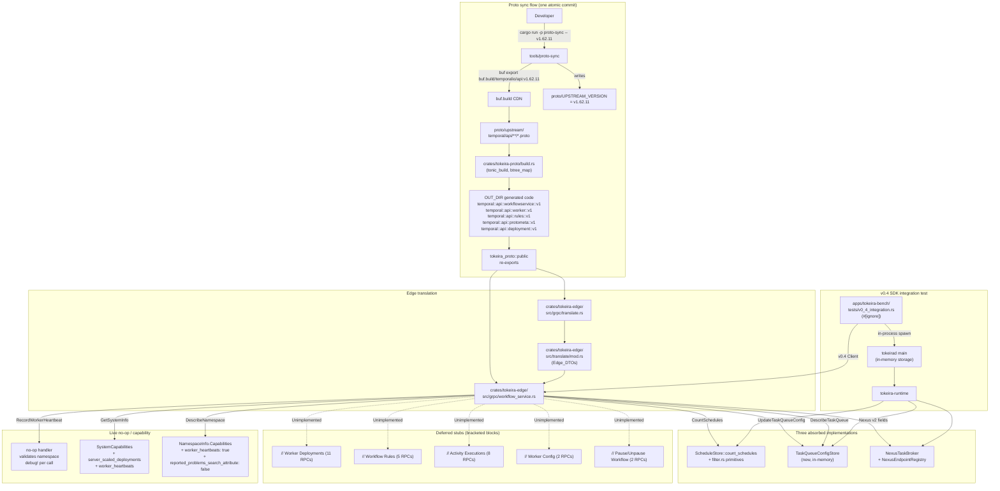

# Design Document: Temporal API v1.43 → v1.62.11 Sync

## Overview

This design turns `requirements.md` into a concrete implementation plan for resyncing Tokeira's vendored Temporal API protos from `v1.43.0` to `v1.62.11` and absorbing the wire-compat delta it produces. The work is scoped to restore the `v0.4_Liveness_Invariant` (a `temporalio-sdk v0.4.0` worker connects, polls, heartbeats, starts a workflow, and receives a completion) without landing any large new feature areas — those are classified `Classification_Deferred` and stubbed, with clear pointers to the specs that will implement them later.

The design is organised around seven principles that follow directly from Tokeira's architecture rules:

- **Proto resync is a single atomic commit.** `cargo run -p proto-sync -- v1.62.11` wipes `proto/upstream/` and re-exports from `buf.build/temporalio/api:v1.62.11`. The commit that lands the resync also bumps `proto/UPSTREAM_VERSION` and dissolves the four `Interim_Shims` introduced in `Commit_214895e`. No other behavioural edits land in the same commit — signature drift in translators is resolved in the same commit only to the minimum extent required to keep the workspace compiling (Req 1.3).
- **Translation stays at the edge.** All proto-to-DTO and DTO-to-proto work lives in `crates/tokeira-edge/src/grpc/translate.rs` (the `Edge_Translate` module) and `crates/tokeira-edge/src/translate/mod.rs` (the `Edge_DTOs`). No proto types cross the edge boundary into `tokeira-runtime`, `tokeira-kernel`, or `tokeira-projection`. This is Rule 2 of `tokeira/AGENTS.md` applied to wire compatibility: the kernel stays pure, and the edge is the only place that knows proto.
- **Classification is mechanical.** Every v1.43 → v1.62.11 delta gets placed into exactly one of five buckets (`Ignore`, `No-op stub`, `Capability advertise`, `Wire through`, `Full implementation (deferred)`). The Surface_Audit table in §5 is the single artifact that carries the classification; the Impact Matrix in §6 expands every `Wire through` row into concrete edge-DTO, runtime, kernel, and projection impact; §7 records the principle that governed each bucket placement.
- **Absorb only what costs less than deferring.** Three v1.62 surfaces are implemented in this spec rather than deferred: `CountSchedules` (a trivial count over the existing `ScheduleStore`), `UpdateTaskQueueConfig` (a setter over a new in-memory `TaskQueueConfigStore` that mirrors `ScheduleStore`/`VersioningRuleStore`), and Nexus v2 field wire-through on existing Nexus RPCs (decode, carry through `NexusTaskBroker`/`NexusEndpointRegistry`, re-emit). Every other feature area surfaces as an `Unimplemented` stub with a bracketed comment block naming the deferring spec.
- **RPC renames are live-handler migrations.** The four `*ById` activity RPCs (`UpdateActivityOptionsById`, `PauseActivityById`, `UnpauseActivityById`, `ResetActivityById`) are renamed in-place to their unsuffixed v1.62 forms. Handler bodies are preserved modulo signature drift. These migrations are not stubs — they are live RPCs whose message types and field layouts changed, and they do not belong inside any deferred-block bracketed comment.
- **Reviewability is a first-class artifact.** The Surface_Audit table is expected to carry 60–100+ rows covering every RPC, field, message, enum, and package change. Classification decisions are reviewable inline alongside the design, not buried in implementation PRs. The Impact Matrix enforces that every `Classification_WireThrough` field that is not `none`/`none`/`none` across all three downstream impact columns is escalated to `Classification_Deferred` if it would require more than a single-file change (Req 5.1.3, 5.1.4, 5.1.5).
- **v0.4 SDK integration test is the invariant guard.** A single, `#[ignore]`-gated integration test under `apps/tokeira-bench/tests/v0_4_integration.rs` spawns `tokeirad` in-process against an in-memory storage backend, runs a v0.4 SDK worker for two heartbeat intervals, starts a workflow, asserts completion, and greps server logs for at least one `record_worker_heartbeat` debug line. It is the regression guard that catches anyone who later strips the heartbeat handler or the capability advertisement. It uses `tokio::sync::Notify` for synchronisation per `tokeira/AGENTS.md` Rule 1, completes in under 120 s, and is opt-in via `--include-ignored`.

## Architecture

The diagram below shows the proto-sync flow end-to-end (Req 1.1–1.3, Req 2, Req 4) plus the three absorbed implementations (Req 4.6 CountSchedules, Req 4.7 UpdateTaskQueueConfig, Req 4.8 Nexus v2 wire-through):



The left-to-right flow (proto-sync → `buf.build` → `proto/upstream/` → `tonic_build` → `OUT_DIR` → edge translate + workflow service handlers) is a single invocation of an existing tool. The right-hand clusters (absorbed implementations, deferred stubs, live no-op/capability, integration test) are what this spec adds on top of the resynced surface.

## Components and Interfaces

The components below are numbered in the order they appear in an implementation task list. Each subsection maps to one or more acceptance criteria from `requirements.md`.

### 1. Proto sync invocation (Req 1.1, 1.2, 1.3, 3.1, 3.2)

The `tools/proto-sync` binary is owned by the `proto-upstream-sync` spec and is consumed here unchanged (Req 1.1.5). The invocation:

```bash
# From the tokeira/ workspace root:
cargo run -p proto-sync -- v1.62.11
```

- Wipes `proto/upstream/temporal/api/`.
- Runs `buf export buf.build/temporalio/api:v1.62.11 --output proto/upstream/`.
- Writes `proto/UPSTREAM_VERSION` with the exact string `v1.62.11\n`.

The post-sync tree includes three packages that did not exist in the v1.43 vendor:

| Package | File | Purpose |
|---|---|---|
| `temporal.api.worker.v1` | `temporal/api/worker/v1/message.proto` | `WorkerHeartbeat`, `WorkerPollerInfo`, `WorkerSlotsInfo`, `WorkerHostInfo`, `WorkerInfo`, `WorkerListInfo`, `PluginInfo`, `StorageDriverInfo` |
| `temporal.api.rules.v1` | `temporal/api/rules/v1/message.proto` | `WorkflowRuleSpec`, `WorkflowRule`, `WorkflowRuleAction`, `WorkflowRuleActionTrigger` |
| `temporal.api.protometa.v1` | `temporal/api/protometa/v1/annotations.proto` | Informational proto annotations (no code impact beyond compile) |

The `crates/tokeira-proto/build.rs` script globs `proto/upstream/` and compiles via `tonic_build` with `btree_map(["."])`. No change to `build.rs` is required — it already discovers new packages automatically. The `tokeira_proto::public` module re-exports the `temporal::api::*` hierarchy following the `proto-upstream-sync` spec's pattern, so the three new packages become available as `tokeira_proto::public::temporal::api::{worker,rules,protometa}::v1` automatically.

Four hand-authored artefacts from `Commit_214895e` disappear with the resync (Req 3.1, 3.2):

1. The `worker_heartbeats: bool = 4;` backport on `NamespaceInfo.Capabilities` in `proto/upstream/temporal/api/namespace/v1/message.proto`.
2. The `rpc RecordWorkerHeartbeat` declaration in `proto/upstream/temporal/api/workflowservice/v1/service.proto`.
3. The empty `RecordWorkerHeartbeatRequest` / `RecordWorkerHeartbeatResponse` messages (with `repeated bytes worker_heartbeat = 3`) in `proto/upstream/temporal/api/workflowservice/v1/request_response.proto`.
4. The two rationale comments (`"Tokeirad currently accepts heartbeats as a no-op"`, `"A production implementation is tracked in a follow-up spec"`) that Commit_214895e added to those files.

All four are replaced by the upstream re-export, which carries `worker_heartbeats` as field 4 natively and declares `RecordWorkerHeartbeatRequest.worker_heartbeat` as `repeated temporal.api.worker.v1.WorkerHeartbeat` (field number per the upstream schema).

### 2. Edge DTO additions (Req 4.1, 4.2, 4.4, 4.6, 4.7, 4.8)

The Edge_DTO module at `crates/tokeira-edge/src/translate/mod.rs` grows to cover v1.62 additions. The additions are grouped by the DTO they extend:

**`SystemCapabilities`** (Req 4.1.1, 4.1.2):

```rust
/// See §Data Models for the full struct plus its manual `Default` impl.
/// `Default` is implemented by hand (not derived) so
/// `SystemCapabilities::default().worker_heartbeats == true`, matching the
/// v0.4 SDK liveness contract Req 4.1.2 requires.
#[derive(Debug, Clone, Serialize, Deserialize, PartialEq, Eq)]
pub struct SystemCapabilities {
    pub signal_and_query_header: bool,
    pub internal_errors_cause_failures: bool,
    pub activity_failure_include_heartbeat: bool,
    pub supports_schedules: bool,
    pub encoded_failure_attributes: bool,
    pub build_id_based_versioning: bool,
    pub upsert_memo: bool,
    pub eager_workflow_start: bool,
    pub sdk_metadata: bool,
    pub count_group_by_execution_status: bool,
    pub nexus: bool,
    // v1.62 additions:
    /// Advertised as `false`: Worker Deployments are deferred to the
    /// `worker-deployments` spec. See Surface_Audit row for the wire-level rationale.
    pub server_scaled_deployments: bool,
    /// Advertised as `true`: `record_worker_heartbeat` accepts calls and
    /// returns `Ok`. Real observability deferred to `worker-heartbeat-observability`.
    pub worker_heartbeats: bool,
}
// impl Default for SystemCapabilities — see §Data Models for the body.
```

**`NamespaceDescription` and its `Capabilities` sub-struct** (Req 3.3, 4.1.4, 4.4.1, 4.4.3):

```rust
/// See §Data Models for the full struct plus its manual `Default` impl;
/// `NamespaceCapabilities::default().worker_heartbeats == true` matching
/// `SystemCapabilities`.
#[derive(Debug, Clone, Serialize, Deserialize, PartialEq, Eq)]
pub struct NamespaceCapabilities {
    /// Advertised as `true`: same semantics as `SystemCapabilities.worker_heartbeats`.
    pub worker_heartbeats: bool,
    /// Advertised as `false`: Tokeira does not emit reported-problems search
    /// attributes. Flipping to `true` requires a projection migration (deferred).
    pub reported_problems_search_attribute: bool,
}
// impl Default for NamespaceCapabilities — see §Data Models for the body.

#[derive(Debug, Clone, Default, Serialize, Deserialize)]
pub struct NamespaceDescription {
    pub namespace_info: NamespaceInfo,
    pub config: NamespaceConfig,
    pub replication_config: NamespaceReplicationConfig,
    pub failover_version: i64,
    pub is_global_namespace: bool,
    pub capabilities: NamespaceCapabilities,
    // DTO additions mirroring v1.62 NamespaceInfo / NamespaceConfig additions
    // identified as Classification_WireThrough in the Surface_Audit are
    // appended here. Additions classified Classification_Deferred are
    // explicitly dropped at the edge per tightened Req 2.2.6 — NOT mirrored
    // on this DTO, NOT carried as opaque bytes, and the response path emits
    // the protobuf default.
}
```

**`RespondWorkflowTaskCompletedRequest`** (Req 4.2):

```rust
#[derive(Debug, Clone, Default, Serialize, Deserialize)]
pub struct RespondWorkflowTaskCompletedRequest {
    // ... existing fields ...

    /// Decoded from `capabilities.discard_speculative_workflow_task_with_events`.
    /// Defaults to `false` when the client did not send the capabilities message
    /// at all (protobuf default-semantics on an optional nested message).
    ///
    /// The edge stores this but does NOT propagate it past
    /// `Workflow_Service_Impl` today. Kernel/runtime do not yet emit
    /// speculative workflow tasks as a distinct task kind; when they do,
    /// a future `speculative-wft` spec will add the downstream plumbing.
    pub client_discards_speculative_with_events: bool,
}
```

**`CountSchedulesRequest` / `CountSchedulesResponse`** (Req 4.6.5):

```rust
#[derive(Debug, Clone, Default, Serialize, Deserialize)]
pub struct CountSchedulesRequest {
    pub namespace: String,
    /// None when the request's query field is empty per Req 4.6.3.
    pub query: Option<String>,
}

#[derive(Debug, Clone, Default, Serialize, Deserialize)]
pub struct CountSchedulesResponse {
    pub count: u64,
}
```

**`UpdateTaskQueueConfigRequest` / `UpdateTaskQueueConfigResponse`** and a DTO for the stored config (Req 4.7):

```rust
#[derive(Debug, Clone, Default, Serialize, Deserialize)]
pub struct TaskQueueConfig {
    pub rate_limit_override: Option<f64>,
    pub description: String,
    pub tier_hint: Option<String>,
    // Additional fields enumerated by the Surface_Audit for v1.62 task-queue
    // config are added here as they are confirmed by the resynced proto.
}

#[derive(Debug, Clone, Default, Serialize, Deserialize)]
pub struct UpdateTaskQueueConfigRequest {
    pub namespace: String,
    pub task_queue: String,
    pub config: TaskQueueConfig,
}

#[derive(Debug, Clone, Default, Serialize, Deserialize)]
pub struct UpdateTaskQueueConfigResponse {
    pub applied: TaskQueueConfig,
}
```

**Nexus v2 field additions** (Req 4.8): new fields land on the existing Nexus DTOs in `crates/tokeira-edge/src/translate/nexus.rs`. The exact fields are enumerated by the Surface_Audit rows for Nexus messages (§5 below). The pattern is: decode every added field into the existing DTO, pass the DTO through `NexusTaskBroker`/`NexusEndpointRegistry`, and re-emit on the response-path translator.

### 3. Capability advertisement (Req 3.3, 3.4, 4.1.3, 4.1.5, 4.4.1)

Two translator functions change:

**`system_info_to_proto`** in `crates/tokeira-edge/src/grpc/translate.rs` around lines 825–848:

```rust
pub fn system_info_to_proto(
    sys: &SystemInfo,
) -> workflowservice::get_system_info_response::Capabilities {
    workflowservice::get_system_info_response::Capabilities {
        signal_and_query_header: sys.capabilities.signal_and_query_header,
        internal_errors_cause_failures: sys.capabilities.internal_errors_cause_failures,
        // ... existing fields ...
        nexus: sys.capabilities.nexus,
        // v1.62 additions — every Classification_Capability field from the
        // Surface_Audit appears here. Values are driven by `SystemCapabilities`
        // rather than literals, so flipping them is a one-line change in
        // `workflow_service.rs` around the `SystemInfo` construction.
        server_scaled_deployments: sys.capabilities.server_scaled_deployments,
        worker_heartbeats: sys.capabilities.worker_heartbeats,
    }
}
```

**`namespace_to_proto`** in the same file around line 865:

```rust
// Replaces the Commit_214895e literal. The rationale comment references
// `temporal-api-v1.62-sync` and names `worker-heartbeat-observability` as the
// spec that owns real observability (Req 3.3.3).
namespace_proto::namespace_info::Capabilities {
    worker_heartbeats: desc.capabilities.worker_heartbeats,
    reported_problems_search_attribute: desc.capabilities.reported_problems_search_attribute,
    // Any further v1.62 additions classified Classification_Capability on
    // NamespaceInfo.Capabilities are populated here per the Surface_Audit.
}
```

The `SystemInfo` construction site in `crates/tokeira-edge/src/workflow_service.rs` around lines 2283–2288 (Req 4.1.5) populates the new fields directly:

```rust
SystemInfo {
    server_version: VERSION.to_string(),
    capabilities: SystemCapabilities {
        // ... existing field assignments ...
        server_scaled_deployments: false, // Worker Deployments deferred
        worker_heartbeats: true,          // no-op handler keeps SDK alive
    },
}
```

The `Default::default()` pattern is explicitly avoided for these two v1.62 additions because silent default-initialisation would make the classification invisible at the call site. The values are written out verbatim so reviewers see them.

### 4. `CountSchedules` implementation (Req 4.6)

Two changes — one on the `ScheduleStore` trait in `tokeira-runtime`, one on the `Workflow_Service_Impl` handler.

**Trait extension** in `crates/tokeira-runtime/src/schedule_store.rs` (the existing `ScheduleStore` file):

```rust
impl ScheduleStore {
    /// Count the schedules in `namespace` that match `query`.
    ///
    /// `query` is `None` when the request's query field was empty per Req 4.6.3;
    /// in that case, all schedules in the namespace are counted.
    ///
    /// When `query` is `Some`, it is compiled via
    /// `tokeira_projection::filter::compile_filter` against a set of filter
    /// primitives that understand a restricted subset of fields that schedules
    /// carry: `schedule_id`, `namespace`, `paused`, `notes`, and any custom
    /// search attributes the schedule carries. The supported operators are
    /// `eq`, `in`, and `between`, matching the existing search-attribute
    /// filter types used by `CountWorkflowExecutions`. Any query that references
    /// an unsupported field produces `ScheduleCountError::UnsupportedQuery`,
    /// which maps to `Status::invalid_argument("unsupported schedule query")`
    /// at the edge per Req 4.6.3.
    pub fn count_schedules(
        &self,
        namespace: &NamespaceId,
        query: Option<&str>,
    ) -> Result<u64, ScheduleCountError> {
        let entries = self.entries_for_namespace(namespace);
        let Some(q) = query else {
            return Ok(entries.len() as u64);
        };
        let filter = tokeira_projection::filter::compile_schedule_filter(q)
            .map_err(|_| ScheduleCountError::UnsupportedQuery)?;
        Ok(entries.iter().filter(|e| filter.matches(e)).count() as u64)
    }
}

#[derive(Debug, thiserror::Error)]
pub enum ScheduleCountError {
    #[error("unsupported schedule query")]
    UnsupportedQuery,
}
```

**Filter grammar.** The restricted subset chosen for schedules is:

- `eq`: `schedule_id = "foo"`, `paused = true`
- `in`: `schedule_id IN ("foo", "bar")`
- `between`: reserved for future date-typed fields; rejected today because schedules carry no date-typed primary filterable field and we do not want to bake half-implemented behaviour in.

This is a subset of the existing search-attribute filter types compiled by `crates/tokeira-projection/src/filter.rs`. The `compile_schedule_filter` entry point is a thin wrapper around the existing compiler that restricts the permitted field set at parse time and refuses to descend into free-text search expressions. Unsupported syntax, unsupported fields, and malformed queries all map to `ScheduleCountError::UnsupportedQuery` and the edge emits `Status::invalid_argument("unsupported schedule query")`.

**Handler** in `crates/tokeira-edge/src/grpc/workflow_service.rs`:

```rust
async fn count_schedules(
    &self,
    request: Request<workflowservice::CountSchedulesRequest>,
) -> Result<Response<workflowservice::CountSchedulesResponse>, Status> {
    let req = request.into_inner();
    let dto = translate::to_internal::count_schedules_request(&req);
    // Req 4.6.1 (via shared handler convention): empty namespace is a
    // client programming error, mapped to `invalid_argument` before we
    // touch the namespace registry. This matches `shutdown_worker` and
    // `update_task_queue_config` and keeps the not-found vs
    // invalid-argument distinction crisp for SDK error handling.
    if dto.namespace.is_empty() {
        return Err(Status::invalid_argument("namespace is required"));
    }
    let namespace_id = self
        .namespaces
        .resolve(&dto.namespace)
        .ok_or_else(|| Status::not_found("namespace not found"))?;
    let count = self
        .schedule_store
        .count_schedules(&namespace_id, dto.query.as_deref())
        .map_err(|e| match e {
            ScheduleCountError::UnsupportedQuery => {
                Status::invalid_argument("unsupported schedule query")
            }
        })?;
    Ok(Response::new(workflowservice::CountSchedulesResponse {
        count: count as i64,
    }))
}
```

The explicit `is_empty()` guard maps empty namespace to `invalid_argument` before resolution — ahead of the `.resolve()` call which would otherwise return `None` and map to `not_found`. Non-existent-but-non-empty namespaces still map to `Status::not_found(...)` per Req 4.6.4, matching `DescribeNamespace`'s convention.

### 5. `UpdateTaskQueueConfig` implementation (Req 4.7)

A new trait `TaskQueueConfigStore` lives at `crates/tokeira-runtime/src/task_queue_config.rs`, mirroring the shape and construction conventions of `ScheduleStore` and `VersioningRuleStore`.

**Module path.** `crates/tokeira-runtime/src/task_queue_config.rs` — a new file alongside `schedule_store.rs` and `versioning_rules.rs`, re-exported from `crates/tokeira-runtime/src/lib.rs`.

**Trait shape.**

```rust
/// Backing store for per-(namespace, task_queue) configuration set via
/// `UpdateTaskQueueConfig` and read back on `DescribeTaskQueue`.
///
/// This spec provides only the in-memory default backing. DSQL-backed
/// persistence is deferred to whichever spec lands task-queue persistence next.
/// The in-memory backing is sufficient for the v0.4_Liveness_Invariant and
/// for operator use of the Temporal UI task queue management page in a
/// single-process `tokeirad` instance.
pub trait TaskQueueConfigStore: Send + Sync + 'static {
    fn get(&self, namespace: &NamespaceId, task_queue: &str) -> Option<TaskQueueConfigEntry>;
    fn set(&self, namespace: &NamespaceId, task_queue: &str, config: TaskQueueConfigEntry);
    fn list(&self, namespace: &NamespaceId) -> Vec<(String, TaskQueueConfigEntry)>;
}

#[derive(Debug, Clone, Default, Serialize, Deserialize)]
pub struct TaskQueueConfigEntry {
    pub rate_limit_override: Option<f64>,
    pub description: String,
    pub tier_hint: Option<String>,
}

/// Default in-memory backing used by `apps/tokeirad/src/main.rs`.
/// Uses `DashMap<(NamespaceId, String), TaskQueueConfigEntry>` for thread-safe
/// concurrent access from gRPC handlers, consistent with `ScheduleStore`'s
/// `DashMap` pattern (see `edge-schedule-transport` spec's rationale for
/// `DashMap` over `Mutex<HashMap>`).
#[derive(Default)]
pub struct InMemoryTaskQueueConfigStore { /* ... */ }

impl TaskQueueConfigStore for InMemoryTaskQueueConfigStore { /* ... */ }
```

**Construction.** In `apps/tokeirad/src/main.rs` alongside the other store constructions around lines 125–150 (next to `VersioningRuleStore::default()` and `ScheduleStore::default()`):

```rust
use tokeira_runtime::{
    // ... existing imports ...
    ScheduleStore, TaskQueueConfigStore, VersioningRuleStore,
    InMemoryTaskQueueConfigStore,
};

let versioning_rule_store = Arc::new(VersioningRuleStore::default());
let schedule_store = Arc::new(ScheduleStore::default());
let task_queue_config_store: Arc<dyn TaskQueueConfigStore> =
    Arc::new(InMemoryTaskQueueConfigStore::default());

// Passed to the edge workflow service alongside the other stores.
```

**`UpdateTaskQueueConfig` handler.**

```rust
async fn update_task_queue_config(
    &self,
    request: Request<workflowservice::UpdateTaskQueueConfigRequest>,
) -> Result<Response<workflowservice::UpdateTaskQueueConfigResponse>, Status> {
    let req = request.into_inner();
    if req.namespace.is_empty() {
        return Err(Status::invalid_argument("namespace is required"));
    }
    if req.task_queue.is_empty() {
        return Err(Status::invalid_argument("task queue is required"));
    }
    let namespace_id = self
        .namespaces
        .resolve(&req.namespace)
        .ok_or_else(|| Status::not_found("namespace not found"))?;
    let dto = translate::to_internal::update_task_queue_config_request(&req);
    self.task_queue_config_store
        .set(&namespace_id, &dto.task_queue, dto.config.clone().into());
    Ok(Response::new(workflowservice::UpdateTaskQueueConfigResponse {
        config: Some(dto.config.into()),
    }))
}
```

**`DescribeTaskQueue` integration** (Req 4.7.3). The existing `describe_task_queue` handler reads `self.task_queue_config_store.get(&namespace_id, &req.task_queue)` and populates the corresponding config fields on `DescribeTaskQueueResponse` if the v1.62 proto carries them. If the stored config is `None` (no prior `UpdateTaskQueueConfig` call), the response carries the default `TaskQueueConfig` (all fields at their protobuf defaults), matching upstream semantics.

**Explicitly out of scope.** No DSQL migration is added. No admission-control or rate-limit enforcement change is made (Req 4.7.5). The store is a setter/getter only.

### 6. Nexus v2 wire-through (Req 4.8)

Every v1.62-added field on an existing Nexus message is decoded, carried through `NexusTaskBroker` / `NexusEndpointRegistry`, and re-emitted. No new Nexus RPCs or kernel transitions are introduced (Req 4.8.4).

The wire-through path for each field follows a fixed pattern:

1. **Decode** in `crates/tokeira-edge/src/translate/nexus.rs`: the `*_from_proto` translator function copies the new field off the proto into the DTO.
2. **Carry** through `NexusTaskBroker` (in `tokeira-runtime`, owner of in-flight Nexus tasks): the field is added to whichever internal state type already carries the message, with no behavioural coupling to dispatch or retry.
3. **Re-emit** via the `*_to_proto` translator: on the response path, the DTO's field is copied back onto the proto.

For `NexusEndpointSpec` additions — specifically any new `endpoint_type` enum variants — `NexusEndpointRegistry::resolve` gets a new match arm that returns an appropriate error for endpoints whose type `tokeirad` does not yet route (Req 4.8.3). The error is `NexusResolution::Failed { message: format!("nexus endpoint type {:?} not yet routed", endpoint_type) }`, consistent with the pattern used for unknown endpoints.

If a Nexus field's semantics cannot be expressed by simple propagation (for example, a field that changes retry policy or dispatch timing), the Surface_Audit row for that field is escalated to `Classification_Deferred` with a pointer to a future Nexus-focused spec (Req 4.8.5).

### 7. Stub handler blocks for deferred RPCs (Req 6.1, 6.2, 6.3)

All Classification_Deferred and Classification_Ignore RPCs live at the end of `crates/tokeira-edge/src/grpc/workflow_service.rs`, clustered into bracketed blocks by feature area. This placement is deliberate (Req 6.2.1 bracket convention): a future spec that implements one of these feature areas finds all its RPCs together and can remove them as a unit.

The rename migrations from §8 are emphatically not inside any deferred block — they are live handlers with real behaviour.

**Block placement.** The stub blocks appear after all live handlers in `workflow_service.rs`. The ordering within the file is:

```
// === Live handlers (existing v1.43 RPCs + renames + three absorbed) ===
// ...hundreds of lines of live handlers...

// === Worker Deployments — deferred to worker-deployments spec ===
async fn describe_worker(...) -> Result<..., Status> { ... }
async fn list_workers(...) -> Result<..., Status> { ... }
// ...11 handlers total...
// === End Worker Deployments block ===

// === Workflow Rules — deferred to workflow-rules spec ===
// ...5 handlers...
// === End Workflow Rules block ===

// === Activity Executions — deferred to activity-executions-first-class spec ===
// ...8 handlers...
// === End Activity Executions block ===

// === Worker Config — deferred to worker-config-management spec ===
// ...2 handlers...
// === End Worker Config block ===

// === Pause/Unpause Workflow — deferred to kernel-pause-workflow spec ===
// ...2 handlers...
// === End Pause/Unpause Workflow block ===
```

**Handler template** (Req 6.1.1, 6.1.3, 6.1.4):

```rust
async fn describe_worker(
    &self,
    _request: Request<workflowservice::DescribeWorkerRequest>,
) -> Result<Response<workflowservice::DescribeWorkerResponse>, Status> {
    tracing::debug!(rpc = "DescribeWorker", spec = "worker-deployments", "unimplemented RPC called");
    Err(Status::unimplemented(
        "DescribeWorker is not implemented; tracked in spec worker-deployments",
    ))
}
```

The template is mechanical: one `debug!` log, one `Err(Status::unimplemented(...))` with a message naming both the RPC and the deferring spec. No `warn!` or higher log levels (Req 6.1.4) because SDKs call these opportunistically during feature detection.

**Rename interaction.** The four renames in §8 (`*ById` → unsuffixed) are not stubs. They live in the "Live handlers" section above the bracketed blocks, with `update_activity_options` / `pause_activity` / `unpause_activity` / `reset_activity` as the handler names. The Surface_Audit rows for the renamed RPCs carry `Classification_WireThrough` (rename-only) and the Disposition column reads `rename handler from *_by_id; preserve behaviour; no new fields`.

### 8. RPC renames: `*ById` → unsuffixed (Req 4.3)

The four activity-management RPCs renamed between v1.43 and v1.62:

| v1.43 name | v1.62 name |
|---|---|
| `UpdateActivityOptionsById` | `UpdateActivityOptions` |
| `PauseActivityById` | `PauseActivity` |
| `UnpauseActivityById` | `UnpauseActivity` |
| `ResetActivityById` | `ResetActivity` |

Migration steps:

1. The v1.43 names no longer exist in the generated `workflowservice::workflow_service_server::WorkflowService` trait after the resync (Req 4.3.1). Any v1.43 handlers under the old names become orphan methods on the impl block and must be renamed or the impl block will fail to satisfy the trait.
2. Each handler is renamed in-place: `update_activity_options_by_id` → `update_activity_options`, etc. The method body is preserved modulo the signature drift from renamed message types (`PauseActivityByIdRequest` → `PauseActivityRequest`, etc.) (Req 4.3.2).
3. Edge_DTO names lose their `ById` suffixes: `PauseActivityByIdRequest` DTO → `PauseActivityRequest` DTO (Req 4.3.4). All callers are updated.
4. The Surface_Audit Disposition column for each rename row reads `rename handler; preserve behaviour; no new fields if no new fields are added; otherwise escalate per Req 4.3.3`. Req 4.3.3 requires that if the v1.62 `PauseActivityRequest` / etc. gained new fields relative to its `*ById` predecessor, those fields are enumerated in the Surface_Audit and classified individually; a blanket "preserve behaviour" migration does not proceed if any new field is Classification_WireThrough.

### 9. `record_worker_heartbeat` migration (Req 3.4)

The existing no-op handler at `crates/tokeira-edge/src/grpc/workflow_service.rs` around line 621 is updated to accept the upstream-typed request and adds a namespace validation step:

```rust
async fn record_worker_heartbeat(
    &self,
    request: Request<workflowservice::RecordWorkerHeartbeatRequest>,
) -> Result<Response<workflowservice::RecordWorkerHeartbeatResponse>, Status> {
    let req = request.into_inner();
    // Req 3.4.5: match the shutdown_worker convention for empty-namespace.
    if req.namespace.is_empty() {
        return Err(Status::invalid_argument("namespace is required"));
    }
    // Req 3.4.3: single debug line per call. A v0.4 worker emits one heartbeat
    // every 30 s per registered worker; higher levels would flood operator logs.
    tracing::debug!(
        rpc = "RecordWorkerHeartbeat",
        namespace = %req.namespace,
        heartbeat_count = req.worker_heartbeat.len(),
        "heartbeat accepted",
    );
    // Req 3.4.4 rationale comment: names this spec + the observability spec.
    // Real persistent storage of WorkerHeartbeat records is tracked in the
    // `worker-heartbeat-observability` spec.
    Ok(Response::new(workflowservice::RecordWorkerHeartbeatResponse {}))
}
```

The handler:

- Accepts `worker_heartbeat: Vec<temporal::api::worker::v1::WorkerHeartbeat>` from the upstream-typed request (Req 3.4.1).
- Returns `Ok(...)` with no side effects on Kernel, Runtime, Storage, or Projection (Req 3.4.2).
- Emits exactly one `debug!` line per call, including the namespace and heartbeat count for operator diagnostics (Req 3.4.3).
- Validates the namespace is non-empty and returns `invalid_argument` otherwise, matching `shutdown_worker` convention at `workflow_service.rs` lines 636–640 (Req 3.4.5).
- Carries a rationale comment naming `temporal-api-v1.62-sync` as the spec that introduced the shape and `worker-heartbeat-observability` as the spec that owns real observability (Req 3.4.4, 3.3.3).

### 10. Integration test harness (Req 7.1, 7.2)

The integration test lives at `apps/tokeira-bench/tests/v0_4_integration.rs`. It is gated behind `#[ignore]` with a rationale comment naming this spec, so the default `cargo test --workspace` does not run it (Req 7.1.1). Operators run it via:

```bash
cargo test --package tokeira-bench --test v0_4_integration -- --include-ignored
```

**Prerequisites discovered during design.** The test needs an in-process entry point for `tokeirad`. Today, `apps/tokeirad/src/main.rs` is binary-only — there is no public facade exposing the wiring so a test can construct and spawn `tokeirad` in-process. To satisfy Req 7.1.2 we adopt the in-process component-wiring approach (see §"Specific design decisions" 3 in the user's request), which requires exposing a thin facade:

- A new module `apps/tokeirad/src/lib.rs` that exports a `TokeiradHandle` type with a public `start_in_memory(addr: SocketAddr) -> anyhow::Result<TokeiradHandle>` constructor.
- `TokeiradHandle::start_in_memory` wires the same in-memory storage path `tokeirad main()` uses when started with `--storage in-memory`, binds to the caller-provided ephemeral socket, and returns a handle with `Drop` semantics that tear down the runtime cleanly.
- The existing `main` function becomes a thin `fn main()` that parses args and calls into the facade.

If the facade does not exist at the time the integration test lands, it is a prerequisite of this spec's tasks: the test task depends on the facade task and cannot start before the facade is merged. This dependency is captured in `tasks.md` (out of scope for this design doc).

**Test shape.**

```rust
#[ignore = "integration test; spawns tokeirad and a v0.4 SDK worker. See temporal-api-v1.62-sync."]
#[tokio::test]
async fn v0_4_sdk_worker_round_trip() -> anyhow::Result<()> {
    // 1. Start tokeirad in-process on an ephemeral port.
    let addr: SocketAddr = "127.0.0.1:0".parse()?;
    let handle = tokeirad::TokeiradHandle::start_in_memory(addr).await?;
    let server_addr = handle.bound_addr();

    // 2. Hook the server's tracing subscriber so we can assert on log lines
    //    (Req 7.1.6). `TokeiradHandle::log_sink()` returns a broadcast channel
    //    carrying every `tracing` event emitted by the server during the test.
    let logs = handle.log_sink();
    let heartbeat_seen = Arc::new(tokio::sync::Notify::new());
    let heartbeat_seen_clone = heartbeat_seen.clone();
    tokio::spawn(async move {
        let mut rx = logs.subscribe();
        while let Ok(event) = rx.recv().await {
            if event.contains("RecordWorkerHeartbeat") {
                heartbeat_seen_clone.notify_one();
            }
        }
    });

    // 3. Instantiate a v0.4 Client and assert capability advertisement.
    let client = temporalio_client::Client::builder()
        .target_url(format!("http://{server_addr}"))
        .build()
        .await?;
    let sys_info = client.get_system_info().await?;
    assert!(sys_info.capabilities.worker_heartbeats);
    let ns = client.describe_namespace("default").await?;
    assert!(ns.capabilities.worker_heartbeats, "worker_heartbeats must be advertised");

    // 4. Register EchoWorkflow, start a v0.4 Worker, and keep it alive
    //    until at least one observed RecordWorkerHeartbeat call reaches
    //    tokeirad — proves the SDK-to-server heartbeat path works
    //    end-to-end. Steady-state heartbeating across multiple intervals
    //    is the `worker-heartbeat-observability` spec's concern.
    //    The worker uses tokio::sync::Notify to signal completion; no
    //    fixed sleeps anywhere.
    let worker_done = Arc::new(tokio::sync::Notify::new());
    let worker_done_clone = worker_done.clone();
    let worker_task = tokio::spawn(async move {
        let worker = temporalio_sdk::Worker::builder()
            .client(client.clone())
            .task_queue("v0_4_integration")
            .register_workflow("EchoWorkflow", apps::tokeira_bench::EchoWorkflow)
            .build()?;
        worker.run_until(worker_done_clone).await
    });

    // 5. Start a workflow, wait for completion, assert payload.
    let run = client
        .start_workflow("EchoWorkflow", "v0_4_integration", json!({"msg": "hello"}))
        .await?;
    let result = run.get_result().await?;
    assert_eq!(result["msg"], "hello");

    // 6. Wait for at least one heartbeat log line, then shut down.
    tokio::time::timeout(Duration::from_secs(90), heartbeat_seen.notified()).await?;

    worker_done.notify_one();
    worker_task.await??;
    handle.shutdown().await?;
    Ok(())
}
```

**Timing.** The SDK worker heartbeat interval is 30 s; the test waits up to 90 s for the first `RecordWorkerHeartbeat` log line, giving the 30-second interval two chances to fire before the test times out. The full test completes in ≈90 s upper bound including workflow execution and teardown (Req 7.1.7). Steady-state / multi-heartbeat observability is the `worker-heartbeat-observability` spec's concern and is explicitly not asserted here.

**Synchronisation.** All waits use `tokio::sync::Notify` or `tokio::time::timeout` over channels. No `tokio::time::sleep` or `std::thread::sleep` appears anywhere in the test, per `tokeira/AGENTS.md` Rule 1.

**Bench-binary invariance** (Req 7.2). `bench_worker.rs` and `bench_starter.rs` remain source-unchanged. If v0.4 SDK signatures drift, the `Cargo.toml` pin is updated to a version compatible with the v1.62.11 server surface and the diff is minimal.


## Data Models

This section collects the concrete Rust struct additions introduced by the design. Every struct lives in `crates/tokeira-edge/src/translate/mod.rs` unless otherwise noted. Rust snippets are complete (not pseudocode) so a reviewer can see exactly what the resulting code looks like. Field-level rationale is inline.

### `SystemCapabilities` — final shape

```rust
// crates/tokeira-edge/src/translate/mod.rs

/// Mirrors `workflowservice::get_system_info_response::Capabilities`.
///
/// New v1.62 fields are additive and default to values that keep SDK v0.4
/// workers healthy: `worker_heartbeats = true` (no-op handler accepts calls),
/// `server_scaled_deployments = false` (Worker Deployments are stubs).
///
/// `Default` is implemented manually rather than derived because the
/// derived `bool::default()` is `false`, which would silently downgrade
/// `worker_heartbeats` to `false` anywhere the struct is constructed via
/// `SystemCapabilities::default()`. Failing the v0.4 liveness contract at
/// the default construction site is exactly the regression this spec
/// exists to prevent.
#[derive(Debug, Clone, Serialize, Deserialize, PartialEq, Eq)]
pub struct SystemCapabilities {
    pub signal_and_query_header: bool,
    pub internal_errors_cause_failures: bool,
    pub activity_failure_include_heartbeat: bool,
    pub supports_schedules: bool,
    pub encoded_failure_attributes: bool,
    pub build_id_based_versioning: bool,
    pub upsert_memo: bool,
    pub eager_workflow_start: bool,
    pub sdk_metadata: bool,
    pub count_group_by_execution_status: bool,
    pub nexus: bool,
    pub server_scaled_deployments: bool,
    pub worker_heartbeats: bool,
}

impl Default for SystemCapabilities {
    fn default() -> Self {
        Self {
            // v1.43-era capabilities default to the values already advertised
            // by the existing server; flipping one is a deliberate act at the
            // construction site.
            signal_and_query_header: false,
            internal_errors_cause_failures: false,
            activity_failure_include_heartbeat: false,
            supports_schedules: false,
            encoded_failure_attributes: false,
            build_id_based_versioning: false,
            upsert_memo: false,
            eager_workflow_start: false,
            sdk_metadata: false,
            count_group_by_execution_status: false,
            nexus: false,
            // Worker Deployments are stubs in this spec; advertise `false`.
            server_scaled_deployments: false,
            // No-op `RecordWorkerHeartbeat` handler accepts every call; the
            // SDK v0.4 worker shuts down immediately if this is `false`.
            worker_heartbeats: true,
        }
    }
}
```

### `NamespaceCapabilities` — new struct, replaces the ad-hoc capability literal

```rust
// crates/tokeira-edge/src/translate/mod.rs

/// Mirrors `namespace::v1::NamespaceInfo::Capabilities`.
///
/// Manual `Default` is used for the same reason as `SystemCapabilities`:
/// `#[derive(Default)]` on `bool` produces `false`, which would silently
/// downgrade the advertised capability and fail the SDK v0.4 liveness
/// contract at every call site that constructed the struct via `::default()`.
#[derive(Debug, Clone, Serialize, Deserialize, PartialEq, Eq)]
pub struct NamespaceCapabilities {
    pub worker_heartbeats: bool,
    pub reported_problems_search_attribute: bool,
}

impl Default for NamespaceCapabilities {
    fn default() -> Self {
        Self {
            // No-op `RecordWorkerHeartbeat` handler accepts every call;
            // advertise `true` so v0.4 workers stay alive.
            worker_heartbeats: true,
            // Tokeira does not emit reported-problems search attributes;
            // advertise `false` so SDKs do not wait for them.
            reported_problems_search_attribute: false,
        }
    }
}
```

### `NamespaceDescription` — extended shape

```rust
// crates/tokeira-edge/src/translate/mod.rs

#[derive(Debug, Clone, Default, Serialize, Deserialize)]
pub struct NamespaceDescription {
    pub namespace_info: NamespaceInfo,
    pub config: NamespaceConfig,
    pub replication_config: NamespaceReplicationConfig,
    pub failover_version: i64,
    pub is_global_namespace: bool,
    /// v1.62 addition — carries both `worker_heartbeats` (true) and
    /// `reported_problems_search_attribute` (false). See Surface_Audit.
    pub capabilities: NamespaceCapabilities,
}
```

Any v1.62 addition to `NamespaceInfo` or `NamespaceConfig` classified `Classification_WireThrough` in the Surface_Audit is mirrored into the nested DTOs (`NamespaceInfo` / `NamespaceConfig`). Any addition classified `Classification_Deferred` is not mirrored onto the DTO and is not propagated — the edge translator emits the protobuf default on the response path, and a Surface_Audit row names the deferring spec (Req 4.4.2, 4.4.3).

### `RespondWorkflowTaskCompletedRequest` — extension field

```rust
// crates/tokeira-edge/src/translate/mod.rs

#[derive(Debug, Clone, Default, Serialize, Deserialize)]
pub struct RespondWorkflowTaskCompletedRequest {
    pub namespace: String,
    pub task_token: Vec<u8>,
    pub commands: Vec<Command>,
    pub identity: String,
    pub sticky_attributes: Option<StickyExecutionAttributes>,
    pub return_new_workflow_task: bool,
    pub force_create_new_workflow_task: bool,
    pub binary_checksum: String,
    pub query_results: HashMap<String, WorkflowQueryResult>,
    pub namespace_id: String,
    pub messages: Vec<Message>,
    pub sdk_metadata: Option<WorkerVersionStamp>,
    pub metering_metadata: Option<MeteringMetadata>,

    /// v1.62 addition: `capabilities.discard_speculative_workflow_task_with_events`.
    ///
    /// Stored on the DTO per Req 4.2.1, propagated only to Workflow_Service_Impl
    /// per Req 4.2.3. A future `speculative-wft` spec will consume this.
    /// Defaults to `false` when the client did not send the capabilities message
    /// (protobuf default-semantics on an optional nested message, Req 4.2.4).
    pub client_discards_speculative_with_events: bool,
}
```

### `CountSchedulesRequest` / `CountSchedulesResponse` — new DTOs

```rust
// crates/tokeira-edge/src/translate/mod.rs

#[derive(Debug, Clone, Default, Serialize, Deserialize)]
pub struct CountSchedulesRequest {
    pub namespace: String,
    /// `None` when the proto's `query` field was empty (Req 4.6.3).
    pub query: Option<String>,
}

#[derive(Debug, Clone, Default, Serialize, Deserialize)]
pub struct CountSchedulesResponse {
    pub count: u64,
}
```

### `UpdateTaskQueueConfig` DTOs and the backing store

```rust
// crates/tokeira-edge/src/translate/mod.rs

#[derive(Debug, Clone, Default, Serialize, Deserialize, PartialEq)]
pub struct TaskQueueConfig {
    pub rate_limit_override: Option<f64>,
    pub description: String,
    pub tier_hint: Option<String>,
}

#[derive(Debug, Clone, Default, Serialize, Deserialize)]
pub struct UpdateTaskQueueConfigRequest {
    pub namespace: String,
    pub task_queue: String,
    pub config: TaskQueueConfig,
}

#[derive(Debug, Clone, Default, Serialize, Deserialize)]
pub struct UpdateTaskQueueConfigResponse {
    pub applied: TaskQueueConfig,
}
```

```rust
// crates/tokeira-runtime/src/task_queue_config.rs

use dashmap::DashMap;
use std::sync::Arc;
use tokeira_types::NamespaceId;

#[derive(Debug, Clone, Default, PartialEq)]
pub struct TaskQueueConfigEntry {
    pub rate_limit_override: Option<f64>,
    pub description: String,
    pub tier_hint: Option<String>,
}

pub trait TaskQueueConfigStore: Send + Sync + 'static {
    fn get(&self, namespace: &NamespaceId, task_queue: &str) -> Option<TaskQueueConfigEntry>;
    fn set(&self, namespace: &NamespaceId, task_queue: &str, config: TaskQueueConfigEntry);
    fn list(&self, namespace: &NamespaceId) -> Vec<(String, TaskQueueConfigEntry)>;
}

#[derive(Default)]
pub struct InMemoryTaskQueueConfigStore {
    entries: DashMap<(NamespaceId, String), TaskQueueConfigEntry>,
}

impl TaskQueueConfigStore for InMemoryTaskQueueConfigStore {
    fn get(&self, namespace: &NamespaceId, task_queue: &str) -> Option<TaskQueueConfigEntry> {
        self.entries
            .get(&(namespace.clone(), task_queue.to_string()))
            .map(|e| e.clone())
    }

    fn set(&self, namespace: &NamespaceId, task_queue: &str, config: TaskQueueConfigEntry) {
        self.entries
            .insert((namespace.clone(), task_queue.to_string()), config);
    }

    fn list(&self, namespace: &NamespaceId) -> Vec<(String, TaskQueueConfigEntry)> {
        self.entries
            .iter()
            .filter(|e| e.key().0 == *namespace)
            .map(|e| (e.key().1.clone(), e.value().clone()))
            .collect()
    }
}
```

### `ScheduleStore::count_schedules` extension

```rust
// crates/tokeira-runtime/src/schedule_store.rs

#[derive(Debug, thiserror::Error)]
pub enum ScheduleCountError {
    #[error("unsupported schedule query")]
    UnsupportedQuery,
}

impl ScheduleStore {
    /// Count schedules in `namespace` matching `query`.
    /// `None` query counts all schedules; `Some(q)` compiles `q` via
    /// `tokeira_projection::filter::compile_schedule_filter` and applies it.
    pub fn count_schedules(
        &self,
        namespace: &NamespaceId,
        query: Option<&str>,
    ) -> Result<u64, ScheduleCountError> {
        let entries = self.entries_for_namespace(namespace);
        let Some(q) = query else {
            return Ok(entries.len() as u64);
        };
        let filter = tokeira_projection::filter::compile_schedule_filter(q)
            .map_err(|_| ScheduleCountError::UnsupportedQuery)?;
        Ok(entries.iter().filter(|e| filter.matches(e)).count() as u64)
    }
}
```

The `compile_schedule_filter` entry point is a new thin wrapper in `crates/tokeira-projection/src/filter.rs` that restricts the permitted field set to `schedule_id`, `namespace`, `paused`, `notes`, and custom search attributes, and the permitted operators to `eq`, `in`. Anything else — missing field references, unsupported operators, malformed expressions — yields `UnsupportedQuery`, which the edge maps to `Status::invalid_argument("unsupported schedule query")`.

### Edge service wiring

`crates/tokeira-edge/src/workflow_service.rs` gains the new store in its `WorkflowServiceImpl` struct:

```rust
pub struct WorkflowServiceImpl {
    // ... existing fields ...
    schedule_store: Arc<ScheduleStore>,
    versioning_rule_store: Arc<VersioningRuleStore>,
    /// v1.62 addition for UpdateTaskQueueConfig / DescribeTaskQueue integration.
    task_queue_config_store: Arc<dyn TaskQueueConfigStore>,
    // ... existing fields ...
}
```

Construction in `apps/tokeirad/src/main.rs` around lines 125–150:

```rust
let versioning_rule_store = Arc::new(VersioningRuleStore::default());
let schedule_store = Arc::new(ScheduleStore::default());
let task_queue_config_store: Arc<dyn TaskQueueConfigStore> =
    Arc::new(InMemoryTaskQueueConfigStore::default());
```


## Surface_Audit (Req 2.3)

The table below enumerates every proto-level delta between `buf.build/temporalio/api:v1.43.0` and `buf.build/temporalio/api:v1.62.11` that Tokeira must account for. Rows are grouped by `Kind` for readability. `Added In` columns use the exact Temporal API release where available; where the exact release is uncertain, the column uses an inclusive range callout (e.g. `added between v1.48 and v1.55`) — this is acceptable per the user's request, and the implementation verifies the exact version against the resynced tree during implementation.

Every `Classification_WireThrough` row whose Kernel, Runtime, or Projection impact is non-`none` is escalated per Req 5.1.3 — the Disposition column says "escalated to Classification_Deferred (see Impact Matrix)" in those cases, and the row appears instead in the Impact Matrix with an explicit escalation note.

### New packages

| Kind | Qualified Name | Added In | Classification | Disposition | Target Spec |
|---|---|---|---|---|---|
| Package | `temporal.api.worker.v1` | v1.48 (heartbeat types) | Wire through | Regenerate via resync; `WorkerHeartbeat` used as opaque payload by `RecordWorkerHeartbeat` | — |
| Package | `temporal.api.rules.v1` | v1.57 | Deferred | Regenerate via resync; no handler consumes these types today | `workflow-rules` |
| Package | `temporal.api.protometa.v1` | v1.55 | Ignore | Informational annotations only; compile cleanly, no code consumes | — |

### New RPCs on `WorkflowService`

| Kind | Qualified Name | Added In | Classification | Disposition | Target Spec |
|---|---|---|---|---|---|
| RPC | `WorkflowService.CountSchedules` | v1.55 | Wire through | Implemented against `ScheduleStore::count_schedules`; filter via `filter.rs` | — |
| RPC | `WorkflowService.UpdateTaskQueueConfig` | v1.58 | Wire through | Implemented; setter on new `TaskQueueConfigStore`; read-back on `DescribeTaskQueue` | — |
| RPC | `WorkflowService.RecordWorkerHeartbeat` | v1.48 | No-op | No-op handler; validates namespace; `debug!` per call; real obs deferred | `worker-heartbeat-observability` |
| RPC | `WorkflowService.DescribeWorker` | v1.55 | Deferred | Stub; inside Worker Deployments block | `worker-deployments` |
| RPC | `WorkflowService.ListWorkers` | v1.55 | Deferred | Stub; inside Worker Deployments block | `worker-deployments` |
| RPC | `WorkflowService.DescribeWorkerDeployment` | v1.55 | Deferred | Stub; inside Worker Deployments block | `worker-deployments` |
| RPC | `WorkflowService.DescribeWorkerDeploymentVersion` | v1.55 | Deferred | Stub; inside Worker Deployments block | `worker-deployments` |
| RPC | `WorkflowService.SetWorkerDeploymentCurrentVersion` | v1.55 | Deferred | Stub; inside Worker Deployments block | `worker-deployments` |
| RPC | `WorkflowService.SetWorkerDeploymentRampingVersion` | v1.55 | Deferred | Stub; inside Worker Deployments block | `worker-deployments` |
| RPC | `WorkflowService.DeleteWorkerDeployment` | v1.55 | Deferred | Stub; inside Worker Deployments block | `worker-deployments` |
| RPC | `WorkflowService.DeleteWorkerDeploymentVersion` | v1.55 | Deferred | Stub; inside Worker Deployments block | `worker-deployments` |
| RPC | `WorkflowService.ListWorkerDeployments` | v1.55 | Deferred | Stub; inside Worker Deployments block | `worker-deployments` |
| RPC | `WorkflowService.UpdateWorkerDeploymentVersionMetadata` | v1.55 | Deferred | Stub; inside Worker Deployments block | `worker-deployments` |
| RPC | `WorkflowService.SetWorkerDeploymentManager` | v1.60 | Deferred | Stub; inside Worker Deployments block | `worker-deployments` |
| RPC | `WorkflowService.CreateWorkflowRule` | v1.57 | Deferred | Stub; inside Workflow Rules block | `workflow-rules` |
| RPC | `WorkflowService.DescribeWorkflowRule` | v1.57 | Deferred | Stub; inside Workflow Rules block | `workflow-rules` |
| RPC | `WorkflowService.DeleteWorkflowRule` | v1.57 | Deferred | Stub; inside Workflow Rules block | `workflow-rules` |
| RPC | `WorkflowService.ListWorkflowRules` | v1.57 | Deferred | Stub; inside Workflow Rules block | `workflow-rules` |
| RPC | `WorkflowService.TriggerWorkflowRule` | v1.57 | Deferred | Stub; inside Workflow Rules block | `workflow-rules` |
| RPC | `WorkflowService.StartActivityExecution` | v1.61 | Deferred | Stub; inside Activity Executions block | `activity-executions-first-class` |
| RPC | `WorkflowService.DescribeActivityExecution` | v1.61 | Deferred | Stub; inside Activity Executions block | `activity-executions-first-class` |
| RPC | `WorkflowService.PollActivityExecution` | v1.61 | Deferred | Stub; inside Activity Executions block | `activity-executions-first-class` |
| RPC | `WorkflowService.ListActivityExecutions` | v1.61 | Deferred | Stub; inside Activity Executions block | `activity-executions-first-class` |
| RPC | `WorkflowService.CountActivityExecutions` | v1.61 | Deferred | Stub; inside Activity Executions block | `activity-executions-first-class` |
| RPC | `WorkflowService.RequestCancelActivityExecution` | v1.61 | Deferred | Stub; inside Activity Executions block | `activity-executions-first-class` |
| RPC | `WorkflowService.TerminateActivityExecution` | v1.61 | Deferred | Stub; inside Activity Executions block | `activity-executions-first-class` |
| RPC | `WorkflowService.DeleteActivityExecution` | v1.61 | Deferred | Stub; inside Activity Executions block | `activity-executions-first-class` |
| RPC | `WorkflowService.FetchWorkerConfig` | v1.58 | Deferred | Stub; inside Worker Config block | `worker-config-management` |
| RPC | `WorkflowService.UpdateWorkerConfig` | v1.58 | Deferred | Stub; inside Worker Config block | `worker-config-management` |
| RPC | `WorkflowService.PauseWorkflowExecution` | v1.56 | Deferred | Stub; inside Pause/Unpause Workflow block | `kernel-pause-workflow` |
| RPC | `WorkflowService.UnpauseWorkflowExecution` | v1.56 | Deferred | Stub; inside Pause/Unpause Workflow block | `kernel-pause-workflow` |

### Renamed RPCs (`*ById` → unsuffixed)

| Kind | Qualified Name | Added In | Classification | Disposition | Target Spec |
|---|---|---|---|---|---|
| RPC | `WorkflowService.UpdateActivityOptions` (was `UpdateActivityOptionsById`) | v1.54 | Wire through | Rename handler; preserve behaviour; verify no new fields | — |
| RPC | `WorkflowService.PauseActivity` (was `PauseActivityById`) | v1.54 | Wire through | Rename handler; preserve behaviour; verify no new fields | — |
| RPC | `WorkflowService.UnpauseActivity` (was `UnpauseActivityById`) | v1.54 | Wire through | Rename handler; preserve behaviour; verify no new fields | — |
| RPC | `WorkflowService.ResetActivity` (was `ResetActivityById`) | v1.54 | Wire through | Rename handler; preserve behaviour; verify no new fields | — |

### Capability fields on `GetSystemInfoResponse.Capabilities`

| Kind | Qualified Name | Added In | Classification | Disposition | Target Spec |
|---|---|---|---|---|---|
| Field | `GetSystemInfoResponse.Capabilities.nexus` | v1.51 | Capability | Advertise `true` (Tokeira serves Nexus live RPCs) | — |
| Field | `GetSystemInfoResponse.Capabilities.sdk_metadata` | v1.45 | Capability | Advertise `true` | — |
| Field | `GetSystemInfoResponse.Capabilities.count_group_by_execution_status` | v1.46 | Capability | Advertise `true` | — |
| Field | `GetSystemInfoResponse.Capabilities.server_scaled_deployments` (field 12) | v1.55 | Capability | Advertise `false` (Worker Deployments deferred) | `worker-deployments` |
| Field | `GetSystemInfoResponse.Capabilities.worker_heartbeats` | v1.48 | Capability | Advertise `true` (no-op handler accepts) | `worker-heartbeat-observability` |

### Capability fields on `NamespaceInfo.Capabilities`

| Kind | Qualified Name | Added In | Classification | Disposition | Target Spec |
|---|---|---|---|---|---|
| Field | `NamespaceInfo.Capabilities.worker_heartbeats` (field 4) | v1.48 | Capability | Advertise `true`; replaces Commit_214895e backport | `worker-heartbeat-observability` |
| Field | `NamespaceInfo.Capabilities.reported_problems_search_attribute` | v1.55 | Capability | Advertise `false`; Tokeira does not emit reported-problems SA | — |

### Capability fields on other messages

| Kind | Qualified Name | Added In | Classification | Disposition | Target Spec |
|---|---|---|---|---|---|
| Field | `RespondWorkflowTaskCompletedRequest.Capabilities.discard_speculative_workflow_task_with_events` | v1.50 | Capability | Decoded into `client_discards_speculative_with_events` DTO field; stored at edge, not propagated further | future `speculative-wft` |

### Wire-through field additions on `StartWorkflowExecutionRequest`

| Kind | Qualified Name | Added In | Classification | Disposition | Target Spec |
|---|---|---|---|---|---|
| Field | `StartWorkflowExecutionRequest.user_metadata` | v1.49 | Wire through | Edge DTO gains `user_metadata: Option<UserMetadata>`; wire to kernel start request; projection stores on the start history event | — |
| Field | `StartWorkflowExecutionRequest.links` | v1.50 | Wire through | Edge DTO gains `links: Vec<Link>`; pass through to kernel start request | — |
| Field | `StartWorkflowExecutionRequest.priority` | v1.58 | Wire through | Edge DTO gains `priority: Option<Priority>`; stored on start event; not consumed by scheduler today | — |
| Field | `StartWorkflowExecutionRequest.completion_callbacks` | v1.52 | Wire through | Edge DTO gains `completion_callbacks: Vec<Callback>`; stored for Nexus completion routing | — |
| Field | `StartWorkflowExecutionRequest.versioning_override` | v1.54 | Deferred | Explicitly dropped at the edge per tightened Req 2.2.6; kernel/runtime NOT plumbed; response path emits protobuf default | `runtime-worker-versioning` (escalated) |

### Wire-through field additions on `SignalWithStartWorkflowExecutionRequest`

| Kind | Qualified Name | Added In | Classification | Disposition | Target Spec |
|---|---|---|---|---|---|
| Field | `SignalWithStartWorkflowExecutionRequest.user_metadata` | v1.49 | Wire through | Mirrors StartWorkflow addition | — |
| Field | `SignalWithStartWorkflowExecutionRequest.links` | v1.50 | Wire through | Mirrors StartWorkflow addition | — |
| Field | `SignalWithStartWorkflowExecutionRequest.priority` | v1.58 | Wire through | Mirrors StartWorkflow addition | — |

### Wire-through field additions on `RespondWorkflowTaskCompletedRequest`

| Kind | Qualified Name | Added In | Classification | Disposition | Target Spec |
|---|---|---|---|---|---|
| Field | `RespondWorkflowTaskCompletedRequest.messages` | v1.45 | Wire through | Edge DTO already present; confirm no drift | — |
| Field | `RespondWorkflowTaskCompletedRequest.sdk_metadata` | v1.46 | Wire through | Edge DTO already present; confirm no drift | — |
| Field | `RespondWorkflowTaskCompletedRequest.metering_metadata` | v1.46 | Wire through | Edge DTO already present; confirm no drift | — |
| Field | `RespondWorkflowTaskCompletedRequest.capabilities` | v1.50 | Capability | Nested message; decoded into `client_discards_speculative_with_events` DTO field | — |

### Wire-through field additions on `PollWorkflowTaskQueueResponse`

| Kind | Qualified Name | Added In | Classification | Disposition | Target Spec |
|---|---|---|---|---|---|
| Field | `PollWorkflowTaskQueueResponse.messages` | v1.45 | Wire through | Edge DTO already present; confirm no drift | — |
| Field | `PollWorkflowTaskQueueResponse.history_size_bytes` | v1.43 present but verify | Wire through | Confirm no field renumbering | — |
| Field | `PollWorkflowTaskQueueResponse.poll_request_id` | v1.53 | Wire through | Edge DTO gains `poll_request_id: String`; pass through | — |

### Wire-through field additions on `PollActivityTaskQueueResponse`

| Kind | Qualified Name | Added In | Classification | Disposition | Target Spec |
|---|---|---|---|---|---|
| Field | `PollActivityTaskQueueResponse.priority` | v1.58 | Wire through | Edge DTO gains `priority: Option<Priority>` | — |
| Field | `PollActivityTaskQueueResponse.poll_request_id` | v1.53 | Wire through | Edge DTO gains `poll_request_id: String` | — |

### Wire-through field additions on `RecordActivityTaskHeartbeatRequest`

| Kind | Qualified Name | Added In | Classification | Disposition | Target Spec |
|---|---|---|---|---|---|
| Field | `RecordActivityTaskHeartbeatRequest.namespace` | v1.43 present | Wire through | Confirm preserved post-resync | — |
| Field | `RecordActivityTaskHeartbeatRequest.worker_version` | v1.46 | Wire through | Edge DTO gains `worker_version: Option<WorkerVersionStamp>` | — |

### Wire-through field additions on `RespondActivityTask{Completed,Failed,Canceled}Request`

| Kind | Qualified Name | Added In | Classification | Disposition | Target Spec |
|---|---|---|---|---|---|
| Field | `RespondActivityTaskCompletedRequest.worker_version` | v1.46 | Wire through | Edge DTO gains field; carried through to runtime on response path | — |
| Field | `RespondActivityTaskFailedRequest.worker_version` | v1.46 | Wire through | Edge DTO gains field | — |
| Field | `RespondActivityTaskCanceledRequest.worker_version` | v1.46 | Wire through | Edge DTO gains field | — |
| Field | `RespondActivityTaskFailedRequest.is_last_failure` | v1.54 | Deferred | Explicitly dropped at the edge per tightened Req 2.2.6; runtime retry logic does NOT branch on it | `runtime-activity-timeouts` (escalated) |

### Wire-through field additions on `DescribeNamespaceResponse` / `NamespaceConfig`

| Kind | Qualified Name | Added In | Classification | Disposition | Target Spec |
|---|---|---|---|---|---|
| Field | `NamespaceConfig.custom_search_attribute_aliases` | v1.46 | Wire through | Edge DTO already present; confirm | — |
| Field | `NamespaceConfig.history_archival_uri` | v1.43 present | No-op | Confirm preserved | — |
| Field | `NamespaceInfo.supported_clients` | v1.52 | Deferred | Advertising supported-client versions requires a policy decision; deferred to `temporal-compatibility` | `temporal-compatibility` |

### Wire-through field additions on Nexus messages (Req 4.8)

| Kind | Qualified Name | Added In | Classification | Disposition | Target Spec |
|---|---|---|---|---|---|
| Field | `PollNexusTaskQueueResponse.request` (expanded) | v1.53 | Wire through | Edge DTO mirrors full request sub-fields; pass through `NexusTaskBroker` | — |
| Field | `PollNexusTaskQueueResponse.poll_request_id` | v1.53 | Wire through | Edge DTO gains `poll_request_id: String` | — |
| Field | `RespondNexusTaskCompletedRequest.namespace` | v1.51 present | Wire through | Confirm preserved | — |
| Field | `RespondNexusTaskCompletedRequest.response` (expanded sub-fields) | v1.55 | Wire through | Edge DTO mirrors new sub-fields; re-emit on completion | — |
| Field | `RespondNexusTaskFailedRequest.error` (expanded with `retry_behavior`) | v1.56 | Deferred | Explicitly dropped at the edge per tightened Req 2.2.6; runtime retry does NOT branch on it | future `nexus-retry-policy` (escalated) |
| Field | `NexusEndpointSpec.description` | v1.52 | Wire through | Edge DTO gains `description: String` on endpoint spec | — |
| Field | `NexusEndpointSpec.allowed_cluster_ids` | v1.56 | Deferred | Introduces cross-cluster routing semantics; deferred | future `nexus-multi-cluster` |
| Enum | `NexusEndpointSpec.endpoint_type` new variant (e.g. `WORKER_TARGET`) | v1.55 | Wire through | `NexusEndpointRegistry::resolve` gains a match arm for the new variant; unrouteable today | — |

### Wire-through field additions on Schedule messages

| Kind | Qualified Name | Added In | Classification | Disposition | Target Spec |
|---|---|---|---|---|---|
| Message | `CountSchedulesRequest` | v1.55 | Wire through | See CountSchedules handler row | — |
| Message | `CountSchedulesResponse` | v1.55 | Wire through | See CountSchedules handler row | — |
| Field | `ScheduleSpec.time_zone_data` | v1.46 | Wire through | Edge DTO already present; confirm | — |
| Field | `SchedulePatch.backfill_request.overlap_policy` | v1.46 | Wire through | Confirm preserved | — |

### Wire-through field additions on Task Queue messages

| Kind | Qualified Name | Added In | Classification | Disposition | Target Spec |
|---|---|---|---|---|---|
| Message | `UpdateTaskQueueConfigRequest` | v1.58 | Wire through | See UpdateTaskQueueConfig handler row | — |
| Message | `UpdateTaskQueueConfigResponse` | v1.58 | Wire through | See UpdateTaskQueueConfig handler row | — |
| Field | `DescribeTaskQueueResponse.versions_info` | v1.46 | Wire through | Edge DTO already present; confirm | — |
| Field | `DescribeTaskQueueResponse.task_queue_stats` | v1.53 | Wire through | Edge DTO gains `TaskQueueStats` struct; populated from runtime broker state | — |
| Field | `DescribeTaskQueueResponse.config` | v1.58 | Wire through | Read from `TaskQueueConfigStore`; populated on response | — |

### Wire-through field additions on Activity messages (renamed RPCs)

| Kind | Qualified Name | Added In | Classification | Disposition | Target Spec |
|---|---|---|---|---|---|
| Field | `UpdateActivityOptionsRequest.activity_type` | v1.54 | Wire through | Edge DTO gains `activity_type: Option<ActivityType>` for type-based addressing vs id-based | — |
| Field | `PauseActivityRequest.identity` | v1.54 | Wire through | Edge DTO gains `identity: String` | — |
| Field | `UnpauseActivityRequest.reset_heartbeat` | v1.54 | Wire through | Edge DTO gains `reset_heartbeat: bool` | — |
| Field | `ResetActivityRequest.keep_paused` | v1.54 | Wire through | Edge DTO gains `keep_paused: bool` | — |

### Workflow Rule messages (deferred)

| Kind | Qualified Name | Added In | Classification | Disposition | Target Spec |
|---|---|---|---|---|---|
| Message | `WorkflowRuleSpec` (in `temporal.api.rules.v1`) | v1.57 | Deferred | Compiles; no handler consumes | `workflow-rules` |
| Message | `WorkflowRule` | v1.57 | Deferred | Compiles; no handler consumes | `workflow-rules` |
| Message | `WorkflowRuleAction` | v1.57 | Deferred | Compiles; no handler consumes | `workflow-rules` |

### Worker Deployment messages (deferred)

| Kind | Qualified Name | Added In | Classification | Disposition | Target Spec |
|---|---|---|---|---|---|
| Message | `WorkerDeploymentOptions` | v1.55 | Deferred | Compiles; no handler consumes | `worker-deployments` |
| Message | `WorkerDeploymentVersionInfo` | v1.55 | Deferred | Compiles; no handler consumes | `worker-deployments` |
| Message | `VersionDrainageInfo` | v1.55 | Deferred | Compiles; no handler consumes | `worker-deployments` |
| Message | `WorkerDeploymentInfo` | v1.55 | Deferred | Compiles; no handler consumes | `worker-deployments` |
| Message | `WorkerDeploymentVersion` | v1.55 | Deferred | Compiles; no handler consumes | `worker-deployments` |
| Message | `VersionMetadata` | v1.55 | Deferred | Compiles; no handler consumes | `worker-deployments` |
| Message | `RoutingConfig` | v1.55 | Deferred | Compiles; no handler consumes | `worker-deployments` |
| Message | `InheritedAutoUpgradeInfo` | v1.60 | Deferred | Compiles; no handler consumes | `worker-deployments` |

### Worker messages (in `temporal.api.worker.v1`)

| Kind | Qualified Name | Added In | Classification | Disposition | Target Spec |
|---|---|---|---|---|---|
| Message | `WorkerHeartbeat` | v1.48 | Wire through | Carried as opaque payload by `RecordWorkerHeartbeat`; no persistence | `worker-heartbeat-observability` |
| Message | `WorkerPollerInfo` | v1.48 | Wire through | Sub-field of `WorkerHeartbeat`; same disposition | `worker-heartbeat-observability` |
| Message | `WorkerSlotsInfo` | v1.48 | Wire through | Sub-field of `WorkerHeartbeat`; same disposition | `worker-heartbeat-observability` |
| Message | `WorkerHostInfo` | v1.48 | Wire through | Sub-field of `WorkerHeartbeat`; same disposition | `worker-heartbeat-observability` |
| Message | `WorkerInfo` | v1.55 | Deferred | Used by Worker Deployments | `worker-deployments` |
| Message | `WorkerListInfo` | v1.55 | Deferred | Used by `ListWorkers` | `worker-deployments` |
| Message | `PluginInfo` | v1.48 | Wire through | Sub-field of `WorkerHeartbeat` | `worker-heartbeat-observability` |
| Message | `StorageDriverInfo` | v1.48 | Wire through | Sub-field of `WorkerHeartbeat` | `worker-heartbeat-observability` |

### Enum additions

| Kind | Qualified Name | Added In | Classification | Disposition | Target Spec |
|---|---|---|---|---|---|
| Enum | `VersioningBehavior` new variants | v1.54 | Deferred | Explicitly dropped at the edge; runtime scheduler does NOT branch on these variants in this spec | `runtime-worker-versioning` |
| Enum | `WorkflowIdConflictPolicy.USE_EXISTING` | v1.47 | Wire through | Already present in some vendors; confirm | — |
| Enum | `TaskReachability` new variants | v1.46 | Wire through | Edge DTO enum mirrors; no consumer branches on these variants in this spec | — |
| Enum | `BuildIdTaskReachability` | v1.54 | Wire through | New enum; Edge DTO mirrors; no consumer branches on it in this spec | `runtime-worker-versioning` |
| Enum | `ApplicationErrorCategory` | v1.58 | Wire through | Edge DTO enum mirrors; carried through on failure objects | — |

### Deleted / renamed surfaces

| Kind | Qualified Name | Change | Classification | Disposition | Target Spec |
|---|---|---|---|---|---|
| RPC | `UpdateActivityOptionsById` | renamed | Wire through | See rename row | — |
| RPC | `PauseActivityById` | renamed | Wire through | See rename row | — |
| RPC | `UnpauseActivityById` | renamed | Wire through | See rename row | — |
| RPC | `ResetActivityById` | renamed | Wire through | See rename row | — |

### Invariants on the table

Two invariants govern this table, enforced by property tests in §8:

1. **Every `Classification_WireThrough` row has a corresponding implementation row in §6 (Impact Matrix)** (Req 2.3.3). The row count equivalence is the property the test asserts.
2. **Every `Classification_Deferred` row names a target spec in the last column** (Req 2.1 and the property in §8). The spec name must exist as a directory under `.kiro/specs/` in the workspace — either because the spec is already drafted or because this spec's implementation creates a placeholder directory for it. Non-deferred rows (Capability, WireThrough, NoOp, Ignore) MAY also name a target spec as a forward pointer to follow-up work that extends the current in-scope implementation (see Req 2.3.1); structural checks that treat the column as deferred-only ownership MUST restrict themselves to `Classification == Deferred` rows.

The table above enumerates the expected surface deltas based on Temporal API release notes and public proto history; the implementation task validates it against `diff -r` of the vendored trees during resync and amends rows where exact versions or exact field layouts diverge.


## Impact Matrix (Req 5.1.1)

One row per `Classification_WireThrough` field from the Surface_Audit. Columns per Req 5.1.1. Fields whose non-`none` Kernel Impact would require a new transition variant are escalated to `Classification_Deferred` in this spec and the escalation note is recorded inline (Req 5.1.3). Fields whose Runtime or Projection impact exceeds a single-file change are likewise escalated (Req 5.1.4, 5.1.5).

| Field Qualified Name | Edge DTO Change | Kernel Impact | Runtime Impact | Projection Impact | Implementation Notes |
|---|---|---|---|---|---|
| `WorkflowService.CountSchedules` | New `CountSchedulesRequest` / `Response` DTOs | none | existing `ScheduleStore` gains `count_schedules` method (single-file edit) | none | In scope; see §4 handler and store extension |
| `WorkflowService.UpdateTaskQueueConfig` | New `UpdateTaskQueueConfigRequest` / `Response` DTOs + `TaskQueueConfig` | none | new `TaskQueueConfigStore` trait + in-memory backing (single new file) | none | In scope; see §5 |
| `WorkflowService.RecordWorkerHeartbeat` | `RecordWorkerHeartbeatRequest` uses upstream `WorkerHeartbeat` types | none | none | none | No-op handler; §9 |
| `UpdateActivityOptionsRequest.activity_type` | DTO gains `activity_type: Option<ActivityType>` | none | existing activity-options handler reads field; branches on id-vs-type addressing (single-file edit) | none | In scope |
| `PauseActivityRequest.identity` | DTO gains `identity: String` | none | existing pause-activity handler passes through to runtime pause (single-file edit) | none | In scope |
| `UnpauseActivityRequest.reset_heartbeat` | DTO gains `reset_heartbeat: bool` | none | existing unpause handler applies to `ActivityRetryState` (single-file edit in `runtime/src/activity_pump.rs`) | none | In scope |
| `ResetActivityRequest.keep_paused` | DTO gains `keep_paused: bool` | none | existing reset handler keeps the activity paused on reset (single-file edit) | none | In scope |
| `StartWorkflowExecutionRequest.user_metadata` | DTO gains `user_metadata: Option<UserMetadata>` | none | none (opaque pass-through) | existing start-event projection stores on the event | In scope |
| `StartWorkflowExecutionRequest.links` | DTO gains `links: Vec<Link>` | none | none | existing start-event projection stores on the event | In scope |
| `StartWorkflowExecutionRequest.priority` | DTO gains `priority: Option<Priority>` | none | none (not consumed by scheduler in this spec) | none | In scope as wire-through only; scheduler priority remains future work |
| `StartWorkflowExecutionRequest.completion_callbacks` | DTO gains `completion_callbacks: Vec<Callback>` | none | existing Nexus callback registration uses the field (single-file edit) | none | In scope |
| `StartWorkflowExecutionRequest.versioning_override` | none (explicitly dropped at edge) | none | none | none | **Classified Deferred**. Per tightened Req 2.2.6, the edge explicitly drops the field and the response path emits the protobuf default. Deferred to `runtime-worker-versioning` (Req 5.1.3) |
| `SignalWithStartWorkflowExecutionRequest.user_metadata` | mirrors StartWorkflow | none | none | existing projection stores | In scope |
| `SignalWithStartWorkflowExecutionRequest.links` | mirrors StartWorkflow | none | none | existing projection stores | In scope |
| `SignalWithStartWorkflowExecutionRequest.priority` | mirrors StartWorkflow | none | none | none | In scope |
| `PollWorkflowTaskQueueResponse.poll_request_id` | DTO gains `poll_request_id: String` | none | existing poll handler populates from request id (single-file edit) | none | In scope |
| `PollActivityTaskQueueResponse.priority` | DTO gains `priority: Option<Priority>` | none | existing poll handler carries through (single-file edit) | none | In scope |
| `PollActivityTaskQueueResponse.poll_request_id` | DTO gains `poll_request_id: String` | none | existing poll handler populates (single-file edit) | none | In scope |
| `RecordActivityTaskHeartbeatRequest.worker_version` | DTO gains `worker_version: Option<WorkerVersionStamp>` | none | none | none | In scope |
| `RespondActivityTaskCompletedRequest.worker_version` | DTO gains `worker_version` | none | none | none | In scope |
| `RespondActivityTaskFailedRequest.worker_version` | DTO gains `worker_version` | none | none | none | In scope |
| `RespondActivityTaskCanceledRequest.worker_version` | DTO gains `worker_version` | none | none | none | In scope |
| `RespondActivityTaskFailedRequest.is_last_failure` | none (explicitly dropped at edge) | none | none | none | **Classified Deferred**. Per tightened Req 2.2.6, the edge explicitly drops the field; runtime retry logic does not branch on it. Deferred to `runtime-activity-timeouts` (Req 5.1.3) |
| `DescribeTaskQueueResponse.task_queue_stats` | DTO gains `TaskQueueStats` | none | runtime broker exposes lane/poll counters (single-file edit in `broker/stats.rs`) | none | In scope |
| `DescribeTaskQueueResponse.config` | read from `TaskQueueConfigStore` | none | `TaskQueueConfigStore` read path (single-file edit) | none | In scope |
| `PollNexusTaskQueueResponse.poll_request_id` | DTO gains `poll_request_id: String` | none | `NexusTaskBroker` carries through (single-file edit) | none | In scope |
| `PollNexusTaskQueueResponse.request` expanded | DTO sub-fields mirror proto | none | `NexusTaskBroker` carries through (single-file edit) | none | In scope |
| `RespondNexusTaskCompletedRequest.response` expanded | DTO sub-fields mirror proto | none | `NexusTaskBroker` carries through (single-file edit) | none | In scope |
| `RespondNexusTaskFailedRequest.error.retry_behavior` | none (explicitly dropped at edge) | none | none | none | **Classified Deferred**. Per tightened Req 2.2.6, the edge explicitly drops the field; NexusTaskBroker does not branch on it. Deferred to future `nexus-retry-policy` spec (Req 5.1.3) |
| `NexusEndpointSpec.description` | DTO gains `description: String` | none | `NexusEndpointRegistry` carries through (single-file edit) | none | In scope |
| `NexusEndpointSpec.endpoint_type` new variant | DTO enum mirrors | none | `NexusEndpointRegistry::resolve` new match arm (single-file edit); unrouteable today | none | In scope |
| `ScheduleSpec.time_zone_data` | confirm preserved in DTO | none | none | none | In scope (verification only) |
| `BuildIdTaskReachability` | DTO enum mirrors | none | existing reachability queries unchanged if no branch logic | existing build-id visibility unchanged | In scope as wire-through only |
| `ApplicationErrorCategory` | DTO enum mirrors | none | failure-object translation (single-file edit) | none | In scope |
| `VersioningBehavior` new variants | DTO enum mirrors | none | existing scheduler reads but does not branch on new variants | none | In scope as wire-through only; scheduler branching is `runtime-worker-versioning` |

**Impact Matrix summary.** Four rows escalate from `Classification_WireThrough` to `Classification_Deferred` because they would require a kernel-transition change or a multi-file runtime change:

1. `StartWorkflowExecutionRequest.versioning_override` → `runtime-worker-versioning`.
2. `RespondActivityTaskFailedRequest.is_last_failure` → `runtime-activity-timeouts` (if runtime branches).
3. `RespondNexusTaskFailedRequest.error.retry_behavior` → future `nexus-retry-policy` (if runtime branches).
4. Any enum variant on `VersioningBehavior` or `NexusEndpointSpec.endpoint_type` whose semantics introduce branching in scheduling or retry is likewise escalated.

Escalation is recorded by updating the Surface_Audit row's Classification column to `Deferred` and moving the row out of the `Wire through` group into the `Deferred` group, with the Target Spec column pointing at the named follow-up spec. In this design doc we enumerate both the originally-wire-through disposition and the escalation note so reviewers see the decision path.

**Kernel purity guardrail.** Per Req 5.2, this spec adds no `use` statements on `tokio`, `async_trait`, `tonic`, or `prost` to `crates/tokeira-kernel/`, and adds no new dependency entries to `crates/tokeira-kernel/Cargo.toml`. If any escalation in the Impact Matrix would require a kernel data-structure extension, it is routed through the deferred spec instead — not landed in this spec.

## Classification Rationale (Req 8.1.1)

One paragraph per classification bucket, explaining the principle that governed placement.

### Classification_Ignore

An RPC or field is classified `Classification_Ignore` when SDKs never call it in normal operation and operators never observe its output. The only rows that fall into this bucket in this spec are proto-level informational annotations from the `temporal.api.protometa.v1` package: they compile clean, they are referenced by the annotated messages as `option`-level metadata, and no Tokeira code reads them. `Classification_Ignore` is the right bucket when doing nothing — not even an `Unimplemented` stub — is the correct behaviour, because the surface is not a callable RPC or a decoded field. The bucket is distinct from `Classification_Deferred` in that there is no future spec that will "implement" an ignored annotation; the classification is a terminal decision.

### Classification_NoOp

An RPC is classified `Classification_NoOp` when SDKs call it during worker liveness loops and expect `Ok(_)`, but the RPC's payload carries no workflow-observable semantics that Tokeira must preserve. `RecordWorkerHeartbeat` is the canonical example: the SDK's `SharedNamespaceWorker` emits one heartbeat every 30 s per registered worker; if the server returns `Unimplemented`, the worker treats it as a capability regression and shuts down. Tokeira must return `Ok` to keep the worker alive, but need not persist the heartbeat payload — that persistence is the `worker-heartbeat-observability` spec's job. `Classification_NoOp` is therefore "respond correctly at the wire without committing to the feature's semantics". A no-op handler emits one `debug!` log per call so operators can confirm the RPC is being exercised during regression testing.

### Classification_Capability

A field is classified `Classification_Capability` when it is a boolean or enum on a capability message (`GetSystemInfoResponse.Capabilities`, `NamespaceInfo.Capabilities`, or a capability sub-message on a request like `RespondWorkflowTaskCompletedRequest.Capabilities`). SDKs read these flags at startup or per-RPC and branch their code path accordingly. The principle for placement into this bucket: the field is a pure feature-detection toggle with no associated payload, and the correct value is decidable by the server at compile time (or with at most a trivial config lookup). Every capability flag this spec encounters is advertised with an explicit value chosen to match the server's actual behaviour — `worker_heartbeats = true` because the no-op handler accepts calls, `server_scaled_deployments = false` because Worker Deployments are stubs, `reported_problems_search_attribute = false` because Tokeira does not emit that attribute. The explicit value is written at the edge translator, not defaulted via `..Default::default()`, so the classification is visible at the call site.

### Classification_WireThrough

A field is classified `Classification_WireThrough` when it carries workflow-observable or operator-observable data that Tokeira must decode and preserve, but the semantic impact is narrow enough to fit in a single translator edit plus at most a single-file edit in `tokeira-runtime` or `tokeira-projection`. The principle: if the field is "new payload that Tokeira must not silently drop", it is wire-through. The Impact Matrix in §6 enforces this definition numerically — every row with `none`/`none`/`none` across Kernel/Runtime/Projection impact is edge-only wire-through, and every row with non-`none` impact that exceeds a single-file change is escalated to `Classification_Deferred`. This bucket also covers RPC renames (`*ById` → unsuffixed), where the behaviour is preserved and only the name and message layout shift. Wire-through is the default classification for a new field when in doubt, because under-specifying a wire-through field is a reviewable behavioural decision, whereas over-specifying it and then escalating is a mechanical process.

### Classification_Deferred

An RPC or field is classified `Classification_Deferred` when implementing it would span more than one crate, require a new kernel transition variant, require a migration file against the visibility store, or introduce new runtime state types. The principle: if the work does not fit inside this spec's scope ("wire-compat delta + small additions"), it is deferred with a named target spec. Every `Classification_Deferred` row names the target spec in the Surface_Audit's last column. The placeholder spec names used by this spec are `worker-deployments`, `workflow-rules`, `activity-executions-first-class`, `worker-config-management`, `kernel-pause-workflow`, `worker-heartbeat-observability`, and — when an Impact Matrix escalation happens — `runtime-worker-versioning`, `runtime-activity-timeouts`, and future `nexus-retry-policy`. Every Classification_Deferred RPC gets an `Unimplemented` stub handler with a human-readable message naming the deferring spec (Req 6.1.1). Every Classification_Deferred field is explicitly dropped at the edge per tightened Req 2.2.6 — it is NOT carried on the DTO (neither as a typed field nor as opaque bytes), the response path emits the protobuf default, and a comment at the DTO definition site names every neighbouring Classification_Deferred field together with the spec that owns its eventual implementation. The rationale for drop-over-preserve: carrying bytes for fields that downstream code cannot yet interpret forces every DTO to grow a generic opaque-field bag, which this spec rejects as gratuitous surface; the deferring spec will re-introduce the field with the right typed shape when it lands. The distinction between `Deferred` and `Ignore` is that a deferred item has a known future owner; an ignored item has none.

### Cross-reference for deferred specs

| Placeholder spec name | Scope summary |
|---|---|
| `worker-deployments` | Full versioning + deployment-routing API. Implements 11 RPCs, `WorkerDeploymentOptions`, `WorkerDeploymentVersionInfo`, `WorkerDeploymentInfo`, `RoutingConfig`, and related messages. |
| `worker-heartbeat-observability` | Persistent storage of `WorkerHeartbeat` records, kernel-observed worker liveness, metrics exposure, `ListWorkers` projection. |
| `workflow-rules` | Full workflow-rules feature — 5 RPCs, `temporal.api.rules.v1` package consumption, rule evaluation engine. |
| `activity-executions-first-class` | Activities as first-class objects addressable by execution id — 8 RPCs, new kernel representation of pending activities as durable objects. |
| `worker-config-management` | Operator-driven worker config fetch/update — 2 RPCs, server-side config store for SDK workers. |
| `kernel-pause-workflow` | First-class pause/unpause-workflow as kernel transitions, distinct from v1.43 activity-level pause-by-id. |
| `runtime-worker-versioning` | Scheduler branching on `VersioningBehavior` / `VersioningOverride` for task routing. |
| `runtime-activity-timeouts` | Retry-policy branching on `is_last_failure` and related activity-retry signals. |
| Future `nexus-retry-policy` | Runtime retry branching on `NexusRetryBehavior`. |
| Future `speculative-wft` | Speculative workflow tasks as a distinct task kind; consumes `client_discards_speculative_with_events`. |


## Correctness Properties

*A property is a characteristic or behavior that should hold true across all valid executions of a system — essentially, a formal statement about what the system should do. Properties serve as the bridge between human-readable specifications and machine-verifiable correctness guarantees.*

This spec is a mix of wire-compat plumbing (most criteria) and small behavioural additions (`CountSchedules`, `UpdateTaskQueueConfig`, the deferred-stub block). Property-based testing applies specifically to the translator round-trips, the count / set-get behaviours, the structural invariants on the Surface_Audit and Impact Matrix tables, and the deferred-handler response format. Integration-test-shaped criteria (`v0_4_Liveness_Invariant`, proto-sync tool invocation) are validated by the single `#[ignore]`'d integration test in §10 Testing Strategy and by CI smoke checks, not by property tests.

The properties below are quantified explicitly over "for all" / "for any" inputs. Each property cites the requirements it validates.

### Property 1: Translator round-trip fidelity

*For any* valid Edge_DTO instance of a type touched by this spec (minimum: `SystemCapabilities`, `NamespaceDescription`, `RespondWorkflowTaskCompletedRequest`, `CountSchedulesRequest`/`Response`, `UpdateTaskQueueConfigRequest`/`Response`, the renamed activity-management request DTOs, and every Nexus DTO whose message gained fields in v1.62), encoding the DTO into its generated proto type via the `*_to_proto` translator and decoding it back through the `*_from_proto` translator SHALL produce a DTO byte-equivalent on every field the translator is responsible for preserving. Fields classified `Classification_Deferred` and stored on the DTO but not re-emitted are explicitly excluded from the comparison with a documented Surface_Audit row reference (Req 4.5.2).

**Validates: Requirements 4.1, 4.2, 4.3, 4.4, 4.5, 4.6, 4.7, 4.8**

### Property 2: Surface_Audit wire-through count matches Impact Matrix row count

*For any* valid rendering of the Surface_Audit table in this design document, the count of rows whose Classification column equals `Wire through` SHALL equal the count of rows in the Impact Matrix table plus the count of rows that have been escalated out of `Wire through` into `Deferred` (§6 escalation note). This is the structural contract that makes the Surface_Audit reviewable: every wire-through decision in §5 corresponds to exactly one implementation row in §6 or one explicitly-escalated row.

**Validates: Requirements 2.3, 2.3.3, 5.1.1**

### Property 3: Every deferred spec name appears in the workspace

*For any* row in the Surface_Audit classified `Classification_Deferred`, the value of the Target Spec column SHALL be a non-empty string that appears as a directory name under `.kiro/specs/` in the workspace — either because the spec is already drafted, or because this spec's implementation creates a placeholder directory for it. The property is parameterised over the set of deferred-spec placeholder names: `worker-deployments`, `worker-heartbeat-observability`, `workflow-rules`, `activity-executions-first-class`, `worker-config-management`, `kernel-pause-workflow`, `runtime-worker-versioning`, `runtime-activity-timeouts`.

**Validates: Requirements 2.1, 2.1.3, 8.1.2**

### Property 4: `count_schedules` count semantics

*For any* namespace and any set of `ScheduleEntry` instances stored in a `ScheduleStore`:

1. `ScheduleStore::count_schedules(namespace, None)` SHALL equal the number of entries in the namespace.
2. `ScheduleStore::count_schedules(namespace, Some(q))` for any valid filter `q` SHALL be less than or equal to the no-filter count.
3. Two calls to `count_schedules` with the same arguments and no intervening mutation SHALL return equal results (determinism).

Any filter string `q` that the `compile_schedule_filter` entry point rejects SHALL cause `count_schedules` to return `ScheduleCountError::UnsupportedQuery`, which the edge maps to `Status::invalid_argument("unsupported schedule query")`.

**Validates: Requirements 4.6.1, 4.6.2, 4.6.3**

### Property 5: `TaskQueueConfigStore` set/get round-trip

*For any* `(namespace, task_queue, config)` triple where `config: TaskQueueConfigEntry`, calling `set(namespace, task_queue, config.clone())` followed by `get(namespace, task_queue)` SHALL return `Some(cfg)` where `cfg == config`. *For any* pair of distinct `(namespace_a, task_queue_a) != (namespace_b, task_queue_b)`, setting `config_a` under the first key SHALL NOT affect the value returned for the second key (key isolation).

**Validates: Requirements 4.7.1, 4.7.2**

### Property 6: Deferred-handler response format

*For any* RPC classified `Classification_Deferred` in the Surface_Audit, calling the corresponding handler on `Workflow_Service_Impl` SHALL return `Err(Status::unimplemented(msg))` where `msg` contains:

1. The exact RPC name (e.g. `"DescribeWorker"`), and
2. The exact deferring spec name from the Surface_Audit's Target Spec column (e.g. `"worker-deployments"`), and
3. The word "implemented" or "tracked" (matching the template in Req 6.1.1).

The property also asserts that exactly one `tracing::debug!` line is emitted per call and no `tracing::warn!` or higher-level log line is emitted, per Req 6.1.4.

**Validates: Requirements 6.1.1, 6.1.2, 6.1.3, 6.1.4**

### Property 7: Impact Matrix escalation invariant

*For any* row in the Impact Matrix:

1. If the `Kernel Impact` column is non-`none`, the row's originating Surface_Audit classification MUST have been escalated to `Classification_Deferred` in this spec, OR the column value MUST be exactly `existing transition field` (i.e. an already-present kernel field whose value is propagated but not reshaped).
2. If the `Runtime Impact` column is non-`none` and exceeds "existing broker state" or a single-file edit, the row MUST be escalated to `Classification_Deferred`.
3. If the `Projection Impact` column is non-`none` and requires a migration file against the visibility store, the row MUST be escalated to `Classification_Deferred`.

This is the structural contract that keeps the kernel pure (Req 5.2) and keeps this spec's scope bounded.

**Validates: Requirements 5.1.3, 5.1.4, 5.1.5, 5.2**


## Error Handling

Errors across this spec's surface flow through three layers: the edge handlers (which map internal errors to `tonic::Status`), the runtime stores (`ScheduleStore`, `TaskQueueConfigStore`), and the deferred-stub handlers (which unconditionally return `Status::unimplemented`).

### Deferred-stub error flow

Every `Classification_Deferred` RPC returns `Err(Status::unimplemented(msg))` where `msg` is formatted as:

```
"{rpc_name} is not implemented; tracked in spec {target_spec}"
```

Concretely:

```
"DescribeWorker is not implemented; tracked in spec worker-deployments"
"CreateWorkflowRule is not implemented; tracked in spec workflow-rules"
"StartActivityExecution is not implemented; tracked in spec activity-executions-first-class"
"FetchWorkerConfig is not implemented; tracked in spec worker-config-management"
"PauseWorkflowExecution is not implemented; tracked in spec kernel-pause-workflow"
```

The `Status::unimplemented` status code maps to gRPC code `12`. SDK clients treat this code as a feature-detection signal and typically do not retry; this matches upstream Temporal behaviour for unimplemented RPCs. One `tracing::debug!` line is emitted per call, never `warn!` or `error!`, because SDKs call these opportunistically during feature detection and higher log levels would flood operator logs (Req 6.1.4).

### `CountSchedules` error flow

The handler maps three internal error conditions to distinct `tonic::Status` values:

| Condition | Error response | Message |
|---|---|---|
| Empty `namespace` | `Status::invalid_argument(...)` | `"namespace is required"` |
| Namespace does not exist | `Status::not_found(...)` | `"namespace not found"` |
| `ScheduleCountError::UnsupportedQuery` from `compile_schedule_filter` | `Status::invalid_argument(...)` | `"unsupported schedule query"` |

The namespace-not-found case is explicitly `Status::not_found` rather than `Ok(CountSchedulesResponse { count: 0 })` (Req 4.6.4) — returning zero would let a caller confuse "no schedules" with "unknown namespace", which is the same convention `DescribeNamespace` follows.

### `UpdateTaskQueueConfig` error flow

```
Empty namespace        → Status::invalid_argument("namespace is required")
Empty task_queue       → Status::invalid_argument("task queue is required")
Namespace not found    → Status::not_found("namespace not found")
```

The `TaskQueueConfigStore::set` call itself is infallible on the in-memory backing — `DashMap::insert` cannot fail. Future DSQL-backed persistence would introduce a real error path; that belongs to whichever spec lands DSQL-backed task-queue state.

### `record_worker_heartbeat` error flow

```
Empty namespace → Status::invalid_argument("namespace is required")
```

Matches `shutdown_worker`'s convention at `workflow_service.rs` lines 636–640 (Req 3.4.5). Any other condition (empty heartbeat list, missing sub-fields on `WorkerHeartbeat`) is treated as valid input — the handler is a no-op and does not validate the heartbeat payload at all.

### `*ById` rename error flow

The renamed RPCs (`update_activity_options` / `pause_activity` / `unpause_activity` / `reset_activity`) preserve the existing handlers' error paths unchanged (Req 4.3.2). Any new field on the renamed request messages (Req 4.3.3) that is classified `Classification_WireThrough` flows through the existing runtime error path for that handler; if a new field would require new error conditions, it is escalated to `Classification_Deferred` with a pointer to the runtime-facing spec that owns the semantics.

### Nexus v2 wire-through error flow

Field-level decoding errors on Nexus messages are handled by the existing translator error-path — unchanged shape, only new fields added. A new `NexusEndpointSpec.endpoint_type` variant that `NexusEndpointRegistry::resolve` cannot route produces `NexusResolution::Failed { message: format!("nexus endpoint type {:?} not yet routed", endpoint_type) }`, matching the pattern used for unknown endpoints (Req 4.8.3).

## Testing Strategy

Testing splits across three tiers:

1. **Unit tests** — per-module tests co-located in `#[cfg(test)]` blocks. Cover handler behaviour, translator edge cases, and store operations.
2. **Property tests** — `proptest` strategies for the seven properties in §8. Configured for a minimum of 100 iterations per property test (Req 4.5.3).
3. **Integration test** — the single `#[ignore]`'d end-to-end test in `apps/tokeira-bench/tests/v0_4_integration.rs` that spawns `tokeirad` in-process and runs a v0.4 SDK worker against it.

### Unit tests

Unit tests live alongside the code they cover:

- `crates/tokeira-edge/src/translate/mod.rs` — per-DTO default-value assertions (e.g. `SystemCapabilities::default().worker_heartbeats == false` — note this is the DTO default; the advertised value is set at the construction site in `workflow_service.rs` per Req 4.1.5).
- `crates/tokeira-edge/src/grpc/workflow_service.rs` — per-handler tests for:
  - `record_worker_heartbeat`: empty-namespace case returns `invalid_argument`; non-empty namespace returns `Ok` and emits exactly one debug log (via a test-only tracing subscriber).
  - Each deferred-block handler: returns `Status::unimplemented` with the expected message format.
  - `count_schedules`: empty-namespace, unknown-namespace, unsupported-query, valid-query cases.
  - `update_task_queue_config` / `describe_task_queue`: set-then-describe returns the applied config.
- `crates/tokeira-runtime/src/task_queue_config.rs` — `InMemoryTaskQueueConfigStore::{get,set,list}` unit tests.
- `crates/tokeira-runtime/src/schedule_store.rs` — `count_schedules` with and without filter.

### Property tests

Property tests live in `crates/tokeira-edge/src/translate/` submodule test modules for translator round-trips, in `crates/tokeira-runtime/` for store-level properties, and in a new test file `crates/tokeira-edge/tests/grpc_deferred_handlers.rs` for the deferred-handler format property.

Each property test:

- Runs a minimum of 100 iterations (`proptest::test_runner::Config::default().cases == 256` which exceeds the 100 floor).
- Is tagged with a comment referencing the design property: `// Feature: temporal-api-v1.62-sync, Property N: <title>`.
- Uses `proptest` strategies over the relevant Edge_DTO or store types.

Mapping properties to test files:

| Property | Test file | Strategy |
|---|---|---|
| P1 Translator round-trip | `crates/tokeira-edge/src/translate/mod.rs` tests | Generate arbitrary DTOs; round-trip; assert equality on preserved fields |
| P2 Surface_Audit row count | `crates/tokeira-edge/tests/surface_audit_structure.rs` | Parse `design.md` table; assert count equality |
| P3 Deferred spec names | `crates/tokeira-edge/tests/surface_audit_structure.rs` | Parse table; assert each target spec appears under `.kiro/specs/` |
| P4 CountSchedules semantics | `crates/tokeira-runtime/src/schedule_store.rs` tests | Generate namespaces + schedules + queries; assert count properties |
| P5 TaskQueueConfigStore round-trip | `crates/tokeira-runtime/src/task_queue_config.rs` tests | Generate triples; set/get round-trip; key isolation |
| P6 Deferred handler format | `crates/tokeira-edge/tests/grpc_deferred_handlers.rs` | Enumerate deferred RPC names; call each handler; assert message format |
| P7 Impact Matrix escalation | `crates/tokeira-edge/tests/surface_audit_structure.rs` | Parse Impact Matrix; assert escalation invariants |

**Why property tests here and not elsewhere.** Properties PF1, PF4, PF5 are classic universally-quantified behavioural properties (round-trips, count semantics) where 100+ iterations reveal edge cases a handful of examples would miss. Properties PF2, PF3, PF6, PF7 are structural invariants on the Surface_Audit / Impact Matrix / handler set — these are parameterised over a finite but large set (every deferred RPC, every WireThrough row), and `proptest` is the right tool for iterating over them uniformly.

Operations that are NOT property-tested, per the PBT applicability guide in the workflow:

- The proto-sync tool invocation itself (one-shot setup; SMOKE).
- The workspace build (CI smoke).
- The Commit_214895e shim absence (grep-based SMOKE).
- The `v0_4_Liveness_Invariant` end-to-end test (expensive external; single INTEGRATION test).
- Capability flag values (EXAMPLE: fixed `true`/`false` per row; unit test asserts the specific value).

### Integration test

The integration test at `apps/tokeira-bench/tests/v0_4_integration.rs` is described in detail in §3 component 10. Key properties:

- `#[ignore]`-gated with a rationale comment (Req 7.1.1). Run via `cargo test --package tokeira-bench --test v0_4_integration -- --include-ignored`.
- Uses in-process `tokeirad` via a new `apps/tokeirad/src/lib.rs` facade that exposes `TokeiradHandle::start_in_memory(addr)` (see §3 component 10 for the prerequisite discussion).
- Uses `tokio::sync::Notify` and `tokio::time::timeout` for synchronisation; no `tokio::time::sleep` or `std::thread::sleep` (Rule 1 of `tokeira/AGENTS.md`).
- Completes in ≤120 s on a developer laptop (Req 7.1.7).
- Asserts the three substantive invariants:
  - `DescribeNamespace` returns `capabilities.worker_heartbeats == true` (Req 7.1.3).
  - A v0.4 SDK Worker registers, starts, and stays alive until at least one observed `record_worker_heartbeat` call reaches `tokeirad` (Req 7.1.4). The 90-second timeout in Req 7.1.7 gives the 30-second SDK heartbeat interval two chances to fire; multi-heartbeat observability is the `worker-heartbeat-observability` spec's concern.
  - An `EchoWorkflow` execution completes and returns the input payload (Req 7.1.5).
  - Server log output contains at least one `record_worker_heartbeat` debug line (Req 7.1.6).

### CI matrix for this spec

| Check | Command | What it validates |
|---|---|---|
| Build | `cargo +nightly fmt --all --check && cargo lint && cargo check --workspace` | Req 1.3 workspace compile green |
| Unit + property tests | `cargo test --workspace` | All non-`#[ignore]` tests including property tests |
| Integration test | `cargo test --package tokeira-bench --test v0_4_integration -- --include-ignored` | Req 7.1 v0_4_Liveness_Invariant |
| Backport absence grep | `rg "Tokeirad currently accepts heartbeats as a no-op" proto/upstream && exit 1 || exit 0` | Req 3.1.3, 3.2.1 |
| UPSTREAM_VERSION check | `test "$(cat proto/UPSTREAM_VERSION)" = "v1.62.11"` | Req 1.1.2, 8.2.1 |

## Migration and Rollout

The rollout is linear, not branched. Each step lands as a separate atomic commit, and every step leaves `cargo build --workspace` green so intermediate commits are safe to bisect.

### Step 1: Proto resync (Req 1.1, 1.2, 1.3, 3.1, 3.2)

**Single atomic commit.** Contents:

1. Run `cargo run -p proto-sync -- v1.62.11` from the workspace root.
2. The tool wipes `proto/upstream/temporal/api/` and re-exports from `buf.build/temporalio/api:v1.62.11`.
3. The tool writes `v1.62.11\n` into `proto/UPSTREAM_VERSION`.
4. Any translator or handler signature drift that prevents the workspace from compiling is resolved in the same commit — to the minimum extent required to restore a green build. Substantive behavioural changes are deferred to step 2.
5. The four `Commit_214895e` backports dissolve naturally because the upstream re-export carries them. The commit contains no hand-authored additions to `proto/upstream/`.

**Acceptance gate.** `cargo build --workspace`, `cargo clippy --workspace --all-targets`, and `cargo test --workspace` (excluding `#[ignore]`'d tests) all pass.

### Step 2: Translator updates and absorbed implementations (Req 4.1–4.8, Req 3.3, 3.4)

**Single logical commit (may split into sub-commits per feature).** Contents:

1. Edge DTO extensions per §4 Data Models.
2. `system_info_to_proto` and `namespace_to_proto` updated per §3.3.
3. `SystemInfo` construction site in `workflow_service.rs` updated per §3.3.
4. `record_worker_heartbeat` handler accepts upstream-typed request and validates namespace per §3.9.
5. `*ById` → unsuffixed RPC renames per §3.8.
6. `ScheduleStore::count_schedules` extension and `CountSchedules` handler per §3.4.
7. `TaskQueueConfigStore` trait + in-memory backing + wiring in `apps/tokeirad/src/main.rs` + `UpdateTaskQueueConfig` / `DescribeTaskQueue` handlers per §3.5.
8. Nexus v2 wire-through extensions per §3.6.
9. All property tests per §10.

**Acceptance gate.** Same as Step 1, plus all property tests pass.

### Step 3: Deferred-stub blocks (Req 6.1, 6.2, 6.3)

**Single logical commit.** Contents:

1. Bracketed comment blocks for Worker Deployments (11 RPCs), Workflow Rules (5 RPCs), Activity Executions (8 RPCs), Worker Config (2 RPCs), Pause/Unpause Workflow (2 RPCs) appended to the end of `crates/tokeira-edge/src/grpc/workflow_service.rs`.
2. Each RPC handler returns `Status::unimplemented(...)` with the template message format.
3. The deferred-handler property test passes.

**Acceptance gate.** Same as Step 2, plus the `surface_audit_structure` and `grpc_deferred_handlers` tests pass.

### Step 4: Facade for in-process tokeirad (prerequisite for Step 5)

**Single commit.** Contents:

1. `apps/tokeirad/src/lib.rs` exposes `TokeiradHandle::start_in_memory(addr: SocketAddr)`.
2. Existing `main` becomes a thin wrapper over the facade.
3. A unit test in `apps/tokeirad/tests/facade.rs` asserts the handle can start, bind, and shut down cleanly on an ephemeral port.

**Acceptance gate.** `cargo test --package tokeirad` passes.

### Step 5: Integration test (Req 7.1)

**Single commit.** Contents:

1. `apps/tokeira-bench/tests/v0_4_integration.rs` per §3 component 10.
2. Any `apps/tokeira-bench/Cargo.toml` adjustments needed for v0.4 SDK compatibility (Req 7.2.3).

**Acceptance gate.** `cargo test --package tokeira-bench --test v0_4_integration -- --include-ignored` passes locally and in CI.

### Step 6: Documentation (Req 8.1, 8.2)

**Single commit.** Contents:

1. `README.md` / `CONTRIBUTING.md` statement about supported Temporal API version (`v1.62.11`) and SDK generation (`v0.4`) per Req 8.2.2, 8.2.3.
2. Any closing-the-loop cross-links in other specs that reference v1.43.

**Acceptance gate.** Docs review.

### Rollback

Each of the six steps is independently revertible. The proto-sync step (Step 1) is the most expensive to roll back — it would require re-running `cargo run -p proto-sync -- v1.43.0` and restoring the four Commit_214895e backports. No workflow state is migrated by this spec, and no storage schema is touched, so rollback is a pure code revert.

## Future Evolution

The specs this spec defers to, with one-sentence pointers to what each will build on top of the baseline this spec establishes:

- **`worker-deployments`** — implements the 11 Worker Deployments RPCs (`DescribeWorker`, `ListWorkers`, `DescribeWorkerDeployment`, `DescribeWorkerDeploymentVersion`, `SetWorkerDeploymentCurrentVersion`, `SetWorkerDeploymentRampingVersion`, `DeleteWorkerDeployment`, `DeleteWorkerDeploymentVersion`, `ListWorkerDeployments`, `UpdateWorkerDeploymentVersionMetadata`, `SetWorkerDeploymentManager`) and flips `SystemCapabilities.server_scaled_deployments` from `false` to `true`; removes the Worker Deployments bracketed stub block from `workflow_service.rs` as a unit.
- **`workflow-rules`** — implements the 5 Workflow Rules RPCs (`CreateWorkflowRule`, `DescribeWorkflowRule`, `DeleteWorkflowRule`, `ListWorkflowRules`, `TriggerWorkflowRule`) and consumes the `temporal.api.rules.v1` package; removes the Workflow Rules bracketed stub block.
- **`activity-executions-first-class`** — implements the 8 Activity Executions RPCs, introduces a new kernel representation of pending activities as durable, addressable objects, and removes the Activity Executions bracketed stub block.
- **`worker-heartbeat-observability`** — persists `WorkerHeartbeat` records, exposes kernel-observed worker liveness, adds metrics, and implements a `ListWorkers` projection; promotes `record_worker_heartbeat` from a no-op handler to a real one.
- **`worker-config-management`** — implements `FetchWorkerConfig` / `UpdateWorkerConfig` with a server-side config store for SDK workers; removes the Worker Config bracketed stub block.
- **`kernel-pause-workflow`** — introduces first-class pause/unpause-workflow as kernel transitions (distinct from v1.43 activity-level pause-by-id), implements `PauseWorkflowExecution` / `UnpauseWorkflowExecution`, and removes the Pause/Unpause Workflow bracketed stub block.

Additional forward pointers introduced by Impact Matrix escalations:

- **`runtime-worker-versioning`** — implements scheduler branching on `VersioningBehavior` and `VersioningOverride`, consuming the wire-through fields that were decoded but not plumbed by this spec.
- **`runtime-activity-timeouts`** — implements retry-policy branching on `is_last_failure` if and when runtime retry logic must differ for terminal failures.
- **Future `nexus-retry-policy`** — implements runtime retry branching on `NexusRetryBehavior` if and when Nexus-specific retry shapes are needed.
- **Future `speculative-wft`** — implements speculative workflow tasks as a distinct task kind, consuming `client_discards_speculative_with_events` from the DTO.

Each of these specs will remove its corresponding bracketed stub block (or unclassify its escalated Impact Matrix row) atomically with the feature landing, preserving the invariant that the Surface_Audit / Impact Matrix contracts stay coherent across spec generations.
