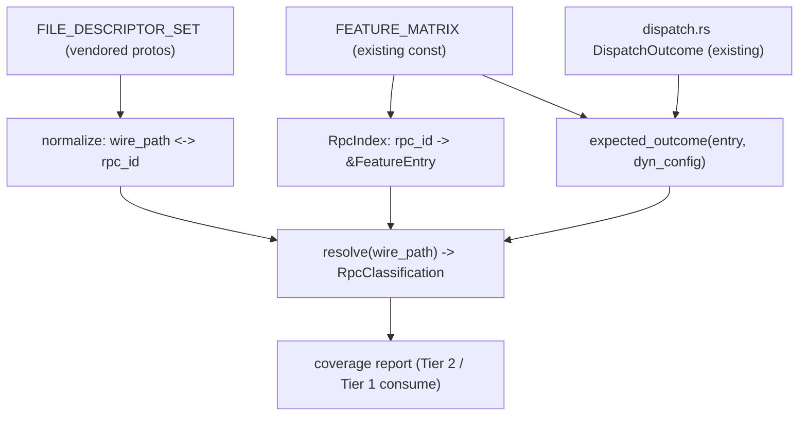

# Design: Temporal Compatibility Surface

## Overview

This feature elevates the existing `tokeira-compatibility` crate from a **declaration** of the
compatibility matrix into a **queryable coverage spine** that downstream conformance tooling can join
against. The matrix data already exists (`FEATURE_MATRIX` in `crates/tokeira-compatibility/src/matrix.rs`
classifies every `WorkflowService` and `OperatorService` RPC exactly once, with `state`,
`capability_field`, `dynamic_config_key`, `rpcs`, `notes`, and `evidence`). What is missing is the
small set of runtime query functions a coverage report needs to turn a stream of observed gRPC calls
into a clear, matrix-backed verdict.

This spec is the **first** of two steps. It owns the matrix coverage API. The sibling
`temporal-functional-conformance` spec (Tier 2) consumes this API to run Temporal's functional suite
against `tokeirad` and produce the coverage report. Tier 1 (`conformance-harness`) reuses the same API
for its hermetic per-RPC gate. Neither downstream can produce a faithful report without the pieces
defined here, so this is implemented first.

It draws on the richer capability set captured in `temporal-compatibility/design.md`
(`GetSystemInfo` handshake, `dispatch_rpc` policy, capability-flag mapping), exposing those as a
coherent query surface rather than re-deriving matching logic in each consumer.

### What exists today (verified)

- `FEATURE_MATRIX: &[FeatureEntry]` — one entry per feature group; each lists its `rpcs`, `state`,
  optional `capability_field`, optional `dynamic_config_key`, `evidence`.
- `FeatureState` — `Implemented | Partial | Experimental | Stubbed | Unsupported`.
- `dispatch_rpc<F: Feature>(...) -> DispatchOutcome` — compile-time-keyed policy returning
  `Proceed` or `Disabled { Stubbed | Unsupported | ExperimentalDisabled }`.
- `lookup_feature_const(id)` — compile-time id→entry lookup.
- Tests (only) prove every upstream `WorkflowService`/`OperatorService` RPC is classified once, and
  that capability fields match `GetSystemInfoResponse.Capabilities`.

### What is missing for coverage reporting (the gap this spec closes)

1. No mapping from an observed **wire method path** (`/temporal.api.workflowservice.v1.WorkflowService/StartWorkflowExecution`)
   to the matrix's dotted **rpc id** (`WorkflowService.StartWorkflowExecution`). Without it every join
   is a fuzzy string match.
2. No **runtime** `feature_for_rpc(rpc) -> Option<&FeatureEntry>`. The RPC→feature index exists only
   inside `#[cfg(test)]`.
3. No way to ask "what wire outcome should this RPC produce, given its state?" — the policy is in
   `dispatch_rpc` but not exposed as an `expected_status` projection.
4. No category for an observed RPC the matrix has **never heard of** (services beyond
   Workflow/Operator: `AdminService`, gRPC `Health`, etc.). Such calls must be reported, not dropped.

## Architecture

The crate stays pure (no I/O, no async — consistent with its current contract). The additions are
total functions over the existing `const` data plus the vendored descriptor set.



The single new public entry point a consumer needs is `resolve(wire_path) -> RpcClassification`, which
composes normalization, the index, and the expected-outcome projection.

## Components and Interfaces

| Component | Owns | Boundary / does not |
|-----------|------|---------------------|
| **Wire-path normalization** | `wire_path → rpc_id` and `rpc_id → wire_path`, derived from the vendored proto/descriptor set | Pure string/descriptor logic; no network, no generated-artifact reads under `target/` |
| **`RpcIndex`** | Runtime `rpc_id → &'static FeatureEntry` (promotes the test-only set) | Built once from `FEATURE_MATRIX`; no mutation |
| **`expected_outcome`** | `(FeatureEntry, dynamic_config) → ExpectedOutcome` reusing `dispatch_rpc` policy | Does not itself read dynamic config — takes the reader, mirroring `dispatch_rpc` |
| **`resolve`** | `wire_path → RpcClassification` composing the three above | The one call a coverage consumer makes per observed RPC |
| **`RpcClassification` / `ExpectedOutcome`** | Serializable result types for the report | Data only |

### Key types (shape, finalised in tasks)

```rust
/// What wire outcome the matrix state implies for an RPC.
pub enum ExpectedOutcome {
    /// Implemented/Partial: expect OK (or a legitimate business error).
    Ok,
    /// Experimental with its dynamic-config gate ON: expect OK.
    OkWhenEnabled,
    /// Experimental with its gate OFF: expect FAILED_PRECONDITION (disabled-state contract).
    DisabledPrecondition,
    /// Stubbed/Unsupported: expect UNIMPLEMENTED.
    Unimplemented,
}

/// The classification of one observed wire method.
pub enum RpcClassification {
    /// The matrix owns this RPC.
    Known {
        rpc_id: &'static str,
        feature_id: &'static str,
        state: FeatureState,
        expected: ExpectedOutcome,
    },
    /// A served wire method outside the matrix's vocabulary (Admin/Health/etc.).
    UnknownToMatrix { wire_path: String },
}
```

`expected_outcome` is a thin projection over the existing `DispatchOutcome` so the policy lives in one
place: `Proceed → Ok` (or `OkWhenEnabled` for `Experimental`), `Disabled{ExperimentalDisabled} →
DisabledPrecondition`, `Disabled{Stubbed|Unsupported} → Unimplemented`.

## Taxonomy Reconciliation

`FEATURE_MATRIX` uses five states including `Partial`; Tier 1's `conformance-harness` axis-K uses four
(no `Partial`). For coverage *verdicts* this spec treats `Partial` as `Implemented`-equivalent (expect
`OK`) and preserves the `Partial` label only as reporting detail. This keeps one expected-outcome
function usable by both tiers without forcing a matrix data migration. (Whether `Partial` is eventually
folded away in the matrix is out of scope here — a note, not a blocker.)

## Data Models

The crate adds no persistent storage. The serializable result types (`RpcClassification`,
`ExpectedOutcome`) are the data contract consumers serialize into their reports. The authoritative
inputs remain the existing `FEATURE_MATRIX` const and the vendored descriptor set; this spec adds
projections, never a second source of truth.

## Error Handling

- **Wire path that does not parse** as `/package.Service/Method`: surfaced as `UnknownToMatrix`, never
  a panic — the recorder must be able to feed arbitrary observed paths.
- **Known service, unknown method**: also `UnknownToMatrix` (the matrix completeness test guarantees
  every *classified* RPC exists, but a future proto method could appear on the wire before the matrix
  catches up — report it, do not drop it).
- **Index construction**: total over `FEATURE_MATRIX`; a duplicate rpc id is already rejected by the
  existing `every_rpc_is_owned_once` test, so the runtime index inherits that guarantee.

## Testing Strategy

- Property and unit tests live in `tokeira-compatibility` (`#[cfg(test)]`), consistent with the crate.
- Normalization is tested against the vendored descriptor set: every classified `rpc_id` round-trips
  to a wire path and back.
- `expected_outcome` is tested to agree with `dispatch_rpc` for every state (single policy, two views).
- `resolve` is tested for a known RPC, an `Experimental` RPC under both config states, and an
  unknown wire path.

## Correctness Properties

### Property 1: Normalization round-trip

For every `rpc_id` in `FEATURE_MATRIX`, `normalize(to_wire_path(rpc_id)) == rpc_id`, and the wire path
matches the vendored descriptor set's method path for that RPC.

**Validates: Requirements 1.1, 1.2**

### Property 2: Index totality and uniqueness

`feature_for_rpc` resolves every classified `rpc_id` to exactly one `FeatureEntry`, and resolves an
unclassified id to `None`.

**Validates: Requirements 2.1, 2.2**

### Property 3: Expected-outcome agrees with dispatch policy

For every `FeatureState` (and, for `Experimental`, both dynamic-config states), `expected_outcome`
yields the outcome consistent with `dispatch_rpc`'s `DispatchOutcome` for the same inputs.

**Validates: Requirements 3.1, 3.2**

### Property 4: No observed RPC is dropped

`resolve` returns a value for every input wire path: a `Known` classification for matrix-owned RPCs and
`UnknownToMatrix` for everything else. It never panics and never returns nothing.

**Validates: Requirements 4.1, 4.2**

## Dependencies

- **`tokeira-compatibility` crate** — exists; this spec extends it. No new crate.
- **Vendored descriptor set / protos** (`proto/upstream/`) — authoritative source for normalization,
  already used by the matrix completeness test. No new dependency.
- **`tokeira-build-info` pins** — `TEMPORAL_SERVER_COMPAT` / `TEMPORAL_PROTO_VERSION` already consumed
  by the crate; unchanged here.

**Net:** purely additive API on an existing crate, over data and protos that already exist. No new
crate, no new third-party dependency, no I/O.

## Out of Scope

- Running any test suite (that is `temporal-functional-conformance`).
- The wire-coverage recorder in `tokeira-edge` (that is Tier 2 — it *calls* `resolve`).
- Changing matrix *content* or migrating `Partial` out of the matrix.
- `tkr compat show/diff`, `tkr compat bump`, the Dagger CI checks — those richer `-orig` capabilities
  remain in the `temporal-compatibility` spec; this spec adds only the coverage query surface.
