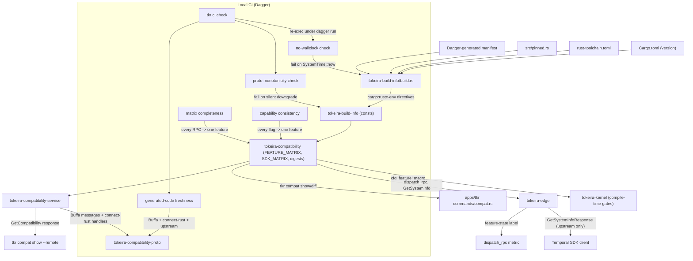

# Design Document: Temporal Compatibility

## Overview

This design turns the compatibility contract in `requirements.md` into code. It preserves Temporal SDK compatibility by keeping upstream Temporal protobuf definitions unmodified, while exposing richer Tokeira-specific compatibility metadata through Tokeira-owned protobuf services generated with Buffa and served through connect-rust.

Guiding principles:

1. **One source of truth.** The feature matrix is declared once, as a `const`, in a single file. Kernel, edge, CLI, and tests all read the same slice.
2. **Compile-time wherever possible.** Version constants, matrix digests, and compatibility pins are `&'static str` constants embedded via a generated manifest.
3. **Build-time I/O stays in `build.rs`.** Reading the generated manifest and emitting `cargo:rustc-env` directives. The crate's runtime API has zero I/O.
4. **No wall-clock embedding.** Neither `build.rs` nor any code path calls `SystemTime::now` or similar.
5. **The edge owns the handshake; the kernel stays pure.** `GetSystemInfo` lives in `tokeira-edge`. The kernel references feature-matrix constants only for compile-time gating.
6. **Dynamic-config reads are explicit.** `Experimental` features take a dynamic-config handle at the dispatch boundary, not a global.
7. **Standard Temporal APIs remain unmodified.** Tokeira metadata is exposed only through Tokeira-owned Buffa/connect-rust services.
8. **Two build modes.** `dev` tolerates missing metadata; `versioned` requires full provenance from a Dagger-generated manifest.

---

## Architecture



The system is layered into four planes:

1. **Standard Temporal edge** — upstream-compatible `WorkflowService`, `OperatorService`, `GetSystemInfo`. Uses tonic/prost. SDKs interact here.
2. **Tokeira compatibility service** — Buffa/connect-rust. Exposes rich metadata for operators and tooling. Not required by SDKs.
3. **Compatibility model** — `tokeira-compatibility` crate. Single source of truth for feature matrix, SDK matrix, dispatch decisions, and compile-time gates.
4. **Build metadata** — `tokeira-build-info` crate. Compile-time constants from a Dagger-generated manifest (versioned) or workspace fallback (dev).

The kernel depends on `tokeira-compatibility` for compile-time gates only. No runtime compatibility logic in the kernel.

---

## Components and Interfaces

### Crate Boundaries

| Crate | Location | Purpose |
|---|---|---|
| `tokeira-build-info` | `crates/tokeira-build-info/` | Zero-runtime-dep crate producing compile-time constants from a Dagger-generated manifest. |
| `tokeira-compatibility` | `crates/tokeira-compatibility/` | Houses `FEATURE_MATRIX`, `SDK_MATRIX`, `Feature` trait, `cfg_feature!`, dispatch helper, matrix digests. |
| `tokeira-compatibility-proto` | `crates/tokeira-compatibility-proto/` | Owns Buffa-generated messages and connect-rust-generated service/client code. |
| `tokeira-compatibility-service` | `crates/tokeira-compatibility-service/` | Maps matrices into Buffa DTOs, implements connect-rust handlers. |
| `GetSystemInfo` handler | `tokeira-edge` | Standard Temporal RPC handler. Consumes `tokeira-compatibility` for capability mapping. |
| `tkr compat` commands | `apps/tkr/src/commands/compat.rs` | CLI for local/remote compatibility inspection. |
| `tkr ci` commands | `apps/tkr/src/commands/ci/` | CLI for Dagger-backed local CI checks. |

### Architecture Diagram

```text
+----------------------------+
| Standard Temporal SDKs     |
+-------------+--------------+
              |
              | Upstream Temporal gRPC (tonic/prost)
              v
+-------------+--------------+
| tokeira-edge               |
| - WorkflowService          |
| - OperatorService          |
| - GetSystemInfo            |
| - dispatch_rpc<F: Feature> |
+-------------+--------------+
              |
              | compile-time constants + matrix lookup
              v
+-------------+--------------+
| tokeira-compatibility      |
| - FEATURE_MATRIX (const)   |
| - SDK_MATRIX (const)       |
| - Feature trait            |
| - cfg_feature! macro       |
| - dispatch helper          |
| - capability mapping       |
+-------------+--------------+
              |
              v
+-------------+--------------+
| tokeira-build-info         |
| - BuildInfo (const)        |
| - version constants        |
| - source-tree hash         |
| - matrix digests           |
+----------------------------+


+----------------------------+
| tkr compat show --remote   |
+-------------+--------------+
              |
              | connect-rust client (Buffa messages)
              v
+-------------+--------------+
| Tokeira Compatibility API  |
| (Buffa + connect-rust)     |
| - GetCompatibility         |
| - ListCompatibilitySurfaces|
| - GetFeature               |
| - GetSdkCompatibility      |
+-------------+--------------+
              |
              v
+-------------+--------------+
| tokeira-compatibility      |
| tokeira-build-info         |
+----------------------------+
```

### 1. `tokeira-build-info`

**Purpose:** Own compile-time build and compatibility metadata. Intentionally small and dependency-free.

**Responsibilities:**
- Expose immutable build constants via `env!()` macros populated by `build.rs`.
- Expose `BuildInfo` struct and `summary() -> BuildInfo`.
- Fail versioned builds when required provenance is missing.

**Non-responsibilities:** JSON/YAML rendering, protobuf conversion, terminal formatting, network services.

**Public API:**

```rust
pub const TOKEIRA_VERSION: &str = env!("TOKEIRA_BUILD_INFO_VERSION");
pub const TOKEIRA_GIT_SHA: &str = env!("TOKEIRA_BUILD_INFO_GIT_SHA");
pub const TEMPORAL_PROTO_VERSION: &str = env!("TOKEIRA_BUILD_INFO_PROTO_VERSION");
pub const TEMPORAL_SERVER_COMPAT: &str = env!("TOKEIRA_BUILD_INFO_SERVER_COMPAT");
pub const RUST_TOOLCHAIN: &str = env!("TOKEIRA_BUILD_INFO_RUST_TOOLCHAIN");
pub const SOURCE_TREE_HASH: &str = env!("TOKEIRA_BUILD_INFO_SOURCE_TREE_HASH");
pub const FEATURE_MATRIX_DIGEST: &str = env!("TOKEIRA_BUILD_INFO_FEATURE_MATRIX_DIGEST");
pub const SDK_MATRIX_DIGEST: &str = env!("TOKEIRA_BUILD_INFO_SDK_MATRIX_DIGEST");
pub const BUILD_MODE: &str = env!("TOKEIRA_BUILD_INFO_BUILD_MODE");

#[derive(Debug, Clone, Copy, PartialEq, Eq)]
pub struct BuildInfo {
    pub tokeira_version: &'static str,
    pub tokeira_git_sha: &'static str,
    pub temporal_proto_version: &'static str,
    pub temporal_server_compat: &'static str,
    pub rust_toolchain: &'static str,
    pub source_tree_hash: &'static str,
    pub feature_matrix_digest: &'static str,
    pub sdk_matrix_digest: &'static str,
    pub build_mode: &'static str,
}

pub const fn summary() -> BuildInfo {
    BuildInfo {
        tokeira_version: TOKEIRA_VERSION,
        tokeira_git_sha: TOKEIRA_GIT_SHA,
        temporal_proto_version: TEMPORAL_PROTO_VERSION,
        temporal_server_compat: TEMPORAL_SERVER_COMPAT,
        rust_toolchain: RUST_TOOLCHAIN,
        source_tree_hash: SOURCE_TREE_HASH,
        feature_matrix_digest: FEATURE_MATRIX_DIGEST,
        sdk_matrix_digest: SDK_MATRIX_DIGEST,
        build_mode: BUILD_MODE,
    }
}
```

#### `build.rs` and the Build Metadata Manifest

The `build.rs` reads a **generated manifest file** rather than environment variables directly. The manifest is produced by the Dagger build graph (for `versioned` mode) or by a local fallback helper (for `dev` mode).

**Manifest format:** A simple key=value text file at a well-known path (`$OUT_DIR/../build-metadata.manifest` or supplied via `TOKEIRA_BUILD_MANIFEST_PATH`).

```rust
// crates/tokeira-build-info/build.rs (sketch)
fn main() {
    println!("cargo:rerun-if-env-changed=TOKEIRA_BUILD_MANIFEST_PATH");

    let manifest_path = resolve_manifest_path();
    let manifest = match std::fs::read_to_string(&manifest_path) {
        Ok(content) => parse_manifest(&content),
        Err(_) if is_dev_mode() => dev_fallback_manifest(),
        Err(e) => panic!(
            "Build metadata manifest not found at {}: {}. \
             Versioned builds require a Dagger-generated manifest.",
            manifest_path.display(), e
        ),
    };

    emit("TOKEIRA_BUILD_INFO_VERSION", &manifest.tokeira_version);
    emit("TOKEIRA_BUILD_INFO_GIT_SHA", &manifest.git_sha);
    emit("TOKEIRA_BUILD_INFO_PROTO_VERSION", &manifest.proto_version);
    emit("TOKEIRA_BUILD_INFO_SERVER_COMPAT", &manifest.server_compat);
    emit("TOKEIRA_BUILD_INFO_RUST_TOOLCHAIN", &manifest.rust_toolchain);
    emit("TOKEIRA_BUILD_INFO_SOURCE_TREE_HASH", &manifest.source_tree_hash);
    emit("TOKEIRA_BUILD_INFO_FEATURE_MATRIX_DIGEST", &manifest.feature_matrix_digest);
    emit("TOKEIRA_BUILD_INFO_SDK_MATRIX_DIGEST", &manifest.sdk_matrix_digest);
    emit("TOKEIRA_BUILD_INFO_BUILD_MODE", &manifest.build_mode);
}

fn is_dev_mode() -> bool {
    std::env::var("TOKEIRA_BUILD_MANIFEST_PATH").is_err()
}

fn dev_fallback_manifest() -> Manifest {
    // Read what we can from the workspace; use placeholders for the rest.
    let version = std::env::var("CARGO_PKG_VERSION").unwrap_or_default();
    let git_sha = git_rev_parse_short().unwrap_or_else(|| "dev".to_string());
    let (proto_ver, server_compat) = read_pinned_versions("src/pinned.rs");
    let toolchain = read_rust_toolchain("../../rust-toolchain.toml")
        .unwrap_or_else(|_| "unknown".to_string());
    Manifest {
        tokeira_version: version,
        git_sha,
        proto_version: proto_ver,
        server_compat,
        rust_toolchain: toolchain,
        source_tree_hash: "0".repeat(64),
        feature_matrix_digest: "dev".to_string(),
        sdk_matrix_digest: "dev".to_string(),
        build_mode: "dev".to_string(),
    }
}
```

**Key invariants:**
- `versioned` mode requires `TOKEIRA_BUILD_MANIFEST_PATH` pointing to a Dagger-generated manifest. Missing manifest = build failure.
- `dev` mode (no manifest path set) falls back to best-effort derivation from workspace state.
- `build.rs` never calls `SystemTime::now` or similar.
- `build.rs` never embeds wall-clock timestamps.
- Proto and server-compat pins are read from `src/pinned.rs` in dev mode.

#### `pinned.rs`

```rust
// crates/tokeira-build-info/src/pinned.rs
//
// Canonical Temporal version pins. Bumping requires a spec update
// and passing matrix-completeness property tests.

pub const TEMPORAL_PROTO_VERSION: &str = "v1.47.0";
pub const TEMPORAL_SERVER_COMPAT: &str = "1.27.0";
```

Keeping these in a Rust source file means `rustc` parses them; typos are compile-time errors. The `build.rs` reads the file as text via regex so constants are available during build script execution.

### 2. `tokeira-compatibility`

**Purpose:** Single source of truth for the feature matrix, SDK matrix, and dispatch helpers.

**Responsibilities:**
- Own `FEATURE_MATRIX` and `SDK_MATRIX`.
- Define `FeatureState`, `CompatibilitySurfaceKind`, `CompatibilityEvidence`.
- Define the `Feature` trait and `declare_feature!` macro.
- Define the `cfg_feature!` compile-time gate.
- Provide runtime dispatch decisions.
- Compute matrix digests.
- Map upstream Temporal capability flags to feature states.

#### Feature State Model

```rust
#[derive(Debug, Clone, Copy, PartialEq, Eq, serde::Serialize, serde::Deserialize)]
pub enum FeatureState {
    Implemented,
    Experimental,
    Stubbed,
    Unsupported,
}
```

#### Compatibility Surface Model

```rust
#[derive(Debug, Clone, Copy, PartialEq, Eq)]
pub enum CompatibilitySurfaceKind {
    Rpc,
    RequestField,
    ResponseField,
    HistoryEvent,
    CommandAttribute,
    EnumVariant,
    CapabilityFlag,
    ErrorDetail,
    BehaviouralInvariant,
}

#[derive(Debug, Clone, Copy, PartialEq, Eq)]
pub struct CompatibilitySurface {
    pub kind: CompatibilitySurfaceKind,
    pub identifier: &'static str,
}
```

#### Compatibility Evidence

```rust
#[derive(Debug, Clone, Copy, PartialEq, Eq)]
pub struct CompatibilityEvidence {
    pub kind: &'static str,
    pub reference: &'static str,
}
```

Evidence kinds include `"test"`, `"manual-review"`, `"sdk-conformance"`. The shape is intentionally minimal; richer conformance artifacts are deferred.

#### Feature Entry Shape

```rust
#[derive(Debug, Clone, Copy, PartialEq, Eq)]
pub struct FeatureEntry {
    pub id: &'static str,
    pub name: &'static str,
    pub state: FeatureState,
    pub surfaces: &'static [CompatibilitySurface],
    pub capability_field: Option<&'static str>,
    pub dynamic_config_key: Option<&'static str>,
    pub rpcs: &'static [&'static str],
    pub notes: &'static str,
    pub evidence: &'static [CompatibilityEvidence],
}
```

The `FEATURE_MATRIX` is sorted by `id`. The digest is computed from the declared order. Tests fail if the matrix is not sorted. The implementation does not require compile-time sorting.

#### The `Feature` Trait (Type-Level Feature Identity)

```rust
pub trait Feature {
    const ID: &'static str;
    const ENTRY: &'static FeatureEntry;
}

#[macro_export]
macro_rules! declare_feature {
    ($name:ident, $id:literal) => {
        pub struct $name;
        impl $crate::Feature for $name {
            const ID: &'static str = $id;
            const ENTRY: &'static $crate::FeatureEntry =
                $crate::lookup_feature_const($id);
        }
    };
}

/// Const-evaluable lookup. Panics at compile time if `id` is not in the matrix.
pub const fn lookup_feature_const(id: &'static str) -> &'static FeatureEntry {
    let mut i = 0;
    while i < FEATURE_MATRIX.len() {
        if const_str_eq(FEATURE_MATRIX[i].id, id) {
            return &FEATURE_MATRIX[i];
        }
        i += 1;
    }
    panic!("declare_feature!: id not found in FEATURE_MATRIX")
}
```

The `const fn` panic produces a compile-time error if a handler names a feature ID not in the matrix.

#### The `cfg_feature!` Macro (Kernel Compile-Time Gate)

```rust
#[macro_export]
macro_rules! cfg_feature {
    ($feature_id:literal => $($tt:tt)*) => {
        const _: () = {
            let entry = $crate::lookup_feature_const($feature_id);
            match entry.state {
                $crate::FeatureState::Implemented
                | $crate::FeatureState::Experimental => (),
                $crate::FeatureState::Stubbed => panic!(
                    "cfg_feature!: refusing to compile code gated on a stubbed feature"
                ),
                $crate::FeatureState::Unsupported => panic!(
                    "cfg_feature!: refusing to compile code gated on an unsupported feature"
                ),
            }
        };
        $($tt)*
    };
}
```

Kernel code wraps feature-gated modules:

```rust
// tokeira-kernel/src/workflow_updates.rs
tokeira_compatibility::cfg_feature!("workflow-updates" =>
    pub mod updates { /* ... */ }
);
```

If `workflow-updates` is flipped to `Stubbed` or `Unsupported`, the kernel build fails — forcing deliberate cleanup rather than silent dead code.

#### Runtime Dispatch

```rust
pub enum DispatchOutcome {
    Proceed,
    Disabled {
        feature_id: &'static str,
        reason: DisabledReason,
    },
}

pub enum DisabledReason {
    ExperimentalDisabled,
    Stubbed,
    Unsupported,
}

pub fn dispatch_rpc<F: Feature>(
    dynamic_config: &dyn DynamicConfigReader,
    namespace: Option<&str>,
    metrics: &dyn DispatchMetrics,
) -> DispatchOutcome {
    let entry = F::ENTRY;
    metrics.increment_dispatch(entry.id, entry.state);

    match entry.state {
        FeatureState::Implemented => DispatchOutcome::Proceed,
        FeatureState::Experimental => {
            let key = entry.dynamic_config_key.expect(
                "experimental feature without dynamic_config_key"
            );
            if dynamic_config.bool_for_namespace(key, namespace) {
                DispatchOutcome::Proceed
            } else {
                DispatchOutcome::Disabled {
                    feature_id: entry.id,
                    reason: DisabledReason::ExperimentalDisabled,
                }
            }
        }
        FeatureState::Stubbed => DispatchOutcome::Disabled {
            feature_id: entry.id,
            reason: DisabledReason::Stubbed,
        },
        FeatureState::Unsupported => DispatchOutcome::Disabled {
            feature_id: entry.id,
            reason: DisabledReason::Unsupported,
        },
    }
}
```

Each RPC handler begins with `dispatch_rpc::<SomeFeature>(...)` and converts `Disabled` to a Temporal-compatible `tonic::Status`.

#### Matrix Digest

FNV-1a hash over `(id, state, surface identifiers, evidence references)` tuples in declared order. For each feature entry, the digest input includes the feature ID, the state discriminant, every compatibility surface identifier, and every evidence `(kind, reference)` pair. FNV-1a is 128 lines of safe Rust; collision risk at matrix size (~40–60 entries) is negligible for a drift-detection signal. If a future spec requires cryptographic strength (e.g., signed capability handshakes), we revisit with SHA-256.

The digest is NOT computed at compile time via `const fn` — it is computed at test time and compared against the value embedded in the manifest. This avoids pulling a const-fn hash implementation into the dependency graph.

### 3. Standard Temporal `GetSystemInfo`

The standard `GetSystemInfo` handler lives in `tokeira-edge`. It returns the upstream `GetSystemInfoResponse` message shape with NO Tokeira-specific fields.

```rust
pub async fn get_system_info(
    _req: GetSystemInfoRequest,
    ctx: &HandlerContext,
) -> Result<GetSystemInfoResponse, tonic::Status> {
    let mut capabilities = Capabilities::default();

    for entry in FEATURE_MATRIX {
        let Some(field) = entry.capability_field else { continue; };
        let flag_value = match entry.state {
            FeatureState::Implemented => true,
            FeatureState::Experimental => {
                let key = entry.dynamic_config_key.expect(
                    "experimental feature without dynamic_config_key"
                );
                ctx.dynamic_config.bool_for_namespace(key, None)
            }
            FeatureState::Stubbed | FeatureState::Unsupported => false,
        };
        set_capability_field(&mut capabilities, field, flag_value);
    }

    Ok(GetSystemInfoResponse {
        server_version: TEMPORAL_SERVER_COMPAT.into(),
        capabilities: Some(capabilities),
    })
}
```

**What is NOT in `GetSystemInfoResponse`:**
- Tokeira build metadata
- Feature-state maps
- SDK matrix data
- Matrix digests
- Source-tree hashes
- Process identity

All of that lives in the Tokeira Compatibility Service (Section 4).

### 4. Tokeira Compatibility Service (Buffa + connect-rust)

A Tokeira-owned RPC service exposing rich compatibility metadata for operators, CLI tools, and deployment systems. Not part of the standard Temporal SDK-facing API.

#### Proto Package

```proto
package tokeira.compatibility.v1;
```

Lives outside the vendored Temporal proto tree. Not imported by upstream Temporal proto files.

#### Service Definition

```proto
service CompatibilityService {
  rpc GetCompatibility(GetCompatibilityRequest) returns (GetCompatibilityResponse);
  rpc ListCompatibilitySurfaces(ListCompatibilitySurfacesRequest) returns (ListCompatibilitySurfacesResponse);
  rpc GetFeature(GetFeatureRequest) returns (GetFeatureResponse);
  rpc GetSdkCompatibility(GetSdkCompatibilityRequest) returns (GetSdkCompatibilityResponse);
}
```

`GetCompatibility` is required for MVP. The other RPCs MAY be implemented after the initial service lands.

#### Technology Stack

- Messages generated with **Buffa**.
- Service traits and clients generated with **connect-rust**.
- NOT tonic-generated service code.
- NOT prost-generated message types.
- The continued use of tonic/prost for upstream Temporal SDK-facing services is separate.

#### Process Coverage

Every deployed Tokeira process (`tokeirad`, `tokeira-controller`, `tokeira-autoscaler`) exposes the compatibility service via Buffa/connect-rust. `tokeira-edge` and `tokeira-projection` are embedded in `tokeirad`; their compatibility metadata is exposed through the `tokeirad` compatibility service endpoint. The response includes `process_kind` and `process_identity` fields.

### 5. CLI Design

#### `tkr compat show`

```rust
#[derive(Subcommand)]
pub enum CompatCommand {
    Show {
        #[arg(long)]
        remote: Option<String>,
        #[arg(long)]
        json: bool,
        #[arg(long)]
        verbose: bool,
    },
    Diff {
        #[arg(long)]
        a: Option<String>,
        #[arg(long)]
        b: Option<String>,
        #[arg(long)]
        fail_on_incompatible: bool,
    },
}
```

- Without `--remote`: prints local build metadata from compile-time constants.
- With `--remote`: calls standard `GetSystemInfo` AND the Tokeira Compatibility Service (connect-rust client).
- Graceful degradation: if Tokeira service unavailable, shows standard `server_version` and explains.

Version output formatting lives in the CLI/process layer, not in `tokeira-build-info`. The CLI helper module `apps/tkr/src/output/build_info.rs` owns human-readable and JSON rendering for `BuildInfo`; process crates may reuse that shape or implement local wrappers without adding rendering responsibilities to `tokeira-build-info`.

#### `tkr ci check`

Invokes the Dagger compatibility `check` function. Uses frozen lock mode by default. Re-execs under `dagger run` using the shared `dagger_reexec` helper (same pattern as `tkr image build`).

#### `tkr ci build`

- Without flags: invokes Dagger `dev` build function.
- With `--versioned`: invokes Dagger versioned build function (requires clean git, generates manifest, validates embedded BuildInfo).

### 6. Dagger CI Design

#### Build Modes

| Mode | Trigger | Manifest | Dirty OK | Provenance |
|------|---------|----------|----------|------------|
| `dev` | No `TOKEIRA_BUILD_MANIFEST_PATH` | Fallback from workspace | Yes | Best-effort |
| `versioned` | `TOKEIRA_BUILD_MANIFEST_PATH` set | Dagger-generated | No | Full (git SHA, source-tree hash, matrix digests) |

The Dagger `versioned` build function:
1. Derives all metadata from repository state and checked-in configuration.
2. Generates the build metadata manifest.
3. Invokes Cargo with `TOKEIRA_BUILD_MANIFEST_PATH` pointing to the manifest.
4. Verifies embedded `BuildInfo` after build.
5. Rejects dirty repository state.
6. Rejects non-deterministic source-tree hash.

The Dagger `dev` build function:
1. Invokes Cargo without a manifest path.
2. `build.rs` falls back to workspace-derived metadata.
3. Allows dirty state and missing git provenance.

#### Compatibility Check Function

The Dagger module exposes a `check` function that runs:
- Build metadata determinism tests
- Source-tree hash tests
- Feature matrix tests (sorted, digest stable)
- SDK matrix tests (round-trip, version ordering)
- Proto sync checks (vendored matches upstream pin)
- Generated-code freshness (Buffa, connect-rust, upstream)
- Standard `GetSystemInfo` handshake tests
- Tokeira Compatibility Service tests
- Dagger frozen-lock validation

#### Lockfile Policy

- `.dagger/lock` committed.
- Hardened CI uses frozen lock mode.
- Normal checks fail if `.dagger/lock` is modified.
- Explicit lock update workflow for dependency refresh.
- Versioned build path uses frozen lock mode.

### 7. Proto and Code Generation

#### Upstream Temporal Protos

Vendored at `proto/upstream/temporal/`. Exact mirror of pinned `TEMPORAL_PROTO_VERSION`. No Tokeira modifications. Proto sync check fails on any local patch.

#### Tokeira-Owned Protos

```text
proto/
  upstream/
    temporal/...
  tokeira/
    compatibility/v1/compatibility.proto
    controller/v1/controller.proto
    autoscaler/v1/autoscaler.proto
```

Generated with Buffa (messages) and connect-rust (services). Freshness checked in CI.

---

## Data Models

### Build Metadata Manifest Format

```text
# Generated by Dagger versioned build. Do not edit.
TOKEIRA_VERSION=0.1.0
TOKEIRA_GIT_SHA=a1b2c3d4
TEMPORAL_PROTO_VERSION=v1.47.0
TEMPORAL_SERVER_COMPAT=1.27.0
RUST_TOOLCHAIN=1.95.0
SOURCE_TREE_HASH=<64 hex chars>
FEATURE_MATRIX_DIGEST=<hex>
SDK_MATRIX_DIGEST=<hex>
BUILD_MODE=versioned
```

Simple key=value. No quoting. One field per line. Parseable by `build.rs` without dependencies.

### Compatibility Service Proto Messages

```proto
message GetCompatibilityRequest {
  string namespace = 1;
  bool include_surfaces = 2;
  bool include_sdk_matrix = 3;
}

message GetCompatibilityResponse {
  BuildInfo build_info = 1;
  string process_kind = 2;
  string process_identity = 3;
  string temporal_proto_version = 4;
  string temporal_server_compat = 5;
  string feature_matrix_digest = 6;
  string sdk_matrix_digest = 7;
  repeated FeatureStateEntry features = 8;
  repeated SdkCompatibilityEntry sdk_compatibility = 9;
  repeated KnownDivergence known_divergences = 10;
  string namespace = 11;
}

message BuildInfo {
  string tokeira_version = 1;
  string tokeira_git_sha = 2;
  string rust_toolchain = 3;
  string source_tree_hash = 4;
  string feature_matrix_digest = 5;
  string sdk_matrix_digest = 6;
  string build_mode = 7;
}

message FeatureStateEntry {
  string id = 1;
  string name = 2;
  FeatureState state = 3;
  string dynamic_config_key = 4;
  string notes = 5;
  repeated CompatibilitySurface surfaces = 6;
}

enum FeatureState {
  FEATURE_STATE_UNSPECIFIED = 0;
  FEATURE_STATE_IMPLEMENTED = 1;
  FEATURE_STATE_EXPERIMENTAL = 2;
  FEATURE_STATE_STUBBED = 3;
  FEATURE_STATE_UNSUPPORTED = 4;
}

message SdkCompatibilityEntry {
  string language = 1;
  string min_supported_version = 2;
  string max_tested_version = 3;
  repeated IncompatibleVersion known_incompatible = 4;
  string verification_state = 5;
}

message KnownDivergence {
  string feature_id = 1;
  string description = 2;
  string severity = 3;
}
```

### SDK Matrix (Rust)

```rust
#[derive(Debug, Clone, Copy, PartialEq, Eq)]
pub enum SdkVerificationState {
    Untested,
    SmokeTested,
    ConformancePartial,
    ConformancePassing,
}

#[derive(Debug, Clone, Copy, PartialEq, Eq)]
pub struct SdkCompatEntry {
    pub language: &'static str,
    pub min_version: &'static str,
    pub max_tested_version: &'static str,
    pub known_incompatible: &'static [IncompatibleVersion],
    pub verification_state: SdkVerificationState,
    pub evidence: &'static [CompatibilityEvidence],
}

#[derive(Debug, Clone, Copy, PartialEq, Eq)]
pub struct IncompatibleVersion {
    pub version: &'static str,
    pub reason: &'static str,
}
```

### JSON Shape for `tkr compat show --json`

```json
{
  "build_info": {
    "tokeira_version": "0.1.0",
    "tokeira_git_sha": "a1b2c3d4",
    "temporal_server_compat": "1.27.0",
    "temporal_proto_version": "v1.47.0",
    "rust_toolchain": "1.95.0",
    "source_tree_hash": "…64 hex…",
    "feature_matrix_digest": "…hex…",
    "sdk_matrix_digest": "…hex…",
    "build_mode": "versioned"
  },
  "features": [
    {
      "id": "workflow-updates",
      "state": "experimental",
      "capability_field": "workflow_update",
      "dynamic_config_key": "frontend.workflow_update.enabled",
      "rpcs": ["UpdateWorkflowExecution", "PollWorkflowExecutionUpdate"]
    }
  ],
  "sdk_matrix": [
    {
      "language": "go",
      "min_version": "1.26.0",
      "max_tested_version": "1.30.0",
      "verification_state": "smoke_tested",
      "known_incompatible": []
    }
  ]
}
```

---

## Correctness Properties

### Property 1: Matrix Completeness

**Validates: Requirements 17**

Every RPC in the vendored upstream `WorkflowService` and `OperatorService` is classified exactly once in `FEATURE_MATRIX`. Deterministic check, no generation.

### Property 2: Capability Consistency

**Validates: Requirements 27**

Every field in the upstream `Capabilities` message maps to exactly one feature whose `capability_field` names it, or is explicitly documented as intentionally unmapped.

### Property 3: Baseline Flag Agreement

**Validates: Requirements 25**

With a dynamic-config reader that always returns `false`, every `capabilities.*` flag is `true` iff the matching feature is `Implemented`. Deterministic.

### Property 4: SDK Matrix JSON Round-Trip

**Validates: Requirements 53**

Serialise `SDK_MATRIX` to JSON, re-parse into owned type, assert structural equality. Assert digest unchanged post-round-trip.

### Property 5: SDK Matrix Version Ordering

**Validates: Requirements 21**

For every entry, `min_version <= max_tested_version` under semver. Every known-incompatible version includes a reason.

### Property 6: Feature Matrix Digest Stability

**Validates: Requirements 49**

Compute the digest twice; assert byte-equal. Change a feature state, surface identifier, or evidence reference in a test fixture and assert the digest changes. Permute the matrix order at the test site and assert the test fails (proving sort enforcement).

### Property 7: Standard Handshake Wire-Shape

**Validates: Requirements 51**

Vendored `GetSystemInfoRequest`, `GetSystemInfoResponse`, and `Capabilities` descriptors match upstream for the pinned proto version. Any Tokeira-specific field in an upstream message fails the test.

### Property 8: Buffa/connect-rust Stack Enforcement

**Validates: Requirements 52**

Tokeira compatibility message types import from Buffa-generated modules. Tokeira compatibility service code imports from connect-rust-generated modules. Stale generated code fails the freshness check.

### Property 9: Build Metadata Determinism

**Validates: Requirements 48**

Two derivations from the same repository state produce byte-identical manifests. Excluded files don't affect the source-tree hash. Included files do. Wall-clock timestamps are absent.

### Property 10: Dagger Frozen-Lock

**Validates: Requirements 54**

Hardened CI uses frozen lock mode. Missing lockfile entries fail. Modified lockfile during normal check fails.


---

## Error Handling

### Build-Time Errors

- Missing manifest in versioned mode: panic with path and explanation.
- Malformed manifest: panic naming the malformed field.
- Empty `TEMPORAL_PROTO_VERSION` or `TEMPORAL_SERVER_COMPAT` in `pinned.rs`: fail the build with a descriptive error.
- Missing `rust-toolchain.toml`: fail with file path.

### Runtime Errors (Edge)

- `dispatch_rpc` is infallible; returns `DispatchOutcome`. Handlers convert to `tonic::Status`.
- `GetSystemInfo` never fails on its own. If dynamic-config reader errors, experimental flags default to `false` with a `tracing::warn!`.

### Tokeira Compatibility Service Errors

- Cannot load build metadata: internal error.
- Cannot load feature metadata: internal error.
- Unknown namespace: return global/default state with a warning field.

### CLI Errors

- `tkr compat show --remote` network failure: human-readable message with endpoint name.
- Standard `GetSystemInfo` succeeds but Tokeira service fails: degrade gracefully, show what's available.
- Both fail: exit non-zero.
- `tkr ci check` with Dagger unavailable: clear setup message.

---

## Testing Strategy

### Unit Tests

- `tokeira-build-info/tests/`: manifest parsing, dev fallback, version output determinism.
- `tokeira-compatibility/tests/`: `lookup_feature_const` at compile time, `dispatch_rpc` for each state, matrix sort enforcement, digest stability.
- `tokeira-edge/tests/`: `GetSystemInfo` returns expected capabilities; no Tokeira-specific fields present.
- `tokeira-compatibility-service/tests/`: Buffa DTO mapping, connect-rust handler smoke tests.

### Property Tests (proptest)

- **P1** Matrix completeness (deterministic enumeration).
- **P2** Capability consistency (deterministic enumeration).
- **P3** Baseline flag agreement (deterministic with mock config).
- **P4** SDK matrix JSON round-trip.
- **P5** SDK version ordering.
- **P6** Feature matrix digest stability.
- **P7** Standard handshake wire-shape.

### Local CI Checks (Dagger-backed)

- `tkr ci check` runs all checks in a deterministic container.
- No-wallclock check: `rg` for `SystemTime::now|Utc::now|Local::now` in `tokeira-build-info/`.
- Proto monotonicity: semver comparison against base branch.
- Generated-code freshness: regenerate and diff.
- Frozen-lock validation.

---

## Tradeoffs


### Hand-maintained `FEATURE_MATRIX` rather than upstream-derived

The Temporal server repo has no structured feature matrix. The canonical `GetSystemInfoResponse.Capabilities` construction is twelve hardcoded boolean literals in `service/frontend/workflow_handler.go::GetSystemInfo`. There is no per-feature metadata anywhere in the upstream tree that we could mechanically consume. Our manual-with-guardrails posture matches upstream's own posture. The guardrails (P1 completeness, `cfg_feature!` compile-time gates, P2 capability consistency) catch the "forgot to update the matrix" class of bug; the "what state does this feature deserve" judgement stays with the maintainer.

### FNV-1a vs SHA-256 for digests

FNV-1a is 128 lines of safe Rust. The matrix has fewer than a hundred entries — collision risk is effectively zero for a drift-detection signal. SHA-256 would pull ~2,000 lines of dependency. We pick FNV-1a; revisit if cryptographic strength is needed.

### `macro_rules!` vs proc-macro for `cfg_feature!`

A proc-macro gives richer error messages but pulls `syn`/`quote` into the build graph. The declarative form's compile-time `panic!` produces adequate errors. We keep the dependency graph narrow.

### Manifest file vs environment variables

The revised requirements mandate that build metadata is not supplied by ambient environment variables. A manifest file generated by Dagger satisfies this: the file is a build artifact of the Dagger graph, not an ambient CI secret or injected variable. `build.rs` reads the file; the `env!()` macros read `cargo:rustc-env` directives that `build.rs` emits from the manifest content.

### Separate Tokeira service vs extension fields on `GetSystemInfo`

Extension fields on `GetSystemInfoResponse` would be simpler but violate the "do not fork upstream protos" principle. A separate service is more work but keeps the SDK-facing surface pristine and allows richer metadata without proto-version coupling.

### `const fn` digest vs runtime digest

A `const fn` SHA-256 would embed the digest at compile time, but the implementation is large and fragile. Instead, the digest is computed at test time and compared against the manifest-embedded value. The manifest is the authority; tests verify consistency.

---

## Migration Plan

1. **Crate additions** (no breaking change). Add `tokeira-build-info` and `tokeira-compatibility` as new workspace members.
2. **Kernel adoption.** Wrap existing feature-gated modules in `cfg_feature!`. Start with already-implemented features — no behaviour change, just compile-time assertions.
3. **Edge adoption.** Convert every workflow-service and operator-service handler to start with `dispatch_rpc::<SomeFeature>(...)`. For implemented handlers this is a no-op that emits a metric.
4. **`GetSystemInfo` rollout.** Replace any stub handler with the matrix-walking version. Verify via integration test that SDK clients receive correct capabilities.
5. **Tokeira Compatibility Service.** Add proto package, generate Buffa/connect-rust code, implement handlers, wire into all processes.
6. **CLI adoption.** Ship `tkr compat show` and `tkr ci check`. Add `tkr compat diff` in the following release.
7. **Dagger CI pipeline.** Add compatibility module, lockfile, frozen-lock checks, `tkr ci build --versioned`.
8. **Documentation.** Update README with compatibility section. Update AGENTS.md with `tkr ci check` pre-push gate.

No existing user-facing API breaks. Step 4 is the only step that changes runtime behaviour — and only by making `GetSystemInfo` responses more accurate.

---

## Deferred Work

- `tkr compat bump` (manual governance only in MVP)
- GitHub API integration
- Automatic PR creation
- Automated release-note classification
- Automatic compatibility-surface derivation for every protobuf field kind
- Full SDK conformance orchestration
- Buildkite or other remote CI wiring
- Compatibility dashboards
- Automatic mixed-version fleet analysis

Each deferred item may consume the metadata, matrices, generated code, and RPC services defined in this design, but none is required for the MVP.
