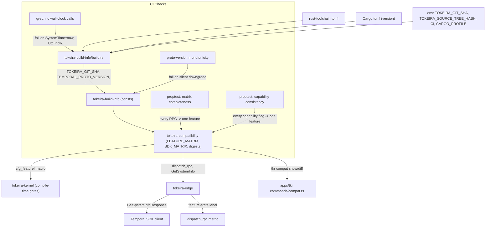

# Design Document: Temporal Compatibility

## Overview

This design turns the compatibility contract in `requirements.md` into code. The deliverables are:

1. A new `tokeira-build-info` library crate exposing compile-time constants for all build and compatibility metadata, fed by a `build.rs` that reads environment variables and workspace files.
2. A canonical `FeatureMatrix` — a `const` slice of `(feature_id, feature_state, capability_flag)` entries — declared in a new `tokeira-compatibility` sibling crate. The matrix is the single source of truth consumed by the kernel (compile-time gates), the edge (runtime RPC dispatch), and the CLI (`tkr compat show|diff`).
3. A canonical `SdkMatrix` in the same crate, with a deterministic digest derived from `(language, min_version, max_tested_version)` tuples.
4. A `GetSystemInfo` RPC handler in `tokeira-edge` that walks the matrix, consults dynamic config for `Experimental` entries, and populates the standard `capabilities.*` blob plus two tokeira-specific extension fields (`tokeira_build_info`, `tokeira_feature_states`).
5. A `dispatch_rpc<F: Feature>` helper in the edge that routes every workflow-service and operator-service RPC through a single policy based on its matrix state.
6. A `cfg_feature!` compile-time macro for the kernel that refuses to compile code gated on a `Stubbed` or `Unsupported` feature.
7. A `tkr compat show` / `tkr compat diff` command group in `apps/tkr` that renders the matrix, the SDK matrix, and the build-time metadata for the local binary or for a remote deployment.
8. A CI check that fails the build if wall-clock time primitives leak into the binary layer, plus a proto-version monotonicity check that fails silent downgrades.

Guiding principles:

1. **One source of truth.** The feature matrix is declared once, as a `const`, in a single file. Kernel, edge, CLI, and tests all read the same slice. Adding a feature is a one-line change; bumping a state is a one-field change.
2. **Compile-time wherever possible.** `TOKEIRA_VERSION`, `TEMPORAL_SERVER_COMPAT`, `TEMPORAL_PROTO_VERSION`, `SOURCE_TREE_HASH`, feature-matrix digest, and SDK-matrix digest are all `&'static str` constants. The startup log, the handshake, and `--version` all embed the same compile-time values — no runtime mutation, no runtime computation.
3. **Build-time I/O stays in `build.rs`.** Reading env vars, parsing `rust-toolchain.toml`, and emitting generated constants happen in `tokeira-build-info/build.rs`. The crate's runtime API has zero I/O and no transitive dependencies beyond `std`.
4. **No wall-clock embedding.** Neither the `build.rs` nor any code path reachable at build time calls `SystemTime::now`, `Utc::now`, or similar. A grep-style CI check enforces this invariant.
5. **The edge owns the handshake; the kernel stays pure.** `GetSystemInfo` lives in `tokeira-edge`. The kernel can reference feature-matrix constants (it's allowed to depend on `tokeira-compatibility`), but only for compile-time gating. No runtime handshake logic in the kernel.
6. **Dynamic-config reads are explicit.** `Experimental` features take a dynamic-config handle at the dispatch helper, not a global. Tests substitute a fake dynamic-config source at the dispatch boundary.

## Architecture



### Crate Boundaries

| Change | Crate | Rationale |
|---|---|---|
| `tokeira-build-info` | NEW `crates/tokeira-build-info/` | Zero-runtime-dep crate producing compile-time constants; kernel may depend on it without violating purity. |
| `tokeira-compatibility` | NEW `crates/tokeira-compatibility/` | Houses `FEATURE_MATRIX`, `SDK_MATRIX`, the `Feature` trait, and `dispatch_rpc`. Isolated from `tokeira-build-info` so the kernel can take a narrower dependency if needed. |
| `GetSystemInfo` handler | `tokeira-edge` | Edge owns public RPC handlers. Consumes `tokeira-compatibility` for matrix walking. |
| `cfg_feature!` macro | `tokeira-compatibility` (declarative) or `tokeira-compatibility-macros` (procedural) | Design picks declarative `macro_rules!` form; no need for a proc-macro crate until we need `syn`-level parsing. |
| `tkr compat show` / `diff` | `apps/tkr/src/commands/compat.rs` | Follows existing `commands/{group}.rs` pattern, reuses [`tkr-cli`](../tkr-cli/requirements.md) global flags. |
| Proto version monotonicity CI check | `.github/workflows/ci.yml` or `dev/ci/` script | One-shot script invoked by CI. Does not live in crate source. |
| Wall-clock CI check | `.github/workflows/ci.yml` or `dev/ci/` script | `rg -n 'SystemTime::now|Utc::now|Local::now|OffsetDateTime::now_utc' crates/tokeira-build-info/` fails the build on any hit. |

Notably **not** changed:

- No new `tokeira-kernel` features. The kernel only gains a `cfg_feature!` macro consumer; no runtime code changes.
- No new wire protocol. `GetSystemInfo` is a standard Temporal RPC; the two extension fields are additive and SDK-transparent.
- No dynamic-config mechanism. `Experimental`-state dispatch reads dynamic config through an injected handle; the handle's implementation is owned by the existing config/runtime surface.

## Components and Interfaces

### 1. `tokeira-build-info`

```rust
// crates/tokeira-build-info/src/lib.rs
#![cfg_attr(not(feature = "std"), no_std)]

/// Compile-time metadata for the tokeira build.
///
/// Every field is a `&'static str`, populated by `build.rs` from env vars and
/// workspace files. Zero runtime cost; copying `BuildInfo` is a shallow struct copy.
#[derive(Debug, Clone, Copy, PartialEq, Eq)]
pub struct BuildInfo {
    pub tokeira_version: &'static str,
    pub tokeira_git_sha: &'static str,
    pub temporal_proto_version: &'static str,
    pub temporal_server_compat: &'static str,
    pub rust_toolchain: &'static str,
    pub source_tree_hash: &'static str,
}

// Constants populated by build.rs.
pub const TOKEIRA_VERSION: &str = env!("TOKEIRA_BUILD_INFO_VERSION");
pub const TOKEIRA_GIT_SHA: &str = env!("TOKEIRA_BUILD_INFO_GIT_SHA");
pub const TEMPORAL_PROTO_VERSION: &str = env!("TOKEIRA_BUILD_INFO_PROTO_VERSION");
pub const TEMPORAL_SERVER_COMPAT: &str = env!("TOKEIRA_BUILD_INFO_SERVER_COMPAT");
pub const RUST_TOOLCHAIN: &str = env!("TOKEIRA_BUILD_INFO_RUST_TOOLCHAIN");
pub const SOURCE_TREE_HASH: &str = env!("TOKEIRA_BUILD_INFO_SOURCE_TREE_HASH");

pub const fn summary() -> BuildInfo {
    BuildInfo {
        tokeira_version: TOKEIRA_VERSION,
        tokeira_git_sha: TOKEIRA_GIT_SHA,
        temporal_proto_version: TEMPORAL_PROTO_VERSION,
        temporal_server_compat: TEMPORAL_SERVER_COMPAT,
        rust_toolchain: RUST_TOOLCHAIN,
        source_tree_hash: SOURCE_TREE_HASH,
    }
}
```

The `env!` macro resolves at compile time and the `cargo:rustc-env` directives in `build.rs` supply the values. This keeps `tokeira-build-info` a `std`-only crate with zero `[dependencies]`.

#### `build.rs` responsibilities

```rust
// crates/tokeira-build-info/build.rs (sketch)

fn main() {
    println!("cargo:rerun-if-env-changed=TOKEIRA_GIT_SHA");
    println!("cargo:rerun-if-env-changed=TOKEIRA_SOURCE_TREE_HASH");
    println!("cargo:rerun-if-env-changed=CI");
    println!("cargo:rerun-if-env-changed=CARGO_PROFILE");
    println!("cargo:rerun-if-changed=../../rust-toolchain.toml");
    println!("cargo:rerun-if-changed=../../Cargo.toml");
    println!("cargo:rerun-if-changed=src/pinned.rs");

    // 1. Tokeira version: from Cargo.toml via CARGO_PKG_VERSION (supplied by cargo).
    let version = std::env::var("CARGO_PKG_VERSION").expect("cargo supplies CARGO_PKG_VERSION");
    emit("TOKEIRA_BUILD_INFO_VERSION", &version);

    // 2. Git SHA: env var with dev/CI/release fallback logic.
    let git_sha = resolve_git_sha();
    emit("TOKEIRA_BUILD_INFO_GIT_SHA", &git_sha);

    // 3. Proto/server compat: from src/pinned.rs (a human-maintained Rust source file).
    let (proto_ver, server_compat) = read_pinned_versions("src/pinned.rs");
    emit("TOKEIRA_BUILD_INFO_PROTO_VERSION", &proto_ver);
    emit("TOKEIRA_BUILD_INFO_SERVER_COMPAT", &server_compat);

    // 4. Rust toolchain: from rust-toolchain.toml.
    let toolchain = read_rust_toolchain("../../rust-toolchain.toml");
    emit("TOKEIRA_BUILD_INFO_RUST_TOOLCHAIN", &toolchain);

    // 5. Source tree hash: env var with dev fallback of 64 zeros.
    let source_hash = resolve_source_tree_hash();
    emit("TOKEIRA_BUILD_INFO_SOURCE_TREE_HASH", &source_hash);
}

fn resolve_git_sha() -> String {
    if let Ok(sha) = std::env::var("TOKEIRA_GIT_SHA") {
        if !sha.is_empty() { return sha; }
    }
    let profile = std::env::var("CARGO_PROFILE").unwrap_or_default();
    let in_ci = std::env::var("CI").is_ok();
    let is_release = profile == "release";

    if is_release && in_ci {
        panic!("TOKEIRA_GIT_SHA must be set for release builds in CI (Req 1.2.2)");
    }

    // Fallback: try git directly for developer workflow.
    if let Some(sha) = git_rev_parse_short() { return sha; }

    if is_release {
        println!("cargo:warning=release build without TOKEIRA_GIT_SHA; using 'dev'");
    }
    "dev".to_string()
}
```

**Key invariants enforced by `build.rs`:**

- Release in CI without `TOKEIRA_GIT_SHA` fails the build (Req 1.2.2).
- Release outside CI without `TOKEIRA_GIT_SHA` warns but succeeds (Req 6.2.2).
- Empty `TEMPORAL_PROTO_VERSION` or `TEMPORAL_SERVER_COMPAT` in `pinned.rs` fails the build fast (Req 1.2.5).
- `TOKEIRA_SOURCE_TREE_HASH` fallback of 64 literal zeros when absent in debug (Req 1.3.5).
- No `SystemTime::now` / `Utc::now` / similar calls anywhere in `build.rs` (Req 1.6, enforced by CI grep check).

#### `pinned.rs`

```rust
// crates/tokeira-build-info/src/pinned.rs
//
// The canonical Temporal version pins. Bumping these requires a spec update
// and a passing matrix-completeness property test. See
// `.kiro/specs/temporal-compatibility/requirements.md` Feature 5.

pub const TEMPORAL_PROTO_VERSION: &str = "v1.47.0";
pub const TEMPORAL_SERVER_COMPAT: &str = "1.27.0";
```

Keeping these in a Rust source file (rather than a TOML or JSON sidecar) means `rustc` parses them into the build; typos are compile-time errors. The `build.rs` reads the file as text via a small regex so the constants are available during `build.rs` execution without a circular dependency.

### 2. `tokeira-compatibility`

This is the single-source-of-truth crate for the feature matrix, SDK matrix, and dispatch helpers.

```rust
// crates/tokeira-compatibility/src/lib.rs

#[derive(Debug, Clone, Copy, PartialEq, Eq, serde::Serialize, serde::Deserialize)]
pub enum FeatureState {
    Implemented,
    Experimental,
    Stubbed,
    Unsupported,
}

#[derive(Debug, Clone, Copy, PartialEq, Eq)]
pub struct FeatureEntry {
    /// Stable identifier, kebab-case (e.g., "workflow-updates").
    pub id: &'static str,
    /// Initial state. Bumping requires a spec update.
    pub state: FeatureState,
    /// The `capabilities.*` field this feature owns. `None` if the feature
    /// is not exposed in the standard capabilities blob.
    pub capability_field: Option<&'static str>,
    /// Dynamic-config key that enables an `Experimental` feature. Unused
    /// for other states; present for `Experimental` entries.
    pub dynamic_config_key: Option<&'static str>,
    /// Workflow-service and operator-service RPCs this feature gates.
    /// Used by completeness property tests and by `dispatch_rpc`.
    pub rpcs: &'static [&'static str],
}

/// Canonical feature matrix. Declared once, consumed everywhere.
pub const FEATURE_MATRIX: &[FeatureEntry] = &[
    FeatureEntry {
        id: "workflow-namespaces",
        state: FeatureState::Implemented,
        capability_field: None,
        dynamic_config_key: None,
        rpcs: &["RegisterNamespace", "DescribeNamespace", "ListNamespaces", "UpdateNamespace"],
    },
    FeatureEntry {
        id: "workflow-queries",
        state: FeatureState::Implemented,
        capability_field: Some("sync_match_supported"),
        dynamic_config_key: None,
        rpcs: &["QueryWorkflow", "RespondQueryTaskCompleted"],
    },
    FeatureEntry {
        id: "workflow-updates",
        state: FeatureState::Experimental,
        capability_field: Some("workflow_update"),
        dynamic_config_key: Some("frontend.workflow_update.enabled"),
        rpcs: &["UpdateWorkflowExecution", "PollWorkflowExecutionUpdate"],
    },
    // ... remaining entries per Req 2.6
];

/// Compile-time hash of `(id, state)` pairs in FEATURE_MATRIX.
/// Re-computed at compile time by a `const fn` digest so tests and startup
/// logs always observe the same value for a given build.
pub const FEATURE_MATRIX_DIGEST: &str = feature_matrix_digest();

const fn feature_matrix_digest() -> &'static str {
    // A const fn SHA-256 implementation over (id, state) tuples.
    // Implementation is vendored from e.g. `sha2-const` or written inline.
    // The result is converted to lowercase hex and stored as a &'static str
    // via a const array-of-bytes -> &'static str conversion.
    // Design detail: if `const fn` SHA-256 pulls too large a dependency,
    // fall back to a custom FNV-1a hash — it's 128 lines of safe Rust and
    // the collision risk at the matrix size (~40 entries) is negligible
    // for a digest used only as a drift-detection signal.
    // The tasks doc specifies the implementation choice.
    unimplemented!("see tasks.md")
}
```

#### The `Feature` trait

```rust
// crates/tokeira-compatibility/src/feature.rs

/// Type-level feature identity, used by `dispatch_rpc<F: Feature>`.
pub trait Feature {
    const ID: &'static str;
    const ENTRY: &'static FeatureEntry;
}

#[macro_export]
macro_rules! declare_feature {
    ($name:ident, $id:literal) => {
        pub struct $name;
        impl $crate::Feature for $name {
            const ID: &'static str = $id;
            const ENTRY: &'static $crate::FeatureEntry =
                $crate::lookup_feature_const($id);
        }
    };
}

/// Const-evaluable lookup. Panics at compile time if `id` is not in the matrix.
pub const fn lookup_feature_const(id: &'static str) -> &'static FeatureEntry {
    let mut i = 0;
    while i < FEATURE_MATRIX.len() {
        if const_str_eq(FEATURE_MATRIX[i].id, id) {
            return &FEATURE_MATRIX[i];
        }
        i += 1;
    }
    panic!("declare_feature!: id not found in FEATURE_MATRIX")
}
```

The `const fn` panic produces a compile-time error message whose payload includes the missing id. This gives us matrix coverage at the declaration site: if a feature author writes `declare_feature!(WorkflowUpdates, "workflow-updates")` but `"workflow-updates"` is not in the matrix, the build fails with a message that names the id.

#### The `cfg_feature!` macro (kernel gate)

```rust
// crates/tokeira-compatibility/src/macros.rs

/// Compile-time gate that emits its body only when the feature is
/// `Implemented` or `Experimental`. Refuses to compile against `Stubbed`
/// or `Unsupported` features.
#[macro_export]
macro_rules! cfg_feature {
    ($feature_id:literal => $($tt:tt)*) => {
        const _: () = {
            let entry = $crate::lookup_feature_const($feature_id);
            match entry.state {
                $crate::FeatureState::Implemented
                | $crate::FeatureState::Experimental => (),
                $crate::FeatureState::Stubbed => panic!(
                    "cfg_feature!: refusing to compile code gated on a stubbed feature"
                ),
                $crate::FeatureState::Unsupported => panic!(
                    "cfg_feature!: refusing to compile code gated on an unsupported feature"
                ),
            }
        };
        $($tt)*
    };
}
```

Kernel code wraps feature-gated modules:

```rust
// tokeira-kernel/src/workflow_updates.rs
tokeira_compatibility::cfg_feature!("workflow-updates" =>
    pub mod updates {
        // ... kernel logic for workflow updates ...
    }
);
```

If `workflow-updates` is ever flipped to `Stubbed` or `Unsupported`, the kernel build fails — forcing a deliberate cleanup rather than silent dead code.

### 3. `SdkMatrix`

```rust
// crates/tokeira-compatibility/src/sdk.rs

#[derive(Debug, Clone, Copy, PartialEq, Eq, serde::Serialize, serde::Deserialize)]
pub struct SdkCompatEntry {
    pub language: &'static str,
    pub min_version: &'static str,
    pub max_tested_version: &'static str,
    pub known_incompatible: &'static [IncompatibleVersion],
    pub test_suite_ref: &'static str,
}

#[derive(Debug, Clone, Copy, PartialEq, Eq, serde::Serialize, serde::Deserialize)]
pub struct IncompatibleVersion {
    pub version: &'static str,
    pub reason: &'static str,
    pub tracking_issue: &'static str,
}

pub const SDK_MATRIX: &[SdkCompatEntry] = &[
    SdkCompatEntry {
        language: "go",
        min_version: "1.26.0",
        max_tested_version: "1.30.0",
        known_incompatible: &[],
        test_suite_ref: "ci/sdk-go",
    },
    SdkCompatEntry {
        language: "typescript",
        min_version: "1.10.0",
        max_tested_version: "1.14.0",
        known_incompatible: &[],
        test_suite_ref: "ci/sdk-ts",
    },
    SdkCompatEntry {
        language: "python",
        min_version: "1.6.0",
        max_tested_version: "1.10.0",
        known_incompatible: &[],
        test_suite_ref: "ci/sdk-py",
    },
    SdkCompatEntry {
        language: "java",
        min_version: "1.23.0",
        max_tested_version: "1.27.0",
        known_incompatible: &[],
        test_suite_ref: "ci/sdk-java",
    },
    SdkCompatEntry {
        language: "dotnet",
        min_version: "1.0.0",
        max_tested_version: "1.4.0",
        known_incompatible: &[],
        test_suite_ref: "ci/sdk-dotnet",
    },
];

pub const SDK_MATRIX_DIGEST: &str = sdk_matrix_digest();
```

### 4. `dispatch_rpc` in `tokeira-edge`

```rust
// crates/tokeira-edge/src/rpc_dispatch.rs

pub trait DynamicConfigReader: Send + Sync {
    fn bool_for_namespace(&self, key: &str, namespace: Option<&str>) -> bool;
}

pub struct RpcDispatchContext<'a> {
    pub dynamic_config: &'a dyn DynamicConfigReader,
    pub namespace: Option<&'a str>,
    pub metrics: &'a dyn DispatchMetrics,
}

pub enum DispatchOutcome<T> {
    Proceed,
    FailedPrecondition { message: String, details: String },
    Unimplemented { message: String },
}

pub fn dispatch_rpc<F: Feature>(ctx: &RpcDispatchContext<'_>) -> DispatchOutcome<()> {
    let entry = F::ENTRY;
    ctx.metrics.increment_dispatch(entry.id, entry.state);

    match entry.state {
        FeatureState::Implemented => DispatchOutcome::Proceed,
        FeatureState::Experimental => {
            let key = entry.dynamic_config_key.unwrap_or_else(|| {
                panic!("experimental feature {} missing dynamic_config_key", entry.id)
            });
            if ctx.dynamic_config.bool_for_namespace(key, ctx.namespace) {
                DispatchOutcome::Proceed
            } else {
                DispatchOutcome::FailedPrecondition {
                    message: format!("feature '{}' is experimental and disabled", entry.id),
                    details: format!("enable via dynamic config key '{}'", key),
                }
            }
        }
        FeatureState::Stubbed => DispatchOutcome::Unimplemented {
            message: format!("tokeira does not implement feature '{}' (stub)", entry.id),
        },
        FeatureState::Unsupported => DispatchOutcome::Unimplemented {
            message: format!("tokeira does not support feature '{}' (out of scope)", entry.id),
        },
    }
}
```

Each RPC handler begins with a single `dispatch_rpc<SomeFeature>(&ctx)` call and routes the outcome to a `tonic::Status`:

```rust
// tokeira-edge/src/handlers/workflow_updates.rs
declare_feature!(WorkflowUpdates, "workflow-updates");

pub async fn update_workflow_execution(...) -> Result<..., tonic::Status> {
    let dispatch = dispatch_rpc::<WorkflowUpdates>(&dispatch_ctx);
    match dispatch {
        DispatchOutcome::Proceed => { /* real handler */ }
        DispatchOutcome::FailedPrecondition { message, details } => {
            Err(tonic::Status::failed_precondition(format!("{message}: {details}")))
        }
        DispatchOutcome::Unimplemented { message } => {
            Err(tonic::Status::unimplemented(message))
        }
    }
}
```

### 5. `GetSystemInfo` handler

```rust
// crates/tokeira-edge/src/handlers/system_info.rs

pub async fn get_system_info(
    _req: GetSystemInfoRequest,
    ctx: &HandlerContext,
) -> Result<GetSystemInfoResponse, tonic::Status> {
    let build_info = tokeira_build_info::summary();

    let mut capabilities = Capabilities::default();
    let mut feature_states = std::collections::BTreeMap::new();

    for entry in FEATURE_MATRIX {
        feature_states.insert(entry.id.to_string(), feature_state_label(entry.state));

        let Some(field) = entry.capability_field else { continue; };

        let flag_value = match entry.state {
            FeatureState::Implemented => true,
            FeatureState::Experimental => {
                let key = entry.dynamic_config_key.expect(
                    "experimental feature without dynamic_config_key (validated at build time)"
                );
                ctx.dynamic_config.bool_for_namespace(key, None)
            }
            FeatureState::Stubbed | FeatureState::Unsupported => false,
        };
        set_capability_field(&mut capabilities, field, flag_value);
    }

    let tokeira_build_info_ext = TokeiraBuildInfoExt {
        tokeira_version: build_info.tokeira_version.into(),
        tokeira_git_sha: build_info.tokeira_git_sha.into(),
        temporal_proto_version: build_info.temporal_proto_version.into(),
        source_tree_hash: build_info.source_tree_hash.into(),
        feature_matrix_digest: FEATURE_MATRIX_DIGEST.into(),
        sdk_matrix_digest: SDK_MATRIX_DIGEST.into(),
    };

    Ok(GetSystemInfoResponse {
        server_version: tokeira_build_info::TEMPORAL_SERVER_COMPAT.into(),
        capabilities: Some(capabilities),
        tokeira_build_info: Some(tokeira_build_info_ext),
        tokeira_feature_states: feature_states,
    })
}
```

`set_capability_field` is a match arm over capability field names. The completeness property test (Req 4.2) enumerates the `Capabilities` struct via a code-generated name list and asserts that every name is handled by one branch.

**Extension-field encoding.** `tokeira_build_info` and `tokeira_feature_states` are declared in the internal `tokeira/internal/v1/system_info_ext.proto` (owned by [`proto-upstream-sync`](../proto-upstream-sync/requirements.md)) and transmitted as optional fields on the `GetSystemInfoResponse` message via the tonic-generated unknown-field handling. SDKs that do not understand them ignore them silently (standard protobuf behaviour); tokeira-aware tooling reads them directly.

### 6. `tkr compat show` and `tkr compat diff`

```rust
// apps/tkr/src/commands/compat.rs

#[derive(Subcommand)]
pub enum CompatCommand {
    /// Print compatibility metadata for the local build or a remote deployment.
    Show {
        #[arg(long)]
        remote: Option<String>,
        #[arg(long)]
        json: bool,
    },
    /// Diff compatibility between two remote endpoints, or local vs remote.
    Diff {
        #[arg(long, conflicts_with = "local")]
        a: Option<String>,
        #[arg(long, conflicts_with = "local")]
        b: Option<String>,
        #[arg(long)]
        local: Option<String>,
    },
}

pub async fn run(cmd: CompatCommand, format: OutputFormat) -> Result<()> {
    match cmd {
        CompatCommand::Show { remote: None, json: false } => print_local_show_text(),
        CompatCommand::Show { remote: None, json: true } => print_local_show_json(),
        CompatCommand::Show { remote: Some(endpoint), json } => {
            let response = dial_and_get_system_info(&endpoint).await?;
            if json { print_remote_show_json(&response) } else { print_remote_show_text(&response) }
        }
        CompatCommand::Diff { a: Some(a), b: Some(b), local: None } => {
            let (resp_a, resp_b) = tokio::try_join!(
                dial_and_get_system_info(&a),
                dial_and_get_system_info(&b),
            )?;
            diff_responses(&resp_a, &resp_b, format)
        }
        CompatCommand::Diff { a: None, b: None, local: Some(endpoint) } => {
            let local = build_local_response();
            let remote = dial_and_get_system_info(&endpoint).await?;
            diff_responses(&local, &remote, format)
        }
        _ => Err(anyhow!("usage: tkr compat diff --a <endpoint> --b <endpoint>  OR  --local <endpoint>")),
    }
}
```

`build_local_response` constructs a synthetic `GetSystemInfoResponse` from compile-time constants so `tkr compat show` (no `--remote`) produces output structurally identical to the remote form. This is what enables the "local CLI build vs remote server build" consistency property in Req 7.2.

### 7. CI checks

Two one-shot scripts in `dev/ci/`:

```bash
# dev/ci/check-no-wallclock.sh
#!/usr/bin/env bash
set -euo pipefail
HITS=$(rg -n \
  'SystemTime::now|Utc::now|Local::now|OffsetDateTime::now_utc|chrono::Utc::now|chrono::Local::now' \
  crates/tokeira-build-info/ || true)
if [[ -n "$HITS" ]]; then
  echo "ERROR: wall-clock calls in tokeira-build-info (Req 9.1):"
  echo "$HITS"
  exit 1
fi
```

```bash
# dev/ci/check-proto-monotonicity.sh
#!/usr/bin/env bash
# Fetches the last release tag, extracts TEMPORAL_PROTO_VERSION from both,
# and fails if the new one is a semver downgrade unless the tip commit
# message contains "Proto-Downgrade: <reason>".
```

Both scripts are wired into the default CI workflow so a PR cannot merge without them passing.

## Data Models

### Proto extension

```proto
// proto/tokeira/internal/v1/system_info_ext.proto

syntax = "proto3";
package tokeira.internal.v1;

// Non-standard fields returned in GetSystemInfoResponse to tokeira-aware
// tooling. Standard Temporal SDKs ignore these.
message TokeiraBuildInfoExt {
  string tokeira_version = 1;
  string tokeira_git_sha = 2;
  string temporal_proto_version = 3;
  string source_tree_hash = 4;
  string feature_matrix_digest = 5;
  string sdk_matrix_digest = 6;
}
```

The `GetSystemInfoResponse` that tonic generates is extended via an internal oneof or optional field wired in during proto generation. [`proto-upstream-sync`](../proto-upstream-sync/requirements.md) owns the vendoring; this spec owns the extension definition.

### JSON shape for `tkr compat show --json`

```json
{
  "build_info": {
    "tokeira_version": "0.1.0",
    "tokeira_git_sha": "a1b2c3d4",
    "temporal_server_compat": "1.27.0",
    "temporal_proto_version": "v1.47.0",
    "rust_toolchain": "1.95.0",
    "source_tree_hash": "…64 hex…",
    "feature_matrix_digest": "…hex…",
    "sdk_matrix_digest": "…hex…"
  },
  "features": [
    {
      "id": "workflow-updates",
      "state": "experimental",
      "capability_field": "workflow_update",
      "dynamic_config_key": "frontend.workflow_update.enabled",
      "rpcs": ["UpdateWorkflowExecution", "PollWorkflowExecutionUpdate"]
    }
  ],
  "sdk_matrix": [
    {
      "language": "go",
      "min_version": "1.26.0",
      "max_tested_version": "1.30.0",
      "known_incompatible": [],
      "test_suite_ref": "ci/sdk-go"
    }
  ]
}
```

## Error Handling

### Build-time errors

- Missing or malformed `rust-toolchain.toml` — fail the build with `cargo:warning=` plus `panic!` with the file path.
- Empty `TEMPORAL_PROTO_VERSION` or `TEMPORAL_SERVER_COMPAT` in `pinned.rs` — fail the build with a descriptive error naming the constant.
- Release in CI without `TOKEIRA_GIT_SHA` — fail the build with Req 1.2.2 cited.

### Runtime errors (edge)

- `dispatch_rpc` is infallible; it returns a `DispatchOutcome` enum. Handlers convert to `tonic::Status`.
- `GetSystemInfo` never fails on its own — it always returns a response with the current matrix state. If the dynamic-config reader itself errors, the handler defaults experimental flags to `false` and emits a `tracing::warn!` with the error.

### CLI errors

- `tkr compat show --remote <endpoint>` — network errors surface as human-readable messages with the endpoint name.
- `tkr compat diff` with missing arguments — clap help text guides the operator; exit status 2 on usage error, 1 on detected drift.

## Testing Strategy

### Unit tests

- `tokeira-build-info/tests/`: formatter output is byte-identical across invocations (Req 8.5), `--version` text and JSON both produce deterministic output.
- `tokeira-compatibility/tests/`: `lookup_feature_const` at compile time, `dispatch_rpc` for each of the four states, `feature_state_label` exhaustiveness.
- `tokeira-edge/tests/`: `GetSystemInfo` handler returns expected fields; extension fields round-trip.

### Property tests (proptest)

- **Property T1 — Matrix completeness (Req 2.3):** Every RPC in the generated workflow-service and operator-service stubs is classified exactly once in `FEATURE_MATRIX`. Deterministic check, no generation.
- **Property T2 — Capability consistency (Req 4.2):** Every field in `Capabilities` maps to a feature whose `capability_field` names it. Deterministic check.
- **Property T3 — Baseline flag agreement (Req 4.2.3):** With a dynamic-config reader that always returns `false`, every `capabilities.*` flag is `true` iff the matching feature is `Implemented`. Deterministic.
- **Property T4 — SDK matrix JSON round-trip (Req 3.3):** Serialise `SDK_MATRIX` to JSON via `serde_json`, re-parse, assert structural equality. Also assert `SDK_MATRIX_DIGEST` is unchanged post-round-trip.
- **Property T5 — SDK matrix version ordering (Req 3.3):** For every entry, `min_version <= max_tested_version` under semver.
- **Property T6 — Feature matrix digest stability:** Compute the digest twice via the exposed `const fn`; assert byte-equal. Permute the matrix order at the test site and assert digest invariance (the digest sorts on `id` before hashing).
- **Property T7 — Extension field round-trip:** `TokeiraBuildInfoExt` protobuf encode + decode round-trips without loss.

### CI-only checks

- `check-no-wallclock.sh` — runs in CI; fails the build if any wall-clock call appears in `tokeira-build-info/`.
- `check-proto-monotonicity.sh` — runs in CI on release PRs; fails on silent proto downgrade.

### Tradeoffs

- **`const fn` SHA-256 vs FNV-1a for digests.** `sha2-const` would give us cryptographic-strength digests, at the cost of a ~2,000-line dependency compiled into every downstream crate. FNV-1a is 128 lines of safe Rust and the matrix has fewer than a hundred entries — collision risk is effectively zero for a drift-detection signal. We pick FNV-1a; if a future spec requires cryptographic strength (e.g., for signed capability handshakes), we revisit.
- **Proc-macro vs `macro_rules!` for `cfg_feature!`.** A proc-macro would give richer error messages, but pulls `syn`/`quote` into the build graph and introduces a separate crate to audit. The declarative form's compile-time `panic!` produces an adequate error; we keep the dependency graph narrow.
- **Extension fields on `GetSystemInfoResponse`.** We use a pair of typed fields (`tokeira_build_info`, `tokeira_feature_states`) rather than a generic `map<string, Any>` blob. Typed fields are self-documenting, grep-friendly, and visible in proto tooling; the downside is that adding a new extension requires a proto bump. We accept that cost; extensions are expected to be rare.

## Migration Plan

1. **Crate additions** (no breaking change). Add `tokeira-build-info` and `tokeira-compatibility` as new workspace members; no existing consumers touched.
2. **Kernel adoption.** Wrap existing feature-gated modules in `cfg_feature!`. Start with already-implemented features — no behaviour change, just a compile-time assertion. Then add gates to any `Experimental` module so flipping to `Stubbed` in the matrix produces a compile error.
3. **Edge adoption.** Convert every workflow-service and operator-service handler to start with `dispatch_rpc<SomeFeature>(&ctx)`. For currently-implemented handlers this is a no-op that emits a metric. For currently-unimplemented handlers this is the mechanism by which they start returning the right error code.
4. **`GetSystemInfo` rollout.** Replace any stub handler with the new matrix-walking version. Verify via integration test that an `sdk-go` client calling `Connect()` receives `capabilities.*` values matching the matrix defaults.
5. **CI wiring.** Add the two shell checks to the default CI workflow.
6. **CLI adoption.** Ship `tkr compat show` in the next tkr release. Add `tkr compat diff` in the release after that (it depends on the tonic client being wired into the CLI).
7. **Documentation.** Update `README.md` with the "Temporal compatibility" section (Req 9.3). Point at `tkr compat show` for full detail.

No existing user-facing API breaks. Step 4 is the only step that changes runtime behaviour — and only by making `GetSystemInfo` responses more accurate.

## Open Questions

- **Source tree hash computation location.** Req 1.3.2 mandates that `build.rs` does not compute the hash itself. [`image-lifecycle`](../image-lifecycle/requirements.md) is the obvious computation site, but we need a second producer for local builds (outside Dagger). A small `dev/ci/compute-source-tree-hash` helper binary covers the case; it reads `.gitignore` plus the exclusion list in Req 1.3.3. Tasks doc allocates this work.
- **Extension-field future-proofing.** If we decide later to wrap `TokeiraBuildInfoExt` in a versioned envelope (`TokeiraExtensionsV1`), we'd want to do that before the first SDK starts reading it. Tasks doc flags this for review in the tkr-compat diff handler.
