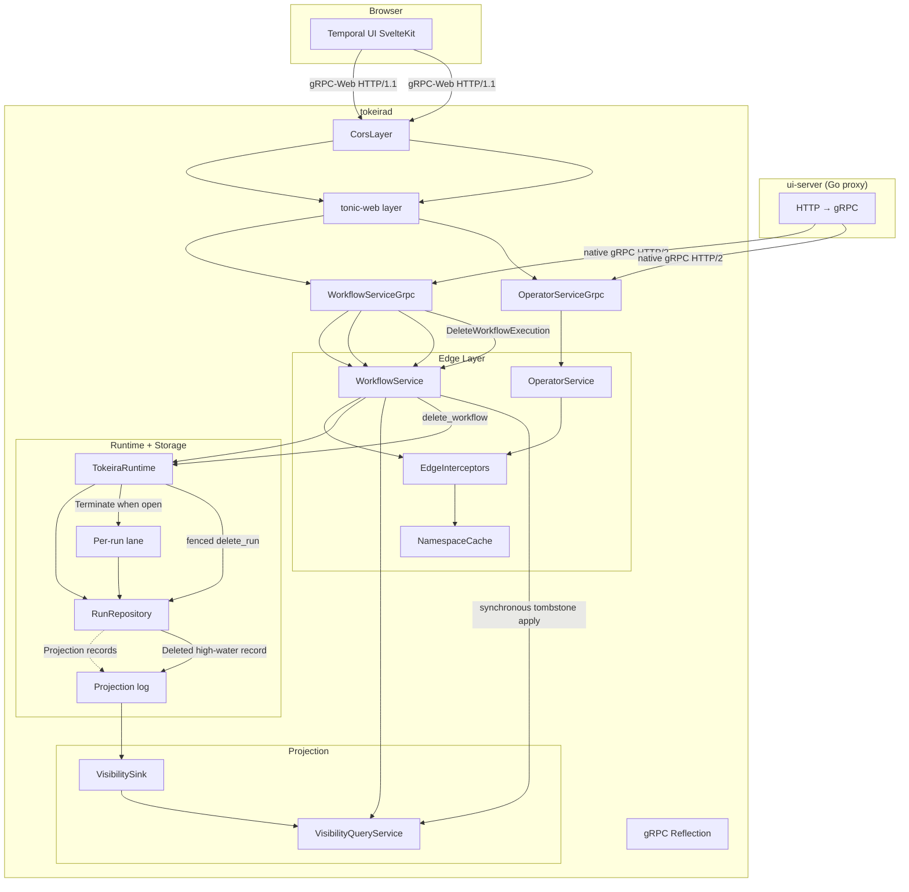

# Design Document — Temporal UI Support

## Overview

This design enables the Temporal UI to connect to tokeirad by implementing the missing gRPC endpoints the UI depends on, adding gRPC-Web transport for direct browser connections, and wiring the visibility projection pipeline so workflow lists show real data. For workflow deletion, it replaces the original visibility-only implementation with an OCC- and shard-fenced authoritative purge plus a versioned visibility tombstone.

The work spans four crates and the server binary:

- `tokeira-edge` — new gRPC handlers and edge-layer logic for discovery, namespace management, reverse history, delete, reset, describe-task-queue, and signal-with-start
- `tokeira-runtime` — coordinate terminate-before-delete, fenced purge, and runtime-local cleanup
- `tokeira-storage` — atomically remove authoritative run data and append a deletion projection record
- `tokeira-projection` — wire the visibility sink into the server startup and retain non-queryable deletion tombstones so stale projection records cannot resurrect deleted executions
- `tokeirad` (app binary) — add `tonic-web` + CORS middleware, wire new dependencies

The design follows the existing edge-layer pattern: thin gRPC handlers in `grpc/workflow_service.rs` delegate to edge-layer methods on `WorkflowService`, which perform interceptor checks, routing, and delegation to the runtime/storage/cache. Proto ↔ edge DTO translation lives in `grpc/translate.rs`.

The `DeleteWorkflowExecution` wire shape comes from
`proto/upstream/temporal/api/workflowservice/v1/request_response.proto`. Its behaviour is
derived from `service/frontend/workflow_handler.go`, `service/frontend/validators.go`,
`service/history/api/deleteworkflow/api.go`,
`service/history/transfer_queue_task_executor_base.go`, and
`service/history/shard/context_impl.go` at Temporal server v1.31.0. The exact internal
identity is verified in `service/history/consts/const.go` at the same tag. In particular, an
open execution is terminated with reason `Delete workflow execution` and identity
`history-service`, while deletion removes visibility, the current pointer, mutable
state, and history in an idempotent staged operation. Tokeira provides the same
observable result synchronously once admitted; it does not reproduce Temporal's
internal transfer-task staging.

## Dependencies and Non-Goals

- The existing per-run lane, `RunRepository`, projection log, versioned visibility
  rows, and `VisibilityLifecycleState::Deleted` are reused.
- Deletion remains operational cleanup, not a workflow semantic transition. The pure
  kernel receives a normal `Terminate` command only when the target is open; no delete
  command, delete history event, I/O, or storage concern is added to the kernel.
- Retention-driven deletion, namespace deletion, archival, and multi-cluster deletion
  replication are outside Requirement 9.
- Tokeira does not emulate Temporal's asynchronous delete-task latency. Returning only
  after the local authoritative purge and visibility tombstone have applied is an
  intentionally stronger completion point with the same successful response shape.

## Architecture



### Transport layer

The tonic `Server::builder()` gains two new layers:

1. `tower_http::cors::CorsLayer` — permissive CORS for development (`allow_any_origin`, `allow_any_header`, `allow_any_method`)
2. `tonic_web::GrpcWebLayer` — decodes gRPC-Web framing, re-encodes responses

Both native gRPC (HTTP/2) and gRPC-Web (HTTP/1.1) work on the same port. The layer stack is: CORS → gRPC-Web → tonic router.

### Endpoint dispatch

New endpoints follow the existing pattern:

1. gRPC handler in `grpc/workflow_service.rs` extracts headers, translates proto → edge DTO
2. Edge method on `WorkflowService` runs interceptors, delegates to runtime/storage/cache
3. Response translated edge DTO → proto

For `GetClusterInfo`, the `WorkflowService` needs access to the `OperatorApi` (or a `ClusterInfoProvider` trait). The simplest approach: add an `Arc<dyn OperatorApi>` field to `WorkflowService`.

### Workflow deletion path

1. The gRPC translator rejects a missing execution, empty `workflow_id`, or malformed
   non-empty `run_id`. The edge runs interceptors, routes by namespace/workflow, and
   resolves the exact target. An omitted run id resolves through the durable
   current-execution pointer, not a scan that can fall back to an older run.
2. The runtime reloads the target. If it is open, it submits the existing kernel
   `Terminate` command through the run's lane using Temporal's deletion reason and
   history-service identity. A closed target skips this step.
3. The runtime calls the new storage deletion operation with the post-termination
   transition sequence, execution-home bundle, and current shard epoch. Storage checks
   both fences in the same critical section or transaction, appends a `Deleted`
   projection record at the next sequence, conditionally removes the current pointer
   only if it still names the target, and purges the target's authoritative and dispatch
   rows atomically.
4. The runtime removes disposable broker entries, timeout tracking, update/query
   waiters, and callback tracking for the run. Work already delivered to a worker is
   harmless: any later completion reloads an absent run and cannot recreate it.
5. The edge synchronously applies the returned deletion record through `VisibilityApi`
   before returning success. The projection worker may later apply the same durable
   record; version comparison makes that replay idempotent. The retained
   non-queryable tombstone rejects every older delayed snapshot for the same run key.

## Components and Interfaces

### New `NamespaceCache` methods

```rust
// Added to the NamespaceCache trait
#[async_trait]
pub trait NamespaceCache: Send + Sync + 'static {
    async fn get(&self, name: &str) -> Result<Option<ResolvedNamespace>>;
    async fn list_all(&self) -> Result<Vec<ResolvedNamespace>>;  // NEW
    async fn insert(&self, ns: ResolvedNamespace) -> Result<()>; // promote from impl to trait
}
```

`InMemoryNamespaceCache::list_all()` returns a clone of all values. `insert` moves from an inherent method to a trait method so the gRPC handler can register namespaces through the trait object.

### New edge-layer methods on `WorkflowService`

```rust
impl WorkflowService {
    // Discovery
    pub fn get_system_info(&self, headers: &HeaderMap) -> EdgeResult<SystemInfo>;
    pub async fn get_cluster_info(&self, headers: &HeaderMap) -> EdgeResult<ClusterInfo>;

    // Namespace management
    pub async fn list_namespaces(&self, headers: &HeaderMap) -> EdgeResult<Vec<ResolvedNamespace>>;
    pub async fn describe_namespace(&self, headers: &HeaderMap, name: &str) -> EdgeResult<ResolvedNamespace>;
    pub async fn register_namespace(&self, headers: &HeaderMap, req: RegisterNamespaceRequest) -> EdgeResult<()>;

    // History
    pub async fn get_workflow_execution_history_reverse(
        &self, headers: &HeaderMap, req: GetWorkflowExecutionHistoryRequest,
    ) -> EdgeResult<GetWorkflowExecutionHistoryResponse>;

    // Workflow management
    pub async fn delete_workflow_execution(
        &self, headers: &HeaderMap, req: DeleteWorkflowExecutionRequest,
    ) -> EdgeResult<()>;
    pub async fn reset_workflow_execution(
        &self, headers: &HeaderMap, req: ResetWorkflowExecutionRequest,
    ) -> EdgeResult<ResetWorkflowExecutionResponse>;
    pub async fn signal_with_start_workflow_execution(
        &self, headers: &HeaderMap, req: SignalWithStartWorkflowExecutionRequest,
    ) -> EdgeResult<StartWorkflowExecutionResponse>;

    // Task queue
    pub async fn describe_task_queue(
        &self, headers: &HeaderMap, req: DescribeTaskQueueRequest,
    ) -> EdgeResult<DescribeTaskQueueResponse>;
}
```

### New edge DTOs (in `translate/mod.rs`)

```rust
pub struct SystemInfo {
    pub server_version: String,
    pub capabilities: SystemCapabilities,
}

pub struct SystemCapabilities {
    pub signal_and_query_header: bool,
    pub internal_error_differentiation: bool,
    pub activity_failure_include_heartbeat: bool,
    pub supports_schedules: bool,
    pub encoded_failure_attributes: bool,
    pub build_id_based_versioning: bool,
    pub upsert_memo: bool,
    pub eager_workflow_start: bool,
    pub sdk_metadata: bool,
    pub count_group_by_execution_status: bool,
}

pub struct RegisterNamespaceRequest {
    pub name: String,
    pub description: String,
    pub retention_days: u32,
}

pub struct DeleteWorkflowExecutionRequest {
    pub namespace: String,
    pub workflow_id: String,
    pub run_id: Option<String>,
}

pub struct ResetWorkflowExecutionRequest {
    pub namespace: String,
    pub workflow_id: String,
    pub run_id: Option<String>,
    pub workflow_task_finish_event_id: i64,
    pub reason: String,
    pub request_id: Option<String>,
}

pub struct ResetWorkflowExecutionResponse {
    pub run_id: RunId,
}

pub struct SignalWithStartWorkflowExecutionRequest {
    pub start: StartWorkflowExecutionRequest,
    pub signal_name: String,
    pub signal_input: Payloads,
}

pub struct DescribeTaskQueueRequest {
    pub namespace: String,
    pub task_queue: String,
}

pub struct DescribeTaskQueueResponse {
    pub pollers: Vec<PollerInfo>,
}

pub struct PollerInfo {
    pub identity: String,
    pub last_access_time: Option<OffsetDateTime>,
    pub rate_per_second: f64,
}
```

### `WorkflowService` dependency changes

```rust
pub struct WorkflowService {
    runtime: Arc<dyn WorkflowRuntimeApi>,
    resolver: Arc<dyn ExecutionResolver>,
    visibility: Arc<dyn VisibilityApi>,
    repo: Arc<dyn RunRepository>,
    interceptors: Arc<EdgeInterceptors>,
    long_polls: LongPollGate,
    router: Arc<dyn EdgeRouter>,
    history_waiters: HistoryWaitRegistry,
    operator_api: Arc<dyn OperatorApi>,       // NEW — for GetClusterInfo
    namespace_cache: Arc<dyn NamespaceCache>,  // NEW — for namespace endpoints
    poller_registry: PollerRegistry,           // NEW — for DescribeTaskQueue
}
```

The constructor gains three new parameters. `main.rs` already has `operator_api` and `namespace_cache` — they just need to be passed through. `PollerRegistry` is created in `main.rs` and shared with the gRPC handlers.

### Runtime deletion coordinator (`tokeira-runtime` and `grpc/runtime_adapter.rs`)

The edge-facing runtime trait gains one semantic operation. The edge does not compose
termination and storage deletion itself, because doing so would bypass shard fencing and
leave runtime-local work live after the authoritative rows disappear.

```rust
pub struct DeleteWorkflowRequest {
    pub request: RequestContext,
    pub now: OffsetDateTime,
}

pub struct WorkflowDeletion {
    pub tombstone: ProjectionRecord,
}

#[async_trait]
pub trait WorkflowRuntimeApi: Send + Sync + 'static {
    async fn delete_workflow(
        &self,
        run_key: RunKey,
        request: DeleteWorkflowRequest,
    ) -> Result<WorkflowDeletion>;
}
```

`RuntimeAdapter` converts the edge's concrete `run_key` into an explicit execution
reference before invoking `TokeiraRuntime::delete_workflow`; this prevents a current-run
lookup from changing targets between edge resolution and runtime admission.

`TokeiraRuntime::delete_workflow` owns the following state machine:

- load the exact run and return not-found if it is absent;
- submit `Command::Terminate` through the existing lane when the state is open, with
  reason `Delete workflow execution`, no details, and identity `history-service`
  (`service/history/api/deleteworkflow/api.go @ v1.31.0`);
- reload the post-termination state, derive the execution-home bundle and active commit
  epoch exactly as the normal lane commit path does, and call the repository deletion;
- retry an OCC conflict from a fresh load, but never retarget a different run;
- after a successful purge, remove the run from workflow/activity broker queues,
  workflow/WFT/activity/Nexus timeout trackers, completion-callback tracking,
  close-attempt tracking, buffered queries, and the update registry.

The runtime cleanup is not authoritative. A stale task already handed to a worker may
still arrive, but storage now returns an absent run and the OCC path cannot recreate the
deleted execution.

### Authoritative deletion (`tokeira-storage`)

`RunRepository` gains a deletion operation distinct from `commit_transition`: deletion
is operational cleanup after close, not a kernel-produced transition.

```rust
pub struct DeleteRunRequest {
    pub expected_seq: TransitionSeq,
    pub deleted_at: OffsetDateTime,
}

pub enum DeleteRunResult {
    Deleted { tombstone: ProjectionRecord },
    NotFound,
    Conflict { reason: String },
}

#[async_trait]
pub trait RunRepository: Send + Sync {
    async fn delete_run_for_bundle(
        &self,
        run_key: RunKey,
        execution_home_bundle: ShardId,
        request: DeleteRunRequest,
        epoch: ShardEpoch,
    ) -> Result<DeleteRunResult>;
}
```

The implementation checks the shard epoch and `expected_seq` under the same in-memory
mutex or DSQL transaction that performs the purge. A successful operation:

1. constructs a full projection record from the durable state with
   `lifecycle_state = Deleted`, empty memo/search attributes, and
   `transition_seq = expected_seq.next()`;
2. appends that record to the projection log;
3. deletes the current-execution pointer only when it still names `run_key`;
4. removes `workflow_hot`, `history_batch`, `request_dedupe`, `activity_state`,
   `timer_bucket`, `activity_dispatch`, and `dispatch_backlog` rows owned by the run;
5. removes the equivalent `runs`, `history`, explicit execution index, transition
   audit, timeout/dispatch side tables, and run-to-shard entry in the in-memory store.

The DSQL implementation performs all five steps in one transaction. The in-memory store
also gains an explicit current-execution map: `find_latest_run` reads that pointer rather
than scanning surviving runs, matching DSQL and preventing deletion of the current run
from exposing an older run through a run-id-omitted request.

### Visibility pipeline wiring

The `tokeirad` binary already creates an `InMemoryVisibilityStore` and a `VisibilityQueryService`. The missing piece is the `VisibilitySink` — it needs to be connected to the projection log so that `ProjectionRecord`s flow into the visibility store.

**Authoritative ingestion point: the projection worker.** The `ProjectionWorker` in `tokeira-projection/src/worker.rs` is the correct place to consume `ProjectionRecord`s and feed them to the `VisibilitySink`. This is the only path that sees all commits — including background scanner-driven commits, activity timeout commits, and timer-fired commits — not just request paths that flow through the edge/runtime facade. The `RuntimeAdapter` only sees edge-facing request paths and would miss background commits.

The `tokeirad` binary must start the `ProjectionWorker` as a background task, connected to the storage layer's projection log and the `VisibilitySink`.

### Versioned visibility deletion (`tokeira-projection`)

Physical row deletion is insufficient: a delayed pre-delete projection snapshot can
recreate the row. Replace the current run-key-only delete methods with an operation that
applies the authoritative deletion record returned by storage:

```rust
#[async_trait]
pub trait VisibilityApi: Send + Sync + 'static {
    async fn apply_deletion(&self, tombstone: ProjectionRecord) -> Result<()>;
}

#[async_trait]
pub trait VisibilityStore: Send + Sync {
    async fn apply_deletion(&self, tombstone: &ProjectionRecord) -> Result<()>;
}
```

`VisibilityQueryService::apply_deletion` delegates to the store. The regular
`VisibilitySink` also detects `VisibilityLifecycleState::Deleted` and uses the same
store operation when the projection worker replays the durable record.

Both stores retain one internal `Deleted` row carrying the authoritative version
`(authority_epoch, source_transition_seq)`. The row is a high-water fence, not a
queryable execution: list and scan-based count paths require lifecycle other than
`Deleted`, unfiltered rollups remove the prior row's counters, and search-attribute
indexes are cleared. The rollup delta function therefore treats `Deleted` as absence:

- visible → deleted emits only `-1` for each old dimension;
- absent → deleted emits no delta;
- deleted → deleted emits no delta.

An older or duplicate snapshot fails the existing visibility version comparison and
cannot replace the tombstone. This is why the direct edge application and later
projection-log replay are safely idempotent.

## Data Models

### Workflow deletion record

Deletion reuses `ProjectionRecord` so the projection worker and the synchronous edge
path consume exactly the same versioned image. The record is created before the durable
workflow state is removed.

| Field | Deletion value | Source / purpose |
|---|---|---|
| `run_key` | deleted run | Stable storage and visibility identity |
| `partition_id`, `fanout` | normal projection partition | Existing projection-log routing |
| `transition_seq` | durable state sequence + 1 | Strictly supersedes every projection authored by that run |
| `context.namespace_id` | durable state value | Namespace isolation |
| `context.workflow_id`, `context.run_id` | durable state values | Exact deleted execution identity |
| `context.authority_epoch` | current workflow producer epoch | Existing visibility precedence |
| `context.lifecycle_state` | `Deleted` | Excluded from every list/count path |
| `context.update_time` | deletion admission time | Tombstone observation time |
| `context.memo`, `context.search_attributes` | empty | Removes user visibility payloads and drives index cleanup |
| remaining context fields | pre-delete durable values | Supplies a complete decodable snapshot; never exposed because lifecycle is `Deleted` |

`DeleteRunResult::Deleted` returns this exact persisted record to the caller. No second
record is synthesized at the edge, avoiding sequence or identity disagreement between
the synchronous and background paths.

### `ResolvedNamespace` (existing, unchanged)

```rust
pub struct ResolvedNamespace {
    pub name: String,
    pub namespace_id: Option<String>,
    pub is_global: bool,
    pub visibility_enabled: bool,
    pub deleted: bool,
}
```

### `SystemInfo` / `SystemCapabilities` (new)

Static struct returned by `GetSystemInfo`. Capabilities reflect what tokeirad actually supports:

| Capability | Value | Rationale |
|---|---|---|
| `signal_and_query_header` | `true` | Headers are threaded through signals and queries |
| `internal_error_differentiation` | `true` | EdgeError distinguishes error types |
| `activity_failure_include_heartbeat` | `false` | Heartbeat details not threaded to failure |
| `supports_schedules` | `false` | Schedules not implemented |
| `encoded_failure_attributes` | `true` | Failures encoded as proto payloads |
| `build_id_based_versioning` | `false` | Versioning not fully implemented |
| `upsert_memo` | `true` | UpsertMemo command supported |
| `eager_workflow_start` | `false` | Eager dispatch not implemented |
| `sdk_metadata` | `false` | SDK metadata not threaded |
| `count_group_by_execution_status` | `true` | Rollup-based counting implemented |

### `PollerInfo` and `PollerRegistry` (new)

Tracks active pollers for `DescribeTaskQueue`. The `LongPollGate` is only a concurrency semaphore — it does not track poller identity, timestamps, or per-queue state. A new `PollerRegistry` is needed:

```rust
/// Tracks active pollers per task queue for DescribeTaskQueue.
#[derive(Clone, Default)]
pub struct PollerRegistry {
    inner: Arc<RwLock<HashMap<QueueKey, Vec<ActivePoller>>>>,
}

struct ActivePoller {
    identity: String,
    registered_at: OffsetDateTime,
    task_kind: TaskKind,  // Workflow or Activity
}

impl PollerRegistry {
    /// Register a poller when a poll request begins. Returns a guard
    /// that deregisters on drop.
    pub async fn register(&self, queue: &QueueKey, identity: &str) -> PollerGuard;

    /// List active pollers for a task queue.
    pub async fn pollers(&self, queue: &QueueKey) -> Vec<PollerInfo>;
}
```

The `PollerGuard` is an RAII guard that removes the poller entry when the poll request completes (either with a task or timeout). The gRPC handlers for `PollWorkflowTaskQueue` and `PollActivityTaskQueue` call `registry.register()` at entry and hold the guard for the duration of the poll.

`WorkflowService` gains a `poller_registry: PollerRegistry` field. `DescribeTaskQueue` delegates to `poller_registry.pollers()`.

### Proto translation additions

New translation functions in `grpc/translate.rs`:

- `system_info_to_proto(SystemInfo) → GetSystemInfoResponse`
- `cluster_info_to_proto(ClusterInfo) → GetClusterInfoResponse`
- `namespace_to_proto(ResolvedNamespace) → DescribeNamespaceResponse`
- `namespaces_to_proto(Vec<ResolvedNamespace>) → ListNamespacesResponse`
- `register_namespace_to_edge(RegisterNamespaceRequest) → RegisterNamespaceRequest`
- `reverse_history_request_to_edge(...)` / `reverse_history_response_to_proto(...)`

**Reverse history pagination token semantics:**

The reverse `next_page_token` encodes a `before_event_id` as big-endian i64 bytes. This is distinct from the forward-history token (which encodes `after_event_id`). The reverse traversal starts from the highest event_id and works backwards:

- First request: empty token → start from the last event
- Subsequent requests: token contains `before_event_id` → return events with `event_id < before_event_id`
- Empty token in response → no more events

This avoids ambiguity with the forward cursor format.

- `delete_request_to_edge(...)` / `reset_request_to_edge(...)` / `reset_response_to_proto(...)`
- `signal_with_start_request_to_edge(...)` / `signal_with_start_response_to_proto(...)`
- `describe_task_queue_request_to_edge(...)` / `describe_task_queue_response_to_proto(...)`

## Correctness Properties

*A property is a characteristic or behavior that should hold true across all valid executions of a system — essentially, a formal statement about what the system should do. Properties serve as the bridge between human-readable specifications and machine-verifiable correctness guarantees.*

### Property 1: Namespace cache round-trip

*For any* set of `ResolvedNamespace` values inserted into the `NamespaceCache`, calling `list_all()` SHALL return a set containing every inserted namespace with matching `name`, `is_global`, `visibility_enabled`, and `deleted` fields.

**Validates: Requirements 3.1, 3.2, 3.4**

### Property 2: Namespace lookup correctness

*For any* namespace name, calling `describe_namespace` SHALL return the namespace if it exists in the cache, or a NOT_FOUND error if it does not. The returned namespace fields SHALL match the cached entry exactly.

**Validates: Requirements 4.1, 4.2**

### Property 3: Describe workflow execution field preservation

*For any* `WorkflowExecutionDescription` edge DTO, translating it to a proto `DescribeWorkflowExecutionResponse` and extracting the `workflow_execution_info` SHALL preserve `workflow_id`, `run_id`, `workflow_type`, `task_queue`, `status`, `start_time`, `close_time`, `history_length`, and `state_transition_count`.

**Validates: Requirements 6.1**

### Property 4: Reverse history ordering

*For any* workflow execution history with N events, calling `get_workflow_execution_history_reverse` and collecting all pages SHALL yield exactly N events in strictly descending `event_id` order.

**Validates: Requirements 8.1, 8.2**

### Property 5: Authoritative workflow deletion

*For any* existing workflow execution and any generated set of run-owned history,
dedupe, activity, timer, dispatch, and backlog rows, successful deletion SHALL leave the
exact run absent from explicit resolution, mutable-state load, and history reads and
SHALL remove every generated run-owned side row. If the generated run is open, the
deletion coordinator SHALL first commit termination with reason
`Delete workflow execution` and identity `history-service`; if it is closed, it SHALL
not author another termination. In both cases, storage SHALL persist and return one
`Deleted` projection record whose sequence is greater than the last durable run
sequence.

**Validates: Requirements 9.1, 9.2, 9.4**

### Property 6: Describe task queue lists all pollers

*For any* set of workers polling a task queue, calling `describe_task_queue` SHALL return a pollers list containing an entry for each active poller with matching identity.

**Validates: Requirements 11.1**

### Property 7: Signal-with-start conditional behavior

*For any* `SignalWithStartWorkflowExecution` request: if the target workflow is running, the signal SHALL be delivered and the existing `run_id` returned; if the target workflow does not exist, a new execution SHALL be started with the signal delivered, and the new `run_id` returned.

**Validates: Requirements 12.1, 12.2**

### Property 8: Register namespace round-trip with duplicate detection

*For any* valid namespace name (non-empty, alphanumeric/hyphen/underscore), calling `register_namespace` SHALL make the namespace retrievable via `describe_namespace`. Calling `register_namespace` again with the same name SHALL return an ALREADY_EXISTS error.

**Validates: Requirements 13.1, 13.2**

### Property 9: Namespace name validation

*For any* string, `register_namespace` SHALL accept it if and only if it is non-empty and matches the pattern `^[a-zA-Z0-9_-]+$`. Strings containing other characters or empty strings SHALL be rejected with an INVALID_ARGUMENT error.

**Validates: Requirements 13.3**

### Property 10: Current-execution pointer safety

*For any* workflow lineage containing one target run and zero or more older runs, and
for any optional newer run installed as current before the target purge commits,
deleting the target SHALL remove the current-execution pointer if and only if that
pointer still names the target. A subsequent run-id-omitted resolution SHALL therefore
return the newer current run when one exists and SHALL never fall back to an older run
merely because the deleted target disappeared.

**Validates: Requirements 9.3**

### Property 11: Visibility tombstone monotonicity

*For any* visible execution row and any sequence containing its pre-delete projection
records, duplicates, and one deletion record with a strictly greater version, applying
the sequence in any order SHALL converge to a retained `Deleted` high-water row, no
search-attribute index entries for the run, no rollup contribution, and no result from
list or count queries. Reapplying any older or duplicate record SHALL be an idempotent
no-op.

**Validates: Requirements 9.5**

### Property 12: Rejected deletion preserves state

*For any* authoritative and visibility store contents, a delete request rejected because
the execution is missing, the workflow id is empty, or the non-empty run id is malformed
SHALL leave both stores unchanged.

**Validates: Requirements 9.6, 9.7**

## Error Handling

All new endpoints follow the existing `EdgeError` pattern:

| Condition | EdgeError variant | gRPC Status |
|---|---|---|
| Namespace not found | `NamespaceNotFound` | `NOT_FOUND` |
| Workflow not found | `WorkflowNotFound` | `NOT_FOUND` |
| Delete request missing `workflow_execution` | proto `MissingField` | `INVALID_ARGUMENT` |
| Delete request has empty `workflow_id` | `BadRequest` | `INVALID_ARGUMENT` |
| Delete request has malformed non-empty `run_id` | proto conversion / `BadRequest` | `INVALID_ARGUMENT` |
| Delete target absent before admission | `WorkflowNotFound` | `NOT_FOUND` |
| Delete target disappears after edge resolution | runtime `WorkflowDeletionNotFound`, mapped with the original request identity | `NOT_FOUND` |
| Delete storage sequence conflict | `DeleteRunResult::Conflict`; runtime reloads and retries the same run, then `Internal` on exhaustion | `INTERNAL` only if retries exhaust |
| Delete loses shard ownership | `NotShardOwner` | `ABORTED` |
| Synchronous visibility tombstone apply fails | `Internal`; durable tombstone remains in the projection log for replay | `INTERNAL` |
| Namespace already exists | New: `NamespaceAlreadyExists(String)` | `ALREADY_EXISTS` |
| Invalid namespace name | `BadRequest` | `INVALID_ARGUMENT` |
| Invalid reset event ID | `BadRequest` | `INVALID_ARGUMENT` |
| Interceptor rejection | `Unauthorized` / `Forbidden` | `UNAUTHENTICATED` / `PERMISSION_DENIED` |
| Internal failure | `Internal` | `INTERNAL` |

New `EdgeError` variant needed:

```rust
#[error("namespace already exists: {0}")]
NamespaceAlreadyExists(String),
```

Maps to `StatusCode::CONFLICT` (HTTP) and `Status::already_exists` (gRPC).

The gRPC error translation in `grpc/errors.rs` needs a new arm for `NamespaceAlreadyExists → Status::already_exists`.

## Testing Strategy

### Property-based tests (proptest, minimum 100 iterations each)

Property-based testing is appropriate here because several endpoints have pure logic that varies meaningfully with input (namespace validation, DTO translation, history reversal, cache round-trips).

Library: `proptest` (already used in `tokeira-projection` and `tokeira-kernel`).

Each property test references its design property via tag comment:

```
// Feature: temporal-ui-support, Property N: <title>
// Validates: Requirements X.Y
```

Tests to implement:

1. **Property 1** — Generate random `ResolvedNamespace` sets, insert into `InMemoryNamespaceCache`, verify `list_all()` completeness
2. **Property 2** — Generate random namespace names, insert some, verify `get()` returns correct result for both present and absent names
3. **Property 3** — Generate random `WorkflowExecutionDescription` values, translate to proto, verify field preservation
4. **Property 4** — Generate random history event sequences, reverse, verify descending order and pagination completeness
5. **Property 5** — Generate open and closed workflow states plus arbitrary run-owned side rows; execute the deletion coordinator against a reference model and verify terminate-before-delete, complete authoritative purge, and the returned tombstone version
6. **Property 6** — Generate random poller sets, register them, verify `describe_task_queue` returns all
7. **Property 7** — Generate random signal-with-start scenarios (workflow exists vs. not), verify correct branch taken
8. **Property 8** — Generate random valid namespace names, register, verify round-trip and duplicate detection
9. **Property 9** — Generate random strings (valid and invalid), verify namespace validation matches expected regex
10. **Property 10** — Generate workflow lineages and optional concurrent replacement current runs; verify conditional pointer deletion and no fallback to an older run
11. **Property 11** — Generate and permute older, duplicate, and deletion projection records; verify convergence to an invisible tombstone with zero indexes and rollups
12. **Property 12** — Generate rejected delete requests against arbitrary stores and verify byte-for-byte state preservation

### Unit tests (example-based)

- `GetSystemInfo` returns expected capabilities struct
- `GetClusterInfo` delegates to `OperatorApi::cluster_info()` and returns correct fields
- `ListNamespaces` with empty cache returns empty list
- `DescribeNamespace` with non-existent name returns NOT_FOUND
- `DeleteWorkflowExecution` with non-existent workflow returns NOT_FOUND
- `DeleteWorkflowExecution` rejects missing execution, empty workflow id, and malformed run id with INVALID_ARGUMENT
- Running deletion uses reason `Delete workflow execution` and identity `history-service`
- Closed deletion does not append a termination transition
- DSQL deletion SQL guards `current_execution` by both pointer key and target run key and removes every run-owned table in one transaction
- Visibility list, filtered count, grouped count, and rollup count all exclude a retained `Deleted` row
- `ResetWorkflowExecution` with non-WFT-completed event returns INVALID_ARGUMENT
- `RegisterNamespace` with empty name returns INVALID_ARGUMENT
- `RegisterNamespace` with special characters returns INVALID_ARGUMENT

### Integration tests

- gRPC-Web request to `GetSystemInfo` returns valid response
- Native gRPC and gRPC-Web on same port both work
- CORS preflight returns expected headers
- Start workflow → verify it appears in `ListWorkflowExecutions`
- Start workflow → complete → verify `DescribeWorkflowExecution` shows closed status
- Delete completed workflow → Describe and History return NOT_FOUND and List returns zero rows
- Delete running workflow → termination is committed before purge, then Describe and History return NOT_FOUND and List returns zero rows
- Delete already-terminated workflow → the same post-delete observations hold without another termination event
- Run the pinned `TestWorkflowDeleteExecutionSuite` corpus and require all three leaves to pass

### Test configuration

- All property tests: `ProptestConfig::with_cases(100)`
- Property and edge tests use `InMemoryStore`, `InMemoryNamespaceCache`, `InMemoryVisibilityStore`, and `InMemoryOperatorApi`; DSQL transaction shape is covered by repository tests without requiring a live database in the default suite
- Async property tests use `tokio::runtime::Builder::new_current_thread()` (matching existing pattern in projection crate)
