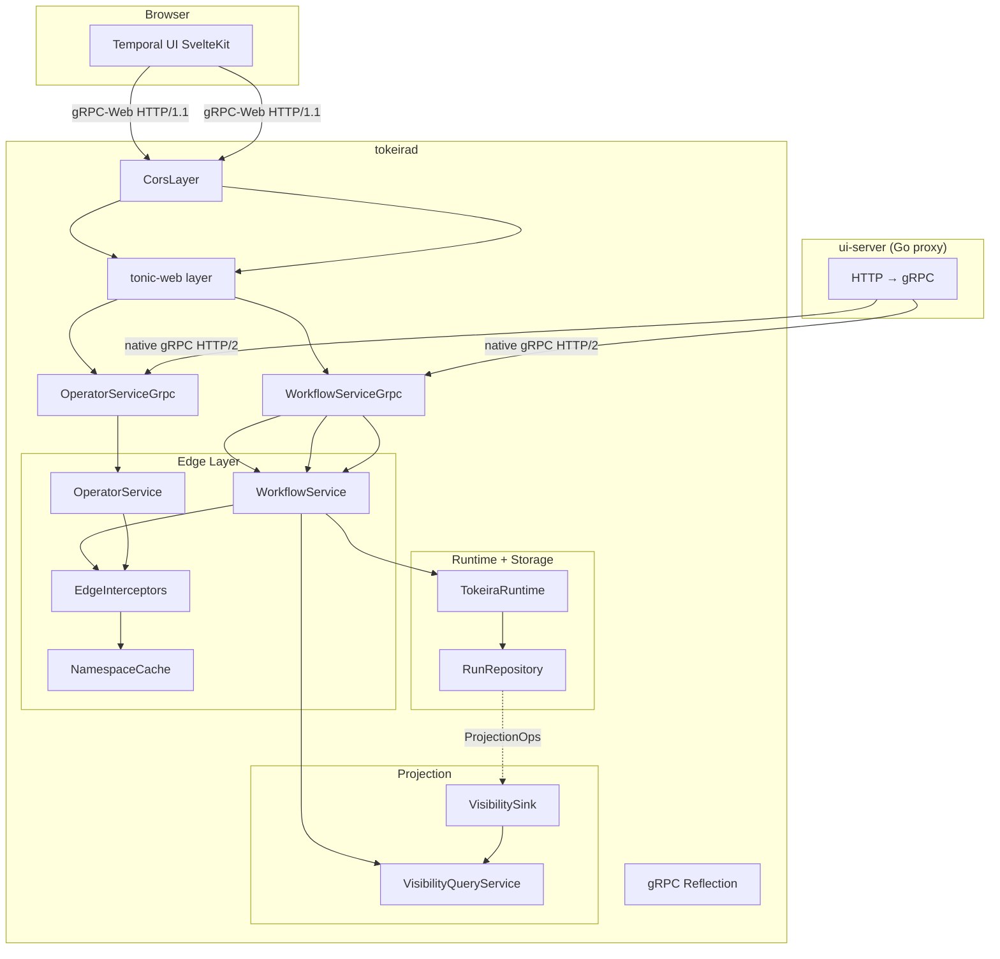

# Design Document — Temporal UI Support

## Overview

This design enables the Temporal UI to connect to tokeirad by implementing the missing gRPC endpoints the UI depends on, adding gRPC-Web transport for direct browser connections, and wiring the visibility projection pipeline so workflow lists show real data.

The work spans three crates:

- `tokeira-edge` — new gRPC handlers and edge-layer logic for discovery, namespace management, reverse history, delete, reset, describe-task-queue, and signal-with-start
- `tokeira-projection` — wire the visibility sink into the server startup so `ListWorkflowExecutions` returns real data
- `tokeirad` (app binary) — add `tonic-web` + CORS middleware, wire new dependencies

The design follows the existing edge-layer pattern: thin gRPC handlers in `grpc/workflow_service.rs` delegate to edge-layer methods on `WorkflowService`, which perform interceptor checks, routing, and delegation to the runtime/storage/cache. Proto ↔ edge DTO translation lives in `grpc/translate.rs`.

## Architecture



### Transport layer

The tonic `Server::builder()` gains two new layers:

1. `tower_http::cors::CorsLayer` — permissive CORS for development (`allow_any_origin`, `allow_any_header`, `allow_any_method`)
2. `tonic_web::GrpcWebLayer` — decodes gRPC-Web framing, re-encodes responses

Both native gRPC (HTTP/2) and gRPC-Web (HTTP/1.1) work on the same port. The layer stack is: CORS → gRPC-Web → tonic router.

### Endpoint dispatch

New endpoints follow the existing pattern:

1. gRPC handler in `grpc/workflow_service.rs` extracts headers, translates proto → edge DTO
2. Edge method on `WorkflowService` runs interceptors, delegates to runtime/storage/cache
3. Response translated edge DTO → proto

For `GetClusterInfo`, the `WorkflowService` needs access to the `OperatorApi` (or a `ClusterInfoProvider` trait). The simplest approach: add an `Arc<dyn OperatorApi>` field to `WorkflowService`.

## Components and Interfaces

### New `NamespaceCache` methods

```rust
// Added to the NamespaceCache trait
#[async_trait]
pub trait NamespaceCache: Send + Sync + 'static {
    async fn get(&self, name: &str) -> Result<Option<ResolvedNamespace>>;
    async fn list_all(&self) -> Result<Vec<ResolvedNamespace>>;  // NEW
    async fn insert(&self, ns: ResolvedNamespace) -> Result<()>; // promote from impl to trait
}
```

`InMemoryNamespaceCache::list_all()` returns a clone of all values. `insert` moves from an inherent method to a trait method so the gRPC handler can register namespaces through the trait object.

### New edge-layer methods on `WorkflowService`

```rust
impl WorkflowService {
    // Discovery
    pub fn get_system_info(&self, headers: &HeaderMap) -> EdgeResult<SystemInfo>;
    pub async fn get_cluster_info(&self, headers: &HeaderMap) -> EdgeResult<ClusterInfo>;

    // Namespace management
    pub async fn list_namespaces(&self, headers: &HeaderMap) -> EdgeResult<Vec<ResolvedNamespace>>;
    pub async fn describe_namespace(&self, headers: &HeaderMap, name: &str) -> EdgeResult<ResolvedNamespace>;
    pub async fn register_namespace(&self, headers: &HeaderMap, req: RegisterNamespaceRequest) -> EdgeResult<()>;

    // History
    pub async fn get_workflow_execution_history_reverse(
        &self, headers: &HeaderMap, req: GetWorkflowExecutionHistoryRequest,
    ) -> EdgeResult<GetWorkflowExecutionHistoryResponse>;

    // Workflow management
    pub async fn delete_workflow_execution(
        &self, headers: &HeaderMap, req: DeleteWorkflowExecutionRequest,
    ) -> EdgeResult<()>;
    pub async fn reset_workflow_execution(
        &self, headers: &HeaderMap, req: ResetWorkflowExecutionRequest,
    ) -> EdgeResult<ResetWorkflowExecutionResponse>;
    pub async fn signal_with_start_workflow_execution(
        &self, headers: &HeaderMap, req: SignalWithStartWorkflowExecutionRequest,
    ) -> EdgeResult<StartWorkflowExecutionResponse>;

    // Task queue
    pub async fn describe_task_queue(
        &self, headers: &HeaderMap, req: DescribeTaskQueueRequest,
    ) -> EdgeResult<DescribeTaskQueueResponse>;
}
```

### New edge DTOs (in `translate/mod.rs`)

```rust
pub struct SystemInfo {
    pub server_version: String,
    pub capabilities: SystemCapabilities,
}

pub struct SystemCapabilities {
    pub signal_and_query_header: bool,
    pub internal_error_differentiation: bool,
    pub activity_failure_include_heartbeat: bool,
    pub supports_schedules: bool,
    pub encoded_failure_attributes: bool,
    pub build_id_based_versioning: bool,
    pub upsert_memo: bool,
    pub eager_workflow_start: bool,
    pub sdk_metadata: bool,
    pub count_group_by_execution_status: bool,
}

pub struct RegisterNamespaceRequest {
    pub name: String,
    pub description: String,
    pub retention_days: u32,
}

pub struct DeleteWorkflowExecutionRequest {
    pub namespace: String,
    pub workflow_id: String,
    pub run_id: Option<String>,
}

pub struct ResetWorkflowExecutionRequest {
    pub namespace: String,
    pub workflow_id: String,
    pub run_id: Option<String>,
    pub workflow_task_finish_event_id: i64,
    pub reason: String,
    pub request_id: Option<String>,
}

pub struct ResetWorkflowExecutionResponse {
    pub run_id: RunId,
}

pub struct SignalWithStartWorkflowExecutionRequest {
    pub start: StartWorkflowExecutionRequest,
    pub signal_name: String,
    pub signal_input: Payloads,
}

pub struct DescribeTaskQueueRequest {
    pub namespace: String,
    pub task_queue: String,
}

pub struct DescribeTaskQueueResponse {
    pub pollers: Vec<PollerInfo>,
}

pub struct PollerInfo {
    pub identity: String,
    pub last_access_time: Option<OffsetDateTime>,
    pub rate_per_second: f64,
}
```

### `WorkflowService` dependency changes

```rust
pub struct WorkflowService {
    runtime: Arc<dyn WorkflowRuntimeApi>,
    resolver: Arc<dyn ExecutionResolver>,
    visibility: Arc<dyn VisibilityApi>,
    repo: Arc<dyn RunRepository>,
    interceptors: Arc<EdgeInterceptors>,
    long_polls: LongPollGate,
    router: Arc<dyn EdgeRouter>,
    history_waiters: HistoryWaitRegistry,
    operator_api: Arc<dyn OperatorApi>,       // NEW — for GetClusterInfo
    namespace_cache: Arc<dyn NamespaceCache>,  // NEW — for namespace endpoints
    poller_registry: PollerRegistry,           // NEW — for DescribeTaskQueue
}
```

The constructor gains three new parameters. `main.rs` already has `operator_api` and `namespace_cache` — they just need to be passed through. `PollerRegistry` is created in `main.rs` and shared with the gRPC handlers.

### Visibility pipeline wiring

The `tokeirad` binary already creates an `InMemoryVisibilityStore` and a `VisibilityQueryService`. The missing piece is the `VisibilitySink` — it needs to be connected to the projection log so that `ProjectionRecord`s flow into the visibility store.

**Authoritative ingestion point: the projection worker.** The `ProjectionWorker` in `tokeira-projection/src/worker.rs` is the correct place to consume `ProjectionRecord`s and feed them to the `VisibilitySink`. This is the only path that sees all commits — including background scanner-driven commits, activity timeout commits, and timer-fired commits — not just request paths that flow through the edge/runtime facade. The `RuntimeAdapter` only sees edge-facing request paths and would miss background commits.

The `tokeirad` binary must start the `ProjectionWorker` as a background task, connected to the storage layer's projection log and the `VisibilitySink`.

### `VisibilityApi` — extend with delete

The current `VisibilityApi` trait is query-only (`list_workflows`, `count_workflows`). For `DeleteWorkflowExecution`, the `WorkflowService` needs to delete from visibility. Rather than injecting a separate `VisibilityStore` handle, extend `VisibilityApi` with a `delete_execution` method:

```rust
#[async_trait]
pub trait VisibilityApi: Send + Sync + 'static {
    async fn list_workflows(&self, req: ListWorkflowExecutionsRequest) -> Result<ListWorkflowExecutionsResponse>;
    async fn count_workflows(&self, req: CountWorkflowExecutionsRequest) -> Result<CountWorkflowExecutionsResponse>;
    async fn delete_execution(&self, run_key: RunKey) -> Result<()>;  // NEW
}
```

The `VisibilityQueryService` (which implements `VisibilityApi`) delegates `delete_execution` to the underlying `VisibilityStore`. This keeps the `WorkflowService` dependency model clean — it only needs `Arc<dyn VisibilityApi>`.

### `VisibilityStore` — delete support

```rust
// Added to VisibilityStore trait
async fn delete_execution(&self, run_key: RunKey) -> Result<()>;
```

`InMemoryVisibilityStore::delete_execution` removes the row and all associated search attribute indexes and rollup entries.

## Data Models

### `ResolvedNamespace` (existing, unchanged)

```rust
pub struct ResolvedNamespace {
    pub name: String,
    pub namespace_id: Option<String>,
    pub is_global: bool,
    pub visibility_enabled: bool,
    pub deleted: bool,
}
```

### `SystemInfo` / `SystemCapabilities` (new)

Static struct returned by `GetSystemInfo`. Capabilities reflect what tokeirad actually supports:

| Capability | Value | Rationale |
|---|---|---|
| `signal_and_query_header` | `true` | Headers are threaded through signals and queries |
| `internal_error_differentiation` | `true` | EdgeError distinguishes error types |
| `activity_failure_include_heartbeat` | `false` | Heartbeat details not threaded to failure |
| `supports_schedules` | `false` | Schedules not implemented |
| `encoded_failure_attributes` | `true` | Failures encoded as proto payloads |
| `build_id_based_versioning` | `false` | Versioning not fully implemented |
| `upsert_memo` | `true` | UpsertMemo command supported |
| `eager_workflow_start` | `false` | Eager dispatch not implemented |
| `sdk_metadata` | `false` | SDK metadata not threaded |
| `count_group_by_execution_status` | `true` | Rollup-based counting implemented |

### `PollerInfo` and `PollerRegistry` (new)

Tracks active pollers for `DescribeTaskQueue`. The `LongPollGate` is only a concurrency semaphore — it does not track poller identity, timestamps, or per-queue state. A new `PollerRegistry` is needed:

```rust
/// Tracks active pollers per task queue for DescribeTaskQueue.
#[derive(Clone, Default)]
pub struct PollerRegistry {
    inner: Arc<RwLock<HashMap<QueueKey, Vec<ActivePoller>>>>,
}

struct ActivePoller {
    identity: String,
    registered_at: OffsetDateTime,
    task_kind: TaskKind,  // Workflow or Activity
}

impl PollerRegistry {
    /// Register a poller when a poll request begins. Returns a guard
    /// that deregisters on drop.
    pub async fn register(&self, queue: &QueueKey, identity: &str) -> PollerGuard;

    /// List active pollers for a task queue.
    pub async fn pollers(&self, queue: &QueueKey) -> Vec<PollerInfo>;
}
```

The `PollerGuard` is an RAII guard that removes the poller entry when the poll request completes (either with a task or timeout). The gRPC handlers for `PollWorkflowTaskQueue` and `PollActivityTaskQueue` call `registry.register()` at entry and hold the guard for the duration of the poll.

`WorkflowService` gains a `poller_registry: PollerRegistry` field. `DescribeTaskQueue` delegates to `poller_registry.pollers()`.

### Proto translation additions

New translation functions in `grpc/translate.rs`:

- `system_info_to_proto(SystemInfo) → GetSystemInfoResponse`
- `cluster_info_to_proto(ClusterInfo) → GetClusterInfoResponse`
- `namespace_to_proto(ResolvedNamespace) → DescribeNamespaceResponse`
- `namespaces_to_proto(Vec<ResolvedNamespace>) → ListNamespacesResponse`
- `register_namespace_to_edge(RegisterNamespaceRequest) → RegisterNamespaceRequest`
- `reverse_history_request_to_edge(...)` / `reverse_history_response_to_proto(...)`

**Reverse history pagination token semantics:**

The reverse `next_page_token` encodes a `before_event_id` as big-endian i64 bytes. This is distinct from the forward-history token (which encodes `after_event_id`). The reverse traversal starts from the highest event_id and works backwards:

- First request: empty token → start from the last event
- Subsequent requests: token contains `before_event_id` → return events with `event_id < before_event_id`
- Empty token in response → no more events

This avoids ambiguity with the forward cursor format.

- `delete_request_to_edge(...)` / `reset_request_to_edge(...)` / `reset_response_to_proto(...)`
- `signal_with_start_request_to_edge(...)` / `signal_with_start_response_to_proto(...)`
- `describe_task_queue_request_to_edge(...)` / `describe_task_queue_response_to_proto(...)`

## Correctness Properties

*A property is a characteristic or behavior that should hold true across all valid executions of a system — essentially, a formal statement about what the system should do. Properties serve as the bridge between human-readable specifications and machine-verifiable correctness guarantees.*

### Property 1: Namespace cache round-trip

*For any* set of `ResolvedNamespace` values inserted into the `NamespaceCache`, calling `list_all()` SHALL return a set containing every inserted namespace with matching `name`, `is_global`, `visibility_enabled`, and `deleted` fields.

**Validates: Requirements 3.1, 3.2, 3.4**

### Property 2: Namespace lookup correctness

*For any* namespace name, calling `describe_namespace` SHALL return the namespace if it exists in the cache, or a NOT_FOUND error if it does not. The returned namespace fields SHALL match the cached entry exactly.

**Validates: Requirements 4.1, 4.2**

### Property 3: Describe workflow execution field preservation

*For any* `WorkflowExecutionDescription` edge DTO, translating it to a proto `DescribeWorkflowExecutionResponse` and extracting the `workflow_execution_info` SHALL preserve `workflow_id`, `run_id`, `workflow_type`, `task_queue`, `status`, `start_time`, `close_time`, `history_length`, and `state_transition_count`.

**Validates: Requirements 6.1**

### Property 4: Reverse history ordering

*For any* workflow execution history with N events, calling `get_workflow_execution_history_reverse` and collecting all pages SHALL yield exactly N events in strictly descending `event_id` order.

**Validates: Requirements 8.1, 8.2**

### Property 5: Delete removes from visibility

*For any* closed workflow execution present in the visibility store, calling `delete_workflow_execution` SHALL result in the execution no longer appearing in `list_workflow_executions` results.

**Validates: Requirements 9.1**

### Property 6: Describe task queue lists all pollers

*For any* set of workers polling a task queue, calling `describe_task_queue` SHALL return a pollers list containing an entry for each active poller with matching identity.

**Validates: Requirements 11.1**

### Property 7: Signal-with-start conditional behavior

*For any* `SignalWithStartWorkflowExecution` request: if the target workflow is running, the signal SHALL be delivered and the existing `run_id` returned; if the target workflow does not exist, a new execution SHALL be started with the signal delivered, and the new `run_id` returned.

**Validates: Requirements 12.1, 12.2**

### Property 8: Register namespace round-trip with duplicate detection

*For any* valid namespace name (non-empty, alphanumeric/hyphen/underscore), calling `register_namespace` SHALL make the namespace retrievable via `describe_namespace`. Calling `register_namespace` again with the same name SHALL return an ALREADY_EXISTS error.

**Validates: Requirements 13.1, 13.2**

### Property 9: Namespace name validation

*For any* string, `register_namespace` SHALL accept it if and only if it is non-empty and matches the pattern `^[a-zA-Z0-9_-]+$`. Strings containing other characters or empty strings SHALL be rejected with an INVALID_ARGUMENT error.

**Validates: Requirements 13.3**

## Error Handling

All new endpoints follow the existing `EdgeError` pattern:

| Condition | EdgeError variant | gRPC Status |
|---|---|---|
| Namespace not found | `NamespaceNotFound` | `NOT_FOUND` |
| Workflow not found | `WorkflowNotFound` | `NOT_FOUND` |
| Namespace already exists | New: `NamespaceAlreadyExists(String)` | `ALREADY_EXISTS` |
| Invalid namespace name | `BadRequest` | `INVALID_ARGUMENT` |
| Invalid reset event ID | `BadRequest` | `INVALID_ARGUMENT` |
| Interceptor rejection | `Unauthorized` / `Forbidden` | `UNAUTHENTICATED` / `PERMISSION_DENIED` |
| Internal failure | `Internal` | `INTERNAL` |

New `EdgeError` variant needed:

```rust
#[error("namespace already exists: {0}")]
NamespaceAlreadyExists(String),
```

Maps to `StatusCode::CONFLICT` (HTTP) and `Status::already_exists` (gRPC).

The gRPC error translation in `grpc/errors.rs` needs a new arm for `NamespaceAlreadyExists → Status::already_exists`.

## Testing Strategy

### Property-based tests (proptest, minimum 100 iterations each)

Property-based testing is appropriate here because several endpoints have pure logic that varies meaningfully with input (namespace validation, DTO translation, history reversal, cache round-trips).

Library: `proptest` (already used in `tokeira-projection` and `tokeira-kernel`).

Each property test references its design property via tag comment:

```
// Feature: temporal-ui-support, Property N: <title>
// Validates: Requirements X.Y
```

Tests to implement:

1. **Property 1** — Generate random `ResolvedNamespace` sets, insert into `InMemoryNamespaceCache`, verify `list_all()` completeness
2. **Property 2** — Generate random namespace names, insert some, verify `get()` returns correct result for both present and absent names
3. **Property 3** — Generate random `WorkflowExecutionDescription` values, translate to proto, verify field preservation
4. **Property 4** — Generate random history event sequences, reverse, verify descending order and pagination completeness
5. **Property 5** — Generate random visibility rows, delete one, verify it's gone from list results
6. **Property 6** — Generate random poller sets, register them, verify `describe_task_queue` returns all
7. **Property 7** — Generate random signal-with-start scenarios (workflow exists vs. not), verify correct branch taken
8. **Property 8** — Generate random valid namespace names, register, verify round-trip and duplicate detection
9. **Property 9** — Generate random strings (valid and invalid), verify namespace validation matches expected regex

### Unit tests (example-based)

- `GetSystemInfo` returns expected capabilities struct
- `GetClusterInfo` delegates to `OperatorApi::cluster_info()` and returns correct fields
- `ListNamespaces` with empty cache returns empty list
- `DescribeNamespace` with non-existent name returns NOT_FOUND
- `DeleteWorkflowExecution` with non-existent workflow returns NOT_FOUND
- `ResetWorkflowExecution` with non-WFT-completed event returns INVALID_ARGUMENT
- `RegisterNamespace` with empty name returns INVALID_ARGUMENT
- `RegisterNamespace` with special characters returns INVALID_ARGUMENT

### Integration tests

- gRPC-Web request to `GetSystemInfo` returns valid response
- Native gRPC and gRPC-Web on same port both work
- CORS preflight returns expected headers
- Start workflow → verify it appears in `ListWorkflowExecutions`
- Start workflow → complete → verify `DescribeWorkflowExecution` shows closed status

### Test configuration

- All property tests: `ProptestConfig::with_cases(100)`
- All tests use `InMemoryNamespaceCache`, `InMemoryVisibilityStore`, and `InMemoryOperatorApi` — no external dependencies
- Async property tests use `tokio::runtime::Builder::new_current_thread()` (matching existing pattern in projection crate)
