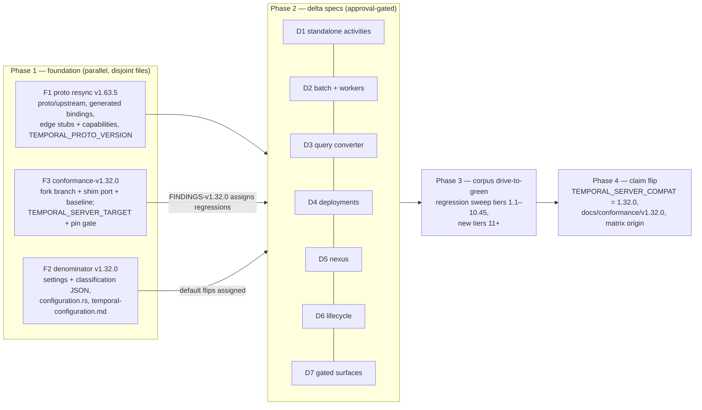
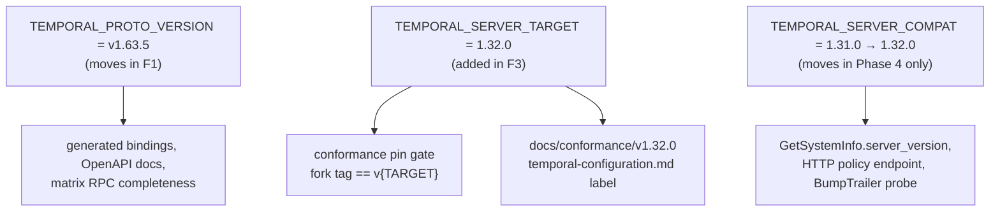

# Design Document: Temporal v1.32.0 Compatibility

## Overview

This design moves Tokeira's compatibility claim from Temporal server `1.31.0` to
`1.32.0` as a sequenced campaign. It owns the shared foundation — the three pins, the
`v1.63.5` wire surface and its classified audit, the `v1.32.0` configuration
denominator, the `tokeira/conformance-v1.32.0` fork branch and its baseline — and the
final claim flip. It deliberately owns no workflow behaviour: every behavioural delta
is assigned to one of seven delta specs (Requirement 9) that are authored, approved,
and implemented on their own.

Wire shape is derived from `buf export buf.build/temporalio/api:v1.63.5` diffed against
the vendored `v1.62.11` tree (20 changed files, 4 added files, 6 added RPCs). Behaviour
is derived from the Temporal server source at tag `v1.32.0` in the reference fork.
Release notes are used for maturity labels only.

## Dependencies and Non-Goals

### Owning relationships

- `proto-upstream-sync` owns `tools/proto-sync` and the checked-in generated bindings;
  this design invokes the tool unchanged and records one tool gap (§ Components 3).
- `temporal-api-v1.62-sync` established the audit vocabulary, the deferred-stub
  pattern, the placeholder-directory rule, and the structural tests this design
  extends.
- `temporal-compatibility` governs when the claim may move (Req 5.4–5.5 there).
- `release-process` documents the manual bump protocol and the `Server-Compat-Bump:`
  trailer; its engine is unbuilt.
- `configuration-policy` owns the extractor, the denominator file format, and the
  verifier; this design re-runs them at the new tag.
- `conformance-harness`, `temporal-functional-conformance`, and
  `conformance-config-override` own the fork shim, the skip registry, and the
  override bridge; this design ports them to the new tag.
- `activity-executions-first-class` is absorbed by delta spec D1.

### Non-goals

- Any behaviour past tag `v1.32.0`.
- Implementing features Target_Release gates off by default; they appear only as
  their Stock_Rejection, owned by the delta specs.
- Changing the deprecated Worker Versioning V1/V2 posture (unchanged in `1.32.0`).
- The engine `0.4.0` release train (`release-engineering`).
- Modifying `tools/proto-sync`, `tools/temporal-config-audit`, or the kernel.

## Architecture

The campaign has one control path (the pins and the claim) and four evidence paths
that feed it. Phase 1 slices are disjoint by file set and run in parallel; delta specs
follow the proto resync because they consume the new generated types; the corpus
drive-to-green follows the delta specs; the claim flip follows everything.



The three pins and what reads them:



## Components and Interfaces

### 1. Pins (`crates/tokeira-build-info/src/pinned.rs`)

```rust
pub const TEMPORAL_PROTO_VERSION: &str = "v1.63.5";   // F1
pub const TEMPORAL_SERVER_COMPAT: &str = "1.31.0";    // Phase 4 → "1.32.0"
/// The Temporal server release under compatibility campaign. Equals
/// `TEMPORAL_SERVER_COMPAT` when no campaign is running. Read by the
/// conformance pin gate and the documentation generator; never advertised.
pub const TEMPORAL_SERVER_TARGET: &str = "1.32.0";    // F3
```

The tracked-ahead doc comment (`pinned.rs:11-15`) is rewritten: at `v1.63.5` the vendored
surface equals the API version Target_Release ships, so nothing is tracked ahead.

Two tests join the existing pin tests in `tokeira-build-info`:

- `proto_pin_matches_upstream_version_file` — reads `proto/UPSTREAM_VERSION` relative to
  `CARGO_MANIFEST_DIR` and asserts equality with `TEMPORAL_PROTO_VERSION`; skips
  (documented) when the file is absent, because the published crate carries no
  workspace (same posture as the existing schema-contract parity tests).
- `server_target_is_not_behind_claim` — parses both constants as semver and asserts
  `TARGET >= COMPAT`.

`build.rs` and `lib.rs` expose the target pin the way they expose the other two.

### 2. Conformance pin gate (`crates/tokeira-edge/src/conformance/pin.rs`)

The expected tag becomes `format!("v{TEMPORAL_SERVER_TARGET}")`. `TagMismatch` and
`BranchRejected` semantics are unchanged; the message names the target pin so an
operator sees which constant the fork must match.

### 3. Proto resync (`tools/proto-sync`, one atomic commit)

`cargo run -p proto-sync -- v1.63.5` wipes `proto/upstream/`, exports the module, writes
`proto/UPSTREAM_VERSION`, and regenerates `crates/tokeira-proto/src/generated/`.

**Tool gap (recorded, not fixed here).** The wipe removes two Tokeira-owned trees that
are not part of the `buf` module:

- `proto/upstream/temporal/server/api/adminservice/v1/service.proto` — Tokeira's
  minimal AdminService. Restored from `HEAD` unchanged.
- `proto/upstream/temporalproto/openapi/{README.md,openapiv2.swagger.json,openapiv3.yaml}`
  — refreshed by copying `openapi/openapiv2.json` and `openapi/openapiv3.yaml` from
  `temporalio/api` at tag `v1.63.5`, with the README's SHA-256 table updated.

After the restore, `cargo run -p proto-sync -- generate` regenerates the AdminService
bindings and the OpenAPI copies, and `-- check` must report no diff. The gap is raised
to the `proto-upstream-sync` owner as a follow-up (preserve non-module paths across a
sync); this campaign does not modify the tool.

The `buf` export also refreshed `proto/upstream/google/api/{annotations,http}.proto` to
the googleapis revision the module now depends on; this is accepted as part of the
export.

### 4. Edge (`crates/tokeira-edge`)

- **Deferred stubs.** `grpc/workflow_service.rs` gains one bracketed block per owning
  delta spec, each handler returning `Status::unimplemented` with the message
  `"<Rpc> is deferred to spec <name>"` and `debug!`-level logging only, following the
  existing blocks. Six handlers: `count_workers` (D2); `pause_activity_execution`,
  `unpause_activity_execution`, `reset_activity_execution`,
  `update_activity_execution_options` (D1); `poll_workflow_execution_time_skipping` (D7).
- **Capabilities.** `grpc/translate.rs` writes every new flag verbatim per the
  Contract Policy table (all `false`), and the new `NamespaceInfo.Limits.workflow_task_completion_size_limit_error`
  as `0`. The `SystemCapabilities` DTO in `translate/mod.rs` gains
  `server_scaled_provider_cloud_run: bool`; `NamespaceCapabilities` gains the eight
  new booleans; construction sites set them explicitly.
- **Type-path moves.** Every reference to `workflow::v1::TimeSkippingConfig` becomes
  `common::v1::TimeSkippingConfig`; keep today's `INVALID_ARGUMENT` rejection of
  behavioural requests and the execution-options mask validation. The removed `bound`
  check maps to `fast_forward_config.is_some()` or `max_session_skip_count != 0`.
  Empty start/signal configs remain accepted. D7 owns the `UNIMPLEMENTED` rejection of
  every non-nil config (`service/frontend/workflow_handler.go:713` and `errors.go:118`
  @ `v1.32.0`).
- **Deprecated fields.** `poller_group_infos` on the four poll/describe responses and
  `StartBatchOperationRequest.executions` are now `[deprecated = true]`; the edge keeps
  reading and writing them under `#[allow(deprecated)]` with a comment naming D2 as the
  migration owner, exactly as the v1.62 sync handled `worker_version`.
- **Enum values.** Generated enums gain values; any exhaustive `match` on
  `BatchOperationType`, `WorkflowTaskFailedCause`, `ActivityExecutionStatus`, or
  `StartChildWorkflowExecutionFailedCause` gains arms that preserve today's behaviour
  (unknown-on-request → today's rejection; never emitted on response until the owning
  delta spec).
- **Inventory.** `UNSUPPORTED_FIELDS.md` lists every dropped new request field with its
  delta spec; `crates/tokeira-proto/tests/fixtures/binding-inventory.json` is
  regenerated; `crates/tokeira-proto/src/public.rs` OpenAPI comments cite `v1.63.5`.

### 5. Feature matrix (`crates/tokeira-compatibility/src/matrix.rs`)

Each of the six RPCs is owned by exactly one entry with `FeatureState::Stubbed`, an
evidence reference naming the owning delta spec directory, and the Target_Release
source path from the Contract Policy table. Entry shape (new entries or extension of
an existing `Stubbed` entry) is the implementer's call; the invariants are
`every_rpc_is_owned_once` and `matrix_classifies_every_upstream_rpc`. The `FeatureOrigin`
enum is untouched until Phase 4, when `TemporalV1_32` (label `temporal-v1.32.0`) is
added and every entry's origin and evidence are re-verified.

### 6. Configuration denominator (`tools/temporal-config-audit`, `crates/tokeira-compatibility`)

```sh
go run ./tools/temporal-config-audit -repo <reference-fork> -tag v1.32.0 \
  -output crates/tokeira-compatibility/data/temporal-v1.32.0-settings.json
```

The classification ledger `temporal-v1.32.0-classification.json` is authored by
diffing key sets against the `v1.31.0` ledger: unchanged keys carry their disposition
forward with re-verified evidence anchors; added keys get a fresh disposition; removed
and renamed keys are recorded in the ledger's change notes; keys whose default flipped
record both defaults and the owning delta spec. `configuration.rs` includes the
`v1.32.0` files; the `v1.31.0` files are deleted. `tools/compatibility-docs` renders
`docs/conformance/v1.32.0/temporal-configuration.md` with a header stating it is the
`TEMPORAL_SERVER_TARGET` denominator while the claim is still `1.31.0`.

### 7. Conformance branch (fork) and baseline

- `git switch -c tokeira/conformance-v1.32.0 v1.32.0` on the reference fork, then
  cherry-pick or re-apply the Harness_Shim and fork tooling from
  `tokeira/conformance-v1.31.0`.
- Port points known from the `tests/testcore` delta: `WithTimeout` removed;
  `overrideDynamicConfig` split into `…ForClusterLifetime` and `…ForTest`;
  `dedicatedClusterGuard`; new `clients.go`, `shared_cluster_t.go`,
  `history_task_recorder.go`; `task_queue_recorder.go` removed; shard-salt bumps.
- Toolchain pinned to `go 1.26.8` per Target_Release `go.mod`.
- Baseline: the run-all executor over the whole corpus against an unchanged
  `tokeirad` (this campaign's `main`), distilled per suite into
  `reference/FINDINGS-v1.32.0.md` with the row shape in § Data Models.

### 8. Delta spec placeholders

F1 creates `.kiro/specs/v132-<name>/.placeholder.md` for the seven delta specs so
every Deferred audit row names an existing directory (the precedent's Step 0). Each
placeholder states the owner, the scope line from Requirement 9, and the corpus
anchors. Full specs replace the placeholders one at a time.

### 9. Claim flip (Phase 4)

A single PR: `pinned.rs` (`COMPAT = "1.32.0"`, target unchanged), the
`Server-Compat-Bump:` trailer, the evidence table in the PR body, the
`docs/conformance/v1.32.0/` folder, the matrix origin and evidence refresh, the
digests, and every doc cite in Requirement 11.5–11.6. No behaviour change rides in it.

## Data Models

### Pins

| Constant | Contract source | F1 | F3 | Phase 4 |
|---|---|---|---|---|
| `TEMPORAL_PROTO_VERSION` | `proto/UPSTREAM_VERSION` | `"v1.63.5"` | — | — |
| `TEMPORAL_SERVER_TARGET` | integration-seat decision | — | `"1.32.0"` | `"1.32.0"` |
| `TEMPORAL_SERVER_COMPAT` | conformance evidence | `"1.31.0"` | `"1.31.0"` | `"1.32.0"` |

### `reference/FINDINGS-v1.32.0.md` row

| Suite | 1.31.0 Ledger state | v1.32.0 baseline (pass / fail / skip / unfinished) | Classification | Owner |
|---|---|---|---|---|

`Classification` is one of `unchanged-clean`, `regression`, `new-suite`,
`out-of-surface`; `Owner` is a delta spec name or `registry-skip` with the cited reason.

### Denominator files

Format and verifier unchanged from `configuration-policy` (`design.md` there, § Data
Models). The only additions are per-entry change notes: `added_in`, `removed_in`,
`renamed_from`, `default_changed_from`, each optional.

### Placeholder spec file

`.kiro/specs/v132-<name>/.placeholder.md` — owner line, scope line, corpus anchors,
"replaced by the full spec" sentence.

## Surface_Audit (Req 2)

Every proto-level delta between the vendored `v1.62.11` tree and the `v1.63.5` export.
`Added In` is the API tag from the upstream release notes where it is unambiguous.
Classification meanings follow `temporal-api-v1.62-sync`. Target Spec names the delta
spec that owns the behaviour; a `—` means no follow-up is needed.

### New RPCs on `WorkflowService`

| Kind | Qualified Name | Added In | Classification | Disposition | Target Spec |
|---|---|---|---|---|---|
| RPC | `WorkflowService.CountWorkers` | v1.62.14 | Deferred | Stub naming D2; Target_Release counts heartbeat-backed workers via matching (`workflow_handler.go:7416 @ v1.32.0`) | `v132-batch-operations-and-workers` |
| RPC | `WorkflowService.PauseActivityExecution` | v1.62.12 | Deferred | Stub naming D1; Target_Release serves embedded activities by `workflow_id` and gates the standalone path (`chasm/lib/activity/frontend.go:450-480 @ v1.32.0`) | `v132-standalone-activities` |
| RPC | `WorkflowService.UnpauseActivityExecution` | v1.62.12 | Deferred | Stub naming D1 (`frontend.go:486-510`) | `v132-standalone-activities` |
| RPC | `WorkflowService.ResetActivityExecution` | v1.62.12 | Deferred | Stub naming D1 (`frontend.go:516-540`) | `v132-standalone-activities` |
| RPC | `WorkflowService.UpdateActivityExecutionOptions` | v1.62.12 | Deferred | Stub naming D1 (`frontend.go:546-570`) | `v132-standalone-activities` |
| RPC | `WorkflowService.PollWorkflowExecutionTimeSkipping` | v1.63.5 | Deferred | Stub naming D7; Target_Release returns `errWorkflowTimeSkippingNotEnabled` after execution validation (`workflow_handler.go:7608-7625 @ v1.32.0`) | `v132-gated-surfaces` |

`OperatorService` is unchanged (12 RPCs). The deprecated `PauseActivity`,
`UnpauseActivity`, `ResetActivity`, `UpdateActivityOptions` remain served at
Target_Release and by Tokeira.

### New packages and files

| Kind | Qualified Name | Added In | Classification | Disposition | Target Spec |
|---|---|---|---|---|---|
| Package | `nexusannotations.v1` (`nexusannotations/v1/options.proto`, top-level path) | v1.62.13 | Ignore | Descriptor extensions `ServiceOptions` (8233) / `OperationOptions` (8234) on system Nexus services; compile only, no code consumes | — |
| File | `temporal.api.enums.v1.FastForwardPollingResult` (`enums/v1/time_skipping.proto`) | v1.63.5 | Deferred | Values 0–3; consumed only by `PollWorkflowExecutionTimeSkippingResponse` | `v132-gated-surfaces` |
| Message | `temporal.api.sdk.v1.ExternalStorageReference` (`sdk/v1/external_storage.proto`) | v1.62.12 | Deferred | `driver_name`, `claim_data`; no Tokeira consumer; payload external storage is out of surface | `v132-gated-surfaces` |
| Message | `temporal.api.sdk.v1.EventGroupMarker` (`sdk/v1/event_group_marker.proto`) | v1.62.14 | Deferred | `label` / `inbound_event` / `inbound_update` oneof; carried on commands and history events (below) | `v132-gated-surfaces` |

### Capability fields

| Kind | Qualified Name | Added In | Classification | Disposition | Target Spec |
|---|---|---|---|---|---|
| Field | `NamespaceInfo.Capabilities.worker_commands` (10) | v1.62.12 | Capability | Advertise `false` (`frontend.WorkerCommandsEnabled` default `false`) | `v132-gated-surfaces` |
| Field | `NamespaceInfo.Capabilities.standalone_nexus_operation` (11) | v1.62.12 | Capability | Advertise `false` (`nexusoperation.enableStandalone` default `false`) | `v132-nexus` |
| Field | `NamespaceInfo.Capabilities.workflow_update_callbacks` (12) | v1.62.13 | Capability | Advertise `false` (`history.enableUpdateCallbacks` default `false`) | `v132-lifecycle-fidelity` |
| Field | `NamespaceInfo.Capabilities.poller_autoscaling_auto_enroll` (13) | v1.63.0 | Capability | Advertise `false` (`frontend.pollerAutoscalingAutoEnroll` default `false`) | `v132-batch-operations-and-workers` |
| Field | `NamespaceInfo.Capabilities.workflow_task_completion_pagination` (14) | v1.63.2 | Capability | Advertise `false` (`history.enableWorkflowTaskCompletionPagination` default `false`) | `v132-gated-surfaces` |
| Field | `NamespaceInfo.Capabilities.standalone_activity_start_delay` (15) | v1.63.4 | Capability | Advertise `false` until D1 implements start delay (Target_Release stock `true`) | `v132-standalone-activities` |
| Field | `NamespaceInfo.Capabilities.standalone_activity_batch_operations` (16) | v1.63.4 | Capability | Advertise `false` (`frontend.enableBatchOperationsForStandaloneActivities` default `false`) | `v132-standalone-activities` |
| Field | `NamespaceInfo.Capabilities.standalone_activity_operator_commands` (17) | v1.63.4 | Capability | Advertise `false` (`history.enableStandaloneActivityOperatorCommands` default `false`) | `v132-standalone-activities` |
| Field | `NamespaceInfo.Limits.workflow_task_completion_size_limit_error` (3) | v1.63.5 | Capability | Emit `0`; populated by D7 from the pagination buffer limit | `v132-gated-surfaces` |
| Field | `GetSystemInfoResponse.Capabilities.server_scaled_provider_cloud_run` (13) | v1.63.2 | Capability | Advertise `false` | `v132-worker-deployments` |

### Re-typed and deprecated shapes

| Kind | Qualified Name | Added In | Classification | Disposition | Target Spec |
|---|---|---|---|---|---|
| Message | `temporal.api.common.v1.TimeSkippingConfig` (moved from `workflow.v1`; `enabled` 1, `fast_forward_config` 2, `disable_propagation` moved 2 → 3, `max_session_skip_count` 4; `max_skipped_duration`, `max_elapsed_duration`, `max_target_time` removed) | v1.63.0 | No-op | Keeps today's `INVALID_ARGUMENT` rejection of behavioural requests (`enabled`, `disable_propagation`, present `fast_forward_config`, nonzero `max_session_skip_count`); empty start/signal configs remain accepted, execution-options masks remain rejected; D7 owns the stock rejection | `v132-gated-surfaces` |
| Message | `temporal.api.common.v1.FastForwardConfig` (`id`, `duration`) | v1.63.0 | Deferred | Nested in `TimeSkippingConfig` | `v132-gated-surfaces` |
| Message | `temporal.api.common.v1.TimeSkippingStatePropagation` (`initial_skipped_duration`, `fast_forward_target_time`, `initial_skip_count`) | v1.63.0 | Deferred | History and child-start carriers below | `v132-gated-surfaces` |
| Message | `temporal.api.common.v1.TimeSkippingInfo` / `TimeSkippingFastForwardInfo` | v1.63.5 | Deferred | Carried on `WorkflowExecutionExtendedInfo.time_skipping_info` (9); emit default | `v132-gated-surfaces` |
| Enum | `BatchOperationType` 1–6 `[deprecated]`; 13–18 `*_WORKFLOW`; 10–12 `*_ACTIVITY` | v1.63.4 | Deferred | Edge keeps today's values on responses and today's acceptance on requests; D2 migrates per `1.32.0` (release-note compatibility note) | `v132-batch-operations-and-workers` |
| Field | `StartBatchOperationRequest.executions` (5) `[deprecated]` → `target_executions` (22, `common.Execution`) | v1.63.4 | Deferred | Read the deprecated field under `#[allow(deprecated)]`; ignore `target_executions` until D2 | `v132-batch-operations-and-workers` |
| Message | `temporal.api.common.v1.Execution` (`type`, `business_id`, `run_id`) + enum `ExecutionType` | v1.63.4 | Deferred | Batch target addressing across workflows and activities | `v132-batch-operations-and-workers` |
| Field | `DescribeNamespaceResponse.poller_group_infos` (7), `PollWorkflowTaskQueueResponse.poller_group_infos` (18), `PollActivityTaskQueueResponse.poller_group_infos` (21), `PollNexusTaskQueueResponse.poller_group_infos` (5) `[deprecated]` | v1.63.2 | No-op | The namespace field is added already deprecated; the three poll fields become deprecated. Emit empty lists under `#[allow(deprecated)]` | `v132-batch-operations-and-workers` |
| Message | `temporal.api.taskqueue.v1.PollerGroupsInfo` (`version`, `poller_groups`) on `DescribeNamespaceResponse` (8), `PollWorkflowTaskQueueResponse` (19), `PollActivityTaskQueueResponse` (22), `PollNexusTaskQueueResponse` (6) | v1.63.2 | Deferred | Emit default | `v132-batch-operations-and-workers` |
| Field | `WorkflowExecutionTimeSkippingTransitionedEventAttributes.disabled_after_bound` (2) → `disabled_after_fast_forward` (2) | v1.63.0 | No-op | Rename of a field the edge never emits | `v132-gated-surfaces` |

### Wire-through field additions on request messages (dropped at the edge until owned)

| Kind | Qualified Name | Added In | Classification | Disposition | Target Spec |
|---|---|---|---|---|---|
| Field | `DescribeNamespaceRequest.weak_consistency` (3) | v1.62.12 | Deferred | No read-path branch; dropped | `v132-lifecycle-fidelity` |
| Field | `ListWorkersRequest.include_system_workers` (5), `CountWorkersRequest.*` | v1.62.12 / v1.62.14 | Deferred | System-worker exclusion is D2's behaviour | `v132-batch-operations-and-workers` |
| Field | `DescribeActivityExecutionRequest.include_heartbeat_details` (7), `.include_last_failure` (8) | v1.62.14 | Deferred | Standalone describe options | `v132-standalone-activities` |
| Field | `StartWorkflowExecutionRequest.time_skipping_config` (29), `SignalWithStartWorkflowExecutionRequest.time_skipping_config` (27), `WorkflowExecutionOptions.time_skipping_config` (3) — re-typed | v1.63.0 | No-op | Keeps today's `INVALID_ARGUMENT` rejection of behavioural requests; the removed bound maps to present `fast_forward_config` or nonzero `max_session_skip_count`. Execution-options mask validation is unchanged; D7 owns the stock rejection | `v132-gated-surfaces` |
| Field | `RespondWorkflowTaskCompletedRequest.page_number` (21), `.intermediate_page` (22) | v1.63.2 | Deferred | Completion pagination is off in stock `1.32.0`; D7 decides the rejection shape | `v132-gated-surfaces` |
| Field | `StartBatchOperationRequest.cancel_activities_operation` (19), `.terminate_activities_operation` (20), `.delete_activities_operation` (21) + messages `BatchOperationCancelActivities`, `BatchOperationTerminateActivities`, `BatchOperationDeleteActivities` | v1.63.4 | Deferred | Activity batch ops are gated off in stock `1.32.0` | `v132-standalone-activities` |
| Field | `PauseActivityRequest.request_id` (7) (deprecated RPC) | v1.62.13 | Deferred | Idempotency key on the served-but-deprecated RPC; D1 ground-truths | `v132-standalone-activities` |
| Message | `PauseActivityExecutionRequest`, `UnpauseActivityExecutionRequest`, `ResetActivityExecutionRequest`, `UpdateActivityExecutionOptionsRequest` and responses (full wire definitions in `workflowservice/v1/request_response.proto`) | v1.62.12–v1.63.5 | Deferred | Behind the D1 stubs | `v132-standalone-activities` |
| Message | `PollWorkflowExecutionTimeSkippingRequest` / `Response` | v1.63.5 | Deferred | Behind the D7 stub | `v132-gated-surfaces` |
| Field | `temporal.api.update.v1.Request.request_id` (3), `.completion_callbacks` (4), `.links` (5) | v1.62.13 | Deferred | Update callbacks are off in stock `1.32.0`; D6 owns the validation shape | `v132-lifecycle-fidelity` |
| Field | `StartChildWorkflowExecutionCommandAttributes.versioning_override` (19) | v1.63.4 | Deferred | Child versioning override; `INVALID_VERSIONING_OVERRIDE` cause | `v132-worker-deployments` |
| Field | `Command.event_group_markers` (302) | v1.62.14 | Deferred | Dropped; documented in `UNSUPPORTED_FIELDS.md` | `v132-gated-surfaces` |
| Field | `temporal.api.activity.v1.ActivityOptions.start_delay` (8) | v1.63.2 | Deferred | Standalone start delay | `v132-standalone-activities` |

### Wire-through field additions on response and info messages (emit default until owned)

| Kind | Qualified Name | Added In | Classification | Disposition | Target Spec |
|---|---|---|---|---|---|
| Field | `StartWorkflowExecutionResponse.first_execution_run_id` (6), `SignalWithStartWorkflowExecutionResponse.first_execution_run_id` (4), `WorkflowExecutionAlreadyStartedFailure.first_execution_run_id` (3) | v1.63.3 | Deferred | Emit empty until D6 threads the chain's first run id | `v132-lifecycle-fidelity` |
| Field | `QueryWorkflowResponse.link` (3), `UpdateWorkflowExecutionResponse.link` (4) | v1.63.5 / v1.62.13 | Deferred | Emit default | `v132-lifecycle-fidelity` |
| Field | `UpdateWorkflowExecutionOptionsResponse.update_time` (2) | v1.63.x | Deferred | Emit default | `v132-lifecycle-fidelity` |
| Field | `WorkflowExecutionStartedEventAttributes.time_skipping_state_propagation` (43), `StartChildWorkflowExecutionInitiatedEventAttributes.time_skipping_config` (21, re-typed), `.time_skipping_state_propagation` (23), `WorkflowExecutionOptionsUpdatedEventAttributes.time_skipping_config_updated` (9) | v1.63.0 | Deferred | History serializer never emits them | `v132-gated-surfaces` |
| Field | `WorkflowExecutionStartedEventAttributes.initial_skipped_duration` (42), `StartChildWorkflowExecutionInitiatedEventAttributes.initial_skipped_duration` (22) removed and reserved | v1.63.0 | No-op | The history serializer never populated either field; propagation now has the separate fields in the preceding row | `v132-gated-surfaces` |
| Field | `StartChildWorkflowExecutionInitiatedEventAttributes.versioning_override` (24) | v1.63.4 | Deferred | History serializer emits default until D4 | `v132-worker-deployments` |
| Field | `WorkflowExecutionOptionsUpdatedEventAttributes.workflow_update_options` (8) + nested `WorkflowUpdateOptionsUpdate` (`update_id`, `attached_request_id`, `attached_completion_callbacks`) | v1.62.13 | Deferred | Update callbacks | `v132-lifecycle-fidelity` |
| Field | `HistoryEvent.event_group_markers` (304) | v1.62.14 | Deferred | History serializer emits default | `v132-gated-surfaces` |
| Field | `CallbackInfo.Trigger.update_workflow_execution_completed` (2) + nested `UpdateWorkflowExecutionCompleted` (`update_id`) | v1.62.13 | Deferred | Update callbacks | `v132-lifecycle-fidelity` |
| Field | `temporal.api.common.v1.Link.workflow` (5) + nested `Link.Workflow` (`namespace`, `workflow_id`, `run_id`, `reason`) | v1.62.13 | Deferred | Existing link variants remain supported. Reject this new variant with the pre-resync missing-variant error; D6 owns its translation | `v132-lifecycle-fidelity` |
| Field | `VersioningOverride.one_time` (5) + nested `OneTimeOverride` (`target_deployment_version`) | v1.63.0 | Deferred | Ignore the new oneof tag and retain the legacy-field fallback; D4 owns one-time override semantics | `v132-worker-deployments` |
| Field | `WorkerDeploymentVersionSummary.compute_status` (14) + `ComputeStatus` (`provider_validation`) + `ProviderValidationStatus` (`error_message`, `last_check_time`) | v1.63.0 | Deferred | Compute-provider validation | `v132-worker-deployments` |
| Field | `ActivityExecutionInfo.sdk_name` (35), `.sdk_version` (36), `.start_delay` (37), `.execution_time` (38); `ActivityExecutionListInfo.execution_time` (12); `ActivityExecutionOutcome.retry_state` (3) | v1.62.13–v1.63.5 | Deferred | Standalone describe/list fidelity | `v132-standalone-activities` |
| Field | `ScheduleInfo.state_size_bytes` (12), `ScheduleListInfo.state_size_bytes` (7) | v1.62.13 | Deferred | Scheduler-v2 field | `v132-lifecycle-fidelity` |
| Field | `NexusOperationExecutionInfo.state_size_bytes` (29), `NexusOperationExecutionListInfo.state_size_bytes` (12) | v1.62.13 | Deferred | Standalone Nexus operations | `v132-nexus` |
| Field | `TaskQueueStats.rate_limiting_active` (5) | v1.63.2 | Deferred | Rate-limit observability | `v132-batch-operations-and-workers` |
| Field | `DescribeBatchOperationResponse.query` (11), `.executions` (12, `common.Execution`) | v1.63.4 | Deferred | Emit default until D2 | `v132-batch-operations-and-workers` |
| Field | `BatchOperationInfo.operation_type` (5) | v1.63.4 | Deferred | Emit default until D2 | `v132-batch-operations-and-workers` |
| Field | `WorkflowExecutionExtendedInfo.time_skipping_info` (9) | v1.63.5 | Deferred | Emit default | `v132-gated-surfaces` |
| Field | `WorkerHeartbeat.environment` (25) + `EnvironmentInfo` (`runtimes`, `hosting_environments`, `platform`) and its enums | v1.63.5 | Wire through | Preserved inside the lossless heartbeat image the `HeartbeatStore` already retains; no code change | `v132-batch-operations-and-workers` |
| Message | `WorkflowTaskCompletionBufferLostFailure` (`errordetails`) | v1.63.2 | Deferred | Completion pagination failure detail | `v132-gated-surfaces` |

### Enum value additions

| Kind | Qualified Name | Added In | Classification | Disposition | Target Spec |
|---|---|---|---|---|---|
| Enum | `ActivityExecutionStatus.ACTIVITY_EXECUTION_STATUS_PAUSED` (7) | v1.63.4 | Deferred | Never emitted until D1 | `v132-standalone-activities` |
| Enum | `WorkflowTaskFailedCause.WORKFLOW_TASK_FAILED_CAUSE_EXTERNAL_STORAGE_FAILURE` (38) | v1.63.2 | Deferred | Never emitted | `v132-gated-surfaces` |
| Enum | `WorkflowTaskFailedCause.WORKFLOW_TASK_FAILED_CAUSE_WORKFLOW_PAUSE_REQUESTED_BEFORE_TASK_STARTED` (39) | v1.63.3 | Deferred | Pause-before-start cause | `v132-lifecycle-fidelity` |
| Enum | `WorkflowTaskFailedCause.WORKFLOW_TASK_FAILED_CAUSE_REQUEST_TOO_LARGE` (40) | v1.63.5 | Deferred | Completion pagination | `v132-gated-surfaces` |
| Enum | `StartChildWorkflowExecutionFailedCause.START_CHILD_WORKFLOW_EXECUTION_FAILED_CAUSE_INVALID_VERSIONING_OVERRIDE` (3) | v1.63.4 | Deferred | Child versioning override | `v132-worker-deployments` |
| Enum | `ExecutionType` (`enums/v1/common.proto`) | v1.63.4 | Deferred | Batch target addressing | `v132-batch-operations-and-workers` |

### Invariants on the table

1. Every `Wire through` row has a row in the Implementation & Escalation Matrix with
   kernel impact `none` (Property 4).
2. Every `Deferred` row names a target spec directory that exists under `.kiro/specs/`
   (Property 3).
3. The table was authored from `diff -r` of the two trees, not from release notes; the
   implementer amends rows in the same commit as any fix (Req 2.4).

## Implementation & Escalation Matrix (Req 2.3)

| Qualified Name | Edge DTO Change | Kernel Impact | Runtime Impact | Projection Impact | Implementation Notes |
|---|---|---|---|---|---|
| `WorkerHeartbeat.environment` | none (lossless image) | none | none | none | In scope; the `HeartbeatStore` keeps the encoded heartbeat, so the field round-trips through `DescribeWorker` unchanged |
| `NamespaceInfo.Capabilities.*` (eight fields) | `NamespaceCapabilities` gains eight `bool`s | none | none | none | In scope; explicit `false` literals |
| `GetSystemInfoResponse.Capabilities.server_scaled_provider_cloud_run` | `SystemCapabilities` gains one `bool` | none | none | none | In scope; explicit `false` |
| `NamespaceInfo.Limits.workflow_task_completion_size_limit_error` | none | none | none | none | In scope; emit `0` |
| `common.v1.TimeSkippingConfig` path move | none | none | none | none | In scope; compile fix only |
| `BatchOperationType` new values | none | none | none | none | **Classified Deferred**. Migration semantics need `1.32.0` batch-handler ground truth; D2 |
| `StartBatchOperationRequest.target_executions` | none | none | none | none | **Classified Deferred**. Cross-execution-type addressing; D2 |
| `StartChildWorkflowExecutionCommandAttributes.versioning_override` | none | existing transition field would need a new attribute | none | none | **Classified Deferred**. Kernel command attribute; D4 |
| `Command.event_group_markers` / `HistoryEvent.event_group_markers` | none | history event shape | none | none | **Classified Deferred**. Kernel event field; D7 |
| `update.v1.Request.{request_id,completion_callbacks,links}` | none | update admission record | none | none | **Classified Deferred**. Kernel update state; D6 |
| `StartWorkflowExecutionResponse.first_execution_run_id` | none | none | chain first-run lookup | none | **Classified Deferred**. Runtime lineage read; D6 |
| `RespondWorkflowTaskCompletedRequest.{page_number,intermediate_page}` | none | none | completion buffering | none | **Classified Deferred**. Gated off in stock; D7 |
| `PauseActivityRequest.request_id` | none | none | idempotency store | none | **Classified Deferred**. D1 ground-truths against the served deprecated RPC |

**Kernel purity guardrail.** This spec adds no dependency and no `tokio`, `async_trait`,
`tonic`, or `prost` import to `crates/tokeira-kernel/`. Every row with kernel impact is
escalated to a delta spec.

## Classification Rationale (Req 2)

The five buckets keep the meanings from `temporal-api-v1.62-sync/design.md`. Two
campaign-specific rules apply on top:

- **No behaviour rides on the resync.** A field that Target_Release populates in stock
  configuration (for example `first_execution_run_id`) is still `Deferred` here, because
  the resync commit must be a pure wire-surface change; the delta spec that owns the
  behaviour lands the population with its ground-truth citation.
- **Gated-off features are in-surface as their Stock_Rejection, never as a Tokeira
  invention.** A capability flag is advertised `false` only when the delta spec has not
  yet landed the behaviour; once it lands, the flag must equal the Target_Release stock
  value.

## Correctness Properties

*A property is a characteristic that holds across all valid executions of the system —
the bridge between the specification and a machine-checkable guarantee.*

### Property 1: Proto pin parity

*For any* workspace checkout, `TEMPORAL_PROTO_VERSION` equals the exact contents of
`proto/UPSTREAM_VERSION`.

**Validates: Requirements 1.2, 1.7**

### Property 2: Target pin never trails the claim

*For any* pair of `TEMPORAL_SERVER_TARGET` and `TEMPORAL_SERVER_COMPAT` values in the
tree, `TARGET >= COMPAT` under semver ordering, and after Phase 4 they are equal.

**Validates: Requirements 8.2, 8.3, 8.5**

### Property 3: Every deferred surface has an owner directory

*For any* row in the Surface_Audit with classification `Deferred`, the target spec name
resolves to an existing directory under `.kiro/specs/`.

**Validates: Requirements 2.2, 9.1**

### Property 4: Wire-through rows are kernel-free

*For any* row in the Surface_Audit with classification `Wire through`, a row with the
same qualified name exists in the Implementation & Escalation Matrix and its kernel
impact is `none`; *for any* matrix row with non-`none` kernel impact, its notes start
with `**Classified Deferred**`.

**Validates: Requirements 2.3**

### Property 5: Every upstream RPC is owned exactly once

*For any* RPC declared in the vendored `WorkflowService` and `OperatorService` protos,
exactly one `FEATURE_MATRIX` entry lists it, and every entry's `state` is consistent with
whether a non-stub handler exists.

**Validates: Requirements 3.3, 3.5**

### Property 6: Deferred stubs answer uniformly

*For any* of the six stubbed RPCs and any request payload, the handler returns gRPC
`UNIMPLEMENTED` whose message names the owning delta spec, and logs at `debug` only.

**Validates: Requirements 3.1, 3.2**

### Property 7: Capability literals match the policy table

*For any* served `DescribeNamespace` and `GetSystemInfo` response, each new capability
field equals the value the Contract Policy table assigns, and no construction site uses
`..Default::default()` for a capability struct.

**Validates: Requirements 4.1, 4.2**

### Property 8: Denominator exactness at `v1.32.0`

*For any* permutation or mutation of the `v1.32.0` settings snapshot, the verifier
detects key-set drift from the classification ledger, and the sorted snapshot is
byte-identical across repeated extraction of the same tag.

**Validates: Requirements 6.1, 6.3, 6.7**

### Property 9: Generated bindings are reproducible

*For any* checkout at the resync commit, regenerating the bindings into a scratch
directory yields no diff against the checked-in tree.

**Validates: Requirements 1.4**

### Cross-spec invariant (owned by each delta spec)

*For any* request to a gated RPC under Empty_Configuration, the status and message equal
Target_Release's Stock_Rejection. Each delta spec states and tests this for the surfaces
it owns; this spec only records the citations (Target State).

## Error Handling

| Condition | Internal error | External status/code |
|---|---|---|
| Stubbed RPC called before its delta spec lands | — | `UNIMPLEMENTED`, message names the delta spec |
| Conformance run with fork not at `v{TEMPORAL_SERVER_TARGET}` | `PinError::TagMismatch { expected, found }` | run refused; operator message names the constant |
| Conformance run from fork `main` | `PinError::BranchRejected` | run refused |
| `buf` missing during resync | `proto-sync` `anyhow` context "failed to invoke buf" | tool exit non-zero |
| Extractor finds a duplicate or non-literal setting key | `temporal-config-audit` error, no partial output | tool exit non-zero |
| Ledger key set differs from snapshot | `configuration::LedgerError::KeySetMismatch` | workspace test failure |
| Claim commit lacks the trailer | `BumpTrailer` probe failure | `tkr ci check` fails |

## Testing Strategy

- **Property tests (required, ≥100 iterations where generative):** Properties 1, 2, 5,
  6, 7 in `tokeira-build-info`, `tokeira-compatibility`, and `tokeira-edge`; Property 8
  re-points the existing `configuration-policy` proptests at the `v1.32.0` files;
  Properties 3 and 4 extend `crates/tokeira-edge/tests/surface_audit_structure.rs` to
  parse this spec's `design.md`; Property 9 is `tools/proto-sync/tests/reproducible.rs`.
- **Unit tests:** stub handler messages for the six RPCs in
  `crates/tokeira-edge/tests/grpc_deferred_handlers.rs`; capability literal goldens in
  `translate.rs`; the target-pin doc test.
- **Integration:** the Tier-2 corpus on `tokeira/conformance-v1.32.0` is the campaign's
  integration test; the Baseline is its first run.
- **Bar:** every slice runs the §10.4 Enforced Commands bar on a devbox before push.

## Migration and Rollout

**Campaign branch.** All work lands on `compat/temporal-1.32`, created from `main` at
`271a9121`. Slice worktrees base on it (Codex: worktree from `main`, then
`git checkout -b agent/codex/<slug> compat/temporal-1.32`; tkw: `--base compat/temporal-1.32`)
and slice PRs target it. `main` keeps the `1.31.0` claim, pins, denominator, and docs
unchanged, so the `0.3.x` release line never carries a partial `1.32.0` state. The
integration seat keeps the branch current by merging `origin/main` into it (a merge,
never a rebase, once the branch is shared); this is the one sanctioned carve-out from
`AGENTS.md` §10.5, which forbids merging `main` into a *task* branch. The campaign's
last PR merges the branch into `main` with a merge commit, immediately ahead of the
`0.4.0` train.

1. **F1a — resync commit.** Proto tree, generated bindings, restored Tokeira-owned
   trees, refreshed OpenAPI documents, `UPSTREAM_VERSION`. Red workspace is expected.
2. **F1b — drift commit(s).** Type-path moves, deprecated-field allows, enum arms, six
   stubs, capability literals, `TEMPORAL_PROTO_VERSION`, parity test, matrix entries,
   inventory files, placeholder directories, structural tests. Green bar.
3. **F2 — denominator.** Independent of F1; lands in any order.
4. **F3 — conformance branch + target pin.** Independent of F1 for the fork work; the
   engine-side target pin and gate are a small PR.
5. **Delta specs** are drafted while 1–4 run and implemented after F1 merges and each
   is approved.
6. **Corpus drive-to-green** per tier as delta implementations land.
7. **Claim flip** as the last PR of the campaign.
