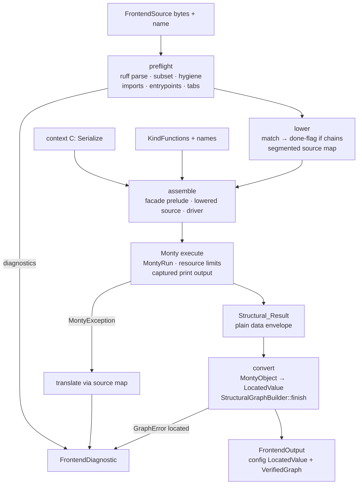

# Tkdp Frontend Design

## Overview

`tokeira-tkdp` implements `DefinitionFrontend` for Python-syntax `.tkdp` definitions by productizing
the pipeline validated in `spikes/monty-tkdp`: parse with Ruff, validate the restricted subset,
lower `match` statements by splicing, assemble a transient program around the operator's source, and
execute it with unmodified Monty. The frontend's whole output is the contract's completed transient
structure — a `LocatedValue` configuration and a `VerifiedGraph` — produced by converting the plain
data the sandbox returns. No Monty fork, no Monty types in any public signature, no runtime state
retained across evaluations.

Wire-shape and behaviour sources: the platform contract at the current tree
(`crates/tokeira-platform/src/{definition,author,graph,kind}.rs`), the sibling frontend
(`crates/tokeira-tkd/src/framework.rs`), the live Compose surface (`platforms/compose/definition.tkd`),
and Monty at the pinned revision (its capabilities and gaps were probed executable-first in the
spike and re-probed for this design).

## Dependencies and Non-Goals

- **Monty pin.** No crates.io Monty release contains in-sandbox `@dataclass` (`v0.0.19` is the
  latest tag and predates pydantic/monty#626), so per Requirement 8.2 the workspace takes the
  sanctioned fallback: `monty` and `monty-types` as git dependencies at the exact recorded
  revision (initially `69f8a613e4f42d2f4dc0e659c792569923531e4f`), with an explicit,
  operator-approved `deny.toml` sources exception scoped to the two crates. Switching to a
  crates.io release that contains dataclasses retires the exception; the capability probes gate
  that move like any pin bump.
- **Ruff crates** at the exact line Monty pins (`0.0.3`), so one parser family exists in the tree.
  `get-size2` is held at `0.10.1` in the lockfile (`0.10.3` targets `compact_str 0.10`; the ruff
  `0.0.3` line uses `0.9`).
- **Platform accommodations** (the two sanctioned by the requirements scope) are implemented in
  `tokeira-platform` as part of this feature and used by no other code path changes:
  enum-position struct admission in the `LocatedValue` deserializer, and the kind-name inventory.
- Non-goals: everything the requirements exclude, plus — no incremental or cached evaluation
  (every `evaluate` is complete and stateless), no operator-visible transient program, no Monty
  snapshot/resume usage (the program is self-contained; the host-function protocol is unused), and
  no `.tkd`-side changes.

## Architecture



Everything happens inside one `evaluate` invocation. The frontend performs no I/O: source bytes
arrive from the shell, context arrives as a value, kinds arrive as functions, and the only exit
paths are `FrontendOutput` or `FrontendDiagnostic`.

## Components and Interfaces

### Crate layout (`crates/tokeira-tkdp`)

```
src/
  lib.rs        crate docs, frontend() export
  frontend.rs   TkdpFrontend + DefinitionFrontend impl (the only public seam)
  preflight.rs  subset validation, hygiene, import contract, entrypoints (TKDP001–011)
  lower.rs      splice lowering, deterministic names, strict exhaustion
  source_map.rs segments, line tables, char-column translation (spike types, unchanged design)
  facade.rs     prelude synthesis from the kind inventory + import satisfaction
  program.rs    transient-program assembly (facade + lowered source + driver)
  runner.rs     Monty execution, limits, output capture, traceback translation
  convert.rs    Structural_Result → LocatedValue + StructuralGraphBuilder
```

`Cargo.toml` publishes the descriptor (`format = "tkdp"`, `source-extension = "tkdp"`,
`default-relative-path = "definition.tkdp"`) and the conventional export:

```rust
pub fn frontend() -> TkdpFrontend {
    TkdpFrontend::new()
}

impl DefinitionFrontend for TkdpFrontend {
    fn format(&self) -> &DefinitionFormatId;
    fn evaluate<C, K>(
        &self,
        source: FrontendSource<'_>,
        context: &C,
        kinds: KindFunctions<K>,
    ) -> Result<FrontendOutput<K>, FrontendDiagnostic>
    where
        C: Serialize,
        K: ProviderKind + 'static;
}
```

### Platform accommodation 1: kind-name inventory

`KindFunctions<K>` gains the enumerable names the facade binds (Requirement 2.9's prerequisite):

```rust
pub struct KindFunctions<K> {
    /// Complete author-visible kind names, the source of `contains` truth.
    pub names: &'static [&'static str],
    pub contains: fn(&str) -> bool,
    pub defaults: fn(&str) -> Option<LocatedValue>,
    pub decode: fn(&str, LocatedValue) -> Result<K, KindError>,
}
```

Each platform backs `names` and `contains` with one `const` slice; a platform test asserts
`contains(n)` for every listed name and the decode arm count matches. `tokeira-tkd` ignores
`names` (its resolution stays pull-based), so the addition is behaviour-neutral for `.tkd`.

### Platform accommodation 2: enum-position struct admission

`deserialize_enum` gains one arm: a `ValueShape::Struct { name, fields }` in enum position is
admitted as the variant tagged by `name` — unit variant when `fields` is empty, otherwise a
newtype-struct variant whose payload is the same fields. Existing `Enum` and `String` admissions
are unchanged; a struct in enum position whose name matches no variant fails with serde's
unknown-variant error carrying the struct's range. This is what makes the requirements' variant
spelling (one dataclass per variant) decode identically to the `.tkd` enum spelling, for config
fields and kind fields alike, with no variant registry anywhere.

### Preflight

The spike's preflight, extended with the import contract:

- `from tokeira import <names>` (with `as` aliases) is the only admitted `tokeira` import form;
  each imported name must be a facade builder name (`Deployment`, `Context`) or a member of
  `kinds.names`; `import tokeira` and `from tokeira import *` are rejected at the import's range
  (TKDP012).
- Entrypoint presence/arity, the restricted match table, reserved-prefix hygiene, tab rejection:
  unchanged from the spike (TKDP001–011), all findings collected in one pass.

### Facade synthesis and import satisfaction

`facade.rs` renders the prelude from `kinds.names` plus the serialized context — synthesis, never
a hand-written surface:

- **Builders**: `Deployment`, `Module`, `Resource` classes accumulating plain data (namespaces,
  modules with dependency names, resources as `(module, id, kind_name, kind_kwargs, dep_refs)`,
  writebacks), plus `Output` records from `resource.output(name)`. Handle misuse (foreign or
  reused handles, post-return mutation) raises in-sandbox with the facade's checks.
- **Kind constructors**: for each inventory name, a kwargs-capturing shell
  `class DsqlCluster(__TkdpKind)` that records `(kind_name, kwargs)` — no field knowledge in the
  facade; unknown-field and type errors surface at host-side decode with the invocation's range.
- **Context**: one class built from `serde_json::to_value(context)` — each top-level field a
  read-only attribute; nested values plain data. `deployment_dir`-like host facts never reach the
  serialized context by construction (the platform's context type owns that boundary).
- **Import satisfaction**: the lowering replaces the validated `from tokeira import …` statement
  with an equivalent-width comment line (keeping every subsequent byte offset unchanged, so the
  source map stays linear); the prelude defines the imported names before operator code runs.
  Aliases become prelude-level `alias = Name` bindings.

### Lowering and the transient program

Unchanged in design from the spike, with the strict-exhaustion raise always on: one subject
evaluation, flat done-flag chains, verbatim bodies/guards/subjects, deterministic
`__tokeira_internal_*` names, byte-covering segment map. The driver appended after the operator
source runs `config()`, admits nothing itself, then runs `deployment(cfg, Context())` and returns
the builder's accumulated envelope plus the config value as one plain structure:

```python
{"config": __tokeira_internal_cfg, "deployment": __tokeira_internal_result.__tkdp_envelope__()}
```

### Runner

`MontyRun::new(program, source_label, [], CompileOptions::default())`, executed with a
`ResourceTracker` configured from frontend constants (memory ceiling, stack depth, execution-time
budget — constants in v1, surfaced in rustdoc) and `PrintWriter::CollectString`. Captured print
output is attached to failure diagnostics and logged at trace level on success. Monty parse errors
and runtime tracebacks translate through the segment map exactly as in the spike: operator text
maps linearly (char-column correct), facade/driver frames render as named internal regions.

### Conversion (`convert.rs`)

The returned `MontyObject` envelope converts mechanically:

- scalars, strings, sequences, dicts → the corresponding `ValueShape`s;
- `MontyObject::Dataclass { name, field_names, values }` → `ValueShape::Struct` (always — the
  deserializer's enum-position arm supplies variant semantics when the decode target is an enum);
- kind kwargs → `Struct` merged over `kinds.defaults(kind_name)` (authored fields win), then
  `kinds.decode(kind_name, value)`; decode errors carry the resource declaration's range from the
  envelope's recorded call sites;
- the deployment envelope drives `StructuralGraphBuilder<K>` in declaration order;
  `finish()` findings map to the declaring construct's range.

**Value ranges:** lowering-time and runtime failures are fully mapped, but values inside the
returned envelope carry no ranges — Monty objects do not remember construction sites. The facade
therefore records one range per *builder call* (module/resource/writeback declarations and kind
constructions, captured at preflight from the AST) so structural and decode errors are located;
field-level config admission errors carry the config entrypoint's range plus serde's field path.
This is a documented v1 boundary of Requirement 5.4's "when one exists", and the parity and
semantics suites do not depend on finer granularity.

## Data Models

- `SourceMap` / `Segment` / `Origin` / `LineTable` — as validated in the spike (byte-covering,
  verbatim-linear, internal regions named).
- `StructuralEnvelope` (internal): the typed Rust decoding of the sandbox's returned plain data —
  config value, namespaces, modules, resources (with kind name, kwargs value, dependency
  references, declaration range index), writebacks. Never serialized, never public.
- `FacadeSurface` (internal): builder names + `kinds.names`, the import-validation set.
- Pin record: the Monty revision constant plus the capability-probe suite that must accompany any
  change to it.

## Correctness Properties

Property statements are universally quantified; each becomes a required test (property-based
unless noted).

1. **Preflight admission soundness.** For any definition built from admitted constructs, preflight
   accepts and evaluation reaches Monty execution. **Validates: Requirements 3.1, 2.1–2.6**
2. **Rejection completeness and location.** For any definition containing a rejected pattern form,
   reserved identifier, invalid import, tab indentation, or entrypoint violation, preflight
   rejects with a diagnostic whose range covers the offending construct, and all findings of the
   pass are reported. **Validates: Requirements 3.2–3.7, 2.4, 2.14**
3. **Lowering determinism.** Identical source bytes produce byte-identical transient programs.
   **Validates: Requirement 4.10**
4. **Dispatch semantics.** For any generated match table over variant/literal/guard cases and any
   subject, the lowered execution takes exactly the case a reference CPython-semantics evaluator
   takes, with single subject evaluation, capture-before-guard binding, binding persistence on
   guard failure, and no later-guard evaluation. **Validates: Requirements 4.1–4.7, 4.9**
5. **Strict exhaustion.** For any match whose cases all fail, execution fails naming the match's
   original position and the subject's rendering. **Validates: Requirement 4.8**
6. **Source-map totality and linearity.** Every byte of every transient program is covered by
   exactly one segment; positions in operator-derived segments translate linearly and
   char-column-correctly; facade/driver positions render as named internal regions and never as
   transient coordinates. **Validates: Requirements 5.1–5.3, 5.6**
7. **Evaluation purity and statelessness.** Repeated `evaluate` of the same inputs returns equal
   outputs; no filesystem, network, or environment access occurs (asserted by facade construction
   and Monty's sandbox — no host functions are registered). **Validates: Requirements 6.1, 6.4**
8. **Resource-limit failure.** For any definition exceeding a configured limit, evaluation fails
   with a diagnostic identifying the limit. **Validates: Requirement 6.5**
9. **Kind decode discipline.** Every kind construction routes through membership → defaults merge →
   decode; unknown kinds and fields fail with the constructing call's range. **Validates:
   Requirements 6.2, 2.7, 2.8**
10. **Facade totality.** Every name in `kinds.names` is importable and constructible; no other
    kind name is; the available set equals the assembled engine population. **Validates:
    Requirement 2.9**
11. **Variant-spelling equivalence.** For any enum-typed target and any variant instance spelled
    as a dataclass (zero-field or payload-carrying), decoding through the enum-position struct
    admission yields the value the `.tkd` enum spelling decodes to. **Validates: Requirements
    2.10, 2.11** *(implemented beside the deserializer in `tokeira-platform`)*
12. **Structural preservation.** Namespaces, modules, resources, dependencies, and writebacks
    reach the `VerifiedGraph` in declaration order with `finish()`'s invariants enforced and
    findings located. **Validates: Requirements 6.3, 6.7**
13. **Compose parity.** The Compose `.tkdp` and `.tkd` seeds, evaluated with equal contexts under
    both storage variants, produce equal typed configs, equal graphs, and equal realized
    manifests, with differing configuration identities. **Validates: Requirements 7.1–7.6**
    *(example-based integration, not PBT)*
14. **Capability probes.** The pinned Monty provides dataclass construction with defaults and
    keywords, unevaluated field annotations, `type()` identity, `getattr`/`hasattr`, and rejects
    native `match`; probe failure fails the suite. **Validates: Requirements 8.3–8.5**
    *(example-based)*

## Error Handling

| Condition | Internal | Operator-facing |
|---|---|---|
| non-UTF-8 source | preflight | `FrontendDiagnostic` (Frontend category), no range |
| syntax error | ruff parse error | diagnostic at parse location (TKDP001) |
| rejected construct | preflight finding | spanned diagnostic, TKDP002–012 code in message |
| Monty parse rejection of transient program | translated `MontyException` | mapped diagnostic; internal-region text names the facade/driver when applicable |
| runtime exception in operator code | translated traceback | mapped frames, original source excerpt |
| strict-exhaustion fall-through | in-program raise | mapped diagnostic naming match position + subject |
| resource limit exceeded | Monty resource error | diagnostic naming the limit |
| unknown kind / kind field / bad field type | `KindError` from decode | diagnostic at the constructing call's range |
| config admission failure | `ValueDecodeError` via `admit_config` | diagnostic with serde field path, config entrypoint range |
| graph invariant violation | `GraphError` from `finish()` | diagnostic at the declaring construct's range |
| handle misuse in sandbox | facade-raised exception | mapped traceback at the misusing call |

All paths produce `FrontendDiagnostic { format: tkdp, source_name, range?, category, message }`;
the shell's rendering is unchanged.

## Testing Strategy

- **Property-based tests** for Properties 1–12 live in `tokeira-tkdp` (Properties 11's deserializer
  half beside the arm in `tokeira-platform`), tagged
  `// Feature: tkdp-frontend, Property N`.
- **Example-based**: the spike's semantics corpus migrates as fixed cases (first-match, guard
  fall-through, binding persistence, break/return, nested match, field-missing); capability
  probes; error-rendering goldens.
- **Integration**: Property 13's parity suite evaluates both Compose seeds through
  `evaluate_definition`/`verify_definition`/`realize` with fixed invocation facts — no Docker, no
  credentials; identity inequality asserted.
- **Workspace bar**: everything runs under `cargo test --workspace --locked`; the spike crate is
  removed in the slice that lands the production frontend, its README findings absorbed into
  `tokeira-tkdp` rustdoc.
