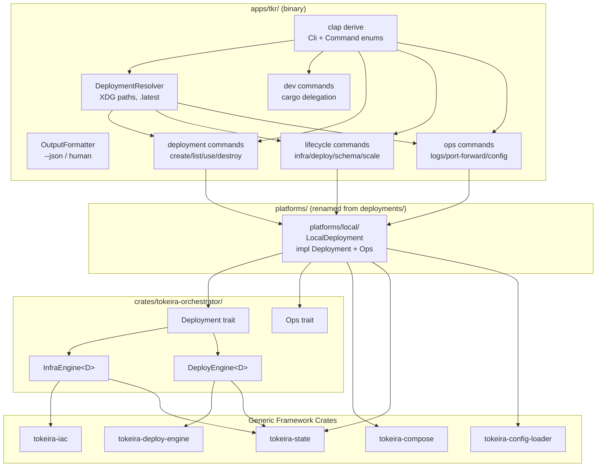

# Design Document: TKR CLI Redesign

## Overview

This design replaces the prototype `tkr` CLI in `apps/tkr/` with a lifecycle-staged CLI. The redesigned CLI introduces named deployment management under XDG-compliant paths, a `dev` command group for workspace tasks, and lifecycle-staged operator commands (`infra`, `deploy`, `schema`, `scale`) that delegate to the existing orchestrator framework.

The key architectural shift: the current CLI hardcodes `--deployment local` and loads config from a file path. The new CLI manages a directory of named deployments under `$XDG_STATE_HOME/tokeira/tkr/`, each containing its own `deployment.toml`, `tokeirad.toml`, `state/`, and platform artifacts. A `.latest` file tracks the active deployment so operators can omit `--deployment` in most commands.

The CLI binary remains thin — it parses arguments, resolves the deployment directory, loads config, and delegates to the orchestrator framework. Platform-specific behavior (local process spawning, compose container management) lives in the platform crates, not the CLI.

### Design Decisions

1. **Single binary, no library crate** — The CLI is `apps/tkr/` only. No `tokeira-cli` library crate. Helper functions (deployment directory management, output formatting) are private modules within the binary.

2. **`directories::ProjectDirs` for XDG paths** — Uses the `directories` crate with qualifier `""`, organization `"tokeira"`, application `"tkr"`. The state directory gives us platform-correct paths without manual `$XDG_STATE_HOME` parsing.

3. **Deployment directory is the unit of isolation** — Each deployment is a self-contained directory: `deployment.toml` + `tokeirad.toml` + `metadata.json` + `state/` + optional platform artifacts. No shared state between deployments.

4. **Prototypical configs owned by platform crates** — Each platform crate exposes `prototypical_config(storage)` for the platform-specific `deployment.toml` and `prototypical_server_config(storage)` for the server `tokeirad.toml`. The CLI dispatches to the platform — it never generates config itself.

5. **`deploy apply` blocking semantics for local** — For `platform = local`, `deploy apply` spawns tokeirad as a foreground child process using `tokio::process::Command`. The CLI blocks until the process exits or SIGINT is received. For `platform = compose`, `deploy apply` delegates to the orchestrator's `DeployEngine` and returns immediately.

6. **PID file for local process tracking** — `deploy status` on local platform checks a `tokeirad.pid` file in the deployment directory rather than scanning the process table.

7. **`metadata.json` alongside config files** — Deployment metadata (platform, storage, status, created_at) is stored separately from config so that config files remain clean TOML the operator can inspect.

8. **`--json` flag uses `serde_json`** — When `--json` is set, all output goes through `serde_json::to_string_pretty` on structured output types. Human-readable output is the default.

9. **`deployments/` → `platforms/` rename** — The repo directory `deployments/` is renamed to `platforms/` to avoid confusion with the runtime deployment concept.

## Architecture



### Dependency Hierarchy

```
Layer 0 (leaf):     tokeira-state, tokeira-config-loader, tokeira-server-config, directories, uuid
Layer 1 (engines):  tokeira-iac, tokeira-deploy-engine
Layer 2 (orch):     tokeira-orchestrator
Layer 3 (providers): tokeira-compose
Layer 4 (platform): platforms/local/ → tokeira-orchestrator + tokeira-server-config
Layer 5 (binary):   apps/tkr/ → all of the above + clap, directories, uuid, serde_json, tokio
Server binary:      apps/tokeirad/ → tokeira-server-config + runtime/edge crates
```

### Module Layout within `apps/tkr/`

```
apps/tkr/src/
├── main.rs              # Entry point, clap parse, dispatch
├── cli.rs               # Cli struct, Command enum, global flags
├── deployment_dir.rs    # DeploymentResolver: XDG paths, .latest, directory layout
├── metadata.rs          # DeploymentMetadata: platform, storage, status, created_at
├── prototypical.rs      # Dispatcher: calls platform's prototypical_config(storage) for deployment.toml and prototypical_server_config(storage) for tokeirad.toml
├── output.rs            # OutputFormatter: --json / human-readable
├── commands/
│   ├── dev.rs           # dev build/test/lint/fmt/check
│   ├── deployment.rs    # deployment create/list/use/destroy
│   ├── infra.rs         # infra plan/apply/destroy/status
│   ├── deploy.rs        # deploy plan/apply/status (local + compose)
│   ├── schema.rs        # schema setup/status
│   ├── scale.rs         # scale up/down/status
│   ├── logs.rs          # logs <service>
│   ├── port_forward.rs  # port-forward <service>
│   ├── config.rs        # config show
│   └── version.rs       # version
└── process.rs           # Local platform: spawn tokeirad, PID file, signal forwarding
```

## Components and Interfaces

### Cli Struct (clap derive)

```rust
#[derive(clap::Parser)]
#[command(name = "tkr", version, about = "Tokeira deployment CLI")]
pub struct Cli {
    /// Target deployment name. Resolved from .latest when omitted.
    #[arg(long, global = true)]
    deployment: Option<String>,

    /// Output structured JSON instead of human-readable text.
    #[arg(long, global = true)]
    json: bool,

    #[command(subcommand)]
    command: Command,
}

#[derive(clap::Subcommand)]
pub enum Command {
    Dev {
        #[command(subcommand)]
        action: DevAction,
    },
    Deployment {
        #[command(subcommand)]
        action: DeploymentAction,
    },
    Infra {
        #[command(subcommand)]
        action: InfraAction,
    },
    Deploy {
        #[command(subcommand)]
        action: DeployAction,
    },
    Schema {
        #[command(subcommand)]
        action: SchemaAction,
    },
    Scale {
        #[command(subcommand)]
        action: ScaleAction,
    },
    Logs {
        service: String,
        #[arg(long)]
        follow: bool,
        #[arg(long)]
        tail: Option<u32>,
    },
    PortForward {
        service: String,
    },
    Config {
        #[command(subcommand)]
        action: ConfigAction,
    },
    Version,
}
```

### DevAction

```rust
#[derive(clap::Subcommand)]
pub enum DevAction {
    Build,
    Test {
        #[arg(long)]
        crate_name: Option<String>,
    },
    Lint,
    Fmt,
    Check,
}
```

Each dev command spawns a cargo child process via `std::process::Command`, inherits stdio, and exits with the child's exit code. No deployment context needed.

### DeploymentAction

```rust
#[derive(clap::Subcommand)]
pub enum DeploymentAction {
    Create {
        #[arg(long)]
        platform: CliPlatformKind,
        #[arg(long)]
        storage: CliStorageKind,
        #[arg(long)]
        name: Option<String>,
    },
    List,
    Use { name: String },
    Destroy {
        #[arg(long)]
        yes: bool,
    },
}

// CLI-local wrappers with clap::ValueEnum derive.
// The orchestrator enums stay clean without a clap dependency.
#[derive(clap::ValueEnum, Clone, Debug)]
pub enum CliPlatformKind { Local, Compose, Ecs }

#[derive(clap::ValueEnum, Clone, Debug)]
pub enum CliStorageKind { InMemory, Dsql }

impl From<CliPlatformKind> for tokeira_orchestrator::PlatformKind {
    fn from(cli: CliPlatformKind) -> Self {
        match cli {
            CliPlatformKind::Local => Self::Local,
            CliPlatformKind::Compose => Self::Compose,
            CliPlatformKind::Ecs => Self::Ecs,
        }
    }
}

impl From<CliStorageKind> for tokeira_orchestrator::StorageKind {
    fn from(cli: CliStorageKind) -> Self {
        match cli {
            CliStorageKind::InMemory => Self::InMemory,
            CliStorageKind::Dsql => Self::Dsql,
        }
    }
}
```

### DeploymentResolver

Handles XDG path resolution, `.latest` file management, and deployment directory operations.

```rust
pub struct DeploymentResolver {
    root: PathBuf,  // e.g. ~/.local/state/tokeira/tkr/
}

impl DeploymentResolver {
    /// Create from `directories::ProjectDirs`.
    pub fn new() -> anyhow::Result<Self>;

    /// Resolve the deployment name: explicit flag > .latest file > error.
    pub fn resolve_name(&self, explicit: Option<&str>) -> anyhow::Result<String>;

    /// Return the path to a deployment directory.
    pub fn deployment_dir(&self, name: &str) -> PathBuf;

    /// Read the .latest file.
    pub fn read_latest(&self) -> anyhow::Result<Option<String>>;

    /// Write the .latest file.
    pub fn write_latest(&self, name: &str) -> anyhow::Result<()>;

    /// Clear the .latest file.
    pub fn clear_latest(&self) -> anyhow::Result<()>;

    /// List all deployment directories.
    pub fn list_deployments(&self) -> anyhow::Result<Vec<String>>;

    /// Create a new deployment directory with deployment.toml, tokeirad.toml, metadata.json, state/.
    pub fn create_deployment(
        &self,
        name: &str,
        platform: PlatformKind,
        storage: StorageKind,
    ) -> anyhow::Result<PathBuf>;

    /// Remove a deployment directory.
    pub fn remove_deployment(&self, name: &str) -> anyhow::Result<()>;
}
```

### DeploymentMetadata

```rust
#[derive(Debug, Clone, Serialize, Deserialize)]
pub struct DeploymentMetadata {
    pub platform: PlatformKind,
    pub storage: StorageKind,
    pub status: DeploymentStatus,
    pub created_at: String,  // ISO 8601
}

#[derive(Debug, Clone, Serialize, Deserialize, PartialEq)]
pub enum DeploymentStatus {
    Created,
    Running,
    Stopped,
}
```

Stored as `metadata.json` in each deployment directory. Read/written via `serde_json`.

### Prototypical Config Templates

Each platform crate owns its config type AND its prototypical template. The CLI never generates config itself — it calls the platform to get the template.

```rust
/// Defined in tokeira-orchestrator. Implemented by each platform crate.
pub trait PlatformConfig {
    /// Generate a prototypical deployment config TOML for the given storage backend.
    /// The returned TOML MUST deserialize into the platform's config type.
    /// This generates `deployment.toml`.
    fn prototypical_config(storage: StorageKind) -> String;

    /// Generate a prototypical server runtime config TOML for the given storage backend.
    /// The returned TOML MUST deserialize into `TokeiraConfig` (from `tokeira-server-config`).
    /// This generates `tokeirad.toml`.
    fn prototypical_server_config(storage: StorageKind) -> String;
}
```

| Combination | Platform Crate | Config Type | `deployment.toml` Contents | `tokeirad.toml` Contents |
|---|---|---|---|---|
| `local/in-memory` | `platforms/local/` | `LocalConfig` | Process config, state_dir | Default `TokeiraConfig` (in-memory, localhost addrs) |
| `local/dsql` | `platforms/local/` | `LocalConfig` | Process config, state_dir | `TokeiraConfig` with DSQL endpoint placeholder |
| `compose/in-memory` | `platforms/local/` | `LocalConfig` | Compose stack, replicas: 1 per service | Default `TokeiraConfig` (in-memory, container addrs) |
| `compose/dsql` | `platforms/local/` | `LocalConfig` | Compose stack, replicas: 1 per service | `TokeiraConfig` with DSQL endpoint placeholder |
| `ecs/dsql` | `platforms/ecs/` (future) | `EcsConfig` | ECS task defs, service discovery | `TokeiraConfig` with DSQL endpoint placeholder |

Both templates MUST round-trip through their respective types: `deployment.toml` through the platform's config type, `tokeirad.toml` through `TokeiraConfig` from `tokeira-server-config`. Enforced by unit tests in each platform crate.

### OutputFormatter

```rust
pub struct OutputFormatter {
    json: bool,
}

impl OutputFormatter {
    pub fn print<T: Serialize + std::fmt::Display>(&self, value: &T);
    pub fn print_table(&self, headers: &[&str], rows: &[Vec<String>]);
    pub fn print_error(&self, error: &anyhow::Error);
}
```

When `--json` is set, `print` serializes to JSON. Otherwise, it uses the `Display` impl. `print_table` renders a simple aligned text table or a JSON array of objects.

### Local Platform Process Management

```rust
/// Spawn tokeirad as a blocking foreground process.
pub async fn spawn_tokeirad(
    deployment_dir: &Path,
    config: &LocalConfig,
) -> anyhow::Result<ExitStatus>;

/// Write the PID of the running tokeirad process.
pub fn write_pid_file(deployment_dir: &Path, pid: u32) -> anyhow::Result<()>;

/// Read the PID file and check if the process is still running.
pub fn check_pid_file(deployment_dir: &Path) -> anyhow::Result<Option<u32>>;

/// Remove the PID file.
pub fn remove_pid_file(deployment_dir: &Path) -> anyhow::Result<()>;
```

`spawn_tokeirad` uses `tokio::process::Command` with inherited stdio. It installs a `tokio::signal::ctrl_c` handler that forwards SIGINT to the child process via `libc::kill`.

### Lifecycle Command Flow

For `infra`, `deploy`, `schema`, and `scale` commands, the flow is:

1. Resolve deployment name via `DeploymentResolver`
2. Load `metadata.json` to determine platform and storage
3. Load `deployment.toml` via `toml::from_str` into the platform's config type (e.g., `LocalConfig`)
4. Load `tokeirad.toml` via `toml::from_str` into `TokeiraConfig`
5. Construct the appropriate `Deployment` impl
6. Delegate to `InfraEngine`, `DeployEngine`, or `Ops` trait methods
7. Format output via `OutputFormatter`

For `deploy apply` on local platform, step 6 is replaced by `spawn_tokeirad`.

### Deployment Name Normalization

```rust
pub fn normalize_name(input: &str) -> String {
    input.to_lowercase().replace(' ', "-")
}
```

Applied during `deployment create`. If `--name` is omitted, `uuid::Uuid::new_v4().to_string()` is used.

## Data Models

### Deployment Directory Layout

```
{Deployments_Root}/
├── .latest                    # Contains name of latest deployment
├── my-deployment/
│   ├── deployment.toml        # Platform/orchestrator config (LocalConfig, etc.)
│   ├── tokeirad.toml          # Server runtime config (TokeiraConfig schema)
│   ├── metadata.json          # { platform, storage, status, created_at }
│   ├── state/                 # Infrastructure and deployment state (LocalBackend)
│   │   ├── infra/
│   │   └── deploy/
│   ├── tokeirad.pid           # PID file (local platform only)
│   └── docker-compose.yml     # Generated compose file (compose platform only)
└── another-deployment/
    ├── deployment.toml
    ├── tokeirad.toml
    ├── metadata.json
    └── state/
```

### metadata.json

```json
{
  "platform": "compose",
  "storage": "in-memory",
  "status": "created",
  "created_at": "2025-01-15T10:30:00Z"
}
```

### .latest

Plain text file containing a single deployment name:

```
my-deployment
```

### Platform × Storage Validation Matrix

| Platform | Storage | Valid | Notes |
|---|---|---|---|
| local | in-memory | ✓ | Simplest path — no infra, no schema |
| local | dsql | ✓ | Requires DSQL cluster provisioning |
| compose | in-memory | ✓ | Full observability stack |
| compose | dsql | ✓ | Full stack + DSQL |
| ecs | in-memory | ✗ | ECS requires DSQL |
| ecs | dsql | ✓ | Future — full AWS deployment |

### PortMapping (shared data model)

Lives in `tokeira-orchestrator` alongside `PortForwardTarget` (which it replaces for the port-forward command):

```rust
/// A single host→container port mapping for a running service.
#[derive(Debug, Clone, PartialEq, Eq, Serialize, Deserialize)]
pub struct PortMapping {
    pub host_addr: String,      // e.g., "127.0.0.1"
    pub host_port: u16,
    pub container_port: u16,
    pub protocol: String,       // "tcp" or "udp"
}
```

The `Ops` trait's `port_mappings(service, config) -> Vec<PortMapping>` returns all mappings for a service. The CLI prints them as a table.


## Correctness Properties

*A property is a characteristic or behavior that should hold true across all valid executions of a system — essentially, a formal statement about what the system should do. Properties serve as the bridge between human-readable specifications and machine-verifiable correctness guarantees.*

### Property 1: Deployment create round-trip — directory exists and .latest updated

*For any* valid deployment name and valid platform × storage combination, after `deployment create`, the deployment directory SHALL exist at `{Deployments_Root}/{normalized_name}/` containing `deployment.toml`, `tokeirad.toml`, `metadata.json`, and `state/`, and `resolve_name(None)` SHALL return the normalized name.

**Validates: Requirements 1.3.1, 1.4.1, 1.4.2, 1.4.4, 1.5.1, 3.1.3**

### Property 2: Deployment name normalization

*For any* input string, `normalize_name` SHALL produce a string that is entirely lowercase and contains no space characters, and the result SHALL be deterministic (calling it twice on the same input produces the same output).

**Validates: Requirements 1.5.3**

### Property 3: Duplicate deployment name rejection

*For any* valid deployment name and valid platform × storage combination, creating a deployment and then attempting to create another deployment with the same normalized name SHALL return an error.

**Validates: Requirements 1.5.4**

### Property 4: Deployment destroy removes directory and clears .latest

*For any* valid deployment name, after `deployment create` followed by `deployment destroy`, the deployment directory SHALL no longer exist, and if the destroyed deployment was the latest, the `.latest` file SHALL be empty or absent.

**Validates: Requirements 3.5.3, 3.5.4**

### Property 5: Non-existent deployment error lists available deployments

*For any* set of existing deployment names and any name not in that set, attempting to resolve or use the non-existent name SHALL return an error whose message contains every existing deployment name.

**Validates: Requirements 1.4.5, 3.4.2, 9.2.2**

### Property 6: Schema commands reject non-DSQL storage

*For any* deployment with storage other than `dsql`, invoking `schema setup` or `schema status` SHALL return an error indicating that schema management is only available for DSQL deployments.

**Validates: Requirements 7.1.3, 7.2.2**

### Property 7: Invalid service name error lists valid alternatives

*For any* string that is not a valid service name, commands that accept a service name (`logs`, `port-forward`, `scale up`) SHALL return an error whose message contains every valid service name.

**Validates: Requirements 8.1.3, 8.4.3, 8.5.2**

### Property 8: Deployment metadata round-trip

*For any* valid `DeploymentMetadata` value (arbitrary platform, storage, status, and ISO 8601 timestamp), serializing to JSON and deserializing back SHALL produce an equal value.

**Validates: Requirements 9.1.1**

### Property 9: Dev test command construction with --crate

*For any* non-empty crate name string, the dev test command with `--crate <name>` SHALL construct a command line containing `cargo test -p <name>` where `<name>` is the exact crate name provided.

**Validates: Requirements 2.2.2**

## Error Handling

### Strategy

- **CLI binary**: `anyhow::Result` throughout. Errors bubble up to `main()` which formats them via `OutputFormatter`.
- **Library code in platform crates**: `thiserror` for typed errors (`OrchestratorError`, `ComposeError`, `IacError`, `StateError`).
- **Error messages**: Include what went wrong, why, and what to do next. When a deployment is not found, list available deployments. When a service is invalid, list valid services. When an external tool is missing, suggest installation.

### Error Categories

| Category | Example | Handling |
|---|---|---|
| Deployment not found | `--deployment foo` but `foo/` doesn't exist | List available deployments, suggest `deployment create` |
| .latest missing/stale | No `.latest` or references deleted deployment | Instruct operator to use `--deployment` or `deployment create` |
| Invalid platform × storage | `ecs + in-memory` | Reject at `deployment create` with explanation |
| Missing external tool | Docker not running for compose | Detect via `which` or connection attempt, print installation guidance |
| Confirmation required | `infra apply` without `--yes` | Print what would happen, ask for `--yes` |
| Orchestrator errors | InfraEngine or DeployEngine failures | Propagate with context via `anyhow::Context` |
| Config parse errors | Malformed `deployment.toml` or `tokeirad.toml` | Print file path and parse error |

### Signal Handling

For `deploy apply` on local platform:
1. Install `tokio::signal::ctrl_c` handler before spawning tokeirad
2. On SIGINT, forward signal to child process via `libc::kill(pid, libc::SIGINT)`
3. Wait for child to exit with a timeout
4. If child doesn't exit within 5 seconds, send SIGTERM
5. Update metadata status to `stopped`
6. Remove PID file

## Testing Strategy

### Unit Tests

Unit tests cover the pure logic within the CLI binary:

- **Clap parsing**: Verify all subcommands, flags, and argument combinations parse correctly. One test per subcommand group.
- **Name normalization**: Verify lowercase conversion and space-to-hyphen replacement.
- **Prototypical config generation**: Verify each platform × storage template produces valid TOML that deserializes into the expected config type.
- **Output formatting**: Verify JSON mode produces valid JSON, human mode produces readable text.
- **Deployment directory operations**: Using `tempfile::TempDir`, verify create/list/use/destroy operations on the filesystem.
- **Metadata serialization**: Verify round-trip through `serde_json`.
- **Command construction**: Verify dev commands produce correct cargo command lines.

### Property-Based Tests

Property-based tests use `proptest` (already used in `tokeira-compose` and `platforms/local/`). Each property test runs a minimum of 100 iterations.

| Property | Generator | Assertion |
|---|---|---|
| P1: Create round-trip | Random names + valid platform × storage | Directory exists, .latest correct |
| P2: Name normalization | Random strings with mixed case and spaces | Result is lowercase, no spaces |
| P3: Duplicate rejection | Random names | Second create returns error |
| P4: Destroy cleanup | Random names | Directory gone, .latest cleared |
| P5: Non-existent error | Random name sets + one outsider | Error contains all existing names |
| P6: Schema rejects non-DSQL | Random non-dsql storage | Error returned |
| P7: Invalid service error | Random invalid service names | Error lists valid services |
| P8: Metadata round-trip | Random metadata values | Serialize/deserialize equality |
| P9: Dev test --crate | Random crate names | Command contains `-p <name>` |

Each test is tagged with: `Feature: tkr-cli, Property {N}: {title}`

### Integration Tests

Integration tests require Docker (for compose platform) and are gated behind a feature flag or `#[ignore]` attribute:

- **Infra plan/apply/destroy** with compose platform against a real Docker daemon
- **Deploy apply** for local platform (spawn a test binary instead of tokeirad)
- **Deploy apply** for compose platform via bollard
- **Logs/port-forward/scale** against running compose containers
- **Full lifecycle**: `deployment create` → `infra apply` → `deploy apply` → `scale up` → `scale down` → `deployment destroy`

### Test Configuration

```toml
# In apps/tkr/Cargo.toml
[dev-dependencies]
proptest = "1"
tempfile.workspace = true
tokio = { workspace = true, features = ["macros", "rt-multi-thread"] }
serde_json.workspace = true
```

Property test configuration:
```rust
proptest! {
    #![proptest_config(ProptestConfig::with_cases(100))]
    // ...
}
```
