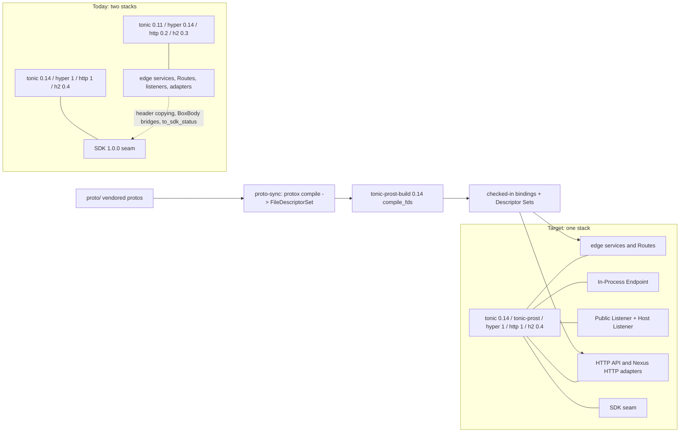

# Tonic 0.14 gRPC Stack — Design

## Overview

The design replaces the Legacy Stack with the Target Stack in five places and proves that
nothing observable moved. The five places are the Codegen Tool and the Generated Bindings,
the edge's gRPC services and In-Process Endpoint, the engine's two listeners and its SDK
seam, the two Transport Adapters, and the clients and test transports. The proof is a
Golden harness captured on the Legacy Stack first, the existing transport-neutral engine
tests, the SDK probes, and the functional conformance corpus.

Library facts below come from the pinned registry sources: tonic 0.14.6
(`src/transport/server/mod.rs`, `src/service/router.rs`, `src/body.rs`, `src/codegen.rs`),
tonic-prost-build 0.14.6 (`src/lib.rs`), tonic-prost 0.14.6, prost-build 0.14.4
(`src/config.rs`), prost-reflect 0.16.4, protox 0.9.1, and the sparse index entries for
tonic-web and tonic-reflection 0.14.6.

## Dependencies and Non-Goals

- Depends on nothing unmerged. The Connector Exception (Requirement 1.3) is owned by the
  DSQL connector slice; this design encodes the exception in the lock-invariant test and
  removes it when that slice lands.
- Non-goal: any RPC behaviour change. The edge's validation, defaulting, and error mapping
  are not touched; only the types they are expressed in move.
- Non-goal: touching the connect-rust surfaces. The controller, compatibility, and
  conformance-control bindings are already on hyper 1 and keep their generators; the
  workspace's two connect-rust lines (0.6 and 0.8) and the available 0.9 line are a
  separate unification slice with no bearing on the h2 0.3 edge.
- Non-goal: TLS on the Public Listener, keepalive tuning, or any new server setting. The
  one setting that becomes explicit (the 4 MiB decode limit) keeps its value.

## Architecture



The control path is unchanged: a request enters through a listener or the In-Process
Endpoint, passes the tower layers and the edge's interceptors, and reaches the same
service implementations. Only the HTTP types those layers are written against change.

## Components and Interfaces

### 1. Codegen Tool (`tools/proto-sync`)

- `Cargo.toml`: replace `tonic-build = "0.11"` with `tonic-prost-build = "0.14"` and add
  `protox = "0.9"` and `prost = "0.14"` (for encoding the descriptor set);
  `connectrpc-build` stays at 0.6.
- `generate.rs`: each of the three tonic passes becomes

  ```rust
  let fds = protox::compile(&protos, &includes)?;              // no protoc
  fs::write(&descriptor_path, fds.encode_to_vec())?;           // Requirement 2.2
  tonic_prost_build::configure()
      .build_client(...)
      .build_server(...)
      .btree_map(["."])
      .out_dir(&out)
      .extern_path(...)                                        // compute pass only
      .compile_fds(fds)?;
  ```

  The internal-package guard (no `temporal.*` file may appear in the Tokeira output) and
  the connect-rust pass are unchanged.
- The tool's `check` mode, if absent, is added as "regenerate into a temporary directory
  and diff against the checked-in tree", so Requirement 2.4 is a command rather than a
  convention.

### 2. Proto crate (`crates/tokeira-proto`)

- Dependencies: `prost = "0.14"`, `prost-types = "0.14"`, `tonic = "0.14"`,
  `tonic-prost = "0.14"`. The generated stubs reference `tonic_prost::ProstCodec` through
  the generator's output; the crate re-exports nothing new.
- `conversions` and the hand-written helpers compile against prost 0.14; the `Message`
  trait, `encode_to_vec`, and `decode` keep their names.
- A `tests/binding_inventory.rs` test derives the Binding Inventory from the checked-in
  Descriptor Sets and compares it with the fixture captured on the Legacy Stack
  (Property 8).

### 3. Edge gRPC services and interceptors (`crates/tokeira-edge`)

- Service constructors (`into_service` in `grpc/{workflow,operator,admin}_service.rs`) keep
  `accept_compressed(Gzip)` and `send_compressed(Gzip)` and add
  `max_decoding_message_size(4 * 1024 * 1024)`, the Legacy Stack's default made explicit.
- `grpc/errors.rs` keeps `Status::with_details_and_metadata`; the API is unchanged in
  0.14.
- The wire-coverage layer (`conformance/layer.rs`) is retyped from
  `Request<hyper::Body>`/`Response<BoxBody>` to `http::Request<tonic::body::Body>`/
  `http::Response<tonic::body::Body>`. tonic 0.14 has no `BoxBody` alias; `Body::new`
  wraps any `http_body::Body`.
- `Routes` moves from `tonic::transport::server::Routes` to `tonic::service::Routes`
  (`Routes::new(svc)`, `add_service`, `into_axum_router`); construction in
  `in_process.rs` is otherwise the same.

### 4. In-Process Endpoint (`crates/tokeira-edge/src/in_process.rs`)

- Request: `http::Request::builder().method(POST).uri(format!("/{service}/{rpc}"))`
  `.version(Version::HTTP_2)` with `content-type: application/grpc` and `te: trailers`,
  body `tonic::body::Body::new(Full::new(frame))`. The caller's `http::HeaderMap` is
  inserted directly; `copy_request_headers` is deleted.
- Response: `http_body_util::BodyExt::collect(body).await` yields a `Collected` with
  `to_bytes()` and `trailers()`; the grpc status is read from trailers first and headers
  second (trailers-only responses), exactly as today; `copy_response_headers` becomes a
  filter over one `HeaderMap` that withholds the four gRPC keys (Requirement 4.3).
- Admission, drain, `AbortOnDropHandler`, `parse_unary_frame`, and method-name validation
  are untouched.

### 5. Engine listeners and SDK seam (`crates/tokeira-engine`)

- Public Listener (`lib.rs`): `Server::builder().accept_http1(true)`, the same layer
  order, `add_service` for the three services, reflection built with
  `tonic_reflection::server::Builder::configure()`
  `.register_encoded_file_descriptor_set(...)` and served twice, `build_v1()` and
  `build_v1alpha()`, then `serve_with_incoming_shutdown`. The two builder copies (with
  and without `WireCoverageLayer`) remain because the layer changes the tower stack type.
- Host Listener (`listener.rs`): `Server::builder().layer(ResetOnStopLayer)`
  `.add_routes(routes).add_service(reflection_v1).add_service(reflection_v1alpha)`;
  `ResetOnStop` is retyped to `http::Request<tonic::body::Body>` and
  `http::Response<tonic::body::Body>`, its UNAVAILABLE reset unchanged.
- Transport Adapters (`http_api_transport.rs`, `nexus_http_transport.rs`): the layers take
  `http::Request<tonic::body::Body>`, collect bounded bodies with
  `http_body_util::Limited` plus `BodyExt::collect`, and answer with
  `http::Response<tonic::body::Body>`; `TcpConnectInfo` stays in
  `tonic::transport::server`. The bounds are the existing constants.
- SDK seam: `service_override` builds the callback transport from the edge's `Status`
  directly; `to_sdk_status` and the `tonic-sdk` alias are deleted.

### 6. Clients and test transports

- `crates/tokeira-controller/src/service.rs` (`tonic::Status`), `apps/tokeirad`, the bench,
  and `crates/tokeira-engine/tests/listener_support/mod.rs` move to tonic 0.14;
  `tonic::codec::ProstCodec` becomes `tonic_prost::ProstCodec`;
  `tonic::transport::Channel::from_shared` and `Grpc::unary` keep their shapes.

### 7. Manifests and policy

- Workspace pins move as in the Dependency Policy table; `hyper-legacy`,
  `http-body-legacy`, and `tonic-sdk` are deleted; `prost-reflect` moves to 0.16.
- `deny.toml`: the RUSTSEC-2026-0258 rationale narrows to the AWS legacy client while the
  Connector Exception applies, then the entry goes (Requirement 1.6).
- The lock-invariant test (Property 1) lives next to the existing architecture tests in
  `crates/tokeira-engine/tests/embedded_architecture.rs`, parsing `Cargo.lock` from the
  workspace root.

### 8. Golden harness (`crates/tokeira-engine/tests/wire_parity.rs`)

- Fixtures under `crates/tokeira-engine/tests/fixtures/wire-parity/`:
  `status-catalogue.json`, `decode-limit.json`, `compression.json`, `reflection.json`,
  `grpc-web.json`; the Binding Inventory under
  `crates/tokeira-proto/tests/fixtures/binding-inventory.json`.
- Capture mode: with `WIRE_PARITY_CAPTURE=1` the tests write the fixtures instead of
  comparing; the capture commit lands before any dependency moves (tasks 1.x), so the
  fixtures are the Legacy Stack's answers.
- Probes run over the In-Process Endpoint and over a Host Listener and compare both to
  the fixture.

## Data Models

- Status catalogue entry: `{ "case": <name>, "code": <i32>, "message": <string>,
  "details_base64": <string>, "metadata": [[<key>, <value_base64>], ...] }` per fixed
  edge error value, per transport.
- Decode-limit entry: `{ "size": <bytes>, "code": <i32>, "message": <string> }` for the
  three boundary sizes.
- Compression entry: `{ "request_encoding": <string|null>, "accept_encoding": <string|null>,
  "response_encoding": <string|null>, "code": <i32> }`.
- Reflection entry: sorted list of service full names per protocol version.
- gRPC-Web entry: `{ "case": <name>, "content_type": <string>, "response_base64": <string>,
  "grpc_status": <i32> }`.
- Binding Inventory: sorted lists of `{ "service", "method", "input", "output",
  "client_streaming", "server_streaming" }`, message full names, enum full names with
  values, and `{ "message", "field", "number", "type", "label" }` rows, derived from the
  Descriptor Sets by prost-reflect.

## Correctness Properties

### Property 1: One stack in the lock

*For any* workspace lock produced by this feature, each of `tonic`, `prost`, `prost-types`,
`http`, `http-body`, `hyper-util`, and `tower-http` SHALL appear at exactly one version on
the Target Stack line, none of the Legacy Stack versions in Requirement 1.2 SHALL appear,
and `hyper 0.14`, `h2 0.3`, `hyper-rustls 0.24`, and `rustls 0.21` SHALL appear only while
`aurora-dsql-sqlx-connector` is below 0.2.

**Validates: Requirements 1.1, 1.2, 1.3**

### Property 2: Status parity across transports

*For any* edge error value (generated over the error enums that reach
`grpc/errors.rs`), the status returned over the In-Process Endpoint and over a Host
Listener SHALL have equal code, message, `grpc-status-details-bin` bytes, and metadata,
and for the fixed catalogue SHALL equal the Golden.

**Validates: Requirements 4.5, 6.2, 6.3**

### Property 3: In-process header fidelity

*For any* valid request header map (generated names and values) and any response
header and trailer map the service emits, the request headers SHALL reach the interceptor
unchanged and the response headers SHALL return unchanged except for the four gRPC keys,
which SHALL be withheld.

**Validates: Requirements 4.2, 4.3**

### Property 4: Unary framing parity

*For any* payload of 0 to 1 MiB bytes, the bytes the In-Process Endpoint returns SHALL
equal the bytes a Host Listener returns for the same call, and the frame parser SHALL
reject any frame whose length prefix disagrees with its body.

**Validates: Requirements 4.4, 6.3**

### Property 5: Decode-limit boundary

*For any* request message of size at most 4 MiB the three services SHALL accept the
message, and *for any* larger message SHALL reject it with the Golden's status code and
message; the three boundary sizes SHALL match the Golden exactly.

**Validates: Requirements 3.4, 6.3**

### Property 6: Compression negotiation

*For any* combination of request encoding (identity, gzip) and accepted response
encodings (none, gzip), the response encoding and status SHALL equal the Golden.

**Validates: Requirements 3.3, 6.3**

### Property 7: Reflection inventory

*For any* service in the Descriptor Sets, both reflection protocols SHALL list it, and the
`v1alpha` listing SHALL equal the Golden while the `v1` listing SHALL equal the Golden plus
the `v1` reflection service.

**Validates: Requirements 3.5, 6.3**

### Property 8: Binding Inventory parity

*For any* entry in the Legacy Stack's Binding Inventory fixture, the regenerated
Descriptor Sets SHALL contain an equal entry, and SHALL contain no entry absent from the
fixture.

**Validates: Requirements 2.3, 2.6**

### Property 9: Adapter bounds

*For any* HTTP API or Nexus HTTP request body of size at most its bound, the adapter SHALL
process it, and *for any* larger body SHALL reject it with the same rendered error as
today; the boundary sizes SHALL match the Golden.

**Validates: Requirements 5.1, 5.2**

### Property 10: Cancellation and reset

*For any* parked long poll, dropping the caller's future SHALL cancel the handler through
abort-on-drop, and stopping a Host Listener SHALL reset every in-flight call with
`UNAVAILABLE`.

**Validates: Requirements 4.1, 4.4**

### Property 11: gRPC-Web parity

*For any* unary request sent as `application/grpc-web+proto`, the decoded response and
status SHALL equal the native gRPC response and the Golden.

**Validates: Requirements 3.2, 3.6**

### Property 12: Regeneration is reproducible

*For any* clean checkout at the feature's head, running the Codegen Tool SHALL leave the
tree unchanged.

**Validates: Requirements 2.1, 2.2, 2.4**

## Error Handling

| Condition | Where | Outcome |
|---|---|---|
| `protox` cannot parse or resolve a proto | Codegen Tool | tool exits non-zero with protox's file and line diagnostic; no partial output is written |
| Regenerated tree differs from the checked-in tree | Codegen Tool `check`, bar | non-zero exit naming the differing files |
| Legacy version present in `Cargo.lock` | Property 1 test | test failure naming the package, version, and (for the Connector Exception) the connector pin that would have permitted it |
| Golden mismatch | wire-parity tests | test failure printing the fixture and observed entries side by side |
| Request message over the decode limit | edge services | the Golden's status, unchanged from the Legacy Stack |
| Adapter body over its bound | Transport Adapters | the existing rendered error, unchanged |
| Listener stop with calls in flight | Host Listener | `UNAVAILABLE` reset, unchanged |

## Testing Strategy

- Property tests (Properties 1 to 12) in the crates named above, tagged
  `// Feature: tonic-0-14-grpc-stack, Property N: <name>`.
- Example-based Goldens captured on the Legacy Stack in a commit that precedes every
  dependency move, then asserted after the migration; the capture and the comparison are
  the same test in two modes.
- Existing suites as regression gates: the listener suite (`embedded_listener*.rs`), the
  edge gRPC tests, the compatibility crate's coverage tests over the generated wire paths,
  the HTTP API and Nexus HTTP tests.
- The functional conformance corpus rerun on the operator host for every tier recorded
  CLEAN, the SDK 1.0.0 probes over both transports, and the bench, recorded in the
  readiness ledger.
- The §10.4 bar with the doc build, since the generated bindings carry rustdoc.
