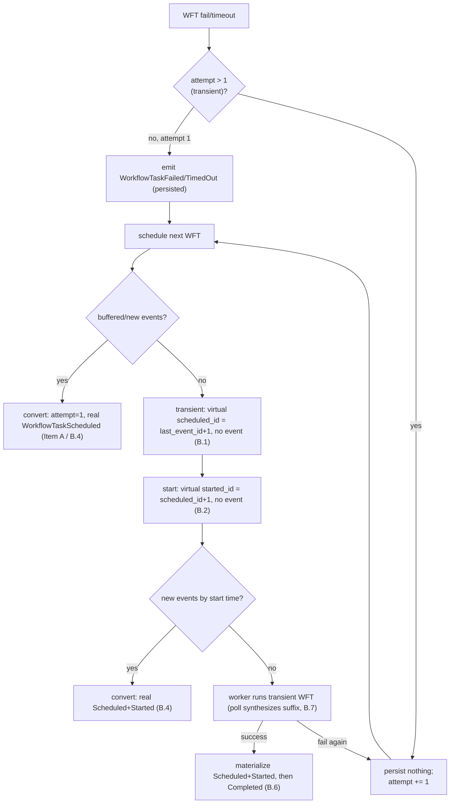

# Design Document: Transient Workflow-Task Model (Kernel + Runtime + Edge)

## Overview

This feature adopts Temporal's **transient workflow-task model** into `tokeira-kernel` and the derived
runtime/edge paths. A continuously-failing workflow task (`attempt > 1`) becomes *transient*: its
Scheduled/Started/Failed events are not persisted (virtual ids beyond `last_event_id`), and they
materialize into history only on successful completion or when new events convert the task back to a
normal attempt-1 task.

Requirements: [requirements.md](./requirements.md). **Requirement 0 accepted (2026-07-03, owner)** — this
amends the Feature-2 (`kernel-wft-failure-timeout`) per-attempt-event model. Ground truth is v1.31.0
(`TEMPORAL_SERVER_COMPAT`), read from the local `../temporal` checkout (AGENTS §8); Tokeira's
implementation stays original — it adopts the observable contract, not Temporal's Go structures.

### The gap in one picture

```
tokeira today (Feature 2: one event per attempt)   v1.31.0 (transient model)
attempt 2 fail  → WorkflowTaskScheduled            attempt 2 fail  → (nothing persisted)
                  WorkflowTaskStarted                                scheduled_id = last_event_id+1 (virtual)
                  WorkflowTaskFailed                                 started_id   = scheduled_id+1  (virtual)
… history grows every retry                        … history frozen at attempt-1
                                                     [Scheduled, Started, Failed]; suffix materializes
                                                     only on success / conversion
```

Feature 2 emits and re-dispatches per attempt; the transient model suppresses and synthesizes. Reversing
this is why Requirement 0 exists.

### Why this is kernel work and stays pure

Transient classification, event suppression, virtual-id assignment, the conversion rules, and late
materialization are pure deterministic state-machine logic (read `WorkflowState` + command → `Transition`;
no I/O/async/storage/metrics — AGENTS §2). The runtime/edge own only the *synthesis* of the unpersisted
suffix for the wire (poll response, GetHistory append), which is a derived read effect.

### Ground-truth anchors (v1.31.0, agent-verified)

- `IsTransientWorkflowTask() = WorkflowTaskAttempt > 1` — `mutable_state_impl.go:2250`.
- Transient failure emits no event — `workflow_task_state_machine.go:892`.
- Transient scheduling: no Scheduled event, `scheduledEventID = GetNextEventID()` —
  `workflow_task_state_machine.go:326,368-379`.
- Buffered/new events at scheduling reset to normal (Item A) — `workflow_task_state_machine.go:329-334`;
  failover-during-transient reset — `:346-350`.
- Transient start: `startedEventID = scheduledEventID + 1`, no persisted Started —
  `workflow_task_state_machine.go:480`.
- New events by start time (`ScheduledEventID != nextEventID`) → real Scheduled+Started —
  `workflow_task_state_machine.go:559-576`.
- Terminate force-close of transient writes nothing — `service/history/workflow/util.go:117`.
- Late materialization on completion — `workflow_task_state_machine.go:750-800`.
- Poll/GetHistory synthesis — `GetTransientWorkflowTaskInfo` (`mutable_state_impl.go:1189-1250`),
  `recordworkflowtaskstarted/api.go:430`, `get_history_util.go appendTransientTasks`.

## Architecture

Two planes; only the second touches the wire.

- **Kernel (`tokeira-kernel`):** the transient predicate, virtual-id assignment, event suppression at
  `attempt > 1`, the two transient→normal conversion rules, transient-aware force-close, and late
  materialization on completion.
- **Runtime/edge:** synthesize the unpersisted virtual Scheduled/Started suffix on the workflow-task poll
  response and on CLOSE-inclusive `GetWorkflowExecutionHistory` (the edge GetHistory port already has the
  cached-transient plumbing stubbed).



## Components and Interfaces

### Kernel state: transient-awareness on `PendingWorkflowTask`

`PendingWorkflowTask` already tracks `logical_seq`, `scheduled_event_id`, `started_event_id`, `attempt`.
The transient predicate is `attempt > 1` — no new field needed for classification. Virtual ids are
computed at schedule/start time from `last_event_id`; they are stored on the pending task as its
`scheduled_event_id`/`started_event_id` (already the case) but are *virtual* when transient (not backed
by a persisted event). A boolean is unnecessary — `attempt > 1` is the single source of truth
(mirrors `IsTransientWorkflowTask`).

### Kernel: scheduling (`schedule_workflow_task` / the reschedule path)

```
if has_buffered_or_new_events_at_schedule:          // Item A / B.4 rule (i)
    attempt = 1; emit real WorkflowTaskScheduled; enqueue
elif attempt > 1:                                   // B.1 transient
    scheduled_event_id = last_event_id + 1           // virtual, no event, last_event_id unchanged
    enqueue (dispatch is a derived effect, not history)
else:                                               // attempt 1 normal
    emit real WorkflowTaskScheduled; enqueue
```

### Kernel: start (`apply_workflow_task_started`)

```
if new_events_since_schedule (scheduled_event_id != last_event_id + 1):   // B.4 rule (ii)
    attempt = 1; emit real WorkflowTaskScheduled; emit real WorkflowTaskStarted
elif attempt > 1:                                                         // B.2 transient
    started_event_id = scheduled_event_id + 1        // virtual, no event, last_event_id unchanged
else:
    emit real WorkflowTaskStarted
```

### Kernel: fail/timeout (`apply_workflow_task_failed`, `apply_workflow_task_timed_out`)

- Attempt 1: emit `WorkflowTaskFailed`/`WorkflowTaskTimedOut` (today's behavior), then flush + reschedule.
- Attempt > 1 (transient): emit nothing; increment attempt; reschedule transiently (B.3).
- **Item A** rides here: when the fail flushes buffered events, take the conversion path (attempt=1, real
  Scheduled) instead of the transient reschedule. Item A lands first as the flushed-branch behavior; B.3
  then adds the no-flush transient branch.

### Kernel: completion (`apply_workflow_task_completed`) — late materialization

Before emitting `WorkflowTaskCompleted`, if the completing task was transient (its Scheduled/Started were
virtual), emit the real `WorkflowTaskScheduled` and `WorkflowTaskStarted` at contiguous ids, then the
`WorkflowTaskCompleted` (B.6). Non-transient completion is unchanged.

### Kernel: transient-aware force-close (`force_close_started_workflow_task`)

The event-buffering `force_close_started_workflow_task` currently always emits
`WorkflowTaskFailed(ForceCloseCommand)`. Make it transient-aware: when the started WFT is transient, emit
nothing (the terminate batch's first event becomes `WorkflowExecutionTerminated`); when non-transient,
preserve the force-close `WorkflowTaskFailed` (B.5).

### Runtime/edge: synthesis (B.7)

- **Poll:** the workflow-task poll path computes the virtual Scheduled/Started for a transient task and
  includes them in the response so the worker's history view is complete
  (`recordworkflowtaskstarted/api.go:430 @ v1.31.0`). This is derived from kernel state; nothing is
  persisted.
- **GetHistory:** on a CLOSE-inclusive read, append the synthesized transient suffix on the last page
  (`appendTransientTasks`). The edge GetHistory port already has the cached-transient plumbing stubbed;
  this completes it.

## Data Models

- No new persisted `WorkflowState` field for classification (`attempt > 1` is the predicate).
- `PendingWorkflowTask.scheduled_event_id` / `started_event_id` hold virtual ids when transient — an
  existing shape, reinterpreted. Serialization is unchanged (round-trip holds).
- No `WorkflowTaskFailedCause` or event-kind additions.

## Correctness Properties

- **P1 — Flush-reset schedules a fresh normal task (Item A).** (Req A.1)
- **P2 — Transient fail persists nothing; attempt increments; `last_event_id` unchanged.** (Req B.3)
- **P3 — Virtual ids: `scheduled = last_event_id+1`, `started = scheduled+1`, no events.** (Req B.1/B.2)
- **P4 — New events convert transient→normal (real Scheduled, and Started when by start time).** (Req B.4)
- **P5 — Successful completion materializes Scheduled+Started before Completed; no residual virtual ids.**
  (Req B.6)
- **P6 — Transient force-close writes only `WorkflowExecutionTerminated`.** (Req B.5)
- **Golden G1** — 10× transient failure keeps history frozen at the attempt-1 suffix.
- **Golden G2** — signal-triggered conversion produces the `[6 Scheduled, 7 Started]` suffix.

**Validates: Requirements A.1, B.1–B.6, I.1, I.2, P1–P6, G1, G2.**

## Error Handling

No new `Reject` variants. Transient transitions reuse the existing WFT fencing/reject taxonomy
(`NoPendingWorkflowTask`, `WorkflowTaskNotStarted`, `WorkflowTaskSeqMismatch`,
`WorkflowTaskTokenMismatch`). The worker's task token references the virtual started id; fencing compares
against the pending task's stored (virtual) `started_event_id`, so a stale token is still rejected.

## Testing Strategy

### Kernel property/golden tests (`property_tests.rs` / `golden_tests.rs`)

P1–P6, G1, G2 as above, tagged `// Feature: transient-wft, Property N`. Generators produce open runs with
a started WFT at attempt 1 and attempt>1, with and without buffered events, driving fail → reschedule →
(fail | signal | complete).

### Runtime/edge tests

- Poll synthesis: a transient WFT poll returns a response carrying the virtual Scheduled/Started.
- GetHistory synthesis: a CLOSE-inclusive read of a run with a live transient WFT appends the suffix; a
  materialized (completed) run returns the persisted events with no duplication.

### Conformance (operator-invoked)

Flip order matches the phases: Phase A flips `…AfterRegularWorkflowTaskStartedAndFailWorkflowTask`;
Phase B flips the three `TerminationSignal{Before,After}TransientWorkflowTaskStarted[,AndFailWorkflowTask]`
leaves. `TestWorkflowTaskHeartbeatingWithEmptyResult` stays a registered OverrideDynamicConfig
out-of-scope skip (Item C, not implemented).

## Sequencing: A before B (do not invalidate A's goldens)

Item A *adds* a real `WorkflowTaskScheduled` on the flushed WFT-failed path; Item B *suppresses* attempt>1
events and adds virtual ids. They mutate the same `apply_workflow_task_failed` and scheduling code in
opposite directions. Land and golden-test A first (the flushed branch), then B: B adds the *no-flush*
transient branch (B.3) and the start-time conversion (B.4 rule ii) around A's flushed branch, so A's
goldens (flush → real Scheduled) remain valid — A is exactly the "buffered events present" case of B.4
rule (i). The design keeps them as one predicate with two arms rather than two competing rewrites.

## Documentation (Requirement 0.3)

On landing, amend `.kiro/specs/kernel-wft-failure-timeout/design.md:5` (per-attempt-event note → transient
model) and `docs/architecture/020-kernel.md` (WFT lifecycle section) to describe the transient model,
virtual ids, conversion, and synthesis. Part of the change, not a follow-up (AGENTS §9).
