# Design Document: v132 Lifecycle Fidelity (D6)

## Overview

D6 closes the lifecycle and response-fidelity gaps between Temporal `1.31.0` and
`1.32.0` that the `v1.32.0` corpus baseline measured against an unchanged engine. It
is a set of narrow changes on top of features Tokeira already implements: threading
one stored value to three response paths, one kernel command field, an admission
counter, a once-only re-execution, link population, an absence rule for empty maps, a
feature gate, a search-attribute projection into describe, a handful of schedule rules,
and reset linkage. Behaviour is derived from the server source at tag `v1.32.0`;
wire shape from the vendored `v1.63.5` protos, which already carry every field used
here. Each phase below is one Codex slice.

## Dependencies and Non-Goals

### Owning relationships

- The umbrella spec owns the pins, the fork branch, and the ledger; D6 amends two
  ledger dispositions (Requirement 18.2) and adds one registry skip (18.1).
- `kernel-pause-workflow`, `kernel-updates`, `runtime-update-lifecycle`,
  `edge-schedule-transport`, `workflow-reset`, `runtime-reset-replay-support`, and
  `edge-eager-dispatch` own the machinery; D6 changes their observable edges only.
- D5 owns the `__temporal_system` endpoint, signal-with-start from a workflow, and
  update completion callbacks; the corpus leaves that need them are D5's.
- D4 owns versioning-override semantics; D6 applies its deprecated-field describe
  rule (Requirement 16.5) and nothing else.
- D3 owns the visibility query converter; the schedule list filter in
  `tokeira-projection::filter` is a separate parser owned here.

### Non-goals

- Any new RPC, capability flip, or dynamic-config production surface. The two keys
  that become `Wired` are conformance-only overrides.
- Implementing update completion callbacks, signal-with-start from a workflow, or
  worker-command activity cancellation.
- Changing the kernel beyond one optional field on `WorkflowCommand::ContinueAsNew`.
- The `TestHTTPAPIHeaders` assertion (expected until the claim flips).

## Architecture

Every change sits on an existing request path. The diagram marks where each
requirement lands; nothing new crosses the kernel boundary except the continue-as-new
backoff field.

```mermaid
flowchart LR
    SDK[SDK / corpus] --> EDGE
    subgraph EDGE["tokeira-edge (translate + workflow_service)"]
        E1["R1 chain head on Start/SwS/AlreadyStarted"]
        E3["R3 multi-op: limit error shape, retry-once, running-leg link"]
        E45["R4/R5 update + signal links; links on events"]
        E6["R6 nil-map omission (serializer + describe)"]
        E9["R9 status truncation interceptor"]
        E10["R10 pause gate + length validation"]
        E13["R13 schedule validation order, list caps"]
        E16["R16 reset_run_id, deprecated override fields, batch post-reset"]
    end
    EDGE --> RT
    subgraph RT["tokeira-runtime"]
        R1["R1 StartWorkflowResult carries first_execution_run_id"]
        R3["R3 admission counter vs history.maxTotalUpdates"]
        R5["R5 signal request-id infos (override-gated)"]
        R11["R11 TemporalPauseInfo into describe"]
        R12["R12 manual actions; reconcile paused schedules"]
        R14["R14 schedule filter operators + schedule SAs"]
        R15["R15 pause-on-failure, catchup, state size, successor tracking"]
        R16r["R16 chain reapply; missing current"]
    end
    RT --> K
    subgraph K["tokeira-kernel (pure)"]
        K2["R2 ContinueAsNew.backoff_start_interval"]
    end
    RT --> P["tokeira-projection filter (R14)"]
```



## Components and Interfaces

### Phase A — execution lineage and response fidelity

**A1. Chain head on start paths (Req 1).** `crates/tokeira-runtime/src/runtime/mod.rs`
`StartWorkflowResult::{Started, UsedExisting, Deduped, Rejected}` and
`SignalWithStartResult` each gain `first_execution_run_id: RunId`, taken from the
resolved run's `state.first_execution_run_id.unwrap_or(run_id)`. The edge DTOs
(`crates/tokeira-edge/src/translate/mod.rs` start and signal-with-start responses,
`EdgeError::WorkflowStartRejected`) carry it; the three proto builders
(`grpc/translate.rs` start response, signal-with-start response, `grpc/errors.rs`
`workflow_already_started_status`) emit it together with `start_request_id`. The
multi-operation start leg (`workflow_service.rs` `execute_multi_operation`) uses the
same DTO. No kernel change: reset already forks the value (`kernel.rs:1435-1445`).

```rust
pub enum StartWorkflowResult {
    Started { run_id: RunId, first_execution_run_id: RunId, /* … */ },
    UsedExisting { run_id: RunId, first_execution_run_id: RunId, /* … */ },
    Deduped { run_id: RunId, first_execution_run_id: RunId, /* … */ },
    Rejected { run_id: RunId, first_execution_run_id: RunId, start_request_id: String, reason: StartRejectReason },
}
```

**A2. Continue-as-new backoff (Req 2).** `crates/tokeira-kernel/src/command.rs`
`WorkflowCommand::ContinueAsNew` gains `backoff_start_interval: Option<Duration>`
(serde default, appended last). The edge fills it from
`ContinueAsNewWorkflowExecutionCommandAttributes.backoff_start_interval`
(`grpc/translate.rs` command translation). `kernel.rs` passes it as `command_backoff`
into the existing `continue_as_new_min_backoff` (`kernel.rs:150-161`), which already
encodes `mutable_state_impl.go:2868-2894`. The lane maps the event's
`backoff_start_interval` to the successor's `workflow_start_delay` as today
(`lane.rs:1180`).

**A3. Update-with-start (Req 3).** Runtime update admission (`crates/tokeira-runtime`
update registry) gains a per-run counter `admitted + completed` distinct update ids
and rejects a new id at or above the `history.maxTotalUpdates` consult site (already
`Wired`) with `FAILED_PRECONDITION` and the `registry.go:445-450` message; a retried
`(request_id, update_id)` does not count. The edge's `execute_multi_operation`
re-executes the whole operation once when the update leg reports a closing abort and
the start leg did not start a run; a second abort maps to `ABORTED`
(`multioperation/api.go:126-163`). The running-workflow leg returns
`started = false`, `status = RUNNING`, and `Link = StartedEventRef(run)`.

**A4. Links (Req 4, 5).** `grpc/translate.rs` gains two constructors mirroring
`link_util.go`: `started_event_ref_link(ns, wf, run)` and
`request_id_ref_link(ns, wf, run, request_id, event_type)`. Update response: by
outcome (`updateworkflow/api.go:277-303`). Signal and signal-with-start responses:
`request_id_ref_link(…, WORKFLOW_EXECUTION_SIGNALED)`, unconditional. Request `links`
thread through the existing DTOs onto the produced event's `links` (start, signal,
cancel-requested, terminated). Signal request-id infos: the runtime records
`(request_id → SIGNALED, event_id | buffered)` when the Backlinks_Override is on,
using the existing request-id-info model that start and attach use; reset rebuilds it
from the reapplied signals.

**A5. Nil maps (Req 6).** `crates/tokeira-proto/src/conversions/common.rs`
`is_temporal_nil_payload` matches `isNilPayload` (`payload.go:88-93`): nil data, or
data `null` / `[]`, regardless of encoding. `translate/history_serializer.rs` and
describe emit `memo`/`search_attributes` as `None` when the filtered map is empty, for
start, continue-as-new, and child-start events.

**A6. Update callbacks precondition (Req 7).** `update_request_to_edge` rejects
`completion_callbacks` without `request_id` with the exact `update.go:390-395`
message; callbacks otherwise remain ignored.

**A7. Eager guards (Req 8).** `collect_eager_activity_specs` drops the numeric cap,
skips eager dispatch for a paused workflow and for versioned routing without
`use_workflow_build_id`, and the inline task carries the retry policy.

**A8. Truncation (Req 9).** A tonic interceptor (or the existing status mapping in
`grpc/errors.rs`) applies `truncate_utf8(msg, 4000 − suffix.len()) + "... <truncated>"`
to every outgoing `Status` message longer than 4000 bytes, preserving code and details.

### Phase B — workflow pause

**B1. Gate and validation (Req 10).** `workflow_service.rs` pause handler checks a
`WorkflowPausePolicy` read from `tokeira-config` (production default `false`) through
the same consult-site shape the other conformance-only overrides use; the bridge maps
`frontend.WorkflowPauseEnabled` to it. Order for pause: request-not-set → gate → length
checks → namespace → workflow. Order for unpause: request-not-set → reason → request id
→ identity → namespace → workflow (`workflow_handler.go:7540-7600`).

**B2. Describe projection (Req 11).** The `TemporalPauseInfo` keyword list that
`crates/tokeira-storage/src/api.rs:2009-2038` derives for visibility is factored into a
shared function `pause_info_entries(&WorkflowState) -> Vec<String>` and applied by
`DescribeWorkflowExecution` when composing `workflow_execution_info.search_attributes`
(system attributes merged over user attributes, as the server's mutable state does).
The remaining suite defects are diagnosed against `1.32.0` before fixing; the replay
shows two classes today: the missing search attribute (63 assertions) and
`DescribeWorkflowExecution` timing out during the paused window (21 assertions), the
latter to be traced to its cause before any change.

### Phase C — schedules

**C1. Manual actions and paused reconciliation (Req 12).** `ScheduleDueAction` in
`crates/tokeira-runtime/src/schedule.rs` gains `manual: bool`; `handle_due_action` and
`trigger_schedule_action` skip the paused, remaining-actions, and catchup gates and the
remaining-actions decrement when `manual`; buffered starts keep the flag.
`reconcile_running_workflows` iterates every schedule, not `all_active_schedules()`.

**C2. Validation and caps (Req 13).** `translate/schedule.rs` `list_schedules_response_to_proto`
tails `recent_actions` to 5 and heads `future_action_times` to 5. Request-id length
(> 1000 bytes) is checked first in update and patch; the `request_id` required check
on create; payload size (memo + input) against the `limit.blobSize.*` consult sites
before the memo-update rejection; interval and phase durations validated with the two
exact messages.

**C3. Filter (Req 14).** `crates/tokeira-projection/src/filter.rs` schedule parser
accepts `ScheduleId` with `=`, `!=`, `IN`, `NOT IN`, `STARTS_WITH`, `NOT STARTS_WITH`,
`IS NULL`, `IS NOT NULL`, and the three schedule search attributes as comparable
fields (`ScheduleNextActionTime` timestamp comparisons; the two counts as integers)
evaluated against the schedule's live state at list/count time.

**C4. Describe fidelity (Req 15).** `pause_on_failure` keys on `FAILED`/`TIMED_OUT`
with the V1 note text; `catchup_window` resolved per `spec_processor.go:243-249` at
create/update and reported by describe; `state_size_bytes` = the postcard-encoded
size of the stored schedule record (deterministic, positive); successor tracking:
the running-workflow set follows continue-as-new and reset successors by workflow id.

### Phase D — reset

**D1. Linkage and chain (Req 16).** `workflow_extended_info_to_proto` emits
`reset_run_id` from the base run's state. The lane's reapply walks the
continue-as-new chain from the base run's successor forward, collecting signals in
event order, and stops at a missing run. Batch reset translation carries
`post_reset_operations` into the same reset path the direct RPC uses. Describe emits
`behavior = PINNED` and `pinned_version = "<deployment>.<build>"` alongside `pinned`
(`worker_versioning.go:1141`).

### Phase E — registry, ledger, kept-clean suites

Registry skip for the in-process metric leaf; ledger amendments for the two keys;
verification of `limit.blobSize.*`; re-run of the kept-clean suites and the HTTP
basics after the fork's synchronized read; Ledger rows.

## Data Models

| Type | Change | Contract source |
|---|---|---|
| `StartWorkflowResult`, `SignalWithStartResult` (runtime) | `+ first_execution_run_id: RunId`; `Rejected` also `+ start_request_id: String` | `WorkflowExecutionStartedEventAttributes.first_execution_run_id`; `WorkflowExecutionAlreadyStartedFailure` |
| `WorkflowCommand::ContinueAsNew` (kernel) | `+ backoff_start_interval: Option<Duration>` (serde default, last) | `ContinueAsNewWorkflowExecutionCommandAttributes.backoff_start_interval` |
| Update registry entry (runtime) | `+ distinct_update_count` per run | `history.maxTotalUpdates` |
| Request-id info (runtime) | signal entries `{event_type: SIGNALED, event_id: Option, buffered: bool}` behind the override | `WorkflowExtendedInfo.request_id_infos` |
| `ScheduleDueAction` (runtime) | `+ manual: bool` | `workflow.go:750-753` |
| Schedule record (runtime) | resolved `catchup_window`; `state_size_bytes` derived | `spec_processor.go:243-249`, `scheduler.go:745` |
| `WorkflowPausePolicy` (config) | `enabled: bool`, default `false`; conformance override `frontend.WorkflowPauseEnabled` | `constants.go:3634-3638` |
| Backlinks policy (config) | conformance override `history.enableCHASMSignalBacklinks`, default `false` | `constants.go:3224-3231` |
| Batch reset operation (edge DTO) | `+ post_reset_operations` | `BatchOperationReset.post_reset_operations` |

## Replay signatures (2026-09-15, engine `d019b605`, fork `4d71235ef`)

| Suite | Result | Failing assertion |
|---|---|---|
| `TestUpdateWithStartSuite` | 32 pass / 8 fail | `TestReturnUpdateRateLimitError`: "An error is expected but got nil" (`:5809`); `retry_request_once_when_workflow_was_not_started`: "failed to poll workflow task: context deadline exceeded" (`:5686`); `only_send_update/and_{accept,reject}`: `s.NotNil(startResp.Link)` (`:5169`, `:5226`) |
| `TestUpdateWorkflowSdkSuite` | 5 pass / 2 fail | `TestUpdateSameRequestIDDeduplicatesCallbacks`: expected 2 callbacks, got 0; override `history.enableUpdateCallbacks` not delivered |
| `TestPauseWorkflowExecutionSuite` | 1 pass / 24 fail | override `frontend.WorkflowPauseEnabled` not delivered; 63× "TemporalPauseInfo search attribute should exist" (`:2303`); 21× `DescribeWorkflowExecution` "context deadline exceeded" over 25 attempts (`:2290`); unpause validation returned `NotFound` before `InvalidArgument` (`:1170`) |
| `TestContinueAsNewTestSuite` | 8 pass / 5 fail | three `FirstExecutionRunId` equalities against `""`; `TestContinueAsNewWithDelayStart`: expected 1s, actual 992.672ms (`:558`) |
| `TestResetWorkflowTestSuite` | 16 pass / 2 fail | `CurrentExecutionMissing`: `reset_run_id` `""` (`:1141`) |
| `TestWorkflowResetTestSuite` | 9 pass / 4 fail | `ResetWorkflowWithOptionsUpdate`: describe override lacks deprecated `behavior`/`pinned_version` (`:314`); `BatchResetWithOptionsUpdate`: no options-updated event (`:414`); metric leaf (`:197`) |
| `TestNilSearchAttributeSuite` | 4 pass / 3 fail | present-but-empty `SearchAttributes` (`:131`) and `Memo` (`:296`) |
| `TestLinksTestSuite` | 2 pass / 14 fail | six leaves: "nexus endpoint not found: __temporal_system" (`:923`, D5); `request_id_infos` missing the signal request id (`:68`, `:354`); proto mismatch on links |
| `TestScheduleV1` | 38 pass / 11 fail | `NotIn`: "unsupported schedule query"; `RecentActionsCapped`: 6 > 5 (`:1811`); `RequestIDTooLong`: no error (`:4675`); `BlobSizeLimit`: `FailedPrecondition` memo rejection first (`:4762`); backfill leaves: `RunningWorkflows` never empties on a paused schedule (`:4514`) |

## Correctness Properties

*A property is a characteristic that holds across all valid executions — the bridge
between the specification and a machine-checkable guarantee.*

### Property 1: Chain head propagates to every start-path outcome

*For any* lineage built from starts, retries, cron successors, continue-as-new
successors, and resets, and any Start_Path request resolving to a run in it, the
response or AlreadyStarted_Failure carries `first_execution_run_id` equal to that
run's Chain_Head, and the failure carries the run's start request id.

**Validates: Requirements 1.1, 1.2, 1.3, 1.4, 1.5, 1.6**

### Property 2: Continue-as-new backoff arithmetic

*For any* command backoff `b ≥ 0`, lifetime `l ≥ 0`, and minimum interval `m`, the
continued-as-new event carries `b`, and the successor's first-task backoff equals
`max(b, m − l)` when `l + b < m` and `b` otherwise.

**Validates: Requirements 2.1, 2.2, 2.3**

### Property 3: Total-updates limit at admission

*For any* sequence of update requests on one run with limit `M`, a request with a
new update id is rejected `FAILED_PRECONDITION` exactly when the count of distinct
update ids already admitted or completed is at least `M`; retried requests with a
seen `(request_id, update_id)` never change the count.

**Validates: Requirements 3.1, 3.2, 3.6**

### Property 4: Update-with-start re-executes once on a closing abort

*For any* update-with-start whose update leg aborts because the target closes, with
no run started by the request, exactly one re-execution occurs; a second abort yields
`ABORTED`; a request that did start a run is never re-executed.

**Validates: Requirements 3.3, 3.4**

### Property 5: Running-workflow start leg

*For any* update-with-start with `USE_EXISTING` attaching to a running run, the start
leg reports `started = false`, `status = RUNNING`, and the Started_Event_Ref_Link of
that run.

**Validates: Requirements 3.5**

### Property 6: Update response link by outcome

*For any* completed update request, the response link is the `"Update rejected"`
workflow link when rejected and the `UPDATE_ACCEPTED` request-id link otherwise.

**Validates: Requirements 4.1, 4.2**

### Property 7: Signal links are unconditional and idempotent

*For any* signal or signal-with-start request with request id `r`, the response link
is the `SIGNALED` request-id link for `r`; a repeated request with `r` returns the
same link and adds no event.

**Validates: Requirements 5.1, 5.2, 5.3**

### Property 8: Request links land on the produced event

*For any* start, signal, cancel, or terminate request carrying `links`, the event the
request produces carries exactly those links.

**Validates: Requirements 5.4**

### Property 9: Signal request-id infos follow the override

*For any* signal admitted while the Backlinks_Override is on, `request_id_infos`
holds `SIGNALED` with `buffered = true` while a workflow task is in flight and the
real event id afterwards, and reset rebuilds it; while the override is off, the entry
is absent.

**Validates: Requirements 5.5, 5.6, 5.7**

### Property 10: Nil-map omission

*For any* memo or search-attribute map, the emitted message is absent when every value
is nil under `isNilPayload`, present without the nil keys otherwise, on every
event kind and on describe.

**Validates: Requirements 6.1, 6.2, 6.3, 6.4, 6.5**

### Property 11: Callback precondition

*For any* update request, callbacks without a request id fail with the exact message;
callbacks with a request id are accepted and never registered while the feature is
off.

**Validates: Requirements 7.1, 7.2**

### Property 12: Status message truncation

*For any* outgoing status, the message is unchanged when at most 4000 bytes and equals
the UTF-8-safe prefix plus `"... <truncated>"` with total length 4000 otherwise; code
and details are unchanged.

**Validates: Requirements 9.1, 9.2**

### Property 13: Pause gate and validation order

*For any* pause or unpause request, the first violated rule in the documented order
determines the error, and the gate is consulted before any resolution.

**Validates: Requirements 10.1, 10.2, 10.3, 10.4**

### Property 14: Pause search-attribute lifecycle

*For any* sequence of pause and unpause operations on a workflow and its activities,
`TemporalPauseInfo` on describe equals the entries derived from the current pause
state, and is absent when nothing is paused.

**Validates: Requirements 11.1, 11.2**

### Property 15: Manual schedule actions bypass gates

*For any* schedule state (paused or not, any remaining-actions count, any catchup
window) and any backfill range or trigger, every matching time in the range produces
exactly one start, `remaining_actions` is unchanged, and completions are reconciled.

**Validates: Requirements 12.1, 12.2, 12.3, 12.4, 12.5**

### Property 16: Schedule list caps and validation order

*For any* schedule with `n` recent actions and `k` future times, the list entry
carries `min(n, 5)` latest actions and `min(k, 5)` earliest times; for any update
request, request-id length is checked before payload size, and payload size before
the memo-update rejection.

**Validates: Requirements 13.1, 13.2, 13.3, 13.4, 13.5**

### Property 17: Schedule-id filter algebra

*For any* set of schedules and any query over `ScheduleId` with the eight operators
combined by `AND`/`OR`, list and count return exactly the schedules satisfying the
predicate.

**Validates: Requirements 14.1, 14.2, 14.3**

### Property 18: Schedule describe resolution

*For any* schedule, the described catchup window is `resolve(w)` (365 days for unset or
non-positive, else `max(w, 10 s)`), `state_size_bytes` is positive and deterministic,
and a closed scheduled run pauses the schedule iff `pause_on_failure` and the status is
`FAILED` or `TIMED_OUT`.

**Validates: Requirements 15.1, 15.3, 15.4**

### Property 19: Reset linkage and chain reapply

*For any* continue-as-new chain and reset of any run in it, the base run's
`reset_run_id` names the new run, and the reset run replays the signals of every
surviving later run in order, stopping at a deleted run.

**Validates: Requirements 16.1, 16.2, 16.3**

### Property 20: Eager dispatch guards

*For any* completion with `k` eager-requested activities, all `k` are returned inline
unless the workflow is paused or the routing is versioned without the workflow build
id, in which case none are.

**Validates: Requirements 8.1, 8.2, 8.3**

## Error Handling

| Condition | Internal error | External status / message |
|---|---|---|
| Update id count at limit | `UpdateAdmission::TotalLimit` | `FAILED_PRECONDITION`, message per `registry.go:445-450` |
| Multi-op limit failure | `MultiOperationError` | first `"Operation was aborted."`, second the limit message |
| Second closing abort | `MultiOperationAborted` | `ABORTED` |
| Callbacks without request id | `ProtoConversionError::InvalidArgument` | `INVALID_ARGUMENT` `"invalid *update.Request: request_id is required when completion_callbacks are set"` |
| Pause with gate off | `EdgeError::FeatureDisabled` | `UNIMPLEMENTED` `"workflow pause is not enabled for namespace: <ns>"` |
| Pause/unpause field too long | `ProtoConversionError::InvalidArgument` | `INVALID_ARGUMENT` `"reason is too long."` / `"request id is too long."` / `"identity is too long."` |
| Schedule request id too long | same | `INVALID_ARGUMENT` `"RequestId length exceeds limit."` |
| Schedule payload over blob limit | same | `INVALID_ARGUMENT` per `CheckEventBlobSizeLimit` |
| Invalid schedule duration | same | `INVALID_ARGUMENT` `"Invalid schedule spec: interval is not a valid duration: …"` / `"… phase …"` |
| Unsupported schedule query | existing | `INVALID_ARGUMENT` `"unsupported schedule query"` |
| Status message over 4000 bytes | — | same code, truncated message |

## Testing Strategy

- **Property tests (required, ≥100 iterations):** Properties 1–20 as `proptest`
  suites: 1, 9, 19 in `tokeira-runtime` (lineage and reapply over generated chains);
  2 in `tokeira-kernel` (pure arithmetic); 3, 4, 5, 15, 16, 17, 18 in
  `tokeira-runtime` and `tokeira-projection` (reference models over generated
  sequences); 6, 7, 8, 10, 11, 12, 13, 14, 20 in `tokeira-edge` (translation and
  ordering). Tags: `// Feature: v132-lifecycle-fidelity, Property N: <name>`.
- **Unit tests:** exact message strings; the four link shapes; the pause validation
  order; the catchup resolution table.
- **Corpus:** each phase ends with the owning tiers re-run three times on the
  `v1.32.0` fork; the Ledger rows are updated per the campaign's Requirement 10.
- **Placement:** existing modules named in § Components; no new crates.

## Migration and Rollout

Each phase is one Codex slice on `compat/temporal-1.32`, in this order:

1. **Phase A** (lineage, backoff, update-with-start, links, nil maps, callbacks
   precondition, eager guards, truncation) — restores Tiers 1.1, 3.15, 2.12, 5.31
   (D6 leaves), and the nil-attribute suite.
2. **Phase B** (pause gate, validation, describe projection, suite drive-to-green).
3. **Phase C** (schedules) — restores Tier 5.30 and takes the CHASM-mode and
   visibility schedule suites.
4. **Phase D + E** (reset; registry, ledger, kept-clean re-runs).

Phase A carries the one kernel change; the others are runtime and edge only.
