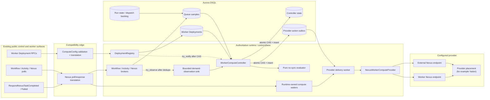

# Design Document: Worker Compute Controller

## Overview

The Worker Compute Controller is an opt-in, runtime-owned control-plane service that
turns a Worker Deployment Version's durable `ComputeConfig` into idempotent requests
for worker capacity. It observes exact-version delivery demand, evaluates the pinned
`no-sync` scaling policy, commits each decision and its provider request to DSQL, and
then invokes a provider through Tokeira's existing Nexus endpoint model.

The behavioral reference is the Worker Controller Instance (WCI) module pinned by
Temporal server v1.31.0:
`go.temporal.io/auto-scaled-workers` commit `edd947d743d2`. In particular:

- `wci/client/config.go` defines disabled-by-default enablement, a soft limit of 100
  controller instances per namespace, and the 500 ms / 60 s observation intervals;
- `wci/client/hook.go` excludes unversioned and sticky task additions;
- `wci/workflow/iface/spec.go` defines scaling-group routing and validation;
- `wci/workflow/scaling_algorithm/no_sync_match.go` defines `no-sync` defaults,
  validation, cooloff, backlog, refresh, and epsilon behavior;
- `wci/workflow/activities.go` aggregates Workflow, Activity, and Nexus metrics; and
- `wci/workflow/workflow.go` invokes workers when configuration becomes active.

Temporal realizes that behavior through a system Workflow. Tokeira does not copy that
implementation. The equivalent Tokeira shape is a conventional durable control-plane
state machine:

1. Worker Deployment storage remains the authority for `ComputeConfig`.
2. Runtime brokers emit bounded, best-effort demand observations after publication.
3. A controller service evaluates pure scaler functions against explicit time and
   durable controller state.
4. One transaction commits updated scaler state and an outbox action.
5. A separate effect worker invokes the current Nexus endpoint target and records the
   outcome under a claim fence.

No workflow event, kernel field, kernel command, lane-routing rule, or projection is
introduced. Workflow, activity, and Nexus task delivery remains correct if the
controller, its observation channel, its samples, or the provider is unavailable.

### Architectural decisions

| Decision | Design |
|---|---|
| Owner | `tokeira-runtime::worker_compute`, supervised by `tokeirad` |
| Durable authority | New `WorkerComputeRepository` in `tokeira-storage` |
| Controller identity | One logical instance per `(namespace_id, deployment_name, build_id)` |
| Group state | A `BTreeMap<ScalingGroupId, ScalingGroupState>` inside the controller record |
| Decision concurrency | Controller lease epoch plus record revision CAS |
| Provider delivery | Durable outbox, stable request bytes and request ID, current endpoint resolution per attempt |
| Provider transport | Existing External Nexus HTTP client or Worker-target Nexus task broker |
| Demand fast path | Fixed-capacity non-blocking observation channel |
| Demand recovery path | Periodic queue-home samples derived from broker/durable delivery state |
| Scaler | Pure `no-sync` evaluator with explicit `now` |
| Diagnostics | Read-only `tkr diagnostics worker-compute` command over the repository |
| Kernel / lanes / projection | Unchanged |

## Dependencies and Non-Goals

### Existing components this design extends

- **`worker-deployments`** owns durable `ComputeConfig`, update masks, Deployment
  Version identity, and task-queue memberships. This design adds validation for remote
  Nexus providers, a non-blocking reconciliation notification, and controller reads;
  it does not move registry authority.
- **`runtime-nexus-http-client`** owns External endpoint request encoding, size and
  timeout enforcement, response decoding, and Nexus failure classification.
- **`edge-nexus-task-transport`** owns public
  `PollNexusTaskQueue`/`RespondNexusTask*` translation and worker-visible task tokens.
- **`edge-nexus-http-dispatch`** supplies the existing synchronous Worker-target
  dispatch pattern. Compute delivery uses a runtime-owned waiter/correlation rather
  than the edge-owned HTTP caller waiter.
- **`authorization-foundation`** continues to authorize Nexus worker polls and task
  responses. Provider invocation does not grant a launched worker any permission.
- **`temporal-compatibility`** owns the generated Feature Catalog and Tokeira
  configuration reference.

### Separate downstream feature

The `scoped-worker-authorization` spec, tracked by
[`tokeira/tokeira#29`](https://github.com/tokeira/tokeira/issues/29), owns
namespace/task-queue/Deployment-Version-scoped JWT and STS grants for launched
workers. This controller sends no token, credential, signing material, or
authorization grant to a provider. A provider can be tested and operated with
pre-provisioned worker credentials, but safe untrusted guest polling remains blocked
on that sibling feature.

### Non-goals

- Direct AWS Lambda, ECS, GCP, Kubernetes, subprocess, Firecracker, or Yadori clients.
- `rate-based` scaling, desired worker-set sizing, scale-down, or provider placement.
- A Temporal system Workflow or a port of the WCI module.
- Proving that a requested worker reached poll-ready state. Provider success only
  acknowledges the idempotent capacity request.
- Durable correctness for observations or metrics samples. They are advisory inputs;
  controller decisions and provider actions are durable.
- Changing workflow/activity/Nexus delivery order, lane affinity, workflow history,
  projection checkpoints, or kernel transition semantics.
- Adding `Nexus` to `tokeira_types::TaskKind`. That enum has stable storage encoding
  and represents the workflow/activity delivery plane. Worker compute uses a separate
  `WorkerComputeTaskType`.
- Making experimental WCI behavior part of Tokeira's Temporal v1.31.0 conformance
  claim.

## Architecture



The dotted observation edges carry no correctness weight. If either notification is
dropped, the deployment catalog sweep and periodic metrics path recover eligibility
and queued demand. The solid controller/outbox edges are durable control-plane state,
but are not involved in task publication or task completion.

### Crate and module map

| Location | Responsibility |
|---|---|
| `crates/tokeira-config` | `policy.worker_compute`, validation, generated config docs |
| `crates/tokeira-types` | Provider-neutral keys, task type, fingerprint |
| `proto/tokeira/compute/v1/provider.proto` / `tokeira-proto` | Provider request/response wire payload |
| `crates/tokeira-storage` | Repository trait, memory implementation, DSQL implementation/migrations |
| `crates/tokeira-runtime/src/worker_compute/` | Observation, batching, reconciliation, scaler, outbox, provider adapter |
| `crates/tokeira-runtime/src/{broker,nexus}.rs` | Post-dedupe observations, versioned Nexus readiness, compute correlation |
| `crates/tokeira-edge/src/translate/nexus.rs` | Nexus poll Deployment Version and response DTO translation |
| `crates/tokeira-edge/src/workflow_service.rs` | Thin forwarding for compute response correlation |
| `apps/tokeirad` | Dependency construction and cancellable supervision |
| `apps/tkr` | Read-only worker-compute diagnostics |
| `crates/tokeira-compatibility` / generated docs | Feature Catalog and operator truth |

No new crate or third-party dependency is required. `blake3`, protobuf generation,
SQLx, Tokio, UUID, and the Nexus transport dependencies are already present in the
owning crates.

### Runtime supervision

`apps/tokeirad/src/lib.rs` constructs one `WorkerComputeControllerService` only when
`policy.worker_compute.enabled` is true. One parent task owns a child `JoinSet` for:

1. deployment-catalog reconciliation;
2. demand batching;
3. queue-home sampling and metrics evaluation; and
4. outbox claiming and provider delivery.

All children share the process cancellation token. Shutdown first closes admission to
new action claims, then lets in-flight attempts finish until the existing process
shutdown deadline. Dropping an unfinished attempt leaves its durable claim to expire;
a later owner retries the same action.

The disabled path constructs a no-op observation/reconciliation sink and starts no
background service. Worker Deployment validation, storage, and reads remain active.

## Components and Interfaces

### 1. Startup policy and bootstrap

`tokeira-config` gains one strict table:

```rust
#[derive(Clone, Copy, Debug, Default, PartialEq, Eq, Serialize, Deserialize)]
#[serde(deny_unknown_fields)]
pub struct WorkerComputePolicyConfig {
    #[serde(default)]
    pub enabled: bool,
}
```

`PolicyConfig` owns it as `worker_compute`. Empty configuration therefore resolves to
disabled. The config documentation registry and `config.example.toml` render:

```toml
[policy.worker_compute]
# Enabling this can cause configured Nexus providers to create billable capacity.
enabled = false
```

The runtime service receives ports rather than depending on edge types:

```rust
#[async_trait]
pub trait WorkerComputeNamespaceCatalog: Send + Sync {
    async fn list_active(&self) -> Result<Vec<WorkerComputeNamespace>>;
    async fn name_for_id(&self, namespace_id: NamespaceId) -> Result<Option<String>>;
}

pub trait WorkerComputeReconcileSink: Send + Sync {
    fn try_reconcile(&self, key: ControllerInstanceKey) -> ObserveResult;
}
```

`tokeirad` adapts the existing `NamespaceCache` to
`WorkerComputeNamespaceCatalog`. The controller enumerates each active namespace and
calls the existing `WorkerDeploymentRepository::list_all_for_namespace` during
startup and a fixed 60-second catalog sweep. Registry notifications make ordinary
updates prompt; the sweep makes notification loss and restart harmless.

The fixed service constants are internal policy, not production TOML:

| Constant | Value | Reason |
|---|---:|---|
| `OBSERVATION_CHANNEL_CAPACITY` | 4096 | Bounded independently of backlog |
| `NO_SYNC_BATCH_INTERVAL` | 500 ms | WCI pin |
| `SYNC_ONLY_BATCH_INTERVAL` | 60 s | WCI pin |
| `CATALOG_RECONCILE_INTERVAL` | 60 s | Lost-notification recovery |
| `QUEUE_SAMPLE_INTERVAL` | 10 s | Fresh enough for the minimum valid metrics interval |
| `QUEUE_SAMPLE_TTL` | 2 min | Excludes abandoned queue-home writers |
| `MAX_CONTROLLER_INSTANCES_PER_NAMESPACE` | 100 | WCI pin |
| `CONTROLLER_CLAIM_LEASE` | 30 s | Fences one bounded reconcile/evaluation |
| `PROVIDER_ATTEMPT_TIMEOUT` | 2 min | `InvokeWorkerActivityTimeout` at WCI pin |
| `ACTION_RETRY_INITIAL_INTERVAL` | 1 s | Existing Nexus retry policy |
| `ACTION_RETRY_MAXIMUM_INTERVAL` | 1 h | Existing Nexus retry policy |
| `ACTION_RETRY_COEFFICIENT` | 2 | Existing Nexus retry policy |
| `ACTION_CLAIM_LEASE` | 150 s | Attempt timeout plus finalization margin |

Tests call single-step methods with explicit time. They do not sleep to exercise these
intervals.

### 2. ComputeConfig validation and eligibility

The registry validates remote-provider and scaler shape before its existing
Worker Deployment CAS. Validation is a pure function:

```rust
pub fn validate_compute_config(
    config: &ComputeConfig,
) -> Result<ValidatedComputeConfig, WorkerComputeConfigError>;
```

It performs these steps in order:

1. Reject empty group IDs, duplicate/unspecified task types, overlapping explicit
   task types, and a second catch-all.
2. For a provider with empty `nexus_endpoint`, preserve the existing built-in type
   validation.
3. For a provider with non-empty `nexus_endpoint`, require only a non-empty provider
   type and a scaler.
4. Decode and validate `no-sync` scaler details. Accept and preserve `rate-based`, but
   classify it unsupported.
5. Return a normalized eligibility view without rewriting the caller's payloads.

Endpoint existence is intentionally not checked in this transaction. Endpoint and
Worker Deployment resources may be created in either order, and current endpoint
metadata is resolved at delivery time.

The controller derives effective task types once per full ComputeConfig:

```rust
#[derive(Clone, Copy, Debug, PartialEq, Eq, PartialOrd, Ord, Hash)]
pub enum WorkerComputeTaskType {
    Workflow,
    Activity,
    Nexus,
}

pub struct EffectiveScalingGroup {
    pub id: ScalingGroupId,
    pub task_types: BTreeSet<WorkerComputeTaskType>,
    pub provider: RemoteNexusProvider,
    pub scaler: NoSyncConfig,
    pub fingerprint: ConfigurationFingerprint,
}
```

Explicit assignments win. A single catch-all receives the remaining types. Groups
using `rate-based` or a provider without a Nexus endpoint remain in the durable
ComputeConfig and controller health output, but cannot produce actions.

### 3. Scaler payload decoding

`ComputeScaler.details` is decoded using Temporal's default payload conventions. An
absent payload means an empty object. The active decoder accepts `json/plain`, the
encoding selected by Temporal's default data converter when decoding into
`map[string]any` at the WCI pin. The decoder rejects an unsupported encoding,
malformed object, or unknown key. Int64 fields reproduce
`wci/workflow/iface/map_access.go @ edd947d743d2`: a JSON number is checked against
the minimum before truncation toward zero, a base-10 integer string is parsed
exactly, and other value types or non-integer strings are rejected. Float fields
accept JSON numbers and numeric strings. Values below their documented minimum, and a
positive cooloff larger than the poll interval, are rejected. The decoder returns the
exact defaults defined in `requirements.md`.

Validation never canonicalizes the stored payload. The `ValidatedComputeConfig`
contains both the decoded `NoSyncConfig` and a clone of the original `Payload`; the
registry commits the original bytes.

### 4. Configuration fingerprint

`ConfigurationFingerprint([u8; 32])` lives in `tokeira-types` and is computed with
the existing `blake3` dependency. It hashes a versioned, length-delimited canonical
encoding:

```text
"tokeira.worker-compute.config.v1\0"
+ scaling group ID
+ sorted Effective_Task_Types
+ provider type
+ provider details (sorted metadata key/value bytes + data bytes)
+ nexus endpoint name
+ scaler type
+ scaler details (sorted metadata key/value bytes + data bytes)
```

Including effective task types means changing another explicit group can change the
catch-all group's fingerprint. Including original payload bytes means a configuration
rewrite with distinct bytes receives a distinct activation and action lineage even if
it decodes to the same numeric values. The digest is an identity/fencing aid, not a
security credential.

### 5. Deployment reconciliation

The controller obtains one logical `ControllerInstanceKey` for each Deployment
Version:

```rust
pub struct ControllerInstanceKey {
    pub namespace_id: NamespaceId,
    pub deployment_name: DeploymentName,
    pub build_id: BuildId,
}
```

One serialized `ControllerRecord` contains group state keyed by Scaling Group ID.
This matches WCI's one instance per Deployment Version while satisfying the durable
logical key `(namespace, deployment, build, group)` for scaler state.

Aurora DSQL provides repeatable-read transactions; a `COUNT` followed by inserts at
different keys would therefore be an unsafe write-skew implementation of the
namespace limit. The repository instead models the 100-instance limit as 100 durable
slot rows per namespace. `admit_controller` tries a deterministic hash-derived slot
order and atomically inserts one free slot with the controller row. Primary-key
conflict admits only one claimant for a slot, and updating the same controller row
prevents one instance acquiring two slots. Exhausting all 100 slots writes the
controller as `CapacityLimited`. Removing/deleting a version atomically deletes its
slot and marks its controller inactive. Periodic reconciliation promotes
capacity-limited records when a slot becomes available. This accepts low-rate
contention only for a genuine namespace constraint and avoids a hot aggregate
counter.

For each eligible group, reconciliation compares the computed fingerprint with
durable group state:

- no current activation record: create one activation action, count 1;
- same fingerprint with activation recorded: no new activation;
- changed fingerprint: make the new fingerprint current and create one new
  activation; attempt-begin fingerprint checks supersede unsent old actions in
  bounded batches;
- removed or unsupported group: mark inactive/unsupported and make no decisions.

An activation action does not advance `last_scale_up_at`; the WCI pin's configuration
registration invocation is outside its scaling algorithm state. An existing group
that remains on `no-sync` preserves its cooloff and prior-rate state across an
in-place configuration update. Removing the group, or changing away from `no-sync`,
ends that scaler incarnation; a later re-add starts with empty scaler state while
historical actions remain.

Observed task queues are collected from committed Worker Deployment memberships,
demand observations, and queue samples when an action is built; they are not copied
into the controller record. An activation before any membership has an empty queue
list. Reconciliation commits state/outbox before notification or provider I/O and
never extends the Worker Deployment RPC's response path.

### 6. Demand observation

`tokeira-runtime::worker_compute::observation` defines:

```rust
#[derive(Clone, Debug, PartialEq, Eq)]
pub struct DemandObservation {
    pub namespace_id: NamespaceId,
    pub task_queue: TaskQueueName,
    pub task_type: WorkerComputeTaskType,
    pub deployment_name: DeploymentName,
    pub build_id: BuildId,
    pub match_kind: DemandMatchKind,
}

#[derive(Clone, Copy, Debug, PartialEq, Eq)]
pub enum DemandMatchKind {
    Sync,
    NoSync,
}

pub trait DemandObservationSink: Send + Sync {
    fn try_observe(&self, observation: DemandObservation) -> ObserveResult;
}
```

The workflow and activity brokers call `try_observe` only after their existing
publication deduplication has accepted a unique task and determined whether a
compatible waiter was present. They emit only when both Deployment and Build ID are
present. A sticky workflow publication emits nothing; the normal-queue publication
performed by sticky fallback emits normally.

The Nexus broker emits after its own task ID has been inserted exactly once and after
compatible-waiter lookup. Provider-invocation tasks are unversioned and therefore do
not recursively create compute demand.

`try_observe` uses `tokio::sync::mpsc::Sender::try_send`. Full, closed, or disabled
sinks increment a bounded-label counter and return immediately. No broker awaits the
controller, storage, or Nexus I/O, and no failed observation changes its publication
result.

### 7. Nexus Deployment Version identity

The edge DTO for `PollNexusTaskQueue` gains:

```rust
pub deployment: Option<WorkerDeploymentVersionRef>
```

The translator admits versioned mode only when both Deployment name and Build ID are
non-empty. It preserves these values and the existing worker heartbeat batch. After
namespace/routing admission and before waiting, the runtime adapter registers the
versioned Nexus poll as a task-queue membership in the Worker Deployment registry,
using the same pattern as workflow/activity polls. A long-poll timeout therefore
still records that this version polls the queue.

The broker introduces a Nexus-specific key rather than changing `TaskKind`:

```rust
pub struct NexusQueueKey {
    pub namespace_id: NamespaceId,
    pub task_queue: TaskQueueName,
    pub deployment: Option<DeploymentId>,
    pub build_id: Option<BuildId>,
}
```

Ready queues and wakes use `NexusQueueKey`. Exact-version tasks match only the same
exact-version waiter; unversioned tasks and polls continue to use the all-`None` key.

Workflow-originated Nexus publication obtains its version from the authoritative
workflow state already loaded by the runtime publisher:
`state.effective_deployment()`. The publisher passes that optional identity into
`NexusTaskBroker::publish_workflow`. No kernel field or dispatch command changes.

The worker-visible `NexusTaskToken` remains namespace/task-queue/task-ID only.
`NexusTaskCorrelation::Workflow` remains the authority for workflow response routing.
Changing the readiness key therefore cannot alter task-token encoding or resolution
fences.

### 8. Observation batching

The controller maintains an in-memory accumulator per `ControllerInstanceKey`:

```rust
pub struct TaskTypeObservationCounts {
    pub sync_count: u64,
    pub no_sync_count: u64,
}

pub struct ObservationBatch {
    pub first_observed_at: OffsetDateTime,
    pub sync_count: u64,
    pub no_sync_count: u64,
    pub task_types: BTreeSet<WorkerComputeTaskType>,
    pub counts_by_task_type: BTreeMap<WorkerComputeTaskType, TaskTypeObservationCounts>,
    pub task_queues: BTreeSet<TaskQueueBinding>,
}
```

The first no-sync observation sets or shortens the due time to
`first_no_sync_at + 500 ms`. A sync-only batch is due at
`first_observed_at + 60 s`. Later observations increment exact saturating counts
without pushing the deadline later. Aggregate counts remain available for diagnostics,
while `counts_by_task_type` preserves which task family produced each sync/no-sync
observation. On due evaluation, the batch is atomically removed from memory and routed
by current effective task types. Each touched eligible group is evaluated once using
only its task families, so a no-sync Activity observation cannot scale a Workflow-only
group that happened to receive a sync observation in the same version batch.

Batch loss on restart is permitted because it is advisory. Queue-home sampling and
the activation/catalog sweeps remain available. Tests drive `ingest(observation,
now)` and `take_due(now)` directly.

### 9. Queue-home metrics samples

The controller must aggregate demand across queue homes without writing DSQL for
every task. Each runtime therefore maintains monotonic in-memory add and dispatch
counters per exact-version queue and periodically writes a
`WorkerComputeQueueSample`:

```rust
pub struct WorkerComputeQueueSample {
    pub key: WorkerComputeQueueKey,
    pub writer_id: IncarnationId,
    pub writer_sequence: u64,
    pub backlog_count: u64,
    pub add_rate: f64,
    pub dispatch_rate: f64,
    pub sampled_at: OffsetDateTime,
}
```

Samples are advisory last-writer snapshots, not controller or task authority.
`writer_sequence` prevents an older sample from the same process overwriting a newer
one. `put_queue_sample` conditionally replaces another writer only when the incoming
`sampled_at` is later (writer UUID breaks an equal-time tie). A queue-home move may
briefly replace one writer with another; the newest non-expired sample wins. Clock
skew can make scaling conservative or temporarily eager, but cannot affect task
correctness.

Backlog providers are task-type specific:

- Workflow and Activity use existing durable dispatch-backlog statistics plus
  broker-ready state, avoiding double counting through the existing backlog APIs.
- Nexus uses ready broker work while memory is intact. Recovery additionally scans
  authoritative pending Nexus operation state for worker-endpoint start/cancel
  deliveries that are currently eligible, grouped by the run's effective Deployment
  Version. This is a periodic read, not a new projection or kernel mutation. Because
  Nexus matching state is best-effort, the fallback may conservatively include a
  delivery that was in flight when memory was lost; it must not omit reconstructible
  queued demand.

Queue discovery does not depend on successful observation delivery. The sampler
enumerates versioned broker keys, durable workflow/activity backlog keys, and
reconstructible Nexus deliveries. Consequently a full observation channel cannot
hide persistent backlog.

While worker compute is enabled, each queue home samples its known exact-version keys
every 10 seconds. The controller treats samples older than two minutes as expired.
The controller reads non-expired samples for a Deployment Version and builds:

```rust
pub struct MetricsSnapshot {
    pub workflow: Option<TaskTypeMetrics>,
    pub activity: Option<TaskTypeMetrics>,
    pub nexus: Option<TaskTypeMetrics>,
}

pub struct TaskTypeMetrics {
    pub backlog_count: u64,
    pub dispatch_rate: f64,
}
```

Counts and rates are summed separately by task type. A group's evaluator receives
only its current effective types. A version with no samples receives explicit zeros.
The next poll is the minimum active group's `metrics_poll_interval_ms`.

### 10. Pure `no-sync` scaler

`tokeira-runtime::worker_compute::scaler` contains no I/O or implicit clock:

```rust
pub fn evaluate_task_add(
    config: &NoSyncConfig,
    state: &NoSyncState,
    batch: &ObservationBatch,
    now: OffsetDateTime,
) -> ScalerDecision;

pub fn evaluate_metrics(
    config: &NoSyncConfig,
    state: &NoSyncState,
    snapshot: &MetricsSnapshot,
    effective_types: &BTreeSet<WorkerComputeTaskType>,
    now: OffsetDateTime,
) -> ScalerDecision;
```

`evaluate_task_add` emits one action only when the batch contains at least one
no-sync match and the shared cooloff has elapsed.

`evaluate_metrics` processes Workflow, Activity, and Nexus independently:

1. backlog strictly above the configured threshold requires scale-up when cooloff has
   elapsed;
2. otherwise, positive backlog requires refresh when positive
   `max_worker_lifetime_ms` has elapsed;
3. a positive epsilon suppresses that task type when a prior rate exists and the
   absolute dispatch-rate delta is no greater than epsilon;
4. every evaluated type stores its current rate; and
5. one or more unsuppressed types produce exactly one group action and advance the
   shared last-scale-up time.

An observation action uses reason `NO_SYNC_MATCH`. A metrics action uses `BACKLOG` if
any contributing type passed the backlog-threshold branch; otherwise it uses
`WORKER_REFRESH`. `CONFIGURATION_ACTIVATION` is created by reconciliation, not the
scaler. Every action count is one.

### 11. Durable controller state

`tokeira-storage` defines a provider-neutral repository:

```rust
#[async_trait]
pub trait WorkerComputeRepository: Send + Sync {
    async fn admit_controller(
        &self,
        candidate: ControllerRecord,
        namespace_limit: usize,
        now: OffsetDateTime,
    ) -> Result<ControllerAdmission>;

    async fn claim_controller(
        &self,
        key: &ControllerInstanceKey,
        owner: IncarnationId,
        now: OffsetDateTime,
        lease_until: OffsetDateTime,
    ) -> Result<Option<ClaimedController>>;

    async fn commit_decision(
        &self,
        claim: &ControllerClaim,
        expected_revision: u64,
        next: ControllerRecord,
        action: Option<ProviderAction>,
    ) -> Result<ControllerCommitResult>;

    async fn put_queue_sample(&self, sample: WorkerComputeQueueSample) -> Result<()>;
    async fn list_queue_samples(
        &self,
        key: &ControllerInstanceKey,
        not_before: OffsetDateTime,
    ) -> Result<Vec<WorkerComputeQueueSample>>;

    async fn claim_due_actions(
        &self,
        namespace_id: NamespaceId,
        owner: IncarnationId,
        now: OffsetDateTime,
        claim_until: OffsetDateTime,
        limit: usize,
    ) -> Result<Vec<ClaimedProviderAction>>;

    async fn begin_action_attempt(
        &self,
        claim: &ActionClaim,
        now: OffsetDateTime,
    ) -> Result<ActionAttemptStart>;

    async fn finalize_action(
        &self,
        claim: &ActionClaim,
        result: ActionFinalization,
    ) -> Result<ActionFinalizeResult>;

    async fn list_health(
        &self,
        namespace_id: NamespaceId,
        filter: WorkerComputeHealthFilter,
    ) -> Result<Vec<ControllerHealthView>>;
}
```

`ControllerRecord` contains:

- key, namespace-name snapshot, record format version, and monotonic revision;
- active/capacity-limited/deleted status;
- owner ID, monotonically increasing owner epoch, and lease deadline;
- group state keyed by Scaling Group ID;
- next metrics poll time; and
- last reconciliation time.

Each `ScalingGroupState` contains:

- configuration fingerprint and effective task types;
- eligibility and controller health;
- activation fingerprint/status;
- last scale-up time;
- prior dispatch rate for each task type;
- last action/failure summary.

A controller claim increments `owner_epoch` and lasts for one bounded
reconcile/evaluation rather than establishing a permanent leader. Every decision
commit predicates on key, owner ID, owner epoch, lease validity, and record revision.
A new owner therefore fences even a stale writer that still holds an old in-memory
revision.

`commit_decision` is one DSQL transaction. When an action is present it:

1. compares the controller claim and revision;
2. writes the updated controller state;
3. inserts the immutable action request.

There is no interval in which state says "scaled" without a recoverable provider
action or vice versa. Repository queries are parameterized, namespace-scoped where
the caller supplies a namespace, and bounded to well below DSQL's 3,000-row / 10 MiB
transaction limits. Old-fingerprint cleanup is deliberately absent from this
transaction: due actions are checked against current group state and superseded in
bounded claim/sweep batches, avoiding an unbounded update when a long-unavailable
provider has accumulated many actions.

### 12. DSQL schema

The implementation adds forward-only migrations at the next contiguous versions,
one DDL statement per file. Secondary indexes use `CREATE INDEX ASYNC`, as required
by Aurora DSQL.

#### `worker_compute_controller_slot`

| Column | Purpose |
|---|---|
| `namespace_id UUID` | Namespace owning the capacity slot |
| `slot SMALLINT` | One application-validated value in the inclusive range 0–99 |
| `deployment_name TEXT`, `build_id TEXT` | Instance holding the slot |
| `updated_at TIMESTAMPTZ` | Diagnostics |

Primary key: `(namespace_id, slot)`. Slot insertion/deletion and controller
activation/deactivation occur in the same transaction. Application-layer validation
enforces the slot range and verifies that a slot holder matches the controller record;
no foreign key is required.

#### `worker_compute_controller`

| Column | Purpose |
|---|---|
| `namespace_id UUID` | Leading namespace key |
| `deployment_name TEXT` | Deployment identity |
| `build_id TEXT` | Version identity |
| `revision BIGINT` | Controller CAS |
| `active BOOLEAN` | Namespace-limit and scan predicate |
| `slot SMALLINT NULL` | Matching namespace capacity slot while active |
| `next_metrics_poll_at TIMESTAMPTZ` | Due-evaluation predicate |
| `lease_owner UUID NULL` | Current controller owner |
| `lease_epoch BIGINT` | Monotonic owner fence |
| `lease_until TIMESTAMPTZ NULL` | Liveness only; epoch provides safety |
| `record_data BYTEA` | Versioned serialized `ControllerRecord` |
| `updated_at TIMESTAMPTZ` | Diagnostics |

Primary key:
`(namespace_id, deployment_name, build_id)`.

#### `worker_compute_action`

| Column | Purpose |
|---|---|
| `action_id UUID` | Action_Request_ID and primary key |
| `due_bucket SMALLINT` | Stable bucket selected from the first six action-UUID bits |
| `namespace_id`, `deployment_name`, `build_id`, `scaling_group` | Audit and filtering |
| `configuration_fingerprint BYTEA` | Staleness visible without decoding |
| `reason SMALLINT` | Bounded activation/no-sync/backlog/refresh reason without coupling storage to protobuf decoding |
| `status SMALLINT` | Pending, Claimed, Delivered, TerminalFailed, Superseded |
| `next_attempt_at TIMESTAMPTZ` | Due scan |
| `claim_owner UUID NULL`, `claim_epoch BIGINT`, `claim_until TIMESTAMPTZ NULL` | Delivery fence |
| `attempts BIGINT` | Retry state |
| `attempt_started_at TIMESTAMPTZ NULL` | Defines the current in-flight boundary |
| `endpoint_name TEXT` | Re-resolved on each attempt |
| `request_data BYTEA` | Exact encoded `InvokeWorkerRequest` |
| `last_error_category TEXT NULL` | Bounded diagnostic category |
| `superseded_at TIMESTAMPTZ NULL` | In-flight stale-config marker |
| `created_at`, `updated_at TIMESTAMPTZ` | Latency and audit |

A separate migration creates the asynchronous due index on
`(namespace_id, due_bucket, status, next_attempt_at, action_id)`. Claim workers scan
one namespace at a time, rotate through the 64 buckets from an
incarnation-derived starting bucket, and conditionally update bounded batches. This
avoids a single low-cardinality status range becoming the write/read focus while
action IDs remain UUID-distributed.

#### `worker_compute_queue_sample`

| Column | Purpose |
|---|---|
| `namespace_id`, `task_queue`, `task_type`, `deployment_name`, `build_id` | Exact-version queue key |
| `writer_id UUID`, `writer_sequence BIGINT` | Same-writer stale update suppression |
| `backlog_count BIGINT` | Approximate reconstructible demand |
| `add_rate DOUBLE PRECISION`, `dispatch_rate DOUBLE PRECISION` | Sample interval rates |
| `sampled_at TIMESTAMPTZ` | Expiry and newest-writer selection |

Primary key:
`(namespace_id, deployment_name, build_id, task_type, task_queue)`, so one
Deployment-Version metrics read is a prefix scan.

The low-rate control and periodic sample writes justify namespace-leading keys; none
is on the per-task commit path. All record types use explicit format versions and
`#[serde(default)]` only for additive fields. The action's provider request is stored
as protobuf bytes, not postcard, so retries remain wire-stable across runtime
upgrades.

### 13. Provider action contract

`proto/tokeira/compute/v1/provider.proto` defines Tokeira-owned payload messages only;
it does not modify an upstream Temporal proto:

```proto
syntax = "proto3";
package tokeira.compute.v1;

import "temporal/api/common/v1/message.proto";

message TaskQueueBinding {
  string name = 1;
  TaskQueueType type = 2;
}

enum TaskQueueType {
  TASK_QUEUE_TYPE_UNSPECIFIED = 0;
  TASK_QUEUE_TYPE_WORKFLOW = 1;
  TASK_QUEUE_TYPE_ACTIVITY = 2;
  TASK_QUEUE_TYPE_NEXUS = 3;
}

enum InvokeReason {
  INVOKE_REASON_UNSPECIFIED = 0;
  INVOKE_REASON_CONFIGURATION_ACTIVATION = 1;
  INVOKE_REASON_NO_SYNC_MATCH = 2;
  INVOKE_REASON_BACKLOG = 3;
  INVOKE_REASON_WORKER_REFRESH = 4;
}

message InvokeWorkerRequest {
  string request_id = 1;
  string namespace = 2;
  string deployment_name = 3;
  string build_id = 4;
  string scaling_group = 5;
  int32 count = 6;
  repeated TaskQueueBinding task_queues = 7;
  string provider_type = 8;
  temporal.api.common.v1.Payload provider_details = 9;
  bytes configuration_fingerprint = 10;
  InvokeReason reason = 11;
}

message InvokeWorkerResponse {
  string request_id = 1;
}
```

At decision time, the controller sorts and deduplicates queue bindings by
`(type, name)`, builds the request, and encodes it once. The single Nexus
input payload has:

```text
encoding    = "binary/protobuf"
messageType = "tokeira.compute.v1.InvokeWorkerRequest"
data        = protobuf bytes
```

The existing Nexus payload-size validator runs before the decision transaction. An
oversized request commits `ProviderRequestTooLarge` health and no action; it never
creates an outbox item that the transport can only reject.

The fixed Nexus service and operation are:

```text
tokeira.worker.compute.v1.ComputeProvider
invoke-worker
```

The action UUID string is both `InvokeWorkerRequest.request_id` and the Nexus request
ID. Retries use the stored bytes, not a reconstructed request. No task payload,
workflow ID, run ID, credential, or authorization grant enters this message.

A synchronous successful result must contain exactly one `binary/protobuf` payload
whose message type is `tokeira.compute.v1.InvokeWorkerResponse`; it must decode and
echo the same request ID. Missing/multiple/malformed payloads, asynchronous
acceptance, or an ID mismatch are terminal `invalid_provider_response` outcomes.

### 14. Nexus provider adapter

`NexusWorkerComputeProvider` resolves `ProviderAction.endpoint_name` immediately
before every attempt.

#### External target

It calls the existing `NexusHttpClient::start_operation` with the fixed
service/operation, stable action ID, one input payload, a two-minute timeout, and
existing trace headers. `NexusStartResult::HandlerError` is extended with a
`retryable` classification calculated from the same Nexus status/header mapping
already used by cancellation and callback delivery. Existing workflow Nexus callers
may ignore that field; compute delivery consumes it.

#### Worker target

The broker adds:

```rust
NexusTaskCorrelation::WorkerCompute {
    action_id: Uuid,
    claim_epoch: u64,
}
```

and a `publish_worker_compute` method. It atomically registers the correlation and an
unversioned synchronous
`NexusTaskRequest::Http(NexusHttpTaskRequestVariant::StartOperation)` with an empty
callback and `dispatch_deadline = now + PROVIDER_ATTEMPT_TIMEOUT`. Reusing that
neutral envelope makes the existing edge translator emit the same request-timeout
headers and Temporal-failure capability as other synchronous Worker-target Nexus
calls. A runtime-owned
`WorkerComputeNexusWaiters` registry maps `(action_id, claim_epoch)` to the delivery
future. The edge's `RespondNexusTaskCompleted` and `RespondNexusTaskFailed` handlers
translate public responses into neutral compute outcomes and complete that runtime
waiter. Failure translation preserves the worker-supplied/default Nexus retry
classification already decoded by `nexus_handler_info`; the edge does not apply
controller retry policy or mutate outbox state.

The delivery lease removes unpolled ready work and volatile correlation on timeout or
cancellation. If the process fails after a worker receives the task, the action claim
expires and another process republishes the same request ID. This is at-least-once
delivery; the provider contract makes the capacity action logically idempotent.

The new correlation variant does not alter token encoding. A duplicate/late worker
response still receives the existing `NOT_FOUND` result after correlation has been
consumed.

### 15. Action claims, retry, and staleness

`claim_due_actions` atomically changes a due Pending action, or an expired Claimed
action, to Claimed and increments `claim_epoch`. Before I/O,
`begin_action_attempt` predicates on that claim, compares the action fingerprint with
current group state, and either marks the action Superseded or increments `attempts`
and records `attempt_started_at`. The latter commit defines the in-flight boundary.
Finalization predicates on action ID, claim owner, and claim epoch. A timed-out older
attempt cannot overwrite a later attempt's result.

Retry delay is pure:

```text
min(1 second * 2^(attempts - 1), 1 hour)
```

There is no maximum attempt count for transport/retryable-handler failures. Operators
can repair or recreate an endpoint without losing the capacity request. Non-retryable
handler errors and invalid provider responses are terminal. A later independent
scaler decision remains permitted after cooloff and receives a new action ID.

When ComputeConfig changes:

- Pending old-fingerprint actions fail the current-fingerprint predicate during
  `begin_action_attempt` (or are found by the bounded supersession sweep) and become
  `Superseded` without provider I/O.
- A newly claimed action is revalidated by `begin_action_attempt` immediately before
  provider I/O. If stale, it becomes `Superseded`; the successful transactional
  begin is the start of an in-flight attempt.
- An action already in flight is not cancelled. Its immutable request exposes the old
  fingerprint to the provider.
- A stale in-flight success is recorded as delivered-with-stale-fingerprint for
  audit.
- A stale in-flight failure is finalized as superseded and is not retried.

Action finalization updates current group health only when the group's current
fingerprint still equals the action fingerprint. A stale result always updates its
own audit row, but can never overwrite the health, last-action summary, or scaler
state of newer configuration.

Endpoint target metadata is not frozen in the action. Each retry resolves the current
endpoint record, while the request bytes remain frozen. Missing endpoints keep the
action pending, apply retry backoff, and set group health to `MisconfiguredEndpoint`.

### 16. Controller health and diagnostics

Health is a durable enum with bounded categories:

```rust
pub enum ControllerHealth {
    Active,
    Disabled,
    UnsupportedProvider,
    UnsupportedScaler,
    InvalidConfiguration,
    ProviderRequestTooLarge,
    MisconfiguredEndpoint,
    CapacityLimited,
    DeliveryRetrying,
    DeliveryTerminalFailure,
    Inactive,
}
```

`tkr diagnostics worker-compute --namespace <name>` opens the selected deployment's
storage with the existing read-only DSQL path, derives the namespace ID, and calls
the namespace-scoped `WorkerComputeRepository::list_health`. Human output is sorted
by Deployment, Build ID, and Scaling Group. Global `--json` emits stable records
including namespace name, fingerprint, health, last decision/action, next poll/retry,
and bounded failure category. Provider details and credentials are never returned.

Metrics use bounded dimensions:

- observation/decision/suppression counters:
  `{task_type, outcome_or_reason}`;
- action counters and latency:
  `{target_kind, outcome}`;
- health gauge:
  `{health}`.

Task queue, action ID, Deployment, Build ID, and Scaling Group do not appear as metric
labels. Structured logs contain namespace, Deployment, Build ID, Scaling Group,
reason, and action ID for correlation, but omit provider details and credentials.

### 17. Feature and public documentation

The Feature Catalog entry is:

- origin: Temporal experimental;
- conformance disposition: excluded from v1.31.0 conformance;
- Temporal default: disabled;
- empty Tokeira configuration: disabled;
- enablement: startup-static `[policy.worker_compute] enabled = true`;
- active slice: Remote Nexus provider + `no-sync` + `invoke-worker`;
- unavailable: `rate-based`, direct providers, desired-size updates, scale-down.

The generated Tokeira configuration reference documents the endpoint prerequisite and
the external-capacity/cost warning. Public architecture documentation states that
provider success acknowledges an idempotent request, not poll readiness.

The implementation supersedes the source-history claim in
`docs/architecture/130-firecracker-worker-placement.md` and
`131-firecracker-worker-placement-implementation.md`: Temporal v1.31.0 does compose
the pinned WCI module, but Tokeira still uses broker observations plus a remote
provider rather than a system Workflow or in-process Firecracker actuation.

## Data Models

### Controller state

```rust
pub struct ControllerRecord {
    pub format_version: u16,
    pub key: ControllerInstanceKey,
    pub namespace_name: String,
    pub revision: u64,
    pub lifecycle: ControllerLifecycle,
    pub slot: Option<u8>,
    pub owner: Option<IncarnationId>,
    pub owner_epoch: u64,
    pub lease_until: Option<OffsetDateTime>,
    pub groups: BTreeMap<ScalingGroupId, ScalingGroupState>,
    pub next_metrics_poll_at: Option<OffsetDateTime>,
    pub reconciled_at: OffsetDateTime,
}

pub struct ScalingGroupState {
    pub fingerprint: ConfigurationFingerprint,
    pub effective_task_types: BTreeSet<WorkerComputeTaskType>,
    pub eligibility: GroupEligibility,
    pub health: ControllerHealth,
    pub activation_fingerprint: Option<ConfigurationFingerprint>,
    pub last_scale_up_at: Option<OffsetDateTime>,
    pub prior_dispatch_rates: BTreeMap<WorkerComputeTaskType, f64>,
    pub last_action_id: Option<Uuid>,
    pub last_failure_category: Option<WorkerComputeFailureCategory>,
}
```

### Provider action

```rust
pub struct ProviderAction {
    pub action_id: Uuid,
    pub due_bucket: u8,
    pub controller_key: ControllerInstanceKey,
    pub scaling_group: ScalingGroupId,
    pub configuration_fingerprint: ConfigurationFingerprint,
    pub endpoint_name: String,
    pub reason: InvokeReason,
    pub request_data: Vec<u8>,
    pub status: ProviderActionStatus,
    pub attempts: u64,
    pub attempt_started_at: Option<OffsetDateTime>,
    pub claim_epoch: u64,
    pub next_attempt_at: OffsetDateTime,
    pub claim: Option<ActionClaim>,
    pub superseded_at: Option<OffsetDateTime>,
    pub last_error_category: Option<WorkerComputeFailureCategory>,
    pub created_at: OffsetDateTime,
    pub updated_at: OffsetDateTime,
}
```

`ProviderActionStatus` is monotonic except that an expired claim returns to eligible
delivery through a new claim epoch:

```mermaid
stateDiagram-v2
    [*] --> Pending
    Pending --> Claimed
    Pending --> Superseded
    Claimed --> Claimed: "lease expired; new claim epoch"
    Claimed --> Pending: "retryable failure"
    Claimed --> Delivered: "valid sync response"
    Claimed --> TerminalFailed: "terminal failure"
    Claimed --> Superseded: "stale failure/cancellation"
```



### Failure categories

The persisted category is a small enum, never an arbitrary remote message:

```rust
pub enum WorkerComputeFailureCategory {
    NamespaceUnresolved,
    EndpointNotFound,
    Transport,
    RetryableHandler,
    NonRetryableHandler,
    OperationUnsuccessful,
    AsyncResponse,
    RequestTooLarge,
    InvalidResponsePayload,
    ResponseIdMismatch,
    Storage,
}
```

Detailed error chains may be logged under redaction rules, but do not become metric
labels or unbounded database index values.

## Correctness Properties

### Property 1: Disabled configuration is inert

For every valid stored Worker Deployment registry and every finite sequence of task
publications, polls, ComputeConfig mutations, and time advances, when
`worker_compute.enabled` is false, ComputeConfig reads and writes have their existing
results and the worker-compute action set remains empty.

**Validates: Requirements 1.1, 1.2, 1.3, 1.5, 1.6**

### Property 2: Eligibility is deterministic and mutation-atomic

For every generated ComputeConfig, validation either returns one deterministic
effective task-type partition and eligibility classification, or one deterministic
`INVALID_ARGUMENT` error; on error, the previously committed registry bytes and
conflict token remain unchanged.

**Validates: Requirements 2.1–2.9, 2.11**

### Property 3: `no-sync` decoding is total and preserving

For every generated scaler payload, decoding either returns the same `NoSyncConfig`
on every evaluation or returns deterministic `INVALID_ARGUMENT`; every accepted
payload is preserved byte-for-byte by a registry round trip.

**Validates: Requirements 3.1–3.7**

### Property 4: One activation per group fingerprint

For every controller record, eligible configuration, and any number or ordering of
reconcile notifications, exactly one activation action can be committed for a group
fingerprint; a new fingerprint permits exactly one new activation, and an unchanged
fingerprint permits none.

**Validates: Requirements 4.1–4.8**

### Property 5: Observation is post-dedupe and non-blocking

For every generated workflow, activity, or Nexus publication and every observation
sink state (ready, full, closed, or disabled), a unique exact-version normal-queue
publication attempts exactly one observation with the broker's sync/no-sync result,
an unversioned or still-sticky publication attempts none, and publication outcome is
independent of sink outcome.

**Validates: Requirements 5.1–5.12**

### Property 6: Nexus version isolation preserves response identity

For every set of versioned and unversioned Nexus waiters/tasks, a task is delivered
only to a waiter with the identical `NexusQueueKey`; adding or removing Deployment
identity never changes its encoded task token, private task ID, or workflow response
correlation.

**Validates: Requirements 6.1–6.7**

### Property 7: Batch eligibility matches the reference clock

For every observation sequence and explicit monotonic clock, per-version batches
retain exact saturating sync/no-sync counts, a batch containing no-sync becomes due
no later than its first no-sync time plus 500 ms, a sync-only batch becomes due at
its first observation plus 60 seconds, and unrelated versions do not affect it.

**Validates: Requirements 7.1–7.9**

### Property 8: Metrics aggregate by version, type, and effective group

For every generated set of non-expired exact-version queue samples, the version
snapshot equals the reference sum of backlog and dispatch rate separately for
Workflow, Activity, and Nexus, and each group receives exactly its effective types;
an empty set yields zeros and evaluation never mutates delivery state.

**Validates: Requirements 8.1–8.8**

### Property 9: `no-sync` decisions match the pinned reference model

For every valid `NoSyncConfig`, prior scaler state, observation batch or metrics
snapshot, effective task-type set, and time, the pure evaluator's action count,
reason, last-scale-up time, and per-type prior rates equal an independent reference
model of `no_sync_match.go @ edd947d743d2`.

**Validates: Requirements 9.1–9.13**

### Property 10: Concurrent decision commit creates at most one action

For every controller claim/revision and any number of concurrent candidate decisions,
at most one transaction can advance that revision; if it contains an action, exactly
one matching outbox row and the matching next scaler state are committed together.

**Validates: Requirements 10.3, 10.4, 10.6; 15.3**

### Property 11: Restart, capacity, and fingerprint fences survive

For every persisted controller/action state and every sequence of process restarts,
lease transfers, configuration changes, and version deletions, cooloff/prior rates
resume from durable state, stale owners cannot commit, no more than 100 active
instances are admitted per namespace, unsent stale actions are not newly delivered,
and historical actions remain readable.

**Validates: Requirements 10.1, 10.2, 10.5–10.13**

### Property 12: Provider request encoding is canonical and secret-free

For every valid provider action input, request encoding is deterministic; decoded
fields equal the decision inputs; queue bindings are unique and sorted; count is one;
and the encoded request contains no task payload, run/workflow identity, credential,
token, or authorization grant.

**Validates: Requirements 11.1–11.10, 15.12**

### Property 13: Provider completion validation is exact

For every Nexus provider outcome, only synchronous protobuf success containing one
`InvokeWorkerResponse` with the matching request ID reaches Delivered; async,
malformed, missing, multiple, mismatched, operation-unsuccessful, and non-retryable
handler results reach the designated non-success category.

**Validates: Requirements 11.11–11.14**

### Property 14: Retry preserves action identity and isolates delivery

For every finite sequence of transient failures, restarts, claim expiry, and eventual
success or terminal failure, every attempt uses identical request bytes and action
ID, a stale claim cannot finalize a newer one, and workflow/activity/Nexus
publication state and ordering are unchanged.

**Validates: Requirements 12.1–12.13; 15.4, 15.6**

### Property 15: Endpoint re-resolution changes only transport

For every durable action and every sequence of endpoint creates, updates, target-kind
changes, and deletion, each attempt uses the endpoint record current at claim time
while the action payload remains identical; no provider-specific route or client is
selected outside the Nexus target adapter.

**Validates: Requirements 13.1–13.7**

### Property 16: Diagnostics and telemetry remain bounded and truthful

For every controller/action state, the diagnostic view reports its exact durable
health and bounded failure category; metric label sets never contain task queue,
action ID, Deployment, Build ID, or Scaling Group; and serialized/logged public
diagnostics contain neither provider details nor credentials.

**Validates: Requirements 14.1–14.6**

### Property 17: Provider-neutral tests do not require Yadori or cloud state

For every generated controller scenario, replacing the provider with the in-process
Nexus test double preserves decision and retry semantics, and the default workspace
test path opens no live provider, cloud credential, Docker, or sibling-repository
process.

**Validates: Requirements 15.1, 15.2, 15.5, 15.8–15.11**

## Error Handling

| Condition | Surface | Classification / response | State effect |
|---|---|---|---|
| Unknown `policy.worker_compute` field or non-boolean `enabled` | Startup | Configuration error; process does not start | None |
| Empty/overlapping group, second catch-all, invalid remote provider/scaler | Worker Deployment RPC | `INVALID_ARGUMENT`, field/key named | Existing ComputeConfig and conflict token unchanged |
| Unsupported stored direct provider or `rate-based` scaler | Controller | `UnsupportedProvider` / `UnsupportedScaler` health | No action; stored config unchanged |
| Controller disabled | Runtime | No-op sink/service | No controller/action rows required |
| Namespace name cannot be resolved | Reconcile | `NamespaceUnresolved` health; retry next sweep | No provider action until exact public name is available |
| Namespace instance limit reached | Reconcile | `CapacityLimited` health | ComputeConfig remains committed; no active lease/action |
| Reconcile notification/observation channel full or closed | Broker/registry | Counter + debug/warn as appropriate | Publication/RPC succeeds; sweep/sample recovers |
| Controller lease or revision conflict | Controller | Internal reload/re-evaluate | No external call; losing candidate discarded |
| Controller storage unavailable | Controller | `Storage` counter/health where record is available; bounded retry | Task delivery unaffected |
| Queue sample write/read unavailable | Sampler | Metric/log; retry next interval | Existing samples may be used until expiry |
| Encoded provider request exceeds existing Nexus payload limit | Decision | `ProviderRequestTooLarge` health | No outbox action; task delivery unaffected |
| Nexus endpoint missing | Delivery | Retryable `EndpointNotFound`; group health `MisconfiguredEndpoint` | Action retained with backoff |
| External Nexus transport failure/timeout | Delivery | Retryable `Transport` | Same action ID/payload, bounded backoff |
| Worker-target poll/response timeout | Delivery | Retryable `Transport`; volatile task correlation removed | Same action retained; claim later expires/retries |
| Retryable Nexus handler error | Delivery | Retryable `RetryableHandler` | Same action retained with backoff |
| Non-retryable Nexus handler error | Delivery | `TerminalFailed(NonRetryableHandler)` | Health records terminal failure; later decisions allowed |
| Operation-unsuccessful sync response | Delivery | `TerminalFailed(OperationUnsuccessful)` | Same as above |
| Async acceptance | Delivery | `TerminalFailed(AsyncResponse)` | Contract violation; no async callback registered |
| Missing/multiple/wrong/malformed response payload | Delivery | `TerminalFailed(InvalidResponsePayload)` | Contract violation |
| Mismatched response request ID | Delivery | `TerminalFailed(ResponseIdMismatch)` | Contract violation |
| Duplicate/late Worker Nexus response | Public response RPC | Existing `NOT_FOUND` | No action state overwritten |
| Config changes before Pending action sends | Claim/revalidation | Action becomes `Superseded` in a bounded transaction | No provider I/O |
| Config changes during in-flight action | Delivery finalization | Audit result marked stale; failure is not retried | Provider saw old fingerprint |
| Shutdown before claim | Service | Stop claiming | Due action remains Pending |
| Shutdown/process loss during claim | Service | Claim lease expires | Future owner retries same action ID |
| Diagnostic storage failure | `tkr diagnostics worker-compute` | Non-zero command error with operation context | Read-only; no mutation |

Remote messages are never used as metric labels. Logs use the full local error chain
only when it contains no provider payload or credential; persisted health retains the
bounded category and a redacted summary.

## Testing Strategy

### Unit tests

- `tokeira-config`: absent/false/true TOML, unknown-field rejection, documentation
  metadata, and round trip.
- `tokeira-runtime::worker_compute::config`: group partitioning, catch-all,
  implementation-specific remote providers, scaler defaults/errors, payload
  preservation, and fingerprint vectors.
- `tokeira-runtime::worker_compute::observation`: post-dedupe emission hooks, sticky
  exclusion/fallback, closed/full sink behavior, and deterministic batch deadlines.
- `tokeira-runtime::worker_compute::scaler`: table-driven WCI-pin examples for
  cooloff, strict backlog threshold, refresh, disabled refresh, epsilon, and
  reason precedence.
- `tokeira-runtime::worker_compute::provider`: request metadata, response validation,
  retry classification, stable retry bytes, endpoint re-resolution, and redaction.
- `tokeira-edge`: Nexus poll deployment-option validation/preservation and compute
  completion/failure correlation translation.
- `tokeira-proto`: provider request/response protobuf round trips and field-number
  compatibility.
- `tokeira-compatibility`: Feature Catalog and generated documentation assertions.
- `tkr`: stable text/JSON diagnostics and read-only error behavior.

### Property-based tests

Every property below runs at least 100 generated cases:

| Property | Crate / harness |
|---|---|
| 1 | `tokeira-config` + runtime disabled-service model |
| 2–4 | `tokeira-runtime::worker_compute::config/controller` |
| 5 | workflow/activity/Nexus broker model tests |
| 6 | `tokeira-runtime::nexus` plus edge token round trip |
| 7–9 | pure batch/scaler reference model |
| 10–11 | shared repository conformance suite against the in-memory store |
| 12–13 | `tokeira-proto` + provider adapter |
| 14–15 | model outbox and fake Nexus endpoint registry |
| 16 | observability manifest and diagnostic serialization |
| 17 | workspace integration harness with deny-by-construction fake ports |

The independent `no-sync` reference model is written from the pinned rules rather
than calling the production evaluator. This prevents a shared implementation bug from
making the property tautological.

### Storage conformance

The in-memory and DSQL repositories share behavioral tests for:

- namespace controller admission under concurrent candidates;
- lease epoch and revision fencing;
- atomic state plus action commit;
- old-fingerprint supersession;
- due-action claim/finalization fencing;
- expired claim recovery;
- stable action bytes across retry and reload;
- queue sample same-writer sequence suppression; and
- deterministic health ordering.

Default workspace tests use the in-memory repository. DSQL query/migration tests
validate SQL shape, bind ordering, schema contiguity, and one-statement migrations
without requiring a live cluster.

### Integration tests

An in-process `WorkerComputeTestProvider` supports External-like and Worker-target
Nexus paths. It records decoded requests, deduplicates by request ID, and can return
success, async acceptance, mismatched IDs, retryable failures, terminal failures, or
timeouts.

Integration scenarios cover:

1. startup activation from pre-existing ComputeConfig;
2. prompt activation after a registry update without delaying the RPC;
3. no-sync workflow and activity demand;
4. versioned Nexus poll and demand isolation;
5. periodic backlog recovery after an observation drop;
6. worker refresh and epsilon suppression;
7. restart with persisted cooloff and pending outbox action;
8. endpoint update/delete/recreate during retries;
9. configuration change while Pending and while Claimed;
10. 100-instance admission and capacity-limited promotion;
11. blocked provider with unaffected task publication; and
12. clean cancellation with claim recovery.

The sibling Yadori integration remains an opt-in cross-repository test and is not part
of `cargo test --workspace`.

### Regression gates

- Existing Worker Deployment ComputeConfig update-mask, request-id dedupe, validation,
  conflict-token, and round-trip suites remain green.
- Existing workflow/activity broker ordering, priority/fairness, sticky fallback,
  dedupe, and poll tests remain green with enabled, disabled, full, and closed
  observation sinks.
- Existing Nexus HTTP, task transport, async completion, token, and workflow
  resolution suites remain green.
- Kernel tests and serialized state goldens have no worker-compute delta.
- The default workspace bar needs no live Nexus provider, Yadori, cloud credential,
  Docker, or DSQL.

## Requirement Traceability

| Requirement | Primary design sections | Primary evidence |
|---|---|---|
| 1 | Startup policy and bootstrap; Feature documentation | Property 1; config/catalog tests |
| 2 | ComputeConfig validation and eligibility | Property 2; registry tests |
| 3 | Scaler payload decoding | Property 3; decoder properties |
| 4 | Deployment reconciliation | Property 4; restart integration |
| 5 | Demand observation | Property 5; broker regression tests |
| 6 | Nexus Deployment Version identity | Property 6; Nexus edge/runtime tests |
| 7 | Observation batching | Property 7; pure-clock properties |
| 8 | Queue-home metrics samples | Property 8; recovery integration |
| 9 | Pure `no-sync` scaler | Property 9; independent reference model |
| 10 | Durable controller state; DSQL schema | Properties 10–11; repository conformance |
| 11 | Provider action contract | Properties 12–13; proto/provider tests |
| 12 | Action claims, retry, and staleness | Property 14; outbox model tests |
| 13 | Nexus provider adapter | Property 15; External/Worker fake endpoints |
| 14 | Health, diagnostics, feature docs | Property 16; generated-doc/CLI tests |
| 15 | Dependencies/non-goals; testing strategy | Property 17; workspace regression bar |
