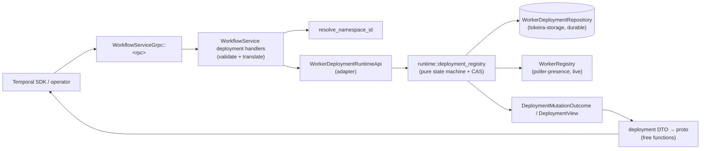
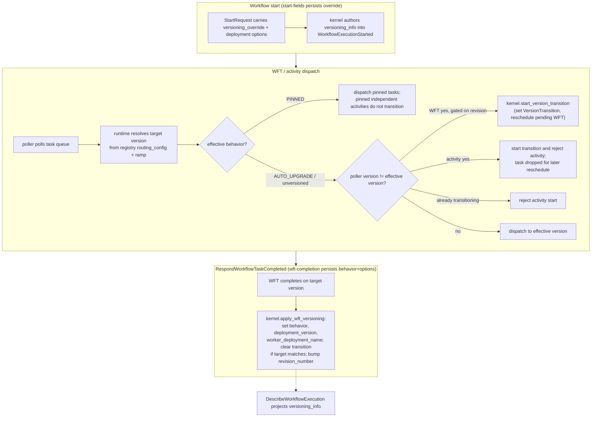

# Design Document: Worker Deployments (v2 surface + versioning routing)

## Overview

This design implements the **Worker Deployment v2 surface** (P10 in the
api-conformance tracker) and makes Tokeira the owner of **worker-versioning routing
application**. It does three things:

1. **Implements the 13 v2 worker-deployment RPCs** — deployment CRUD, version CRUD,
   current/ramping selection, compute-config update/validate, version metadata,
   manager identity, and drainage — backed by a new **durable, namespace-scoped
   deployment registry**.
2. **Applies the persisted per-run versioning state to workflow-task dispatch
   routing** — consuming the fields that three sibling specs persist but explicitly
   defer the *application* of (versioning override, SDK-sent versioning behavior +
   deployment options, and the describe projection).
3. **Returns `UNIMPLEMENTED`** for the 5 deprecated pre-release `Deployment`
   companion RPCs, exactly matching Temporal server v1.31.0
   (`service/frontend/workflow_handler.go` returns `UNIMPLEMENTED` with the message
   "Deployments are deprecated and no longer supported, use Worker Deployments
   instead"; verified at [`github.com/temporalio/temporal` tag `v1.31.0`](https://github.com/temporalio/temporal/tree/v1.31.0)).

The wire shapes are derived from the vendored API `v1.62.11`
(`proto/upstream/temporal/api/deployment/v1/message.proto`,
`proto/upstream/temporal/api/workflow/v1/message.proto`,
`proto/upstream/temporal/api/compute/v1/config.proto`, and the worker-deployment
messages in `proto/upstream/temporal/api/workflowservice/v1/request_response.proto`).
The behaviour — defaulting, error mapping, lifecycle ordering, and routing precedence
— is derived from the v1.31.0 server source per AGENTS.md §8 and cited inline.

### Architectural placement (why a registry, not a system workflow)

Temporal implements Worker Deployments as **system workflows**
(`service/worker/workerdeployment/workflow.go` and `version_workflow.go`): the
deployment record is a long-running workflow whose `State` holds the routing config
and version map, and the version record is a second workflow holding drainage state.
**Tokeira must not port that.** AGENTS.md §Mission forbids porting Temporal code, and
the system-workflow approach would put control-plane correctness weight on per-run
history of a synthetic workflow — which collides with "history is authority" for
*user* runs and with the pure kernel.

Instead Tokeira models the registry as **namespace-scoped control-plane state** in a
new durable store in `tokeira-storage` (a `WorkerDeploymentRepository`), with the
state machine implemented as **pure transition functions** in the runtime
(`tokeira-runtime`). This mirrors the existing split used for shard leases and the
control/budget rows (`LeaseRepository`, `ControlRepository` in
`crates/tokeira-storage/src/api.rs`): durable single-document records guarded by
compare-and-swap, with the decision logic living above storage. The registry is
*not* per-run kernel state.

The **per-run versioning state** (effective behavior, effective deployment version,
versioning override, version transition, revision number, completing worker
deployment name) is genuinely per-run correctness state authored into history and
restored on replay — so it belongs on the kernel `WorkflowState`, exactly like the
recently added `cancel_requested` and `root_*` fields
(`crates/tokeira-kernel/src/state.rs`). It is consumed at dispatch time to decide
routing and projected by `DescribeWorkflowExecution`.

## Dependencies and Non-Goals

### Owning relationships (this spec consumes sibling-persisted state)

- **`api-conformance-start-fields`** persists `StartWorkflowExecution.versioning_override`
  and threads `eager_worker_deployment_options`. This spec consumes the persisted
  override and **applies** it to first-WFT and subsequent routing (Requirement 9.3,
  9.7). It does not re-specify the start-field translation.
- **`api-conformance-wft-completion`** persists `RespondWorkflowTaskCompleted.deployment_options`
  / `versioning_behavior` onto history. This spec consumes that and **updates** the
  run's effective `deployment_version`, `behavior`, and `worker_deployment_name` after
  the task completes (Requirement 9.2). It does not re-specify WFT-completion
  persistence.
- **`api-conformance-workflow-describe`** owns the `DescribeWorkflowExecution`
  single-snapshot translation and explicitly leaves `versioning_info`,
  `worker_deployment_name`, and the deprecated build-id/version-stamp fields default.
  This spec fills those from the per-run versioning state, using the same run snapshot
  (Requirement 10).

### Non-goals

- **The deprecated build-id v1 surface** (`UpdateWorkerBuildIdCompatibility`,
  `GetWorkerBuildIdCompatibility`, assignment/redirect rule RPCs) stays under its
  existing handlers and the existing `VersioningRuleStore`
  (`crates/tokeira-runtime/src/versioning.rs`). This spec adds no v1 behaviour.
- **`describe_worker` / `list_workers`** are worker-observability RPCs that currently
  share the `deferred_unary!("worker-deployments")` block but are NOT deployment
  RPCs. This spec re-points them to their owning observability feature and does not
  implement them.
- **The 5 deprecated `Deployment` companions** are implemented only as the v1.31.0
  `UNIMPLEMENTED` response (Requirement 11). They are not projected over the v2
  registry.
- **Cross-task-queue propagation latency** (`RoutingConfigUpdateState` transitioning
  `IN_PROGRESS` → `COMPLETED` asynchronously) is an intentional compatibility-equivalent
  deviation: v1.31.0 derives `IN_PROGRESS` iff `len(PropagatingRevisions) > 0`, else
  `COMPLETED` (`service/worker/workerdeployment/client.go:1759 @ v1.31.0`). Tokeira
  commits routing synchronously, so there are no propagating revisions and the field is
  reported `COMPLETED` once the registry write commits.

## Architecture

Two distinct paths. The **control-plane path** (registry CRUD + routing-config state
machine) and the **routing-application path** (per-run versioning consumed at
dispatch).

### Control-plane path (13 v2 RPCs)



The edge handler validates inputs, resolves the namespace (`NOT_FOUND` if absent),
and calls the runtime adapter. The runtime loads the current registry record, runs
the **pure** transition (CAS / precondition checks / state mutation), and persists via
the repository's compare-and-swap write. Poller-presence checks read the live
`WorkerRegistry`. The runtime returns a view DTO; the edge translates it to proto with
free functions.

### Routing-application path (Requirement 9, consumed by dispatch)



This mirrors v1.31.0: the transition is started at **task-start** by a poller whose
deployment differs from the workflow's effective deployment
(`service/history/api/recordworkflowtaskstarted/api.go` and
`recordactivitytaskstarted/api.go @ v1.31.0` call
`MutableState.StartDeploymentTransition`), **not** at task creation; workflow-task
starts proceed through the transition path, while an activity start that triggers a
transition is rejected/dropped for later reschedule, and an activity start during an
already in-flight transition is also rejected (`recordactivitytaskstarted/api.go:188 @
v1.31.0`). The transition is completed at WFT completion
(`service/history/workflow/workflow_task_state_machine.go`
`afterAddWorkflowTaskCompletedEvent @ v1.31.0`).

## Components and Interfaces

### Edge handlers (`crates/tokeira-edge/src/grpc/workflow_service.rs`)

Replace the 13 `deferred_unary!("worker-deployments")` entries with real handlers, and
re-point `describe_worker` / `list_workers` out of this block. Each handler:

- resolves the namespace via `WorkflowService::resolve_namespace_id` (→ `NOT_FOUND`),
- validates required identifiers (`deployment_name`, `build_id`, deprecated `version`
  string) → `INVALID_ARGUMENT` before any mutation,
- calls the `WorkerDeploymentRuntimeApi` adapter method,
- translates the runtime view to proto with **free functions** (matching the
  `respond_activity_completed_to_edge` pattern; no `TryFrom`).

The 13 handlers: `create_worker_deployment`, `describe_worker_deployment`,
`delete_worker_deployment`, `list_worker_deployments`,
`create_worker_deployment_version`, `describe_worker_deployment_version`,
`delete_worker_deployment_version`, `set_worker_deployment_current_version`,
`set_worker_deployment_ramping_version`,
`update_worker_deployment_version_compute_config`,
`validate_worker_deployment_version_compute_config`,
`update_worker_deployment_version_metadata`, `set_worker_deployment_manager`.

Replace the 5 deprecated companion handlers (`describe_deployment`,
`list_deployments`, `get_deployment_reachability`, `get_current_deployment`,
`set_current_deployment`, currently at lines ~1069–1109) so each returns
`Status::unimplemented("Deployments are deprecated and no longer supported, use Worker
Deployments instead")` — the exact v1.31.0 message — before any state access
(Requirement 11). These do not route through the runtime adapter.

### Edge ↔ runtime seam: `WorkerDeploymentRuntimeApi` (adapter trait)

A new edge-side trait analogous to `WorkflowRuntimeApi`
(`crates/tokeira-edge/src/workflow_service.rs`), implemented by `RuntimeAdapter`
(`crates/tokeira-edge/src/grpc/runtime_adapter.rs`). It exposes one async method per
RPC, taking translated request DTOs and returning view DTOs or `EdgeError`. The
adapter is the only edge access to the registry; the edge never touches storage or
runtime internals directly (matching the CODEX rule that the edge talks to the runtime
through the adapter).

Method outcomes use a dedicated edge-adapter outcome type
(`DeploymentMutationOutcome { conflict_token, view }`), distinct from the concrete
runtime API result, mirroring the `WorkflowMutationOutcome` vs `CommitResult`
distinction the workflow path uses.

### Runtime registry API (`crates/tokeira-runtime/src/deployment_registry.rs`, new)

The **concrete runtime API**. Holds an `Arc<dyn WorkerDeploymentRepository>` plus a
handle to the live `WorkerRegistry` for poller presence. Implements the deployment +
version state machine as pure transition functions over a loaded record:

```rust
pub struct DeploymentRegistry<R> { /* repo + worker_registry + clock */ }

impl<R: WorkerDeploymentRepository> DeploymentRegistry<R> {
    // Deployment CRUD
    async fn create_deployment(&self, cmd: CreateDeployment) -> Result<DeploymentView, RegistryError>;
    async fn describe_deployment(&self, key: DeploymentKey) -> Result<DeploymentView, RegistryError>;
    async fn delete_deployment(&self, cmd: DeleteDeployment) -> Result<(), RegistryError>;
    async fn list_deployments(&self, page: ListPage) -> Result<DeploymentPage, RegistryError>;
    // Version CRUD
    async fn create_version(&self, cmd: CreateVersion) -> Result<(), RegistryError>;
    async fn describe_version(&self, cmd: DescribeVersion) -> Result<VersionView, RegistryError>;
    async fn delete_version(&self, cmd: DeleteVersion) -> Result<(), RegistryError>;
    // Routing config
    async fn set_current_version(&self, cmd: SetCurrent) -> Result<SetCurrentOutcome, RegistryError>;
    async fn set_ramping_version(&self, cmd: SetRamping) -> Result<SetRampingOutcome, RegistryError>;
    // Compute config + metadata + manager
    async fn update_compute_config(&self, cmd: UpdateComputeConfig) -> Result<(), RegistryError>;
    async fn validate_compute_config(&self, cmd: ValidateComputeConfig) -> Result<(), RegistryError>;
    async fn update_version_metadata(&self, cmd: UpdateMetadata) -> Result<VersionMetadataView, RegistryError>;
    async fn set_manager(&self, cmd: SetManager) -> Result<SetManagerOutcome, RegistryError>;
}
```

The mutation methods follow a **load → validate (pure) → CAS-commit** loop: load the
record (with its current `conflict_token`), evaluate all preconditions on the loaded
snapshot, and persist with `compare_and_swap` keyed on the loaded `conflict_token`. A
CAS failure (another writer advanced the token) reloads and re-validates so a rejected
request never partially mutates state. This matches the OCC model already used by
`RunRepository::commit_transition` and the lease/budget CAS rows.

`RegistryError` is `thiserror`-based with variants mapping to the v1.31.0 error
contract: `AlreadyExists`, `NotFound`, `FailedPrecondition(reason)`,
`ResourceExhausted`, `InvalidArgument(reason)`. The edge maps these to `EdgeError`
(see Error Handling).

#### Poller-presence semantics (resolved against v1.31.0)

- `allow_no_pollers` (set-current/set-ramping): when `false`, an unknown target
  build_id is rejected as `NOT_FOUND` (`validateStateBeforeAcceptingSetCurrent` /
  `...Ramping` raise `errVersionNotFound`; `handleUpdateVersionFailures` maps it to
  `NewNotFoundf(ErrWorkerDeploymentVersionNotFound)`, `workflow.go:1230/1244` +
  `client.go:384 @ v1.31.0`). When `true`, an unknown build_id is auto-created as a
  Version by the set-current/set-ramping update path.
- `ignore_missing_task_queues` (set-current): when `false` and both the previous and
  new current versions are versioned (not unversioned), the new version must poll
  every task queue the previous current version polled; otherwise `FAILED_PRECONDITION`
  (`isVersionMissingTaskQueues` → `ErrCurrentVersionDoesNotHaveAllTaskQueues`). For
  set-ramping the same check runs **only when the ramping version changes** and is
  evaluated against the deployment's **current** version (per the
  `SetWorkerDeploymentRampingVersionRequest.ignore_missing_task_queues` proto comment).
  Tokeira derives "task queues polled by a version" from the durable
  `polled_task_queues` set on the Version record (updated when a poller registers,
  via the existing `WorkerRegistry` registration hook).

### Storage: `WorkerDeploymentRepository` (`crates/tokeira-storage/src/api.rs`, new trait; `memory.rs` + `dsql/` impls)

A new durable, namespace-scoped repository. Single-document-per-deployment with CAS,
backend-agnostic like `CasStore`:

```rust
#[async_trait]
pub trait WorkerDeploymentRepository: Send + Sync {
    async fn load_deployment(&self, key: &DeploymentKey)
        -> Result<Option<StoredWorkerDeployment>>;
    /// CAS write: succeeds only if the durable conflict_token equals `expected`.
    /// `expected == None` means "must not already exist" (create).
    async fn put_deployment(
        &self,
        record: StoredWorkerDeployment,
        expected: Option<ConflictToken>,
    ) -> Result<DeploymentCasResult>;
    async fn delete_deployment(
        &self,
        key: &DeploymentKey,
        expected: ConflictToken,
    ) -> Result<DeploymentCasResult>;
    async fn list_deployments(
        &self,
        namespace_id: NamespaceId,
        after: Option<DeploymentName>,
        limit: usize,
    ) -> Result<Vec<StoredWorkerDeployment>>;
    /// Reload every deployment for a namespace (restart recovery).
    async fn list_all_for_namespace(&self, namespace_id: NamespaceId)
        -> Result<Vec<StoredWorkerDeployment>>;
}

pub enum DeploymentCasResult { Applied { token: ConflictToken }, Conflict, NotFound, AlreadyExists }
```

`StoredWorkerDeployment` embeds the routing config and the full version map (Versions
are stored inside their parent deployment record so a single CAS write atomically
covers a routing change + the version-status changes it implies, exactly as the
Temporal deployment workflow holds `State.Versions` and `State.RoutingConfig`
together). The dev `memory.rs` store keeps a
`HashMap<DeploymentKey, StoredWorkerDeployment>` under the existing `Mutex<StoreState>`;
the DSQL store adds a `worker_deployments` table keyed by `(namespace_id,
deployment_name)` with a `conflict_token` column for conditional writes.

### Kernel: per-run versioning state (`crates/tokeira-kernel/src/state.rs`)

The current `VersioningOverride` is a fieldless placeholder. Replace it and the
`Option<VersioningOverride>` field with a populated per-run versioning state, following
the `#[serde(default)]` + replay-restoration pattern used for `cancel_requested` /
`root_*`:

```rust
/// Per-run worker-versioning state, authored into history and restored on replay.
#[derive(Clone, Debug, Default, PartialEq, Serialize, Deserialize)]
pub struct WorkflowVersioningInfo {
    /// Effective SDK-sent behavior (PINNED / AUTO_UPGRADE / UNSPECIFIED).
    pub behavior: VersioningBehavior,
    /// Deployment version that completed the last workflow task.
    pub deployment_version: Option<WorkerDeploymentVersionRef>,
    /// Execution-scoped override (precedence over behavior).
    pub versioning_override: Option<VersioningOverride>,
    /// In-flight transition target while a WFT/AT is pending on a new version.
    pub version_transition: Option<WorkerDeploymentVersionRef>,
    /// Monotonic routing-decision counter; staleness fence for dispatch.
    pub revision_number: i64,
    /// CaN initial behavior, only for the first task of this run / its retries.
    pub continue_as_new_initial_versioning_behavior: ContinueAsNewVersioningBehavior,
}

#[derive(Clone, Debug, PartialEq, Serialize, Deserialize)]
pub struct WorkerDeploymentVersionRef { pub deployment_name: String, pub build_id: String }

#[derive(Clone, Debug, PartialEq, Serialize, Deserialize)]
pub enum VersioningOverride {
    Pinned { version: WorkerDeploymentVersionRef },
    AutoUpgrade,
}
```

`WorkflowState` gains `#[serde(default)] pub versioning_info: Option<WorkflowVersioningInfo>`
(absent == unversioned, matching the proto: "Absent value means the workflow execution
is not versioned") and `#[serde(default)] pub worker_deployment_name: Option<String>`.
These are populated/cleared by pure kernel transitions only — no I/O. New kernel
methods (pure):

- `start_version_transition(target, revision_number)` — sets `version_transition`,
  clears sticky affinity, and marks the pending WFT for reschedule; rejects when
  effective behavior is PINNED (mirrors `StartDeploymentTransition`'s
  `ErrPinnedWorkflowCannotTransition`, `mutable_state_impl.go @ v1.31.0`). Sets
  `revision_number`.
- `apply_wft_versioning(behavior, deployment_version, worker_deployment_name)` — at WFT
  completion: clears `version_transition` when its target equals the completing
  version; sets `behavior` (UNSPECIFIED ⇒ clear `deployment_version`, i.e.
  unversioned); sets `deployment_version` and `worker_deployment_name` otherwise
  (mirrors `afterAddWorkflowTaskCompletedEvent`).
- `effective_deployment()` / `effective_behavior()` — pure precedence functions
  (transition > override > behavior+deployment_version), the Tokeira analog of
  `GetEffectiveDeployment` / `GetEffectiveVersioningBehavior`
  (`service/history/workflow/util.go @ v1.31.0`).

### Kernel command + event additions (`command.rs`, `event.rs`, `kernel.rs`)

- `StartRequest` already carries `deployment` / `build_id`; extend its
  `ExecutionOptions` so `versioning_override` is the populated `VersioningOverride`
  (start-fields persists it; this spec authors it into the started event and restores
  on replay). The `WorkflowExecutionStarted` history envelope gains defaulted
  versioning fields, authored from the start request and restored in
  `replay_history_prefix` — the same envelope pattern workflow-describe used for
  `root_*`.
- `WorkflowTaskCompletedRequest` (`command.rs`) already carries `worker_version`;
  extend it with `deployment_version` and `versioning_behavior` (persisted by
  wft-completion) so `apply_wft_versioning` runs deterministically on both the live
  transition and replay.

### Runtime dispatch integration (`crates/tokeira-runtime/src/runtime/workflow_task.rs`, `runtime/activity.rs`, `publisher.rs`)

At task-start, the runtime resolves the **target version** for the workflow's task
queue from the deployment registry's routing config:

- compute the target version using the routing config: AUTO_UPGRADE / unversioned
  traffic follows `current_deployment_version`, with the ramp split sending
  `ramping_version_percentage`% (bucketed deterministically by workflow id, reusing
  the `deterministic_bucket` FNV-1a approach already in
  `crates/tokeira-runtime/src/versioning.rs`) to `ramping_deployment_version`; PINNED
  runs resolve to their pinned version regardless of routing config;
- if the polling worker's deployment version differs from the workflow's effective
  version and the workflow is not pinned, call `start_version_transition` gated on the
  dispatch `revision_number` (the activity path additionally gates on
  `revision_number > wft_dispatch_revision` matching
  `recordactivitytaskstarted/api.go @ v1.31.0`);
- on WFT completion call `apply_wft_versioning`, then `revision_number` is incremented
  when the run routes to a new deployment version.

Routing decisions are derived effects of durable registry + per-run state; no
correctness weight rests on transient queues (Requirement 13.6).

### Compatibility matrix (`crates/tokeira-compatibility/src/matrix.rs`)

Move the `worker-deployments` `FeatureEntry` (id `"worker-deployments"`) from
`Unsupported` to its supported state with evidence. The 5 deprecated companions are
counted conformant via their v1.31.0 `UNIMPLEMENTED` behaviour. Update the existing
edge test `deferred_handler_blocks_return_tracked_unimplemented_messages` for the 13
RPCs and re-point `describe_worker` / `list_workers`.

## Data Models

### Durable registry model (derived from `deployment/v1/message.proto`)

`StoredWorkerDeployment` is the durable analog of `WorkerDeploymentInfo` plus the
embedded version map. All fields trace to the proto:

```rust
pub struct StoredWorkerDeployment {
    pub namespace_id: NamespaceId,
    pub name: DeploymentName,                  // WorkerDeploymentInfo.name (req 1)
    pub create_time: OffsetDateTime,           // create_time (3)
    pub routing_config: StoredRoutingConfig,   // routing_config (4)
    pub last_modifier_identity: String,        // last_modifier_identity (5)
    pub manager_identity: Option<String>,      // manager_identity (6); None == empty/unset
    pub routing_config_update_state: RoutingConfigUpdateState, // (7)
    pub versions: BTreeMap<BuildId, StoredVersion>,            // version_summaries source (2)
    pub conflict_token: ConflictToken,         // CAS guard (see below)
    pub create_request_ids: BTreeMap<RequestId, ()>,           // idempotent create dedupe
}

pub struct StoredRoutingConfig {
    pub current_version: Option<BuildId>,      // current_deployment_version (7); None == unversioned
    pub ramping_version: Option<BuildId>,      // ramping_deployment_version (9); None == unversioned
    pub ramping_version_percentage: f32,       // ramping_version_percentage (3); [0,100]
    pub current_version_changed_time: Option<OffsetDateTime>,            // (4)
    pub ramping_version_changed_time: Option<OffsetDateTime>,            // (5)
    pub ramping_version_percentage_changed_time: Option<OffsetDateTime>, // (6)
    pub revision_number: i64,                  // (10) monotonic, bumped on every mutation
}

pub struct StoredVersion {
    pub build_id: BuildId,                     // WorkerDeploymentVersion.build_id
    pub status: WorkerDeploymentVersionStatus, // CREATED/INACTIVE/CURRENT/RAMPING/DRAINING/DRAINED
    pub create_time: OffsetDateTime,
    pub routing_changed_time: Option<OffsetDateTime>,
    pub current_since_time: Option<OffsetDateTime>,    // unset if not current
    pub ramping_since_time: Option<OffsetDateTime>,    // unset if not ramping
    pub first_activation_time: Option<OffsetDateTime>,
    pub last_current_time: Option<OffsetDateTime>,
    pub last_deactivation_time: Option<OffsetDateTime>,
    pub ramp_percentage: f32,                  // 0 unless ramping
    pub drainage_info: Option<DrainageInfo>,   // None while current/ramping (8.5)
    pub metadata: BTreeMap<String, Payload>,   // VersionMetadata.entries
    pub compute_config: BTreeMap<String, ComputeScalingGroup>, // ComputeConfig.scaling_groups
    pub last_modifier_identity: String,
    pub polled_task_queues: BTreeMap<(TaskQueueName, TaskQueueType), OffsetDateTime>, // for stats + ignore_missing
    pub create_request_ids: BTreeMap<RequestId, ()>,
}

pub struct DrainageInfo {
    pub status: VersionDrainageStatus,         // DRAINING (1) | DRAINED (2)
    pub last_changed_time: OffsetDateTime,
    pub last_checked_time: OffsetDateTime,
}
```

Enum values mirror the proto exactly (`enums/v1/deployment.proto`,
`enums/v1/task_queue.proto`, `enums/v1/workflow.proto`):
`WorkerDeploymentVersionStatus` = UNSPECIFIED/INACTIVE/CURRENT/RAMPING/DRAINING/DRAINED/CREATED;
`VersionDrainageStatus` = UNSPECIFIED/DRAINING/DRAINED; `RoutingConfigUpdateState` =
UNSPECIFIED/IN_PROGRESS/COMPLETED; `VersioningBehavior` =
UNSPECIFIED/PINNED/AUTO_UPGRADE.

`ComputeScalingGroup` mirrors `ComputeConfigScalingGroup` (task_queue_types, provider,
scaler). `UpdateWorkerDeploymentVersionComputeConfigRequest.compute_config_scaling_groups`
carries `ComputeConfigScalingGroupUpdate` with a `FieldMask`; the accepted mask paths
are exactly `["task_queue_types", "provider", "provider.type", "provider.details",
"provider.nexus_endpoint", "scaler", "scaler.type", "scaler.details"]`
(`compute/v1/config.proto`). An empty mask on an existing group is a no-op; a mask on a
new group is ignored (the proto's documented semantics).

### Conflict-token model

The conflict token is an opaque optimistic-concurrency token. In v1.31.0 it is the
last-mutation timestamp marshaled to binary
(`d.State.ConflictToken, _ = updateTime.AsTime().MarshalBinary()` in `handleSetCurrent`
/ `handleSetRampingVersion`, and `workflow.Now(ctx).MarshalBinary()` in
`handleSetManager`, `workflow.go @ v1.31.0`). Tokeira does not need to reproduce the
exact bytes (the token is opaque to clients), only the **semantics**: a token uniquely
identifies a deployment-state generation, a write supplying a stale non-nil token is
rejected, and a successful write yields a new distinct token.

Tokeira models `ConflictToken` as an original `[u8; N]` encoding of a per-deployment
monotonic generation counter incremented on every mutating commit:
`ConflictToken = encode(generation)`. CAS compares the supplied token (when non-nil) to
the stored generation; the storage `put_deployment(expected)` performs the conditional
write. A nil/absent supplied token bypasses the check (matching `args.ConflictToken !=
nil` guards in `validateStateBeforeAccepting*`). The describe/create/set responses
return `encode(current_generation)`.

### Per-run versioning state model

As defined in Components (`WorkflowVersioningInfo`). Maps to
`WorkflowExecutionVersioningInfo` (`workflow/v1/message.proto`): `behavior` (1),
`deployment_version` (7), `versioning_override` (3), `version_transition` (6),
`revision_number` (8), `continue_as_new_initial_versioning_behavior` (9). The
deprecated `deployment` (2), `version` (5), and `deployment_transition` (4) are not
stored; describe leaves them default. `worker_deployment_name` projects from the
run's `worker_deployment_name` (the deployment that completed the most recent WFT,
`WorkflowExecutionInfo.worker_deployment_name`, field 23).

### Describe projection mapping (Requirement 10)

| Proto field (`WorkflowExecutionInfo`) | Source |
|---|---|
| `versioning_info.behavior` | `WorkflowVersioningInfo.behavior` |
| `versioning_info.deployment_version` | `.deployment_version` |
| `versioning_info.versioning_override` | `.versioning_override` |
| `versioning_info.version_transition` | `.version_transition` |
| `versioning_info.revision_number` | `.revision_number` |
| `versioning_info.continue_as_new_initial_versioning_behavior` | `.continue_as_new_initial_versioning_behavior` |
| `worker_deployment_name` (23) | `WorkflowState.worker_deployment_name` |
| `assigned_build_id` (19), `inherited_build_id` (20), `most_recent_worker_version_stamp` (16) | left default — superseded in v1.31.0 |

Absent versioning state ⇒ `versioning_info` and `worker_deployment_name` left default
(no fabricated placeholders, Requirement 10.4). Derived from the same `WorkflowState`
snapshot the rest of describe uses (10.5).

## Correctness Properties

*A property is a characteristic or behavior that should hold true across all valid
executions of a system — essentially, a formal statement about what the system should
do. Properties serve as the bridge between human-readable specifications and
machine-verifiable correctness guarantees.*

This feature is well suited to property-based testing. The registry state machine, the
routing-config transitions, the drainage lifecycle, conflict-token CAS, the
effective-deployment precedence, and the serialization/restart round-trips are pure
logic with large generated input spaces. The properties below were derived from the
prework analysis and deduplicated so each provides unique validation value. Each is
implemented as a single property-based test (proptest) with a minimum of 100
iterations. Edge/example criteria (input validation, exact `UNIMPLEMENTED` messages,
namespace-not-found) are covered by generators feeding these properties or by
example-based unit tests (see Testing Strategy), not by standalone properties.

### Property 1: Deployment CRUD correctness

*For any* sequence of deployment create/describe/delete operations against a registry,
the observable state matches a reference model: a create on a fresh name succeeds and
makes the deployment describable; a create on an existing name fails with
`ALREADY_EXISTS`; a repeat create with a previously-seen `request_id` is a no-op
returning the existing token; a describe projects every stored field faithfully; a
delete of a version-free deployment removes it; a delete of a deployment with versions
fails with `FAILED_PRECONDITION` and leaves it present; read and non-delete mutations
on an unknown name fail with `NOT_FOUND`, while delete on an unknown target is a
success no-op (`client.go:1089 @ v1.31.0`).

**Validates: Requirements 1.1, 1.2, 1.3, 1.4, 1.6, 1.7, 1.9, 1.10**

### Property 2: Deployment list pagination round-trip

*For any* set of deployments in a namespace and any generated `page_size` (including
non-positive and over-max values), paging through `ListWorkerDeployments` with the
returned `next_page_token` yields exactly one summary per deployment with no duplicates
and no omissions, an empty continuation token marks exhaustion, and out-of-range
`page_size` values are clamped to the server max rather than rejected
(`workflow_handler.go:4078 @ v1.31.0`).

**Validates: Requirements 1.5**

### Property 3: Version CRUD and deletion-precondition correctness

*For any* sequence of version create/describe/delete operations, the observable state
matches a reference model: creating a version with non-empty `build_id` + name yields a
`CREATED` record only when the parent deployment exists, and fails with `NOT_FOUND` if
the parent deployment is missing (`client.go:1238` + `util.go updateWorkflow @
v1.31.0`); a duplicate (name,build_id) fails with `ALREADY_EXISTS`
(`client.go:1296 @ v1.31.0`); an empty `request_id` is accepted and generated by the
server, and a repeat with a previously-seen `request_id` is a no-op; describe projects
every stored version field faithfully including `version_task_queues` (with
`stats`/`stats_by_priority_key` populated iff `report_task_queue_stats` is true); a
delete succeeds only when the version is neither Current nor Ramping, has no active
pollers, and is drained (or `skip_drainage` is set), otherwise failing with
`FAILED_PRECONDITION` and leaving the version present; read and non-delete mutations on
an unknown version fail with `NOT_FOUND`, while delete on an unknown target is a success
no-op (`client.go:1037 @ v1.31.0`).

**Validates: Requirements 2.1, 2.2, 2.3, 2.4, 2.7, 2.8, 2.10, 2.11, 2.12, 2.13, 2.15**

### Property 4: Deprecated version-string round-trip

*For any* (deployment_name, build_id) pair where the deployment name contains no
delimiter conflict, formatting either legacy `"<deployment_name>.<build_id>"` or
`"<deployment_name>:<build_id>"` and resolving it back identifies the same version;
`__unversioned__` and empty string resolve to unversioned (nil); and only a string with
neither delimiter that is not `__unversioned__`/empty is rejected with
`INVALID_ARGUMENT` (`common/worker_versioning/worker_versioning.go:1103 @ v1.31.0`).

**Validates: Requirements 2.9**

### Property 5: Routing-config state machine

*For any* deployment and any sequence of set-current / set-ramping operations, the
routing config evolves per the v1.31.0 rules: setting Current to an existing version
sets `current_deployment_version`, updates `current_version_changed_time`, and bumps
`revision_number`; an empty `build_id` sets Current/Ramping to nil; setting Current to
the version that is currently Ramping atomically unsets the Ramping version (and its
percentage); a ramp percentage in [0,100] sets the ramping version, percentage, and
times; a Ramping version equal to a non-nil Current version is rejected with
`FAILED_PRECONDITION`; and a successful mutation returns a fresh conflict token plus the
correct deprecated `previous_*` values.

**Validates: Requirements 3.1, 3.2, 3.3, 3.7, 3.8, 4.1, 4.2, 4.4, 4.8**

### Property 6: Conflict-token CAS rejects stale writes without mutation

*For any* deployment and any mutating worker-deployment RPC, a request supplying a
non-nil conflict token that does not match the deployment's current token is rejected
with `FAILED_PRECONDITION` and leaves the durable state unchanged, while a request
supplying the current token (or a nil token) is accepted and yields a new, distinct
token.

**Validates: Requirements 3.4, 4.5, 7.6, 13.4**

### Property 7: Poller-presence preconditions

*For any* set-current or set-ramping request, the poller-presence guards hold per
v1.31.0: with `allow_no_pollers` false a target build_id that is not a tracked version
is rejected with `NOT_FOUND`, while with it true the version is auto-created; with
`ignore_missing_task_queues` false a versioned target that does not poll every task
queue the comparison version polled is rejected with `FAILED_PRECONDITION`, while with
it true the check is bypassed (for ramping, the check runs only when the ramping version
changes and compares against the Current version).

**Validates: Requirements 3.5, 3.6, 4.6, 4.7**

### Property 8: Compute-config update and validate

*For any* version and any sequence of compute-config update operations, the resulting
scaling-group map matches a reference model under `update_mask` semantics — an empty
mask on an existing group is a no-op, a non-empty mask updates only the named accepted
paths, the mask is ignored for a newly added group, and named removals delete groups —
and `ValidateWorkerDeploymentVersionComputeConfig` evaluating the same proposed update
leaves stored state byte-identical, rejects malformed groups/masks, and does not require
or assert Version existence (`workflow_handler.go:258`, `client.go:2037 @ v1.31.0`).

**Validates: Requirements 5.1, 5.2, 5.5, 5.6, 5.7, 5.9**

### Property 9: Version metadata CRUD

*For any* version and any sequence of metadata upsert/remove operations, the resulting
`VersionMetadata.entries` match a reference key-value model (upserts insert or replace,
removals delete), and the response returns the full metadata equal to the stored
entries.

**Validates: Requirements 6.1, 6.2, 6.4**

### Property 10: Manager identity and authorization

*For any* deployment with a set `manager_identity` M, set-current-version,
set-ramping-version, and delete-version carrying an identity other than M are rejected
with `FAILED_PRECONDITION`, while a request whose identity equals M succeeds; setting
the manager via a non-empty value, an empty value (unset), or `self=true` (manager :=
request identity) is not gated by the existing manager and produces the corresponding
stored `manager_identity`, returning a fresh token plus the prior manager identity
(`workflow.go:1177`, `:775/:1244/:1109 @ v1.31.0`).

**Validates: Requirements 7.1, 7.2, 7.3, 7.5, 7.7**

### Property 11: Drainage lifecycle

*For any* version, the drainage state follows the v1.31.0 lifecycle: a version that
stops being Current or Ramping while open pinned workflows target it is set to
`DRAINING` with `last_changed_time`; once no open pinned workflows remain it becomes
`DRAINED` with `last_changed_time`; a version that becomes Current or Ramping again has
its drainage info cleared; a recompute records `last_checked_time`; and while a version
is Current or Ramping its `drainage_info` is never populated.

**Validates: Requirements 8.1, 8.2, 8.3, 8.4, 8.5, 8.6**

### Property 12: Routing determinism and effective-version precedence

*For any* routing config, per-run versioning state, and workflow id, the routing target
is deterministic and follows the v1.31.0 precedence (transition > override > behavior +
deployment_version): a PINNED run (or PINNED override) routes to its pinned version; an
AUTO_UPGRADE / unversioned run follows the Current version, with the
`ramping_version_percentage` fraction of workflow ids deterministically routed to the
Ramping version and the remainder to the Current version; and when the Current version
is nil, AUTO_UPGRADE / unversioned traffic resolves to unversioned workers.

**Validates: Requirements 9.1, 9.3, 9.4, 9.8**

### Property 13: Deployment-version transition lifecycle

*For any* run and any workflow/activity task-start by a poller whose deployment version
differs from the run's effective version: if the run is unpinned, a workflow-task start
starts a transition toward the poller's version gated on the dispatch `revision_number`,
while an activity-task start that triggers the transition is rejected and the task is
dropped for later reschedule; if a transition is already in flight, activity starts are
rejected; pinned-workflow independent activities do not transition; and when a workflow
task completes carrying a versioning behavior and deployment, the run's effective
`behavior`, `deployment_version`, and `worker_deployment_name` are updated (an
UNSPECIFIED behavior clears the deployment version to unversioned), the transition is
cleared when its target matches the completing version, and routing to a new deployment
version increments `revision_number` (`recordactivitytaskstarted/api.go:188 @
v1.31.0`).

**Validates: Requirements 9.2, 9.5, 9.6**

### Property 14: Versioning-info projection fidelity

*For any* per-run versioning state, `DescribeWorkflowExecution` projects
`WorkflowExecutionInfo.versioning_info` (behavior, deployment_version,
versioning_override, version_transition, revision_number,
continue_as_new_initial_versioning_behavior) and `worker_deployment_name` exactly from
that state, leaves the deprecated `assigned_build_id` / `inherited_build_id` /
`most_recent_worker_version_stamp` default, and — when there is no versioning state —
leaves `versioning_info` and `worker_deployment_name` default without fabricating
placeholder values.

**Validates: Requirements 10.1, 10.2, 10.3, 10.4**

### Property 15: Identity propagation

*For any* write worker-deployment RPC carrying a non-empty `identity`, the affected
deployment or version records that identity as its `last_modifier_identity` (and
`SetWorkerDeploymentManager.self=true` records it as `manager_identity`).

**Validates: Requirements 12.1, 6.5**

### Property 16: No mutation on rejected request

*For any* worker-deployment request that is rejected for any reason (invalid argument,
not found, failed precondition, already exists, resource exhausted, manager mismatch,
conflict-token mismatch), the durable registry state is identical before and after the
call. Delete requests for missing targets are accepted success no-ops, not rejected
requests, and the reference model treats them as accepted-with-no-state-change.

**Validates: Requirements 12.4**

### Property 17: Registry restart-recovery round-trip

*For any* registry state (deployments, versions, routing configs with
`revision_number`, version metadata, compute configs, manager identities, and drainage
state), persisting it and reloading from durable storage yields a registry equal to the
original, and conflict tokens issued before the reload are evaluated against the
reloaded state with identical CAS semantics.

**Validates: Requirements 13.1, 13.2, 13.3, 13.4**

### Property 18: Per-run versioning replay round-trip

*For any* per-run versioning state authored into history, replaying the history restores
an equal `WorkflowVersioningInfo`, so post-restart routing decisions
(`effective_deployment` / `effective_behavior`) match the pre-restart decisions.

**Validates: Requirements 13.5**

## Error Handling

The runtime registry returns `RegistryError`; the edge maps it to `EdgeError`, which
maps to a tonic `Status` via `crates/tokeira-edge/src/grpc/errors.rs`. New `EdgeError`
variants are added where no existing variant fits (`AlreadyExists`,
`ResourceExhausted`); `FailedPrecondition`, `NamespaceNotFound`, and the existing
not-found/invalid-argument paths are reused. Both `errors.rs` (status_code +
action_name) and `grpc/errors.rs` (tonic mapping) get entries for the new variants.

| Condition | RegistryError / source | EdgeError | gRPC status |
|---|---|---|---|
| Namespace does not exist | resolved at edge | `NamespaceNotFound` | `NOT_FOUND` |
| Empty `deployment_name` / `build_id`; malformed legacy `version` string; name with `.`/`:`/`__` prefix (v1.31.0 `validateVersionWfParams`) | `InvalidArgument` | `InvalidArgument` (new or reused) | `INVALID_ARGUMENT` |
| `percentage` outside [0,100] | `InvalidArgument` | `InvalidArgument` | `INVALID_ARGUMENT` |
| Unknown mask path / malformed compute group; key in both upsert+remove; group in both update+remove; oneof unset; empty required identity | `InvalidArgument` | `InvalidArgument` | `INVALID_ARGUMENT` |
| Deployment/version does not exist (read or non-delete mutation; delete is the exception and returns success no-op) | `NotFound` | `WorkflowNotFound`-style not-found / new `DeploymentNotFound` | `NOT_FOUND` |
| Set current/ramping to unknown build_id with `allow_no_pollers` false | `NotFound` (v1.31.0 `errVersionNotFound`) | not-found | `NOT_FOUND` |
| Create deployment name exists | `AlreadyExists` | `AlreadyExists` (new) | `ALREADY_EXISTS` |
| Create version (name,build_id) exists | `AlreadyExists` (v1.31.0 `ErrWorkerDeploymentVersionAlreadyExists`) | `AlreadyExists` | `ALREADY_EXISTS` |
| Create version exceeds max-versions limit | `ResourceExhausted` (v1.31.0 `errTooManyVersions`) | `ResourceExhausted` (new) | `RESOURCE_EXHAUSTED` |
| Delete deployment with versions; delete current/ramping/pollered/draining version | `FailedPrecondition` | `FailedPrecondition` | `FAILED_PRECONDITION` |
| Conflict-token mismatch | `FailedPrecondition` (v1.31.0 `errFailedPrecondition`) | `FailedPrecondition` | `FAILED_PRECONDITION` |
| Manager-identity mismatch | `FailedPrecondition` (v1.31.0 `ErrManagerIdentityMismatch`) | `FailedPrecondition` | `FAILED_PRECONDITION` |
| Ramping version equals non-nil Current | `FailedPrecondition` | `FailedPrecondition` | `FAILED_PRECONDITION` |
| Missing pollers / missing task queues with guard flags false | `FailedPrecondition` (v1.31.0 `ErrCurrentVersionDoesNotHaveAllTaskQueues`) | `FailedPrecondition` | `FAILED_PRECONDITION` |
| Pinned run cannot transition (dispatch path) | kernel `ErrPinnedWorkflowCannotTransition` → drop stale task | n/a (matching drops) | n/a |
| 5 deprecated `Deployment` companions | n/a (no state access) | `Unimplemented` (exact v1.31.0 message) | `UNIMPLEMENTED` |

The 13 v2 RPCs never return `UNIMPLEMENTED` (Requirement 12.5). `EdgeError::Internal`
is not used for any of these user-facing conditions.

## Testing Strategy

### Dual testing approach

- **Property tests (proptest, required)** implement Properties 1–18, each tagged
  `// Feature: worker-deployments, Property N: <text>` and configured for a minimum of
  100 iterations. They use a reference model for the CRUD/state-machine properties
  (Properties 1, 3, 5, 8, 9), deterministic generators for routing and ids
  (Properties 12, 13), and serialization round-trips for recovery (Properties 17, 18).
  Generators deliberately include the edge/example inputs (empty names, names with
  `.`/`:`/`__`, out-of-range percentages, bad mask paths, overlapping upsert/remove
  sets, unknown build_ids) so the validation and `NO mutation on rejection` properties
  (Properties 6, 7, 16) exercise them.
- **Unit tests (example-based)** cover the deterministic edge/example criteria that are
  not input-varying: the exact `UNIMPLEMENTED` message for each of the 5 deprecated
  companions and that they touch no registry state (Requirement 11.1–11.6); empty
  `deployment_name` / unset oneof / empty identity → `INVALID_ARGUMENT` (1.8, 7.4, 7.8,
  2.14); namespace-not-found (1.11, 12.2); exceeding max-versions → `RESOURCE_EXHAUSTED`
  (2.5); overlapping upsert/remove and update/remove → `INVALID_ARGUMENT` (6.3, 5.3);
  `eager_worker_deployment_options` applied iff `request_eager_execution` (9.7); and
  that all 13 v2 RPCs accept valid input without `UNIMPLEMENTED` (12.5).
- **Integration tests** exercise the full edge → runtime adapter → registry → storage
  path for a representative RPC of each family (create/describe deployment, create
  version, set-current with ramp-unset, set-ramping, manager mismatch, drainage
  describe), plus a restart-recovery integration test that mutates the registry,
  drops the in-memory runtime, reloads from the store, and asserts describe/list return
  the pre-restart state (Requirements 13.2, 13.3). Routing integration covers a
  start → dispatch → WFT-completion → describe cycle confirming the transition and
  projected `versioning_info`.

### Property-test placement and libraries

Properties for the pure registry state machine and routing logic live in
`crates/tokeira-runtime` (`deployment_registry.rs` and dispatch routing modules);
the storage round-trip (Property 17) lives in `crates/tokeira-storage` alongside the
existing preservation/round-trip property tests; the per-run replay round-trip
(Property 18) and projection fidelity (Property 14) live in `crates/tokeira-kernel`
and `crates/tokeira-edge` respectively. Use the workspace-standard `proptest`
(matching `crates/tokeira-runtime/src/versioning.rs` and
`crates/tokeira-storage/src/preservation_property_tests.rs`); do not hand-roll
property infrastructure.

### Behaviour-conformance anchors

Each property's expected behaviour is anchored to the v1.31.0 source cited in this
document so reviewers can confirm against the same ground truth: create-version uses
`service/worker/workerdeployment/client.go:1238` + `util.go updateWorkflow`; delete
no-ops use `client.go:1037` and `client.go:1089`; duplicate version mapping uses
`client.go:1296`; routing-config and scoped manager/conflict-token checks use
`service/worker/workerdeployment/workflow.go:1177`, `:775`, `:1244`, `:1109`, plus
`client.go:384`; routing update state derives from `client.go:1759`; drainage is in
`version_workflow.go`; request-id defaulting and compute validation use
`service/frontend/workflow_handler.go:185/:258/:4078` and
`service/worker/workerdeployment/client.go:2037`; legacy version parsing uses
`common/worker_versioning/worker_versioning.go:1103`; effective-version precedence is
in `service/history/workflow/util.go`; transition start/complete is in
`service/history/workflow/mutable_state_impl.go` and `workflow_task_state_machine.go`
and task-start triggers in `service/history/api/recordworkflowtaskstarted` /
`recordactivitytaskstarted/api.go:188`; and deprecated-companion `UNIMPLEMENTED`
responses are in `service/frontend/workflow_handler.go` — all at tag `v1.31.0`.
