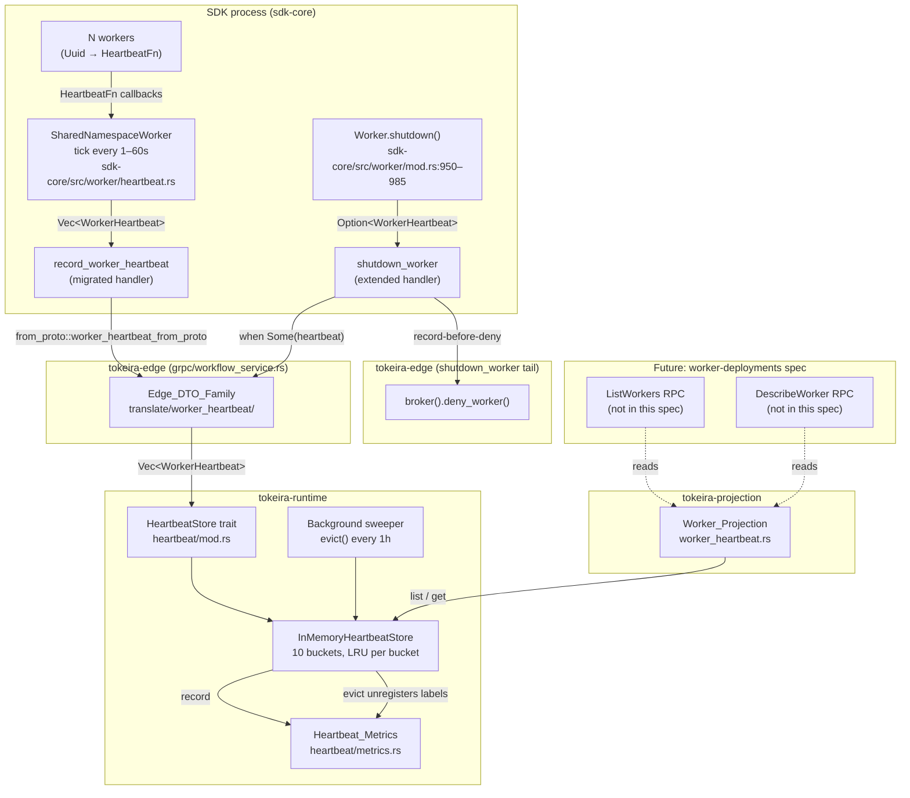

# Design Document: Worker Heartbeat Observability

## Overview

This spec promotes `RecordWorkerHeartbeat` from the v1.62-sync no-op to an observation pipeline. The `Vec<WorkerHeartbeat>` the SDK sends each tick is decoded into an Edge DTO family, routed through a new `HeartbeatStore` trait in `tokeira-runtime` (with a default in-memory backing that mirrors upstream Temporal's matching-service registry verbatim), exposed as a read-through `Worker_Projection` in `tokeira-projection`, and surfaced as a small, registry-bounded set of operator metrics. The `shutdown_worker` handler is extended in the same motion so the final heartbeat the SDK piggybacks on `ShutdownWorkerRequest.worker_heartbeat` captures the `WORKER_STATUS_SHUTDOWN` transition in the projection — matching upstream Temporal's frontend-to-matching routing (`temporal/service/frontend/workflow_handler.go:2720–2762`).

The design honours these invariants:

- **SDK-observable surface stays byte-identical** (Handler_Behaviour_Parity). `RecordWorkerHeartbeat` and `ShutdownWorker` still return empty response bodies; `GetSystemInfo` / `DescribeNamespace` still advertise `worker_heartbeats: true`. The v1.62-sync `v0.4_Liveness_Invariant` is preserved verbatim. See `sdk-core/crates/sdk-core/src/worker/heartbeat.rs:69–110` for the SDK shutdown trigger this invariant protects.
- **Decoder matches upstream permissiveness.** Upstream Temporal's `matching.Handler.RecordWorkerHeartbeat` and `frontend.WorkflowHandler.RecordWorkerHeartbeat` perform zero payload validation beyond namespace resolution and the feature-flag gate (`temporal/service/matching/handler.go:550–557`, `temporal/service/frontend/workflow_handler.go:5988–6011`). Tokeira's decoder refuses to add validation the upstream server doesn't impose — unknown enums, empty strings, empty sub-messages, out-of-range timestamps, empty batches all decode successfully.
- **Retention mirrors upstream verbatim.** The five retention constants in `temporal/service/matching/workers/registry_impl.go:17–21` (TTL 24h, min-evict-age 10m, max-entries 1,000,000, eviction interval 1h, 10 buckets) are hardcoded in the default backing. No operator knobs are introduced. Tokeira's close-to-zero-config principle (`tokeira/AGENTS.md` Rule 9) + SDK heartbeat cadence (1–60s from `sdk-core/crates/sdk-core/src/lib.rs:185–201`) + upstream parity leave no room for tunability this spec needs to justify.
- **Kernel purity is preserved** (Kernel_Purity_Rule). Heartbeats are observations, not state-changing transitions. `tokeira-kernel` gains no dependencies and no new transition variants. This spec's write path is `tokeira-edge` → `tokeira-runtime::HeartbeatStore`; read path is `tokeira-projection::Worker_Projection` → `HeartbeatStore`.
- **Projection is a thin read-through**, not a separate read model. `Worker_Projection::list_workers` is one line over `HeartbeatStore::list`. No lossy summary type; the projection carries the full decoded Edge DTO. This keeps the data-shape contract the future `worker-deployments` spec inherits (Req 8.1) unambiguous: the projection returns `Vec<WorkerHeartbeat>`, matching upstream `ListWorkers` / `DescribeWorker` return shapes (`temporal/service/matching/workers/registry.go`).
- **Metric cardinality is bounded by the live registry.** Labels are `(namespace, worker_instance_key)` only; eviction of a store entry unregisters the corresponding metric label. The 1,000,000-entry store cap is therefore also the global metric label ceiling — no separate cardinality budget to reason about.
- **Encode translator and query-filter surface are deferred to `worker-deployments`.** The encode path is needed only by a handler that returns `WorkerHeartbeat` over the wire (`ListWorkers` / `DescribeWorker`), which this spec explicitly does not implement. Decode-only today; `worker-deployments` owns both the encode translator and its round-trip property.

### SDK behaviour references (grounded)

The design is grounded in the upstream Temporal and sdk-core sources that the implementation must honour:

1. **Capability gate** — SDK's `SharedNamespaceWorker` calls `DescribeNamespace` at startup and shuts down if `namespace_info.capabilities.worker_heartbeats != Some(true)` (`sdk-core/crates/sdk-core/src/worker/heartbeat.rs:69–85`). v1.62-sync established the advertisement; this spec preserves it.
2. **`Unimplemented` kills the heartbeater** — returning `tonic::Code::Unimplemented` triggers `SharedNamespaceWorker` shutdown (`sdk-core/crates/sdk-core/src/worker/heartbeat.rs:106–110`). The migrated handler must not reach this code.
3. **Cadence is SDK-driven, 1–60s** — `heartbeat_interval` is validated as `1s ≤ interval ≤ 60s`, default 60s (`sdk-core/crates/sdk-core/src/lib.rs:185–201`). Server imposes no cadence checks (`temporal/service/matching/handler.go:550–557`).
4. **Batched heartbeats per tick** — the SDK collects callbacks for every registered worker in the namespace and sends one `RecordWorkerHeartbeat` RPC carrying `Vec<WorkerHeartbeat>` (`sdk-core/crates/sdk-core/src/worker/heartbeat.rs:88–108`).
5. **Final heartbeat on shutdown** — the SDK captures the last heartbeat via the per-worker callback and piggybacks it in `ShutdownWorkerRequest.worker_heartbeat` (`sdk-core/crates/sdk-core/src/worker/mod.rs:950–985`, `sdk-core/crates/sdk-core/src/worker/client.rs:755–761`). Upstream Temporal's frontend routes this through `matching.RecordWorkerHeartbeat` so the registry sees the `WORKER_STATUS_SHUTDOWN` transition (`temporal/service/frontend/workflow_handler.go:2720–2762`).

### Cross-spec positioning

- Strictly downstream of [`temporal-api-v1.62-sync`](../temporal-api-v1.62-sync/design.md). v1.62-sync establishes the Edge DTO convention, the `record_worker_heartbeat` no-op handler this spec migrates, the `worker_heartbeats: true` advertisement this spec preserves, and the Surface_Audit this spec amends (Feature 7).
- Strictly upstream of `worker-deployments` (future spec, does not exist yet). That spec owns the encode translator, the SQL-style query-filter surface (reference: `temporal/service/matching/workers/worker_query_engine.go`), and the `ListWorkers` / `DescribeWorker` RPC handlers, implemented as thin reads against the `Worker_Projection` this spec creates.
- Explicitly not consumed: `temporal-compatibility`. The `worker_heartbeats` capability remains a local edge-level constant — handshake preservation is scoped here, not routed through any compatibility matrix or digest.

## Architecture

The diagram below shows the end-to-end data flow — RPC admission at the edge, decode, store, projection read, and metric emission. Kernel is explicitly absent (Kernel_Purity_Rule).



**Module boundaries** (honouring `tokeira/AGENTS.md` Package Boundaries):

- `tokeira-edge/src/translate/worker_heartbeat/` — the Edge DTO family and decode translator. Mirrors sibling patterns at `translate/schedule.rs` and `translate/nexus.rs`.
- `tokeira-edge/src/grpc/workflow_service.rs` — the migrated `record_worker_heartbeat` handler and the extended `shutdown_worker` handler. No new file; amending existing handlers.
- `tokeira-runtime/src/heartbeat/` — new module: `mod.rs` (trait + error + `EvictionReport`), `in_memory.rs` (default backing, buckets, LRU), `metrics.rs` (metric registration and unregistration callbacks), `sweeper.rs` (background eviction task). Mirrors sibling patterns at `task_queue_config.rs` and `schedule.rs`.
- `tokeira-projection/src/worker_heartbeat.rs` — the `Worker_Projection` read-through. New file; cannot reuse `worker.rs` because that name already denotes the projection-log worker driver (see `crates/tokeira-projection/src/worker.rs`).
- `tokeira-kernel/` — no changes. Kernel_Purity_Rule.

## Components and Interfaces

Components are numbered in implementation-task order. Each maps to one or more features from `requirements.md`.

### 1. Edge DTO family and decode translator (Feature 1)

#### 1.1 Module layout

The DTO family lives at `crates/tokeira-edge/src/translate/worker_heartbeat/`, following the neighbouring `schedule.rs` and `nexus.rs` pattern documented at the top of `translate/mod.rs`. The submodule is organised as:

```
crates/tokeira-edge/src/translate/worker_heartbeat/
├── mod.rs          # re-exports DTOs and from_proto functions
├── dto.rs          # the six Edge DTO structs
├── from_proto.rs   # per-type decode translators
└── tests.rs        # decode structural proptest
```

#### 1.2 Edge DTO structs (Req 1.1.1–1.1.5)

The six structs mirror `temporal.api.worker.v1.*` verbatim in naming (`tokeira-edge/src/translate/worker_heartbeat/dto.rs`). Per Req 1.1.3, every struct derives `Debug`, `Clone`, `PartialEq`, `Eq`, `Serialize`, `Deserialize`. Submessage fields are `Option<T>` to honour protobuf-optional semantics on nested messages (Req 1.1.6); `repeated` fields become `Vec<T>`; `google.protobuf.Timestamp` uses the existing `tokeira_types` timestamp newtype; `google.protobuf.Duration` uses `tokeira_types::Duration`. Proto-layer types (`prost_types::Timestamp`, `prost_types::Duration`) are forbidden at the DTO boundary (Req 1.1.5).

```rust
// crates/tokeira-edge/src/translate/worker_heartbeat/dto.rs

use serde::{Deserialize, Serialize};
use tokeira_types::{Duration, Timestamp};

#[derive(Clone, Debug, Default, PartialEq, Eq, Serialize, Deserialize)]
pub struct WorkerHeartbeat {
    pub worker_instance_key: String,
    pub worker_identity: String,
    pub host_info: Option<WorkerHostInfo>,
    pub task_queue: String,
    pub deployment_version: Option<WorkerDeploymentVersion>,
    pub sdk_name: String,
    pub sdk_version: String,
    pub status: WorkerStatus,
    pub start_time: Option<Timestamp>,
    pub heartbeat_time: Option<Timestamp>,
    pub elapsed_since_last_heartbeat: Option<Duration>,
    pub workflow_task_slots_info: Option<WorkerSlotsInfo>,
    pub activity_task_slots_info: Option<WorkerSlotsInfo>,
    pub nexus_task_slots_info: Option<WorkerSlotsInfo>,
    pub local_activity_slots_info: Option<WorkerSlotsInfo>,
    pub workflow_poller_info: Option<WorkerPollerInfo>,
    pub workflow_sticky_poller_info: Option<WorkerPollerInfo>,
    pub activity_poller_info: Option<WorkerPollerInfo>,
    pub nexus_poller_info: Option<WorkerPollerInfo>,
    pub total_sticky_cache_hit: i32,
    pub total_sticky_cache_miss: i32,
    pub current_sticky_cache_size: i32,
    pub plugins: Vec<PluginInfo>,
    pub drivers: Vec<StorageDriverInfo>,
}

#[derive(Clone, Debug, Default, PartialEq, Eq, Serialize, Deserialize)]
pub struct WorkerHostInfo {
    pub host_name: String,
    pub process_id: String,
    pub current_host_cpu_usage: f32,
    pub current_host_mem_usage: f32,
    pub worker_grouping_key: String,
}

#[derive(Clone, Debug, Default, PartialEq, Eq, Serialize, Deserialize)]
pub struct WorkerPollerInfo {
    pub current_pollers: i32,
    pub last_successful_poll_time: Option<Timestamp>,
    pub is_autoscaling: bool,
}

#[derive(Clone, Debug, Default, PartialEq, Eq, Serialize, Deserialize)]
pub struct WorkerSlotsInfo {
    pub current_available_slots: i32,
    pub current_used_slots: i32,
    pub slot_supplier_kind: String,
    pub total_processed_tasks: i32,
    pub total_failed_tasks: i32,
    pub last_interval_processed_tasks: i32,
    pub last_interval_failure_tasks: i32,
}

#[derive(Clone, Debug, Default, PartialEq, Eq, Serialize, Deserialize)]
pub struct PluginInfo {
    pub name: String,
    pub version: String,
}

#[derive(Clone, Debug, Default, PartialEq, Eq, Serialize, Deserialize)]
pub struct StorageDriverInfo {
    pub r#type: String,
    pub version: String,
}
```

The `WorkerStatus` enum and the `WorkerDeploymentVersion` sub-type already exist in the wider Edge DTO model (`deployment_version` is the v1.62 `temporal.api.deployment.v1.WorkerDeploymentVersion` DTO added by v1.62-sync; `WorkerStatus` is the v1.62 `temporal.api.enums.v1.WorkerStatus` enum decoded via the established enum translator). No new enum types or deployment-version types are introduced by this spec.


#### 1.3 Decode translators (Req 1.2)

Decode functions follow the neighbouring `translate/schedule.rs` and `translate/nexus.rs` conventions. Each sub-message gets one `*_from_proto` function (Req 1.2.1, 1.2.2). `repeated` fields preserve wire order by decoding element-by-element (Req 1.2.3). Optional sub-messages map absence to `None` (Req 1.2.4).

```rust
// crates/tokeira-edge/src/translate/worker_heartbeat/from_proto.rs

use tokeira_proto::public::temporal::api::worker::v1 as proto_worker;

use super::dto::*;

pub fn worker_heartbeat_from_proto(proto: proto_worker::WorkerHeartbeat) -> WorkerHeartbeat {
    // Decoder is permissive (Req 1.2.5): no validation beyond what the proto
    // runtime already enforces. Unknown enums decode to `Unspecified`;
    // empty strings stay empty; out-of-range timestamps decode to whatever the
    // tokeira_types timestamp newtype admits; the decoder SHALL NOT surface a
    // parse error. Upstream Temporal performs no such validation either
    // (temporal/service/matching/handler.go:550–557).
    tracing::debug!(
        worker_instance_key = %proto.worker_instance_key,
        "decoded WorkerHeartbeat",
    );
    WorkerHeartbeat {
        worker_instance_key: proto.worker_instance_key,
        worker_identity: proto.worker_identity,
        host_info: proto.host_info.map(worker_host_info_from_proto),
        task_queue: proto.task_queue,
        deployment_version: proto
            .deployment_version
            .map(worker_deployment_version_from_proto),
        sdk_name: proto.sdk_name,
        sdk_version: proto.sdk_version,
        status: worker_status_from_proto(proto.status),
        start_time: proto.start_time.map(timestamp_from_proto),
        heartbeat_time: proto.heartbeat_time.map(timestamp_from_proto),
        elapsed_since_last_heartbeat: proto
            .elapsed_since_last_heartbeat
            .map(duration_from_proto),
        workflow_task_slots_info: proto.workflow_task_slots_info.map(worker_slots_info_from_proto),
        activity_task_slots_info: proto.activity_task_slots_info.map(worker_slots_info_from_proto),
        nexus_task_slots_info: proto.nexus_task_slots_info.map(worker_slots_info_from_proto),
        local_activity_slots_info: proto.local_activity_slots_info.map(worker_slots_info_from_proto),
        workflow_poller_info: proto.workflow_poller_info.map(worker_poller_info_from_proto),
        workflow_sticky_poller_info: proto
            .workflow_sticky_poller_info
            .map(worker_poller_info_from_proto),
        activity_poller_info: proto.activity_poller_info.map(worker_poller_info_from_proto),
        nexus_poller_info: proto.nexus_poller_info.map(worker_poller_info_from_proto),
        total_sticky_cache_hit: proto.total_sticky_cache_hit,
        total_sticky_cache_miss: proto.total_sticky_cache_miss,
        current_sticky_cache_size: proto.current_sticky_cache_size,
        plugins: proto.plugins.into_iter().map(plugin_info_from_proto).collect(),
        drivers: proto.drivers.into_iter().map(storage_driver_info_from_proto).collect(),
    }
}

pub fn worker_host_info_from_proto(p: proto_worker::WorkerHostInfo) -> WorkerHostInfo { /* field-by-field */ }
pub fn worker_poller_info_from_proto(p: proto_worker::WorkerPollerInfo) -> WorkerPollerInfo { /* field-by-field */ }
pub fn worker_slots_info_from_proto(p: proto_worker::WorkerSlotsInfo) -> WorkerSlotsInfo { /* field-by-field */ }
pub fn plugin_info_from_proto(p: proto_worker::PluginInfo) -> PluginInfo { /* field-by-field */ }
pub fn storage_driver_info_from_proto(p: proto_worker::StorageDriverInfo) -> StorageDriverInfo { /* field-by-field */ }
```

The per-call `tracing::debug!` line satisfies Req 1.2.6 (at most one `debug!` per decoded heartbeat; no higher level). Per-heartbeat detail beyond `worker_instance_key` belongs at `tracing::trace!` if operators ever want it.

#### 1.4 Decode structural property (Req 1.3)

The decode property lives at `crates/tokeira-edge/src/translate/worker_heartbeat/tests.rs` and uses `proptest` strategies over `proto_worker::WorkerHeartbeat`. It asserts structural mirroring:

- every `repeated` field on the proto yields a `Vec` of equal length on the DTO, elementwise;
- every optional sub-message present on the proto yields `Some(...)` on the DTO;
- every optional sub-message absent on the proto yields `None` on the DTO;
- every primitive scalar field appears verbatim on the DTO (modulo the `tokeira_types` timestamp/duration wrapping);
- unknown enum values, empty strings, empty `Vec`s, and absent submessages all decode successfully (permissiveness, Req 1.2.5).

The encode-side round-trip is explicitly out of scope; `worker-deployments` owns the encode translator and its full round-trip property (Req 1.3.4).

### 2. HeartbeatStore (Feature 2)

#### 2.1 Module layout

```
crates/tokeira-runtime/src/heartbeat/
├── mod.rs          # trait + errors + EvictionReport + re-exports
├── in_memory.rs    # InMemoryHeartbeatStore + bucket + entry
├── metrics.rs      # metric registration + unregister callback
└── sweeper.rs      # background evict() task
```

Mirrors the `task_queue_config.rs` sibling pattern in the same crate, promoted to a directory because the in-memory backing is larger than a single file (buckets, LRU list, metrics integration, sweeper).

#### 2.2 Trait shape (Req 2.1)

```rust
// crates/tokeira-runtime/src/heartbeat/mod.rs

use std::time::Duration;

use thiserror::Error;
use tokeira_edge_translate::worker_heartbeat::WorkerHeartbeat;
use tokeira_types::NamespaceId;

/// In-memory registry of the latest `WorkerHeartbeat` observed per
/// `(NamespaceId, worker_instance_key)`.
///
/// Mirrors upstream Temporal's `service/matching/workers/registry.go` trait
/// surface: `record`, `list`, `get` correspond to `RecordWorkerHeartbeats`,
/// `ListWorkers`, `DescribeWorker`. `evict` is exposed on the trait so tests
/// drive eviction deterministically.
pub trait HeartbeatStore: Send + Sync + 'static {
    /// Upsert a batch of heartbeats under `namespace`. Duplicate keys within
    /// the batch resolve last-write-wins per Req 2.2.4.
    fn record(
        &self,
        namespace: &NamespaceId,
        heartbeats: Vec<WorkerHeartbeat>,
    ) -> Result<(), HeartbeatStoreError>;

    /// Return the latest heartbeat for one worker identity, or `None` if the
    /// key is absent. Does not filter by TTL (Req 2.3.3); the sweeper handles
    /// expiry.
    fn get(
        &self,
        namespace: &NamespaceId,
        worker_instance_key: &str,
    ) -> Result<Option<WorkerHeartbeat>, HeartbeatStoreError>;

    /// Return every stored heartbeat in `namespace`. Ordering unspecified
    /// (Req 5.1.2). Does not filter by TTL (Req 2.3.3).
    fn list(
        &self,
        namespace: &NamespaceId,
    ) -> Result<Vec<WorkerHeartbeat>, HeartbeatStoreError>;

    /// Run one TTL pass followed by one capacity pass per Req 2.3.4. The
    /// sweeper calls this every `DEFAULT_EVICTION_INTERVAL`; tests call it
    /// directly for determinism.
    fn evict(&self) -> Result<EvictionReport, HeartbeatStoreError>;
}

/// Counts returned by one `evict` pass; carried through to metrics and logs.
#[derive(Clone, Copy, Debug, Default, PartialEq, Eq)]
pub struct EvictionReport {
    /// Entries removed by the TTL pass (age > DEFAULT_ENTRY_TTL).
    pub ttl_evicted: u64,
    /// Entries removed by the capacity pass to bring total ≤ DEFAULT_MAX_ENTRIES.
    pub capacity_evicted: u64,
    /// Total entries remaining after both passes.
    pub remaining: u64,
}

#[derive(Debug, Error)]
pub enum HeartbeatStoreError {
    /// Generic backend failure, carrying a reason string. The default
    /// in-memory backing cannot fail through this variant in practice —
    /// it exists so future backings (including a DSQL-backed variant if
    /// one is ever justified) can surface errors without the trait
    /// leaking `anyhow::Error` (v1.62-sync Req 4.6.2 convention).
    #[error("heartbeat store backend error: {0}")]
    Backend(String),
}
```

Interior mutability (Req 2.1.5) uses per-bucket `std::sync::Mutex`, matching upstream Temporal's `bucket.mu` at `temporal/service/matching/workers/registry_impl.go:32`. Async locks are not required — the store performs no I/O and holds locks for O(1) time per operation.

#### 2.3 Retention constants (Req 2.3.1)

Hardcoded in `crates/tokeira-runtime/src/heartbeat/mod.rs`:

```rust
/// TTL after which entries are evicted unconditionally.
/// Mirrors `defaultEntryTTL` at temporal/service/matching/workers/registry_impl.go:18.
pub const DEFAULT_ENTRY_TTL: Duration = Duration::from_secs(24 * 60 * 60);

/// Minimum age below which entries are never capacity-evicted. Prevents
/// churn from evicting entries that were just recorded.
/// Mirrors `defaultMinEvictAge` at registry_impl.go:19.
pub const DEFAULT_MIN_EVICT_AGE: Duration = Duration::from_secs(10 * 60);

/// Global entry cap across all buckets and namespaces.
/// Mirrors `defaultMaxEntries` at registry_impl.go:20.
pub const DEFAULT_MAX_ENTRIES: u64 = 1_000_000;

/// Interval at which the background sweeper invokes `evict`.
/// Mirrors `defaultEvictionInterval` at registry_impl.go:21.
pub const DEFAULT_EVICTION_INTERVAL: Duration = Duration::from_secs(60 * 60);

/// Bucket shard count. Partitions the keyspace by namespace-hash for lock
/// contention only; no semantic impact.
/// Mirrors `defaultBuckets` at registry_impl.go:17.
pub const DEFAULT_BUCKETS: usize = 10;
```

Req 2.4 forbids exposing any of these through `TokeiraConfig`. A test in `crates/tokeira-config/tests/` asserts that the config struct field list does not grow a heartbeat-retention entry (Req 2.4.1).


#### 2.4 `InMemoryHeartbeatStore` data structures (Req 2.2)

The default backing mirrors upstream Temporal's `bucket` struct at `registry_impl.go:30–34` — a per-bucket `HashMap<NamespaceId, HashMap<String, Entry>>` plus an LRU-ordered `VecDeque<BucketKey>` for O(1) capacity eviction. A global atomic counter tracks total entries across buckets so the capacity pass can short-circuit once under the cap.

```rust
// crates/tokeira-runtime/src/heartbeat/in_memory.rs

use std::{
    collections::{HashMap, VecDeque},
    hash::{Hash, Hasher},
    sync::{
        Arc, Mutex,
        atomic::{AtomicU64, Ordering},
    },
    time::{Duration, Instant},
};

use tokeira_edge_translate::worker_heartbeat::WorkerHeartbeat;
use tokeira_types::NamespaceId;

use super::{
    DEFAULT_BUCKETS, DEFAULT_ENTRY_TTL, DEFAULT_EVICTION_INTERVAL, DEFAULT_MAX_ENTRIES,
    DEFAULT_MIN_EVICT_AGE, EvictionReport, HeartbeatStore, HeartbeatStoreError, metrics,
};

/// One stored heartbeat plus eviction bookkeeping. The `last_seen` field is a
/// server-side clock reading taken at record time; the heartbeat's own
/// `heartbeat_time` is the SDK's notion of when it emitted the tick, which may
/// drift from the server clock — we use the server clock for eviction so
/// client skew cannot cause premature or delayed eviction (see Req 9.2
/// monotonicity invariant).
struct Entry {
    heartbeat: WorkerHeartbeat,
    last_seen: Instant,
    /// Position in the bucket's LRU queue; used for O(1) move-to-back on
    /// refresh. Index into `Bucket::order` managed by the bucket.
    lru_cursor: LruCursor,
}

struct Bucket {
    /// Keyed by (NamespaceId, worker_instance_key). Direct access for
    /// record/get/list.
    entries: HashMap<(NamespaceId, String), Entry>,
    /// LRU queue, oldest at the front. Capacity eviction pulls from the
    /// front; record/refresh moves to the back. Mirrors upstream's
    /// `container/list.List` use at registry_impl.go:34.
    order: VecDeque<(NamespaceId, String)>,
}

/// Opaque cursor into `Bucket::order`. Implemented as a generation counter
/// rather than a raw index so stale cursors are rejected cheaply. Concrete
/// layout is an implementation detail.
struct LruCursor;

pub struct InMemoryHeartbeatStore {
    /// Fixed-size array sized by DEFAULT_BUCKETS. Each bucket holds its own
    /// mutex; hashing NamespaceId selects the bucket so concurrent namespaces
    /// contend on different locks (Req 2.3.5).
    buckets: [Mutex<Bucket>; DEFAULT_BUCKETS],
    /// Global entry count across all buckets. Updated under the owning
    /// bucket's mutex and read atomically for the capacity pass's
    /// short-circuit.
    total: AtomicU64,
    /// Injected in tests to drive eviction deterministically. Defaults to
    /// `Instant::now` in production construction.
    clock: Arc<dyn Fn() -> Instant + Send + Sync>,
    /// Callback that unregisters metric label series for an evicted
    /// (namespace, worker_instance_key) pair (Req 4.2.2). Wired from
    /// `heartbeat::metrics` at construction.
    on_evict: Arc<dyn Fn(&NamespaceId, &str) + Send + Sync>,
}

impl Default for InMemoryHeartbeatStore {
    fn default() -> Self {
        Self::new()
    }
}

impl InMemoryHeartbeatStore {
    /// Zero-parameter construction per Req 2.2.2. Retention constants are
    /// hardcoded; no config knobs.
    pub fn new() -> Self {
        let buckets = std::array::from_fn(|_| {
            Mutex::new(Bucket {
                entries: HashMap::new(),
                order: VecDeque::new(),
            })
        });
        Self {
            buckets,
            total: AtomicU64::new(0),
            clock: Arc::new(Instant::now),
            on_evict: Arc::new(metrics::unregister_worker_labels),
        }
    }

    fn bucket_for(&self, ns: &NamespaceId) -> &Mutex<Bucket> {
        let mut hasher = std::collections::hash_map::DefaultHasher::new();
        ns.hash(&mut hasher);
        let idx = (hasher.finish() as usize) % DEFAULT_BUCKETS;
        &self.buckets[idx]
    }
}

impl HeartbeatStore for InMemoryHeartbeatStore {
    fn record(
        &self,
        namespace: &NamespaceId,
        heartbeats: Vec<WorkerHeartbeat>,
    ) -> Result<(), HeartbeatStoreError> {
        let now = (self.clock)();
        let mut bucket = self.bucket_for(namespace).lock().expect("bucket poisoned");
        for hb in heartbeats {
            // Req 2.2.4: last-write-wins on duplicate keys within the batch.
            // Req 2.3.2: `last_seen` SHALL NOT regress under a backward-
            // jumped clock — use `max(existing, now)`.
            let key = (*namespace, hb.worker_instance_key.clone());
            let effective_last_seen = match bucket.entries.get(&key) {
                Some(e) => e.last_seen.max(now),
                None => now,
            };
            let is_new = !bucket.entries.contains_key(&key);
            bucket.entries.insert(
                key.clone(),
                Entry {
                    heartbeat: hb.clone(),
                    last_seen: effective_last_seen,
                    lru_cursor: LruCursor,
                },
            );
            // LRU bookkeeping: move_to_back on existing, push_back on new.
            if is_new {
                bucket.order.push_back(key.clone());
                self.total.fetch_add(1, Ordering::Relaxed);
            } else {
                if let Some(pos) = bucket.order.iter().position(|k| k == &key) {
                    bucket.order.remove(pos);
                }
                bucket.order.push_back(key.clone());
            }
            metrics::record_heartbeat_accepted(namespace, &hb.worker_instance_key);
            metrics::observe_seconds_since_last_heartbeat(namespace, &hb.worker_instance_key, 0.0);
        }
        metrics::set_workers_observed(namespace, self.namespace_count(namespace));
        metrics::set_workers_total(self.total.load(Ordering::Relaxed));
        Ok(())
    }

    fn get(
        &self,
        namespace: &NamespaceId,
        worker_instance_key: &str,
    ) -> Result<Option<WorkerHeartbeat>, HeartbeatStoreError> {
        // Req 2.3.3: reads do not filter by TTL.
        let bucket = self.bucket_for(namespace).lock().expect("bucket poisoned");
        Ok(bucket
            .entries
            .get(&(*namespace, worker_instance_key.to_string()))
            .map(|e| e.heartbeat.clone()))
    }

    fn list(
        &self,
        namespace: &NamespaceId,
    ) -> Result<Vec<WorkerHeartbeat>, HeartbeatStoreError> {
        // Req 2.3.3: reads do not filter by TTL. Ordering unspecified per
        // Req 5.1.2; callers sort explicitly if ordering matters.
        let bucket = self.bucket_for(namespace).lock().expect("bucket poisoned");
        Ok(bucket
            .entries
            .iter()
            .filter(|(k, _)| k.0 == *namespace)
            .map(|(_, e)| e.heartbeat.clone())
            .collect())
    }

    fn evict(&self) -> Result<EvictionReport, HeartbeatStoreError> {
        let now = (self.clock)();
        let mut report = EvictionReport::default();
        // Two-pass eviction per Req 2.3.4. See §"Eviction algorithm" below.
        report.ttl_evicted = self.evict_ttl_pass(now);
        report.capacity_evicted = self.evict_capacity_pass(now);
        report.remaining = self.total.load(Ordering::Relaxed);
        metrics::set_workers_total(report.remaining);
        Ok(report)
    }
}

impl InMemoryHeartbeatStore {
    fn namespace_count(&self, namespace: &NamespaceId) -> u64 {
        let bucket = self.bucket_for(namespace).lock().expect("bucket poisoned");
        bucket.entries.iter().filter(|(k, _)| k.0 == *namespace).count() as u64
    }
}
```

The `Entry::lru_cursor` placeholder is an implementation detail; any scheme that gives O(1) move-to-back and front removal satisfies the contract. The sample above uses a linear `VecDeque::iter().position()` for move-to-back for readability; the production implementation is free to use a doubly-linked-list crate (e.g. `linked-hash-map` or a hand-rolled index-based list) so move-to-back is genuinely O(1), matching upstream's `container/list.List` semantics. The choice is noted in §Tradeoffs.

#### 2.5 Eviction algorithm (Req 2.3.4)

The two-pass algorithm mirrors upstream Temporal's `registryImpl.evictByTTL` (`registry_impl.go:241–251`) and `registryImpl.evictByCapacity` (`registry_impl.go:253–269`). Pseudocode:

```
fn evict(store):
    now = store.clock()

    # Pass 1 — TTL. Remove every entry older than DEFAULT_ENTRY_TTL.
    # Runs to completion regardless of capacity state.
    for bucket in store.buckets:
        with bucket.lock:
            while bucket.order.front() exists:
                key = bucket.order.front()
                entry = bucket.entries[key]
                if now - entry.last_seen > DEFAULT_ENTRY_TTL:
                    bucket.order.pop_front()
                    bucket.entries.remove(key)
                    store.total -= 1
                    ttl_evicted += 1
                    store.on_evict(key.namespace, key.worker_instance_key)
                else:
                    # Queue is LRU-ordered; the rest is younger. Stop.
                    break

    # Pass 2 — Capacity. While global total > DEFAULT_MAX_ENTRIES, evict
    # the oldest entry across buckets, respecting the DEFAULT_MIN_EVICT_AGE
    # floor below which entries are never capacity-evicted. The floor
    # prevents a bursty heartbeat storm from evicting entries that were
    # just recorded (upstream behaviour at registry_impl.go:255–268).
    while store.total > DEFAULT_MAX_ENTRIES:
        threshold = now - DEFAULT_MIN_EVICT_AGE
        removed_this_round = 0
        for bucket in store.buckets:
            if store.total <= DEFAULT_MAX_ENTRIES:
                return
            with bucket.lock:
                key = bucket.order.front()
                if key is None:
                    continue
                entry = bucket.entries[key]
                if entry.last_seen >= threshold:
                    # Younger than min-evict-age floor; skip this bucket.
                    continue
                bucket.order.pop_front()
                bucket.entries.remove(key)
                store.total -= 1
                capacity_evicted += 1
                removed_this_round += 1
                store.on_evict(key.namespace, key.worker_instance_key)
        if removed_this_round == 0:
            # Every bucket's oldest entry is under the min-evict-age floor.
            # Cannot evict further without violating Req 2.3.4's floor.
            # Upstream stops too (registry_impl.go:267 `if !removedAny`).
            break

    return EvictionReport { ttl_evicted, capacity_evicted, remaining = store.total }
```

Invariants:

- TTL pass is unconditional and runs on every `evict` call even if the total is already under cap.
- Capacity pass respects the `DEFAULT_MIN_EVICT_AGE` floor verbatim; under storm conditions where every entry is younger than the floor, the store is allowed to exceed `DEFAULT_MAX_ENTRIES` transiently rather than evict freshly-recorded heartbeats. This matches upstream at `registry_impl.go:267`.
- `on_evict` is called exactly once per evicted entry, inside the bucket lock, before the total is decremented — ensures metric label unregistration is atomic with store removal so metric cardinality ≤ store cardinality at all times (Req 4.2.2).
- Both passes iterate each bucket independently. Because buckets are LRU-ordered and the front is the oldest, the scan is `O(#evicted)` per bucket, not `O(#entries)`.

#### 2.6 Background sweeper (Req 2.3.4)

`crates/tokeira-runtime/src/heartbeat/sweeper.rs` spawns a `tokio::task` on runtime startup that invokes `HeartbeatStore::evict` every `DEFAULT_EVICTION_INTERVAL` (1 hour). The task honours a `CancellationToken` for clean shutdown and uses `tokio::sync::Notify` rather than `tokio::time::sleep` in tests (`tokeira/AGENTS.md` Rule 1).

```rust
pub fn spawn_sweeper(
    store: Arc<dyn HeartbeatStore>,
    cancel: CancellationToken,
) -> tokio::task::JoinHandle<()> {
    tokio::spawn(async move {
        let mut ticker = tokio::time::interval(DEFAULT_EVICTION_INTERVAL);
        // skip the first immediate tick so the sweeper doesn't fire at startup
        ticker.tick().await;
        loop {
            tokio::select! {
                _ = ticker.tick() => {
                    match store.evict() {
                        Ok(report) => tracing::info!(
                            ttl_evicted = report.ttl_evicted,
                            capacity_evicted = report.capacity_evicted,
                            remaining = report.remaining,
                            "heartbeat store evict pass complete",
                        ),
                        Err(e) => tracing::warn!(error = %e, "heartbeat store evict failed"),
                    }
                }
                _ = cancel.cancelled() => return,
            }
        }
    })
}
```


### 3. Handler migration (Feature 3)

Both `record_worker_heartbeat` and `shutdown_worker` migrate in this spec — Option B per the requirements. The record handler routes the batched payload to the store; the shutdown handler routes the final heartbeat through the same store before denying the poller, matching upstream's frontend-to-matching pattern (`temporal/service/frontend/workflow_handler.go:2720–2762`).

#### 3.1 `record_worker_heartbeat` migration (Req 3.1)

The existing no-op handler at `crates/tokeira-edge/src/grpc/workflow_service.rs` (the site v1.62-sync landed) changes to:

```rust
async fn record_worker_heartbeat(
    &self,
    request: Request<workflowservice::RecordWorkerHeartbeatRequest>,
) -> Result<Response<workflowservice::RecordWorkerHeartbeatResponse>, Status> {
    let req = request.into_inner();
    // Req 3.1.4: empty namespace is a client programming error, mapped to
    // invalid_argument before store resolution — matches the `shutdown_worker`
    // convention v1.62-sync established. Upstream returns NotFound from the
    // namespace registry; Tokeira tightens to InvalidArgument.
    if req.namespace.is_empty() {
        metrics::record_heartbeat_rejected(&req.namespace, "invalid_namespace");
        return Err(Status::invalid_argument("namespace is required"));
    }
    let namespace_id = self.namespaces.resolve(&req.namespace);
    // Req 3.1.5: no other validation. Decode every element; permissive on
    // empty batches, empty keys, unknown enums, missing sub-messages.
    let heartbeats: Vec<WorkerHeartbeat> = req
        .worker_heartbeat
        .into_iter()
        .map(worker_heartbeat_from_proto)
        .collect();
    let heartbeat_count = heartbeats.len();
    // Req 3.1.1, 3.1.2: route to store; Err → Status::internal.
    if let Err(e) = self.heartbeat_store.record(&namespace_id, heartbeats) {
        metrics::record_heartbeat_rejected(&req.namespace, "store_error");
        tracing::warn!(error = %e, namespace = %req.namespace, "heartbeat store record failed");
        return Err(Status::internal(e.to_string()));
    }
    // Req 3.1.7: exactly one debug! per call naming heartbeat_count. Per-
    // heartbeat detail is at trace! only. SDK cadence at 1s × many workers
    // would otherwise flood operator logs.
    tracing::debug!(
        rpc = "RecordWorkerHeartbeat",
        namespace = %req.namespace,
        heartbeat_count,
        "heartbeat batch accepted",
    );
    // Req 3.1.3: byte-equivalent response to the v1.62-sync no-op.
    Ok(Response::new(workflowservice::RecordWorkerHeartbeatResponse {}))
}
```

Behavioural contract:

- **Never returns `Unimplemented`** (Req 3.1.6). The only error paths are `invalid_argument` (empty namespace) and `internal` (store failure). Returning `Unimplemented` would trigger SDK `SharedNamespaceWorker` shutdown (see SDK behaviour reference item 2).
- **Empty heartbeat batch is acceptable.** An SDK with no registered workers in a namespace could plausibly send an empty tick; upstream accepts it, we accept it.
- **Rationale comment replacement** (Req 3.1.8): the v1.62-sync no-op comment naming `worker-heartbeat-observability` as the follow-up spec is removed. The replacement comment states this spec is the owner of the handler's behaviour; no forward pointer, because there is no further follow-up on the horizon.

#### 3.2 `shutdown_worker` extension (Req 3.2)

The extended handler preserves the existing validation (empty namespace, empty sticky_task_queue) and response shape (Req 3.2.4), routes the final heartbeat through `HeartbeatStore::record` when present (Req 3.2.1), and preserves record-before-deny ordering (Req 3.2.2):

```rust
async fn shutdown_worker(
    &self,
    request: Request<workflowservice::ShutdownWorkerRequest>,
) -> Result<Response<workflowservice::ShutdownWorkerResponse>, Status> {
    let req = request.into_inner();
    // Existing validation preserved verbatim per Req 3.2.4.
    if req.namespace.is_empty() {
        return Err(Status::invalid_argument("namespace is required"));
    }
    if req.sticky_task_queue.is_empty() {
        return Err(Status::invalid_argument("sticky_task_queue is required"));
    }
    let namespace_id = self.namespaces.resolve(&req.namespace);

    // Req 3.2.1, 3.2.2: record-before-deny ordering. Route final heartbeat
    // through HeartbeatStore::record before broker.deny_worker so the
    // WORKER_STATUS_SHUTDOWN transition is observable in the projection
    // at the moment the poller is denied. Matches upstream at
    // temporal/service/frontend/workflow_handler.go:2720–2762.
    if let Some(hb_proto) = req.worker_heartbeat {
        let decoded = worker_heartbeat_from_proto(hb_proto);
        let key = decoded.worker_instance_key.clone();
        // Req 3.2.3: store failure MUST NOT block the deny path. Log and
        // continue. Matches upstream best-effort routing at
        // workflow_handler.go:2744–2748.
        if let Err(e) = self.heartbeat_store.record(&namespace_id, vec![decoded]) {
            tracing::warn!(
                error = %e,
                worker_instance_key = %key,
                "final heartbeat record on shutdown failed; denying poller anyway",
            );
        }
    }
    // Req 3.2.5: absent heartbeat → exactly pre-spec behaviour. No store
    // interaction, no metric emission beyond whatever deny_worker already does.
    self.broker.deny_worker(&namespace_id, &req.sticky_task_queue).await?;
    Ok(Response::new(workflowservice::ShutdownWorkerResponse {}))
}
```

#### 3.3 SDK-observable parity (Req 3.3)

Both handlers return empty response bodies (`RecordWorkerHeartbeatResponse {}`, `ShutdownWorkerResponse {}`), which serialise to zero wire bytes. The byte-identical-response requirement (Req 3.3.1, 3.3.2) is satisfied structurally. Unit tests assert the handler's success path constructs the exact response variant rather than a decorated one; no separate serialisation test is needed because there is nothing to serialise.

The `worker_heartbeats` capability assembly path in `translate.rs` is not touched by this spec (Req 6.1.1–6.1.4). v1.62-sync's advertisement remains the source of truth.

### 4. Metrics (Feature 4)

#### 4.1 Module layout

`crates/tokeira-runtime/src/heartbeat/metrics.rs` registers metrics using the existing `metrics` crate backend that sibling modules (`tokeira-runtime/src/metrics.rs`) already use. The module exposes a small public surface:

- `record_heartbeat_accepted(namespace, worker_instance_key)` — increments the per-worker counter.
- `record_heartbeat_rejected(namespace, reason)` — increments the rejection counter.
- `set_workers_observed(namespace, count)` / `set_workers_total(count)` — gauge setters.
- `observe_seconds_since_last_heartbeat(namespace, worker_instance_key, seconds)` — histogram observation.
- `unregister_worker_labels(namespace, worker_instance_key)` — called by `HeartbeatStore` on eviction (Req 4.2.2).

#### 4.2 Metric reference table (Req 4.3)

| Metric | Type | Unit | Labels | Help |
|---|---|---|---|---|
| `tokeira_runtime_heartbeats_accepted_total` | Counter | count | `namespace`, `worker_instance_key` | Cumulative count of `WorkerHeartbeat` records accepted by the heartbeat store per worker identity. One increment per element of a `Vec<WorkerHeartbeat>` batch. Use to observe per-worker heartbeat cadence; absence of increments for a known `worker_instance_key` over a TTL window indicates a stuck or disconnected worker. |
| `tokeira_runtime_heartbeats_rejected_total` | Counter | count | `namespace`, `reason` | Cumulative count of `RecordWorkerHeartbeat` RPCs rejected before or during store ingestion. `reason` values: `store_error` (store returned `Err` from `record`), `invalid_namespace` (empty namespace rejected by handler). Label set is finite; no new reason variants without a spec update. |
| `tokeira_runtime_workers_observed` | Gauge | count | `namespace` | Current count of entries held in the heartbeat store for the namespace. Updated on every `record` call and after every eviction pass. Use to observe per-namespace worker population. |
| `tokeira_runtime_workers_total` | Gauge | count | none | Current count of entries held across all namespaces. Tracks headroom against the global `DEFAULT_MAX_ENTRIES` cap (1,000,000). Capacity eviction engages when this exceeds the cap. |
| `tokeira_runtime_seconds_since_last_heartbeat` | Histogram | seconds | `namespace`, `worker_instance_key` | Distribution of age (`now - last_seen`) across stored heartbeat entries at observation time. Buckets span the SDK cadence floor (1s) through the TTL ceiling (86400s) with approximately-logarithmic spacing: `[1, 5, 30, 60, 300, 900, 3600, 14400, 43200, 86400]`. Use to spot stuck workers before TTL eviction removes them. |

Per-metric notes:

- **Rejection reasons are a closed enum** (Req 4.1.1). Adding a new reason requires a spec change; silent addition is a bug.
- **Cardinality ceiling** (Req 4.2.4): per-worker-labelled series (`heartbeats_accepted_total`, `seconds_since_last_heartbeat`) are bounded above by `DEFAULT_MAX_ENTRIES = 1,000,000` because every label exists iff a store entry exists, and eviction unregisters the label.
- **Label dimension list is frozen** (Req 4.2.1): `namespace` and `worker_instance_key` only. Task-queue, deployment, build-id, host, or version dimensions belong to `worker-deployments`.

#### 4.3 Cardinality tracking (Req 4.2.2, 4.2.3)

The `metrics` crate backend in Tokeira currently does not expose a per-series unregister API on its high-level macros. The concrete approach is:

1. Maintain a per-metric label-set registry inside `crates/tokeira-runtime/src/heartbeat/metrics.rs` — a `DashMap<(NamespaceId, String), LabelHandles>` where `LabelHandles` holds the `Counter` and `Histogram` handles returned at registration time.
2. `record_heartbeat_accepted` and `observe_seconds_since_last_heartbeat` look up or insert a handle in this map, then increment/observe via the handle.
3. `unregister_worker_labels` removes the map entry and drops the handles. The underlying registry reclaims the series when the last handle is dropped; where the backend does not reclaim series on handle drop, the registry wrapper overrides the series reporting to emit `NaN` / zero going forward, which dashboards and alerts treat as absent.

This keeps the surface pattern identical to sibling modules (which use `counter!`, `gauge!`, `histogram!` macros) at the call sites inside `HeartbeatStore::record`, while centralising the handle bookkeeping behind the `heartbeat::metrics` module. The design does not mandate a specific backend-level API because the `metrics` crate ecosystem has several viable implementations; the contract the module exposes is: after `unregister_worker_labels(ns, key)` returns, subsequent scrapes SHALL NOT surface a `{namespace=ns, worker_instance_key=key}` series for any heartbeat-owned metric.

### 5. Worker projection (Feature 5)

#### 5.1 Module layout and contract

The projection lives at `crates/tokeira-projection/src/worker_heartbeat.rs`. Naming chooses `worker_heartbeat.rs` rather than `worker.rs` because the existing file `crates/tokeira-projection/src/worker.rs` already defines the projection-log worker driver (`ProjectionWorker`) — reusing that name would conflate two different concepts.

```rust
// crates/tokeira-projection/src/worker_heartbeat.rs

use std::sync::Arc;

use tokeira_edge_translate::worker_heartbeat::WorkerHeartbeat;
use tokeira_runtime::heartbeat::HeartbeatStore;
use tokeira_types::NamespaceId;

/// Read-through projection over `HeartbeatStore`. Carries the full decoded
/// Edge DTO; no lossy summary type.
///
/// This is a thin adapter. There is no separate projection state and no
/// materialised view: `list_workers(ns)` is one line over `store.list(ns)`.
/// Read-after-write and eviction-propagation are automatic because the
/// projection reads whatever the store most recently accepted.
#[derive(Clone)]
pub struct WorkerProjection {
    store: Arc<dyn HeartbeatStore>,
}

impl WorkerProjection {
    pub fn new(store: Arc<dyn HeartbeatStore>) -> Self {
        Self { store }
    }

    /// Returns the latest heartbeat for one worker identity in `namespace`,
    /// or `None` if the key is absent. Matches upstream `DescribeWorker`
    /// semantics at temporal/service/matching/workers/registry.go:14.
    pub fn get_worker(
        &self,
        namespace: &NamespaceId,
        worker_instance_key: &str,
    ) -> Option<WorkerHeartbeat> {
        // Store errors from the in-memory backing cannot occur in practice;
        // a Backend error from a future backing maps to None at the
        // projection boundary so the future ListWorkers/DescribeWorker
        // handlers can treat missing-or-backend-failed uniformly. The
        // underlying error is still logged by the store.
        self.store.get(namespace, worker_instance_key).ok().flatten()
    }

    /// Returns every heartbeat in `namespace`. Ordering unspecified per
    /// Req 5.1.2 — callers sort explicitly if ordering matters. Matches
    /// upstream `ListWorkers` semantics at registry.go:13.
    pub fn list_workers(&self, namespace: &NamespaceId) -> Vec<WorkerHeartbeat> {
        self.store.list(namespace).unwrap_or_default()
    }
}
```

#### 5.2 Determinism (Req 5.2)

Because the projection is a pure read-through, determinism reduces to the store's determinism. Given two independent `(HeartbeatStore, WorkerProjection)` pairs fed the same input sequence of `(namespace, Vec<WorkerHeartbeat>)` tuples via `record`, the resulting `sort(list_workers(ns))` outputs are equal (Req 5.2.2). The projection itself emits no metrics and no logs (Req 5.2.3) — observability lives entirely on the store write path.

### 6. Projection Contract for `worker-deployments`

This section satisfies Req 8.1.1. The `Worker_Projection` API shipped by this spec is the data-shape contract the future `worker-deployments` spec inherits.

**Contract:**

```rust
impl WorkerProjection {
    pub fn get_worker(&self, namespace: &NamespaceId, worker_instance_key: &str) -> Option<WorkerHeartbeat>;
    pub fn list_workers(&self, namespace: &NamespaceId) -> Vec<WorkerHeartbeat>;
}
```

- `WorkerHeartbeat` is the Edge DTO defined in §1.2 of this design and Feature 1 of this spec. It carries the full decoded v1.62 `temporal.api.worker.v1.WorkerHeartbeat` shape including all six sub-message DTOs.
- Ordering of `list_workers` is unspecified; callers that require an order sort explicitly. Upstream Temporal likewise makes no ordering guarantee at `registry_impl.go:280`.
- Read-after-write holds by construction — the projection reads the store directly, so any heartbeat `record`-ed before a `list_workers` call is visible unless it was evicted between the two calls.
- Eviction propagates automatically. A worker whose entry has been TTL- or capacity-evicted disappears from both `get_worker` (returns `None`) and `list_workers` (absent from the Vec).

**Behavioural reference.** Upstream Temporal's `service/matching/workers/registry.go` declares the same three methods (`RecordWorkerHeartbeats`, `ListWorkers`, `DescribeWorker`) and the projection's read surface deliberately mirrors the latter two. The query-filter surface that upstream's `worker_query_engine.go` implements for `ListWorkers` is explicitly out of scope for this spec (Req 5.1.5). `worker-deployments` will add an additive `list_workers_filtered` (or equivalent) without breaking callers of the unfiltered `list_workers` — because the store holds full `WorkerHeartbeat` DTOs, every field `worker_query_engine.go` predicates on (`WorkerInstanceKey`, `WorkerIdentity`, `HostName`, `TaskQueue`, `DeploymentName`, `SdkName`, `SdkVersion`, `StartTime`, `HeartbeatTime`, `WorkerStatus`) is already available for in-process filtering when the future spec lands.

**What `worker-deployments` owns (and this spec does not):**

- The encode translator from `WorkerHeartbeat` (Edge DTO) back to `temporal.api.worker.v1.WorkerHeartbeat` (proto), needed by `ListWorkers` / `DescribeWorker` RPC response paths.
- The full decode-encode round-trip property over the DTO family.
- The SQL-style query filter parser and evaluator (mirroring `worker_query_engine.go`).
- The `ListWorkers` / `DescribeWorker` RPC handlers in `crates/tokeira-edge/src/grpc/workflow_service.rs`, implemented as thin reads against `WorkerProjection` + filter-evaluator.
- Any metric dimensions beyond `(namespace, worker_instance_key)` — for example, per-`task_queue` or per-`deployment_version` labels that serve deployment-level observability.

`worker-deployments` MUST reference this contract section by anchor rather than restating it.


### 7. Surface_Audit Amendment (Feature 7)

This section satisfies Req 7.2 — documenting the amendment pattern and the concrete edits landed in `.kiro/specs/temporal-api-v1.62-sync/design.md`.

#### 7.1 Concrete amendments (Req 7.1)

The v1.62-sync Surface_Audit classifies the heartbeat family as `Classification_NoOp` with the disposition `compile-only; no DTO/translator work`. When this spec lands, those rows are reclassified. Each row below shows the before/after state.

**Package row (New packages table):**

| Qualified Name | Before | After |
|---|---|---|
| `temporal.api.worker.v1` | Classification: No-op · Disposition: "Regenerate via resync; types compile in the generated tree but no DTO or translator work is introduced." | Classification: Wire through · Disposition: "Edge DTO family decoded in `translate/worker_heartbeat/`; consumed by `record_worker_heartbeat` + `shutdown_worker` handlers + `HeartbeatStore` + `Worker_Projection`." · Target Spec: `worker-heartbeat-observability` |

**RPC row (New RPCs on `WorkflowService` table):**

| Qualified Name | Before | After |
|---|---|---|
| `WorkflowService.RecordWorkerHeartbeat` | Classification: No-op · Disposition: "No-op handler; validates namespace; `debug!` per call; real obs deferred" | Classification: Wire through · Disposition: "Handler decodes payload, routes to `HeartbeatStore`, exposes via `Worker_Projection`, emits metrics." · Target Spec: `worker-heartbeat-observability` |

**Message rows (add a new sub-table "Wire-through field additions on `temporal.api.worker.v1` messages" to v1.62-sync's design, containing the six sub-messages below; each was previously absorbed implicitly under the package-level "No-op" row):**

| Qualified Name | Classification | Disposition | Target Spec |
|---|---|---|---|
| `temporal.api.worker.v1.WorkerHeartbeat` | Wire through | Edge DTO mirrors every field; decoded by `worker_heartbeat_from_proto` | `worker-heartbeat-observability` |
| `temporal.api.worker.v1.WorkerPollerInfo` | Wire through | Edge DTO; decoded by `worker_poller_info_from_proto` | `worker-heartbeat-observability` |
| `temporal.api.worker.v1.WorkerSlotsInfo` | Wire through | Edge DTO; decoded by `worker_slots_info_from_proto` | `worker-heartbeat-observability` |
| `temporal.api.worker.v1.WorkerHostInfo` | Wire through | Edge DTO; decoded by `worker_host_info_from_proto` | `worker-heartbeat-observability` |
| `temporal.api.worker.v1.PluginInfo` | Wire through | Edge DTO; decoded by `plugin_info_from_proto` | `worker-heartbeat-observability` |
| `temporal.api.worker.v1.StorageDriverInfo` | Wire through | Edge DTO; decoded by `storage_driver_info_from_proto` | `worker-heartbeat-observability` |

**Implementation & Escalation Matrix row** (v1.62-sync §6): the `RecordWorkerHeartbeat` row's `Runtime Impact` column changes from `none` to `new store (HeartbeatStore) with background sweeper`; `Projection Impact` changes from `none` to `new projection (Worker_Projection)` (Req 7.1.3). The row's rowcount participation in the wire-through property is unchanged — it moves from "Classification_NoOp (not counted)" to "Classification_WireThrough (counted)" symmetrically with the reclassification.

**Amendment enforcement** (Req 7.1.4): a test under `crates/tokeira-edge/tests/surface_audit_amendment.rs` parses the relevant markdown tables in `.kiro/specs/temporal-api-v1.62-sync/design.md` and fails with a clear diff message if any of the amended rows are reverted. The test is one structural parse over a markdown table plus a set of row-equality assertions; it is not a property test (single-input, single-output).

**Landing dependency** (Req 7.1.5): if v1.62-sync's design has not landed, the implementation tasks for this spec's Feature 7 block until it does. Not advisory — hard.

#### 7.2 Surface_Audit Amendment Pattern (Req 7.2)

Pattern name: **"In-place amendment"**. Used when a follow-up spec promotes a prior spec's deferred or no-op classification to a richer classification.

Invariants:

1. **The prior spec's Surface_Audit is the source of truth for current classification.** Follow-up specs amend the table in-place rather than shadowing it in a parallel audit. A parallel audit is explicitly rejected because it forces reviewers to reconcile two tables on every subsequent surface change.
2. **Every amendment is enforced by a structural test** (Req 7.1.4 mechanism) owned by the follow-up spec. The test lives in the follow-up spec's home crate (here: `tokeira-edge`), parses the prior design document, and asserts the amended rows match their new classification. A revert of the amendment fails the test with a diff.
3. **Target Spec column is updated in lockstep** — when a row moves to `Wire through`, it either clears its `Target Spec` cell (if no further spec owns its evolution) or points at the spec that performed the amendment (which is the case here — rows name `worker-heartbeat-observability`).
4. **Implementation & Escalation Matrix moves with the audit.** When the audit classification changes, the Matrix row's `Kernel Impact` / `Runtime Impact` / `Projection Impact` columns change symmetrically.

Future specs (e.g. `worker-deployments` amending these rows again when `ListWorkers` / `DescribeWorker` land) follow the same pattern: edit the v1.62-sync design in place, update the enforcement test, update the Matrix row.

### 8. Tradeoffs

Every design choice in this document maps to a requirement, but three choices merit explicit tradeoff notes.

**In-memory by design, not by deferral.** Upstream Temporal's worker registry is 100% in-memory (`registry_impl.go` imports no persistence). Heartbeats are observations, not correctness state — loss on process restart is acceptable. Persisting heartbeats to DSQL would cost writes proportional to SDK cadence times worker count (100k workers × 1 Hz = 100k writes/sec), deliver no recovery benefit (a worker that disappears during a restart is legitimately gone and will re-heartbeat on reconnect), and violate Rule 3 (correctness weight on a write is wrong when the write is derived effect, not durable truth). This spec matches upstream by design; the "what about DSQL persistence?" question is answered by the introduction, not left as a deferred gap.

**No operator-configurable retention knobs.** The five retention constants are hardcoded. Close-to-zero-config (Rule 9) plus upstream parity plus SDK cadence math (worst-case `1s × 1M workers = 1M heartbeats/sec`, TTL 24h implies steady-state registry population bounded by the cap regardless of load) together mean: there is no realistic tuning scenario where an operator changing these values improves outcomes. Adding knobs "just in case" would surface complexity on every config review and invite production divergence from upstream. The explicit spec rule (Req 2.4.2) is that any future deviation goes through a dedicated spec naming the scenario.

**Decode-only, no encode.** The encode path is only needed by handlers that return `WorkerHeartbeat` over the wire — `ListWorkers` and `DescribeWorker`. Both are Classification_Deferred in v1.62-sync, owned by `worker-deployments`. Building the encoder here would produce code with no in-tree caller, no round-trip test coverage beyond the decode side, and a drift risk when `worker-deployments` later implements `ListWorkers` with slightly different encoding needs (for example, masking sensitive fields, or coarsening some sub-messages for a lighter-weight projection DTO). Decode-only keeps the spec boundary clean: this spec ingests, `worker-deployments` emits.

**Bucket LRU implementation choice.** The pseudocode in §2.4 uses `VecDeque::iter().position()` for `move_to_back`, which is O(n) per refresh. Upstream Temporal uses `container/list.List` with O(1) move. The production implementation should use a doubly-linked-list scheme with direct element references (either a crate like `intrusive-collections` or a hand-rolled index-list sized by bucket capacity) so move-to-back is genuinely O(1). This is an implementation-level choice not a design-level one — the trait contract is unchanged either way — and is flagged here to prevent the first implementation PR from shipping the slow variant.

**LruCursor placeholder.** The `LruCursor` type in §2.4 is a stub. The first implementation task chooses a concrete scheme (generation counter, index list, intrusive list) and the cursor becomes a real type. Any scheme that preserves the O(1) move-to-back invariant from the previous tradeoff satisfies the contract.

### 9. Correctness Properties

*A property is a characteristic or behavior that should hold true across all valid executions of a system — essentially, a formal statement about what the system should do. Properties serve as the bridge between human-readable specifications and machine-verifiable correctness guarantees.*

The property set below is derived from the prework analysis; nine properties survived redundancy elimination. Each property targets a specific acceptance criterion cluster and validates a universal invariant that 100+ iterations of randomised inputs exercise more thoroughly than a fixed set of examples.

#### Property 1: Decode structural mirror

*For any* `temporal.api.worker.v1.WorkerHeartbeat` proto value `p` constructed from the proto runtime's arbitrary strategies (including unknown enum values, empty strings, empty `Vec`s, absent submessages, out-of-range timestamps), `worker_heartbeat_from_proto(p)` returns successfully, every `repeated` field on the proto yields a `Vec` of equal length on the DTO, every optional sub-message present on the proto yields `Some(...)` on the DTO, every optional sub-message absent on the proto yields `None`, and every scalar field appears verbatim on the DTO modulo the documented `tokeira_types` timestamp/duration wrapping.

**Validates: Requirements 1.1.4, 1.1.6, 1.2.3, 1.2.4, 1.2.5, 1.3.1, 1.3.2**

#### Property 2: Batch last-write-wins

*For any* namespace and any `Vec<WorkerHeartbeat>` batch with duplicate `worker_instance_key` values, after `HeartbeatStore::record(ns, batch)`, `store.get(ns, key)` returns the last heartbeat in the batch whose `worker_instance_key == key` under input-vector order.

**Validates: Requirement 2.2.4**

#### Property 3: `last_seen` monotonicity under out-of-order delivery

*For any* sequence of `HeartbeatStore::record` calls for the same `(namespace, worker_instance_key)` with server-side receipt times `t_1, t_2, ..., t_n` (which may be non-monotonic under clock skew), the stored `last_seen` observed after the `i`-th call equals `max(t_1, ..., t_i)`. The `last_seen` never regresses even when a later call's clock reading predates an earlier one.

**Validates: Requirements 2.3.2, 9.2**

#### Property 4: Eviction invariants

*For any* population of stored heartbeats with arbitrary `last_seen` ages and arbitrary batch sizes, after invoking `HeartbeatStore::evict`: (a) no entry with age strictly greater than `DEFAULT_ENTRY_TTL` remains (TTL pass); (b) no entry with age at most `DEFAULT_MIN_EVICT_AGE` was removed by the capacity pass (min-evict-age floor); (c) `EvictionReport::remaining` is at most `DEFAULT_MAX_ENTRIES` if achievable without violating (b), and otherwise the sweeper stopped because every bucket's oldest entry was inside the floor.

**Validates: Requirement 2.3.4**

#### Property 5: `record_worker_heartbeat` routes the full batch to the store

*For any* non-empty namespace string and any `Vec<WorkerHeartbeat>` proto batch accepted by the proto runtime, after the `record_worker_heartbeat` handler returns `Ok`, every decoded heartbeat in the batch is observable in the store under `(resolved_namespace, heartbeat.worker_instance_key)`. Batch length zero is a legal input and produces a no-effect `Ok`.

**Validates: Requirement 3.1.1**

#### Property 6: Handler behaviour parity — never `Unimplemented`, never unexpected rejection

*For any* `RecordWorkerHeartbeatRequest` and any `ShutdownWorkerRequest` with upstream-valid proto shape (including empty batches, empty sub-messages, unknown enums, out-of-range timestamps, absent worker_heartbeat on shutdown), and for any store behaviour (success, `Backend` error), the handler returns either `Ok(...)` with the empty response variant OR an error whose `Status::code()` is NOT `tonic::Code::Unimplemented`. The only error codes emitted are `InvalidArgument` (empty namespace or empty sticky_task_queue) and `Internal` (store error).

**Validates: Requirements 3.1.5, 3.1.6, 3.3.4, 9.4.1, 9.4.2**

#### Property 7: `shutdown_worker` routes final heartbeat and preserves order

*For any* `ShutdownWorkerRequest` with `Some(worker_heartbeat)`, after the handler returns, the decoded final heartbeat is observable in the store under `(resolved_namespace, heartbeat.worker_instance_key)` AND the record-to-store call was issued before `broker.deny_worker` (record-before-deny ordering). *For any* request with `None`, no store interaction occurred.

**Validates: Requirements 3.2.1, 3.2.2, 3.2.5**

#### Property 8: Metric cardinality equals store cardinality

*For any* interleaved sequence of `HeartbeatStore::record` and `HeartbeatStore::evict` calls over arbitrary `(namespace, worker_instance_key)` populations, after the sequence completes the observable metric-series cardinality across `heartbeats_accepted_total` and `seconds_since_last_heartbeat` equals the store's entry cardinality. Evicted `(namespace, worker_instance_key)` pairs leave no orphaned series.

**Validates: Requirements 4.2.2, 4.2.4, 9.3.1, 9.3.2**

#### Property 9: Projection equals store view

*For any* sequence of `HeartbeatStore::record` and `HeartbeatStore::evict` calls fed to two independent `(HeartbeatStore, WorkerProjection)` pairs, at every observation point `sort_by_key(WorkerProjection::list_workers(ns))` yields equal `Vec<WorkerHeartbeat>` values across the two instances. Consequently `WorkerProjection::list_workers(ns)` equals `store.list(ns)` modulo order, and `WorkerProjection::get_worker(ns, k)` equals `store.get(ns, k)`.

**Validates: Requirements 5.1.4, 5.2.1, 5.2.2**

### 10. Testing Strategy

The test strategy pairs example-based unit tests for concrete scenarios with property-based tests for the universal invariants enumerated in §9.

**Property-based tests** — implemented using `proptest`, each configured for a minimum of 100 iterations, each tagged with a comment of the form `// Feature: worker-heartbeat-observability, Property N: <property text>`:

| Property | Test location | Strategy |
|---|---|---|
| 1 | `crates/tokeira-edge/src/translate/worker_heartbeat/tests.rs` | `proptest` over a hand-rolled `Arbitrary` for `proto_worker::WorkerHeartbeat` that exercises absent submessages, empty `Vec`s, unknown enum variants, random scalar payloads, and boundary timestamps. |
| 2 | `crates/tokeira-runtime/src/heartbeat/in_memory_tests.rs` | Generate a `Vec<WorkerHeartbeat>` with a random subset of `worker_instance_key` duplicated, record, then assert `store.get(dup_key)` equals the last element in the batch whose key matches. |
| 3 | `crates/tokeira-runtime/src/heartbeat/in_memory_tests.rs` | Generate `Vec<Instant>` with a random mix of monotonic and non-monotonic deltas via a mock clock, record one heartbeat per tick under the same key, assert stored `last_seen == max(ts_i)`. |
| 4 | `crates/tokeira-runtime/src/heartbeat/in_memory_tests.rs` | Generate a population with random ages and record counts, invoke `evict`, assert the three post-conditions (TTL removed, floor respected, capacity met where feasible). |
| 5 | `crates/tokeira-edge/src/grpc/workflow_service_tests.rs` | Generate a proto `RecordWorkerHeartbeatRequest` with non-empty namespace + random batch, invoke handler with a real `InMemoryHeartbeatStore`, assert every decoded element is present in the store. |
| 6 | `crates/tokeira-edge/src/grpc/workflow_service_tests.rs` | Generate arbitrary requests × a `FakeStore` that can return either `Ok` or `Err(Backend)`, assert the handler's result code is never `Unimplemented`. |
| 7 | `crates/tokeira-edge/src/grpc/workflow_service_tests.rs` | Generate arbitrary `ShutdownWorkerRequest` values; use a spy store + spy broker to record call ordering; assert record-before-deny when heartbeat is `Some`, no store interaction when `None`. |
| 8 | `crates/tokeira-runtime/src/heartbeat/metrics_tests.rs` | Generate a random `(record, evict)` interleaving sequence, at each step query the metric registry for the current series set and the store for its entry set, assert equality of label-set cardinalities. |
| 9 | `crates/tokeira-projection/src/worker_heartbeat_tests.rs` | Generate a shared input sequence; feed it to two fresh `(store, projection)` pairs; assert `sort_by_key(proj_A.list(ns)) == sort_by_key(proj_B.list(ns))` at every observation point. |

**Example-based unit tests** — these exercise concrete scenarios that Property tests either cover as degenerate cases or don't exercise cleanly:

| Scenario | Test location |
|---|---|
| Retention constants exactly match upstream values (Req 2.3.1) | `crates/tokeira-runtime/src/heartbeat/constants_tests.rs` |
| `TokeiraConfig` has no heartbeat-retention field (Req 2.4.1) | `crates/tokeira-config/tests/no_heartbeat_retention_knobs.rs` |
| Empty namespace returns `invalid_argument`, never `not_found` (Req 3.1.4) | `workflow_service_tests.rs` |
| Empty heartbeat vec is a legal input (Req 3.1.5) | `workflow_service_tests.rs` |
| Store error maps to `Status::internal`, never `Status::unimplemented` (Req 3.1.2) | `workflow_service_tests.rs` |
| Exactly one `debug!` line per handler call, zero higher-level lines (Req 3.1.7) | `workflow_service_tests.rs` with a `tracing-subscriber` capturing writer |
| `shutdown_worker` with `None` heartbeat performs no store interaction (Req 3.2.5) | `workflow_service_tests.rs` |
| `shutdown_worker` with a failing store still calls `broker.deny_worker` (Req 3.2.3) | `workflow_service_tests.rs` |
| Capability advertisement remains `true` before and after this spec (Req 6.1.1, 6.1.2) | `crates/tokeira-edge/tests/capability_advertisement_tests.rs` |
| v1.62-sync Surface_Audit amendment is present (Req 7.1.4) | `crates/tokeira-edge/tests/surface_audit_amendment.rs` |
| Kernel `Cargo.toml` deps and `transitions/` module list unchanged (Req 9.1.1–9.1.3) | `crates/tokeira-kernel/tests/no_heartbeat_deps.rs` |
| Metric help strings are non-empty on every registered metric (Req 4.3.1) | `crates/tokeira-runtime/src/heartbeat/metrics_tests.rs` |

**Test-runtime conventions** honour `tokeira/AGENTS.md`:

- No `tokio::time::sleep` or `std::thread::sleep` anywhere. Eviction-sweeper tests use a `CancellationToken` + `tokio::sync::Notify` + an injected clock.
- No Docker, no AWS credentials, no network access. Everything runs under `cargo test --workspace`.
- Storage backend is the default in-memory `InMemoryHeartbeatStore`; no database fixtures needed.
- Property tests use the `proptest` crate consistent with peer-store property tests (e.g. `task_queue_config.rs`'s test module).

### 11. Open questions (tasks phase)

Two open questions the implementation task list should confirm:

1. **`metrics` crate unregister API.** The exact unregister mechanism depends on the concrete backend wired up in `tokeira-runtime/src/metrics.rs`. The design reserves a behavioural contract (`unregister_worker_labels` ⇒ series absent on subsequent scrapes) without mandating a specific implementation. The first task in the metrics feature should confirm the backend's API and either (a) use its native removal, (b) implement the handle-map wrapper described in §4.3, or (c) surface a backend upgrade as a blocker. If (c), escalate before landing any heartbeat metrics.
2. **`LruCursor` concrete type.** The bucket LRU implementation is one of `intrusive-collections`, `linked-hash-map`, or a hand-rolled index-list. The first task in the HeartbeatStore feature picks one and the cursor type becomes concrete. Choice is not design-level; both the trait contract and the eviction algorithm are invariant under the choice.

---

Requirements and design are ready. Review before proceeding to tasks.
