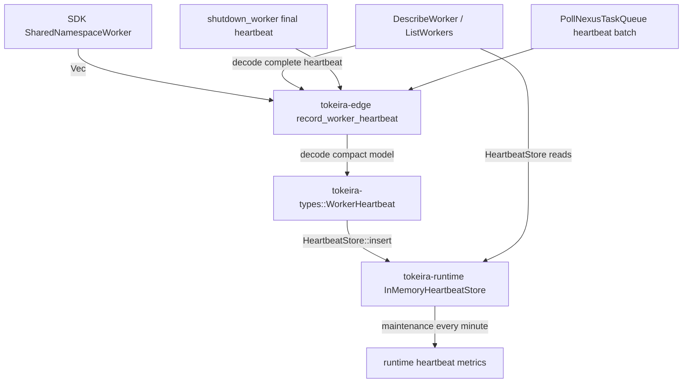

# Design Document: Worker Heartbeat Observability

## Overview

This spec promotes `RecordWorkerHeartbeat` from an accept-and-discard RPC to a supported observability and inventory path. The edge still owns Temporal proto translation, but the heartbeat data model and store trait live in `tokeira-types` so runtime and edge query code can share the contract without crate cycles. The compact model retains an opaque encoded heartbeat: runtime never depends on Temporal proto types, while the edge can return every worker-authored field exactly.

The implementation path is:



Core invariants:

- SDK-visible RPC surface is unchanged: empty response bodies remain empty, and `worker_heartbeats` stays advertised as `true`.
- The kernel is untouched. Heartbeats are observations, not authoritative workflow transitions.
- Runtime does not depend on edge. The shared heartbeat model and trait live in `tokeira-types`.
- Metrics do not rely on unsupported per-series deletion in the current Prometheus exporter. Eviction sets an active gauge to `0`.
- Staleness is sampled by a maintenance loop, not by recording `0.0` at accept time.
- `WORKER_STATUS_SHUTDOWN` removes the observation immediately; a final heartbeat is not a durable tombstone.
- Inventory reads expose the complete admitted heartbeat and never consult workflow history, projection, or the kernel.

## Component Design

### 1. Shared Types in `tokeira-types`

The shared model is intentionally compact for runtime operations. `encoded_heartbeat` is the lossless response image: it prevents a parallel domain mirror of every host, slot, poller, plugin, driver, timestamp, and counter field while keeping `tokeira-runtime` independent of `tokeira-proto`. This follows the established opaque-wire-payload pattern used for SDK metadata; only the edge may interpret the bytes.

```rust
// crates/tokeira-types/src/worker_heartbeat.rs

use serde::{Deserialize, Serialize};
use prost::Message as _;
use time::OffsetDateTime;

use crate::{NamespaceId, TaskQueueName, WorkerIdentity};

#[derive(Clone, Debug, PartialEq, Eq, Hash, Serialize, Deserialize)]
pub struct WorkerInstanceKey(pub String);

#[derive(Clone, Debug, PartialEq, Eq, Serialize, Deserialize)]
pub struct WorkerHeartbeat {
    pub namespace_id: NamespaceId,
    pub worker_instance_key: WorkerInstanceKey,
    pub task_queue: TaskQueueName,
    pub worker_identity: WorkerIdentity,
    pub last_seen: OffsetDateTime,
    pub status: WorkerHeartbeatStatus,
    pub build_id: Option<String>,
    pub deployment_name: Option<String>,
    pub sdk_name: Option<String>,
    pub sdk_version: Option<String>,
    /// Complete protobuf-encoded heartbeat, opaque outside the edge.
    pub encoded_heartbeat: Vec<u8>,
}

#[derive(Clone, Copy, Debug, PartialEq, Eq, Serialize, Deserialize)]
pub struct WorkerHeartbeatStatus(pub i32);
```

This avoids the invalid earlier assumptions that `tokeira_types::Timestamp`, `tokeira_types::Duration`, and an edge `WorkerDeploymentVersion` DTO already exist. Timestamps use the codebase's existing `time::OffsetDateTime` convention. The compact deployment fields are simple strings until `worker-deployments` defines richer deployment DTOs.

### 2. Neutral Store Trait

The trait also lives in `tokeira-types`; the runtime provides the default concrete implementation.

```rust
// crates/tokeira-types/src/worker_heartbeat.rs

use thiserror::Error;
use time::OffsetDateTime;

#[derive(Clone, Debug, Default, PartialEq, Eq, Serialize, Deserialize)]
pub struct EvictionReport {
    pub ttl_evicted: Vec<(NamespaceId, WorkerInstanceKey)>,
    pub capacity_evicted: Vec<(NamespaceId, WorkerInstanceKey)>,
    pub live: Vec<WorkerHeartbeat>,
    pub namespace_counts: Vec<(NamespaceId, usize)>,
    pub remaining: usize,
}

#[derive(Debug, Error)]
pub enum HeartbeatStoreError {
    #[error("heartbeat store backend error: {0}")]
    Backend(String),
}

pub trait HeartbeatStore: Send + Sync + 'static {
    fn insert(&self, heartbeat: WorkerHeartbeat) -> Result<(), HeartbeatStoreError>;

    fn get_worker(
        &self,
        namespace: &NamespaceId,
        worker_instance_key: &WorkerInstanceKey,
    ) -> Result<Option<WorkerHeartbeat>, HeartbeatStoreError>;

    fn list_workers(
        &self,
        namespace: &NamespaceId,
    ) -> Result<Vec<WorkerHeartbeat>, HeartbeatStoreError>;

    fn maintain(
        &self,
        now: OffsetDateTime,
        ttl: time::Duration,
        min_evict_age: time::Duration,
        max_entries: usize,
    ) -> Result<EvictionReport, HeartbeatStoreError>;
}
```

This is intentionally similar to the existing repository pattern: neutral contract plus concrete implementation. It differs from `RunRepository` only in crate placement because the heartbeat store is in-memory and shared by edge/runtime/query paths, while durable run storage lives under `tokeira-storage`.

### 3. Edge Decoder

The edge translator converts upstream proto into the compact model. The handler supplies namespace and server receipt time so freshness accounting is server-authored.

```rust
// crates/tokeira-edge/src/translate/worker_heartbeat/from_proto.rs

use time::OffsetDateTime;
use tokeira_proto::public::temporal::api::worker::v1 as proto_worker;
use tokeira_types::{
    NamespaceId, TaskQueueName, WorkerHeartbeat, WorkerIdentity, WorkerInstanceKey,
};

pub fn worker_heartbeat_from_proto(
    namespace_id: NamespaceId,
    proto: proto_worker::WorkerHeartbeat,
    now: OffsetDateTime,
) -> WorkerHeartbeat {
    let encoded_heartbeat = proto.encode_to_vec();
    tracing::trace!(
        worker_instance_key = %proto.worker_instance_key,
        "decoded worker heartbeat",
    );

    let (build_id, deployment_name) = proto
        .deployment_version
        .map(|version| (Some(version.build_id), Some(version.deployment_name)))
        .unwrap_or((None, None));

    WorkerHeartbeat {
        namespace_id,
        worker_instance_key: WorkerInstanceKey(proto.worker_instance_key),
        task_queue: TaskQueueName(proto.task_queue),
        worker_identity: WorkerIdentity(proto.worker_identity),
        last_seen: now,
        status: WorkerHeartbeatStatus(proto.status),
        build_id,
        deployment_name,
        sdk_name: non_empty(proto.sdk_name),
        sdk_version: non_empty(proto.sdk_version),
        encoded_heartbeat,
    }
}

fn non_empty(value: String) -> Option<String> {
    if value.is_empty() { None } else { Some(value) }
}
```

The reverse translator decodes `encoded_heartbeat` into the public proto. Empty bytes are accepted only for legacy/test records and reconstruct the compact fields with all unavailable fields defaulted. Production ingestion always supplies the complete encoding. A property test generates every upstream field and proves `from_proto -> to_proto` equality.

The decoder is permissive. It does not reject empty fields, absent sub-messages, unknown enums, or missing timestamps. Empty strings become empty domain newtypes where the domain model requires a value. Empty `sdk_name` and `sdk_version` are normalized to `None` because empty SDK metadata carries no operator signal and should be treated the same as absent metadata.

### 4. Runtime Store Implementation

`tokeira-runtime` owns `InMemoryHeartbeatStore`.

Preferred implementation:

- `DashMap<(NamespaceId, WorkerInstanceKey), WorkerHeartbeat>` for sharded concurrency.
- An atomic/live count or cheap snapshot method for metrics.
- A maintenance loop that scans the map for staleness sampling and eviction.

Manual bucket implementation is acceptable only if it hashes the full `(NamespaceId, WorkerInstanceKey)` key:

```rust
fn bucket_index(namespace: &NamespaceId, key: &WorkerInstanceKey) -> usize {
    stable_hash(namespace, key) % DEFAULT_BUCKETS
}
```

Hashing by namespace alone is rejected because the default namespace is the common hot path and would collapse all writes onto one mutex.

`list_workers(namespace)` scans all shards/buckets and filters by namespace. This is intentionally not optimized for the heartbeat hot path; listing is an operator/query operation.

### 5. Retention and Maintenance

Constants:

```rust
pub const DEFAULT_ENTRY_TTL: time::Duration = time::Duration::minutes(5);
pub const DEFAULT_MIN_EVICT_AGE: time::Duration = time::Duration::minutes(1);
pub const DEFAULT_MAX_ENTRIES: usize = 1_000_000;
pub const DEFAULT_BUCKETS: usize = 10;
pub const DEFAULT_MAINTENANCE_INTERVAL: time::Duration = time::Duration::minutes(1);
```

These are the stock defaults from `common/dynamicconfig/constants.go:1477-1508 @ v1.31.0`. Tokeira fixes them as constants under the conformance configuration convention; it does not introduce deployment knobs.

The maintenance loop runs every minute. Each pass:

1. Takes a snapshot/iteration over live entries.
2. Records `now - last_seen` into `tokeira_worker_last_heartbeat_age_seconds{namespace}` for each entry returned in `EvictionReport::live`.
3. Calls `maintain(now, DEFAULT_ENTRY_TTL, DEFAULT_MIN_EVICT_AGE, DEFAULT_MAX_ENTRIES)` so TTL and capacity eviction use a deterministic caller-supplied clock.
4. Applies capacity eviction if total entries exceed `DEFAULT_MAX_ENTRIES`, respecting `DEFAULT_MIN_EVICT_AGE`.
5. Iterates `ttl_evicted` and `capacity_evicted` from `EvictionReport` and sets `tokeira_worker_heartbeat_active_state{namespace, worker_instance_key}` to `0` for each evicted entry.
6. Uses `EvictionReport::namespace_counts` and `remaining` to update `tokeira_worker_heartbeat_entries_observed{namespace}` and `tokeira_worker_heartbeat_entries_total`.

Staleness is sampled during maintenance rather than on heartbeat accept. Recording `0.0` on accept would never show a stuck worker becoming stale.

### 6. Handler Migration

`record_worker_heartbeat` resolves the namespace through the live registry, decodes all heartbeat payloads, and inserts them individually. This restores v1.31.0's typed empty/unknown namespace errors instead of hashing an unregistered name locally.

`WorkflowService` owns an `Arc<dyn HeartbeatStore>` supplied by `apps/tokeirad` from the runtime-owned `InMemoryHeartbeatStore`. `WorkflowServiceGrpc` continues to wrap `WorkflowService`; handlers reach the store through `self.inner.heartbeat_store()` or an equivalent edge-owned accessor. This keeps the concrete runtime store out of `tokeira-edge` while making the store available to gRPC handlers.

```rust
async fn record_worker_heartbeat(
    &self,
    request: Request<workflowservice::RecordWorkerHeartbeatRequest>,
) -> Result<Response<workflowservice::RecordWorkerHeartbeatResponse>, Status> {
    let req = request.into_inner();
    let namespace_id = self.resolve_namespace_id(&req.namespace).await?;
    let now = OffsetDateTime::now_utc();
    let heartbeat_count = req.worker_heartbeat.len();

    for proto in req.worker_heartbeat {
        let heartbeat = worker_heartbeat_from_proto(namespace_id, proto, now);
        let key = heartbeat.worker_instance_key.clone();
        let active = heartbeat.status.0 != WORKER_STATUS_SHUTDOWN;
        self.inner
            .heartbeat_store()
            .insert(heartbeat)
            .map_err(|error| {
                metrics::record_heartbeat_rejected(&req.namespace, "store_error");
                Status::internal(error.to_string())
            })?;
        metrics::record_heartbeat_accepted(namespace_id, &key);
        metrics::record_heartbeat_active(namespace_id, &key, active);
    }

    tracing::debug!(
        rpc = "RecordWorkerHeartbeat",
        namespace = %req.namespace,
        heartbeat_count,
        "worker heartbeat batch accepted",
    );

    Ok(Response::new(workflowservice::RecordWorkerHeartbeatResponse {}))
}
```

`shutdown_worker` submits the optional final heartbeat before cancelling worker polls. The store interprets `WORKER_STATUS_SHUTDOWN` as an idempotent delete, matching `upsertHeartbeats` in `service/matching/workers/registry_impl.go:76-108 @ v1.31.0`. Store failure logs a warning and does not block shutdown.

### 7. Metrics

Metric reference:

| Metric | Type | Labels | Source |
|---|---|---|---|
| `tokeira_worker_heartbeats_accepted_total` | counter | `namespace`, `worker_instance_key` | Incremented on successful insert. |
| `tokeira_worker_heartbeats_rejected_total` | counter | `namespace`, `reason` | Incremented for invalid namespace or store error. |
| `tokeira_worker_heartbeat_entries_observed` | gauge | `namespace` | Set after insert/maintenance. |
| `tokeira_worker_heartbeat_entries_total` | gauge | none | Set after insert/maintenance. |
| `tokeira_worker_heartbeat_active_state` | gauge | `namespace`, `worker_instance_key` | `1` for live entries, `0` after eviction. |
| `tokeira_worker_last_heartbeat_age_seconds` | histogram | `namespace` | Sampled by maintenance loop from current live entries. |

Per-series unregister is explicitly not part of the design. The currently installed Prometheus recorder does not expose a reliable per-series deletion contract through the `metrics` crate. Dashboards filter live workers via `tokeira_worker_heartbeat_active_state == 1`; stale series may remain until process restart or Prometheus-side staleness handling.

### 8. Worker Inventory Queries

No `tokeira-projection -> tokeira-runtime` dependency is added. `DescribeWorker` and `ListWorkers` read through `Arc<dyn HeartbeatStore>` from `tokeira-types`; this is a live observation registry, not a materialized visibility view.

Contract:

```rust
fn list_workers(namespace: &NamespaceId) -> Result<Vec<WorkerHeartbeat>, HeartbeatStoreError>;

fn get_worker(
    namespace: &NamespaceId,
    worker_instance_key: &WorkerInstanceKey,
) -> Result<Option<WorkerHeartbeat>, HeartbeatStoreError>;
```

The gRPC edge decodes each record's `encoded_heartbeat`. `DescribeWorker` wraps the complete proto in `WorkerInfo`. `ListWorkers` populates both the deprecated complete `workers_info` and the limited `WorkerListInfo`, copying the same fields as `workerHeartbeatToListInfo` in `service/matching/handler.go:638-658 @ v1.31.0`.

The worker-query evaluator is an edge-owned, side-effect-free recursive parser. It supports the v1.31.0 field/operator grammar from `service/matching/workers/worker_query_engine.go @ v1.31.0`: string/status equality, inequality, prefix and null predicates; timestamp comparisons, ranges and null predicates; and parenthesized `AND`/`OR`. It evaluates decoded heartbeat values and returns `INVALID_ARGUMENT` for malformed or unsupported expressions. No general SQL engine or new dependency is introduced for this bounded grammar.

Pagination is a cursor over `worker_instance_key`. A paginated result is sorted, the token contains only the last returned key, and the next read begins at the first strictly greater key. That keeps traversal valid if the cursor worker is evicted between requests (`paginateWorkers`, `service/matching/workers/registry_impl.go:394-458 @ v1.31.0`).

### 9. Nexus poll heartbeat ingestion

`PollNexusTaskQueue` separates `worker_heartbeat` from the translated broker request. After task-queue validation and namespace resolution, the gRPC edge inserts each observation before entering the long poll. Insert errors are logged and ignored because Temporal routes this batch asynchronously and treats it as best effort (`service/frontend/workflow_handler.go:5957-5978 @ v1.31.0`). Tokeira performs the in-memory insert synchronously so a concurrent inventory read cannot miss an already-admitted batch; this strengthens read-after-write without putting the heartbeat on the Nexus delivery path.

### 10. Surface_Audit Amendment

This spec amends the prior v1.62-sync audit in place:

- `WorkflowService.RecordWorkerHeartbeat`: observation-backed ingestion.
- `WorkflowService.DescribeWorker` and `WorkflowService.ListWorkers`: live inventory reads owned by this spec, not worker deployment/configuration state.
- Implementation notes: "accept, decode compact heartbeat model plus lossless response image, insert into `HeartbeatStore`, emit metrics, query live inventory".

The upstream worker sub-message rows remain generated proto surface rather than parallel Tokeira DTOs. Full response fidelity is supplied by the edge-owned opaque encoding, so runtime stays proto-free and no worker-deployment DTO is invented.

### 11. Correctness Properties

1. **Decode compact mirror**: For any upstream heartbeat proto, decoded in-scope fields match the proto input and missing optional metadata maps to `None`.
2. **Store last-write-wins**: Repeated inserts for the same `(NamespaceId, WorkerInstanceKey)` leave the latest heartbeat visible.
3. **Monotonic last_seen**: A newer insert cannot reduce `last_seen` for an existing key.
4. **Shard distribution**: For a single namespace and many worker keys, either `DashMap` sharding is used or manual bucket indices cover more than one bucket.
5. **Maintenance staleness**: A worker that stops heartbeating produces increasing age samples on later maintenance passes.
6. **Eviction active gauge**: Evicted workers set `tokeira_worker_heartbeat_active_state` to `0`; counters are not unregistered or reset.
7. **Handler parity**: Introduced paths never return `Unimplemented`; success responses remain empty proto responses.
8. **Kernel purity**: `tokeira-kernel` dependency and transition surfaces remain unchanged.
9. **Lossless heartbeat response**: For every generated upstream heartbeat, decode then encode produces an equal proto including all nested messages and counters.
10. **Shutdown removal**: A shutdown heartbeat removes exactly its `(namespace, worker key)` and repeating it is a no-op.
11. **Cursor pagination**: Traversing arbitrary page sizes returns every matching worker once in key order, including when a prior cursor entry disappears.
12. **Query agreement**: Generated supported expressions produce the same matches as a reference evaluator; malformed/unsupported expressions reject without partial results.
13. **Nexus piggyback visibility**: A piggybacked heartbeat is visible before the poll completes, while a store failure cannot fail the poll.

### 12. Testing Strategy

- `tokeira-types`: serialization round-trips for `WorkerHeartbeat` and `WorkerInstanceKey`; trait object compile tests if needed.
- `tokeira-edge`: lossless translator property tests; Describe/List response, query, error, and pagination tests; Nexus piggyback tests; handler tests for accepted batches, empty batches, malformed-but-proto-valid heartbeats, and store errors.
- `tokeira-runtime`: store property tests for last-write-wins, monotonic `last_seen`, shutdown removal, key-distributed sharding, maintenance staleness snapshots, eviction, active gauge updates, and count gauges.
- `temporal-api-v1.62-sync` audit structural test: verifies all three worker-inventory rows are implemented and owned here.

No tests require Docker, AWS, live DSQL, or network access.
