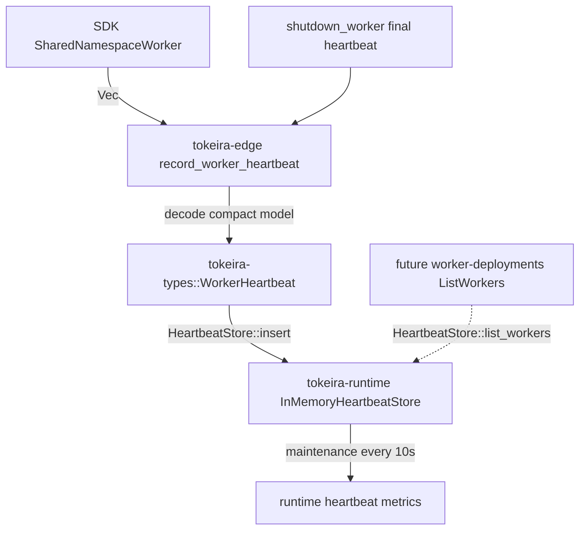

# Design Document: Worker Heartbeat Observability

## Overview

This spec promotes `RecordWorkerHeartbeat` from an accept-and-discard RPC to a supported observability path. The edge still owns Temporal proto translation, but the heartbeat data model and store trait live in `tokeira-types` so runtime, edge, and future worker-query code can share the contract without crate cycles.

The implementation path is:



Core invariants:

- SDK-visible RPC surface is unchanged: empty response bodies remain empty, and `worker_heartbeats` stays advertised as `true`.
- The kernel is untouched. Heartbeats are observations, not authoritative workflow transitions.
- Runtime does not depend on edge. The shared heartbeat model and trait live in `tokeira-types`.
- Metrics do not rely on unsupported per-series deletion in the current Prometheus exporter. Eviction sets an active gauge to `0`.
- Staleness is sampled by a maintenance loop, not by recording `0.0` at accept time.

## Component Design

### 1. Shared Types in `tokeira-types`

The shared model is intentionally compact. It stores the fields needed for worker liveness, basic operator queries, and future `ListWorkers`/`DescribeWorker` backing. Full upstream sub-message fidelity remains deferred to `worker-deployments`, which owns any SDK-visible response encode path.

```rust
// crates/tokeira-types/src/worker_heartbeat.rs

use serde::{Deserialize, Serialize};
use time::OffsetDateTime;

use crate::{NamespaceId, TaskQueueName, WorkerIdentity};

#[derive(Clone, Debug, PartialEq, Eq, Hash, Serialize, Deserialize)]
pub struct WorkerInstanceKey(pub String);

#[derive(Clone, Debug, PartialEq, Eq, Serialize, Deserialize)]
pub struct WorkerHeartbeat {
    pub namespace_id: NamespaceId,
    pub worker_instance_key: WorkerInstanceKey,
    pub task_queue: TaskQueueName,
    pub worker_identity: WorkerIdentity,
    pub last_seen: OffsetDateTime,
    pub status: WorkerHeartbeatStatus,
    pub build_id: Option<String>,
    pub deployment_name: Option<String>,
    pub sdk_name: Option<String>,
    pub sdk_version: Option<String>,
}

#[derive(Clone, Copy, Debug, PartialEq, Eq, Serialize, Deserialize)]
pub struct WorkerHeartbeatStatus(pub i32);
```

This avoids the invalid earlier assumptions that `tokeira_types::Timestamp`, `tokeira_types::Duration`, and an edge `WorkerDeploymentVersion` DTO already exist. Timestamps use the codebase's existing `time::OffsetDateTime` convention. The compact deployment fields are simple strings until `worker-deployments` defines richer deployment DTOs.

### 2. Neutral Store Trait

The trait also lives in `tokeira-types`; the runtime provides the default concrete implementation.

```rust
// crates/tokeira-types/src/worker_heartbeat.rs

use thiserror::Error;
use time::OffsetDateTime;

#[derive(Clone, Debug, Default, PartialEq, Eq, Serialize, Deserialize)]
pub struct EvictionReport {
    pub ttl_evicted: Vec<(NamespaceId, WorkerInstanceKey)>,
    pub capacity_evicted: Vec<(NamespaceId, WorkerInstanceKey)>,
    pub live: Vec<WorkerHeartbeat>,
    pub namespace_counts: Vec<(NamespaceId, usize)>,
    pub remaining: usize,
}

#[derive(Debug, Error)]
pub enum HeartbeatStoreError {
    #[error("heartbeat store backend error: {0}")]
    Backend(String),
}

pub trait HeartbeatStore: Send + Sync + 'static {
    fn insert(&self, heartbeat: WorkerHeartbeat) -> Result<(), HeartbeatStoreError>;

    fn get_worker(
        &self,
        namespace: &NamespaceId,
        worker_instance_key: &WorkerInstanceKey,
    ) -> Result<Option<WorkerHeartbeat>, HeartbeatStoreError>;

    fn list_workers(
        &self,
        namespace: &NamespaceId,
    ) -> Result<Vec<WorkerHeartbeat>, HeartbeatStoreError>;

    fn maintain(
        &self,
        now: OffsetDateTime,
        ttl: time::Duration,
        min_evict_age: time::Duration,
        max_entries: usize,
    ) -> Result<EvictionReport, HeartbeatStoreError>;
}
```

This is intentionally similar to the existing repository pattern: neutral contract plus concrete implementation. It differs from `RunRepository` only in crate placement because the heartbeat store is in-memory and shared by edge/runtime/query paths, while durable run storage lives under `tokeira-storage`.

### 3. Edge Decoder

The edge translator converts upstream proto into the compact model. The handler supplies namespace and server receipt time so freshness accounting is server-authored.

```rust
// crates/tokeira-edge/src/translate/worker_heartbeat/from_proto.rs

use time::OffsetDateTime;
use tokeira_proto::public::temporal::api::worker::v1 as proto_worker;
use tokeira_types::{
    NamespaceId, TaskQueueName, WorkerHeartbeat, WorkerIdentity, WorkerInstanceKey,
};

pub fn worker_heartbeat_from_proto(
    namespace_id: NamespaceId,
    proto: proto_worker::WorkerHeartbeat,
    now: OffsetDateTime,
) -> WorkerHeartbeat {
    tracing::trace!(
        worker_instance_key = %proto.worker_instance_key,
        "decoded worker heartbeat",
    );

    let (build_id, deployment_name) = proto
        .deployment_version
        .map(|version| (Some(version.build_id), Some(version.deployment_name)))
        .unwrap_or((None, None));

    WorkerHeartbeat {
        namespace_id,
        worker_instance_key: WorkerInstanceKey(proto.worker_instance_key),
        task_queue: TaskQueueName(proto.task_queue),
        worker_identity: WorkerIdentity(proto.worker_identity),
        last_seen: now,
        status: WorkerHeartbeatStatus(proto.status),
        build_id,
        deployment_name,
        sdk_name: non_empty(proto.sdk_name),
        sdk_version: non_empty(proto.sdk_version),
    }
}

fn non_empty(value: String) -> Option<String> {
    if value.is_empty() { None } else { Some(value) }
}
```

The decoder is permissive. It does not reject empty fields, absent sub-messages, unknown enums, or missing timestamps. Empty strings become empty domain newtypes where the domain model requires a value. Empty `sdk_name` and `sdk_version` are normalized to `None` because empty SDK metadata carries no operator signal and should be treated the same as absent metadata.

### 4. Runtime Store Implementation

`tokeira-runtime` owns `InMemoryHeartbeatStore`.

Preferred implementation:

- `DashMap<(NamespaceId, WorkerInstanceKey), WorkerHeartbeat>` for sharded concurrency.
- An atomic/live count or cheap snapshot method for metrics.
- A maintenance loop that scans the map for staleness sampling and eviction.

Manual bucket implementation is acceptable only if it hashes the full `(NamespaceId, WorkerInstanceKey)` key:

```rust
fn bucket_index(namespace: &NamespaceId, key: &WorkerInstanceKey) -> usize {
    stable_hash(namespace, key) % DEFAULT_BUCKETS
}
```

Hashing by namespace alone is rejected because the default namespace is the common hot path and would collapse all writes onto one mutex.

`list_workers(namespace)` scans all shards/buckets and filters by namespace. This is intentionally not optimized for the heartbeat hot path; listing is an operator/query operation.

### 5. Retention and Maintenance

Constants:

```rust
pub const DEFAULT_ENTRY_TTL: time::Duration = time::Duration::hours(24);
pub const DEFAULT_MIN_EVICT_AGE: time::Duration = time::Duration::minutes(10);
pub const DEFAULT_MAX_ENTRIES: usize = 1_000_000;
pub const DEFAULT_BUCKETS: usize = 10;
pub const DEFAULT_MAINTENANCE_INTERVAL: time::Duration = time::Duration::seconds(10);
```

The maintenance loop runs every 10 seconds. Each pass:

1. Takes a snapshot/iteration over live entries.
2. Records `now - last_seen` into `tokeira_worker_last_heartbeat_age_seconds{namespace}` for each entry returned in `EvictionReport::live`.
3. Calls `maintain(now, DEFAULT_ENTRY_TTL, DEFAULT_MIN_EVICT_AGE, DEFAULT_MAX_ENTRIES)` so TTL and capacity eviction use a deterministic caller-supplied clock.
4. Applies capacity eviction if total entries exceed `DEFAULT_MAX_ENTRIES`, respecting `DEFAULT_MIN_EVICT_AGE`.
5. Iterates `ttl_evicted` and `capacity_evicted` from `EvictionReport` and sets `tokeira_worker_heartbeat_active_state{namespace, worker_instance_key}` to `0` for each evicted entry.
6. Uses `EvictionReport::namespace_counts` and `remaining` to update `tokeira_worker_heartbeat_entries_observed{namespace}` and `tokeira_worker_heartbeat_entries_total`.

Staleness is sampled during maintenance rather than on heartbeat accept. Recording `0.0` on accept would never show a stuck worker becoming stale.

### 6. Handler Migration

`record_worker_heartbeat` keeps the existing namespace validation and empty response. It resolves namespace, decodes all heartbeat payloads, and inserts them individually.

`WorkflowService` owns an `Arc<dyn HeartbeatStore>` supplied by `apps/tokeirad` from the runtime-owned `InMemoryHeartbeatStore`. `WorkflowServiceGrpc` continues to wrap `WorkflowService`; handlers reach the store through `self.inner.heartbeat_store()` or an equivalent edge-owned accessor. This keeps the concrete runtime store out of `tokeira-edge` while making the store available to gRPC handlers.

```rust
async fn record_worker_heartbeat(
    &self,
    request: Request<workflowservice::RecordWorkerHeartbeatRequest>,
) -> Result<Response<workflowservice::RecordWorkerHeartbeatResponse>, Status> {
    let req = request.into_inner();
    if req.namespace.is_empty() {
        metrics::record_heartbeat_rejected("", "invalid_namespace");
        return Err(Status::invalid_argument("namespace is required"));
    }

    let namespace_id = to_internal::namespace_id_for(&req.namespace);
    let now = OffsetDateTime::now_utc();
    let heartbeat_count = req.worker_heartbeat.len();

    for proto in req.worker_heartbeat {
        let heartbeat = worker_heartbeat_from_proto(namespace_id, proto, now);
        self.inner
            .heartbeat_store()
            .insert(heartbeat)
            .map_err(|error| {
                metrics::record_heartbeat_rejected(&req.namespace, "store_error");
                Status::internal(error.to_string())
            })?;
        metrics::record_heartbeat_accepted(&req.namespace, &heartbeat.worker_instance_key);
        metrics::record_heartbeat_active(&req.namespace, &heartbeat.worker_instance_key, true);
    }

    tracing::debug!(
        rpc = "RecordWorkerHeartbeat",
        namespace = %req.namespace,
        heartbeat_count,
        "worker heartbeat batch accepted",
    );

    Ok(Response::new(workflowservice::RecordWorkerHeartbeatResponse {}))
}
```

`shutdown_worker` records the optional final heartbeat before `broker().deny_worker()`. Store failure logs a warning and does not block deny, matching upstream's best-effort final heartbeat behaviour.

### 7. Metrics

Metric reference:

| Metric | Type | Labels | Source |
|---|---|---|---|
| `tokeira_worker_heartbeats_accepted_total` | counter | `namespace`, `worker_instance_key` | Incremented on successful insert. |
| `tokeira_worker_heartbeats_rejected_total` | counter | `namespace`, `reason` | Incremented for invalid namespace or store error. |
| `tokeira_worker_heartbeat_entries_observed` | gauge | `namespace` | Set after insert/maintenance. |
| `tokeira_worker_heartbeat_entries_total` | gauge | none | Set after insert/maintenance. |
| `tokeira_worker_heartbeat_active_state` | gauge | `namespace`, `worker_instance_key` | `1` for live entries, `0` after eviction. |
| `tokeira_worker_last_heartbeat_age_seconds` | histogram | `namespace` | Sampled by maintenance loop from current live entries. |

Per-series unregister is explicitly not part of the design. The currently installed Prometheus recorder does not expose a reliable per-series deletion contract through the `metrics` crate. Dashboards filter live workers via `tokeira_worker_heartbeat_active_state == 1`; stale series may remain until process restart or Prometheus-side staleness handling.

### 8. Worker Query Backing

No `tokeira-projection -> tokeira-runtime` dependency is added. Future `worker-deployments` code reads through `Arc<dyn HeartbeatStore>` from `tokeira-types`.

Contract:

```rust
fn list_workers(namespace: &NamespaceId) -> Result<Vec<WorkerHeartbeat>, HeartbeatStoreError>;

fn get_worker(
    namespace: &NamespaceId,
    worker_instance_key: &WorkerInstanceKey,
) -> Result<Option<WorkerHeartbeat>, HeartbeatStoreError>;
```

The future encode translator and query filtering live in `worker-deployments`.

### 9. Surface_Audit Amendment

This spec amends the prior v1.62-sync audit in place:

- `WorkflowService.RecordWorkerHeartbeat`: `No-op` -> observation-backed implementation.
- Implementation notes: "accept, decode compact heartbeat model, insert into `HeartbeatStore`, emit metrics".

The upstream worker sub-message rows are not promoted to full wire-through DTO rows by this spec. They remain generated proto input surface, with compact decode owned here and full-fidelity response/encode work deferred to `worker-deployments`.

### 10. Correctness Properties

1. **Decode compact mirror**: For any upstream heartbeat proto, decoded in-scope fields match the proto input and missing optional metadata maps to `None`.
2. **Store last-write-wins**: Repeated inserts for the same `(NamespaceId, WorkerInstanceKey)` leave the latest heartbeat visible.
3. **Monotonic last_seen**: A newer insert cannot reduce `last_seen` for an existing key.
4. **Shard distribution**: For a single namespace and many worker keys, either `DashMap` sharding is used or manual bucket indices cover more than one bucket.
5. **Maintenance staleness**: A worker that stops heartbeating produces increasing age samples on later maintenance passes.
6. **Eviction active gauge**: Evicted workers set `tokeira_worker_heartbeat_active_state` to `0`; counters are not unregistered or reset.
7. **Handler parity**: Introduced paths never return `Unimplemented`; success responses remain empty proto responses.
8. **Kernel purity**: `tokeira-kernel` dependency and transition surfaces remain unchanged.

### 11. Testing Strategy

- `tokeira-types`: serialization round-trips for `WorkerHeartbeat` and `WorkerInstanceKey`; trait object compile tests if needed.
- `tokeira-edge`: translator property tests and handler tests for accepted batches, empty batches, malformed-but-proto-valid heartbeats, store errors, and `shutdown_worker` final heartbeat.
- `tokeira-runtime`: store property tests for last-write-wins, monotonic `last_seen`, key-distributed sharding, maintenance staleness snapshots, eviction, active gauge updates, and count gauges.
- `temporal-api-v1.62-sync` audit structural test: verifies the `RecordWorkerHeartbeat` row was amended and not reverted.

No tests require Docker, AWS, live DSQL, or network access.
