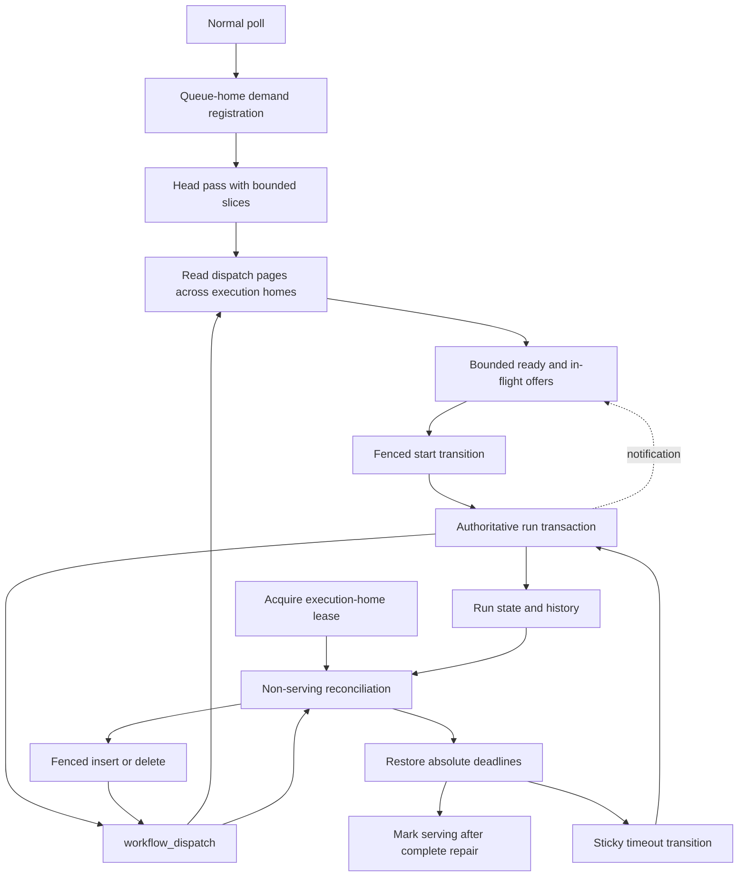

# Design Document: Durable Workflow-Task Dispatch

## Overview

Persist one narrow `workflow_dispatch` row per wanted workflow task, in the
transaction that persists its run. Queue homes discover normal work through
poll-registered, level-triggered passes. Delivery remains in memory; only a run
transition can start a task or change its dispatch intent. Acquisition repairs the
complete derived view before admitting commands.

This implements the workflow portion of
[042 Durable Actionable State](../../../docs/architecture/042-durable-actionable-state.md)
and the [approved requirements](requirements.md). It makes four choices that 042
leaves open or that inspection of current code requires:

1. Use a separate, narrow table, with normal-queue and execution-home indexes.
2. Make `(run_key, logical_seq)` a complete incarnation by allocating a new sequence
   for retained failure retries and resumed unstarted tasks, as well as fresh tasks.
3. Budget admissions per pass, and SQL work per scheduler slice. Yielding a slice
   preserves the pass's continuation; completing or interrupting a pass discards it.
4. Reconcile in two walks under an execution-home fence: authoritative candidates
   to restore missing rows, then all existing dispatch rows to remove stale rows.

Repository observations are pinned to `13b34ac64661efd1cc8745dc4934a1ac0872c01e`.
The wire authority is the vendored API v1.62.11; observable behavior targets Temporal
server v1.31.0. The authorities in requirements remain binding, particularly
`service/history/api/recordworkflowtaskstarted/api.go`,
`service/history/workflow/workflow_task_state_machine.go`,
`service/history/api/resetstickytaskqueue/api.go`, and
`service/matching/physical_task_queue_key.go`, all at v1.31.0. Internal sequence
allocation, SQL layout, and scan scheduling are Tokeira mechanisms.

## Dependencies and Non-Goals

### Owning relationships

| Owner | Contract consumed or changed here |
|---|---|
| Kernel | Pure task eligibility, incarnation allocation, start and timeout validation. No SQL, broker access, clock reads, or registry lookups. |
| Storage | One shared derivation, atomic maintenance on both stores, read-only pages, and fenced acquisition repair. |
| Runtime | Poll registration, queue-home discovery, bounded volatile offers, sticky timeout reconstruction, and the serving gate. |
| Worker deployments | Existing live routing resolver and authoritative start checks remain the authority for selecting and accepting a worker version. |
| Projection accumulator | Existing atomic accumulator maintenance and extension tag 3 remain intact in every commit and materialization path. |
| Lease fencing | Supply the transaction-local ownership contract below before enabling repair under competing execution-home owners. |
| Subsequent activity-discovery spec | Reuse range/page/scheduler contracts; move activity discovery and retire activity backlog there. No dependency in the reverse direction. |

The lease prerequisite is substantive. Current
[commit.rs](../../../crates/tokeira-storage/src/dsql/run_repository/commit.rs)
has a plain epoch read and a controller-mode separate check. Those do not establish
the conflict relationship in
[30_bundle_lease.tla](../../../spec/tla/30_bundle_lease.tla). Its passing protocol
requires a transaction-local `FOR KEY SHARE` read of owner/epoch, epoch membership
in a unique non-partial non-expression index, takeover/release that changes that
key, compatible renewal, and local expiry self-fencing. A separate successful
precheck cannot substitute for this contract.

The complete competing-owner design consumes that fence for run commits,
deletion, materialization, and repair; it does not redesign lease acquisition or
renewal. The initial implementation is explicitly single-owner: reconciliation
and backlog retirement can proceed with cancellation, failure handling, and the
non-serving gate intact. The lease protocol must land and pass its concurrency
tests before competing-owner repair is enabled. Requirements 8.4–8.6 and Property
9 remain deferred; single-owner results cannot discharge them. Verified SQLx
affected-row behavior is independent of this ownership dependency.

Operation rows, close intents, atomic successor creation, projection discovery,
admitted-update recovery, and speculative-task redesign are excluded. Preserve
their state and call paths. In particular, do not modify frozen extension layouts,
external-signal outcome mapping, or the speculative scheduling loop to implement
this feature. No new dependency or user-facing configuration is needed.

## Architecture



Execution-home ownership protects authoritative writes. Queue-home placement only
assigns discovery work: two homes may read and offer the same incarnation safely.
A queue-home scan is not restricted to the node's execution-home shards. A row
found while its execution home is still acquiring may be offered, but its start
cannot commit before that home serves.

The lifecycle authority is the run commit, with acquisition repair as the sole
history-free writer while the execution home is non-serving. Consumers never
prune a row because it looks stale. Physical run deletion also removes its derived
row in the existing fenced deletion transaction.

## Components and Interfaces

These are proposed interfaces, not declarations that the implementation exists.
Use existing repository error and future conventions when adding methods.

### Pure incarnation allocation in the kernel

Use `WorkflowState.next_workflow_task_seq`, already persisted, as the allocator.
Introduce one pure allocation helper used by normal scheduling and retained-task
renewal. Its result must be strictly greater than every previously allocated
sequence in the run; reject exhaustion before mutation rather than wrapping or
truncating a value for SQL storage.

```rust
fn allocate_workflow_task_seq(
    state: &mut WorkflowState,
) -> Result<LogicalTaskSeq, Reject>;

fn renew_pending_workflow_task_incarnation(
    state: &mut WorkflowState,
) -> Result<LogicalTaskSeq, Reject>;
```

The second helper changes the retained task's sequence and the allocator, not its
attempt, event IDs, schedule time, priority, or timeout policy. The caller remains
responsible for the existing semantic changes of that transition.

| Transition or delivery | Incarnation rule |
|---|---|
| Fresh normal schedule, including timeout reschedule | Allocate a sequence. |
| Failure retry that currently clears started state and retains a sequence | Allocate a sequence even when the Scheduled/Started event pair is suppressed. Keep existing attempt and virtual-event behavior. |
| Pending-task priority or version supersession | Use the existing rescheduling decision, allocating a sequence for the replacement; never let an old offer acquire the new delivery meaning. |
| Pause | Remove dispatch through derivation; a start must require `Running`, not merely `is_open()`. A previously started task can still follow its existing completion/failure policy. |
| Resume a retained unstarted normal task | Allocate a sequence before making it dispatchable, invalidating pre-pause offers. |
| Repeated publication, discovery, unrelated run transition | Retain the incarnation. |
| `ResetStickyTaskQueue` | Clear affinity under its existing transition; preserve the pending deadline. It need not invent a new task or history event. |
| Reset materialization | Derive for the new run key; never copy broker claims. A sequence in the new run cannot collide with the old run's identity. |
| Speculative task | No durable row. Conversion to a normal task uses the owning speculative contract; once startable as normal, it must satisfy this incarnation invariant. |

At normal start, require a running run, an unstarted pending task, and exact
sequence equality. A paused, absent, already-started, or superseded task cannot
acquire a new start. Successful start persists started state and removes the row
in one transaction. Completion tokens still describe the started task, not a
broker lease.

Advancing an internal sequence is not a reason to emit a new history event or
reset a worker-visible attempt. The retained-retry branch in
[kernel.rs](../../../crates/tokeira-kernel/src/kernel.rs),
`apply_workflow_task_failed`, must be changed without changing its transient
history rules. Temporal's internal repeated request-id start returns the recorded
outcome; it does not create a second start
(`recordworkflowtaskstarted/api.go @ v1.31.0`). Tokeira does not expose that internal
history-service RPC through its public WorkflowService. Its current runtime start
path instead treats an already-started task as stale, and a lost successful result
is recovered by timeout. Do not describe that path as a durable request-result
cache: the pending task does not store a start request ID today.

Keep one request ID and request value for an in-flight offer's submission retries
before a definite outcome. Reuse a confirmed result only where the existing caller
still holds it; an ambiguous result must not be fabricated from a new start. A fresh
rediscovered offer is a new submission, fenced by the pending sequence. Preserve
existing public repeated-request/token behavior and history request IDs. Tests must
distinguish repeat responses from repeat commits, without introducing a new public
RPC or persistent request-result ledger for the private start operation.

No serialized kernel field or state-extension tag is added. Existing bytes decode
as before. Stop-the-world upgrade drops all old volatile offers; acquisition uses
the persisted pending sequence, and the first subsequent retry uses the corrected
allocator. Replay/reset tests must check allocator monotonicity relative to the
reconstructed state; a reset's fresh run key separates its lineage from offers
against the source run.

### Shared derivation and repository methods

Add `crates/tokeira-storage/src/workflow_dispatch.rs` for pure derivation and row
types. Reuse existing routing IDs, `Priority`, and serialization support. The
execution-home argument is deterministic placement context, matching the bundle
written into `workflow_hot.shard_id`; it is never `shard_for(run_key)` by accident.

```rust
fn derive_workflow_dispatch(
    state: &WorkflowState,
    execution_home: BundleId,
) -> Option<WorkflowDispatchRow>;

// RunRepository additions; all page methods are read-only.
async fn list_workflow_dispatch_page(
    &self,
    range: &WorkflowDiscoveryRange,
    after: Option<WorkflowDispatchPosition>,
    limit: NonZeroU32,
) -> Result<WorkflowDispatchPage>;

async fn list_workflow_dispatch_for_home(
    &self,
    home: BundleId,
    after: Option<RunKey>,
    limit: NonZeroU32,
) -> Result<Vec<RunKey>>;

async fn reconcile_workflow_dispatch_run(
    &self,
    home: ShardId,
    run_key: RunKey,
) -> Result<()>;
```

The implemented repair interface carries a single-owner execution home. The caller
holds its local writer barrier throughout acquisition. Tasks 17–18 will add the
transaction-local `ExecutionHomeFence`; this interface makes no competing-owner
claim. A typed `WorkflowDispatchRepairConflict` requests a whole-call retry.

`Derive` returns a row exactly when status is `Running`, the pending task is
unstarted, and its type is normal. A transient retry is normal for this purpose.
Derivation reads no prior dispatch row, registry, broker, or wall clock. It always
takes the deadline from the pending task, even after affinity has been cleared.
A notification-only sticky destination additionally requires a nonempty sticky
queue and a recoverable pending deadline. A legacy affinity record without that
deadline uses the normal delivery fallback, without changing durable affinity;
it must not become an unscannable row with no timeout path.
The legacy delivery helper in [api.rs](../../../crates/tokeira-storage/src/api.rs),
`dispatchable_workflow_task`, shares Running/unstarted and sticky classification,
but also delivers stored speculative tasks for recovery and existing listing
callers. Its eligibility is deliberately broader than durable row derivation;
speculative tasks must remain deliverable without acquiring a durable row.

Both [memory.rs](../../../crates/tokeira-storage/src/memory.rs) and DSQL commit
paths apply the same result. For `Some(row)`, upsert the complete row; for `None`,
delete by run key. Do this within the existing commit/memory critical section,
after rejection/deduplication gates, including reset materialization. Rollback
rolls back both state and dispatch. Do not add another projection-log read or move
accumulator maintenance outside that transaction.

DSQL reset materialization places the successor's `workflow_hot`, `timer_bucket`,
and eligible `workflow_dispatch` rows at
`execution_home_bundle(namespace_id, workflow_id)`, matching ordinary commits.
Do not place hot state or timers by successor run-key hash and rely on a later
commit to move them. A multi-shard live regression must distinguish those two
placements and inspect all three immediately after materialization.

The initial implementation deliberately performs one dispatch maintenance
statement per state-changing commit, including an idempotent delete when no row is
wanted. This is more conservative than 042's schedule/start-only cost estimate.
Avoiding unchanged writes is a later measured optimization that must retain the
same invariant without making old dispatch state authoritative.

### Queue-home discovery and broker integration

Add `crates/tokeira-runtime/src/discovery.rs`, owned by runtime startup/shutdown,
with a demand registry and a fair scheduler. The activity successor can implement
the same paging and admission protocol using its own row, due-time order, and
incarnation types. Do not add activity scans to this loop yet.

```rust
trait DiscoverySource {
    type Range;
    type Position: Clone;
    type Candidate;

    async fn page(
        &self,
        range: &Self::Range,
        after: Option<Self::Position>,
        limit: NonZeroU32,
    ) -> Result<DiscoveryPage<Self::Position, Self::Candidate>>;
}

struct DiscoveryPage<P, C> {
    candidates: Vec<C>,
    last_examined: Option<P>,
    exhausted: bool,
}

fn register_poll(&self, demand: WorkflowPollDemand) -> PollDemandGuard;
async fn run_slice(&self, pass: &mut WorkflowPass) -> Result<SliceOutcome>;
```

`last_examined` advances even if every candidate is held or unservable. A page's
position is a typed value, never an externally supplied SQL fragment. `WorkflowPass`
owns its range, continuation, admission count, and counters. It is discarded on
completion, cancellation, or failure and never persisted. `SliceOutcome::Yield`
retains that same pass; it is not a new traversal.

Register normal poll demand before attempting immediate broker take, so a poll
that finds no publication still starts discovery. Registration is reference-counted
by queue family and compatible routing coordinates, with a guard for each active
poll. Coalesce a family's live-routing range rather than scanning it once per
worker version. New demand wakes the scheduler; continuing demand receives
periodic passes. A broker restart recreates registrations on subsequent polls.

Keep a registration while it has active poll guards. When its last poll ends,
retain registration and any open pass for a 30-second idle grace period so ordinary
long-poll renewal does not restart a long traversal. Pause admission while no
compatible poll demand exists. Renewed demand within grace resumes the same pass.
Bound idle registrations to 4,096 per home and evict least-recently-used idle entries
under pressure; never evict an active registration for this reason. At expiry or
eviction discard its continuation and unneeded ready offers. In-flight entries
survive only until their outcome or lease expiry.

Registration space is proportional to active poll keys plus 4,096 idle keys and
bounded executing work, not the number of queues ever seen. Renewed demand after
retirement recreates discovery at the head. Eventual progress assumes compatible
demand stays registered across the required traversal, including renewal within
the grace period without repeated idle eviction. An infinite sequence of cancelled
or evicted passes is outside the finite-interruption assumption.

## Data Models

### Durable row and routing policy

Choose a separate table rather than columns of `workflow_hot`: scans need compact
delivery coordinates, not serialized run state; row lifetime is only the unstarted
task; and a separate acquisition index can enumerate orphan/stale rows. The cost
is an additional maintenance statement and index writes. Hydrating a candidate
for live routing or start still reads authoritative state when needed.

| Field | SQL type | Source and contract |
|---|---|---|
| `run_key` | UUID primary key | Slot identity, existing `RunKey`. |
| `shard_id` | UUID, not null | Existing SQL encoding of execution-home bundle; same derivation as hot state. |
| `queue_namespace` | UUID, not null | State namespace. |
| `queue_name` | TEXT, not null | Current sticky queue when real affinity holds, otherwise the normal task queue. |
| `normal_queue_name` | TEXT, not null | State's normal task queue, needed for fallback. |
| `sticky` | BOOLEAN, not null | Whether this row's destination is the per-worker sticky queue. Independent of whether a pending deadline survives an affinity reset. |
| `routing_mode` | SMALLINT, not null | `0 = Live`, `1 = Exact`; classification below. |
| `deployment`, `build_id` | nullable TEXT | Exact coordinates for Exact mode; null for Live. Full strings are retained for collision-safe matching. |
| `queue_key`, `deployment_key`, `build_key` | TEXT, not null | Fixed-width lookup digests, defined below. |
| `logical_seq` | BIGINT, not null | Current pending incarnation, checked conversion without truncation. |
| `scheduled_at` | TIMESTAMPTZ, not null | Pending task schedule time, never discovery time. |
| `priority_key` | SMALLINT, not null | Existing normalized workflow priority band. |
| `priority_data` | nullable BYTEA | Existing priority/fairness metadata; no persisted broker fair-pass counter. |
| `sticky_worker` | nullable TEXT | Current affinity's worker identity, for notification delivery. |
| `schedule_to_start_deadline` | nullable TIMESTAMPTZ | Pending task's absolute deadline, including after ResetStickyTaskQueue. |

There is no claim, acknowledgement, retry counter, lease, delivery owner, history
payload, or workflow input in this table. Application validation enforces enum and
nullability relationships; DSQL `CHECK` constraints are not used.

Both backends normalize derived timestamps to SQLx's whole-microsecond
TIMESTAMPTZ representation (truncation toward zero relative to 2000-01-01 UTC).
This keeps keyset positions and derived row equality identical across backends;
authoritative pending state retains its original timestamp precision.

`Exact` preserves explicit queue coordinates already stored in state when
`state.deployment` is present, including its optional build ID. The publisher
already treats these coordinates as resolved. `Live` covers every other task,
including worker-deployment pinned/transition policies as well as
unversioned/current/ramping and auto-upgrade policies. Although some of those
policies have a fixed target, they still pass through the existing deployment
resolver and its feature-mode handling. Keeping them in Live makes derivation a
function of state alone, independent of registry availability or runtime feature
toggles. It trades extra candidate reads for preserving that contract. A row never
freezes a registry target merely because it was current when scheduling committed.

The classifier and resolver must preserve precedence in
`route_workflow_task_queue` in [publisher.rs](../../../crates/tokeira-runtime/src/publisher.rs)
and `resolve_workflow_task_target_version` in
[runtime/workflow_task.rs](../../../crates/tokeira-runtime/src/runtime/workflow_task.rs).
For Live candidates, load current state, reject mismatched sequence/eligibility
locally, and use that resolver and registry to find a registered compatible poller.
Do this before admission, without changing rows. A registry change takes effect
on a subsequent resolution; the existing start path revalidates the offered target.
An Exact candidate is also subject to authoritative start validation. Disabled
deployment-routing mode preserves its existing unversioned/legacy behavior through
the same Live range; no policy-selected version has been hidden in an Exact range.
Implementation tests must cover classification and range selection in both modes.

Each admitted versioned normal poll selects its Exact coordinates and its family's
Live range. Unversioned polls select only the Live range: the committed classifier
places tasks without explicit deployment coordinates there, so no separate
unversioned Exact range exists. Routing configuration can change without rewriting every
run or requiring a notification. Sticky delivery uses the same resolver, including
the existing compatible normal fallback; registry reads never clear sticky state.

### Indexes and ordered reads

Index raw names indirectly to keep long, otherwise valid names out of the compound
index's key-size budget. Use SHA-256 from the existing storage dependency, encoded
as 64 lowercase hexadecimal ASCII characters. Digest input is domain-separated,
length-prefixed UTF-8, with an explicit absent/present byte for optional values.
`None` and `Some("")` differ. Queue, deployment, and build domains differ. No new
name limit is imposed on a public API by this index.

Digests are lookup hints, not identities. Return raw coordinates and compare them
exactly before admission. A collision can add reads, never deliver another queue's
task. Include collision cases through an injected test hasher. Live mode uses the
canonical absent deployment/build digests and one queue-family range. Inactive
sticky ranges are absent from the normal index.

```sql
CREATE INDEX ASYNC idx_workflow_dispatch_queue
ON workflow_dispatch (
    queue_namespace, queue_key, routing_mode, deployment_key, build_key,
    priority_key, scheduled_at, run_key
)
WHERE sticky = false;

CREATE INDEX ASYNC idx_workflow_dispatch_home
ON workflow_dispatch (shard_id, run_key);
```

The first implementation reserves V074 for the table, V075 for the queue index,
and V076 for the home index, following the immutable V073 prefix. Each is a
separate forward-only statement; merged migrations are never renumbered. The
queue index has eight key columns, with bounded
digest widths; its partial predicate removes notification-only sticky rows. The
home index is deliberately complete because reconciliation must find sticky,
normal, and stale rows. No covering payload columns or time-dependent predicates
are needed. Await successful asynchronous index construction before readiness.
AWS documents the [index syntax and partial-predicate rules](https://docs.aws.amazon.com/aurora-dsql/latest/userguide/create-index-syntax-support.html).

The first page reads the equality-prefixed range in tuple order. Continuation is
logically `(priority_key, scheduled_at, run_key) > (p, t, k)`, but a tuple comparison
was a residual filter in DSQL. The implementation uses three disjoint seeks:

```sql
-- Each branch also has the same namespace/queue/routing equality prefix.
priority_key = $p AND scheduled_at = $t AND run_key > $k
priority_key = $p AND scheduled_at > $t
priority_key > $p
```

Each branch selects only index-covered ordering keys, orders by the complete
position and takes at most one page. A single `UNION ALL` statement orders their
bounded results, materializes at most one page, then joins those keys to fetch
payloads in the same read snapshot. Selecting payloads in each branch lets DSQL
prefer a primary-key tail scan with residual queue/time filtering; the key-only
stage keeps the queue seek covered.
This preserves one query per scheduler slice and the existing concurrency budget;
internal branch results are at most three pages. The timestamp/run-key branch
advances within equal-time groups, and the other branches are disjoint from every
consumed position. The live plan fixture checks first and deep continuation pages
for both Live and Exact routing, with full traversal across timestamp ties.

The unique run-key tie-breaker gives a total order within a range. Advance from
the last SQL row, including a digest collision or locally skipped row. Each page
uses a fresh short read transaction; no snapshot or connection spans a pass.
Rows inserted or moved behind the continuation are found by the next head pass.
The in-memory backend sorts by this same order rather than map iteration order.

DSQL's published [limits](https://docs.aws.amazon.com/aurora-dsql/latest/userguide/CHAP_quotas.html)
include eight index-key columns and a 1 KiB key-size bound, and aggregate
transaction write limits of 3,000 table rows and 10 MiB. The chosen shape must still
be measured and validated on live DSQL; a PostgreSQL plan is not substitute evidence.

### Volatile budgets, order, and progress

All defaults are internal runtime constants, separately named and unit-tested.

| Constant | Default | Purpose |
|---|---|---|
| Discovery period | 1 second | Schedule a head pass for continuing demand when no pass is already open. Immediate registration/notification may run sooner. |
| Page size | 64 rows | Bound one SQL result and candidate work unit. |
| Slice budget | 1 page, at most 64 candidate examinations | Fairly yield storage/CPU to another active range; retain the pass continuation. Hydrate candidates serially, not 64 full states concurrently. |
| Admission budget | 64 new incarnations per range per pass | Bound new ready/in-flight work, without charging held, stale, or incompatible rows. |
| Retained limit per physical workflow queue/routing class | 256 incarnations | Bound ready plus in-flight dedupe state across notification and discovery sources. |
| Retained limit per queue home | 8,192 incarnations | Bound the aggregate durable-work broker cache. |
| Concurrent discovery queries | 8 | Limit pressure on the existing storage director; schedule ranges fairly. |
| Idle registration grace | 30 seconds | Bridge normal long-poll renewal without abandoning an unfinished pass. |
| Idle registration cap | 4,096 per home | Bound memory after poll demand stops; active registrations are reference-counted to admitted polls. |
| Offer lease | 5 seconds | Bound memory-only in-flight suppression after an ambiguous/lost offer. It is not a workflow timeout. |
| Ready retention interval | 5 seconds | Allow eviction of idle/blocked ready work without a backlog write; durable intent remains. |
| Acquisition key page | 64 run keys | Bound candidate enumeration independently of state decoding and write size. |
| Repair write batch | 1 run | Keep the initial repair transaction small and its failure domain explicit. |
| Legacy cleanup batch | 64 backlog keys, at most 4 MiB accounted write data | Conservative bounded disposal; split further as necessary. |

A slice ends after one page; the logical pass does **not** end because a scan-work
quantum expired. A pass ends at range exhaustion, 64 successful admissions, lost
demand/cancellation, unrecoverable page failure, or unavailable admission capacity.
On an admission-capacity stop, intent stays durable and subsequent capacity wakes
a new head pass. Do not add a hard examined-row or wall-time cap that repeatedly
restarts before later rows: such a change requires a new progress argument.

At the start of a page, reserve admission capacity fairly across runnable ranges.
Do not let one range repeatedly reacquire every freed global slot. Release unused
reservations at slice end. Ready eviction and expired in-flight leases replenish
capacity; notifications use the same caps, and cannot bypass them. Eager replies
for already-started tasks and queries retain their existing separate lifecycle.

Held work costs at most the retained limit when membership and routing are stable.
With `H` held rows, `A` successful admissions, `U` incompatible Live rows, and `S`
stale observations, examination cost is `O(H + A + U + S)` plus page rounding.
Exact ranges avoid scanning other exact versions. There is no defensible `O(H+A)`
bound for an arbitrarily long incompatible Live prefix: it must be traversed.
The design bounds memory, concurrent queries, and each scheduler slice, rather
than claiming a constant total SQL cost for every possible queue.

Admission order is not worker delivery order. Pass each candidate's existing
priority/fairness metadata to the broker's current weighted delivery scheduler;
do not treat SQL order as a replacement for that policy. Broker fair-pass counters
remain disposable and are no longer persisted for workflow tasks. Durable backlog
statistics for workflow tasks must count dispatch intent without adding a second
count for a retained ready copy; preserve activity and query accounting separately.

Progress requires eventually healthy storage and routing reads, fair scheduler
slices and capacity grants, continuing compatible poll demand, a serving execution
home, eventual successful start/timeout processing, finite interruption faults,
and no indefinitely replenished prefix that outranks the target. Repeated moving
of a target behind a continuation, or perpetual task supersession, does not promise
start of that particular incarnation. The blocked-prefix test uses a stable finite
prefix larger than both 64-row budgets, and follows one pass across many slices.

One second is the scheduling period, not a deadline for completing an arbitrarily
long traversal. The controlled missed-publication regression makes the task
eligible before the next head pass, supplies a compatible registered poller and
sufficient capacity, and asserts offer by that pass's completion. It advances an
injected clock and synchronizes pass boundaries; it does not sleep or assert a
wall-clock database latency guarantee.

### Offer lifecycle

Deduplicate all normal durable offers by `(run_key, logical_seq)` across ready and
in-flight state. A broker take moves the identity from ready to in flight, retaining
its capacity charge until an outcome or expiry. A duplicate notification/page
cannot insert another local ready copy during that lease. Different homes may
hold the same identity; the start transaction is their shared fence.

| Outcome | Volatile action | Durable action |
|---|---|---|
| Start succeeds and reply arrives | Release in-flight entry; complete existing delivery path. | Start transaction already removed dispatch. |
| Definitively stale, closed, paused, or already started | Release entry, continue polling where appropriate. | No consumer write. |
| Transient failure or ambiguous reply | Keep suppression until lease expiry; retry the same submission only under the existing retry policy, bounded by the 5-second lease. | No claim or retry-counter write. |
| Poll/transport cancellation before confirmed start | Release or let lease expire; do not hold forever. | None. |
| Lease expiry, ready eviction, broker restart, home retirement | Forget the volatile entry; a later head pass can admit again. | None. |

A start that committed before a lost reply leaves no dispatch row. Rediscovery
cannot resurrect that incarnation; its persisted started state and recovered
start-to-close timer lead to a new incarnation. Lease expiry is not permission to
undo the start. No durable acknowledgement is sent after a successful poll.

## Acquisition, Sticky Recovery, and Migration

### Fenced two-walk reconciliation

Use the execution-home ID that owns `workflow_hot.shard_id` and its lease, not the
separate lane-local `shard_for(run_key)` mapping. Admission for every run in that
home must remain disabled during repair. The implementation must test this mapping
explicitly: a local lane being Active is insufficient to bypass its execution
home's acquisition gate.

The following protocol describes the complete competing-owner design. The initial
single-owner implementation retains acquisition identity, cancellation, local
expiry checks, transactional authoritative reads, and the non-serving gate.
Transaction-local takeover/renewal fencing and its concurrency claims remain
deferred to Tasks 17–18; this does not block single-owner repair or backlog retirement.

The current repair and admission barrier are enabled by the temporary private
queue-home construction choice. Default acquisition retains its previous delivery
and due-work behavior until cutover. Tracker scoping is active in both modes.

Legacy reset placement is repaired by a bounded storage upgrade before runtime
construction, as specified in the approved [placement recovery note](placement-recovery-note.md).
Before the execution-home fix, `crates/tokeira-storage/src/dsql/run_repository/load.rs @ a0addfa2^1`
materialized the successor hot row and timers under the run-key shard. The upgrade
walks every hot key and then every physical timer key, including timers left behind
after an ordinary commit has already corrected the hot row. It screens identity
columns in pages of up to 1,000 keys; a relocating page processes at most 64 keys
within the shared row/byte budgets. Moves and the exclusive continuation update
commit together through a single versioned marker. Concurrent starters retry lost
pages with jitter and fresh progress; no runtime writer, scanner or acquisition
starts until completion is observed.

Relocation is stopped-cluster storage-upgrade authority, outside per-home dispatch
repair. Repair still changes only derived dispatch and rejects misplaced authority.
Every older node must stay stopped. A raw live-lease check also recognizes legacy
shard encodings, but cannot fence an older node acquiring or renewing afterwards.
Unexplained placement, invalid relocation identity or conflicting timer payloads
fail startup with row-specific diagnostics; skipping cannot establish completeness.
This first-startup delay replaces the failure of an unrelated shard's acquisition.

Outer runtime admission and token epochs use execution-home identity in both
construction modes. New starts carry namespace/workflow identity directly; bare-run
calls ask the existing lane cache for that immutable identity, reusing its normal
cold load. Token minting, heartbeat and activity completion paths already holding
state derive the home directly. The run hash remains a local-lane routing input; processing spans record the
execution home when state becomes available, without another load. The regressions exercise start,
delivery and completion with only the execution home held, distinct non-zero epochs,
stale tokens, and activity heartbeat/completion.

When enabled, acquisition first publishes Sweeping and drains a per-home writer
barrier before either walk. Lane commits retain admission through post-commit
tracking and reset materialization; direct activity commits and retention use the
same home barrier. Only reconstruction and derived-row repair happen while
Sweeping. Active scanners subsequently fire overdue timers and prepare activities,
including workflow-rule pause writes.

All recovery trackers carry the acquisition generation and a mutation revision.
Installation checks the current generation under the ownership lock, processing
requires Active, and completion retires only the submitted revision. Beginning a
replacement acquisition cancels and clears the old home entries under that lock.
Run and execution deadlines are installed in the lane after an applied start,
using committed state and execution home before the reply and while retaining
write admission. Retry, cron, continue-as-new and folded starts share that path;
reset materialization seeds its successor explicitly. Callers do not reinstall
deadlines after awaiting the reply. Dispatch publication receives the same
execution home directly, so tracker installation adds no fallible state reloads.
A callback HTTP result cannot retire or reinstall another acquisition's entry;
its scanner retires only after observing committed terminal state. Managed
acquisitions bound their local deadline conservatively from each successful lease
request's start time; a renewal returned after that deadline cannot revive them.

1. Acquire ownership and enter `Sweeping`. Capture a fence containing home, owner,
   and epoch; connect cancellation and local expiry to this acquisition attempt.
2. Walk the existing `recovery_needed IS NULL` then `true` candidate phases by run
   key. For each candidate, repair from a fresh transaction-local authoritative
   read, then restore its required timeout entries. The predicate already covers
   any pending task; maintain and test that coverage when adding sticky entries.
3. Walk **all** `workflow_dispatch` keys for the home through the full home index,
   including sticky rows. For each key, run the same repair operation even if its
   run was excluded from step 2 or no longer exists. This removes stale rows and
   corrects mismatched contents.
4. After both walks and timeout reconstruction finish, verify the acquisition's
   fence is still locally valid and publish `Active` only by a compare against the
   same home/epoch/cancellation state. Every later write still takes its own
   transaction fence; an ownership loss racing with this local mark cannot admit
   a successful stale-owner write.

One repair transaction does the following:

```text
begin
  validate owner/epoch with the transaction-local execution-home fence
  read current workflow_hot state for run_key, if present
  verify its execution home agrees with this acquisition
  derive complete row from that current state, or None for an absent run
  upsert the derived row, or delete this run's dispatch row
commit
```

Do not submit an old decoded snapshot as the repair authority. A repair API takes
the run key and fence, then reads within its own transaction. A mismatched stored
home is corruption and fails acquisition; do not write another home's row. For an
absent run, the row's home and the complete write fence protect removal. All run
creation/deletion uses that same home gate and fence, so it cannot race an absent
read under the acquiring owner.

The initial repair batch is one run and at most one dispatch-row mutation. Validate
the encoded row against DSQL's row/column limits before executing; account for
the entire transaction, including any fence implementation writes, against row
and byte limits. A fence using only key-share does not author another lease
update. Leave headroom rather than constructing transactions at 10 MiB. Read
page size is not a write budget. The implementation validates each non-indexed
variable column at 1 MiB and reserves 4 KiB of overhead within a conservative
2 MiB row budget. One-run repair mutates at most one derived row; even charging
both old and new row images stays below the separate 10 MiB transaction limit.
It never enlarges a repair to probe the 3,000-row service limit. Those service
boundary/abort probes are separate from the smaller application budgets.
Decode/limit violations fail acquisition with
the offending run identified in logs; they are not silently skipped.

OCC conflicts retry the **whole** repair transaction with a fresh fence check and
state read, under existing bounded retry policy. Exhaustion leaves the home
non-serving. Ownership loss cancels repair and timer installation; a successor
starts both walks from the head. Already committed repairs are idempotent. There
is no repair checkpoint that permits skipping an unchecked prefix after restart.

While the same owner is acquiring, no authoritative run writer may mutate these
states, including deletion/retention. After takeover, the fence rejects the old
owner. These facts, and recovery-flag coverage of every pending task, make separate
paged reads sufficient: at completion, the
candidate walk established every wanted row, and the row walk established that
every remaining row is wanted. Repair changes neither history, hot state,
transition sequence, accumulator, nor the recovery flag. Serving commits preserve
the equality thereafter.

### Sticky deadlines

Extend `RecoveryEntries` in
[recovery_index.rs](../../../crates/tokeira-storage/src/recovery_index.rs) with an
unstarted normal-task schedule-to-start entry: run key, logical sequence, and the
stored absolute deadline. Derive it from the pending task, independent of current
affinity. Include it in `is_empty()` and the recovery-coverage property. Closed
runs yield no actionable timeout; paused-task handling follows the existing kernel
policy and resumes without inventing a fresh deadline.

After a commit, lane tracking arms that same deadline. During acquisition, install
it before Active but do not submit a timeout command until Active. An overdue
deadline is due immediately at the first processing opportunity; never replace it
with `now + sticky_timeout`. Timeout tracking carries the acquisition epoch and a
local generation, including a new generation for reacquisition at the same epoch.
Installation checks that identity under the ownership lock. Activation and cleanup
use the same identity, so a cancelled, failed or superseded sweep cannot activate
or overwrite/remove its successor's deadline entries. Both acquisition paths cancel
partial sweeps, and the managed lease-loss watcher retains the acquisition's cleanup
guard after activation. These local lifecycle checks do not replace the deferred
transaction-local competing-owner fence.

Each installed timeout also has a monotonically increasing local revision. After
awaiting submission, success and stale rejection retire only the submitted
revision. A concurrent start replaces schedule-to-start with start-to-close while
retaining the incarnation, so logical sequence alone cannot identify the entry.
The post-commit hook installs the started deadline before returning its result;
response assembly cannot reinstall an older timeout after a lost or delayed reply.

`ResetStickyTaskQueue` can change row destination to normal because affinity is
gone, but keeps the pending deadline. A task that starts first invalidates the
schedule-to-start timeout; a valid timeout that wins first schedules its normal
replacement with a new sequence. Stale timeout sequence checks remain mandatory.
This follows `resetstickytaskqueue/api.go` and the schedule-to-start handler in
`service/history/timer_queue_active_task_executor.go @ v1.31.0`.

Sticky rows have no periodic queue scan. Post-commit notification and acquisition
republishing may retain existing normal fallback when a compatible sticky worker
is unavailable. Neither fallback selection nor observing an idle worker changes
durable affinity. If every notification/fallback is lost, the restored deadline
still converts or ends the task. Speculative timeout recovery stays with its
owning spec; excluding speculative rows is not permission to remove its timers.

### Stopped upgrade and legacy cleanup

Upgrade with every node stopped.

Run forward-only migrations, wait for both indexes, then start the new release.
Every execution home reconciles before serving. Disable workflow backlog writes,
grace demotion, and regular workflow backlog drains together. Keep the table and
all activity branches, including
`reconcile_due_activity_dispatches_once`, for the activity successor spec.

Legacy workflow rows are discarded, not replayed as a second authority. A bounded
maintenance pass enumerates backlog keys in primary-key order, filtering workflow
kind. In the delete transaction, read each entry's run state and its current
dispatch representation. An existing run is covered only when its row equals
`Derive(state)`; otherwise defer that entry until acquisition has repaired it.
An absent run is covered by `Derive(absent) = None` after stale dispatch removal.
No run-key hash is used to guess an orphan's execution home.

This check is a reconstruction-coverage predicate, not an alternative dispatch
lifecycle: it reads state and deletes only an inert legacy backlog key. It cannot
modify hot state or `workflow_dispatch`. Concurrent new-release run transitions
maintain equality atomically and never depend on the legacy copy. All older
writers are stopped. Therefore a covered entry remains safe to discard even if
that run transitions after the check; no execution-home lease update is needed
for this legacy-only deletion.

Use at most 64 keys and 4 MiB of accounted modified data per transaction, splitting
further where needed. Advance within the maintenance pass past deferred rows so
they do not hide later covered entries. A retry or restart begins at the head;
there is no durable cleanup cursor. Wake another bounded pass after acquisition
progress until a complete traversal finds no legacy workflow entries. This
maintenance path has no delivery or regular workflow backlog-drain behavior.
Activity bytes remain untouched. Cleanup completion is not a prerequisite for
serving: the new runtime never delivers these legacy workflow entries.

Do not rewrite historical migrations. A rollback/re-upgrade must again stop every
node and reconstruct before serving; this design supplies no mixed-release writer
protocol.

## Model Mapping and Refinement

[40_dispatch_handoff.tla](../../../spec/tla/40_dispatch_handoff.tla) supplies the
abstract safety/liveness argument; it is not evidence that present code already
implements the following mapping.

| Model state/action | Concrete realization |
|---|---|
| `inc`, `NewIncarnation` | Persisted normal-task sequence allocation, including retained failure retry and resume. |
| `row`, wanted status | Shared derivation and the atomic dispatch upsert/delete. |
| `ScheduleTask`, `StartToCloseTimeout`, `StickyTimeout`, `Close` | Corresponding fenced kernel/run commits; timeout tracking is reconstructed from state. |
| `Discover`, `Admit`, `Known` | Queue-home head traversal, admissions after filtering, and ready plus in-flight identity set. |
| `DeliverNote`, `DeliverStickyNote`, `LoseNote` | Best-effort normal/sticky publications and lost-publication injection; no notification fairness assumed. |
| `Offer`, `LoseOffer`, `ExpireLease` | Broker take moves ready to in flight; transport cancellation/loss and the bounded lease release suppression without durable writes. |
| `StartCall`, including its reply-loss branch | `start_polled_workflow_task_inner` submits the fenced start; ambiguous success leaves only the authoritative started-task timeout as recovery. |
| `Complete` | Existing worker-token validation and fenced completion; this feature adds no completion-side acknowledgement. |
| `BrokerRestart`, `QueueHomeChange`, `RetireHome` | Memory loss, poll re-registration, overlapping homes, and cancellation without durable row deletion. |
| `OwnerChange`, `Reconcile` | Non-serving two-walk acquisition under the lease prerequisite, followed by the serving gate. |
| `LegacyCommit` | A pre-upgrade state/row mismatch supplied as acquisition input; old-release commits are not allowed concurrently with new-release serving. |

`AtMostOneStartPerIncarnation` is about committed starts, not the number of offers
or repeated replies. Today a failure can reuse a sequence; the new allocator rule
is necessary to make this mapping true. Retry is a new abstract incarnation even
when it emits no new Scheduled event.

During multi-transaction reconciliation, map the concrete home to abstract
`serving = FALSE`. Intermediate repairs and timer installation are stuttering
steps with respect to serving behavior. Since no current-owner state writer runs
during the sweep and stale-owner writes are fenced, completion establishes exactly
the model's derived row set. The final Active publication corresponds to atomic
`Reconcile`. A failed/cancelled attempt has no such final step. This argument
depends on execution-home admission and the lease fence, not on a global database
snapshot spanning all repair pages.

The abstract model has few runs and atomic pass admission. Its concrete companion,
[41_dispatch_repair.tla](../../../spec/tla/41_dispatch_repair.tla), adds a multi-page
blocked prefix, continuation across slices, a retained failure retry, and
interrupted NULL/true/home walks. `abstractRow` stays fixed while non-serving;
intermediate repairs stutter and final activation maps to Reconcile. Negative
controls restart each slice, retain retry identity, or omit stale-row deletion.
SQL plans, routing changes, digest collisions and capacity sharing remain code
and generated-test obligations beyond this finite companion.

Keep weak fairness on enabled discovery/start/timeout/reconcile processing and
eventual fault cessation. Extend serviceability assumptions to stable compatible
poll demand and the finite-priority-prefix condition; do not claim these follow
from fairness of notifications. The `_stale_rows.cfg` scenario deliberately omits
`RowsAreWanted` and disables reconciliation deletion: its successful check is
evidence that stale dispatch can be harmless to safety, not proof of Requirement
8.11. The complete repair configuration and additional tests must assert both row
invariants. Both model checkers passed every positive and failed every targeted
negative configuration on 2026-10-08; commands and mappings are recorded in
[the model documentation](../../../spec/README.md#tla41_dispatch_repairtla).

## Correctness Properties

Each property requires a proptest task in the implementation plan. Generated
histories use independent reference-state predicates rather than simply calling
the production derivation on both sides of an assertion.

### Property 1: Atomic derived equality

For any valid sequence of normal-task transitions and reset materializations on
either backend, committed dispatch equals the reference derivation of committed
state; rejected, duplicate, and rolled-back transitions preserve the prior pair.
No derivation requires the old dispatch row or kernel I/O.

**Validates: Requirements 1.1, 1.2, 1.3, 1.4, 1.5, 1.6, 1.7, 2.5, 12.1**

### Property 2: Incarnation fencing and observable retry preservation

For any generated retries, pause/resume, supersessions, delayed offers, and repeated
start requests, at most one start commits per `(run_key, logical_seq)`; no earlier
generation starts the current one. Attempt values, virtual/persisted event behavior,
and repeated-request results follow their existing observable contract.

**Validates: Requirements 2.1, 2.2, 2.3, 2.4, 2.7, 12.2**

### Property 3: Ordered read-only traversal

For any finite dispatch set, digest collisions, page size, and row changes between
pages, each fixed-range pass advances by a unique total-order key, never mutates
dispatch, skips local known identities without duplicate admission, and discards
continuation on completion/interruption. A later head pass can observe rows that
were inserted behind an earlier continuation, across all execution homes.

**Validates: Requirements 3.1, 3.2, 3.3, 3.4, 3.5, 3.6, 3.7, 10.2**

### Property 4: Bounded slices without prefix starvation

For any finite held/incompatible prefix, including one larger than both page and
admission budgets, a stable serviceable later row is reached under fair slices and
recurring capacity; each slice, admission set, and retained set stays within its
independent bound. Slice exhaustion does not restart the pass, and a full broker
does not delete intent. Model limits use positive defaults and distinguish
unbounded total incompatible-prefix work from bounded individual work units.

**Validates: Requirements 4.1, 4.2, 4.3, 4.4, 4.5, 4.6, 4.7, 12.3**

### Property 5: Demand registration and home independence

For any poll/cancellation/restart/home-change trace, admitted normal poll demand
registers discovery without publication, active registrations receive fair slices,
retired registrations release unused memory, and overlapping homes cannot commit
duplicate starts. Renewed polling can recreate discovery after all volatile state
is lost without a durable cursor or deletion.

**Validates: Requirements 5.1, 5.2, 5.3, 5.4, 5.5, 5.6, 6.3**

### Property 6: Volatile offer loss and ambiguity

For any notification, take, duplicate, cancellation, expiry, and ambiguous-start
trace, local ready/in-flight dedupe uses the authoritative incarnation, consumers
write no delivery state, and lost unstarted offers can be rediscovered. A committed
start with lost reply is recovered only through started-state timeout or another
authoritative transition, never by resurrecting its consumed row.

**Validates: Requirements 2.6, 3.8, 6.1, 6.2, 6.4, 6.5, 6.6, 12.2**

### Property 7: Sticky recovery and affinity independence

For any normal sticky task, restart point, affinity reset, and clock position,
reconstruction preserves its absolute pending deadline before serving. Overdue
deadlines are immediately eligible after serving; valid timeouts create normal
discoverable replacement work, while stale timeouts do not change a newer or
started task. Sticky scans are absent and fallback reads do not mutate affinity.

**Validates: Requirements 7.1, 7.2, 7.3, 7.4, 7.5, 7.6, 7.7, 7.8, 12.2**

### Property 8: Complete bounded repair

For any recoverable states and arbitrary missing, mismatched, or stale dispatch
rows, successful two-walk acquisition establishes both wanted-row invariants,
including absent and recovery-excluded runs. Each repair stays within transaction
limits and changes only derived rows. Failure or interruption leaves the home
non-serving, and a restart from the head converges without a durable checkpoint.

**Validates: Requirements 8.1, 8.2, 8.3, 8.7, 8.8, 8.9, 8.10, 8.11, 12.2, 12.5**

### Property 9: Ownership loss fences repair

Deferred: requires the separately implemented and verified transaction-local
lease fence; single-owner implementation and tests do not establish this property.

For any interleaving of repair, ownership change, run commit, and activation, the
old owner cannot commit repair over the successor's state; losing ownership cannot
mark the old acquisition serving. The result holds when execution-home and local
lane mappings differ and when takeover races the final local activation check.

**Validates: Requirements 8.4, 8.5, 8.6, 10.8, 12.5, 12.8**

### Property 10: Workflow-only backlog retirement

For any stopped-upgrade dataset and interrupted bounded cleanup sequence, normal
acquisition reconstructs workflow dispatch from state, the new runtime performs no
workflow backlog write/grace/drain, and cleanup removes only eligible legacy
workflow entries. Activity rows, backlog delivery, and the activity pass remain
unchanged. Cleanup retries are idempotent and respect aggregate limits.

**Validates: Requirements 9.1, 9.2, 9.3, 9.4, 9.5, 9.6, 9.7, 10.7**

### Property 11: Routing, state, and delivery preservation

For any committed version policy, routing configuration, priority/fairness data,
and delivery mode, derivation/range selection plus existing runtime resolution
selects only compatible work, without freezing a live target. Serialization and
atomic writes preserve frozen extensions and projection accumulation; speculative,
query, and eager paths keep their owning lifecycle contracts. Forward migrations
preserve existing migration bytes and activity schemas.

**Validates: Requirements 10.1, 10.2, 10.3, 10.4, 10.5, 10.6, 10.7**

### Property 12: Next-pass recovery and eventual resolution

For any eligible normal task satisfying the controlled regression's assumptions,
losing its publication still results in an offer by the end of the next head pass
without restart. Under the separately stated eventual-progress assumptions, a
continuously wanted serviceable incarnation eventually starts or ceases to be
wanted, including with fair interleaving of other ranges.

**Validates: Requirements 11.1, 11.2, 11.3, 11.4, 12.4, 12.6**

Requirements 12.7 and 12.9 are documentation/verification obligations rather than
runtime properties: tasks must assign every property, and evidence records must
say which experiments actually ran. Migration and configuration assertions within
the properties also have direct contract tests; a generator alone cannot prove
source boundaries or a model-refinement argument.

## Error Handling

Repair uses contextual storage errors plus `WorkflowDispatchRepairConflict` for
whole-transaction OCC retries. Discovery uses its existing typed errors. Neither
path introduces public RPC error semantics.

| Condition | Internal treatment | External effect |
|---|---|---|
| Missing, closed, paused, stale, or already-started offer | Existing kernel rejection; release volatile identity. | Poll path discards stale work and continues; preserve existing task-token NotFound mapping where returned by an RPC. |
| Repeated submission for a committed private start | Existing already-started rejection, or reuse of a confirmed result still held by its caller; never fabricate a result after ambiguity. | Existing public poll/token behavior; no second start/event and no new public internal-history RPC. |
| Hot-state CAS or DSQL OCC conflict | Existing commit conflict / repair retry with fresh transaction. | Existing retry behavior; never a partially committed row/state pair. |
| Lease missing, epoch/owner mismatch, expiry, or acquisition cancellation | Existing local acquisition error / `NotShardOwner`; cancel acquisition and trackers. | Home unavailable through existing routing/admission handling; no Active publication. |
| Recovery decode failure or home mismatch | Contextual storage validation error; identify run and cause in logs. | Home remains non-serving; no silently skipped row. |
| Row encoding, sequence exhaustion, or aggregate write limit | Checked conversion/encoding-budget error; abort the whole operation. | Existing internal/storage error mapping, no truncated identity or partial mutation. |
| Page/registry read failure | `DiscoveryError::Storage` / `Routing`; discard pass, back off via existing retry policy. | Poll remains bounded by its existing timeout/cancellation behavior; durable intent remains. |
| Capacity unavailable | Normal `SliceOutcome::CapacityBlocked`, not a storage failure. | Later capacity resumes discovery from head. |
| Digest collision or now-incompatible candidate | Skip after exact comparison/resolution; advance key. | No cross-queue/version delivery and no public error. |
| Index build or migration failure | Existing migration/startup error; include job outcome in diagnostics. | No readiness until required schema/indexes succeed. |
| Cleanup failure | Abort only that bounded batch; retry from head. | Legacy rows remain inert; activity delivery continues. |

Metrics should distinguish rows examined, known/stale/incompatible skips,
admissions, slice yields, capacity blocks, pass duration, repair outcomes, and
ownership losses. Use existing low-cardinality dimensions; do not label metrics
with run IDs, queue names, worker identities, or deployment strings.

## Testing Strategy and Evidence

### Required implementation verification

- **Property tests:** implement all twelve properties with `proptest`, at least
  100 cases each, deterministic independent models, and minimized regression seeds.
  Use the feature/property comment tags required by the repository.
- **Kernel:** generated normal/transient failure, pause/resume, priority/version
  supersession, old start/timeout offers, sequence exhaustion, and reset lineage.
  Keep existing Temporal-derived history tests and same-request result checks.
- **Storage:** put common derivation/page conformance cases beside the new module;
  run the transition/repair traces against both memory and live DSQL adapters.
  Inject failure between hot-state and row writes and prove transaction rollback.
  Include missing rows, sticky rows, closed `recovery_needed = false` rows, NULL
  legacy candidates, absent runs, and equal timestamp/priority pagination ties.
- **Runtime:** synchronized discovery/broker/recovery tests using channels, barriers,
  `Notify`, and injected clocks. Include a prefix exceeding both budgets, several
  slices/ranges, capacity pressure, routing changes, poll recreation, overlapping
  homes, lost publication without restart, offer expiry, and a lost committed
  start reply followed by start-to-close recovery.
- **Sticky:** restart before and after the absolute deadline, ResetStickyTaskQueue
  before restart, timeout/start races, affinity-free pending deadlines, and a
  superseded timer. Assert tracker restoration before serving.
- **Preservation:** frozen state fixtures and projection accumulation on both stores;
  query/eager/speculative and activity delivery regressions; priority/fairness and
  queue statistics without double counting; migration checksum/validator tests.
- **Models:** keep existing positive and negative checks, add the refinement cases
  above, and record actual commands/results. Model checking and generated finite
  traces complement, but do not replace, the fairness/refinement arguments.

The task plan must assign these tests explicitly, including the real DSQL test
path; passing only an in-memory simulation does not validate database conflicts.

### DSQL evidence and checks still required

Prior Aurora DSQL observations cover the 3,000-row and 10-MiB aggregate write
limits, whole-transaction abort on statement refusal, `FOR KEY SHARE`, and writable
CTE support. SQLx checks on real DSQL verified correct affected-row counts for
`ON CONFLICT DO NOTHING` and a skipping `DO UPDATE ... WHERE`. A statement may use
`RETURNING` when its returned values are useful. Feature-specific live evidence
must record the revision, executed checks, and ephemeral cluster lifecycle times;
these prior observations do not replace those checks.
See the [implementation evidence](implementation-evidence.md) for checks actually
executed by each implementation increment and those still outstanding.

Current AWS documentation supports the
[key-share conflict rules](https://docs.aws.amazon.com/aurora-dsql/latest/userguide/working-with-concurrency-control.html)
and [asynchronous index lifecycle](https://docs.aws.amazon.com/aurora-dsql/latest/userguide/working-with-create-index-async.html).
Before implementation is declared complete, an ephemeral real DSQL test must:

1. Create the proposed table and both indexes, wait for index job success, and
   validate first/subsequent-page SQL, tuple ordering, partial-index selection,
   and digest-key widths with maximum valid names and deployment/build values.
2. Explain/measure Exact and Live range plans with many other queues, versions,
   held rows, and incompatible rows. Record statements/rows read and pass duration;
   tune mechanical defaults only with unchanged progress properties.
3. Exercise upsert/delete in commit and reset transactions, injected rollback, and
   representative repair/cleanup limits. Confirm refused writes abort all changes,
   including when failure occurs after a successful earlier statement.
4. Race old-owner repair with takeover and successor commit, and with renewal,
   using deterministic barriers and the landed lease-fence implementation. Check
   stale-owner rejection and absence of spurious renewal conflicts.
5. Run the shared generated storage properties against real DSQL, including restart
   after every repair batch and deletion of stale/orphan dispatch rows.

Use only a newly created ephemeral cluster under the authorized profile/region;
delete that cluster after testing. Do not touch other clusters or commit endpoints,
identifiers, credentials, or private operational details. PostgreSQL is not an
acceptable substitute for these checks. The spec-only change itself needs Markdown
link/whitespace validation, not a workspace Rust build.

### Alignment to existing specifications

The related specifications carry narrowly scoped alignment notes for these target
contracts; unrelated behavior and historical completed-task records remain intact.

| Existing specification | Required alignment |
|---|---|
| [runtime-durable-backlog](../runtime-durable-backlog/requirements.md) | Workflow dispatch replaces workflow grace/drain; activity backlog remains. |
| [runtime-broker-fairness](../runtime-broker-fairness/requirements.md) | Workflow source budgets and statistics use durable dispatch intent and volatile admission; retain activity source policy. |
| [runtime-sweeper-recovery](../runtime-sweeper-recovery/requirements.md) | Acquisition is no longer read-only: complete fenced repair and sticky timeout reconstruction precede serving. |
| [recovery-index](../recovery-index/requirements.md) | Pending-deadline coverage plus a separate complete dispatch-row walk. |
| [transient-wft](../transient-wft/requirements.md) | Internal retry sequences advance without changing transient attempt/history behavior. |
| [speculative-wft](../speculative-wft/requirements.md) | No speculative durable row; preserve conversion and timeout ownership. |
| [task-queue-priority-fairness](../task-queue-priority-fairness/requirements.md) | Preserve priority/fairness metadata and worker policy; replace workflow backlog accounting without persisting broker counters. |

042's wider retirement list and cost estimate do not expand this feature's scope.
Activity queue-home discovery and complete activity backlog retirement remain a
separate dependent specification.
