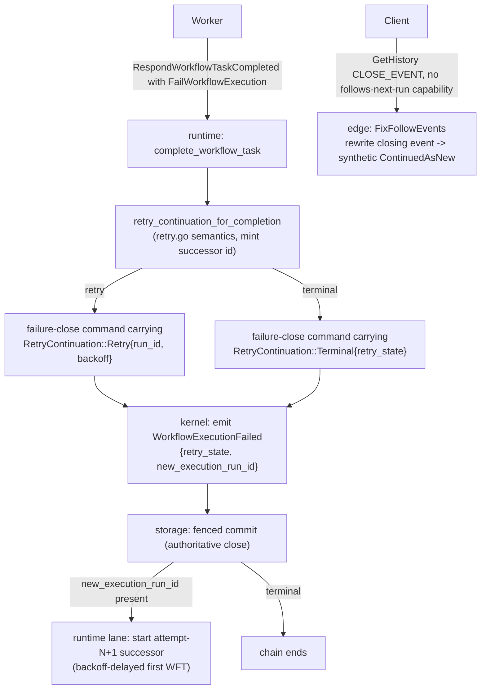

# Design Document: Workflow Retry Chain (Kernel + Runtime + Edge)

## Overview

This feature adopts Temporal's **workflow-retry-on-failure** into tokeira: a run started with a
`RetryPolicy` that fails closes as `Failed` carrying `new_execution_run_id`, and the runtime starts an
attempt-N+1 successor run linked into a retry chain.

Requirements: [requirements.md](./requirements.md). **Blocked on Requirement 0** — the owner must accept
the two kernel-touching changes (a persisted event-schema field and a failure-close continuation input),
an Architectural change per the AGENTS classification because it alters state/event format and adds a new
observable successor run. **Requirement 0 accepted 2026-07-02 (owner); command shape = dedicated
`WorkflowTaskCompletedWithRetry`.** Implementation may proceed.

Ground truth is v1.31.0 (`TEMPORAL_SERVER_COMPAT`), read from the local `../temporal` checkout and the
vendored protos (AGENTS §8). Tokeira's implementation stays original — this adopts the observable
contract, not Temporal's Go structures.

### The gap in one picture

Tokeira today, FailWorkflow during WFT completion (`kernel.rs:3166`):

```
tokeira today                                v1.31.0 (required)
WorkflowExecutionFailed {                    WorkflowExecutionFailed {
  retry_state = InProgress                     retry_state = InProgress | MaximumAttemptsReached
                if retry_policy.is_some()                    | NonRetryableFailure | RetryPolicyNotSet
  // no new_execution_run_id field             new_execution_run_id = Some(R) when retrying, else None
}                                            }
// run closes; nothing else                  + attempt-N+1 successor run R starts (backoff-delayed WFT)
```

The retry outcome is hardcoded and no successor is started. This is why a retry test hangs: the corpus
helper reads the failed run, then polls for the successor run that never starts.

### Why the kernel pieces are minimal, and pure

The event-schema field has a direct in-kernel precedent: `WorkflowExecutionTimedOut` already carries
`new_execution_run_id: Option<RunId>` (`event.rs:130`). The failure-close continuation mirrors the
existing `CronContinuation` path (`Command::WorkflowTaskCompletedWithCron` +
`cron_continuation_for_completion`). Both changes are pure state-machine logic — the kernel *records* a
runtime-computed decision and *authors* the event; it performs no I/O, evaluates no backoff, and starts
no run. The retry *evaluation* (`retry.go` semantics) and *successor start* live in `tokeira-runtime`,
honouring kernel purity (AGENTS §2) and the "history is authority; dispatch/successor is a derived
effect" model.

### Ground-truth anchors

- FailWorkflow event authoring + successor id: `workflow_task_completed_handler.go:788-798 @ v1.31.0`.
- Retry decision + backoff: `service/history/workflow/retry.go:32-116`,
  `mutable_state_impl.go:1630-1649 @ v1.31.0`.
- Successor chain fields: `retry.go:307-310 @ v1.31.0`.
- Start-time defaults: `common/retrypolicy/retry_policy.go:32-67` via `workflow_handler.go:6600 @ v1.31.0`.
- CLOSE_EVENT chain-following: `service/history/api/get_history_util.go:556-616 @ v1.31.0`; corpus
  helper `tests/testcore/functional_test_base.go:588`.
- tokeira sites: `kernel.rs:3166` (FailWorkflow arm), `event.rs:548` (`WorkflowExecutionFailed`),
  `event.rs:130` (`WorkflowExecutionTimedOut` field precedent), `workflow_task.rs:469`
  (`cron_continuation_for_completion`), `lane.rs` (continue-as-new/cron successor block).

## Architecture

Changes span three planes; only the first two touch the kernel.

- **Kernel (Req 1.1, 1.2):** add the `new_execution_run_id` field; replace the hardcoded failure-close
  `retry_state` with a recorded `RetryContinuation` decision.
- **Runtime (Req 2.1, 2.2):** compute the `RetryContinuation` (`retry_continuation_for_completion`) and,
  on a committed Failed-with-retry close, start the successor run (mirroring the continue-as-new block).
- **Edge (Req 3.1, 3.2):** apply workflow retry-policy defaults at start; implement `FixFollowEvents` for
  CLOSE_EVENT-filtered reads (the piece that actually stops the corpus hang).



## Components and Interfaces

### Kernel: `WorkflowExecutionFailed.new_execution_run_id` (Req 1.1)

Add `new_execution_run_id: Option<RunId>` (annotated `#[serde(default)]`) to the
`HistoryEventKind::WorkflowExecutionFailed` variant (`event.rs:548`), exactly mirroring
`WorkflowExecutionTimedOut` (`event.rs:130`). `Some` only when retry continues. `#[serde(default)]`
keeps prior transition-log records readable (they deserialize to `None`).

### Kernel: failure-close records a `RetryContinuation` (Req 1.2)

The failure-close arm (`kernel.rs:3166-3170`) stops hardcoding `retry_state`. It records the
runtime-supplied decision:

```
match retry_continuation {
    Retry { new_run_id, .. } =>
        emit WorkflowExecutionFailed { retry_state: InProgress,
                                       new_execution_run_id: Some(new_run_id), .. }
    Terminal { retry_state } =>   // MaximumAttemptsReached | NonRetryableFailure | RetryPolicyNotSet
        emit WorkflowExecutionFailed { retry_state, new_execution_run_id: None, .. }
}
```

WHY comment to carry: the retry decision is computed in the runtime (backoff/expiration/non-retryable are
not pure kernel concerns and depend on wall-clock and policy evaluation); the kernel only records the
outcome and authors the event, so replay reconstructs the same close deterministically.

### Command shape (design decision)

Three viable shapes carry the `RetryContinuation` into the kernel:

- (a) A dedicated `Command::WorkflowTaskCompletedWithRetry { request, retry_continuation }` parallel to
  the existing `WorkflowTaskCompletedWithCron`.
- (b) A `retry_continuation` field added beside `cron_continuation` on a completion command.
- (c) A unified `CompletionContinuation { None, Cron(..), Retry(..) }` on a single
  `WorkflowTaskCompleted`, folding the existing cron variant into it.

**Decision (accepted 2026-07-02): (a) — a dedicated `WorkflowTaskCompletedWithRetry` command.** It
mirrors the blessed cron precedent exactly and leaves the working cron command untouched (smallest blast
radius) — the same reasoning the event-buffering spec used to justify a dedicated command over polluting
an existing path. **The runtime owns retry-vs-cron precedence**: it evaluates retry first (`retry.go`),
and only if retry does not apply does it consider cron, then selects the corresponding command. Because
the two are mutually exclusive per completion, the kernel never needs to see both. Option (c) (a unified
`CompletionContinuation` enum) was considered as a cleaner long-term consolidation but declined for this
landing to keep the cron path untouched; it remains available as a later refactor (tracked in Out of
Scope).

> Precedence WHY: a workflow may carry both a cron schedule and a retry policy; v1.31.0 evaluates retry
> before cron on failure. Keeping precedence in the runtime (which already computes both continuations)
> means the kernel records exactly one, and the mutual-exclusion invariant is a runtime property, not a
> kernel branch.

### Runtime: `retry_continuation_for_completion` (Req 2.1)

Mirrors `cron_continuation_for_completion` (`workflow_task.rs:469`). Invoked when a WFT completion
carries a `FailWorkflowExecution` command. Evaluates, per `retry.go:32-116` /
`mutable_state_impl.go:1630-1649 @ v1.31.0`:

1. failure type ∈ `NonRetryableErrorTypes` → `Terminal(NonRetryableFailure)`.
2. `MaximumAttempts > 0 && attempt >= MaximumAttempts` → `Terminal(MaximumAttemptsReached)`.
3. workflow-execution-expiration exceeded → `Terminal(_)` (per retry.go).
4. otherwise → `Retry { new_run_id: mint(), backoff: InitialInterval × Coefficient^(attempt-1) capped by
   MaximumInterval }`.

The minted `new_run_id` and backoff flow into the failure-close command (shape (a)).

### Runtime: successor start (Req 2.2)

On a committed Failed close whose event carries `new_execution_run_id`, the lane starts the successor,
mirroring the continue-as-new / cron successor block in `lane.rs` (validated by the existing
`run_activation_submits_continue_as_new_successor_with_chain_fields` test):

- `workflow_id`, `workflow_type`, `task_queue`, `input`, `retry_policy`, timeouts: inherited.
- `attempt = predecessor.attempt + 1`; `continued_execution_run_id = Some(predecessor)`;
  `first_execution_run_id` / `first_run_started_at`: inherited; `continued_failure` = close failure.
- First WFT delayed by the computed backoff (successor starts in backoff state).
- If the successor start fails, the predecessor's committed Failed close is still returned (mirrors the
  existing "predecessor commit returned even when successor start fails" behaviour).

Idempotency (Req 5.1.3): the successor id is fixed by the predecessor's committed
`new_execution_run_id`, so a re-driven close does not mint a second successor.

### Edge: start-time `EnsureDefaults` (Req 3.1)

Apply v1.31.0 workflow retry-policy defaults at the start leg (edge translate): `InitialInterval` 1s,
`BackoffCoefficient` 2.0, `MaximumInterval` 100×`InitialInterval`, `MaximumAttempts` 0 (unlimited) unless
set (`retry_policy.go:32-67 @ v1.31.0`). Needed for the tests' backoff math. Activity-side `EnsureDefaults`
already landed and is not regressed.

### Edge: CLOSE_EVENT chain-following (Req 3.2)

`FixFollowEvents` (`get_history_util.go:556-616 @ v1.31.0`) rewrites the close event into a synthetic
`ContinuedAsNew` **only** for clients lacking the `FollowsNextRunID` capability. A capable client reads
`new_execution_run_id` off the real `WorkflowExecutionFailed` event (projected by the Phase-1 edge
serializer) and follows the chain to the started successor (Phase 2). The v1.31.0 corpus SDK is capable,
so the corpus follows the chain via the field — the earlier hang was the absent successor, not a missing
rewrite.

The legacy-client rewrite is **deferred**: tokeira's edge does not parse client `supported-features`, so
the `!FollowsNextRunID` guard cannot be evaluated, and an unconditional rewrite would be wrong for capable
clients (turning a `Failed` close into a `ContinuedAsNew`). It only affects pre-~Sept-2021 SDKs. Tracked
as a follow-up gated on edge client-capability plumbing.

## Data Models

- `HistoryEventKind::WorkflowExecutionFailed`: gains `new_execution_run_id: Option<RunId>`
  (`#[serde(default)]`).
- `RetryContinuation` (new runtime→kernel input): `Retry { new_run_id: RunId, backoff: Duration }` or
  `Terminal { retry_state: RetryState }`. Carried per the chosen command shape.
- No new `RetryState` variant (all required variants exist in `command.rs`).
- No `WorkflowState` field change: `retry_policy`, `attempt`, `first_execution_run_id`,
  `original_execution_run_id` already exist.

## Correctness Properties

*A property is a characteristic that should hold across all valid executions.*

- **P1 — Retry links a successor.** Retry-eligible FailWorkflow → `WorkflowExecutionFailed` with
  `InProgress` + `Some(new_execution_run_id)`. (Req 1.2, 4.2)
- **P2 — Max-attempts terminal.** At `MaximumAttempts` → `MaximumAttemptsReached` + `None`. (Req 4.1)
- **P3 — Non-retryable terminal.** Non-retryable type match → `NonRetryableFailure` + `None`. (Req 4.1)
- **P4 — No policy unchanged.** `retry_policy == None` → `RetryPolicyNotSet` + `None`. (Req 1.2)
- **P5 — Successor chain fields.** Successor `StartRequest` carries `attempt = N+1`,
  `continued_execution_run_id = predecessor`, inherited first-run fields, backoff-delayed WFT. (Req 2.2)
- **P6 — Event round-trip.** `WorkflowExecutionFailed` round-trips with/without the field; absent field
  → `None`. (Req 1.1)
- **Golden G1 — three-run chain.** The `tests/workflow_test.go:1440 @ v1.31.0` chain.

**Validates: Requirements 1.1, 1.2, 2.2, 4.1, 4.2, 5.1, P1–P6, G1.**

## Error Handling

No new `Reject` variants. The failure-close continuation reuses the existing WFT-completed fencing and
rejects. Runtime retry evaluation is total (always yields a `RetryContinuation`); a mint/start failure of
the successor is surfaced as today for continue-as-new (predecessor close returned; successor-start error
logged/retried by the lane), never leaving the predecessor un-closed. `FixFollowEvents` is a read-path
projection and cannot mutate state.

## Testing Strategy

### Property-Based Tests (proptest, `tokeira-kernel` + `tokeira-runtime`)

P1–P6 above, tagged `// Feature: workflow-retry-chain, Property N`, generating open `WorkflowState` with
varied `RetryPolicy`/`attempt` and failure types.

### Golden Transition Test

G1: the three-run retry chain (`tests/workflow_test.go:1440 @ v1.31.0`), asserting each attempt's 5-event
history and the run-id linkage.

### Conformance

After Req 1–3 land, remove the `TestWorkflowRetry` and `TestWorkflowRetryFailures` entries from the
fork's skip registry (`tests/testcore/tokeira_conformance_skip.go`) and confirm both go GREEN in the
harness. Until then they remain classified skips (Req 0.5).

### Documentation (Requirement 0.4)

On acceptance, document the retry chain: the `WorkflowExecutionFailed.new_execution_run_id` field and the
continuation model in the kernel architecture doc, and the runtime successor/backoff behaviour. Part of
the change, not a follow-up (AGENTS §9).
